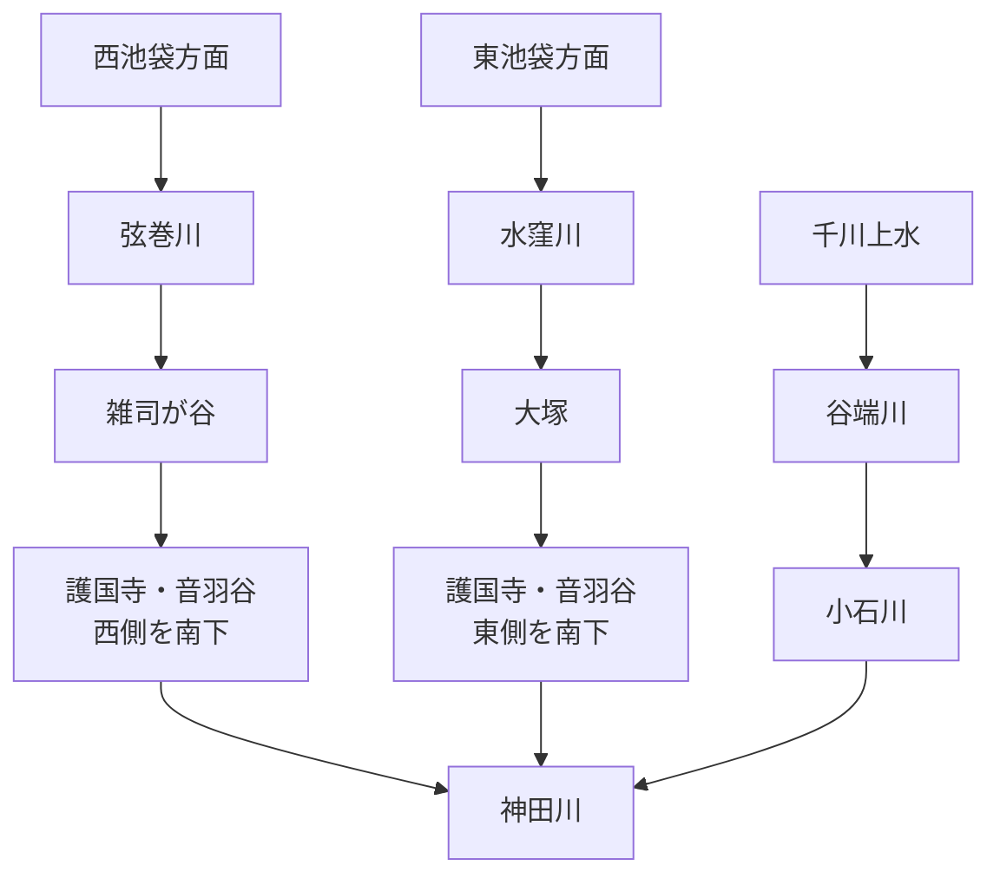
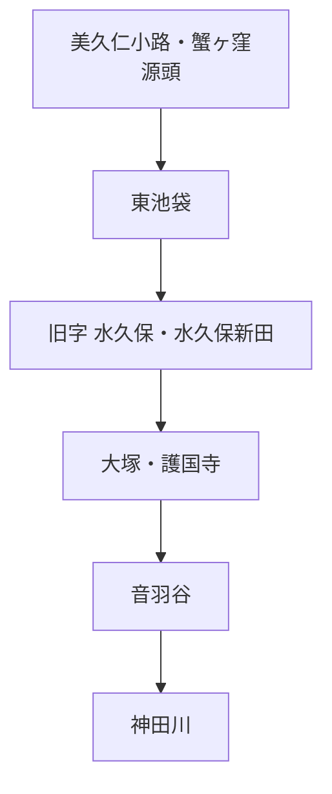
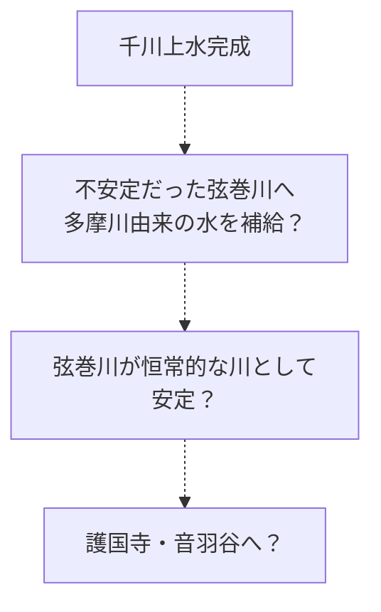
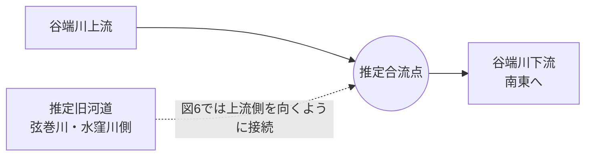
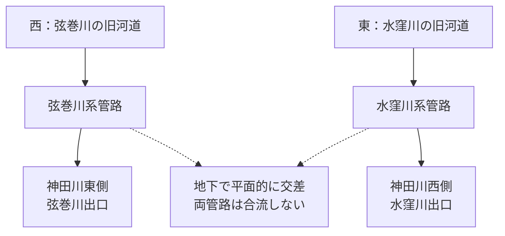
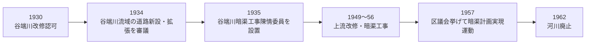
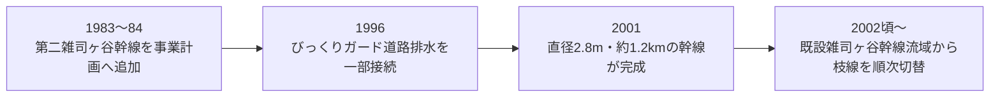
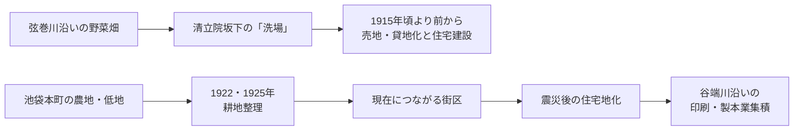
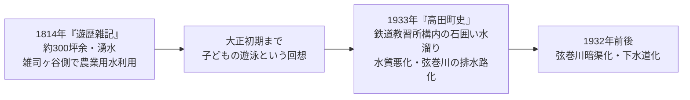

# otowa-ankyoscape

水窪川・弦巻川・谷端川と、その周辺の旧河道・暗渠・湧水・用水・土地利用について調べたことをまとめるリポジトリです。

中心となる範囲は、池袋・雑司が谷・護国寺・音羽・小日向・小石川です。

> [!IMPORTANT]
> この README では、**史料から確認できる事実**と、**地図の比較から得た観察**、**そこから立てた仮説**を分けています。
> 特に「弦巻川・水窪川は更新世に谷端川へ流れていたのか」「音羽通り西側の弦巻川はいつ成立したのか」は未解決です。

## 記号

- **〔確認〕** 一次史料、公的資料、測量図、複数の資料などからかなり確実に言えること
- **〔観察〕** 本調査で古地図・地形図・写真を比較して読み取ったこと
- **〔推定〕** 複数の事実からかなり自然に考えられるが、直接記録が未発見のこと
- **〔仮説〕** 検証中の説明
- **〔未解決〕** 現時点では判断できないこと

---

# 1. まず全体像

現在知られている大まかな水系は次のようになる。

ただし、この形が自然状態からずっと続いていたとは限らない。

現時点で重要なのは次の6点である。

1. **水窪川は護国寺創建以前の1682年の江戸図にも描かれている。** 一方、同じ図では弦巻川を確認できない。ただし江戸図では小河川の省略が実際にあるため、「描かれていない＝存在しない」とは断定できない。〔観察〕[S14][S15]
2. **1772年の『武蔵国豊島郡雑司谷村絵図』が現存し、豊島区立郷土資料館が複製を刊行している。** 地域史資料では、この絵図に当時の弦巻川の川筋が描かれていると紹介されている。これが原図・高精細複製で確認できれば、雑司ヶ谷側の弦巻川について1853年より約80年早い直接的な絵図史料になる。現時点では画像そのものの高精細確認を未実施なので、川筋の細部は要再検証。〔史料所在確認／要画像検証〕[S31][S32]
3. **1851年の近吾堂系切絵図では、弦巻川とみられる青い水路が護国寺南西端へ来て、道路を横断し、寺域の外まで短く続いている。** 「護国寺境内で消滅していた」とは読めない。〔観察〕[S16]
4. 本田創は、**1681年の護国寺創建を契機として、音羽町の東西の崖下に水窪川・弦巻川が並ぶよう「整備された」**と説明している。ただし、整備前の正確な流路や工事の完成年までは示していない。〔確認〕[S02][B02]
5. 1941年の郷土教育資料には、音羽谷の二流について、**水田開発時に灌漑のため二流に分けられたのではないか**という趣旨の推測がある。これは当時の工事記録ではなく、後世の地理的推論として扱う必要がある。〔確認／史料中の推測〕[B03]
6. 深田地質研究所の2019年論文は、弦巻川・水窪川上流の「高い河床」が更新世の旧河道で、**お茶の水女子大学付近を経て谷端川へ注いでいた可能性**を提示している。ただし著者自身が「考えられる一例」としており、図の合流角・流向にも疑問が残る。〔仮説〕[S01]

---

# 2. 川ごとの概要

## 2.1 水窪川

### 名前

豊島区の資料によれば、水窪川は旧・東池袋4丁目付近の字名 **「水久保」** にちなみ、「水久保川」「日の出川」とも呼ばれた。近世地誌『御府内備考』には **「鼠ヶ谷下水」** の記載もある。川幅は一間ほどの小流だったとされる。〔確認〕[S03]

『東京「暗渠」散歩 改訂版』では、上流部を「日の出川」、下流側を「音羽川」とする呼称も紹介されている。また江戸期の呼称として「東青柳下水」も紹介されている。〔書籍資料〕[B01]

### 源流と「水久保」は別地点

水窪川の源頭は、現在の池袋東口・**美久仁小路**付近、旧「蟹ヶ窪」の浅い窪地とされる。[S02]

一方、川名の由来になった旧字「水久保」は現在の東池袋4丁目付近で、美久仁小路とは少し離れている。[S03]

したがって、

という関係であり、「水久保＝源泉地点」ではない。

### 護国寺・豊島岡の湧水系

護国寺東側の豊島岡墓地には **蛇池** という湧水池があり、かつてはそこから流れ出した水が護国寺境内の2つの湧水池へつながり、さらに水窪川へ注いでいたとされる。境内の流れに架かっていた石橋は音羽富士の麓に保存されている。小日向台の崖下には現在も湧水が見られる。〔確認〕[S02]

このことから、水窪川の東側流路は単なる人工排水路ではなく、**小日向台・豊島岡側の湧水を集める自然な水系を基礎にしていた**と考えられる。〔推定〕

### 1682年の江戸図

護国寺創建翌年の天和2年（1682）の異なる江戸図2点では、護国寺周辺に水窪川とみられる水路が描かれている一方、弦巻川は確認できない。〔観察〕[S14][S15]

また、水窪川沿いには「田」が見られる一方、谷の中央～西側には「畑」が多く描かれているように見える。これは後世の「灌漑のため二流に分けた」という説を考えるうえで興味深いが、江戸図は実測図ではないため土地利用の細部まで断定しない。

### 暗渠化と、1986年の「水窪川」記憶表示

豊島区の資料は、水窪川について **「昭和初期から戦後にかけて下水化」** されたとする。したがって、水窪川全体がある1年に一斉に暗渠化されたとは現在の資料からは言えない。〔確認〕[S03]

さらに豊島区のオーラルヒストリー「わが街ひすとりぃ 日出」現地ロケ編では、旧流路付近の辻広場を歩きながら、住民が小川状の施設を指して「これは下水管に繋がってる」と説明し、現地の案内板に **「水窪川　小さな川が流れていた　後世に伝える」** と書かれていること、表示が **1986年** のものだと確認している。〔確認／オーラルヒストリー〕[S33]

同じ証言では、辻広場の整備時期について「60年半ば頃」と回想している。文脈上は昭和60年前後を指す可能性が高いが、記憶に基づく証言なので施工年の確定には公園・まちづくり記録が必要である。一方、1986年の案内表示は、**暗渠化後も旧水窪川筋を地域の公共空間として可視化し、川の記憶を残そうとした具体的な時点**として使える。[S33]

---

## 2.2 弦巻川

### 名前・上流

『東京「暗渠」散歩 改訂版』では、弦巻川上流部は **「布引川」** とも呼ばれたとされる。[B01]

雑司ヶ谷霊園西側から本流へ注ぐ支谷もあり、現在も地形・水路敷から追うことができる。Natrium の現地調査では、護国寺西側で本流が鬼子母神方面から、支流が雑司ヶ谷霊園方面から来る地形が確認されている。〔確認／現地調査〕[S05]

### 丸池：豊島区が明記する水源

豊島区公式「元池袋史跡公園」は、現在の西池袋1-9-12付近にあった **丸池** について、「弦巻川の源流として清らかな水が湧き出していました」と明記している。丸池は池袋という地名の由来ともいわれ、旧「元池袋公園」は下水道工事に伴う土地交換を経て、1998年に現在地の元池袋史跡公園として開園した。〔確認〕[S26]

また豊島区史平成編は、池袋西口公園の「GLOBAL RING」の意匠について、弦巻川の水源だった丸池を意匠の題材にしたものと説明している。[S27]

これは、弦巻川上流の水源を「西池袋方面」とだけ捉えるより具体的な公的根拠になる。一方、丸池から護国寺までの途中で、どの支谷・湧水がどれだけ本流へ加わったかは別に検証する必要がある。

### 1772年の雑司谷村絵図：弦巻川の確認年代を大きく遡れる可能性

豊島区立郷土資料館が刊行する「豊島区地域地図 第5集（近世・村絵図I編）」には、**明和9年（1772）の『武蔵国豊島郡雑司谷村絵図』** が収録されている。豊島区公式の刊行物一覧と国立国会図書館の書誌情報から、原図が存在し、1992年に複製・読みおこし参考図が刊行されたことを確認できる。〔確認〕[S31]

地域史の解説では、この絵図について **当時の弦巻川の川筋が描かれている** と紹介されている。[S32]

これは重要である。もし原図・複製の高精細画像で川筋を直接確認できれば、現在 README で強い根拠としている1853年の村方資料より約80年前、**少なくとも1772年には雑司ヶ谷側の弦巻川が絵図上に存在した**ことを示せる。

ただし現在は、公開ウェブ上で高精細な絵図全体を直接読めていない。したがって、現段階では **〔史料所在確認／二次資料による川筋記述、要画像検証〕** とする。特に、描かれた川が現在「弦巻川」と呼ぶ流路のどの区間まで連続するか、護国寺南西端や音羽谷西側まで伸びるかは未確認である。[S31][S32]

### 1853年の橋の記録

嘉永6年（1853）の雑司ヶ谷村の村方資料には、弦巻川に架かる複数の橋が列挙される。調査中に確認した名称には、卒塔婆橋・鎌倉橋・木村橋・南坂橋・丸太を渡した簡易な橋・弦巻橋・松屋橋・境橋などがある。〔史料確認〕[B04]

この資料は **1853年には雑司ヶ谷側に明確な弦巻川が存在した**ことの根拠として強い。一方、村方資料なので、護国寺より南、音羽町西側の下流河道が神田川まで存在したことを直接証明する資料としては弱い。

### 1851年の護国寺南西端

近吾堂系『音羽目白雑司ヶ谷辺絵図』（題簽『改正 雑司ヶ谷音羽辺図』、嘉永4年＝1851）を国書データベース・台東区立図書館所蔵画像で確認した。[S16]

〔観察〕

- 西側から来た青い水路が護国寺南西端へ達する。
- 水路は護国寺の南西端を短く横切るように見える。
- 道路との交差部には、水色で幅広く描かれた橋・水路施設らしい記号がある。
- 高精細画像では、その施設の下流側にも細い青線が続き、寺域の外へ出ている。
- その先では道・町割りの線と重なるようになり、どこまで続くかを切絵図だけでは追えない。

このため、以前考えていた「弦巻川は護国寺境内に入り、そこで終わって水窪川へ合流した」という読みは弱くなった。

一方、**この図だけで1851年に音羽町西側の水路が神田川まで連続していたとも断定できない。**

### 尾張屋版との描写差

尾張屋系の『嘉永新鐫雑司ケ谷音羽絵図』には1850年代の複数版がある。東京都立図書館は安政4年（1857）改訂版を公開している。[S17]

〔観察〕尾張屋版でも護国寺南西端の橋・水路施設らしい部分は描かれているが、近吾堂版で見える下流側の短い青線は省略されているように見える。

これは重要で、**切絵図で川が描かれていないことが、そのまま川の不存在を意味しない**例になる。1682年図の弦巻川不掲載も同じ注意が必要である。

### 護国寺南西端の橋は長期間ほぼ同位置にあった可能性

〔観察〕東京時層地図で、1851年切絵図の橋・水路施設に近い位置（調査時の重ね合わせではおおよそ `35.719084, 139.724790`）を確認すると、「文明開化期」「関東地震直前」の地図にも、かなり近い位置で道路が弦巻川を横断している。[M02]

このことから、1851年図で異様に幅広く描かれる部分は、地下合流口よりも **橋、または橋に付随する小さな堰・溜まり・横断施設** と考える方が現在は自然である。機能・橋名は未確定。

### 暗渠化と流路付け替え

弦巻川は昭和7年（1932）に暗渠化されたとされる。さらに、中流部では暗渠化に際して流路そのものが弦巻通り側へ付け替えられた。したがって、現在の弦巻通りは必ずしも暗渠化前の自然河道そのものではない。〔確認〕[S04][S05]

現在も住宅の裏、区境、不自然な細道などに旧流路の痕跡が残る。[S05][S07]

### 首都高速との位置関係

「弦巻川は首都高速5号池袋線の下を流れていた」と大まかに説明されることがあるが、実際には区間ごとに位置が違う。[S05][S25]

Natrium の現地調査では、

- 高速下・高速西側と重なるような区間
- 高速方向から斜めに出る区間
- **音羽児童遊園付近で高速の東側に残る水路敷**

などが確認される。[S05]

したがって「全区間が高速の真下」「全区間が高速の東側」のどちらも正確ではない。

### 音羽児童遊園付近の水路敷と立入禁止

2010年の「東京の水 2009 fragments」では、高速沿いの未舗装の水路敷に入り、崖からの湧水を撮影した記録がある。[S06]

一方、本調査で確認した2021年2月23日公開の現地写真では、黒い柵が設置され「入れない」と記録されている。2024年の Natrium の記録でも「立ち入ることができない水路敷」とされる。[S05]

したがって、**少なくとも2010年の記録後～2021年2月までの間に、当該地点は物理的に入れない状態になった**と考えられる。正確な閉鎖時期は未確認。

---

## 2.3 谷端川

### 水源と流れ

谷端川は要町の粟島神社境内にある弁天池の湧水を水源とし、椎名町方面へ南下したあとU字状に大きく向きを変え、板橋・大塚・小石川を経て神田川へ流れた約11 kmの河川である。[S09][S10]

大塚以南では **小石川・礫川** と呼ばれ、資料・地域によって **氷川** などの名も使われたとされる。[B01][S10]

### 千川上水との関係

谷端川は千川上水から実際に分水を受けていた。

練馬区の資料によれば、要町3丁目付近から南東へ分かれる **「長崎村外三村分水」** が、粟島神社の池を水源とする谷端川へ接続していた。明治10年の文書では「長崎村、中丸村、池袋村、金井窪村四ケ村用水」と記される。〔確認〕[S11]

これは、後述する「千川上水が弦巻川・水窪川へ直接補水したのか」という問題と区別する必要がある。**千川上水 → 谷端川は史料で確認できる。千川上水 → 弦巻川・水窪川の直接分水は、現時点では経路・取水口を確認できていない。**

### 1895年：巣鴨新田の水車設立願は不許可

豊島区の公式区史年表には、明治28年（1895）4月23日、小石川区掃除町23の宇野伊兵衛が **巣鴨村大字巣鴨字新田928の谷端川に新規水車を設立するため、東京府知事へ願い出たが、巣鴨村・巣鴨町の地主の反対で不許可となった** と記録されている。〔確認〕[S34]

したがって、この件は「水車が存在した」ことを示すものではなく、**1895年の谷端川で水力利用を目的とする具体的な設置計画があり、その計画が地元地主の反対によって実現しなかった**ことを示す。番地まで記録されているため、地租改正地引絵図・地籍資料などと突き合わせれば、計画地点をかなり具体的に絞れる可能性がある。一方、地主が反対した理由が堰上げ・灌漑・排水・水利権・土地利用のどれにあったのかは、年表だけでは分からない。年表の典拠は **『豊島区史 資料編四』127～130頁相当（年表表記「資4-127～30」）** であり、原史料・翻刻本文を確認する価値が高い。[S34]

### 暗渠化は一度ではなく、改修・暗渠化が段階的に進んだ

従来この README では、1928年の下流部暗渠化議決、1934年の下流約3,272 m竣工、1962年の河川廃止、1964年までの全線下水道化という大枠だけを書いていた。[S10]

豊島区の公式区史年表を確認すると、上流側ではさらに細かな工事が続いている。〔確認〕[S28]

- 1930年8月8日：神田上水と谷端川の改修工事が認可・閣議決定。
- 1935年4月13日：豊島区会に「谷端川暗渠工事陳情委員」が置かれている。
- 1949年3月16日：椎名町駅付近の曲折部改修が完成。
- 1949年4月：要町2丁目3番地先～25番地先、185 mの上流改修が竣工。
- 1951年5月20日：椎名町駅より下流、武蔵野鉄道横断までの区間の改修工事が竣工。
- 1956年3月：千早町2-1～長崎2-6の支流310 mと、要町1-5～15番地の約125 mで暗渠工事が完成。
- 1957年10月29日：区議会全員協議会が谷端川暗渠計画実現のための運動を決定。
- 1958年9月26日：狩野川台風で、主として谷端川流域約150万 m²が浸水し、区内浸水家屋は7,000戸と記録される。
- 1964年：区広報には「谷端川の浚渫工事約600 m施工」とある。
- 1965年3月：大明小学校PTAが、谷端川暗渠上を児童公園として開放するよう署名運動を開始。

これを見ると、谷端川の都市河川化・暗渠化は「1934年に一気に終了」したものではなく、下流の大規模工事の後も、上流・支流の改修、治水、暗渠化、暗渠上部利用が数十年にわたり段階的に進んだことが分かる。[S28]

なお、1964年の「浚渫」が開渠の河床浚渫を意味するのか、暗渠・水路内部の清掃を含む表現なのかは年表だけでは判別できない。そのため、**「1964年までに全区間が完全に暗渠化済み」とする表現は、区間別工事記録を確認するまで留保する。** [S10][S28]

### 河川廃止後：暗渠上は段階的に児童遊園・緑道へ転用された

豊島区の谷端川南緑道・北緑道の公式説明は、谷端川が **1962年に河川として廃止され、暗渠の下水道幹線として使用されるようになった** と明記している。〔確認〕[S35][S36]

南側について、豊島区の施設説明は、都下水道局からの承認を受けて **1966年に谷端川第1～第3児童遊園として開放**し、1967年に第4児童遊園、1980年に遊歩道として順次開放したとする。[S35] 一方、豊島区史年表は『公共施設等の概要』を典拠に、**1967年1月10日に谷端川第1～第3児童遊園を「開設」**、**同年12月3日に第4児童遊園を「開設」**したと記録している。〔確認／公的資料間の年次差〕[S48] 1966年の「承認を受け開放」と1967年1月10日の「開設」が、実質供用と正式な施設開設など行政手続上の段階差を表すのか、単なる年次整理の差なのかは現時点では確定できない。その後、1983年から施設改修が始まり、1990年に整備を終え、西武池袋線～川越街道の区間が現在の谷端川南緑道となった。公式施設情報上の開園は1991年4月である。[S35]

北側では、**1971年に谷端川第5児童遊園・遊歩道として開放**され、1990年の改修を経て、西前橋～東武東上線下板橋駅前の区間が谷端川北緑道となった。こちらも公式施設情報上の開園は1991年4月である。[S36]

これは、1965年の大明小学校PTAによる暗渠上公園化の署名運動[S28]の直後から、少なくとも南側では実際の公共空間化が始まったことを示す。なお、児童遊園・緑道の開放年代は **暗渠内部の工事完了年代そのものではない** ので、河道の暗渠化年と上部利用開始年は分けて扱う。

### 谷端川水源地付近の環境変遷を直接扱う研究がある

豊島区立郷土資料館の研究紀要『生活と文化』第24号には、甲田篤郎・斉藤崇人・辻本崇夫「**谷端川水源地付近における更新世後期以降の環境変遷と土地利用**」が掲載されている。CiNiiでは第24号、pp.134–100として書誌を確認でき、豊島区公式の紀要一覧でも掲載を確認できる。〔史料所在確認〕[S37]

さらに2016年2月20日の豊島ミュージアム講座では、甲田篤郎が「**谷端川水源地付近の変遷を探る～新館建設予定地（千早二）の発掘調査から～**」と題して講演している。〔確認〕[S38]

現時点では論文本文をオンラインで確認できていないため、地層・古環境・土地利用について具体的な結論はまだ README に採用しない。ただし、**谷端川源頭部の千早二丁目周辺について、更新世後期以降の環境変遷と発掘調査を直接扱う資料が存在する**こと自体は、更新世旧河道説や水源地の土地利用史を検証するうえで重要である。

### 現在の下水道幹線は治水・貯留施設としても使われている

2001年の東京都議会公営企業委員会では、**谷端川一号幹線**について、西池袋5丁目地先～池袋4丁目地先の約1,600 mを利用して約32,000 tを暫定貯留し、同年5月から貯留を開始する予定だと下水道局が答弁している。さらに川越街道より下流側では、主要枝線の計画内径を2,200 mmから3,000 mmへ増径する計画変更が説明されている。〔確認〕[S39]

2016年の東京都議会資料では、下板橋駅付近で **谷端川幹線のボックスカルバートが浅い位置に埋設**され、都市計画道路補助73号線のアンダーパス整備には幹線の移設が必要と説明されている。〔確認〕[S40]

これらは旧河道そのものの形を示す資料ではないが、**谷端川の名を引き継ぐ下水道幹線が、現在の都市基盤・浸水対策の一部として具体的な断面・貯留機能を持っている**ことを確認できる。現在管路と旧自然河道の一致は別途、下水道台帳と旧版地図で検証する必要がある。

### 橋跡を体系的に調べた冊子がある

豊島区の資料目録には、郷土資料館友の会が1999年12月に **『旧谷端川の橋の跡を探る』** を発行した記録がある。2000年1月21日付の区プレスリリースでも紹介されている。〔確認〕[S29]

現時点では冊子本文をオンラインで確認できていないが、谷端川の橋名・位置・旧河道を対応させるための重要な二次資料候補である。入手できれば、橋の位置を地図上に落とす作業に使える可能性が高い。

### 池袋モンパルナス

谷端川沿いには戦前のアトリエ群があり、豊島区は現在も **「谷端川アトリエ群跡」**（西池袋4丁目28付近）を池袋モンパルナス関連地として紹介している。[S12]

としま未来文化財団の街歩きでも、粟島神社の谷端川跡から、すずめが丘・つつじが丘・さくらが丘などのアトリエ村跡を巡る経路が設定されている。[S13]

---

# 3. 千川上水との関係

千川上水は元禄9年（1696）、玉川上水から分水して本郷・下谷・浅草方面へ給水するため開削された。1707年には沿線20か村の農民が田へ水を引くことも許された。〔確認〕[S08]

ここから一時、次の仮説を考えた。

周辺の小河川に上水の余水を加えること自体は十分ありうる。しかし、現時点で史料上確認できるのは **千川上水から谷端川への分水** である。[S11]

千川上水と弦巻川・水窪川の間には谷端川の水系があり、直接送水したとするなら、その分水路・樋・取水口などの具体的証拠が必要になる。

したがって現在は、

- **〔確認〕千川上水 → 谷端川**
- **〔未確認〕千川上水 → 弦巻川**
- **〔未確認〕千川上水 → 水窪川**

として扱う。

今後調べるべき一次資料として、1696～1884年の上水管理文書・絵図を含む **千川家文書** がある。[S19]

---

# 4. 更新世には谷端川水系だったのか

深田地質研究所の滝口志郎「武蔵野台地の地形に関する諸問題」（2019）は、弦巻川の流路変遷について興味深い説を提示している。[S01]

論文の要点は次のとおり。

- 弦巻川・水窪川の上流は非常に浅い谷である。
- 護国寺より下流では谷が急に深くなる。
- 上流の「高い河床」と下流の「低い河床」は高さが不連続である。
- 高い河床を更新世の河道とみなすと、お茶の水女子大学の敷地付近が旧河道だった可能性が高い。
- 一例として、弦巻川・水窪川が東へ向かい、谷端川へ注いでいた流路を図示している。

ただし非常に重要な留保がある。

論文自身が、これらを「学会レベルで現在問題になっている事項」や新たな実証成果としてではなく、既存知見をもとにした個人的な考察として提示している。[S01]

さらに〔観察〕図6を現在の谷端川の流向と比べると、お茶の水女子大学付近の推定流路は、谷端川へ **上流側を向くような角度** で接続しているように見える。

このため、

- 弦巻川・水窪川 → 谷端川だった
- 逆に、現在の谷端川側の古い谷から護国寺方面へ流れていた
- 途中に分水界があった
- 河川争奪・流路逆転があった
- 図6は接続関係だけを示す概略図で、合流角は厳密でない

など複数の可能性が残る。

**「谷筋がつながっていた可能性」と「水がどちら向きに流れたか」は別問題**である。

また「弦巻川上流こそ谷端川本流の延長だったのではないか」という案も考えられるが、本流・支流を判定するための当時の流域面積・河床勾配・堆積物の連続などは現在確認できていない。

谷端川側には、豊島区立郷土資料館の研究紀要に「谷端川水源地付近における更新世後期以降の環境変遷と土地利用」という専論があり、千早二丁目の発掘調査に関連する講座も行われている。[S37][S38] 本文を入手できれば、谷端川源頭側の地層・古環境を使ってこの仮説を検証できる可能性があるが、現時点では論文の結論を未確認なので根拠にはまだ加えない。

---

# 5. 最大の未解決問題：音羽通り西側の弦巻川はいつできたか

一見すると一番新しい人工改変のはずなのに、成立年代が最も曖昧である。

## 5.1 1681年：護国寺創建

本田創は、護国寺創建をきっかけとして、江戸川橋から護国寺への直線参道と音羽町が造られ、その際に **東側の水窪川と西側の弦巻川が町の裏手・谷の両端の崖下へ並行する流れとして整備された**と説明している。[S02][B02]

ただし、これは「1681年に西側水路が完成した」という工事記録ではない。整備前の川筋も示されていない。

## 5.2 1682年：水窪川だけが見える

護国寺創建翌年の江戸図2点では、水窪川とみられる水路が描かれる一方、弦巻川は確認できない。〔観察〕[S14][S15]

ここから、

> 1682年には音羽谷西側の弦巻川がまだなかった／安定した川でなかった

という仮説を立てられる。

しかし、後述する1850年代の切絵図では、存在が別資料で確実な弦巻川も途中が省略される。そのため、**「1682年図にない」ことだけでは不存在を証明できない。**

## 5.3 1772年：雑司ヶ谷側には弦巻川が描かれている可能性

明和9年（1772）の『武蔵国豊島郡雑司谷村絵図』が現存し、豊島区立郷土資料館から複製・読みおこし参考図が刊行されている。[S31]

地域史資料では、この絵図に弦巻川の川筋が描かれていると紹介されている。[S32]

これが原図で確認できれば、**1682年には広域江戸図で確認できなかった弦巻川が、遅くとも1772年には雑司ヶ谷村の詳細絵図に現れる**ことになる。これは「弦巻川そのものが幕末まで存在しなかった」という案をかなり弱める。

ただし、この1772年図が証明できるのはまず雑司ヶ谷側の川筋であり、最大の未解決問題である **音羽通り西側の下流河道が同時点で神田川方向へ連続していたか** は別問題である。高精細画像で護国寺方向の末端を直接確認する必要がある。

## 5.4 水田開発・灌漑説

1941年の『「郷土の観察」の指導体系』には、音羽谷の川はもとは一流で、水田への開発時に灌漑目的で二流に分けられたのではないか、という趣旨の考察がある。[B03]

1682年図ですでに「田」があるため一見矛盾する。しかし、図を読むと水窪川沿いに田が集中し、中央～西側には畑が多いように見える。〔観察〕

したがって、ここでいう「水田開発」を、谷で最初に水田ができた時ではなく、**後に畑を水田へ転換し、灌漑範囲を拡張した時**と解釈する余地がある。

田柄川などでは、既存河川とは別に細い並行水路を設けて両側から耕地へ水を配る例がある、という指摘も受けた。これは「そういう工事が可能だった」ことの類例であり、音羽で同じ工事があった直接証拠ではない。

## 5.5 1851年：少なくとも護国寺南西端から先へ水は続く

前述の通り、近吾堂版では弦巻川が護国寺南西端を横切り、その先へ短く続く。[S16]

したがって、

> 幕末まで弦巻川は護国寺内で終わり、明治になって初めて西側水路が掘られた

という単純な案は現在かなり弱くなっている。

ただし、1851年の短い線の先が、

- そのまま音羽町西側を神田川まで南下するのか
- どこかで水窪川へ接続するのか

は切絵図だけでは決められない。

## 5.6 明治期には東西二流が明瞭

明治期の実測図になると、音羽谷の東西に水窪川・弦巻川が並ぶ姿を明瞭に追える。〔観察〕[S06][S18]

したがって成立年代を突き止めるには、**1682～明治初期の間で、西側水路を明瞭に描いた最古の一次資料を探す**必要がある。

### 現在の候補

1. **1681年前後の護国寺・音羽町造成時に成立**
2. その後の水田拡張・灌漑再編時に成立
3. 既存の小水路を段階的に拡幅し、後から「弦巻川下流」と認識されるようになった

現状では1を支持する近代の解説があるが、工事年を確定する一次史料はまだ見つかっていない。

---

# 6. 音羽谷の東側に水窪川がある理由

「自然河川なら谷の中央を流れそうなのに、なぜ水窪川は東端の崖下なのか」という疑問がある。

現在考えられるのは、単一原因ではなく次の組み合わせである。

- 小日向台・豊島岡側の崖下には湧水が多く、蛇池・護国寺湧水池・現在まで残る湧水がある。[S02]
- 1681年の護国寺・音羽町造成時に、川が町裏の崖下へ沿うよう整理されたとされる。[S02]
- 谷底を田畑・町として利用する際、河川を縁へ固定することには土地利用上の利点がある。

したがって、**自然の崖下湧水系を基礎にしつつ、近世の造成・灌漑・排水によって位置が固定・整形された**という説明が現在は最も無理が少ない。

---

# 7. 明治～大正期の細かな発見

## 7.1 久世山から見た水窪川らしき流れ

「久世山より早稲田を望む（THE WASEDA FROM KUSEYAMA）」という絵葉書について、明治43年（1910）と読める消印を持つ個体が紹介されている。写真前景の久世山崖下に、水窪川とみられる細長い水路・低地が写っている可能性がある。〔要再検証〕[M03]

1896年の地図との位置関係は合うが、写真解像度だけで水面そのものを確定するのは難しいため、写真資料としては保留する。

## 7.2 現在の講談社付近にあった池

〔観察〕1909年1万分1地形図で、現在の講談社付近に **弦巻川と接続するように見える小池** を確認した。[M01]

- 1909年：池あり
- 1921～22年：池あり
- 1928～39年の地図：池は消滅

現在の講談社から裏手の高台にかけては、明治期に山田顕義の音羽邸があり、約2万坪とされる。音羽の洋館は1890年竣工。[S20]

講談社の社史では、野間清治が1921年7月10日に団子坂から音羽へ住居を移している。[S21]

したがってこの池は、少なくとも山田邸時代～野間邸初期に存在した可能性がある。ただし、**庭園池・灌漑池・湧水池のどれだったか、弦巻川から給水したのか池から排水したのかは未確定**。

## 7.3 池の少し北で弦巻川と重なる建物

〔観察〕同じ1909年図で、池の少し北側に、建物が弦巻川をまたぐ／河道と重なるように描かれる地点を確認した。1921～22年図でもほぼ同じ位置に同様の建物が残る。[M01]

12年以上続いているため、単なる一時施設や単年度の描画誤差とは考えにくい。一方、

- 水車小屋
- 取水施設
- 川上に張り出した建物
- 橋と一体になった建物

などのどれかは史料なしには決められない。**現段階では「河道をまたぐ恒久的な建物・施設らしい」までに留める。**

## 7.4 戦前の地域記憶にも水窪川・弦巻川が「東西の境」として現れる

文京区が公開している音六町会の町会史には、戦災時の音羽について「音羽通り東側のねずみ坂下水窪川、西側鳥尾坂下弦巻川より江戸川橋まで」が焼けた、という趣旨の記述がある。〔確認／地域史料〕[S30]

この記述は、少なくとも地域の記憶の中で、**水窪川が音羽通り東側の鼠坂付近、弦巻川が西側の鳥尾坂付近を通る明瞭な地理的境界として認識されていた**ことを示す資料になる。

ただし同ページは空襲を「昭和19年3月」と記しており、東京の大規模空襲史との整合を含め年次は再確認が必要である。この年次をそのまま確定事実としては扱わない。

---

# 8. 下流部：暗渠になった二河川は地下で交差する

現在の下水道系統では、音羽通り東側を来る水窪川系統（坂下幹線）の出口が江戸川橋西側、音羽通り西側を来る弦巻川系統（雑司ヶ谷幹線）の出口が江戸川橋東側にあり、途中で両管路が平面的に交差する。[S05][S22]

これは **暗渠・下水道化後の管路の交差** であり、自然河川だった時代から2本の開渠が交差していたという意味ではない。

また水窪川下流では、旧神田上水との立体交差に石樋が使われていたとされる。[B02][S22]

---

# 9. 暗渠化と下水道化

## 弦巻川

- 昭和7年（1932）に暗渠化。[S04][S05]
- 中流部は暗渠化と同時に流路付け替え。[S05]

## 水窪川

- 豊島区資料では昭和初期～戦後にかけて下水化。[S03]
- 1986年の旧流路付近には「水窪川　小さな川が流れていた　後世に伝える」とする案内表示が確認され、辻広場・小川状施設として旧河道の記憶が可視化されている。[S33]
- 区間ごとの施工年をさらに調べる必要がある。

## 谷端川

- 1928年：下流部暗渠化を議決。[S10]
- 1934年：下流約3,272 mの暗渠工事が竣工。[S10]
- 1935年：豊島区会に谷端川暗渠工事陳情委員を設置。[S28]
- 1949～51年：椎名町・要町周辺で複数の改修工事。[S28]
- 1956年：千早町～長崎の支流310 m、要町の約125 mで暗渠工事完成。[S28]
- 1957年：区議会が暗渠計画実現の運動を決定。[S28]
- 1958年：狩野川台風で谷端川流域を中心に大規模浸水。[S28]
- 1962年：河川として廃止。その後は暗渠の下水道幹線として使用。[S10][S35][S36]
- 1964年：区史年表には約600 mの「浚渫工事」も記録される。[S28]
- 1966年：豊島区の施設説明では、谷端川第1～第3児童遊園として暗渠上部を「承認を受け開放」。[S35]
- 1967年1月10日：区史年表では谷端川第1～第3児童遊園を「開設」。1966年の開放との行政上の区別は未解決。[S48]
- 1967年12月3日：区史年表では谷端川第4児童遊園を「開設」。[S48]
- 1971年：谷端川第5児童遊園・北側遊歩道を開放。[S36]
- 1980年：南側の遊歩道としての開放が承認。[S35]
- 1991年4月：現在の谷端川南緑道・北緑道として開園。[S35][S36]

したがって、全区間の暗渠化完了年は、区間ごとの工事記録を照合して再確認する。また、**暗渠化・下水道化の工事年代と、覆蓋上部の公園・緑道化の年代は別に扱う。**

### 谷端川幹線の近現代利用

- 2001年：谷端川一号幹線の西池袋5丁目～池袋4丁目、約1,600 mで約32,000 tの暫定貯留を開始予定と都議会答弁。[S39]
- 2016年：下板橋駅付近では谷端川幹線が浅い位置のボックスカルバートとして存在し、補助73号線アンダーパス整備に伴う移設が課題とされた。[S40]

これらは旧自然河道の位置をそのまま示すものではなく、現在の下水道施設としての谷端川幹線の情報である。

## 高田町下水道

豊島区の資料によると、高田町は1929年に下水道調査費を計上し、1930年に実地調査・設計を終えて東京府へ申請した。豊島区郷土資料館には **「高田町下水道設計平面図」** が所蔵されている。[S23]

これは弦巻川・水窪川周辺が河川から下水道へ移行する時期を調べる重要資料になる。色線の意味は凡例を確認するまで断定しない。

---

# 10. 年表

| 年代 | 出来事・資料 | 現時点での意味 |
|---|---|---|
| 更新世 | 弦巻川・水窪川上流に高い浅い河床 | 谷端川側との旧河道接続説。流向は未確定。[S01] |
| 1681 | 護国寺創建 | 音羽町・参道と両河川の整備の契機とされる。[S02] |
| 1682 | 江戸図2点 | 水窪川は見えるが弦巻川は確認できない。不存在の証明ではない。[S14][S15] |
| 1696 | 千川上水開削 | 玉川上水から分水。[S08] |
| 1707 | 千川上水の農業利用 | 沿線20か村が田への引水を許可。[S08] |
| 1772 | 『武蔵国豊島郡雑司谷村絵図』 | 絵図が現存。地域史資料では弦巻川の川筋が描かれるとされる。高精細画像で要検証。[S31][S32] |
| 江戸期 | 千川上水→谷端川の分水 | 長崎村外三村分水。直接の弦巻・水窪分水は未確認。[S11] |
| 1833 | 音羽谷の製紙 | 伊那谷から職人が移住し、弦巻川・水窪川の水を利用。[S24] |
| 1851 | 近吾堂『音羽目白雑司ヶ谷辺絵図』 | 弦巻川が護国寺南西端を横切り、寺外まで短く続く。[S16] |
| 1853 | 雑司ヶ谷村方資料 | 雑司ヶ谷側の弦巻川と多数の橋を確認。[B04] |
| 1850年代 | 尾張屋版切絵図 | 橋・水路施設まで描くが、流路の一部を省略。切絵図の選択的描写を示す。[S17] |
| 明治初期～ | 実測図 | 音羽谷の東西二流が明瞭になる。西側水路の初出資料はさらに調査が必要。 |
| 1890 | 山田顕義音羽邸竣工 | 現講談社付近を含む約2万坪。[S20] |
| 1895 | 巣鴨新田の谷端川に水車設立願 | 巣鴨村・巣鴨町の地主の反対で不許可。計画地点は字巣鴨新田928。[S34] |
| 1896～1939 | 地形図 | 「水久保」「水久保新田」を確認。[S18] |
| 1909 | 1万分1地形図 | 現講談社付近に弦巻川接続らしき池、河道をまたぐ建物を確認。[M01] |
| 1921～22 | 地形図 | 池・河道上の建物がまだ残る。[M01] |
| 1921 | 野間清治が音羽へ転居 | 旧山田邸周辺の土地利用変化を追う手掛かり。[S21] |
| 1928～39 | 地形図 | 講談社付近の池が消える。[M01] |
| 1930 | 神田上水・谷端川改修工事認可 | 谷端川の近代治水・改修の公的な節目。[S28] |
| 1932 | 弦巻川暗渠化 | 中流では流路も付け替え。[S04][S05] |
| 1934 | 谷端川下流暗渠完成 | 下流約3.27 km。[S10] |
| 1935 | 谷端川暗渠工事陳情委員 | 豊島区側では暗渠化要求が継続。[S28] |
| 1941 | 郷土教育資料 | 音羽谷の二流を灌漑目的の分流と考える説。[B03] |
| 1949～51 | 谷端川上流・椎名町周辺改修 | 暗渠化以前にも曲折部・河道の改修が継続。[S28] |
| 1956 | 谷端川の一部暗渠工事完成 | 支流310 m、要町約125 m。[S28] |
| 1958 | 狩野川台風 | 谷端川流域中心に約150万 m²浸水、区内7,000戸。[S28] |
| 1962 | 谷端川を河川として廃止 | 暗渠の下水道幹線として使用。[S10][S35][S36] |
| 1964 | 谷端川約600 m浚渫 | 暗渠化完了時期の区間別再検証が必要。[S28] |
| 1965 | 大明小PTAが暗渠上公園化を要望 | 翌年から南側で実際に児童遊園としての開放が始まる。[S28][S35] |
| 1966～71 | 谷端川暗渠上を児童遊園・遊歩道として順次転用 | 第1～第3は施設説明で1966年「承認を受け開放」、区史年表で1967年1月10日「開設」。第4は1967年12月3日開設、第5は1971年。公的資料間の用語・年次差は要検証。[S35][S36][S48] |
| 1980 | 谷端川南側を遊歩道として開放承認 | 現在の南緑道につながる上部利用。[S35] |
| 1986 | 水窪川旧流路付近の案内表示 | 「小さな川が流れていた　後世に伝える」とする表示をオーラルヒストリー映像で確認。[S33] |
| 1991 | 谷端川南緑道・北緑道開園 | 1980年代の改修を経た現在形。[S35][S36] |
| 1998 | 元池袋史跡公園開園 | 丸池跡地周辺の記憶を保存。[S26] |
| 1999 | 『旧谷端川の橋の跡を探る』発行 | 橋名・橋位置調査の重要資料候補。[S29] |
| 2001 | 谷端川一号幹線を暫定貯留に利用 | 西池袋5丁目～池袋4丁目約1.6 km、約32,000 t。[S39] |
| 2010 | 弦巻川水路敷の現地記録 | 未舗装水路敷と湧水を撮影。[S06] |
| 2015 | 谷端川水源地付近の環境変遷・土地利用研究 | 更新世後期以降を扱う専論が豊島区立郷土資料館紀要に掲載。[S37] |
| 2016 | 千早二丁目発掘調査に基づく谷端川水源地講座 | 源頭部の発掘・古環境資料の所在を示す。[S38] |
| 2016 | 下板橋駅付近の谷端川幹線 | 浅い位置のボックスカルバートであることを都議会答弁で確認。[S40] |
| 2021 | 弦巻川水路敷の写真 | 柵で進入できない状態を確認。[M04] |
| 2023～24 | Natrium現地調査 | 水路敷、旧流路、現在の下水出口等を詳細確認。[S05] |

---

# 11. 現時点の作業仮説

## 仮説A：水窪川は古くから音羽谷の主要な安定河川だった

根拠：

- 1682年図に水窪川だけが明瞭に描かれる。[S14][S15]
- 東側崖線に蛇池・護国寺湧水池・現在まで残る湧水がある。[S02]
- 水窪川沿いに古くから田が描かれる。〔観察〕

ただし弦巻川の不掲載は地図上の省略の可能性がある。

## 仮説B：弦巻川は上流に自然河川として存在したが、音羽谷西側の下流は人為的に整備・強化された

根拠：

- 丸池が弦巻川の源流だったことを豊島区が明記している。[S26]
- 1772年の雑司谷村絵図が現存し、地域史資料では弦巻川の川筋が描かれるとされる。[S31][S32]
- 雑司ヶ谷側には1853年までに多数の橋を持つ弦巻川がある。[B04]
- 1681年の護国寺創建時に両川が崖下へ整備されたという説明。[S02][B02]
- 1941年資料の灌漑分流説。[B03]
- 1932年暗渠化時にも中流で大胆な流路付け替えが行われており、人為的改変の大きい川である。[S05]

成立年は未確定。1772年図の高精細確認により、少なくとも雑司ヶ谷側の存在年代はかなり遡れる可能性があるが、音羽谷西側の下流河道の成立年代とは分けて考える。

## 仮説C：弦巻川の安定化に千川上水が関係した

地元研究者から、弦巻川の不安定な湧水に多摩川由来の水が補われた可能性が指摘された。

しかし現在確認できる具体的分水は谷端川へのものだけである。[S11]

したがって **仮説Cは保留**。千川家文書などで経路を探す必要がある。[S19]

## 仮説D：更新世には弦巻川・水窪川の上流谷が谷端川水系につながっていた

地形的根拠はあるが、流向が未確定。[S01]

「弦巻・水窪 → 谷端」だけでなく、「谷端側の古い谷 → 護国寺側」、分水界、河川争奪なども検討対象にする。

谷端川水源地側には更新世後期以降の環境変遷を扱う専論があるが、本文未確認のため現時点では仮説Dを強める／弱める根拠には採用しない。[S37]

---

# 12. これから調べたいこと

- [ ] **音羽通り西側の弦巻川を明瞭に描く最古の一次資料を特定する**
- [ ] **1772年『武蔵国豊島郡雑司谷村絵図』の高精細画像・複製を確認し、弦巻川の起点・末端・支流・橋・護国寺方向への接続を読み取る**
- [ ] 1682～1851年の護国寺・音羽周辺図を年代順に収集する
- [ ] 1851年近吾堂版の護国寺南西端の橋・水路施設の名称と用途を特定する
- [ ] 1853年村方資料の各橋、特に **境橋** の正確な位置を特定する
- [ ] 護国寺日記・御府内備考・地租改正地引絵図などから水路改修記録を探す
- [ ] 千川家文書から弦巻川・水窪川への分水・余水の記録を探す
- [ ] 更新世の旧河道について、お茶の水女子大学～谷端川間の標高断面・ボーリング柱状図を調べる
- [ ] **甲田篤郎ほか「谷端川水源地付近における更新世後期以降の環境変遷と土地利用」本文を入手し、千早二丁目の地層・古環境・土地利用変遷を確認する**
- [ ] 図6の谷端川合流部について、古河床の勾配から流向を検証する
- [ ] 「水久保」「水久保新田」の字界・初出年代を地租改正資料で確認する
- [ ] 水窪川の1986年案内表示・辻広場の正確な位置、整備事業名、施工年を公園・まちづくり資料から確定する
- [ ] 現講談社敷地の1909～22年の池の用途を、山田邸・野間邸資料から特定する
- [ ] 同池北側の「弦巻川をまたぐ建物」の用途を特定する
- [ ] 水窪川の区間別暗渠化年を下水道台帳・工事記録で確定する
- [ ] 谷端川の1895年水車設立願について、**『豊島区史 資料編四』127～130頁相当の典拠を確認し、地主の反対理由・申請図・水車の用途や仕様・字巣鴨新田928の位置を特定する**
- [ ] 谷端川の1934～1965年の区間別改修・暗渠化を工事記録と地図で復元する
- [ ] 谷端川の旧河道と、谷端川幹線・谷端川一号幹線など現在の下水道施設の線形を下水道台帳で比較する
- [ ] 『旧谷端川の橋の跡を探る』本文を入手し、橋名・位置を地図化する
- [ ] 音六町会史の「昭和19年3月の空襲」という年次を別史料で検証する
- [ ] 2010～2021年の弦巻川水路敷の閉鎖時期を古いストリートビュー・工事資料で絞る
- [ ] 谷端川・弦巻川・水窪川について「旧自然河道」「近世の水路」「現在の下水管」を別レイヤーの GeoJSON にする

---

# 13. 資料・出典

## 地形・河川史

- **[S01]** 滝口志郎「武蔵野台地の地形に関する諸問題」『深田地質研究所年報』No.20, 2019, pp.35–43  
  https://fukadaken.or.jp/data_pdf/20_35.pdf
- **[S02]** 本田創「池袋に残る“消えた川”を追ってみると…神田川へ向かう『水窪川』の暗渠には何がある？」文春オンライン, 2021（特に4ページ目）  
  https://bunshun.jp/articles/-/50033?page=4
- **[S03]** 豊島区「水窪川」フィールドワーク関連広報資料, 1999  
  https://adeac.jp/viewitem/toshima-history/viewer/viewer/pressH111009/data/pressH111009.pdf
- **[S04]** 豊島区「弦巻川の昔を語る 名こそ流れて」関連資料, 2000  
  https://adeac.jp/toshima-history/viewer/mp408233/pressH120213/
- **[S05]** Natrium.jp「神田川周辺の水路敷群（弦巻川）」  
  https://natrium.jp/canal_lot/kanda/tsurumaki/index.html
- **[S06]** 「弦巻川断章」東京の水 2009 fragments, 2010  
  https://tokyoriver.exblog.jp/13903570/
- **[S07]** 「地図子、弦巻川を歩く」  
  https://chizuchizuko.hatenablog.com/entry/tsurumakigawa
- **[S33]** 豊島区「わが街ひすとりぃ　第8回　日出」現地ロケ編全文テキスト—旧水窪川筋の辻広場、1986年の「水窪川　小さな川が流れていた　後世に伝える」案内表示についてのオーラルヒストリー  
  https://adeac.jp/toshima-history/texthtml/d000000/mp00500101/ht420120

## 千川上水・谷端川

- **[S08]** 練馬区「千川上水跡」  
  https://www.city.nerima.tokyo.jp/kankomoyoshi/annai/rekishiwoshiru/rekishibunkazai/bunkazai/b047.html
- **[S09]** 豊島区「谷端川緑道」等の景観資源紹介  
  https://www.city.toshima.lg.jp/296/machizukuri/toshikekaku/kekan/1902271613.html
- **[S10]** 早稲田大学オープンカレッジ資料「谷端川とは」, 2024  
  https://yorifuji.thyme.jp/wasedaopc/tikei/waseda20241116/waseda20241116b.pdf
- **[S11]** 練馬わがまち資料館「千川上水の分水を訪ねて（2）」—長崎村外三村分水と谷端川  
  https://www.nerima-archives.jp/column/3572/
- **[S12]** 豊島区「池袋モンパルナスとよばれたまち」—谷端川アトリエ群跡  
  https://www.city.toshima.lg.jp/129/miryoku/shiru/bunka/montparnasse.html
- **[S13]** としま未来文化財団「池袋モンパルナスアトリエ村 そぞろ歩き」  
  https://www.toshima-mirai.or.jp/tabid216.html?pdid1=1982
- **[S28]** 豊島区「としまひすとりぃ」昭和年表・谷端川関連項目—1930年改修認可、1949～51年改修、1956年暗渠工事、1958年浸水、1964年浚渫等  
  https://adeac.jp/toshima-history/detailed-search?mode=timeline&word=%E8%B0%B7%E7%AB%AF%E5%B7%9D
- **[S29]** 豊島区「かつて区内を流れていた川筋を辿って　冊子『旧谷端川の橋の跡を探る』」資料目録, 2000年1月21日  
  https://adeac.jp/toshima-history/catalog/mp406231
- **[S34]** 豊島区「としまひすとりぃ」明治年表・谷端川関連項目—1895年4月23日、巣鴨村大字巣鴨字新田928の谷端川への新規水車設立願。年表全文では **巣鴨村・巣鴨町の地主の反対で不許可** と記載し、典拠を「資4-127～30」とする。  
  https://adeac.jp/toshima-history/detailed-search?mode=timeline&word=%E8%B0%B7%E7%AB%AF%E5%B7%9D
- **[S35]** 豊島区「谷端川南緑道」—1962年の河川廃止後、暗渠を下水道幹線として使用。1966年第1～第3児童遊園、1967年第4児童遊園、1980年遊歩道として開放、1991年4月開園  
  https://www.city.toshima.lg.jp/340/shisetsu/koen/033.html
- **[S36]** 豊島区「谷端川北緑道」—1962年の河川廃止後、暗渠を下水道幹線として使用。1971年第5児童遊園・遊歩道として開放、1991年4月開園  
  https://www.city.toshima.lg.jp/340/shisetsu/koen/042.html
- **[S37]** 甲田篤郎・斉藤崇人・辻本崇夫「谷端川水源地付近における更新世後期以降の環境変遷と土地利用」『生活と文化 : 研究紀要』24, 豊島区立郷土資料館, 2015, pp.134–100（本文未確認、書誌確認）  
  https://cir.nii.ac.jp/crid/1520295049406774016  
  豊島区刊行物一覧： https://www.city.toshima.lg.jp/129/bunka/bunka/shiryokan/kankobutu/005957.html
- **[S38]** 豊島区「これまでの講座・イベント」—2016年2月20日、甲田篤郎「谷端川水源地付近の変遷を探る～新館建設予定地（千早二）の発掘調査から～」  
  https://www.city.toshima.lg.jp/500/museumgroup-event-past.html
- **[S39]** 東京都議会「平成十三年東京都議会公営企業委員会速記録第三号」—谷端川一号幹線の西池袋5丁目～池袋4丁目約1,600 m、暫定貯留量約32,000 t、下流主要枝線の2,200 mm→3,000 mm増径計画  
  https://www.gikai.metro.tokyo.lg.jp/record/public-enterprise/2001-03.html
- **[S40]** 東京都議会「平成二十八年 東京都議会環境・建設委員会速記録第十三号」—下板橋駅付近の谷端川幹線は浅い位置のボックスカルバートで、補助73号線アンダーパス整備には移設が必要と説明  
  https://www.gikai.metro.tokyo.lg.jp/record/environmental-construction/2016-13.html

## 江戸・明治の地図

- **[S14]** 『ゑ入江戸大絵図』天和2年（1682）、国立国会図書館デジタル資料  
  https://lab.ndl.go.jp/dl/book/2542450
- **[S15]** 『増補江戸大絵図絵入』天和2年（1682）、愛媛県歴史文化博物館系デジタルアーカイブ  
  https://ehime-archive.iri-project.org/en/detail/om-0118
- **[S16]** 『音羽目白雑司ヶ谷辺絵図』（題簽『改正 雑司ヶ谷音羽辺図』）、嘉永4年（1851）冬新刻、台東区立図書館  
  https://adeac.jp/taito-lib/catalog/mp070540-100070
- **[S17]** 『嘉永新鐫雑司ケ谷音羽絵図』安政4年（1857）改、東京都立図書館  
  https://archive.library.metro.tokyo.lg.jp/da/detail?tilcod=0000000013-00042340
- **[S18]** 今昔マップ on the web  
  https://ktgis.net/kjmapw/
- **[S31]** 豊島区「豊島区地域地図集（複製）」—第5集に明和9年（1772）『武蔵国豊島郡雑司谷村絵図』と読みおこし参考図を収録  
  https://www.city.toshima.lg.jp/129/bunka/bunka/shiryokan/kankobutu/005951.html  
  国立国会図書館書誌： https://ndlsearch.ndl.go.jp/books/R100000002-I000009123633
- **[S32]** 「雑司が谷 日乗『古地図を片手に、雑司が谷の坂道を歩こう』」—1772年雑司谷村絵図について「弦巻川の川筋」が描かれると紹介（原図確認まで補助的な二次資料として使用）  
  https://zoushigaya.seesaa.net/article/189594335.html

## 千川上水の一次資料候補

- **[S19]** 練馬区「千川家文書」—1696～1884年の文書・記録・絵図297点  
  https://www.city.nerima.tokyo.jp/kankomoyoshi/annai/rekishiwoshiru/rekishibunkazai/bunkazai/b0904.html

## 講談社周辺の土地史

- **[S20]** 日本大学「学祖 山田顕義『皇典講究所の設立と改革』」—音羽邸の位置・規模  
  https://www.nihon-u.ac.jp/history/forerunner/yamada/08.php
- **[S21]** 渋沢社史データベース『講談社の80年 : 1909～1989』—1921年7月10日、野間清治が音羽へ転居  
  https://shashi.shibusawa.or.jp/details_nenpyo.php?query=%E9%87%8E%E9%96%93%E6%B8%85%E6%B2%BB&sid=14470

## 下流・暗渠・下水道

- **[S22]** 「地図子、水窪川を歩く」—現暗渠・下流の交差等  
  https://chizuchizuko.hatenablog.com/entry/mizukubogawa
- **[S23]** 豊島区「高田町の下水道事業」—高田町下水道設計平面図  
  https://adeac.jp/viewitem/toshima-history/viewer/viewer/pressH261016_2/data/pressH261016_2.pdf
- **[S24]** 本田創「水窪川を利用し大きくなった製紙業」文春オンライン, 2021  
  https://bunshun.jp/articles/-/50033?page=5
- **[S25]** 本田創による弦巻川の近年の記事（首都高速沿いの説明）  
  https://bunshun.jp/articles/-/88509?page=6
- **[S30]** 文京区「音六町会」—町会史中に水窪川・弦巻川を音羽通り東西の地理的境界として記述  
  https://www.city.bunkyo.lg.jp/b011/p001289.html

## 弦巻川水源・丸池

- **[S26]** 豊島区「元池袋史跡公園」—丸池を弦巻川の源流と明記  
  https://www.city.toshima.lg.jp/340/shisetsu/koen/030.html
- **[S27]** 豊島区史「平成ひすとりぃ」—池袋西口公園GLOBAL RINGの意匠と弦巻川水源「丸池」  
  https://adeac.jp/toshima-history/texthtml/d100010/mp101000/ht0402030

## 書籍

- **[B01]** 本田創 編著『失われた川を歩く 東京「暗渠」散歩 改訂版』実業之日本社, 2021  
  https://www.j-n.co.jp/books/978-4-408-33965-8/
- **[B02]** 本田創『水のない川 暗渠でたどる東京案内』山川出版社, 2022  
  https://www.ro-da.jp/suidorekishida/book/detail/B343
- **[B03]** 東京都豊島師範学校附属国民学校児童教育研究会 編『「郷土の観察」の指導体系』, 1941（本調査で画像を確認。音羽谷の二流について灌漑目的の分流説を記載）
- **[B04]** 『嘉永六年 雑司ヶ谷村ほか沿革起立書上』, 1853（本調査で掲載画像を確認。弦巻川の橋名列挙。原資料・翻刻の所在を追加調査中）

## 本調査で行った地図・写真比較

- **[M01]** 今昔マップ／旧版1万分1地形図：1909年、1921～22年、1928～39年を比較。現講談社付近の池・弦巻川上の建物を確認。
- **[M02]** 東京時層地図：1851年切絵図と「文明開化期」「関東地震直前」を比較。護国寺南西端付近の河川横断地点を確認。
- **[M03]** 「久世山より早稲田を望む」絵葉書と明治期地図を比較。水窪川らしき前景の水路は要再検証。
- **[M04]** 2021年2月23日公開の弦巻川暗渠現地写真を確認。2010年には入れた水路敷が、この時点では柵で進入不能。

---

# 14. 注意

- 江戸切絵図は案内図であり、測量図ではない。川・道路・寺社の位置、角度、幅を現代地図へそのまま重ねて数m単位で議論しない。
- 村絵図についても、近代測量図と同じ位置精度を仮定しない。1772年雑司谷村絵図の弦巻川は、まず原図・高精細複製で線そのものを確認したうえで、現在地との対応は道路・寺社・字界など複数の地物を使って検討する。
- 「大江戸今昔めぐり」などの現代復元図は非常に便利だが、江戸図と明治期測量図などを統合した復元成果であり、**その線が安政期の一次史料にそのまま存在することの証明には使わない**。
- 下水道台帳の現在管路と暗渠化前の自然河道は一致しない場合がある。弦巻川中流はその明確な例。
- 古い川名は区間・時代・用途で変わる。「弦巻川」「水窪川」「谷端川」を現代の一本の線として過去へそのまま延長しない。
- 推測が新しい資料で崩れた場合は、過去の説を残しつつ根拠とともに更新する。

---

# 15. 追加調査（2026-08-20）

## 15.1 1999年の郷土資料館フィールドワーク：水窪川跡を約4 km追跡

豊島区立郷土資料館だより『かたりべ』56号（1999年12月10日）は、同年10月9日の地域史講座 **「水窪川跡を歩く」** について、**美久仁小路（東池袋1丁目）から護国寺・音羽通りを経て江戸川橋（文京区）まで、約4 km** を歩いたと記録している。〔確認／地域史講座記録〕[S41]

この約4 kmは歴史上の水窪川そのものの河川長を確定する値ではなく、**1999年時点で郷土資料館が旧流路として実地に追跡した経路の長さ**である。それでも、現在の作業仮説である「美久仁小路付近の源頭―護国寺―音羽谷―江戸川橋」という線形を、公的な現地調査記録から補強する資料になる。

## 15.2 2000～01年「豊島区の湧き水をたずねて」：湧水支流網を追える重要資料

豊島区立郷土資料館は2000年に地域史講座 **「失われた水辺を探る―豊島区の湧き水をたずねて―」** を実施し、『かたりべ』60号でその終了を報告している。さらに2001年12月25日発行の研究紀要『生活と文化』第11号には、横山恵美 **「豊島区の湧き水をたずねて」** が「調査ノート」として掲載されている。〔史料所在確認〕[S42]

公式の刊行物一覧から題名・著者・発行年は確認できるが、本調査では本文全体をまだ直接精読していない。そのため、二次サイトに転載された個々の湧水位置・支流名・池・洗い場の記述を、現段階で確定情報としてREADMEへ取り込むことはしない。

一方、複数の二次資料はこの調査ノートを、**谷端川・弦巻川・水窪川・谷田川へ注ぐ小流、周辺の湧水、池、洗い場**を扱う資料として参照している。したがって本文を入手できれば、現在のREADMEで特に薄い **谷端川の湧水支流網、生活用水としての洗い場、池との接続関係** を具体化できる可能性が高い。〔推定／本文要確認〕[S42]

調査優先度は高い。本文確認後は、湧水・支流・池・洗い場を地点ごとに分け、古地図・地形と照合する。

## 15.3 丸池：「弦巻川の水源」と「池袋地名の語源」は分けて扱う

青木哲夫「**丸池（「池袋地名由来の池」）説話成立に関する文献的考証**」が、豊島区教育委員会『生活と文化』第18号（2009年3月27日、pp.3–20）に掲載されていることを確認した。〔史料所在確認〕[S43]

現在のREADMEでは、豊島区公式資料に基づき **丸池が弦巻川の源流だった** ことを[S26]で確認している。一方、論文題名そのものが示す通り、**「丸池が池袋という地名の由来である」という説明は、説話の成立過程を文献的に検討すべき別の問題**である。

本文の結論はまだ精読していないので、丸池地名由来説を肯定・否定する根拠にはまだ使わない。今後は、(1) 丸池の実在・位置・水源機能、(2) 弦巻川との接続、(3) 「池袋」地名由来説の成立史、を別々に検証する。

## 追加出典

- **[S41]** 豊島区立郷土資料館だより『かたりべ』56号, 1999年12月10日―地域史講座「失われた水辺を探る―水窪川・谷戸川跡を歩こう―」を終えて。10月9日の「水窪川跡を歩く」で、美久仁小路（東池袋1丁目）から護国寺・音羽通りを経て江戸川橋まで約4 kmを歩いたと記録  
  https://www.city.toshima.lg.jp/documents/2548/kataribe56.pdf
- **[S42]** 豊島区立郷土資料館研究紀要『生活と文化』第11号, 2001年12月25日―横山恵美「豊島区の湧き水をたずねて」（調査ノート）。2000年の同題地域史講座は『かたりべ』60号にも記録  
  https://www.city.toshima.lg.jp/129/bunka/bunka/shiryokan/kankobutu/005957.html  
  https://www.city.toshima.lg.jp/129/bunka/bunka/shiryokan/kankobutu/kataribe/005996.html
- **[S43]** 青木哲夫「丸池（「池袋地名由来の池」）説話成立に関する文献的考証」『生活と文化』18, 豊島区教育委員会, 2009年3月27日, pp.3–20（本文未精読、書誌確認）  
  https://cir.nii.ac.jp/crid/1390574334779064960  
  豊島区刊行物一覧： https://www.city.toshima.lg.jp/129/bunka/bunka/shiryokan/kankobutu/005957.html

---

# 16. 追加調査（2026-08-20・第2回）

## 16.1 『江戸名所図会』に描かれた弦巻川：大根洗いと水田灌漑

豊島区立郷土資料館だより『かたりべ』23号（1991年9月25日）の「古記録にみる豊島のウォーターフロント／弦巻川―その1・大根を洗う川」は、『江戸名所図会』（天保5～7年＝1834～36年刊）の弦巻川図を具体的に読み解いている。〔確認／郷土資料館による史料解釈〕[S44]

同記事は、図の場所を **現在の南池袋4丁目、威光稲荷尊前の道路交差部付近** と比定し、図中の弦巻川は画面左（西）から右（東）へ流れていると説明する。また、現在の雑司ヶ谷霊園敷地にあたる一帯として扱い、次の生活利用を読み取っている。[S44]

- **収穫した大根を弦巻川で洗う2人の農民**が描かれている。
- 洗った大根は江戸府内へ運ばれ、雑司ヶ谷村の農民の生業を支えたと説明される。
- 川の南岸には水田が広がり、**弦巻川は水田を潤す用水としても利用された**とされる。

これは、弦巻川が単なる排水路・自然河川ではなく、少なくとも近世後期には **農産物の洗浄と灌漑という生産活動に組み込まれた水辺** だったことを示す重要な地域史料である。READMEで検討している「音羽谷下流の人工的な整備・灌漑再編」と直接同じ工事を証明するものではないが、**弦巻川水系が農業用水として実際に使われていた**ことの具体例として、灌漑利用を考える際の背景根拠を強める。

ただし、『江戸名所図会』の挿絵は測量図ではない。記事による現在地比定、流向、描かれた農作業は重要だが、川幅・屈曲・農地境界を数m単位で復元する資料としては扱わない。

また同記事は、弦巻川の暗渠化について **1932（昭和7）年、高田町の事業として進められていた暗渠化工事が完成した** と記す。これは既存の[S04][S05]と整合するため、新たな暗渠化年としては扱わず、独立した郷土資料館資料による補強とする。[S44]

### ここから追えること

- 『江戸名所図会』原本の該当図を高精細画像で確認し、威光稲荷尊・雑司ヶ谷霊園・旧道との対応を再検証する。
- 「大根の洗い場」が恒常施設だったのか、川岸の特定地点を指すのかを村方資料・農業史料で確認する。
- 水田灌漑について、取水堰・水口・枝水路が描かれた村絵図や地籍図がないか探す。

## 16.2 昭和30年代まで開渠だった谷端川：池袋本町3丁目「豊橋」付近の写真

豊島区立郷土資料館だより『かたりべ』95号（2009年10月25日）の「セピア色の記憶 第24回 谷端川の流路について考えた…」には、**池袋本町3丁目4番街区付近**をほぼ同地点から撮影した、昭和30年代の写真と2009年9月の比較写真が掲載されている。〔確認／写真資料・郷土資料館による比定〕[S45]

郷土資料館は、古写真の撮影地点を **1933（昭和8）年完成の「豊橋」上と思われる** としている。古写真には開渠の谷端川と川沿いの住宅が写り、東武東上線下板橋駅付近の引き込み線の架線も位置確認の手掛かりとして説明されている。[S45]

この写真は重要である。**池袋本町3丁目4番街区付近では、少なくとも「昭和30年代」とされる撮影時点に谷端川がまだ開渠だった**ことを、地点をかなり絞った写真資料で確認できる。既存の「谷端川暗渠化は区間ごとに段階的に進んだ」という整理を強く補強する。

さらに同記事は、谷端川について **昭和13（1938）年以降に暗渠化工事が進み、昭和30年代後半には全線で暗渠化が完成した** と説明している。[S45]

これは一次工事記録ではなく、2009年時点の郷土資料館による河川史の整理であるため、完了年を1年単位で確定する根拠にはしない。ただし「昭和30年代後半」はおおむね **1960～1964年** にあたり、既存資料の **1962年の河川廃止** [S35][S36] と近い。したがって現時点では、

> **〔確認〕写真上、池袋本町3丁目4番街区付近は昭和30年代のある時点まで開渠だった。**  
> **〔確認／二次的整理〕郷土資料館は全線暗渠化の完成を昭和30年代後半としている。**  
> **〔未解決〕各区間の正確な閉渠年と、1964年の「浚渫工事」[S28]が開渠河床・暗渠内部のどちらを指すか。**

という3段階で扱うのが安全である。

なお、「豊橋」という橋名と1933年完成年は、既存の『旧谷端川の橋の跡を探る』[S29]と突き合わせれば、橋位置・旧河道・暗渠化時期を結び付けられる可能性が高い。

### ここから追えること

- [ ] 「豊橋」の正確な位置・橋長・架橋／改築記録を『旧谷端川の橋の跡を探る』や道路・橋梁台帳で確認する。
- [ ] 『かたりべ』95号掲載の昭和30年代写真の原写真番号・撮影年・撮影者を郷土資料館収蔵資料目録で確認する。
- [ ] 池袋本町3丁目4番街区付近について、1950年代後半～1960年代前半の住宅地図・航空写真を年次比較し、開渠から暗渠への切替時期を絞る。
- [ ] 1964年の谷端川「浚渫工事約600m」[S28]の工事区間・工種を区広報または工事記録で確認する。

## 追加出典

- **[S44]** 豊島区立郷土資料館だより『かたりべ』23号, 1991年9月25日, 「古記録にみる豊島のウォーターフロント／弦巻川―その1・大根を洗う川」―『江戸名所図会』の弦巻川図を現在の南池袋4丁目・威光稲荷尊前付近と比定し、大根洗い、水田灌漑、1932年の暗渠化完成を説明  
  https://www.city.toshima.lg.jp/documents/2549/kataribe23.pdf
- **[S45]** 豊島区立郷土資料館だより『かたりべ』95号, 2009年10月25日, 「セピア色の記憶 第24回 谷端川の流路について考えた…」―池袋本町3丁目4番街区付近の昭和30年代の開渠写真、1933年完成「豊橋」からの撮影との比定、昭和30年代後半の全線暗渠化完成という整理  
  https://www.city.toshima.lg.jp/documents/2546/kataribe95.pdf

---

# 17. 追加調査（2026-08-20・第3回）

## 17.1 1988年「谷端川プロムナード構想」：暗渠上が住民主体のまちづくり軸として提案されていた

豊島区の公式区史「平成ひすとりぃ」は、立教大学周辺の防災・景観まちづくりについて、**1985（昭和60）年に「立教大学地区不燃化まちづくり協議会」が設立され、1988（昭和63）年に同協議会が「谷端川プロムナード構想」を提案した**と記録している。さらに1990（平成2）年には、ブロック塀の生垣化、建物の後退、地域緑化などを含む地域独自の「まちづくり協定」を提案した。〔確認／公的自治体史〕[S46]

同じ区史は、その流れの中で **谷端川緑道の整備** や池袋第三小学校の緑化活動などが進められたと説明している。[S46]

これは、谷端川の暗渠上部利用を「河川廃止後に行政が児童遊園・遊歩道へ転用した」という施設史だけで見ると抜け落ちる情報である。少なくとも1988年には、旧河道・暗渠上の空間を **「プロムナード」という地区の歩行・緑化軸として住民側から明示的に構想する動き** があったことを確認できる。

一方、区史本文だけでは、1988年の構想が1991年開園の谷端川南緑道・北緑道全体の直接の設計原案だったのか、対象区間がどこまでだったのかは確定できない。したがって、**「1988年構想が緑道全線を直接生んだ」とは断定しない。** 既存の1983年以降の行政側の遊歩道改修・緑道整備と、立教大学地区の住民提案がどの区間・時点で接続したかを追加確認する必要がある。

### ここから追えること

- [ ] 1988年「谷端川プロムナード構想」の提案書・図面・協議会資料を探し、対象区間と具体的な整備内容を確認する。
- [ ] 1983～1991年の谷端川遊歩道・緑道整備の行政資料と照合し、住民提案と事業計画の関係を年代順に整理する。
- [ ] 立教大学地区に接する旧谷端川筋について、親水公園・緑道・道路・暗渠上部利用の変化を地図化する。

## 追加出典

- **[S46]** 豊島区「平成ひすとりぃ」―1985年の立教大学地区不燃化まちづくり協議会設立、1988年「谷端川プロムナード構想」、1990年「まちづくり協定」の提案と、谷端川緑道整備を含む地域まちづくりの経過  
  https://adeac.jp/toshima-history/texthtml/d100010/mp101000/ht0302020

---

# 18. 追加調査（2026-08-20・第4回）

## 18.1 IKE・SUNPARKに残された排水口：水窪川との接続は「推定」として扱う

UR都市機構は、造幣局東京支局跡地をIKE・SUNPARKとして整備する前の写真に **「整備前の石積みと排水口」** を示し、整備後にはその排水口を園内のモニュメントとして残したことを紹介している。別のUR広報では、これを **「巣鴨プリズン時代の排水口の一部」** と説明している。〔確認／公的事業資料〕[S47]

このため、現在の東池袋4丁目・IKE・SUNPARKには、同地の巣鴨刑務所・巣鴨プリズン期に由来するとURが位置づける排水施設の一部が、旧土地利用を示す物的資料として保存されていることを確認できる。[S47]

一方、**この排水口が当時どの管路を通り、どの地点で水窪川へ接続していたかは、今回確認したUR資料だけでは確定できない。** したがって、水窪川への接続については一次図面や管路資料が確認できるまで推定に留め、READMEでは、

- **〔確認〕** 排水口の一部が保存され、URが巣鴨プリズン時代のものと説明している。
- **〔推定／要一次図面確認〕** その排水先が水窪川だった可能性がある。

と分ける。刑務所・造幣局の排水設備図、下水道台帳、旧版地図を突き合わせれば、水窪川が近代の大規模施設排水を受ける水路として使われたかを具体化できる可能性がある。

## 18.2 谷端川暗渠上の「親水化」は1983～87年に段階的に進んでいた

豊島区公式区史年表を再確認すると、谷端川の河川廃止後から1991年の緑道全線開通までの間について、既存READMEより細かな整備日程を確認できる。〔確認／公的自治体史〕[S48]

- **1983年8月9日**：区が谷端川遊歩道計画の地元住民説明会を実施。
- **1984年4月29日**：谷端川遊歩道が完成。
- **1984年11月**：「谷端川の緑と水の整備工事」を開始。
- **1985年4月1日**：谷端川親水公園（池袋3-2-5）を開設。
- **1987年8月1日**：谷端川第2親水公園（西池袋5-22-11）を開設。
- **1987年10月31日**：西池袋5丁目の谷端川第2親水公園が完成し、開園式を実施。

これにより、谷端川暗渠上部の変化は、1960～70年代の児童遊園・遊歩道化から1991年の緑道完成へ一足飛びに進んだのではなく、**1983年の住民説明、1984年の遊歩道完成と「緑と水」の整備開始、1985～87年の親水公園開設を経て段階的に進んだ**ことが分かる。[S48]

また、既存の[S46]では1988年に立教大学地区不燃化まちづくり協議会が「谷端川プロムナード構想」を提案したことを確認している。今回の年表は、**行政側の谷端川遊歩道・親水化事業がその提案より前の1983年には既に動いていた**ことを示す。したがって、1988年構想を谷端川緑道整備そのものの出発点とはみなさない。一方で、住民側構想が既進行の行政事業にどのような変更・追加を与えたかは未解決である。

さらに同じ年表には、**1960年12月13日に豊島・板橋・北の3区が谷端川治水について懇談し、3区協力による解決を検討した**記録もある。〔確認〕[S48] 1958年の狩野川台風後、谷端川の治水が豊島区内だけで完結しない広域課題として扱われていたことを示すが、具体的な共同事業・費用分担までは年表から確定できない。

### ここから追えること

- [ ] IKE・SUNPARKに保存された排水口の旧位置を、巣鴨刑務所・造幣局の配置図と旧水窪川筋に重ねて確認する。
- [ ] 排水口から水窪川までの管路・開渠の有無を、刑務所施設図・下水道台帳・地籍図で確認する。
- [ ] 1983年の谷端川遊歩道計画説明会資料と、1984年「緑と水の整備工事」の平面図・事業区間を探す。
- [ ] 1985年・1987年の2か所の親水公園が、旧河道・現在の下水道幹線・1991年緑道のどの位置に対応するか地図化する。
- [ ] 1960年の豊島・板橋・北3区治水懇談の議事・要望書を探し、狩野川台風後の治水計画との関係を確認する。
- [ ] 谷端川第1～第3児童遊園について、1966年「承認を受け開放」[S35]と1967年1月10日「開設」[S48]の行政上の違いを『公共施設等の概要』・公園台帳・下水道局占用承認資料で確認する。

## 追加出典

- **[S47]** UR都市機構「『タイムトリップ』豊島区造幣局地区／東京都豊島区」2021年9月6日―整備前の石積み・排水口と、IKE・SUNPARK内に保存された排水口モニュメントを写真で紹介。UR PRESS vol.63の特集では「巣鴨プリズン時代の排水口の一部」と説明  
  https://www.ur-net.go.jp/news/20210906_timetrip_toshimaku.html  
  https://www.ur-net.go.jp/aboutus/publication/web-urpress63/special1.html
- **[S48]** 豊島区「としまひすとりぃ」谷端川関連年表―1960年3区治水懇談、1967年1月10日谷端川第1～第3児童遊園開設、同年12月3日第4児童遊園開設、1983年遊歩道計画住民説明会、1984年遊歩道完成・緑と水の整備開始、1985年谷端川親水公園、1987年谷端川第2親水公園など  
  https://adeac.jp/toshima-history/detailed-search?mode=timeline&word=%E8%B0%B7%E7%AB%AF%E5%B7%9D

---

# 19. 追加調査（2026-08-20・第5回）

## 19.1 第二雑司ヶ谷幹線：現代の排水系統は旧河道からさらに組み替えられている

東京都議会の2001（平成13）年公営企業委員会で、下水道局は **第二雑司ヶ谷幹線が豊島区内で既に完成している** と説明している。さらに南池袋1丁目の「びっくりガード」では、従来は区の排水機場で道路排水をポンプ排水していたが、**1996（平成8）年度に道路排水管の一部を第二雑司ヶ谷幹線へ接続し、幹線内へ一時的に貯留する対策を追加した** と答弁している。〔確認／東京都議会答弁〕[S49]

それでも集中豪雨時には道路・JR敷地から雨水が集中して浸水が起きていたため、下水道局は、山手線西側にある **既設の雑司ヶ谷幹線流域の雨水・汚水を第二雑司ヶ谷幹線へ取り込むための取水人孔等を2002（平成14）年夏までに設置する** と説明した。その後は周辺下水道管の再構築に合わせ、既設雑司ヶ谷幹線の流域の一部を第二雑司ヶ谷幹線側へ順次切り替える方針としていた。〔確認／東京都議会答弁〕[S49]

これは弦巻川の歴史流路を直接示す史料ではない。しかし、現代の地下水系については、

> 旧河道 → 暗渠・既設幹線 → 新設幹線への一部流域切替

という **複数段階の再編** が実際に行われていることを示す。〔観察〕[S49]

したがって、現在の「雑司ヶ谷幹線」という名称や管路位置・流域を、そのまま暗渠化前の弦巻川の流路・流域と一対一で対応させるのは危険である。既存READMEの「現在管路と旧自然河道は一致しない場合がある」という注意を、具体的な下水道再編史からさらに補強する資料になる。一方、**第二雑司ヶ谷幹線そのものを弦巻川の旧河道とみなす根拠にはならない。**

## 19.2 2024年の下水道局資料でも、音羽の浸水対策に「雑司ヶ谷幹線・坂下幹線の吐口」が位置づけられる

東京都下水道局『東京都下水道事業 経営レポート2024』の浸水対策一覧では、重点地区No.18として **「文京区後楽、音羽」** が掲げられ、関連施設として **「雑司ヶ谷幹線、坂下幹線の吐口」** が明記されている。2023年度末時点の進捗は「完了」と整理されている。〔確認／東京都下水道局〕[S50]

これにより、README第8節で扱っている **雑司ヶ谷幹線・坂下幹線という現在の下水道施設名と、音羽・後楽地区の浸水対策との関係**を、東京都下水道局の近年資料からも確認できる。[S50]

ただし、この「完了」は同レポート上の重点地区としての進捗区分であり、将来にわたって一切の下水道工事が行われないという意味ではない。また、**雑司ヶ谷幹線＝歴史上の弦巻川、坂下幹線＝歴史上の水窪川という一対一対応を、この資料だけから証明することもできない。** あくまで現在の下水道施設と吐口の公的名称・治水上の位置づけを確認する資料として使う。

### ここから追えること

- [ ] 第二雑司ヶ谷幹線の建設年度、平面図・縦断図、吐口、取水人孔の位置を下水道局資料で確認する。
- [ ] 1996年のびっくりガード道路排水接続と、2002年頃の流域切替箇所を地図化する。
- [ ] 1932年の弦巻川暗渠化時の管路、高田町下水道設計平面図、既設雑司ヶ谷幹線、第二雑司ヶ谷幹線を年代別の別レイヤーとして比較する。
- [ ] 雑司ヶ谷幹線・坂下幹線の吐口について、下水道台帳または施設図から正確な位置・断面・接続先を公的資料で確認する。

## 追加出典

- **[S49]** 東京都議会「平成十三年東京都議会公営企業委員会速記録第三号」, 2001年3月―第二雑司ヶ谷幹線の完成、1996年度の南池袋1丁目「びっくりガード」道路排水の一部接続・暫定貯留、2002年夏までの取水人孔等整備と既設雑司ヶ谷幹線流域の一部切替方針  
  https://www.gikai.metro.tokyo.lg.jp/record/public-enterprise/2001-03.html
- **[S50]** 東京都下水道局『東京都下水道事業 経営レポート2024』―2023年度末時点の浸水対策重点地区No.18「文京区後楽、音羽」を「完了」とし、関連施設に「雑司ヶ谷幹線、坂下幹線の吐口」を記載  
  https://www.gesui1.metro.tokyo.lg.jp/vr/2024_keiei_report/pageindices/index18.html

---

# 20. 追加調査（2026-08-20・第6回）

## 20.1 2008年の雑司ヶ谷幹線再構築工事：既設幹線の区間・断面・人孔が具体化

国土交通省が公開している東京都下水道局「雑司ヶ谷幹線再構築工事事故調査委員会」の『雑司ヶ谷幹線再構築工事 事故調査報告書』（2008年9月1日）には、事故原因だけでなく、当時の**既設雑司ヶ谷幹線の再構築区間と施設構成**が具体的に記録されている。〔確認／公的事故調査報告書〕[S51]

工事場所は **豊島区雑司が谷一・二丁目、文京区目白台二丁目**。老朽化した既設雑司ヶ谷幹線の矩形渠を管渠内面被覆工法（製管工法）で更生する工事で、報告書の工事数量は **2,000 mm×1,460 mm、延長598.75 m**、既設人孔改造8か所、汚水ます83か所、取付管150～200 mm・延長195.85 mとされる。[S51]

同報告書の関連施設位置図・施工区間図では、**既設No.20人孔を工事起点、No.10人孔を工事終点**とし、途中にNo.22・No.30人孔を示している。事故当日の作業区間はNo.20～No.22間で、事故発生場所は **豊島区雑司が谷二丁目22番地先の雑司ヶ谷幹線管内**。本文によれば、No.30はNo.22の58 m下流、No.10は516 m下流に位置する。図には神田川・後楽ポンプ所も関連施設として描かれる。〔確認〕[S51]

さらに施工計画書の記載として、工事対象の雑司ヶ谷幹線は最下流で **48 haの雨水・汚水面積を背負う**とされ、50 mm/hの降雨時には等流水深がおよそ60～90 cm、無降雨時には約10 cmになる計算だったことも記録されている。〔確認〕[S51]

この48 haや水深は、**2008年時点の下水道幹線について施工者が安全管理のために用いた水理計算**であり、暗渠化前の弦巻川の流域面積・平常流量を示す値ではない。この点は分けて扱う。

一方、2008年8月5日の国土交通省による事故第一報では、同幹線を **「□2100×1600」**、工事概要をSPR工法による管きょ更生約600 mと記載している。〔確認／事故第一報〕[S52] 最終報告書の工事数量 **「□2,000×1,460 mm」** とは寸法が一致しない。内面更生前後の寸法、呼称上の違いなどの可能性はあるが、今回確認した資料だけでは理由を確定できないため、**既設矩形渠の原断面と更生後の有効断面を同一視しない**。〔未解決〕[S51][S52]

この資料によって、現在の雑司ヶ谷幹線については単に名称だけでなく、2008年の約600 m区間を**人孔番号・番地・施工方向を用いて位置照合できる手掛かり**が得られた。〔観察〕 ただし、これはあくまで近現代の下水道施設であり、1932年以前の弦巻川旧河道と同じ線形だったことを示す資料ではない。既存の注意書きどおり、旧河道・初期の暗渠／下水道・既設雑司ヶ谷幹線・第二雑司ヶ谷幹線は別々に比較する必要がある。[S49][S51]

### ここから追えること

- [ ] 報告書の図1～5を現在地へ重ね、既設No.20・22・30・10人孔の地上位置を特定する。
- [ ] 2008年再構築区間を、1930年の高田町下水道設計平面図、1932年暗渠化前後の弦巻川、第二雑司ヶ谷幹線と別レイヤーで比較する。
- [ ] 雑司ヶ谷幹線の当初築造年・原断面・2008年更生後の有効断面を工事設計書や下水道台帳で確認し、2,100×1,600と2,000×1,460の差を説明できる資料を探す。
- [ ] No.10より下流から後楽ポンプ所・神田川までの幹線接続を施設図で確認し、現在の排水経路を地図化する。

## 追加出典

- **[S51]** 東京都下水道局 雑司ヶ谷幹線再構築工事事故調査委員会『雑司ヶ谷幹線再構築工事 事故調査報告書』, 2008年9月1日―豊島区雑司が谷一・二丁目～文京区目白台二丁目の既設雑司ヶ谷幹線再構築、598.75 mの施工区間、矩形渠断面、人孔番号、事故地点、48 haの排水面積などを記載  
  https://www.mlit.go.jp/common/000024056.pdf
- **[S52]** 国土交通省「東京都　雑司ヶ谷幹線工事における事故について」, 2008年8月5日―事故第一報。SPR工法による管きょ更生L=600 m、雑司ヶ谷幹線を「□2100×1600」と記載  
  https://www.mlit.go.jp/report/press/city13_hh_000009.html

---

# 21. 追加調査（2026-08-20・第7回）

## 21.1 1932年『高田町写真帖』：弦巻川の改修前・暗渠化後を同時代写真で追える

豊島区立郷土資料館だより『かたりべ』104号（2012年1月31日）は、旧高田町が豊島区成立を前に **1932（昭和7）年9月に発行した『高田町写真帖』** を紹介している。写真帖は14枚の台紙に計80枚のモノクロ写真を貼った非売品で、2011年11月に郷土資料館へ寄贈された。撮影は小石川区豊川町の南谷写真館による。〔確認／公的写真資料〕[S53]

同号によれば、写真帖の80枚のうち **弦巻川（写真帖の表記は「鶴巻川」）・下水道工事・神田川改修工事に関する写真が計20枚** 含まれている。編纂時に、高田町の人物だけでなく上下水道・土木・警備などの事業も後世へ残す意図があったことが分かる。[S53]

掲載写真のうち1枚は **「改修前の鶴巻（弦巻）川」** とされ、下流域から宝城寺・清立院を望む景観を写している。別の写真は **大鳥神社脇を流れていた弦巻川が下水道工事によって暗渠となり、その上に「鶴巻道路」が完成した状態** を写す。説明では、一段高くなった道路が王子電車の線路を横切り、大鳥神社境内には暗渠記念碑が建てられたとされる。〔確認／写真キャプション〕[S53]

これは既存の「1932年に弦巻川暗渠化が完成」「暗渠化時に流路が付け替えられた」という整理[S04][S05]に対し、**改修前の河道景観と、暗渠化後に道路へ変わった空間を地点付きの同時代写真で照合できる資料**を追加する。特に大鳥神社―王子電車軌道交差部、宝城寺・清立院付近は、旧河道と初期下水道・道路の位置関係を具体化する基準点になりうる。〔観察〕[S53]

ただし、『かたりべ』104号だけでは写真帖中の各写真の撮影年月を1点ずつ確定できない。**写真帖の発行年月（1932年9月）と各工事写真の撮影年月は同一とは限らない**ため、個々の写真を「1932年9月撮影」とは扱わない。

さらに豊島区公式の刊行物一覧では、翌2013年の研究紀要『生活と文化』第22号に横山恵美 **「〔資料紹介〕『高田町写真帖』について」** が掲載されている。〔史料所在確認〕[S54] 写真帖の全写真目録、撮影地点、工事件名・年代を詰めるには、この資料紹介本文と原写真帖の確認が優先度の高い作業になる。

## 21.2 旧高田村の地籍を直接扱う研究：地引絵図の専論が存在する

豊島区立郷土資料館研究紀要『生活と文化』第13号（2003年8月31日）に、伊藤暢直 **「旧高田村地引絵図に関する考察」** が掲載されていることを豊島区公式の刊行物一覧で確認した。〔史料所在確認〕[S55]

現在のREADMEでは、1772年雑司谷村絵図、1851年切絵図、1909年以降の測量図などを使って弦巻川を追っているが、**地租改正期の一筆単位の土地・境界を扱う地引絵図**はまだ直接検討できていない。この論文は題名上、旧高田村の地引絵図そのものを研究対象としており、弦巻川周辺の旧河道・道路・地番・土地利用・村界を現在地へ寄せるための重要な資料候補である。[S55]

ただし、本文は今回オンラインで確認できていない。したがって、**「地引絵図に弦巻川が描かれている」「特定の筆界が旧河道に沿う」といった内容は現段階では確認していない。** まず論文本文と対象絵図を入手し、河川・水路の描写、字名、地番、地目、道・堤・橋などの記載範囲を確認する必要がある。

### ここから追えること

- [ ] 『高田町写真帖』原資料または横山恵美「『高田町写真帖』について」を確認し、弦巻川・下水道工事関係20枚の写真番号・撮影地点・撮影年・工事件名を一覧化する。
- [ ] 大鳥神社脇の「鶴巻道路」と王子電車軌道の交差地点を、1930年代の地形図・軌道図・高田町下水道設計平面図に重ねる。
- [ ] 宝城寺・清立院を望む「改修前の弦巻川」写真の撮影方向を、寺院位置・崖線・旧道から復元する。
- [ ] 伊藤暢直「旧高田村地引絵図に関する考察」本文と対象絵図を入手し、弦巻川・道路・筆界・地目・字名が読めるか確認する。
- [ ] 1772年雑司谷村絵図、地租改正期地引絵図、1909年1万分1地形図、1930年高田町下水道設計平面図を年代別に重ね、自然河道から暗渠・道路への変化を比較する。

## 追加出典

- **[S53]** 豊島区立郷土資料館だより『かたりべ』104号, 2012年1月31日―1932年9月発行『高田町写真帖』の発見・寄贈を紹介。80枚中、弦巻川（鶴巻川）・下水道工事・神田川改修工事関係が20枚。改修前の弦巻川（宝城寺・清立院を望む）と、大鳥神社脇の暗渠化・「鶴巻道路」完成写真を掲載  
  https://www.city.toshima.lg.jp/documents/2546/kataribe104.pdf  
  号一覧：https://www.city.toshima.lg.jp/129/bunka/bunka/shiryokan/kankobutu/kataribe/005932.html
- **[S54]** 豊島区立郷土資料館研究紀要『生活と文化』第22号, 2013年3月30日―横山恵美「〔資料紹介〕『高田町写真帖』について」  
  https://www.city.toshima.lg.jp/129/bunka/bunka/shiryokan/kankobutu/005957.html
- **[S55]** 伊藤暢直「旧高田村地引絵図に関する考察」『生活と文化』第13号, 豊島区立郷土資料館, 2003年8月31日（本文未確認、書誌確認）  
  https://www.city.toshima.lg.jp/129/bunka/bunka/shiryokan/kankobutu/005957.html

---

# 22. 追加調査（2026-08-20・第8回）

## 22.1 高田町下水道築造記念碑：弦巻川暗渠化を含む下水道事業の計画・認可・起工時期を細分できる

大鳥神社境内に現存する **「高田町下水道築造記念碑」** について、現地碑文を転記した複数のウェブ資料を照合した。碑そのものの存在と、大鳥神社脇の弦巻川暗渠化・鶴巻道路完成に関する記念碑であることは、豊島区立郷土資料館だより『かたりべ』104号でも確認できる。[S53] 一方、以下の細かな日付・金額は、今回オンラインで確認できた碑文転記に基づくため、**〔碑文転記／要現物再確認〕** として扱う。[S56]

碑文転記によれば、高田町は **1929（昭和4）年6月に下水道施設計画を立て、1930（昭和5）年1月以降に実地調査を行い、同年10月14日に総工費190余万円・6か年継続事業とする案を町会で可決**した。その後、同年12月29日に内務省告示があり、**1931（昭和6）年5月23日に認可・許可を完了、6月17日に起工式**を行ったと読める。[S56]

この年次は、既存READMEの[S23]にある **「1929年に調査費を計上し、1930年に実地調査・設計を終えて東京府へ申請」** という公的資料の整理と大筋で整合する。したがって、弦巻川の暗渠化を「1932年完成」という一点だけで捉えるより、少なくとも **1929年の計画化 → 1930年の調査・設計・町会議決 → 1931年の認可・起工 → 1932年の暗渠化・道路化** という段階を分けて追える可能性が高い。〔観察／既存資料との照合〕[S23][S53][S56]

碑文はさらに、この下水道事業を **公衆衛生上の事業**であると同時に、**失業救済事業**、そして高田町の道路網計画と一体の事業として記し、主要道路として **「鶴巻道路」「日出道路」「根津道路」** を挙げている。[S56] 『高田町写真帖』で大鳥神社脇の弦巻川暗渠上に「鶴巻道路」が完成したとする説明[S53]とも対応するため、弦巻川の暗渠化は単なる河川覆蓋ではなく、**下水道・道路・都市化を一体で進めた町レベルの都市基盤整備**として捉えるべきことを補強する。〔観察〕

ただし、碑文は高田町全体の下水道築造事業の概要を述べたものであり、記載された **総工費190余万円・6か年計画の全額や全期間を弦巻川暗渠区間だけの費用・工期とみなしてはいけない。** また転記サイト間には摩耗部分の判読差があるため、数字・語句は原碑の高精細写真、当時の町会議事録、内務省告示、工事設計書で再確認する必要がある。〔注意／未解決〕

### ここから追えること

- [ ] 大鳥神社の高田町下水道築造記念碑を高精細撮影し、判読不能字を含めて碑文を再翻刻する。
- [ ] 1930年10月14日の高田町会議事録を探し、総工費・6か年計画・対象区域・管渠延長・弦巻川区間の扱いを確認する。
- [ ] 1930年12月29日の内務省告示と1931年5月23日の認可文書を特定し、失業救済事業としての指定内容を確認する。
- [ ] 「鶴巻道路」「日出道路」「根津道路」を1930年前後の道路計画図・高田町下水道設計平面図[S23]へ重ね、暗渠化と道路新設・拡幅の関係を区間ごとに分ける。

## 追加出典

- **[S56]** 大鳥神社境内「高田町下水道築造記念碑」（1932年9月、海老澤了之介識）の碑文転記。1929年6月の施設計画、1930年1月以降の実地調査、同年10月14日の町会可決、総工費190余万円・6か年事業、12月29日の内務省告示、1931年5月23日の認可完了、6月17日の起工式、失業救済事業、鶴巻道路・日出道路・根津道路を記す。摩耗部の転記には不確実性があるため要現物再確認。  
  https://tokyotoshima.blog.shinobi.jp/%E9%9B%91%E5%8F%B8%E3%81%8C%E8%B0%B7/  
  照合用転記：https://d-2-c.jp/column_back207.html

---
# 23. 追加調査（2026-08-20・第9回）

## 23.1 1933年『土木建築工事画報』に旧高田町の都市計画道路工事を扱う同時代論文がある

土木学会図書館の『土木建築工事画報』目次から、**第9巻第8号（1933年8月）pp.13–17に、上村為人「旧高田町地内都市計画道路高低交叉に就て」** が掲載されていることを確認した。昭和館デジタルアーカイブの復刻版目次にも同論文が収録されている。〔史料所在確認〕[S57]

既存READMEでは、高田町下水道築造記念碑の碑文転記から、下水道事業が「鶴巻道路」「日出道路」「根津道路」などの道路網計画と一体で進められたことを記録した。[S56] この論文は、その直後の1933年に**旧高田町内の都市計画道路と高低交差を専門的に扱った同時代の土木資料**であり、暗渠化後の弦巻川周辺が道路・軌道・地形とどう調整されたかを具体化できる可能性がある。〔観察／史料価値〕[S56][S57]

ただし、今回オンラインで確認できたのは目次・書誌情報までで、**pp.13–17の本文・図面は未確認**である。したがって、論文が鶴巻道路や弦巻川暗渠を直接扱うとはまだ断定しない。本文中の対象道路名、交差する鉄道・軌道、縦断勾配、施工位置、平面図・縦断図を確認してから既存の旧河道・下水道・道路との対応を判断する。〔未解決〕

### ここから追えること

- [ ] 上村為人「旧高田町地内都市計画道路高低交叉に就て」pp.13–17の本文・図版を確認する。
- [ ] 論文中の道路名・軌道名・交差地点を『高田町写真帖』[S53]と高田町下水道築造記念碑[S56]の「鶴巻道路」等に照合する。
- [ ] 高低交差の縦断図が得られれば、1932年前後の道路造成高と旧弦巻川谷底・暗渠の位置関係を比較する。

## 追加出典

- **[S57]** 上村為人「旧高田町地内都市計画道路高低交叉に就て」『土木建築工事画報』第9巻第8号, 工事画報社, 1933年8月, pp.13–17（本文未確認、土木学会図書館・昭和館デジタルアーカイブで書誌確認）  
  https://library.jsce.or.jp/Image_DB/mag/gaho/kenchikukouji/all2.html  
  https://search.showakan.go.jp/search/magazine/detail.php?material_cord=160001040

---

# 24. 追加調査（2026-08-20・第10回）

## 24.1 2000年の豊島区資料：弦巻川の幅・利用法と、参照すべき近世地誌が具体化

豊島区の2000（平成12）年2月13日付プレスリリースは、雑司が谷旧宣教師館で開かれた講演会「弦巻川の昔を語る―名こそ流れて―」の内容を記録している。区の要約では、弦巻川を **幅七尺（約2 m）ばかりの小河川** とし、雑司が谷台地の田畑を潤す **農業用水**、地域の **生活用水** として利用され、夏は蛍、秋は月の名所として親しまれたと説明している。〔確認／豊島区プレスリリースによる講演内容の記録〕[S58]

この「七尺」は河川全区間の実測幅を示す一次測量値とは確認できず、講演内容を区が要約した表現である。そのため、**弦巻川の全区間が一様に約2 m幅だったとは断定しない。** 一方、既存READMEで確認している『江戸名所図会』の大根洗い・水田利用[S44]に加えて、生活用水としての利用を明示する公的な記録が得られた点は、弦巻川が農村生活に組み込まれた水路だったことを補強する。〔観察〕[S44][S58]

同リリースは、講演で **『雑司が谷村他沿革起立書上』『若葉抄』『遊歴雑記』** などの江戸時代の地誌を用いて、源流から下流までの川筋・橋・流域の人物を検証したと記している。さらに『遊歴雑記』に景観が記されたという庭園 **「潭弦亭」** と長田右兵衛屋敷の所在について、講師が現地調査を踏まえた推定を示したことも記される。[S58]

ただし、今回確認したのは講演会を紹介する区のプレスリリースであり、**上記3資料の本文そのものを再確認したわけではない。** とくに「幅七尺」「生活用水」「潭弦亭」の各記述が、どの原史料のどの箇所に基づくかは未確認なので、次段階では原文へ戻る必要がある。〔未解決〕

## 24.2 『旧谷端川の橋の跡を探る』は67橋を対象に、流路図・橋跡写真まで収録していた

既存READMEでは、豊島区立郷土資料館友の会が1999年12月に刊行した **『旧谷端川の橋の跡を探る』** を、橋名・位置を追う重要な二次資料候補として記録している。[S29]

その刊行を紹介した2000（平成12）年1月21日付の豊島区プレスリリース本文を確認すると、冊子は谷端川の **源流から流末までに架かっていた67の橋** を対象とし、有名・無名の橋について名称の由来と現在の姿を写真で紹介したものだと分かる。さらに、暗渠化で消えた橋、谷端川親水公園で意匠として再現された橋、残存する橋銘板などの写真に加え、**谷端川の流路を示した地図** も掲載すると説明している。〔確認／豊島区プレスリリース〕[S59]

これは、単に「橋の冊子が存在する」という既存情報より一歩進む。冊子本文を入手できれば、**67橋を位置基準点として旧河道を復元し、橋名・旧道路・現在の交差点・緑道上の意匠を対応させられる可能性が高い。** ただし、67橋すべてが同一年代に同時存在したのか、各橋の架設・改築・廃止年代まで冊子で確認できるのかは、本文未確認のためまだ分からない。〔観察／未解決〕[S59]

### ここから追えること

- [ ] 『雑司が谷村他沿革起立書上』『若葉抄』『遊歴雑記』の原文を確認し、「七尺」「農業用水」「生活用水」「潭弦亭」に対応する記述を特定する。
- [ ] 弦巻川の幅について、1853年村方資料[B04]、地引絵図[S55]、高田町下水道設計平面図[S23]などで区間別の幅・水路敷を比較し、「七尺」がどの区間を指すか検証する。
- [ ] 『旧谷端川の橋の跡を探る』本文を入手し、67橋の名称・位置・写真・橋銘板・由来を一覧化する。
- [ ] 67橋の位置を明治・大正・昭和初期の地形図、現在の谷端川緑道、下水道幹線と重ね、旧河道の曲折を地点単位で復元する。
- [ ] 各橋の架設・改築・撤去年代を道路・橋梁台帳、区史年表、写真資料で補い、「67橋」を単一年代の橋一覧と誤認しないよう年代層を分ける。

## 追加出典

- **[S58]** 豊島区「雑司が谷を語る集い『雑司が谷界わい』講演会『弦巻川の昔を語る－名こそ流れて－』」, 2000年2月13日―弦巻川を幅七尺（約2 m）ばかりと紹介し、農業用水・生活用水としての利用、蛍・月の景観、『雑司が谷村他沿革起立書上』『若葉抄』『遊歴雑記』を用いた地誌検証、潭弦亭に関する講演内容を記録  
  https://adeac.jp/viewitem/toshima-history/viewer/viewer/pressH120213/data/pressH120213.pdf
- **[S59]** 豊島区「かつて区内を流れていた川筋を辿って　冊子『旧谷端川の橋の跡を探る』」, 2000年1月21日―冊子が谷端川の源流から流末までの67橋を扱い、橋名の由来・現在写真・橋銘板・親水公園の橋意匠・流路図を収録すると紹介  
  https://adeac.jp/viewitem/toshima-history/viewer/viewer/pressH120121/data/pressH120121.pdf

---

# 25. 追加調査（2026-08-20・第11回）

## 25.1 1879年、下板橋宿浄連寺裏で千川用水本流を堰き止め、谷端川へ流した工事記録

小坂克信『近代化を支えた多摩川の水』（とうきゅう環境財団研究助成成果、2021年）の千川用水・印刷局配合分科に関する記述を確認すると、1879（明治12）年の工事中、**下板橋宿浄連寺裏で千川用水の本流を堰き止め、谷端川へ流す措置が取られた**と記されている。〔確認／研究報告による公文書等の整理〕[S60]

背景は、印刷局配合分科の水車に必要な落差を確保するための千川用水上流工事である。1879年1月13日に、配合分科の水車から156間上流で水路を水面より6尺高くし、道路2か所を掘り下げて木樋を架ける工事に着手した。その施工中は灌漑期ではなかったため水量を減らし、**下板橋宿浄連寺裏で本流を締め切って谷端川側へ流した**。工事は同年12月3日に竣工したとされる。[S60]

これは既存READMEで確認している **「長崎村外三村分水が谷端川へ接続していた」** [S11] という常設的な分水関係とは別の情報である。少なくとも1879年には、工事時の水処理として千川用水本流の流量を谷端川へ逃がせる地点・水理関係が **下板橋宿浄連寺裏** に存在したことになる。〔観察〕[S11][S60]

ただし、この記述だけから、通常時にも同地点から千川用水本流が谷端川へ恒常的に流入していたとは言えない。本文は明確に工事中の措置として記しているため、**〔確認〕できるのは1879年の一時的な転流であり、恒常接続・通常時の流量配分は〔未解決〕** とする。また「浄連寺裏」の堰・越流口・水路形状を直接示す図面は、今回確認した範囲では未確認である。

この記録は、谷端川と千川用水の関係を「要町付近の長崎村外三村分水」だけで捉えると不足することを示す。明治初期には、水車・工業用水・灌漑の調整のため、千川用水の流れそのものが工事に応じて操作され、その逃がし先として谷端川が使われていた。谷端川が周辺の人工水路網の排水・調整先として機能した具体例として重要である。〔観察〕[S60]

### ここから追えること

- [ ] 小坂報告が参照した東京都公文書館文書・『北区史 通史編 近現代』の該当箇所を特定し、1879年の転流措置を一次史料まで遡る。
- [ ] 明治初期の地図・千川上水関係図で **下板橋宿浄連寺裏** の位置を確定し、千川用水本流と谷端川の間をつないだ水路・堰の形状を復元する。
- [ ] この転流地点が長崎村外三村分水[S11]とは別系統なのか、既存の分水・落水路を利用したのかを確認する。
- [ ] 灌漑期／非灌漑期の水量操作、水車・工業用水利用との競合について、1878～1880年の東京府土木課・印刷局関係文書を確認する。

## 追加出典

- **[S60]** 小坂克信『近代化を支えた多摩川の水』とうきゅう環境財団研究助成成果, 2021年, 第2章「印刷局配合分科の水利用」pp.65–66相当（PDFでは該当記述が70頁に表示）―1879年の上流工事中、下板橋宿浄連寺裏で千川用水本流を堰き止め谷端川へ流したこと、同年12月3日の工事竣工を記載。本文は東京都公文書館文書・『北区史 通史編 近現代』等を用いて整理している。  
  https://foundation.tokyu.co.jp/wp-content/uploads/2024/10/G193.pdf

---

# 26. 追加調査（2026-08-20・第12回）

## 26.1 1987年時点で「谷端川緑道整備」は区の事業として明記されていた

豊島区が公開する昭和62（1987）年度の区政資料では、公園・緑化事業の説明中に、**「引き続き『谷端川緑道整備』を事業化する」** と記されている。〔確認／豊島区公的資料〕[S61]

既存READMEでは、1983年の遊歩道計画住民説明会、1984年の遊歩道完成・「緑と水の整備工事」開始、1985～87年の親水公園整備を確認している。[S48] 今回の記述は、**1988年の立教大学地区「谷端川プロムナード構想」[S46]より前の1987年度時点で、区側が「谷端川緑道整備」を明示的な事業として扱っていた**ことを直接補強する。

したがって、1988年の住民構想を谷端川緑道整備そのものの出発点とみなす読みはさらに弱くなる。一方、住民構想が既存事業の設計・対象区間・景観方針に影響した可能性までは、この資料だけでは判断できない。〔観察／未解決〕[S46][S61]

## 26.2 1990～91年、全線開通直前の工事・条例資料が公的アーカイブに残る

豊島区「としまひすとりぃ」の資料アーカイブには、**1990（平成2）年10月5日「谷端川緑道整備工事（H021005企画総務委員会資料）」** と、**1991（平成3）年2月20日「公園条例・児童遊園条例・公衆便所条例改正議案資料〔谷端川南・北緑道、池袋平和通り・千早緑地公園〕」** が登録されている。〔史料所在確認〕[S62]

既存年表では1991年4月1日の谷端川緑道全線開通を確認している。[S48] この2資料は、その直前にあたる **工事段階（1990年10月）→条例上の位置づけを変更する議案段階（1991年2月）→全線開通（1991年4月）** を追える一次行政資料候補である。〔観察〕[S62]

ただし、今回確認できたのは資料名・作成日・所蔵情報までであり、委員会資料の画像本文は未精読である。工事区間、延長、工費、設計内容、条例改正の具体的条文については本文確認前に断定しない。

## 26.3 1993年刊行「近代（千川上水路図）編」：近代水路を図面から検証できる資料候補

豊島区の公式年表は、**1993（平成5）年12月10日に郷土資料館が「豊島区地域地図第6集―近代（千川上水路図）編」を刊行**したと記録している。12月22日付の区プレスリリースでも、古地図複製シリーズ第6集 **『近代（千川上水路図）』編** の発行が確認できる。〔史料所在確認〕[S63]

既存READMEでは、千川上水から谷端川への「長崎村外三村分水」[S11]と、1879年に下板橋宿浄連寺裏で本流を谷端川へ一時転流した記録[S60]を確認している。今回見つかった複製地図は、**近代の千川上水本流・分水路・周辺水路の位置関係を図面で検証するための重要な資料候補**になる。

ただし、複製図そのものの高精細画像と凡例はまだ確認していない。したがって、**この地図に谷端川への分水口や1879年の浄連寺裏転流地点が実際に描かれているとは現段階では言えない。** 原図の年代、縮尺、描画範囲も含めて確認が必要である。〔未解決〕[S63]

### ここから追えること

- [ ] 1990年10月5日「谷端川緑道整備工事」委員会資料本文を確認し、工事区間・延長・工費・平面図・整備内容を抽出する。
- [ ] 1991年2月20日の条例改正議案資料を確認し、谷端川南・北緑道が児童遊園・遊歩道から公園制度上どのように整理されたかを確認する。
- [ ] 「豊島区地域地図第6集―近代（千川上水路図）編」の原図年代・縮尺・範囲・凡例を確認する。
- [ ] 同図で長崎村外三村分水[S11]、下板橋宿浄連寺裏[S60]、谷端川本流の位置関係を照合する。

## 追加出典

- **[S61]** 豊島区公開区政資料（昭和62年度）―公園・緑化事業について「引き続き『谷端川緑道整備』を事業化」と記載  
  https://adeac.jp/toshima-history/texthtml/d400500/mp01000000/ht01000010
- **[S62]** 豊島区「としまひすとりぃ」資料アーカイブ―「谷端川緑道整備工事（H021005企画総務委員会資料）」1990年10月5日、および「公園条例・児童遊園条例・公衆便所条例改正議案資料〔谷端川南・北緑道、池袋平和通り・千早緑地公園〕（H030220区民建設委員会資料）」1991年2月20日の所在を確認（本文未精読）  
  https://adeac.jp/toshima-history/detailed-search?mode=catalog&word=%E8%B0%B7%E7%AB%AF%E5%B7%9D%E5%8C%97%E7%B7%91%E9%81%93
- **[S63]** 豊島区立郷土資料館「豊島区地域地図第6集―近代（千川上水路図）編」1993年12月10日刊行。豊島区プレスリリース「大好評の古地図複製シリーズ第6集 『近代(千川上水路図)』編」1993年12月22日  
  https://adeac.jp/toshima-history/viewer/mp404418/pressH051222/  
  年表：https://adeac.jp/toshima-history/timeline/tm000001_1?key=41%E6%96%87%E5%8C%96%E8%B2%A1%E3%83%BB%E9%83%B7%E5%9C%9F%E5%8F%B2%E6%96%99

---
# 27. 追加調査（2026-08-21・第13回）

## 27.1 1991年の谷端川緑道全線開通：同時代の公的報道写真・プレスリリースが残る

豊島区「としまひすとりぃ」の平成報道写真群に、**1991（平成3）年4月1日付「谷端川緑道全線開通」**の写真資料が登録されている。豊島区の平成年表でも同日を全線開通日とし、典拠として1991年5月14日のプレスリリースを挙げ、写真資料へのリンクを付している。〔確認／公的写真資料・自治体史年表〕[S64]

さらに同プレスリリースは、資料名自体が **「バラが咲いた川の上の遊歩道　豊島区『谷端緑道』全線完成」** となっている。〔確認／公的プレスリリース書誌〕[S64] 既存READMEでは1990年10月の緑道整備工事資料、1991年2月の条例改正議案、1991年4月の全線開通までを追っていたが[S62]、今回の資料によって、**完成時点の状態を同時代の行政写真で検証できる資料の所在**まで押さえられた。

ただし、本調査でオンライン検索から確認できたのは写真資料の登録情報とプレスリリースの書誌・表題までであり、写真の細部やプレスリリース本文全体はまだ精読していない。したがって、表題の「バラ」から植栽位置・品種・整備区間を推測したり、写真だけを見ずに撮影地点を断定したりはしない。〔史料所在確認／要画像・本文確認〕

### ここから追えること

- [ ] 1991年4月1日「谷端川緑道全線開通」報道写真の原画像を確認し、撮影地点・方向・写っている橋跡や親水施設を特定する。
- [ ] 1991年5月14日プレスリリース本文を確認し、全線延長、整備区間、植栽・親水施設、事業費などの記載があるか確認する。
- [ ] 1990年10月の工事資料[S62]、1991年2月の条例改正資料[S62]、4月の完成写真[S64]を対応させ、計画図と完成形の差を検証する。

## 27.2 谷端川水系の先史時代土地利用：池袋貝塚が水系別に位置づけられている

豊島区「としまひすとりぃ」の原始～織豊期年表は、**池袋本町3丁目・氷川神社北側の池袋貝塚（氷川社裏貝塚／池袋村貝塚）**について、縄文後期・晩期の複数型式の土器や石器等が出土する遺跡として記録している。さらに弥生時代の区内遺跡を水系別に整理した項目では、**「谷端川水系に池袋貝塚（縄文後晩期との複合遺跡）」**と明記している。〔確認／公的自治体史〕[S65]

これは谷端川の特定年代の河道位置・川幅・水位を示す資料ではない。また「谷端川水系」という分類自体も、先史時代の流路が現在知られる谷端川と完全に同じだったことを証明するものではない。〔注意〕

一方、池袋本町側の谷端川流域について、**縄文後・晩期から弥生期にかけて人間活動の痕跡を持つ遺跡が水系との関係で整理されている**ことは、近世・近代以前の土地利用を考える基礎資料になる。〔観察〕[S65] 今後、貝塚の標高・微地形・発掘地点を旧谷端川谷底と重ねれば、居住域と低地・水辺の距離を具体化できる可能性があるが、現段階では〔推定〕に留める。

### ここから追えること

- [ ] 『豊島区史 通史編一』45・54～57頁相当および池袋貝塚の発掘報告を確認し、地点・標高・遺構面・貝種・年代を精査する。
- [ ] 池袋貝塚と谷端川旧河道・氷川神社・周辺段丘面の位置関係を地形図・遺跡地図で比較する。
- [ ] 「谷端川水系」という区史上の分類が、どの復元流路・地形認識に基づくか確認する。

## 追加出典

- **[S64]** 豊島区「としまひすとりぃ」平成報道写真「谷端川緑道全線開通」1991年4月1日、および平成3年年表（同日を全線開通日とし、1991年5月14日プレスリリースを典拠とする）。同プレスリリースの資料名は「バラが咲いた川の上の遊歩道　豊島区『谷端緑道』全線完成」  
  https://adeac.jp/toshima-history/catalog-list/list0007-03  
  https://adeac.jp/toshima-history/timeline/tm000001_1?key=%E5%B9%B3%E6%88%903%E5%B9%B4  
  https://adeac.jp/toshima-history/detailed-search?mode=catalog&word=001b%E3%83%97%E3%83%AC%E3%82%B9%E3%83%AA%E3%83%AA%E3%83%BC%E3%82%B9%EF%BC%88%E5%B9%B3%E6%88%903%E5%B9%B4%EF%BC%89
- **[S65]** 豊島区「としまひすとりぃ」原始～織豊期年表―池袋本町3丁目氷川神社北側の池袋貝塚（氷川社裏貝塚／池袋村貝塚）の縄文後期・晩期資料と、弥生遺跡の水系別整理で「谷端川水系に池袋貝塚（縄文後晩期との複合遺跡）」と記載。典拠は『豊島区史 通史編一』45・54～57頁相当  
  https://adeac.jp/toshima-history/timeline/tm000002_1

---

# 28. 追加調査（2026-08-20・第14回）

## 28.1 板橋区側の谷端川支流：出端川は水田用水・洗い場として使われた記録がある

板橋区教育委員会が1995年3月に刊行した『**いたばしの地名**』（文化財シリーズ第81集）は、板橋区地名調査団が編纂した250頁の地名調査資料である。板橋区立郷土資料館の公式刊行物案内と国立国会図書館の書誌から、刊行年・編者・頁数を確認できる。国会図書館ではデジタル化済みで、個人送信サービス対象になっている。〔確認／書誌・公的刊行物〕[S66]

本調査では原本本文そのものをオンラインで直接閲覧できていないが、2012年の暗渠調査記録が『いたばしの地名』の「出端川」項目を引用している。それによると、**出端川は大山町37番地付近から大山駅南側を通り、東武東上線に沿って谷端川へ落ちる小川**とされ、両岸の低地では**田んぼの用水**に使われ、**農産物の洗い場が数か所**あったという。さらに「一説に千川用水の洩水が水源とも言われています」と記される。〔二次資料による原文引用／原本要確認〕[S67]

これは谷端川本流だけでなく、板橋区側の短い支流も農業・洗浄用の水辺として使われていたことを具体化する材料になる。特に「千川用水の洩水」説は、既存の[S11][S60]で確認した**正式な分水・一時転流とは性質が違う**。もし原本の「一説」が聞き取り・伝承に基づくなら、**千川上水 → 出端川 → 谷端川**という恒常的な人工分水を証明するものではない。現段階では〔伝承的説明／要検証〕として扱う。

現地調査資料では、出端川の水路敷について東武東上線付近から谷端川方向へ追跡でき、地籍図上にも複数区間の水路敷が残ると報告されている。一方、谷端川との合流位置には複数の読みがあり、豊橋側へつながる水路敷も地籍図に描かれるという。〔観察／現地・地籍比較〕[S68] したがって、1995年資料の文章だけで一本の線形を確定せず、地籍図・旧版地形図・鉄道敷との交差を併用して復元する必要がある。

## 28.2 中丸川：谷端川西側には別の支流と複数の水路敷があった

同じ『いたばしの地名』を参照した現地調査では、**幸町に発し谷端川まで東西に流れていた川を地元で「中丸川」と呼んだ**と紹介されている。〔二次資料による原典参照／原本要確認〕[S68]

2025～26年の現地・地籍図比較では、中丸川とされる水路敷のほか、その南北にも谷端川へ向かう複数の細い水路敷が確認されている。西前橋・金井窪橋付近など、谷端川本流への接続候補も地点付きで示される。〔観察／地籍図・現地比較〕[S68]

この情報は、谷端川の板橋区側を「一本の本流＋千川上水からの分水」だけで捉えると不十分で、**低地の小支流・排水路・灌漑水路が複数並ぶ水路網**として復元すべき可能性を示す。ただし、地籍図上の「水路敷」が自然支流・灌漑水路・排水路のどれだったかは区間ごとに未確定である。

## 28.3 豊橋付近には「堰」があったという地名調査記録がある

『いたばしの地名』の記述を引用する別の地域史資料では、既存[S45]でも確認している**1933（昭和8）年架橋の豊橋**について、谷端川が東へ鉤形に曲がる地点の橋と説明したうえで、**「この付近に堰があり」**、毎年6月15日頃に五穀豊穣を祈る行事が行われたとの聞き取りを紹介している。〔二次資料による原文引用／原本要確認〕[S69]

ここで新しいのは架橋年ではなく、**豊橋付近に水位を制御する堰があったという記録**である。これが確認できれば、谷端川の農業利用を「水が流れていた」だけでなく、取水・水位調整を伴う施設として位置づけられる可能性がある。一方、現在確認できるウェブ資料は1995年刊行物からの再引用であり、堰の構造・位置・存続年代、行事との直接的な機能関係は未確認である。したがって〔史料中の聞き取り／要原本・地図確認〕とする。

## 28.4 1986年の板橋区河川調査報告書は、谷端川板橋区間を追う重要な一次調査候補

板橋区教育委員会は1986年12月、文化財シリーズ第52集として『**いたばしの河川―その変遷と人びとのくらし**』を刊行している。CiNii Booksで書誌・所蔵館を確認でき、板橋区公文書館の公式電子展示でも河川史の参考文献として掲げられている。〔史料所在確認〕[S70]

今回、本文を直接精読できていないため、谷端川について具体的に何頁で何を述べるかはまだ採用しない。ただし、題名と刊行主体から見て、**河道変遷だけでなく人びとの生活利用を主題にした板橋区側の専用調査報告**であり、豊島区資料に偏りがちな現在のREADMEを補う優先度の高い資料である。

### ここから追えること

- [ ] 国立国会図書館個人送信または所蔵館で『いたばしの地名』原本を確認し、「出端川」「中丸川」「豊橋」の頁番号・全文・典拠・聞き取り対象を確定する。
- [ ] 出端川の「大山町37番地付近」を旧地番・地籍図へ落とし、水源地点と千川上水の位置・標高差を確認する。
- [ ] 「千川用水の洩水」説について、漏水なのか余水口・樋などの施設があったのかを千川上水路図・地籍図・千川家文書で検証する。
- [ ] 出端川・中丸川と谷端川の合流地点を、地籍図・旧版地形図・鉄道用地図で比較する。
- [ ] 豊橋付近の堰を『いたばしの河川』、旧谷端川橋梁資料、地籍図・農業用水資料から探し、位置・用途・存続年代を確定する。
- [ ] 『いたばしの河川―その変遷と人びとのくらし』本文を確認し、谷端川・支流・橋・堰・洗い場・水田利用・暗渠化の記述を頁単位で整理する。

## 追加出典

- **[S66]** 板橋区地名調査団・板橋区教育委員会社会教育課 編『いたばしの地名』文化財シリーズ第81集, 板橋区教育委員会, 1995年3月, 250頁。板橋区立郷土資料館公式刊行物案内および国立国会図書館書誌（デジタル化済み・個人送信対象）  
  https://www.city.itabashi.tokyo.jp/kyodoshiryokan/shuppan/3000113/3000138.html  
  https://ndlsearch.ndl.go.jp/books/R100000002-I000002431691
- **[S67]** 「暗渠ハンター　谷端川沿い湧水ものがたり　大山の駅から谷端川へ」2012年4月14日―『いたばしの地名』の「出端川」項目を引用。大山町37番地付近、田んぼ用水、農産物の洗い場、千川用水洩水説を紹介（原本確認まで二次引用として使用）  
  https://lotus62ankyo.blog.jp/archives/7712076.html
- **[S68]** Natrium.jp「谷端川と周辺の水路敷群（出端川）」「同（中丸川）」―『いたばしの地名』を参照しつつ、2017～2026年の現地写真と地籍図から水路敷・支流・合流候補を比較  
  https://natrium.jp/canal_lot/yabata/yabata05/index.html  
  https://natrium.jp/canal_lot/yabata/yabata06/index.html
- **[S69]** D.2.C.「COLUMN 2024年3月 2」―『いたばしの地名』の「豊橋」項目を引用し、1933年架橋、付近の堰、6月15日頃の行事に関する聞き取りを紹介（原本確認まで二次引用として使用）  
  https://d-2-c.jp/column_back244.html
- **[S70]** 板橋区教育委員会事務局社会教育課 編『いたばしの河川―その変遷と人びとのくらし』文化財シリーズ第52集, 板橋区教育委員会, 1986年12月（本文未精読・書誌確認）。CiNii Booksおよび板橋区公文書館公式電子展示の参考文献欄で確認  
  https://ci.nii.ac.jp/ncid/BN01778339  
  https://www.city.itabashi.tokyo.jp/kusei/shiryo/koubunsho/ichiran/1009264.html

---

# 29. 追加調査（2026-08-21・第15回）

## 29.1 暗渠化直前の弦巻川：衛生悪化・洪水・旧河道と下水道線形のずれ

2026年6月の取材記事は、1933（昭和8）年の『高田町史』と1988（昭和63）年の地域誌『ふるさと雑二町会』を用い、暗渠化直前の弦巻川について、既存READMEでは十分に具体化できていなかった **衛生悪化と洪水被害** を紹介している。〔二次資料による原史料引用／原本再確認推奨〕[S71][S72]

『高田町史』には、弦巻川へ周辺住宅から炊事・洗濯排水やごみが入り、かつて月や蛍で知られた川が悪臭を伴う状態へ変化した、という同時代の記述があると紹介されている。[S71] したがって、1931年に始まる高田町下水道事業の背景には、都市化に伴う **生活排水・ごみ流入による衛生悪化** があったことを具体的に示す史料候補となる。これは既存[S56]で確認した記念碑の「公衆衛生上の事業」という位置づけを、川の実態側から補強する。

ただし、現段階では『高田町史』の該当頁を原本画像で直接照合していない。記事が紹介する記述の語句・掲載頁・写真の撮影地点は、原本確認まで〔要再確認〕とする。

また『ふるさと雑二町会』（1988年、宇佐美俊弘）に収録された元高田町議・元婦人会長らの回想として、**大雨時に田が広く浸水して舟が必要になるほどだったこと、別地点では約1尺（約30 cm）浸水したこと**が紹介されている。〔確認／後年の聞き取り記録〕[S71][S72] これは、弦巻川の暗渠・下水道化が衛生改善だけでなく **洪水対策** としても求められていたことを示す。一方、証言中の洪水の発生年、正確な場所、浸水範囲・頻度は記事だけでは確定できないため、特定の洪水イベントとしては扱わない。

さらに豊島区立郷土資料館の横山恵美学芸員は、1931年以降の下水道について、**できるだけ短い距離を通すよう施工したため、現在の下水道線形は旧河道そのものではなく、その上を道路化した**と説明している。[S71] これは既存の「暗渠化時に中流部の流路が付け替えられた」[S04][S05]を補強する一方、旧弦巻川・弦巻通り・雑司ヶ谷幹線を一対一で重ねることへの注意をさらに強める。

〔観察〕既存資料を合わせると、高田町の事業は単純な「川に蓋を掛ける」工事ではなく、少なくとも一部区間で **蛇行する旧河道を短絡する下水道線形を選び、その上を道路として使う都市基盤再編** だったと考えるのが自然である。[S05][S23][S53][S56][S71] ただし、どの屈曲をどれだけ短絡したかは、高田町下水道設計平面図と地引絵図・旧版地形図・現在の下水道台帳を重ねるまで確定しない。

### ここから追えること

- [ ] 1933年『高田町史』の該当頁を原本で確認し、汚濁記述の頁・文脈・掲載写真の撮影地点を特定する。
- [ ] 『ふるさと雑二町会』本文を確認し、洪水証言の話者、場所、年代、聞き取り方法を確定する。
- [ ] 高田町下水道設計平面図[S23]と、地引絵図[S55]・暗渠化前の地形図・現在の雑司ヶ谷幹線を重ね、旧河道を短絡した区間を具体的に抽出する。
- [ ] 洪水証言を当時の新聞、町会記録、警察・消防・気象資料と照合し、発生日と浸水域を絞る。

## 追加出典

- **[S71]** 葉上太郎「かつて池袋には“大洪水を招く川”が流れていた…戦前に封印された『弦巻川』が“再び猛威をふるう”衝撃の未来とは」文春オンライン, 2026年6月8日―1933年『高田町史』の弦巻川汚濁記述、1988年『ふるさと雑二町会』の洪水証言、豊島区立郷土資料館・横山恵美学芸員による下水道線形の説明を紹介。原史料引用部分は原本再確認推奨  
  https://bunshun.jp/articles/-/88508?page=2
- **[S72]** 宇佐美俊弘『ふるさと雑二町会』1988年8月―国立国会図書館サーチで書誌・所蔵を確認。弦巻川の洪水・下水道整備に関する住民聞き取りを収録すると[S71]が紹介  
  https://ndlsearch.ndl.go.jp/search?cs=bib&from=0&q-subject=%2200306446%22&size=20

---

# 30. 追加調査（2026-08-21・第16回）

## 30.1 1814年『遊歴雑記』でみる丸池：300余坪の湧水池で、雑司ヶ谷村の用水として管理されていた

豊島区立郷土資料館だより『かたりべ』45号（1997年3月25日）の「郷土資料館なんでもQ&A」は、池袋の地名と丸池について、文化11（1814）年の『遊歴雑記』初編を紹介している。『遊歴雑記』では、池袋村の名を大きな池に由来させる説を記したうえで、当時なお **300余坪** の池が残っていたとする。300坪を単純換算すれば約990 m²であり、少なくとも同書が成立した19世紀初頭には、丸池が小さな水溜まりではなく相応の面積をもつ池として認識されていたことになる。〔確認／郷土資料館による原史料解説〕[S73]

さらに同Q&Aは、この時期の池について **池袋村ではなく雑司ヶ谷村に属していた** と説明する。理由として、池袋村側は土地が高く池水を引けなかったのに対し、低い雑司ヶ谷側へ湧水が **弦巻川となって流れ出し、雑司ヶ谷村の用水として利用された** ため、池の掃除・泥さらいも雑司ヶ谷村が担うようになった、と整理している。〔確認／郷土資料館による地域史整理〕[S73]

これは既存[S26]の「丸池は弦巻川の源流」という情報を一段具体化する。丸池は単に弦巻川の自然水源だっただけでなく、少なくとも近世後期の説明では、**村境と高低差に規定され、下流側の雑司ヶ谷村が用水源として維持管理する水利空間**でもあったことになる。〔観察〕[S26][S73] 弦巻川の農業用水利用を示す『江戸名所図会』[S44]や2000年の講演記録[S58]とも整合する。

一方、『かたりべ』45号自身も「池袋」の地名由来には諸説があり断定困難としている。したがって、**「丸池が弦巻川の水源・用水源だったこと」と「池袋という地名が丸池から生じたこと」は引き続き分けて扱う。** [S43][S73]

### ここから追えること

- [ ] 『豊島区史 資料編三』等に収録された『遊歴雑記』原文を確認し、丸池の面積・村境・湧水・弦巻川への流出に関する記述を原文と頁単位で照合する。
- [ ] 近世の池袋村・雑司ヶ谷村の村境を1772年雑司谷村絵図[S31]、池袋村絵図[S74]、地引絵図等で復元し、丸池がどちらの村域に含まれたか年代別に確認する。
- [ ] 池の「掃除・泥さらい」に関する村入用帳・用水管理記録が残っていないか確認し、維持管理主体と実施時期を一次史料で追う。

## 30.2 「千川上水路図」の原図年代は明治14～17年頃と確認できる

既存[S63]では、豊島区立郷土資料館が1993年12月に刊行した「豊島区地域地図 第6集―近代（千川上水路図）編」について、原図年代・縮尺・描画範囲を未確認としていた。その後、豊島区公式の「豊島区地域地図集（複製）」一覧を確認すると、第6集の収録資料は **「千川上水路図（完）　明治14年から明治17年頃」** と明記されている。したがって原図の年代は、おおむね **1881～1884年頃** まで絞れる。〔確認／豊島区公式刊行物情報〕[S74]

これは1879年に下板橋宿浄連寺裏で千川用水本流を谷端川へ一時転流した記録[S60]の **2～5年ほど後** に当たる。図にその転流設備が残っているとは限らないが、近い時期の千川上水本流・分水路・周辺水路の位置を検証する資料として、従来より年代的な位置づけが明確になった。〔観察〕[S60][S74]

同じ公式一覧では、第7集「近世（村絵図2）編」に **「武蔵国豊島郡池袋村絵図」（年不詳）** と **「武蔵国豊島郡巣鴨村絵図」（享和元年＝1801頃）**、それぞれの読みおこし参考図・解説書が収録されることも確認できる。〔史料所在確認〕[S74] 池袋村絵図は、丸池・池袋村境・谷端川水源域を検討する追加史料候補になるが、年不詳であり、現段階では図中の水路・池の描写内容を未確認なので具体的な流路根拠には使わない。

なお、第6集について **縮尺・全描画範囲・凡例、長崎村外三村分水[S11]や浄連寺裏[S60]が実際に描かれているかは依然未確認** である。原図年代が判明したことと、個々の水路施設を確認できたことは区別する。

### ここから追えること

- [ ] 「千川上水路図（完）」の高精細複製を確認し、縮尺・凡例・図郭・作成年代の根拠を確認する。
- [ ] 1881～84年頃の図上で長崎村外三村分水[S11]、浄連寺裏[S60]、谷端川、出端川[S67]との位置関係を比較する。
- [ ] 第7集「池袋村絵図」の画像を確認し、丸池・村境・谷端川源頭・道路・耕地の描写を読み取る。年不詳のため、描写内容から年代を逆算しない。

## 追加出典

- **[S73]** 豊島区立郷土資料館だより『かたりべ』45号, 1997年3月25日, 「郷土資料館なんでもQ&A」―文化11（1814）年『遊歴雑記』初編を紹介し、当時の丸池を300余坪とする記述、池が雑司ヶ谷村に属し、湧水が弦巻川となって流れ、同村の用水として利用され、池の掃除・泥さらいも同村が担ったとの地域史整理を掲載。地名由来については諸説あり断定困難とする  
  https://www.city.toshima.lg.jp/documents/2548/kataribe45.pdf
- **[S74]** 豊島区「豊島区地域地図集（複製）」―第6集「近代（千川上水路図）編」の「千川上水路図（完）」を明治14～17年頃と明記。第7集に「武蔵国豊島郡池袋村絵図」（年不詳）、「武蔵国豊島郡巣鴨村絵図」（享和元年頃）、読みおこし参考図・解説書を収録  
  https://www.city.toshima.lg.jp/129/bunka/bunka/shiryokan/kankobutu/005951.html

---

# 31. 追加調査（2026-08-20・第17回）

## 31.1 谷端川の暗渠化要求は1957年より前、1935年には区会の専任委員が置かれていた

既存READMEでは、1957（昭和32）年10月29日に区議会全員協議会が谷端川暗渠計画の実現に向けて「区議会挙げて猛運動」を展開すると決定したことを確認している。[S28] しかし豊島区「としまひすとりぃ」の谷端川関連年表を再確認すると、**1935（昭和10）年4月13日の区会で「谷端川暗渠工事陳情委員」が設置されていた**ことが分かる。典拠は『豊島区史』（1941）とされる。〔確認／公的自治体史年表〕[S75]

したがって、豊島区側で谷端川の暗渠化を行政に働きかける動きは、少なくとも1957年の約22年前にも存在した。〔観察〕[S75] ただし、委員の設置は**暗渠工事の着工・認可・完成を意味しない**。1935年時点でどの区間を、どの断面・工法・財源で暗渠化するよう求めていたのかは、年表だけでは分からない。

さらに前年の **1934（昭和9）年4月11日**、区会の土木調査委員会は、**谷端川流域と池袋8丁目・堀之内町・護国寺線などの道路新設・拡張促進**を扱っている。検索結果の年表本文は「内務省」への働きかけを記すが、文が途中で省略表示されるため、要望の正確な形式・対象路線・区間は原典確認が必要である。〔確認／公的自治体史年表、細部要原典確認〕[S75]

この2件を並べると、1930年代半ばの谷端川では、河川そのものの暗渠化要求だけでなく、**流域の道路新設・拡張という都市基盤整備が近接した時期に議論されていた**ことが分かる。〔観察〕[S75] ただし、1934年の道路計画が谷端川暗渠上を道路化する計画だったとは、現段階では断定しない。道路計画と暗渠計画が同一事業だったか、別々の事業だったかも未解決である。

年代関係は次のように整理できる。

したがって、**1957年を谷端川暗渠化要求の開始年とはみなせない**。一方、1935年の陳情委員と1957年の「猛運動」の間に、同一計画・組織としての連続性があったかは未確認である。〔観察／未解決〕[S28][S75]

## 31.2 池袋1丁目「池袋の森」：窪地・豊富な水・牧場という土地利用史は確認できるが、谷端川支流の証拠にはしない

豊島区公式「池袋の森」は、池袋1-7-10の園内にある池について、**現在は井戸水を汲み上げている池**と説明している。〔確認／豊島区公式〕[S76] さらに2025年の豊島区公式取材記事では、この場所を**窪地で水が豊富**と説明し、**明治時代には牧場、戦後には林政学者・島田錦蔵の庭の一部、1997年に区立公園として開園**したと紹介している。〔確認／豊島区公式取材記事〕[S76]

この資料は、池袋駅北西側に**水の集まりやすい窪地と、近代の牧場利用が存在した**ことを示す土地利用・微地形資料として記録価値がある。一方、現在の池が井戸水による人工的な水面である以上、**現存池そのものを近代以前の湧水池や谷端川支流の残存部とみなすことはできない**。〔注意〕[S76]

周辺の個人調査では谷端川へ向かう支流跡を想定する例があるが、今回確認した豊島区資料は歴史的な水路の流向・合流点を示していない。したがって、池袋の森の窪地・地下水環境は旧支流仮説を検討する補助情報にはなるものの、**「池袋の森から谷端川へ支流が流れていた」という直接根拠にはしない。** 旧版地形図・地籍図・下水道台帳・土地台帳で水路敷を確認する必要がある。〔未解決〕

### ここから追えること

- [ ] 『豊島区史』（1941）の1935年4月13日区会記事を確認し、「谷端川暗渠工事陳情委員」の委員名、陳情先、対象区間、計画内容を抽出する。
- [ ] 1934年4月11日の土木調査委員会記録を確認し、「谷端川流域」と道路新設・拡張の具体的な位置関係、内務省への要望形式を確認する。
- [ ] 1930年の谷端川改修認可[S28]、1934年道路議論、1935年暗渠陳情、戦後1949〜57年の改修・暗渠運動の関係を一次資料で検証する。
- [ ] 池袋1-7-10周辺について、明治期地形図・地引絵図・公図で窪地、水路敷、牧場境界を確認し、谷端川本流・周辺水路との接続の有無を検証する。
- [ ] 池袋の森の井戸の深度・帯水層・設置時期が公園整備資料に残っていないか確認し、現在の地下水環境と歴史的な地表水を混同しない形で比較する。

## 追加出典

- **[S75]** 豊島区「としまひすとりぃ」谷端川関連年表・堀之内関連年表―1934年4月11日、区会土木調査委員会が谷端川流域・池袋8丁目・堀之内町・護国寺線などの道路新設・拡張促進を扱う。1935年4月13日、区会が「谷端川暗渠工事陳情委員」を設置。後者の典拠は『豊島区史』（1941）  
  https://adeac.jp/toshima-history/detailed-search?mode=timeline&word=%E8%B0%B7%E7%AB%AF%E5%B7%9D  
  https://adeac.jp/toshima-history/detailed-search?mode=timeline&word=%E5%A0%80%E4%B9%8B%E5%86%85
- **[S76]** 豊島区「池袋の森」および「知る人ぞ知る！？池袋の森に行ってみた！」―池袋1-7-10。園内池は井戸水を汲み上げたもの。2025年公式取材記事は当地を「窪地で水が豊富」とし、明治時代は牧場、戦後は島田錦蔵の庭の一部、1997年に区立公園として開園したと紹介  
  https://www.city.toshima.lg.jp/340/shisetsu/koen/064.html  
  https://www.city.toshima.lg.jp/132/miryoku/meguru/spot/jimotoshima100.html

---

# 32. 追加調査（2026-08-20・第18回）

## 32.1 1953年「普通河川・水路調書」：谷端川上流域は、開渠の枝水路と暗渠幹線が混在していた

東京都建設局の土木技術支援・人材育成センター年報（2016年）は、建設局が1953（昭和28）年4月に刊行した **『普通河川・水路調書』** の一部を復刻している。原調書は **1953年1月1日時点** の普通河川だけでなく、**在来下水道、組合水路、水道局関係水路、その他水路の構造・規模**をまとめた資料で、現在の建設局にも原本がないため、他機関所蔵の複写から電子化されたものと説明されている。〔確認／東京都建設局資料の復刻〕[S77]

豊島区分の「表－2(45) 普通河川・水路調書 内訳-45」には、谷端川へ放流する在来下水と、それらへさらに合流する枝水路が、旧町名・番地、延長、渠幅・渠高、構造、開渠／暗渠の別まで記録されている。〔確認〕[S77]

特に次の例は、1950年代初頭の谷端川上流域の水路網を具体化する。

- **在来下水1号**：要町2～2から椎名町1～1820まで、延長1,358 m、鉄筋コンクリート柵渠、**開渠**、谷端川へ放流。
- **在来下水2号**：長崎1～53から長崎1～8まで、延長619 m、直径1.00 mのヒューム管、**暗渠**、谷端川へ放流。
- **在来下水3号**：要町3～32から要町1～5まで、延長1,509 m、鉄筋コンクリート柵渠、**開渠**、谷端川へ放流。
- **在来下水12号**：高松2～42から高松1～5まで、延長790 m、鉄筋コンクリート柵渠、**開渠**、谷端川へ放流。
- **在来下水13号**：高松2～16から高松2～13まで、延長340 m、木造柵渠、**開渠**、谷端川へ放流。
- **在来下水14号**：池袋2～1021から池袋2～1710まで、延長426 m、木造柵渠、**開渠**、谷端川へ放流。
- **在来下水15号**：池袋3～1659を起点とする延長30 m、直径0.60 mの鉄筋コンクリート管、**暗渠**、谷端川へ放流。終点番地は復刻表でも空欄となっている。[S77]

さらに、**4・5・6・7・8・11・17号は2号へ合流**すると記録される。2号自体は619 mのヒューム管暗渠なので、1953年時点で長崎・椎名町方面には、複数の開渠の枝水路が暗渠化済みの幹線へ入り、その先で谷端川へ放流される系統が存在したことになる。〔観察〕[S77]

これは、谷端川周辺の水路を「自然支流」と「近代下水道」に単純に二分できないことを示す。同じ1953年の一枚の調書の中に、木造柵渠、鉄筋コンクリート柵渠、ヒューム管、鉄筋コンクリート管が混在し、開渠から暗渠へ水が集まる系統が記録されている。**旧来の水路・排水路を改修しながら下水道網へ取り込んでいく途中段階**を捉えた資料と考えられる。〔観察〕

ただし、調書上の分類はあくまで **「在来下水」** であり、それぞれが近世以前の自然支流・灌漑水路をそのまま踏襲したことを意味しない。旧河道との同定には地籍図・地引絵図・旧版地形図との照合が必要である。また復刻論文自身が、原資料には毀損・判読不能箇所があり、電子化時に明らかな誤記の修正や表記統一を行ったと注意している。したがって、とくに数値の異常や空欄は原調書・別資料で再確認する。〔注意〕[S77]

## 32.2 北大塚1丁目付近の「滝不動」：1935年頃には局地的な暗渠化が行われた可能性

公益財団法人東京都道路整備保全公社の『TR-mag.』80号（2025年）は、現在の北大塚2-14-7に祀られる **滝不動** について、もとは **現在の北大塚1丁目付近の谷端川沿い** にあり、流れが小さな滝のようになる場所だったため名づけられたと紹介している。さらに、昭和初期に谷端川の改修・暗渠化工事が始まり、**1935（昭和10）年頃にこの場所の川が暗渠となり、滝不動も移設された**と説明する。〔確認／公共機関広報資料〕[S78]

また、現地の **1999年10月・豊島区教育委員会名義の解説板**を転記した地域史資料では、旧所在地を **「現豊島区北大塚一丁目十四番付近」** とし、同じく1935年頃の谷端川暗渠化工事に伴って移設されたと記している。〔現地解説板の転記／要現物再確認〕[S78]

この年代は、既存[S45]で豊島区立郷土資料館が整理した **「1938（昭和13）年以降に暗渠化工事が進み、昭和30年代後半に全線完成」** という説明より早い。ここは単純にどちらかを誤りとはしない。北大塚1丁目14番付近だけが1935年頃に先行して暗渠化された可能性、1938年以降という記述がより大規模・連続的な工事の時期を指す可能性、資料間で年代の整理が異なる可能性がある。〔観察／公的資料間の年代差・未解決〕[S45][S78]

一方、滝不動の由来は、谷端川に **「小さな滝」のような局所的な落差** があったという地形・河床情報にもなる。ただし、その落差が自然の段差、堰・落差工などの人工施設、橋などに伴う局所形状のどれだったかは、今回の資料からは判別できない。〔未解決〕[S78]

### ここから追えること

- [ ] 1953年調書の在来下水1～17号を旧町名・旧番地から現在地へ変換し、谷端川本流と重ねる。
- [ ] **2号暗渠**と、そこへ入る4・5・6・7・8・11・17号の開渠群を地籍図・航空写真で追い、自然支流・灌漑水路・排水路のどれを継承したか検証する。
- [ ] 1956年の千早町～長崎支流310 m暗渠工事[S28]と1953年調書の各在来下水を照合し、同じ水路が含まれるか確認する。
- [ ] 滝不動の1999年豊島区教育委員会解説板を現物または区の文化財資料で確認し、旧所在地「北大塚1丁目14番付近」と1935年頃の暗渠化の典拠を追う。
- [ ] 1935年頃の北大塚区間と[S45]の「1938年以降」の関係を、谷端川改修工事図・道路工事記録・航空写真で区間別に確認する。
- [ ] 滝不動付近の「小さな滝」が自然地形か堰・落差工かを、古写真・橋梁資料・水利資料から検証する。

## 追加出典

- **[S77]** 石原成幸・高崎忠勝「東京の河川改修計画に関する資料集（その4）」『平成28年度 都土木技術支援・人材育成センター年報』2016年, pp.203–222―東京都建設局『普通河川・水路調書』（1953年4月刊、1953年1月1日時点）の一部を復刻。表－2(45)に豊島区の普通河川・在来下水について旧町名・番地、開渠／暗渠、構造、断面、延長、放合流先を掲載。原資料の毀損・不明箇所、電子化時の修正についても注意を記載  
  https://www.kensetsu.metro.tokyo.lg.jp/documents/d/kensetsu/000026778
- **[S78]** 公益財団法人東京都道路整備保全公社『TR-mag.』2025 SUMMER No.80「滝不動」―滝不動の旧所在地を現・北大塚1丁目付近とし、1935年頃に谷端川が暗渠化され移設されたと説明。あわせて、1999年10月・豊島区教育委員会名義の現地解説板を転記した地域史ページでは旧所在地を「北大塚1丁目14番付近」とする（後者は要現物再確認）  
  https://tr-mag.jp/80/navi.html  
  https://tokyotoshima.blog.shinobi.jp/%E5%8C%97%E5%A4%A7%E5%A1%9A/

---

# 33. 追加調査（2026-08-20・第19回）

## 33.1 高田・雑司が谷の湧水網：学習院の湧水池には水門があり、旧高田村の灌漑に使われていた

豊島区立郷土資料館が2000（平成12）年10月7日に実施した地域史講座「豊島区の湧き水をたずねて」の公式プレス資料を確認すると、同日のフィールドワークは **目白駅脇の豊坂稲荷神社から、学習院大学構内の溜池、高田地域の湧水池跡、雑司が谷の弦巻川沿いへ進む約3時間の経路** だった。〔確認／豊島区公式プレス資料〕[S79]

同資料は、学習院大学構内の池について **旧高田村の灌漑用に利用された湧水池** と明記する。また、高田の崖下には複数の湧水があり、池や用水路を形成したと説明し、雑司が谷・南池袋では弦巻川筋に沿って **屋敷庭園の池、崖下の湧水、大根洗い場の跡** を巡ったとしている。[S79]

さらに学習院公式『学習院の沿革』は、現在「血洗いの池」と呼ばれる池について、**湧水でできた池で、昔は灌漑に用いられ、水門があった** と記している。〔確認／学習院公式資料〕[S79]

このため、高田・雑司が谷周辺の近世～近代初頭の水利用は、単に自然湧水が弦巻川へ集まるだけではなく、少なくとも学習院校地となった旧高田村側では **湧水池を水門で調整し、灌漑に使う人工的な水管理** を伴っていたことが分かる。〔観察〕[S79]

ただし、今回の資料は **血洗いの池の水が弦巻川へ直接流入していた** とまでは述べていない。豊島区のフィールドワークも、高田の湧水地から弦巻川沿いを連続して歩いたことを示すもので、個々の池・水路と弦巻川本流の水理的接続を一つずつ証明する資料ではない。したがって、血洗いの池と弦巻川の直接接続は地引絵図・村絵図・用水路図で別途検証する。〔未解決〕

## 33.2 大山金井町・中丸地区では、谷端川幹線に並行する直径3 m級の新管が2000年代に増設された

2003（平成15）年1月15日の豊島副都心開発調査特別委員会資料には、板橋区大山金井町付近の浸水対策として、**谷端川幹線の負担を軽減する直径3.0 m・延長1,450 mの管渠を、2001（平成13）年度から2004（平成16）年度までの予定で布設する計画** が記載されている。目的欄には、大山金井町付近の浸水被害軽減に加えて、間接的に **池袋3・4丁目、池袋本町2丁目** の浸水被害軽減を図ると明記されている。〔確認／豊島区委員会資料〕[S80]

その後、2011（平成23）年の東京都議会答弁では、浸水被害が多発していた **板橋区大山金井町・中丸地区** が雨水整備クイックプランの重点地区に選ばれ、既設谷端川幹線を補完するため **内径3 m・延長約1,300 mの新たな下水道管を並行して整備し、浸水被害が軽減した** と説明されている。〔確認／東京都議会答弁〕[S80]

計画資料の1,450 mと、2011年答弁の約1,300 mには差がある。これは計画延長と完成後の概数の違い、施工区間変更など複数の可能性があるが、今回確認した資料だけでは理由を特定できない。〔公的資料間の数値差・未解決〕[S80]

この増設は、谷端川の旧河道そのものを示す資料ではない。しかし、1953年の在来下水網[S77]、谷端川幹線、さらに2000年代の並行増設管というように、**同じ谷端川流域でも地下の排水系統が時代ごとに重層化・増強されている** ことを具体的な位置・断面・延長で示す。現在の管路一本をそのまま旧谷端川・旧支流へ対応させないというREADMEの注意をさらに強める資料になる。〔観察〕[S77][S80]

### ここから追えること

- [ ] 学習院大学「血洗いの池」の水門・旧用水路を、旧高田村地引絵図・学習院移転前後の構内図・村絵図で確認する。
- [ ] 2000年の豊島区フィールドワークで巡った「屋敷庭園の池」「崖下の湧水」「大根洗い場」の個別地点を、横山恵美「豊島区の湧き水をたずねて」本文[S42]から特定する。
- [ ] 大山金井町・中丸地区の谷端川幹線並行管について、完成図・管路番号・人孔位置・谷端川幹線との接続点を下水道台帳や工事資料で確認する。
- [ ] 2003年計画の1,450 mと2011年答弁の約1,300 mの差が、計画変更・完成延長・概数表記のどれによるものか確認する。

## 追加出典

- **[S79]** 豊島区「豊島区の湧き水をたずねて　地域史講座でフィールドワーク」2000年10月7日―学習院大学構内の湧水池を旧高田村の灌漑用とし、高田の湧水池跡、弦巻川沿いの屋敷庭園池・崖下湧水・大根洗い場跡を巡ったことを記載。学習院公式『学習院の沿革』も「血洗いの池」を湧水池とし、灌漑利用と水門の存在を明記  
  https://adeac.jp/viewitem/toshima-history/viewer/viewer/pressH121007/data/pressH121007.pdf  
  https://www.gakushuin.ac.jp/houjin/kikaku/history/pdf/jiten.pdf
- **[S80]** 豊島区「豊島副都心開発調査特別委員会」資料（2003年1月15日）―大山金井町付近で谷端川幹線の負担軽減を目的に直径3.0 m・延長1,450 mの管渠をH13～H16年度予定で布設すると記載。東京都議会「平成二十三年東京都議会会議録第十三号」―大山金井町・中丸地区で既設谷端川幹線に並行する内径3 m・延長約1,300 mの下水道管を整備し浸水被害が軽減したと答弁  
  https://adeac.jp/viewitem/toshima-history/viewer/viewer/13_H150115_01/data/13_H150115_01.pdf  
  https://www.gikai.metro.tokyo.lg.jp/record/proceedings/2011-3/03-11.html

---

# 34. 追加調査（2026-08-20・第20回）

## 34.1 『いたばしの河川』を引用する2022年度地域研究：1700年の水料と安政期の洪水

板橋区教育委員会が公開する令和4（2022）年度・第21回櫻井徳太郎賞の小・中学生部門最優秀賞作品、矢﨑瑛「人々の暮らしとお多福弁天～谷端川への祈りの変化～」は、既存[S70]で本文未精読としていた板橋区教育委員会『いたばしの河川―その変遷と人びとのくらし』（1986）を参考文献に掲げ、谷端川の水利・洪水史をまとめている。〔確認／板橋区教育委員会公開資料〕[S81]

同作品は1986年報告書を出典として、**千川上水から谷端川へ水が入るようになった後、長崎・池袋・中丸・金井久保・巣鴨などの村が1700（元禄13）年に水料を納め、灌漑用水として利用できるようになった**と記す。また、**安政の大地震の際に洪水があり、中丸の一部農家が高台へ移転したこと、その後もしばしば洪水に見舞われた記録がある**とも紹介する。〔二次資料による1986年報告書の引用／原本要確認〕[S81]

この1700年という年次は、既存[S11]の「長崎村外三村分水」や[S60]の1879年・浄連寺裏での一時転流より早い時期の谷端川水利を具体化する可能性がある。ただし、今回オンラインで直接確認できたのは2022年度受賞作品による要約であり、**1986年報告書の該当頁・原史料・『水料』の対象範囲までは未確認**である。したがって、「1700年に現在知られるすべての谷端川流域へ恒常的な分水が完成した」とは断定しない。〔未解決〕[S70][S81]

安政期の洪水についても同様で、作品は「安政の大地震」とするが、具体的な発生日、洪水の範囲、移転した農家数、地震と洪水の因果関係を今回の資料だけから確定することはできない。1986年報告書と、その典拠になった村方文書・聞き取りを確認する必要がある。〔未解決〕[S81]

## 34.2 下板橋・粟島神社の2022年聞き取り：湧水池の枯渇と、暗渠化前の氾濫記憶

同作品は2022年8月に、宗仙寺・子易神社・粟島神社・タカセ板橋店で聞き取りを実施している。これは公的機関自身の聞き取り調査ではないが、**聞き取り日・場所・参考文献を明記した地域研究を板橋区教育委員会が受賞作として全文公開している**ため、地域の記憶を追う補助資料として扱える。[S81]

宗仙寺では、地域で育った住職の家族から、**下板橋駅周辺はかつて田んぼで、谷端川が暗渠になる前はよく氾濫・浸水した**という伝聞を得ている。またタカセ板橋店周辺の聞き取りでは、**1958（昭和33）年9月の狩野川台風時に下板橋駅付近の畳店などが浸水した**との記憶が記録されている。〔聞き取り／2022年、要他資料照合〕[S81]

さらに粟島神社での聞き取りでは、境内の**弁天池は以前は湧水だったが、2022年時点では湧水が枯れ、ポンプで水を汲み上げている**とされる。弁天社では「水がよく流れつつ、流れ過ぎて氾濫しない」ことを祈ったという説明も記録されている。〔聞き取り／2022年〕[S81]

この記録は、谷端川水源域の「湧水」を歴史上の固定的な状態として扱わないための材料になる。少なくとも粟島神社弁天池については、**かつての自然湧水と現在の揚水された池を区別する必要がある**。一方、湧水がいつ枯れたのか、地下水位低下・周辺工事・下水道整備などのどれが影響したのかは今回の資料では分からない。〔観察／未解決〕[S81]

## 34.3 下板橋駅付近の「お多福弁天沼」伝承

同作品は、下板橋駅付近に現存するお多福弁天の由来板について、**この付近に古い沼があり「お多福弁天沼」と呼ばれた**という伝承を写真付きで記録している。由来板はさらに、谷端川を守る弁天として「橋かけ弁天」と呼ばれたという説明を含む。〔現地由来板を受賞作品が記録／要現物・史料確認〕[S81]

これは下板橋駅付近の谷端川低地に、河道とは別の池・沼状水域が存在した可能性を示す手掛かりになる。ただし、由来板の「四百年以上前」という説明をそのまま成立年代として採用することはできない。**沼の実在範囲・年代・谷端川との水理的接続は、村絵図・地籍図・明治期地形図・1986年『いたばしの河川』で別途検証する。**〔伝承／未解決〕[S81]

### ここから追えること

- [ ] 『いたばしの河川―その変遷と人びとのくらし』[S70]本文を直接確認し、1700年の水料、安政期洪水・農家移転の該当頁と原典を確定する。
- [ ] 1700年の水料について、長崎・池袋・中丸・金井久保・巣鴨の各村が同一の分水契約に含まれたのか、千川家文書[S19]・用水組合資料で確認する。
- [ ] 1958年狩野川台風の下板橋駅周辺浸水を、板橋区災害記録・新聞・航空写真・水害図で照合する。
- [ ] 粟島神社弁天池の湧水が枯れた時期を、神社記録・地下水調査・周辺下水道工事史から絞る。
- [ ] お多福弁天沼の位置・範囲を、村絵図・地籍図・旧版地形図と谷端川旧河道に重ね、独立した池沼か河道沿いの湿地・淀みかを検証する。

## 追加出典

- **[S81]** 板橋区「令和4年度『第21回櫻井徳太郎賞』受賞結果」および小・中学生部門最優秀賞・矢﨑瑛「人々の暮らしとお多福弁天～谷端川への祈りの変化～」―板橋区教育委員会『いたばしの河川―その変遷と人びとのくらし』（1986）を参考文献に掲げ、1700年の水料、安政期の洪水・中丸の農家移転を紹介。2022年8月の宗仙寺・子易神社・粟島神社・タカセ板橋店での聞き取り、粟島神社弁天池の湧水枯渇と揚水、お多福弁天沼の由来板も記録  
  https://www.city.itabashi.tokyo.jp/bunka/bunkazi/sakurai/1043820.html  
  https://www.city.itabashi.tokyo.jp/_res/projects/default_project/_page_/001/043/820/sakuraisyou2023syoutyu.pdf

---

# 35. 追加調査（2026-08-21・第21回）

## 35.1 南長崎1丁目18番地先の「谷端橋」：1951年建設の橋梁位置を番地まで固定できる

1996（平成8）年2月26日の豊島区区民建設委員会資料に掲載された東京都管理橋梁一覧では、**「谷端橋」**について、道路名を**山手通り**、位置を**南長崎1丁目18番地先**、建設年を**昭和26（1951）年**、交差する施設を**「谷端川・区道」**と記録している。〔確認／豊島区委員会資料〕[S82]

さらに豊島区『公共施設の概要 平成19（2007）年度版』の「都管理の橋梁」一覧でも、**谷端橋／南長崎1-18先／交差：谷端川・区道**という対応を確認できる。〔確認／豊島区公的施設資料〕[S82]

この位置情報は、既存READMEで確認済みの**1951年5月20日「椎名町駅より下流、武蔵野鉄道横断まで」の谷端川改修工事竣工**[S28]と年代が一致する。したがって、1950年代初頭の谷端川旧河道を現在地へ重ねる際、**山手通り・南長崎1丁目18番地先を橋梁による基準点として使える**。〔観察〕[S28][S82]

ただし、1951年の改修工事と谷端橋の建設が**同一工事として一体施工されたことは、今回の2資料からは確認できない**。同年であることだけを根拠に因果関係を断定しない。また、2007年の橋梁一覧に「谷端橋」が残ることは、2007年まで谷端川が開渠だったことを意味しない。暗渠化後も橋梁構造物または管理上の橋名が存続した可能性がある。〔未解決〕[S82]

## 35.2 1989年の区長所信表明：谷端川緑道は1983年度開始の「10カ年計画」、全体約2.2 kmだった

1989（平成元）年2月23日の豊島区議会第1回定例会における区長の所信表明では、暗渠化された谷端川の緑道化について、**1983（昭和58）年度から10カ年計画**で「みどり豊かなみち空間」として環境改善を進めていると説明している。全体計画は**約2,200 m**で、**1988（昭和63）年度末までに約半分が完成**、1989年度には**東橋以北の約270 m**を整備するとしている。〔確認／豊島区議会所信表明〕[S83]

既存READMEでは、1983年の遊歩道計画住民説明会、1984年の遊歩道完成・「緑と水の整備工事」開始、1987年時点での「谷端川緑道整備」事業化、1990～91年の完成直前資料を確認している。[S48][S61][S62] 今回の資料により、これらを**1983年度開始・10カ年・約2.2 kmという一つの行政計画の時間軸と規模**の中で捉えられるようになった。〔観察〕[S83]

一方、1991年4月に全線開通しているため[S64]、1983年度から機械的に10年後の1992年度まで工事が続いたとは限らない。「10カ年計画」が当初計画期間を示すのか、途中で前倒し・変更されたのかは、基本計画・実施計画・1990年工事資料を照合して確認する必要がある。〔未解決〕[S62][S64][S83]

### ここから追えること

- [ ] 谷端橋の1951年竣工図・橋梁台帳・道路工事記録を確認し、橋長・幅員・構造・旧河道断面を特定する。
- [ ] 1951年5月20日竣工の谷端川改修工事[S28]と谷端橋建設[S82]が同一工事・関連工事だったか、工事区間図と予算資料で確認する。
- [ ] 暗渠化後も谷端橋が橋梁台帳に残った理由を確認し、現存構造物・撤去・埋設・管理名称のどれに当たるかを特定する。
- [ ] 1983年度開始の谷端川緑道10カ年計画について、年度別施工区間を1983～91年の実施計画・委員会資料から復元する。
- [ ] 「東橋」の位置を『旧谷端川の橋の跡を探る』[S59]と照合し、1989年度の約270 m整備区間を現在地へ落とす。

## 追加出典

- **[S82]** 豊島区「区民建設委員会資料」1996年2月26日―東京都管理橋梁一覧で「谷端橋」を山手通り・南長崎1丁目18番地先、昭和26（1951）年建設、交差施設「谷端川・区道」と記載。豊島区『公共施設の概要 平成19（2007）年度版』でも「谷端橋／南長崎1-18先／谷端川・区道」を確認  
  https://adeac.jp/viewitem/toshima-history/viewer/viewer/08_50_H080226/data/08_50_H080226.pdf  
  https://adeac.jp/viewitem/toshima-history/viewer/viewer/15_11_H191200/data/15_11_H191200.pdf
- **[S83]** 豊島区「平成元年第1回区議会定例会招集あいさつ・所信表明」1989年2月23日―谷端川緑道化を1983年度からの10カ年計画、全体約2,200 mとし、1988年度末までに約半分完成、1989年度に東橋以北約270 mを整備すると説明  
  https://adeac.jp/toshima-history/texthtml/d400500/mp01000000/ht01000090

---

# 36. 追加調査（2026-08-21・第22回）

## 36.1 旧水窪川低地の浸水対策：東池袋雨水調整池は旧河道周辺の内水氾濫を受けて計画・整備された

2014（平成26）年7月15日の豊島副都心開発調査特別委員会資料は、造幣局地区周辺の防災施設を整理する中で、**「旧水窪川周辺における恒常的な内水氾濫への対策」として、区立総合体育場地下に雨水調整池（約14,000 m³）が整備された**と明記している。〔確認／豊島区委員会資料〕[S84]

豊島区の公的アーカイブには、これに先立つ **1989（平成元）年9月18日「下水道整備の現況調査（総合体育場雨水調整池計画案）」**、**1992（平成4）年7月10日「豊島区東池袋雨水調整池建設工事の概要」** が残る。さらに豊島区の1994（平成6）年4月28日プレスリリースと区史年表は、同日に **「東池袋雨水調整池」が運用開始**したことを記録している。〔確認／公的アーカイブ・区史年表〕[S84]

現在の東京都資料では、施設を **東池袋の豊島区立総合体育場地下に1994年に整備された、最大約14,000 m³の雨水貯留施設** とし、池袋駅からサンシャインシティ付近までの雨水を受け、大雨時に下水道管から雨水を一時的に迂回・貯留して、晴天時に再び下水道へ戻す仕組みを説明している。2024～26年に進む朋有小学校・西巣鴨中学校・総合体育場の再整備資料でも、**既存の東池袋雨水調整池はそのまま使用を継続する**ため、建物配置・工法で影響を与えないことが条件とされている。〔確認／東京都・豊島区現行資料〕[S84]

これは水窪川の旧河道そのものの位置を新たに確定する資料ではない。しかし、近代に水窪川が下水化された後も、**旧水窪川周辺の低地・集水地形が内水氾濫という形で都市排水上の問題として残り、20世紀末には約1.4万m³の地下貯留施設を必要とした**ことを示す。したがって、旧河道・谷地形と現代の浸水対策施設を別々の話として切り離すのではなく、地形的な集水性が都市化後の下水道計画にも影響した事例として扱える。〔観察〕[S84]

一方、2014年資料には「平成5年、雨水調整池が整備」とあるのに対し、豊島区年表・東京都現行資料は **1994（平成6）年の運用開始／整備**を示す。1993年が主要工事の進捗・施設整備時期を指し、1994年4月28日が正式な運用開始を指す可能性はあるが、今回確認した資料だけでは用語差の理由を確定できない。**運用開始日は1994年4月28日と確認できるが、「整備年」の表記には公的資料間の1年差がある。**〔確認／公的資料間の年代差・未解決〕[S84]

### ここから追えること

- [ ] 1989年の「総合体育場雨水調整池計画案」と1992年の「建設工事の概要」を精読し、対象集水区域、流入管、越流堰、調整池の平面・断面を確認する。
- [ ] 旧水窪川の推定河道、明治～昭和期の浸水地点、現在の下水道管路、東池袋雨水調整池の集水区域を重ね、旧谷地形との対応を検証する。
- [ ] 2014年資料の「平成5年整備」と1994年4月28日の「運用開始」の差を、竣工・引渡し・供用開始資料から整理する。

## 追加出典

- **[S84]** 豊島区「豊島副都心開発調査特別委員会資料」2014年7月15日―旧水窪川周辺の恒常的な内水氾濫対策として、区立総合体育場地下に雨水調整池約14,000 m³を整備したと記載。豊島区公的アーカイブには1989年9月18日の計画案、1992年7月10日の建設工事概要、1994年4月28日の運用開始プレスリリースが残る。東京都の現行資料は1994年整備・最大約14,000 m³と説明し、豊島区の現行再整備仕様書は既存調整池を継続使用するとする。  
  https://adeac.jp/viewitem/toshima-history/viewer/viewer/13_H260715_12/data/13_H260715_12.pdf  
  https://adeac.jp/toshima-history/detailed-search?mode=catalog&word=%E6%B0%B4%E5%AE%B3  
  https://adeac.jp/viewitem/toshima-history/viewer/viewer/08_48_H040710/data/08_48_H040710.pdf  
  https://adeac.jp/toshima-history/viewer/mp404438/pressH060428_1/  
  https://tokyo-kodomo-hp.metro.tokyo.lg.jp/field-trip/pondage/  
  https://www.city.toshima.lg.jp/356/documents/houyuunisisutaiiku_siyousyo.pdf

---

# 37. 追加調査（2026-08-21・第23回）

## 37.1 弦巻川の石橋を1733年まで遡れる：石橋記念供養塔

豊島区教育委員会の2005（平成17）年10月28日付資料は、雑司が谷の文化財見学会で扱う **「石橋記念供養塔」** について、**1733（享保18）年に木村氏が弦巻川へ石橋を架けた記念として建立され、亡き両親の供養塔も兼ねた** と説明している。さらに、この場所ではかつて村人の葬礼・野辺送りが行われたという。〔確認／豊島区教育委員会資料〕[S85]

これは既存READMEで確認していた1853（嘉永6）年の雑司ヶ谷村方資料に出る複数の橋[B04]より **120年早い、年代を伴う弦巻川の橋梁資料** になる。少なくとも18世紀前半の雑司ヶ谷側弦巻川には、木村氏が費用・労力を負担した石橋が存在したとする地域文化財資料が残っている。〔観察〕[S85]

一方、既存[B04]の1853年資料にある **「木村橋」** と、この1733年の石橋が同一地点・同一系譜の橋だったかは、今回確認した豊島区資料だけでは直接証明できない。民間の街歩き資料には石塔側面の「當所石橋施主 木村氏」という銘や、1742（寛保2）年に木村某が石橋を掛け替え、その後「木村橋」と呼ばれたとする古文書引用も見られるが、原史料を未確認なのでREADMEでは確定情報に採用しない。〔未解決〕[S85]

また、この供養塔が橋の旧位置に現存するのか、後世に移設されたのかも公的資料だけでは確定できない。したがって、供養塔の現在地をそのまま1733年の河道・橋位置として数m単位で固定することは避ける。〔注意〕

この資料により、弦巻川の橋梁史は少なくとも **1733年 → 1853年の橋名列挙 → 1931～32年の下水道化・暗渠化** という三つの時点で追えるようになった。橋は単なる交通施設ではなく、供養塔や葬礼・野辺送りの場所とも結びついており、弦巻川が村落空間の境界・生活動線として機能したことを考える手掛かりにもなる。〔観察〕[S85][B04]

### ここから追えること

- [ ] 石橋記念供養塔の現物・高精細写真を確認し、銘文、建立年、建立者を再確認する。
- [ ] 『嘉永六年 雑司ヶ谷村ほか沿革起立書上』[B04]の「木村橋」と1733年の石橋が同一地点・同一系譜か、記述と絵図で照合する。
- [ ] 1742年の「掛替」とされる古文書の原典を特定し、1733年建立の供養塔との年代差を整理する。
- [ ] 1772年雑司谷村絵図[S31][S32]で石橋・道路・弦巻川の交点を確認し、18世紀の橋位置を現在地へおおまかに復元する。

## 追加出典

- **[S85]** 豊島区教育委員会事務局教育総務課文化財係「地域の文化財を知ろう　雑司が谷文化財見学会」関連プレス資料, 2005年10月28日―石橋記念供養塔について、1733（享保18）年に木村氏が弦巻川へ石橋を架けた記念に建立し、亡き両親の供養塔を兼ね、かつて村人の葬礼・野辺送りが行われたと説明  
  https://adeac.jp/viewitem/toshima-history/viewer/viewer/pressH171028/data/pressH171028.pdf

# 38. 追加調査（2026-08-21・第24回）

## 38.1 東池袋の水窪川沿い土地利用：豊島区2024年資料は水田を明記するが、掲載古地図の年代表記には注意が必要

豊島区が2024（令和6）年3月に策定した **『東池袋駅周辺まちづくり方針』** は、東池袋駅周辺地域の成り立ちを説明する中で、1903（明治36）年に池袋駅・大塚駅が開業した頃、沿道の集落を除く多くの土地が森林・農地であり、**「地区の南側には水窪川が流れており、周辺には水田が広がっていました」** と明記している。〔確認／豊島区公的都市計画資料〕[S86]

これは既存READMEで、1880～84年の迅速測図では東池袋周辺が主に畑として描かれること、1682年江戸図では水窪川沿いに田が見えることを記録しているのに対し、**近代の東池袋について、水窪川と水田を結び付けて土地利用史を説明する豊島区の公的資料**を追加するものである。〔観察〕[S14][S15][S18][S86]

ただし、同資料に掲載された古地図の年代には注意が必要である。豊島区資料は図を **「明治後期頃の『東京府下巣鴨町西巣鴨町全図』」** とし、出典を公益財団法人特別区協議会資料としている。[S86] 一方、特別区協議会の特別区自治デジタルアーカイブで、同一題名 **『東京府下巣鴨町西巣鴨町全図』** の書誌を確認すると、都築祐之編・文化地図普及會、縮尺1:6,000、**製作年1924（大正13）年12月10日** と登録されている。〔確認／公的アーカイブ書誌〕[S87]

したがって、現時点では **豊島区資料の「明治後期頃」という図キャプションと、特別区協議会が同一題名資料に付した1924年という製作年が一致しない**。〔確認／公的資料間の年代表記差〕[S86][S87] この差が、豊島区資料の単純な年代整理によるものなのか、1924年版が明治後期の地理情報を基礎にしているのか、同題・類似題の別版を掲載しているのかは、今回確認した資料だけでは決められない。**掲載図を「明治後期の一次地図」としてそのまま年代根拠には使わない。**〔未解決／注意〕

関連して、板橋区公文書館の地図一覧には別資料として **『東京府北豊島郡巣鴨町西巣鴨町全図（番地界入）』** が登録され、縮尺1:5,000、地図年代を **「明治44年頃」**、発行日を **1922（大正11）年8月1日**、東京逓信管理局編・川流堂小林又七発行としている。〔史料所在確認〕[S87] 題名・編者・縮尺が1924年の特別区協議会資料とは異なるため、両者を同一図とはみなさないが、豊島区資料の「明治後期頃」という説明を検証する際の比較対象になる。

今回確実に採用できるのは、**豊島区が東池袋の近代土地利用を「水窪川の周辺に水田が広がる景観」と整理していること**である。地図そのものから水田分布を何年時点まで固定できるかは、掲載画像の版・原資料を同定してから別に判断する。

### ここから追えること

- [ ] 『東池袋駅周辺まちづくり方針』掲載の古地図画像を、特別区協議会所蔵1924年版『東京府下巣鴨町西巣鴨町全図』のIIIF画像と照合し、同一資料か確認する。
- [ ] 板橋区公文書館所蔵『東京府北豊島郡巣鴨町西巣鴨町全図（番地界入）』（地図年代：明治44年頃、1922年発行）の画像を確認し、2024年豊島区資料の掲載図との関係を調べる。
- [ ] 1909年1万分1地形図、1910年代～1920年代の町村全図を比較し、水窪川沿いの水田・畑・森林・集落の変化を年代別に分離する。
- [ ] 水窪川の旧河道と水田分布を現在の街区・東池袋雨水調整池[S84]の集水域へ重ね、旧谷底の土地利用と現代の内水氾濫対策の関係を検証する。

## 追加出典

- **[S86]** 豊島区『東池袋駅周辺まちづくり方針』2024年3月策定、p.4相当―1903年の池袋駅・大塚駅開業頃の地域について森林・農地が多く、「地区の南側には水窪川が流れており、周辺には水田が広がっていました」と説明。「明治後期頃の『東京府下巣鴨町西巣鴨町全図』」を掲載し、出典を公益財団法人特別区協議会資料とする。  
  https://www.city.toshima.lg.jp/405/documents/hpkoukaizoudo.pdf
- **[S87]** 特別区協議会／特別区自治デジタルアーカイブ『東京府下巣鴨町西巣鴨町全図』目録―都築祐之編、文化地図普及會、1924年12月10日、縮尺1:6,000。あわせて板橋区公文書館「地図一覧」には別資料『東京府北豊島郡巣鴨町西巣鴨町全図（番地界入）』を地図年代「明治44年頃」、1922年8月1日発行、縮尺1:5,000として収録。  
  https://adeac.jp/tokyo-23city/catalog/ct00000157  
  https://www.city.itabashi.tokyo.jp/_res/projects/default_project/_page_/001/010/111/tizur8.pdf

---

# 39. 追加調査（2026-08-21・第25回）

## 39.1 『かたりべ』141号：1931年6月の弦巻川暗渠・下水道工事着手を公的写真資料が独立に補強

豊島区立郷土資料館だより『かたりべ』141号（2022年1月28日）の「90年前の高田町の三大事業 ビフォー＆アフター」は、1932（昭和7）年9月作成の『高田町写真帖』をもとに、高田町末期の神田川改修・鶴巻川（弦巻川）暗渠工事・根津山開発を整理している。〔確認／豊島区立郷土資料館による写真資料解説〕[S88]

同記事は、第一次世界大戦後の鉄道網整備、工場進出、住宅増加によって人口が急増し、**保健衛生上の問題から河川改修と下水道整備が急務となった**一方、鉄道に比べ町内道路の整備も遅れていたと説明する。その上で「鶴巻川（弦巻川）の暗渠工事」について、**1931（昭和6）年6月に下水道工事が着手された**と明記している。[S88]

これは、既存[S56]で高田町下水道築造記念碑の転記から整理した **1929年計画化 → 1930年調査・設計・町会議決 → 1931年5月認可 → 6月17日起工式 → 1932年暗渠化・道路化** という流れを、豊島区立郷土資料館の公的な写真資料解説から独立に補強する。『かたりべ』141号は日単位の起工日を示さず「昭和6年6月に着手」とするため、6月17日という日付自体は引き続き碑文転記[S56]の再確認が必要だが、**1931年6月に工事段階へ入ったことの確度は上がった**と評価できる。〔観察／既存根拠の補強〕[S56][S88]

写真キャプションも重要である。暗渠前の鶴巻川について、宝城寺・清立院を望む写真に **生活排水が流れ込み、時折洪水被害もあった** と説明し、暗渠後の写真では **右に大鳥神社、奥に宝城寺・清立院、中央を王子電車軌道が横断する「鶴巻道路」** を示している。[S88] これは既存[S53][S71]で整理した「生活排水による衛生悪化」「洪水対策」「暗渠上の道路化」を、同時代写真を所蔵する郷土資料館自身の解説で再確認するものになる。〔確認／既存根拠の補強〕[S53][S71][S88]

なお、同じ紙面には **「昭和5年12月に起工式が挙行された」** との記述もあるが、紙面構成上これは **神田川改修工事** の説明に対応し、鶴巻川暗渠工事の起工時期ではない。OCRや本文抽出では見出しと説明の対応が崩れやすいため、**1930年12月を弦巻川暗渠工事の起工時期として採用しない**。〔確認／資料読解上の注意〕[S88]

### ここから追えること

- [ ] 『高田町写真帖』原本・横山恵美「〔資料紹介〕『高田町写真帖』について」[S54]を確認し、鶴巻川暗渠工事写真の撮影日・工区・写真番号を特定する。
- [ ] 1931年6月17日の起工式[S56]と、『かたりべ』141号の「昭和6年6月に下水道工事着手」の関係を、高田町会議事録・工事日誌・東京府認可文書で確認する。
- [ ] 暗渠前写真に写る生活排水の流入口、河岸、川幅を1930年「高田町下水道設計平面図」[S23]と照合し、旧河道と新設管渠・道路のずれを地点ごとに復元する。

## 追加出典

- **[S88]** 豊島区立郷土資料館だより『かたりべ』141号, 2022年1月28日, 「90年前の高田町の三大事業 ビフォー＆アフター」―『高田町写真帖』をもとに、鶴巻川（弦巻川）の暗渠・下水道工事を1931年6月着手と整理。暗渠前写真について生活排水の流入・時折の洪水被害、暗渠後写真について鶴巻道路・大鳥神社・宝城寺・清立院・王子電車軌道の位置関係を説明。紙面の1930年12月起工式は神田川改修工事の説明。  
  https://www.city.toshima.lg.jp/documents/45001/kataribe141.pdf

---

# 40. 追加調査（2026-08-21・第26回）

## 40.1 1975年の建設省「谷端川排水区」：歴史河川の自然流域とは分けて扱う必要がある

建設省土木研究所『都市域からの降雨流出調査』（土木研究所資料第1018号、1975年）は、都市域の流出試験地として **「谷端川排水区」5.42 km²** を扱い、これを **「石神井川流域」** と明記している。さらに、下流端の **下水管本管に水位計** を設置して雨天時流量を観測し、谷端川については別に **流域面積約1 km²の試験地を「谷端川上流」** と呼んでいた。〔確認／建設省土木研究所資料〕[S89]

同資料の表では谷端川排水区の面積を **542.0 ha**、不浸透面積率を **53.1%** としている。〔確認〕[S89]

ここには、既存READMEで扱ってきた歴史的な谷端川との重要なずれがある。歴史河川としての谷端川は小石川方面を経て神田川へ流下する一方、1975年の研究資料は「谷端川排水区」を石神井川流域として扱っている。したがって、**5.42 km²という値を、近世・近代の谷端川そのものの自然流域面積と読み替えてはいけない。** 〔観察／注意〕[S89]

この食い違いは、河川廃止・下水道化の後に「谷端川」の名を引き継ぐ排水区・幹線が、歴史河道とは異なる排水先・集水範囲を持つよう再編された可能性を示す。ただし、**どの時点・どの施設によって石神井川側へ排水系統が切り替えられたのかは、この1975年報告だけでは確定できない。** 〔推定／未解決〕

## 40.2 1982～92年の都市水文学研究：5.42 km²の谷端川試験流域が数値化されていた

鮏川登・北川善廣「都市化流域の洪水流出モデル」（1982）は、建設省土木研究所の観測資料を用いた谷端川流域について、**流域面積5.42 km²、流路長3.4 km、流路勾配1/69、市街化率100%、不浸透面積率53.1%** と記載している。〔確認／土木学会論文〕[S90]

さらに藤村和正・安藤義久・横山博一「台地部の都市試験流域における洪水流出解析」（1992）は、東京都板橋区・豊島区にまたがる **5.42 km²の「谷端川試験流域」** を完全に都市化された流域として扱い、**本川をコンクリート張りの矩形断面水路、支川を下水管渠** と説明する。解析では流域を **12ブロック** に分割し、**6か所の自記雨量計による5分間隔の降雨データ**を用いている。〔確認／土木学会論文〕[S92]

これは旧河道復元そのものの資料ではないが、1970～90年代には「谷端川」が、地上の旧河川名だけでなく、**下水管渠を含む完全都市化した排水流域・試験流域の名称として研究上使われていた**ことを具体的に示す。〔観察〕[S89][S90][S92]

したがって、古地図・橋梁史でいう「谷端川」、1953年『普通河川・水路調書』の水路群[S77]、1975年以降の「谷端川排水区／試験流域」、現在の谷端川上幹線・谷端川一号幹線などは、**同じ名称を含んでいても同じ線・同じ流域とは限らない**。年代ごとに別レイヤーとして扱う必要がある。

## 40.3 1991年の現地浸透試験：谷端川流域の土地利用別浸透能が実測されている

安藤義久「都市域の浸透能と地形・土質・土地利用との対応関係」（1991）は、武蔵野台地の谷端川流域を対象地域の一つとして、散水型浸透計による現地試験を行っている。論文は谷端川流域の都市化形態を **スプロールによる都市化** と整理し、運動場・寺社の裸地・民家の間地について測定している。〔確認／土木学会論文〕[S91]

谷端川流域の終期浸透能の中央値は、**運動場3.8 mm/h、寺社の裸地13.2 mm/h、民家の間地11.3 mm/h**。土質は、運動場を砂、寺社裸地・民家間地をロームとしている。〔確認〕[S91]

この値は近世・近代の土地利用を直接示すものではなく、また現在の各地点の浸透能をそのまま表すものでもない。一方、谷端川流域で **舗装されていない都市内土地でも土地利用・表層土質によって雨水の浸透性が大きく異なっていた** ことを実測値で示す。旧谷地形の集水性だけでなく、都市化後の地表面条件まで含めて洪水・内水氾濫を考えるための資料になる。〔観察〕[S91]

### ここから追えること

- [ ] 1975年『都市域からの降雨流出調査』の図17・観測点図を確認し、5.42 km²の「谷端川排水区」と約1 km²の「谷端川上流」の境界・下流観測点を現在地へ落とす。
- [ ] 「石神井川流域」とされた排水系統について、1970年代の東京都下水道施設図・処理分区図を確認し、歴史的谷端川から石神井川側へ排水が再編された時期・分岐施設を特定する。
- [ ] 1982年論文の流路長3.4 kmが、どの幹線・観測区間を指すかを1975年報告の図と照合する。
- [ ] 1991年浸透試験の具体的な測定地点を原図から特定し、寺社裸地・民家間地・運動場を現在の土地利用と比較する。
- [ ] 歴史的谷端川旧河道、1953年在来下水網[S77]、1975～92年の谷端川排水区・試験流域、現在の各谷端川幹線を年代別の別レイヤーとして地図化する。

## 追加出典

- **[S89]** 建設省土木研究所『都市域からの降雨流出調査』土木研究所資料第1018号, 1975年―試験地を「谷端川排水区（5.42 km²、石神井川流域）」とし、下流端の下水管本管で雨天時流量を観測。谷端川上流約1 km²の試験地も設定。表では谷端川排水区542.0 ha、不浸透面積率53.1%  
  https://thesis.pwri.go.jp/files/doken_shiryou_1018_00.pdf
- **[S90]** 鮏川登・北川善廣「都市化流域の洪水流出モデル」『土木学会論文報告集』第325号, 1982年9月20日, pp.51–59―谷端川の観測資料について流域面積5.42 km²、流路長3.4 km、流路勾配1/69、市街化率100%、不浸透面積率53.1%と記載  
  https://www.jstage.jst.go.jp/article/jscej1969/1982/325/1982_325_51/_article/-char/ja
- **[S91]** 安藤義久「都市域の浸透能と地形・土質・土地利用との対応関係」『水工学論文集』第35巻, 1991年2月20日, pp.123–128―谷端川流域を武蔵野台地・スプロール都市化の対象地域とし、散水型浸透計で土地利用別に測定。終期浸透能中央値は運動場3.8、寺社裸地13.2、民家間地11.3 mm/h  
  https://www.jstage.jst.go.jp/article/prohe1990/35/0/35_0_123/_article/-char/ja
- **[S92]** 藤村和正・安藤義久・横山博一「台地部の都市試験流域における洪水流出解析」『水工学論文集』第36巻, 1992年2月, pp.635–640―谷端川試験流域5.42 km²、本川をコンクリート張り矩形断面水路、支川を下水管渠とし、12ブロック・6自記雨量計・5分間隔降雨で解析  
  https://www.jstage.jst.go.jp/article/prohe1990/36/0/36_0_635/_article/-char/ja
---
# 41. 追加調査（2026-08-21・第27回）

## 41.1 水窪川沿いでは大正期に湧水利用の紙漉き業者が音羽から移住していた

豊島区広報課が1999（平成11）年10月9日に公表した、豊島区立郷土資料館の地域史講座「失われた水辺を探る―水窪川跡を辿るフィールドワーク」の記録には、水窪川について、**大正期に流域の湧き水を利用する紙漉き業者が音羽から多く移り住んだ**とする地域史上の情報が記されている。〔確認／豊島区公式の地域史講座記録〕[S93]

既存[S24]では1833年以降、音羽谷で弦巻川・水窪川の水を利用した製紙業が発達したことを確認している。今回の記録は、その製紙業の一部が大正期には**音羽谷から水窪川上流側へ移動し、移転先でも湧水を生産用水として利用した**とする点で新しい。したがって、水窪川上流域の湧水は自然景観・灌漑だけでなく、近代の小規模工業の立地条件にもなっていた可能性が高い。〔観察〕[S24][S93]

ただし、1999年資料は「語られている」として紹介しており、業者名・移住戸数・工場所在地・取水地点・操業期間を示す営業記録や工場台帳までは掲げていない。したがって、**「大正期に多数の紙漉き工場が水窪川沿いの特定地点へ一斉移転した」とまでは断定しない。** 具体的な事業者と場所は、商工名鑑、営業税資料、住宅地図、火災保険特殊地図などで確認する必要がある。〔未解決〕[S93]

## 41.2 1999年の現地踏査で、旧河道沿いの排水溝跡・大谷石の構造物・低い曲折路が記録されていた

同じフィールドワークは、美久仁小路を出発し、旧巣鴨監獄脇から文京区大塚・音羽を経て江戸川橋まで水窪川跡を歩いている。その際、造幣局脇の細い旧河道筋で、**マンホール、排水溝の跡、護岸用に造られたと思われる大谷石の塀状構造物**を確認したと記録する。また、道路の曲折と周囲の高台より一段低い地形も、旧流路を読む手掛かりとして観察している。〔確認／1999年現地踏査記録〕[S93]

ここで「大谷石＝水窪川の旧護岸」と確定するのは早い。資料自体が **「護岸用として作られたと思われる」** と推定形で記しているため、READMEでも同じ留保を維持する。〔観察／用途は未確定〕[S93] ただし、1999年時点には旧河道筋にこうじ構造物が残っていたこと自体が、現在の再踏査や過去写真との比較に使える。

さらに同資料は、**昭和40年（1965）以前には大雨時の浸水被害が多かった**とも記録している。〔確認／地域史講座記録〕[S93] これは既存[S84]で確認した「旧水窪川周辺における恒常的な内水氾濫」対策としての東池袋雨水調整池（1989年計画、1994年運用開始）より前の地域記憶であり、水窪川が下水化された後も低地の集水性・排水問題が残ったという解釈と整合する。〔観察〕[S84][S93] ただし、個々の浸水年・範囲・水深はこの資料だけでは確定できない。

### ここから追えること

- [ ] 大正期の豊島郡・東京市の商工名鑑、営業税資料、工場台帳から、水窪川上流へ移転した紙漉き業者の名称・所在地・操業年を特定する。
- [ ] 旧音羽の製紙業者と東池袋側の業者を人名・屋号で照合し、「音羽から移住」の具体例を一次資料で確認する。
- [ ] 1999年に確認された「排水溝跡」「大谷石の塀状構造物」の位置を、当時のフィールドワーク資料・写真・現在の街路から特定し、本当に旧護岸なのかを検証する。
- [ ] 1965年以前の水窪川周辺の浸水について、区広報、消防・水防記録、新聞、東京都の浸水記録を調べ、発生日・浸水域・水深を絞る。

## 追加出典

- **[S93]** 豊島区広報課「失われた水辺を探る　水窪川跡を辿るフィールドワーク開催」1999年10月9日―水窪川の名称・規模、昭和初期から戦後にかけての下水化、大正期に音羽から移住した紙漉き業者による流域湧水利用、昭和40年以前の浸水、1999年現地踏査で確認された排水溝跡・護岸用と思われる大谷石構造物・低い曲折路を記録  
  https://adeac.jp/viewitem/toshima-history/viewer/viewer/pressH111009/data/pressH111009.pdf

---

# 42. 追加調査（2026-08-21・第28回）

## 42.1 文京区が「水窪川跡」を近世の水路遺跡として登録している

文京区教育委員会の「文京区遺跡一覧」では、**遺跡番号124「水窪川跡」**が、所在地 **水道二丁目**、種別 **「その他（水路）」**、時代 **「近」＝近世（江戸時代）**として登録されている。2026年3月12日現在の最新版で確認できる。〔確認／文京区公式の遺跡一覧〕[S94]

これは、水窪川について暗渠跡・地域史資料だけでなく、**文京区の埋蔵文化財行政上も近世の水路遺跡として位置づけられている地点がある**ことを示す。〔観察〕[S94]

ただし、この登録だけから **「発掘調査で江戸時代の旧河床や護岸が確認された」** とまでは言えない。文京区の遺跡分布図は、遺跡範囲が新規発見・発掘調査によって随時変更されると注意しており、一覧そのものは発掘成果の詳細を示していない。したがって、遺跡番号124の設定根拠、範囲、発見届・試掘・本調査の有無、確認された遺構の種類は別資料で確認する必要がある。〔未解決〕[S94]

位置についても注意が必要である。現在の登録所在地は **「水道二丁目」** と町丁目単位であり、この情報だけで旧河道の一点や線形を番地単位に固定することはできない。今後、文京区遺跡分布図の124番ポリゴン、埋蔵文化財包蔵地台帳、発掘調査報告書を照合すれば、音羽谷下流部の水窪川旧河道を考古学的資料から具体化できる可能性がある。〔推定／要台帳・調査報告確認〕[S94]

### ここから追えること

- [ ] 文京区の埋蔵文化財包蔵地台帳で、遺跡番号124「水窪川跡」の設定年月、範囲、設定根拠を確認する。
- [ ] 水道二丁目周辺の発掘・試掘調査報告を探し、水路の掘方、護岸、堆積層、出土遺物、埋没年代が記録されているか確認する。
- [ ] 2026年版遺跡分布図の124番範囲を、1883年の五千分一東京図、近世絵図、現在の道路・下水道と重ね、旧河道との一致・ずれを検証する。
- [ ] 同じ分布図に登録される148「神田上水白堀跡」との位置関係を確認し、水窪川が流末で神田上水をどのように横断したかを考古学資料側から検証する。

## 追加出典

- **[S94]** 文京区教育委員会「文京区遺跡一覧」2026年3月12日現在、および「文京区遺跡分布図」―遺跡番号124「水窪川跡」を水道二丁目所在、種別「その他（水路）」、時代「近」＝近世（江戸時代）として登録。遺跡範囲は調査等により変更され得るとの注意書きあり。  
  https://www.city.bunkyo.lg.jp/documents/4231/ichiran2026.pdf  
  https://www.city.bunkyo.lg.jp/documents/4231/tebikichizu2026.pdf

---

# 43. 追加調査（2026-08-21・第29回）

## 43.1 谷端川上幹線の一部は「旧河川を石積みで嵩上げ」した構造だった

東京都下水道局『東京都下水道局技術調査年報 2013』所収「大規模な道路切回しを伴う既設幹線の改造について」は、豊島区・板橋区境付近の **谷端川上幹線**について、補助173号線を横断する既設部分が **「旧河川を石積みで嵩上げして、その上に橋桁を設置した構造」**だったと記している。土被りがない状態だったため、2011～2012年度の工事では道路整備に合わせて幹線上部を切り下げ、橋台とPC版による橋梁形式へ改造した。〔確認／東京都下水道局技術報告〕[S95]

これは、谷端川の現代下水道について重要な具体例である。既存READMEでは「現在の下水道幹線と旧河道を一対一で同一視しない」と注意してきたが、この地点に限れば逆に、**下水道施設の構造そのものに旧河川の石積み構造が取り込まれていた**ことが東京都の技術資料から確認できる。したがって、谷端川の下水道化は全区間で同じ方法だったのではなく、旧河道を利用・蓋掛けした区間と、別線に新設・増強された区間を分けて復元する必要がある。〔観察〕[S95]

同じ工事では、浮間水再生センターの一部稼働に合わせて **谷端川上幹線から板橋幹線への分水構造を改造**し、新しい分水堰と連絡水路によって、汚水送水量を谷端川幹線側から板橋幹線側へ切り替えている。〔確認〕[S95] これは、旧河道を継承した構造が残る一方で、現代の排水先・水理系統は後世の工事でさらに組み替えられていることを示す。旧河道の線形と現在の「流域」「排水先」は別々に検討すべきである。〔観察〕[S95]

なお、2016年の東京都議会答弁でも、下板橋駅付近の谷端川幹線が浅い位置のボックスカルバートで、道路アンダーパス整備には移設が必要と説明されている。[S40] ただし、今回の補助173号線横断部と2016年答弁の補助73号線・下板橋駅付近が同一箇所・同一構造を指すとは限らないため、両者は区別して扱う。〔未解決〕[S40][S95]

### ここから追えること

- [ ] 『技術調査年報 2013』掲載の施工箇所図を現代地図へ重ね、補助173号線横断部の正確な座標を確定する。
- [ ] 改造前断面図から石積み部分・橋桁・谷端川上幹線の断面寸法を読み取り、旧河川護岸をどこまで継承していたか確認する。
- [ ] 谷端川上幹線について、旧河川を利用した区間と新設管渠区間の境界を下水道台帳・竣工図で追う。
- [ ] 2011～2012年度の分水変更前後で、谷端川幹線・板橋幹線・浮間水再生センターへの汚水送水系統がどう変化したかを図面で復元する。

## 追加出典

- **[S95]** 東京都下水道局『東京都下水道局技術調査年報 2013』「大規模な道路切回しを伴う既設幹線の改造について」―谷端川上幹線の補助173号線横断部を「旧河川を石積みで嵩上げして、その上に橋桁を設置した構造」と説明。2011～2012年度に上部切下げと橋梁形式への改造を実施し、あわせて谷端川上幹線から板橋幹線への分水構造を改造。  
  https://www.opendata.metro.tokyo.lg.jp/gesui/R3/gijyututyousa/2013all.pdf

---

# 44. 追加調査（2026-08-21・第30回）

## 44.1 板橋区公式資料が「出端川」を谷端川の支流として明記している

『板橋区地域防災計画（令和5年度改定）』第1部「総則」は、区内の主な暗渠を整理する中で谷端川について、豊島区を源流として下板橋駅・JR板橋駅付近を経て神田川へ注ぎ、現在は下水道幹線となっていると説明する。そのうえで、**「支流の出端川は、幸町、中丸町、熊野町付近を流れている」**、また **「千川上水の分水も谷端川に流入していた」** と明記している。〔確認／板橋区公式の地域防災計画〕[S96]

これは既存[S67]で、『いたばしの地名』の再引用を通して確認していた**出端川が谷端川の支流だったこと**を、板橋区の現行公的資料から独立に補強する。既存[S11][S60]で確認している千川上水と谷端川の接続についても、板橋区側の資料から別に裏付けが得られた。〔観察〕[S11][S60][S67][S96]

ただし、ここで二つを混同しない。地域防災計画は **「出端川が谷端川の支流」** と **「千川上水の分水が谷端川へ流入」** を別々に記しており、**千川上水の分水が出端川を経由したとは書いていない。** したがって、既存[S67]の「千川用水の洩水が出端川の水源」という説を公的資料が確認した、とまでは言えない。〔未解決〕[S67][S96]

また[S67]の二次引用が示す「大山町37番地付近→大山駅南側→東武東上線沿い→谷端川」という細かな線形に対し、[S96]は「幸町、中丸町、熊野町付近」という広い地域しか示さない。両者の線が完全に同一か、途中に別の枝水路が含まれるかは地籍図・旧版地図でなお検証が必要である。

## 44.2 板橋区の防災資料は「中丸川の旧河川沿い」を現代の浸水しやすい低地として扱う

板橋区が熊野地区で2014（平成26）年度に作成を支援した『熊野地区 防災対策マニュアル』は、地区の地形について浅い谷や盛土・埋立地があることを示し、地域の被害想定として、**大雨が続いた場合には「谷端川や中丸川の旧河川沿いなどの低地」で内水氾濫（浸水）の恐れがある**と明記している。〔確認／板橋区公式の地区防災資料〕[S97]

既存[S68]では、『いたばしの地名』を参照する現地調査から「幸町に発し谷端川まで東西に流れた川を地元で中丸川と呼んだ」という情報を採用していたが、原本未確認のため二次資料扱いとしていた。今回の公的防災資料は少なくとも、**板橋区側でも「中丸川」を過去の河川として認識し、その旧河川沿いを低地として扱っている**ことを独立に示す。〔観察〕[S68][S97]

さらに、旧河川沿いの低地を現在の内水氾濫危険と結び付けている点は重要である。暗渠化・宅地化後も、旧谷地形の低さや集水性が都市排水上の条件として残っていることを示す公的な評価だからである。〔観察〕[S97] ただし、この資料だけでは中丸川の正確な中心線、川幅、成立年代、自然支流・灌漑水路・排水路の別までは決められない。〔未解決〕

## 44.3 1999年の豊島区資料：既設谷端川幹線は旧河川に「ふた」を掛けて利用し、旧橋部の狭窄も残っていた

1999（平成11）年7月27日の豊島区防災対策調査特別委員会資料「谷端川一号幹線について」は、既設の谷端川幹線について、**「もともと川だったところにふたを掛けてそのまま下水道幹線として利用している」**と説明している。さらに、**かつての橋の箇所で幅が急に狭くなった部分や、勾配が部分的に緩い箇所があり、豪雨時にはその周辺で浸水が発生したことがあった**と記している。〔確認／豊島区委員会資料〕[S98]

これは、既存[S95]で確認した「旧河川を石積みで嵩上げし、その上に橋桁を設置した」谷端川上幹線の具体的構造を、より広い既設幹線の成立史から補強する。谷端川の暗渠・下水道化には、別線の新設管渠だけでなく、**旧河川断面・旧橋などの既存構造を残しながら覆蓋して下水道へ転用した区間があった**ことが、1999年と2013年の東京都・豊島区資料から別々に確認できる。〔観察〕[S95][S98]

同資料は、この既設幹線の能力不足を補うため、**谷端川一号幹線を既設谷端川幹線のバイパス管として計画**したとも説明する。計画は西池袋4丁目の霜田橋を起点、板橋区板橋4丁目の加賀公園を終点とする総延長約3,500mで、まず約1,650mを先行整備し、雨水貯留管として用いるものだった。豪雨時には既設幹線から合計約32,000m³を取り込む計画とされる。〔確認〕[S98] 既存[S39]の2001年都議会答弁にある約1,600m・約32,000tの暫定貯留は、この先行整備計画の後続段階とみられるが、**1,650mと1,600mの差が計画値と完成・運用時の概数差なのかは未確認**なので同一値として丸めない。〔観察／数値差は未解決〕[S39][S98]

この資料によって、少なくとも谷端川の地下施設は、

という複数世代の構造として考える必要がある。現在の下水道線をそのまま旧河道へ逆投影するのも、逆に「下水道はすべて旧河道と別線」と考えるのも、どちらも不正確である。〔観察〕[S95][S98]

### ここから追えること

- [ ] 『板橋区地域防災計画』が示す出端川の「幸町・中丸町・熊野町付近」を地籍図・旧版地形図へ重ね、[S67][S68]の推定線形と一致する区間／ずれる区間を分ける。
- [ ] 千川上水の分水が谷端川本流へ直接入ったのか、出端川その他の支流を経由した系統もあったのかを、千川上水路図・地引絵図・『いたばしの河川』で検証する。「分水」と「洩水」は区別する。
- [ ] 熊野地区防災マニュアルの地形図・旧版地図をGIS上で現在の浸水想定と重ね、「中丸川の旧河川沿い」とされた低地の範囲を具体化する。
- [ ] 1999年「谷端川一号幹線について」の図から、旧橋由来の狭窄地点・過去の浸水箇所・既設幹線と一号幹線の位置関係を読み取り、[S45][S82]等の橋位置と照合する。
- [ ] 1999年計画の先行1,650mと2001年答弁の約1,600mについて、竣工図・委員会資料を追い、計画変更か概数表記かを確認する。

## 追加出典

- **[S96]** 板橋区防災会議『板橋区地域防災計画（令和5年度改定）』第1部「総則」第3章「河川、下水道等の整備概要」―谷端川を現在の下水道幹線とし、支流の出端川が幸町・中丸町・熊野町付近を流れること、千川上水の分水が谷端川へ流入していたことを記載。板橋区公式ページは2026年4月14日更新。  
  https://www.city.itabashi.tokyo.jp/bousai/bousai/chiikibousai/1052402.html  
  https://www.city.itabashi.tokyo.jp/_res/projects/default_project/_page_/001/049/856/01_1bu.pdf
- **[S97]** 板橋区『熊野地区 防災対策マニュアル』2014（平成26）年度作成―熊野地区の浅い谷・盛土等の地形を整理し、「谷端川や中丸川の旧河川沿いなどの低地」で大雨時に内水氾濫（浸水）の恐れがあると記載。  
  https://www.city.itabashi.tokyo.jp/bousai/bousai/manual/1005642.html  
  https://www.city.itabashi.tokyo.jp/_res/projects/default_project/_page_/001/005/642/attach_70732_2.pdf
- **[S98]** 豊島区「谷端川一号幹線について」1999年7月27日、防災対策調査特別委員会資料―既設谷端川幹線を「もともと川だったところにふたを掛けてそのまま下水道幹線として利用」と説明し、旧橋部の狭窄・部分的緩勾配と浸水、バイパスとしての谷端川一号幹線（総延長約3,500m、先行約1,650m、貯留約32,000m³）の計画を記載。  
  https://adeac.jp/viewitem/toshima-history/viewer/viewer/08_48_H110727_1/data/08_48_H110727_1.pdf

---

# 45. 追加調査（2026-08-21・第21回）

## 45.1 今宮神社付近の湧水は1991年度調査で5.2 m³/日：水窪川下流崖線の湧水を数量で確認できる

東京都建設局『神田川流域河川整備計画』の「表2-4 神田川流域の湧水」には、文京区 **今宮神社（音羽1丁目4番）** の湧水量として **5.2 m³/日** が掲載されている。表の注記によれば、この「※」付き数値は **平成3（1991）年度調査結果** に基づく。〔確認／東京都公的河川計画〕[S99]

同じ表には、音羽1丁目の民家2地点についても **5.8 m³/日、1.1 m³/日** の湧水量が掲載されている。[S99] したがって、水窪川下流側の小日向台崖下・音羽1丁目一帯では、少なくとも1991年度調査時点に、単なる「湿った崖」ではなく **日量で測定できる複数の湧水地点** が存在していたことを公的資料から確認できる。

既存READMEでは、今宮神社付近を含む小日向台崖下で現在も湧水が見られることを地域史・現地資料から記録している。[S02][S93] 今回の資料は、その観察を **地点名・量・調査年度** の三つで補強する。一方、東京都の表では各湧水を「河川：神田川」と整理しており、**1991年度の湧水が地表の水窪川旧河道へ直接流入していたこと、あるいは現在の坂下幹線へ入る具体的な経路までは示していない。** そのため、旧水窪川への接続は別途、下水道台帳・側溝・排水管の位置で確認する必要がある。〔未解決〕

また、同計画は神田川流域全体について、市街化による舗装や地下水汲み上げに加え、**湧水が下水道へ流入すること**も河川平常時水量の減少要因として挙げている。[S99] これは、水窪川のような旧小河川を考える際、「湧水そのものが消えた」のか、「湧水は残るが地下排水系へ取り込まれて地表から見えなくなった」のかを分けて検討する必要があることを示す。〔観察〕

### ここから追えること

- [ ] 東京都環境局『東京の湧水（平成12年度調査報告書）』と平成3年度調査原票を確認し、今宮神社・音羽1丁目2地点の測定位置、測定日、測定方法を特定する。
- [ ] 今宮神社（音羽1-4-4）周辺の湧水口・側溝・下水管を下水道台帳と旧水窪川筋に重ね、1991年度測定地点の排水先を確認する。
- [ ] 5.2、5.8、1.1 m³/日の3地点を地形断面に置き、小日向台崖線のどの標高帯から湧出しているかを比較する。
- [ ] 過去の湧水量調査が複数年代に存在する場合、減少・増加傾向を調べ、宅地化・地下工事・下水道整備との時系列を比較する。

## 追加出典

- **[S99]** 東京都建設局『神田川流域河川整備計画』, 表2-4「神田川流域の湧水」―今宮神社（文京区音羽1丁目4番）5.2 m³/日、音羽1丁目の民家2地点5.8 m³/日・1.1 m³/日を掲載。※印の湧水量は平成3年度調査結果。流域全体では、市街化・地下水汲み上げ・湧水の下水道流入などによる平常時水量減少も説明  
  https://www.kensetsu.metro.tokyo.lg.jp/documents/d/kensetsu/000062580

---

# 46. 追加調査（2026-08-21・第32回）

## 46.1 1935年前後の雲雀ヶ谷：谷端川と二つの鉄道にはさまれた低地に町工場が密集していた

豊島区立郷土資料館『かたりべ』44号（1996年11月30日）は、昭和10（1935）年前後の **雲雀ヶ谷自由学園** の昼食写真を紹介している。所在地は **西巣鴨町大字池袋字雲雀ヶ谷2081番地（現・池袋本町4丁目）** で、同館はこの場所を **赤羽線（現・JR埼京線）・東上鉄道（現・東武東上線）・谷端川にはさまれた三角形の低地帯** と説明し、**町工場が密集していた** と記している。自由学園自体も1926（大正15）年、藤山友吉が自営の屋根板工場を改造して設けた保育施設だった。〔確認／豊島区立郷土資料館の写真資料解説〕[S100]

同号は、近くに山手線の開通工事で生じた残土を積んだ通称 **「赤土山」** があったことも記録する。〔確認〕[S100] ただし、この記述だけで赤土山が谷端川の氾濫原を埋め立てたもの、あるいは河道・洪水流を変えた盛土だったとは判断できない。位置・規模・造成時期は旧版地図、工事記録、地籍資料で別途確認する必要がある。〔未解決〕

豊島区の現行『都市づくりビジョン』および『景観計画』は、池袋本町・上池袋地域の市街地形成について、1885年の鉄道開通、1914年の東上鉄道開通、昭和期の川越街道・明治通り整備を述べたうえで、**「北西部の谷端川沿いの一部を除き宅地化が進みました」** と整理している。戦後には木造アパートの大量建設と住工混在化が進み、現在もJR埼京線・東武東上線沿いには工場や作業所がみられるとする。〔確認／豊島区都市計画資料〕[S101]

[S100]と[S101]を合わせると、**昭和初期の谷端川低地では、周囲の住宅地化とは異なる土地利用が残り、その一部で町工場が集積していた可能性**が強まる。〔観察〕 ただし、「水田・湿地が直接そのまま町工場へ転換した」とまでは現資料から言えない。雲雀ヶ谷2081番地および周囲の筆について、地引絵図・土地台帳・地籍図・工場台帳を追い、田・畑・宅地などの地目変化と工場立地の年代を別々に確定する必要がある。〔未解決〕

また、写真年代の1935年前後は、既存[S75]の谷端川暗渠工事陳情委員設置（1935年）や[S78]の北大塚1丁目付近での1935年頃の先行暗渠化説と近い。しかし、**雲雀ヶ谷2081番地付近の谷端川が写真撮影時に開渠だったかどうかは[S100]からは分からない。** 1930年代の地形図・写真・暗渠工事記録との照合課題として残す。〔未解決〕

## 46.2 2020年の土地利用研究：弦巻川の暗渠化後、川沿いの「庭的空間」が宅地化したと地図比較から推定

杉浦美鈴・大山祐加子・原わかな・薬袋奈美子「雑司ヶ谷研究9 明治期以降の宅地形成の歴史」（『日本女子大学紀要 家政学部』67号、2020年、pp.111–120）は、現在の雑司が谷1～3丁目を対象に、1716年の高田村絵図から2018年の基盤地図まで **24種の絵図・旧版地図** を比較し、地域住民への聞き取りも組み合わせて土地利用・道路・宅地形成を検討している。〔確認／学術論文〕[S102]

論文は、弦巻通りについて **弦巻川を暗渠化して道路となった場所** とし、暗渠化以前には川に面して「庭的空間」として利用されていた場所が、1932年の暗渠化に伴い高度利用しやすくなり、1959年地図で宅地として確認されることにつながったと考察している。また結論でも、地図比較によって **「弦巻川の暗渠化に伴って宅地化した場所」** が明確になったとする。〔確認／論文中の地図比較と考察〕[S102]

これは、弦巻川暗渠化を単なる河川・下水道工事ではなく、**川沿いの土地を道路・宅地として利用可能にする市街地形成の契機**として検討できる根拠になる。〔観察〕[S102] 一方、この論文が示す因果関係は地図比較と聞き取りをもとにした考察であり、個々の筆について1932年の工事直後に所有権・地目が変更されたことを土地台帳で直接証明したものではない。したがって、特定筆の「暗渠化→宅地化」を確定するには地籍資料が必要である。〔未解決〕

同論文の表1は、1716、1772、1851、1853、1872、1910、1916、1923、1925、1926、1929、1930、1933、1939、1945、1959、1984、1987、1989、1994、1999、2018年などの資料を比較対象として列挙している。これは既存READMEで個別に追っている弦巻川の河道・暗渠化・道路化を、**同一研究内の連続した土地利用時系列**として照合できる点でも有用である。[S102]

### ここから追えること

- [ ] 雲雀ヶ谷2081番地と周囲の筆を、旧西巣鴨町地籍図・土地台帳・火災保険特殊地図・工場台帳で追い、1935年前後の地目と町工場の業種・立地を確定する。
- [ ] 『かたりべ』44号の写真背景・「赤土山」の位置を1930年代の旧版地図・航空写真へ重ね、鉄道建設残土が谷端川低地の微地形へ与えた影響の有無を検証する。
- [ ] 豊島区の「谷端川沿いの一部を除き宅地化」という範囲を、都市づくりビジョン・景観計画の等高線図と1930年代地図に重ね、雲雀ヶ谷の町工場密集地と一致するか確認する。
- [ ] [S102]の図・地図番号をGIS上で再現し、1930・1933・1939・1959年の弦巻川沿いで、暗渠前の空地・庭的空間がどの筆から宅地化したのかを具体化する。
- [ ] 弦巻川暗渠化に伴う道路敷・宅地境界の変更を、旧高田町地引絵図、土地台帳、高田町下水道設計平面図と照合し、論文の「高度利用を促した」という考察を地籍資料側から検証する。

## 追加出典

- **[S100]** 豊島区立郷土資料館『かたりべ』44号、1996年11月30日、「資料紹介／雲雀ヶ谷自由学園の昼食」―1935年前後の雲雀ヶ谷自由学園を、西巣鴨町大字池袋字雲雀ヶ谷2081番地（現・池袋本町4丁目）、赤羽線・東上鉄道・谷端川にはさまれた三角形の低地帯と特定し、町工場が密集していたと説明。近くの山手線開通工事残土の山「赤土山」も記録。  
  https://www.city.toshima.lg.jp/documents/2548/kataribe44.pdf
- **[S101]** 豊島区『都市づくりビジョン』第6章「池袋本町・上池袋地域」および『豊島区景観計画』第5章「池袋本町・上池袋地域」―昭和期に「北西部の谷端川沿いの一部を除き宅地化が進みました」と整理し、戦後の住工混在化、鉄道沿いの工場・作業所、谷端川北緑道と等高線を記載。  
  https://www.city.toshima.lg.jp/documents/54909/6shou_4.pdf  
  https://www.city.toshima.lg.jp/296/machizukuri/toshikekaku/kekan/documents/kaitei_keikankeikaku_5-04.pdf
- **[S102]** 杉浦美鈴・大山祐加子・原わかな・薬袋奈美子「雑司ヶ谷研究9 明治期以降の宅地形成の歴史」『日本女子大学紀要 家政学部』67号、2020年3月1日、pp.111–120。絵図・国土地理院旧版地図等24種と聞き取りを用いて雑司が谷1～3丁目の土地利用を比較し、弦巻川暗渠化に伴う宅地化と街区形成を考察。  
  https://cir.nii.ac.jp/crid/1050848249698583680  
  https://www.zoshigaya.org/pdf/zoshigaya-study/zoshigaya-study9.pdf

---

# 47. 追加調査（2026-08-21・第33回）

## 47.1 豊島区の2000年整理では、谷端川の「全域の暗渠完成」を1964（昭和39）年としている

豊島区が2000（平成12）年1月21日に公表した、豊島区立郷土資料館友の会『旧谷端川の橋の跡を探る』の刊行紹介は、谷端川について、都市化・洪水被害を背景に暗渠化が進められ、**「昭和39年には全域の暗渠が完成」**したと明記している。〔確認／豊島区公式プレスリリースによる後年の河川史整理〕[S103]

これは既存[S45]の豊島区立郷土資料館による **「昭和30年代後半には全線で暗渠化が完成」** という整理を、後年の別の豊島区公式資料では **1964（昭和39）年** まで絞っていることになる。したがって、谷端川の全域暗渠化については、少なくとも豊島区の後年整理として **「昭和30年代後半」→「1964年」** という、より具体的な年次を確認できる。〔観察／既存根拠の具体化〕[S45][S103]

ただし、これをそのまま「1964年の何月何日に最後の開渠区間が閉じられた」と読むことはできない。既存[S28]には、同じ **1964年に谷端川約600 mの「浚渫工事」** が行われたという豊島区史年表の記録がある。〔確認／公的資料間で要解釈〕[S28][S103]

この2資料は必ずしも矛盾しない。たとえば、1964年中に最後の開渠区間を浚渫した後に暗渠化した、暗渠内部・覆蓋水路の土砂除去を「浚渫」と呼んだ、あるいは2000年資料が年度・年単位で完成時期を整理している可能性がある。しかし、現時点ではどれを示すか確認できない。したがって、**1964年を全域暗渠化の後年整理上の完成年として記録しつつ、同年の約600 m浚渫との施工順序・工種は〔未解決〕のまま残す。** [S28][S103]

## 47.2 『旧谷端川の橋の跡を探る』の基礎になった1989～96年の連載を特定できる

同じ2000年の豊島区資料は、1999年12月刊行の『旧谷端川の橋の跡を探る』が、突然まとめられたものではなく、豊島区立郷土資料館友の会の通信に長期間掲載された橋名調査をもとに加筆・編集されたことを明記している。〔確認／豊島区公式プレスリリース〕[S103]

基礎になった連載は次のとおりである。[S103]

- **『豊島区立郷土資料館友の会だより』第21～35号（1989年8月～1992年9月）**：「谷端川橋名私考」清水治男。
- **同 第39～52号（1993年6月～1996年11月）**：「続谷端川橋名私考」「続々谷端川橋名私考」田崎不二夫。

その後、これらの文章に **流路図と現況写真を追加**して、源流から流末までの67橋を扱う35頁の冊子へまとめたとされる。[S103]

これは既存[S59]の「67橋・流路図・写真を収録」という情報を一段遡らせる。冊子だけで橋位置の根拠が分からない場合、**1989～96年の連載記事へ戻れば、橋名比定の過程、聞き取り、旧写真、典拠、冊子化で省略された議論が残っている可能性**がある。〔推定／要連載本文確認〕[S59][S103]

一方、連載の存在・号数・執筆者は確認できるが、今回その各号本文を直接精読したわけではない。したがって、特定の橋名・位置・架橋年について「連載がこう証明している」とはまだ言わない。〔史料所在確認／本文要確認〕

### ここから追えること

- [ ] 1964年の谷端川約600 m「浚渫工事」[S28]について、区広報・工事台帳・予算資料から施工月、区間、開渠／暗渠の別、工種を確認する。
- [ ] 1964年に全域暗渠が完成したとする[S103]の典拠が、『旧谷端川の橋の跡を探る』本文のどの史料・年表に由来するかを確認する。
- [ ] 『豊島区立郷土資料館友の会だより』第21～35号・第39～52号を確認し、67橋それぞれの名称・位置比定・聞き取り・写真・典拠を一覧化する。
- [ ] 連載版と1999年冊子[S59]を比較し、冊子化時に追加・削除・変更された橋位置や説明がないか確認する。

## 追加出典

- **[S103]** 豊島区広報課「かつて区内を流れていた川筋を辿って　冊子『旧谷端川の橋の跡を探る』　郷土資料館で活動する区民グループが発行」2000年1月21日―谷端川について「昭和39年には全域の暗渠が完成」と記載。冊子は67橋・流路図・現況写真を収録し、その基礎資料を『豊島区立郷土資料館友の会だより』第21～35号（1989年8月～1992年9月）「谷端川橋名私考」、第39～52号（1993年6月～1996年11月）「続谷端川橋名私考」「続々谷端川橋名私考」と明記。  
  https://adeac.jp/viewitem/toshima-history/viewer/viewer/pressH120121/data/pressH120121.pdf
---

# 48. 追加調査（2026-08-22・第34回）

## 48.1 国交省土地履歴調査：谷端川側にも更新世の古水系に関係する北西―南東系の低位地形がある

国土交通省 土地・水資源局 国土調査課『土地分類基本調査（土地履歴調査）説明書「東京西北部」』（2011年3月）は、旧版地図・空中写真・既存の地形分類図などを用い、人工改変前の自然地形と土地利用履歴を復元した公的調査である。[S104]

同書の地形細説では、**板橋区志村西方から板橋本町付近を通る一段低い段丘面が、谷端川上流が向きを変える下板橋付近へ達し、そこから現在暗渠化された谷端川の谷付近まで延びる**と整理している。さらに、この谷筋が武蔵野台地で一般的な東西方向とは異なる **北西―南東方向** を示すことから、その形成について **古い荒川、すなわち更新世の古い利根川水系との関係**を指摘している。〔確認／国土交通省の土地履歴調査〕[S104]

これは既存[S01]の、弦巻川・水窪川上流の「高い河床」を更新世の旧河道とみなし、お茶の水女子大学付近を経て谷端川方向へつながった可能性を考える仮説に対して、**谷端川側にも更新世の古水系に関係すると解釈される古い谷地形がある**という独立した材料を加える。〔観察／仮説の地形的前提を部分的に補強〕[S01][S104]

ただし、国交省資料が直接示すのは **志村西方―板橋本町―下板橋―谷端川側** の地形であり、弦巻川・水窪川側やお茶の水女子大学付近まで同じ谷が連続すると述べているわけではない。また、谷地形の連続が確認できても、**古い水の流向まで同時に決まるわけではない。** したがって、「更新世に弦巻川・水窪川から谷端川へ流れていた」と確定する根拠にはせず、両側の形成時期・地下地質・古流向を別々に検証する。〔未解決〕[S01][S104]

### ここから追えること

- [ ] 国交省の自然地形分類図をGIS化し、[S01]の推定旧河道・現在の谷端川・水窪川・弦巻川と重ねる。
- [ ] お茶の水女子大学付近から下板橋付近までDEM断面を取り、谷底・段丘面の標高が連続するか確認する。
- [ ] 東京都・国土地盤情報等のボーリング柱状図から、礫層上面、ローム層、谷埋め堆積物の高度と年代を比較する。
- [ ] 地形の連続性と古流向を分けて検討し、合流角や河床高度が[S01]の流向解釈と整合するか再検証する。

## 48.2 谷端川「鎌倉橋」：旧橋位置を現交差点の約10m上流まで絞れる

豊島区『広報としま』第1322号（2005年8月5日）は、**上池袋4丁目11番と北区滝野川7丁目49番の間**で谷端川に架かっていた木橋 **「鎌倉橋」** を紹介している。旧橋は、現在の明治通りとの交差点から **約10m上流（西側）** に位置していたとされる。〔確認／豊島区広報紙〕[S105]

同資料は、この地点が江戸時代には **池袋村・巣鴨村・滝野川村の村境**であり、2005年時点でも豊島区・北区境に当たることを説明する。昭和初期に明治通りが開通した際には新しい橋が架けられ、**1937（昭和12）年の地図では「鎌倉橋」の名が見えなくなる**とする。また写真・解説から、明治通りの交差点から王子方面を見た場合、谷端川が左から右へ横切っていた位置関係も読み取れる。〔確認／同資料の地図・写真解説〕[S105]

この情報によって、谷端川の旧河道を **「上池袋4丁目11番―滝野川7丁目49番境界、現交差点から約10m西」** というかなり具体的な基準点で固定できる。〔観察〕[S105] 江戸期の村境、旧鎌倉街道、1930年代の明治通り整備、谷端川改修を同じ地点で重ねられるため、橋梁・道路・河道の変化を時系列で追う基準点として価値がある。

ただし、**1937年の地図から橋名が消えることだけをもって、その年までにこの地点の谷端川が暗渠化されたとはしない。** 新橋への置換、地図上の橋名省略、河道改修など別の可能性があるため、開渠・暗渠の状態は工事記録や同時代写真で確認する必要がある。〔未解決〕[S105]

また既存[B04]には弦巻川にも **「鎌倉橋」** が記録されているが、今回の上池袋・滝野川境の鎌倉橋は **谷端川に架かる別の橋**である。同名橋を混同しない。[B04][S105]

### ここから追えること

- [ ] 1937年地図と、それ以前の1万分1地形図・火災保険特殊地図を比較し、旧鎌倉橋と新しい明治通り側橋梁の位置・名称を追う。
- [ ] 上池袋4丁目11番／滝野川7丁目49番の区境を地籍図・公図へ重ね、江戸期の三村境との継承関係を確認する。
- [ ] 1930年代の道路工事・橋梁台帳から、明治通り開通時の新橋の名称、竣工年、旧鎌倉橋撤去時期を確認する。
- [ ] [S103]で特定した「谷端川橋名私考」連載に鎌倉橋の位置比定・聞き取り・旧写真があるか確認する。

## 追加出典

- **[S104]** 国土交通省 土地・水資源局 国土調査課『土地分類基本調査（土地履歴調査）説明書「東京西北部」』2011年3月―志村西方から板橋本町・下板橋を経て谷端川の谷へ続く一段低い地形と、北西―南東方向の谷について、古い荒川＝更新世古利根川水系との関係を指摘。  
  https://nlftp.mlit.go.jp/kokjo/inspect/landclassification/land/land_history_2011/mapdata/533944/533944_REF.pdf  
  https://nlftp.mlit.go.jp/kokjo/inspect/landclassification/land/land_history_2011/pdf_landform_01.html
- **[S105]** 豊島区『広報としま』第1322号、2005年8月5日―谷端川の「鎌倉橋」を上池袋4丁目11番・北区滝野川7丁目49番境界、現交差点の約10m上流（西側）と説明。江戸期の池袋村・巣鴨村・滝野川村境、昭和初期の明治通り開通と新橋、1937年地図で橋名が消えることを紹介。旧豊島区公式サイトの当該号PDFはWayback Machineでも保存を確認。  
  https://web.archive.org/web/20060512123655id_/http://www.city.toshima.tokyo.jp/news/20050805_menu.html  
  https://web.archive.org/web/20060520134258id_/http://www.city.toshima.tokyo.jp/news/20050805_6.pdf

---

# 49. 追加調査（2026-08-22・第35回）

## 49.1 大鳥神社の由緒は「昭和15年（1940）に弦巻川暗渠化に伴い社殿配置変更」とする：1932年完成資料との年代差が残る

大鳥神社の境内掲示を転記した資料では、**昭和15（1940）年、神社北側を流れていた弦巻川の暗渠化に伴い、社殿配置を変更した**と記されている。別の神社情報ページにも、ほぼ同内容の由緒が掲載されている。〔現地掲示の転記・神社情報資料による照合／要現物再確認〕[S106]

この記述は、既存READMEで確認している **1932（昭和7）年の弦巻川暗渠化完成・大鳥神社脇の「鶴巻道路」完成写真** [S53][S88] と、そのままでは年代が一致しない。したがって、1940年を弦巻川全体の暗渠化完成年へ置き換えることはしない。〔確認／公的写真資料との年代差〕[S53][S88][S106]

一方、2026年の取材記事は、1988年『ふるさと雑二町会』に収録された元宮司の談話を紹介し、**川が道路になった後に大鳥神社が社殿の向きを変えた**と説明している。談話では、変更前の社殿は川を背に西向きで、川側が死角になっていたという。〔二次資料による地域誌・聞き取りの紹介／原本再確認推奨〕[S107]

以上を合わせると、少なくとも **弦巻川の暗渠・道路化が大鳥神社の境内利用や社殿配置を変える契機になった**ことは複数資料から支持される。〔観察〕[S53][S88][S106][S107] ただし、1932年と1940年の差が何を意味するかは未解決である。現段階では、

- 1932年までに大鳥神社脇で暗渠・鶴巻道路が既に完成していた。
- 1940年に、既成の道路化を受けて社殿配置・境内地を改めた出来事を、後年の由緒が「暗渠化に伴い」と表現した可能性。
- 神社北側に局所的な追加工事・敷地整理などが1940年まで続いていた可能性。
- 由緒掲示側の年代整理が、工事完成年とは別の記憶・沿革上の年を採っている可能性。

を区別して検証する。**1940年に弦巻川の暗渠工事そのものが初めて行われた、と現資料だけから断定しない。**〔未解決〕

なお神社情報資料では、1940年に社殿配置変更とあわせて、境内に隣接する宮司私有地約120～150坪を寄進・編入したとも記す。[S106] 数値には資料間の差があるため面積は確定しないが、社殿配置変更が単なる建物の回転ではなく、**暗渠・道路化後の境内再編と土地利用変更を伴う出来事だった可能性**を示す手掛かりになる。〔観察／面積は要原資料確認〕

### ここから追えること

- [ ] 大鳥神社境内の由緒掲示を現物・高精細写真で確認し、「昭和十五年」「暗渠化に伴い」「社殿配置の変換」の原文を再確認する。
- [ ] 1932年『高田町写真帖』の大鳥神社脇写真と1940年前後の地図・航空写真・境内図を比較し、社殿の向き・参道・境界・鶴巻道路との関係を復元する。
- [ ] 『ふるさと雑二町会』1988年版[S72]の元宮司談話全文を確認し、社殿配置変更の年代・理由・道路完成との時間関係を確認する。
- [ ] 1940年前後の神社土地台帳・登記・寄進記録を調べ、隣接私有地の境内編入時期と面積を確定する。

## 49.2 1925年の弦巻川辺の青年団「宝探し」写真：暗渠化直前の川辺が余暇活動の場でもあった

2026年の取材記事は、大鳥神社付近の弦巻川について、下水道化前の **1925（大正14）年、川の周囲の「草原のような場所」で青年団が宝探しを催した写真が残る**と紹介している。〔二次資料による写真史料紹介／原写真・所蔵情報要確認〕[S107]

既存READMEでは、近世の大根洗い・灌漑[S44]、近代の生活排水・洪水[S71][S88]など、生産・生活・衛生の側から弦巻川を追ってきた。この写真情報は、それらとは別に、**暗渠化の約6～7年前には川辺の未建築地・草地状空間が地域の青年団活動にも使われていた**ことを示す可能性がある。〔観察〕[S107]

ただし、記事本文だけでは原写真の資料番号、撮影地点、青年団名、撮影月日、所蔵者を確認できない。「大鳥神社付近」とされる範囲も広いため、写真の背景を用いて旧河道上の一点へ比定するのは原画像確認後に行う。〔未解決〕

## 49.3 「ここに弦巻川ありき 1987年4月」：水窪川の1986年表示とほぼ同時期に旧河道の記憶化が行われていた

同じ2026年記事には、弦巻通りから少し住宅街へ入った旧河道とされる地点で、集合住宅の植え込みの壁に **「ここに弦巻川ありき 1987年4月」** と記された写真が掲載されている。写真キャプションの提供元は豊島区とされる。〔確認／取材記事掲載の写真資料〕[S107]

既存READMEでは、水窪川旧流路付近に **1986年**、「水窪川　小さな川が流れていた　後世に伝える」とする案内表示が設けられていたことを確認している。[S33] したがって、少なくとも1986～87年の短い時期に、豊島区内の水窪川・弦巻川の双方で、**暗渠化後に旧河道の存在を文字で可視化し、地域の記憶として残す動き**が確認できる。〔観察／比較〕[S33][S107]

ただし、弦巻川側の表示については、設置主体、集合住宅名、正確な住所、1987年4月が制作・設置月なのか記念年月なのかを記事だけでは確認できない。豊島区の写真原資料・建築資料・地域誌へ戻って確定する必要がある。〔未解決〕

### ここから追えること

- [ ] 1925年青年団「宝探し」写真の原写真・資料番号・所蔵先・青年団名を豊島区立郷土資料館、『高田町写真帖』周辺資料、青年団資料から探す。
- [ ] 写真背景の寺社・道路・地形を旧版地図と照合し、撮影地点を大鳥神社周辺の旧河道上へ絞る。
- [ ] 「ここに弦巻川ありき 1987年4月」の豊島区所蔵写真原票を探し、撮影地・表示の設置主体・設置時期を確定する。
- [ ] 1986年水窪川表示[S33]と1987年弦巻川表示の整備主体・事業名を比較し、同一の地域史・まちづくり施策だったか、別々の住民活動だったかを確認する。

## 追加出典

- **[S106]** 大鳥神社境内由緒掲示の転記および神社情報資料―「昭和十五年神社の北側を流れていた弦巻川の暗渠化に伴い、社殿配置の変換」を記載。現地掲示そのものの高精細確認前なので、細かな語句・寄進面積は要現物／原資料再確認。  
  https://tesshow.jp/toshima/shrine_zoshigaya_otori.html  
  https://jinja-net.jp/jinja-all/jsearch3all.php?jinjya=269
- **[S107]** 葉上太郎「『えっ、ここを川が流れていたの？』地元では言い伝えが残るだけ…かつて池袋を流れていた『幻の川』の流域をたどる」文春オンライン, 2026年6月8日, 5ページ目―1925年の弦巻川周辺で青年団が宝探しを行った写真の存在、大鳥神社が川の道路化後に社殿の向きを変えたことと『ふるさと雑二町会』の元宮司談話、「ここに弦巻川ありき 1987年4月」の写真を紹介。  
  https://bunshun.jp/articles/-/88509?page=5

---

# 50. 追加調査（2026-08-22・第36回）

## 50.1 1982年の河川改修後、豊島区の水害は「河川氾濫」から「下水道幹線沿い低地の内水滞留」へ性格が変わった

豊島区の公的資料『豊島区の現況と課題』（平成30年版）の水害発生状況は、区内の水害について、従来は **神田川流域の高田地区を中心とする河川氾濫** が主だったが、**1982（昭和57）年3月に豊島区部分の河川改修工事（50 mm対策）がほぼ完了**したため、その後は河川氾濫による被害が発生していないと整理している。〔確認／豊島区公的資料〕[S108]

一方で同資料は、都市化の進展に伴い、**1983（昭和58）年6月10日の集中豪雨以降は「下水道幹線沿いの低地」を中心に、内水滞留による被害が発生するようになった**と明記している。[S108] これは、旧河川を暗渠・下水道化すれば水害問題そのものが消えるのではなく、地形的に水が集まりやすい低地と地下排水能力の関係へ問題の形が移ったことを示す行政側の整理である。〔観察〕

同資料の一覧では、転換期前後の主な水害として次が記録されている。[S108]

- **1981（昭和56）年7月22日集中豪雨**：総雨量78 mm、時間最大55 mm、床上223件・床下627件。
- **1981年10月22日台風24号**：総雨量192 mm、時間最大37 mm、床上481件・床下191件。
- **1983年6月10日集中豪雨**：40分間に47 mm、床上14件・床下476件。
- **1987（昭和62）年7月31日集中豪雨**：30分間に75 mm、時間最大60 mm、床上109件・床下1,123件。

この表は豊島区全域の被害件数であり、個々の水害を水窪川・弦巻川・谷端川のどれか一河川へ直接帰属させることはできない。特に「下水道幹線沿いの低地」について、資料本文は幹線名や被害地点を列挙していないため、**旧水窪川・弦巻川・谷端川の各低地で何件発生したかは〔未解決〕**である。

ただし、既存READMEで確認している東池袋雨水調整池が「旧水窪川周辺における恒常的な内水氾濫への対策」として整備されたこと[S84]、谷端川幹線で旧橋部の狭窄や緩勾配が浸水要因となったこと[S98]と合わせると、**暗渠化後も旧谷地形・旧河道由来の低地と下水道施設の制約が、内水氾濫の場所を規定し続けた**という理解を公的資料同士で補強できる。〔観察〕[S84][S98][S108]

また、1982年3月の「50 mm対策」は神田川流域の河川改修についての記述であり、**水窪川・弦巻川・谷端川の暗渠化完成時期を示すものではない**。河川改修と下水道・暗渠工事は別の事業史として扱う。

### ここから追えること

- [ ] 1981年7月・10月、1983年6月、1987年7月の浸水実績図・消防／水防記録を確認し、旧水窪川・弦巻川・谷端川低地の被害地点を番地単位で復元する。
- [ ] 1982年3月に「ほぼ完了」とされた50 mm対策の具体的な神田川改修区間・施設を確認し、高田地区の外水氾濫減少との対応を追う。
- [ ] 1983年以降の「下水道幹線沿いの低地」と、雑司ヶ谷幹線・坂下幹線・谷端川幹線、旧河道、標高・窪地をGIS上で比較する。
- [ ] 1987年7月31日の大規模内水被害が、後の東池袋雨水調整池[S84]や谷端川一号幹線[S98]などの計画化にどの程度直接つながったか、当時の委員会・下水道計画資料で確認する。

## 追加出典

- **[S108]** 豊島区『豊島区の現況と課題』（平成30年版）「6-4 災害に強いまちづくり／3. 水害発生状況」―従来の水害を神田川流域・高田地区中心の河川氾濫と整理し、1982年3月に区内部分の河川改修（50 mm対策）がほぼ完了した後、1983年6月10日以降は下水道幹線沿いの低地を中心とする内水滞留被害へ移ったと説明。1981～1999年の主な浸水件数・降雨量も掲載。  
  https://adeac.jp/viewitem/toshima-history/viewer/viewer/00_21_H300900/data/00_21_H300900.pdf

---

# 51. 追加調査（2026-08-22・第37回）

## 51.1 第二雑司ヶ谷幹線は1983～84年の事業計画変更で追加され、2001年完成・直径2.8 m・約1.2 kmと確認できる

東京都下水道局『東京都下水道事業年報』の事業計画変更履歴では、**1983（昭和58）年11月21日・建設省東都下公発第1号**に対応する変更欄で、第二低段幹線などとともに **「第二雑司ヶ谷幹線他の追加」** が記録されている。続く **1984（昭和59）年1月17日・建設省告示第30号**の欄でも、同じく第二雑司ヶ谷幹線等の追加が記録されている。〔確認／東京都下水道局事業年報〕[S109]

既存READMEでは、2001年3月の都議会答弁から、第二雑司ヶ谷幹線の**豊島区部分が既に完成**していたこと、1996年度に南池袋1丁目「びっくりガード」の道路排水を一部接続したこと、2002年夏までに既設雑司ヶ谷幹線流域の一部を第二雑司ヶ谷幹線へ取り込む設備を整える方針だったことを確認している。[S49]

今回、東京都下水道局が神田川流域の浸水対策を説明する近年資料を確認すると、第二雑司ヶ谷幹線について **直径2.8 m、延長約1.2 km、平成13（2001）年完成** と明記し、その後も **「順次、第二雑司ヶ谷幹線への切替え（枝線整備）」** を実施してきたと説明している。〔確認／東京都下水道局〕[S110]

これにより、現代の弦巻川周辺地下排水系統について、少なくとも次の時系列を公的資料でつなげられる。

これは、第二雑司ヶ谷幹線が1932年の弦巻川暗渠化と同時に造られた施設ではなく、**約半世紀後に追加計画され、既存下水道を補完・再編するために建設された別世代の幹線**であることを年代・規模の両面から明確にする。〔観察〕[S49][S109][S110]

一方、1983～84年の「追加」は事業計画上の追加を示すもので、**その時点で工事が始まった、または全線の位置・断面が最終確定したことを意味するとは限らない。** また2001年の「完成」後も枝線切替が継続しているため、「幹線本体の完成」と「周辺排水区域の切替完了」は分けて扱う。〔注意〕[S110]

## 51.2 東池袋周辺の「75ミリ対策」は2008年に完了：旧水窪川低地の現代排水史をさらに細分できる

同じ東京都下水道局資料は、**豊島区東池袋周辺では1時間75 mmの降雨に対応する下水道整備が平成20（2008）年に完了した**と明記し、図上では **「池袋駅75ミリ対策（整備面積約120 ha）」** と示している。〔確認／東京都下水道局〕[S110]

既存READMEでは、旧水窪川周辺の恒常的な内水氾濫対策として東池袋雨水調整池が1994年に運用開始したことを確認している。[S84] 今回の資料を加えると、東池袋側では少なくとも **1994年の約14,000 m³雨水調整池 → 2008年までの75 mm/h対応下水道整備** という、複数段階の治水・排水能力増強が行われたことが分かる。〔観察〕[S84][S110]

ただし、「池袋駅75ミリ対策」の約120 haをそのまま歴史的な水窪川の自然流域面積とみなすことはできない。また、今回の資料だけでは120 haの区域境界、各管渠・取水施設、東池袋雨水調整池との水理的接続関係までは読み取れない。**旧水窪川の谷地形と現代の整備区域がどこまで重なるかは〔未解決〕**である。

### ここから追えること

- [ ] 1983～84年に追加された第二雑司ヶ谷幹線について、当時の事業計画図・平面図を確認し、計画時の起終点と最終完成線形を比較する。
- [ ] 1996年のびっくりガード接続、2001年幹線完成、2002年頃以降の枝線切替を、工事発注資料・下水道台帳・竣工図から地点単位で地図化する。
- [ ] 第二雑司ヶ谷幹線の約1.2 kmを、1932年弦巻川暗渠、高田町下水道設計平面図、既設雑司ヶ谷幹線、2008年再構築区間[S51]と別レイヤーで比較する。
- [ ] 「池袋駅75ミリ対策」約120 haの区域図と施設内訳を確認し、旧水窪川河道・東池袋雨水調整池[S84]・現在の下水管路との重なりを検証する。

## 追加出典

- **[S109]** 東京都下水道局『令和元年度 東京都下水道事業年報』第2章「区部下水道」事業計画変更履歴―1983年11月21日（建設省東都下公発第1号）および1984年1月17日（建設省告示第30号）に対応する変更欄で「第二低段、第二雑司ヶ谷幹線他の追加」を記録。  
  https://www.opendata.metro.tokyo.lg.jp/gesui/R4/R1GesuidoJigyoNenpo2.pdf
- **[S110]** 東京都下水道局「神田川流域浸水予想区域図（拡大図）／整備が進んだ施設の内容」―豊島区目白・雑司ヶ谷周辺の第二雑司ヶ谷幹線を直径2.8 m・延長約1.2 km、2001年完成とし、以後枝線切替を順次実施と説明。東池袋周辺では1時間75 mm降雨対応の下水道整備が2008年に完了し、図中に「池袋駅75ミリ対策（整備面積約120 ha）」を表示。  
  https://www.gesui.metro.tokyo.lg.jp/documents/d/gesui/kanda

---

# 52. 追加調査（2026-08-25・第38回）

## 52.1 都市計画上の「谷端川」下水道幹線は1950・1961・1989年の別世代として決定されていた

2000（平成12）年1月14日の豊島区「豊島副都心開発調査特別委員会」資料に付された **「豊島区管内下水道幹線都市計画変更表」** は、谷端川の名を持つ下水道幹線について、都市計画上の当初決定日・最終決定日・起終点・管径・延長を一覧化している。〔確認／豊島区委員会資料〕[S111]

同表では、次のように別々の幹線として記録されている。[S111]

- **谷端川幹線**：1950（昭和25）年7月10日当初決定、最終決定は1981（昭和56）年2月28日。板橋区板橋4丁目→豊島区池袋2丁目の区間は管径6.0～1.1 m・約2,870 m、北区滝野川5丁目→豊島区池袋本町4丁目は6.0～2.0 m・約1,130 m、板橋区板橋4丁目→豊島区池袋本町4丁目は3.3 m・約100 mと記載される。
- **谷端川上幹線**：1961（昭和36）年2月28日当初決定、最終決定は1994（平成6）年4月12日。豊島区池袋2丁目→西池袋4丁目、管径5.0～1.1 m・約1,230 m。
- **谷端川一号幹線**：1989（平成元）年1月20日当初決定。板橋区板橋4丁目→豊島区西池袋4丁目、管径5.3～5.0 m・約3,490 m。

この年代差は、既存READMEで区別してきた **旧河川を覆蓋して利用した既設谷端川幹線** [S98]、**旧河川構造を一部取り込む谷端川上幹線** [S95]、**既設幹線のバイパスとして計画された谷端川一号幹線** [S98] が、名称だけでなく都市計画上も異なる時期に決定された別世代の施設であることを具体化する。〔観察〕[S95][S98][S111]

一方、2000年の変更表ではこれらの行の摘要欄が **「廃止」** となっている。しかしこれは **都市計画変更表上の表記** であり、管渠そのものが撤去された、通水を停止した、物理的に廃止されたという意味とは現資料だけでは判断できない。実際、後年の資料では谷端川上幹線や谷端川一号幹線が下水道施設として扱われている。[S39][S95] したがって、現時点で〔確認〕できるのは都市計画上の決定・変更履歴までとし、各幹線の供用開始時期・現存区間・現在の法的位置づけは別途確認する。

また、同じ資料に付された豊島区都市計画審議会の答申は、**現在都市計画決定されている未着手の下水道幹線について、都市計画変更にかかわらず整備を推進すること**などを留意事項としている。[S111] このため、変更表の「廃止」を単純な事業中止と読むのも避ける必要がある。〔確認／注意〕

### ここから追えること

- [ ] 2000年1月の都市計画変更の議案・変更理由書・新旧対照図を確認し、各「廃止」がどの都市計画上の再編を意味するかを確定する。
- [ ] 1950年の谷端川幹線、1961年の谷端川上幹線、1989年の谷端川一号幹線について、各当初決定時の計画図・告示を探し、線形を年代別に地図化する。
- [ ] 既設谷端川幹線の旧河川覆蓋区間[S98]と、1950年都市計画決定の各区間がどこまで一致するか照合する。
- [ ] 各幹線の供用開始・改造・分水変更・現在の下水道台帳上の施設名を追い、「都市計画上の廃止」と現役管渠を分けて整理する。

## 追加出典

- **[S111]** 豊島区「東京都市計画下水道東京都公共下水道の変更について」・添付「豊島区管内下水道幹線都市計画変更表」2000年1月14日―谷端川幹線（1950年7月10日当初決定、最終決定1981年2月28日）、谷端川上幹線（1961年2月28日当初決定、最終決定1994年4月12日、池袋2丁目→西池袋4丁目、5.0～1.1 m、約1,230 m）、谷端川一号幹線（1989年1月20日当初決定、板橋4丁目→西池袋4丁目、5.3～5.0 m、約3,490 m）などの都市計画経緯・起終点・規模を一覧化。都市計画審議会答申は、未着手幹線について都市計画変更にかかわらず整備推進を求める留意事項も付している。摘要欄の「廃止」は都市計画変更表上の表記として扱い、物理的撤去とは区別する。  
  https://adeac.jp/viewitem/toshima-history/viewer/viewer/13_H120114_09/data/13_H120114_09.pdf

---

# 53. 追加調査（2026-08-25・第39回）

## 53.1 1993年時点の工事段階：第二雑司ヶ谷幹線と谷端川一号幹線は、先行区間を貯留に使う計画だった

1993（平成5）年9月16日の豊島区防災対策調査特別委員会資料 **「下水幹線整備状況（豊島区関係分）」** は、豊島区に関係する下水道幹線について、同時点の工事済み区間・事業区間・将来計画区間を同じ表で整理している。〔確認／豊島区委員会資料〕[S112]

**第二雑司ヶ谷幹線**について、表は西池袋1丁目から文京区音羽1丁目までを **総延長約3,230 m** とし、第一期区間を西池袋1丁目の起点から明治通り・目白通り交差付近までの **約1,300 m** とする。この第一期は1989～1994年度末を事業期間とし、元池公園内の立坑から千登世橋付近へ向けたシールド区間について **一次覆工シールド完成** と記載する。さらに、1995（平成7）年度以降はこの先行区間を **貯留容量4,726 m³** として利用する計画だった。第二期は明治通り・目白通り交差付近から音羽1丁目まで **約1,930 m** で、1993年時点では事業期間未定とされている。〔確認〕[S112]

ここで、後年資料との食い違いが生じる。東京都下水道局の近年資料[S110]は、2001年完成の第二雑司ヶ谷幹線を **直径2.8 m・延長約1.2 km** と説明しており、1993年資料の **総延長約3.23 km** とは大きく一致しない。〔確認／公的資料間の数値差〕[S110][S112] 現段階では、1993年当初計画の第二期がその後縮小・変更されたのか、後年資料の「約1.2 km」が供用された特定区間だけを指すのか、あるいは施設名称・計上範囲が変わったのかを断定できない。したがって、**「2001年に1993年計画の3.23 km全線がそのまま完成した」とは扱わず、計画線と完成施設の対応を未解決課題とする。**

**谷端川一号幹線**については、西池袋4丁目から板橋区板橋4丁目まで **約3,490 m** とし、先行事業区間を既設幹線の霜田橋から、立教通り・補助78号・補助73号を経て川越街道へ至る **約1,500 m** と記録する。事業期間は1992～1997年度末、シールド工法で、先行区間を **「貯留管として一時使用 32,000 m³」** としていた。さらに、川越街道から補助73号を経て下板橋駅付近まで約1,070 m、下板橋駅付近から石神井川の金沢橋付近まで約920 mを、1993年時点では着手時期未定の将来区間として分けていた。〔確認〕[S112]

これは既存[S98]の1999年計画（総延長約3,500 m、先行約1,650 m、貯留約32,000 m³）や[S39]の2001年答弁（約1,600 m、約32,000 t）より早い時点の段階構成を示す。〔観察〕[S39][S98][S112] 少なくとも1993年には、**谷端川一号幹線を全線完成後に初めて使うのではなく、先行して掘った区間を雨水貯留に利用しながら、下板橋・石神井川方向への延伸を別段階として残す構想**だったことが確認できる。一方、1,500 m→1,650 m→約1,600 mという延長差が設計変更・測定範囲・概数表記のどれによるかは未解決である。

## 53.2 1993年8月豪雨：旧鶴巻通り・雑司が谷幹線周辺が道路冠水地点として記録されていた

同じ1993年9月16日資料には、8月26～28日の台風11号・豪雨による豊島区内の被害状況も収録されている。その「主な道路冠水」欄では、**東池袋4丁目1番・4丁目16番付近、雑司が谷幹線・旧鶴巻通り、びっくりガード、ウィロード、メトロポリタン通り**などが列挙されている。〔確認／豊島区災害記録〕[S112]

旧鶴巻通りは、弦巻川の暗渠・道路化後の空間として既存の『高田町写真帖』資料[S53][S88]と対応する。また既存[S108]は、1983年以降の豊島区で「下水道幹線沿いの低地」を中心に内水滞留が起きるようになったと整理している。今回の1993年記録は、その一般的な説明に対し、**旧弦巻川沿いの道路名と雑司が谷幹線を含む具体的な冠水地点を同時代の行政資料で固定できる例**になる。〔観察〕[S53][S88][S108][S112]

ただし、資料が冠水地点を列挙していることだけから、**各地点の原因を雑司が谷幹線の能力不足や旧弦巻川の地形だけに帰属させることはできない。** 道路排水、周辺枝線、降雨強度、地表勾配など複数の要因があり得る。したがって、ここでは〔確認〕を「冠水地点の記録」に限定し、原因については〔未解決〕とする。

### ここから追えること

- [ ] 1993年計画の第二雑司ヶ谷幹線約3.23 kmと、2001年完成施設を約1.2 kmとする[S110]の差を、1994～2001年の事業計画変更・竣工図で追い、第二期約1.93 kmがどう扱われたか確認する。
- [ ] 第二雑司ヶ谷幹線の第一期約1.30 km・元池公園立坑・千登世橋付近・第二期約1.93 kmを、現在の幹線位置と別レイヤーで地図化する。
- [ ] 谷端川一号幹線について、1993年の先行約1.50 km、1999年の先行約1.65 km[S98]、2001年の約1.60 km[S39]を工事区間図・人孔位置で比較し、延長差の理由を確認する。
- [ ] 1993年8月豪雨の道路冠水地点を当時の住宅地図・標高・旧弦巻川河道・雑司が谷幹線・第二雑司ヶ谷幹線の工事段階と重ね、各地点の排水系統を確認する。

## 追加出典

- **[S112]** 豊島区「防災対策調査特別委員会資料／下水幹線整備状況（豊島区関係分）」1993年9月16日―第二雑司ヶ谷幹線について西池袋1丁目～文京区音羽1丁目約3,230 m、第一期約1,300 m、第二期約1,930 m、元池公園内のシールド発進基地、1995年度以降の貯留容量4,726 m³を記録。谷端川一号幹線について霜田橋～立教通り～補助78号～補助73号～川越街道約1,500 m、32,000 m³の一時貯留、下板橋駅・石神井川（金沢橋）方面の将来区間を記載。同資料の災害記録には1993年8月豪雨の主な道路冠水地点として旧鶴巻通り・雑司が谷幹線周辺等も記録する。  
  https://adeac.jp/viewitem/toshima-history/viewer/viewer/08_48_H050916/data/08_48_H050916.pdf

---

# 54. 追加調査（2026-08-25・第40回）

## 54.1 2003年の完成施設表：第二雑司ヶ谷幹線は1,300 mで「完了」―1993年の第一期長と一致する

2003（平成15）年1月15日の豊島区「浸水対策の下水道計画について」は、区内外の主要な浸水対策幹線を一覧化し、**第二雑司が谷幹線**を西池袋1丁目～文京区音羽1丁目、**直径2.8 m・延長1,300 m・工期「完了」**と記載している。効果は、雑司が谷幹線の処理能力の負担を軽減し、西池袋・南池袋・雑司が谷地区の浸水被害を軽減することとされる。〔確認／豊島区委員会資料〕[S80]

この **1,300 m** は、既存[S112]で確認した1993年計画の第二雑司ヶ谷幹線 **第一期約1,300 m** と数値上ちょうど一致する。一方、1993年資料は西池袋1丁目～音羽1丁目の総計画を約3,230 m、第二期を約1,930 m・事業期間未定としていた。[S112] さらに東京都下水道局の後年資料[S110]は、2001年完成施設を直径2.8 m・約1.2 kmとする。したがって、2003年の1,300 mは後年の「約1.2 km」を具体化し、**少なくとも2003年の完成施設表では、1993年の総計画3.23 kmではなく約1.3 km規模の施設が「第二雑司が谷幹線」として完了扱いされている**ことを確認できる。〔観察〕[S80][S110][S112]

ただし、**1993年の第一期区間と2003年の1,300 mが同一線形だと、延長が一致することだけから断定しない。** 2003年表は起終点を「西池袋1丁目～文京区音羽1丁目」と記すため、1993年の第一期約1,300 m（明治通り・目白通り交差付近まで）と記載上の終点が一致しない。第二期約1,930 mが中止・縮小・別名称化されたのか、線形・起終点表記・計上範囲が変更されたのかは、1994～2001年の事業計画変更・竣工図を確認するまで〔未解決〕とする。

同じ2003年表は、**谷端川一号幹線**を西池袋4丁目～池袋4丁目、直径5.0 m・**延長1,630 m・貯留量32,400 m³・「完了」**と記載する。〔確認〕[S80] これは1993年の先行約1,500 m・32,000 m³[S112]、1999年の先行約1,650 m・約32,000 m³[S98]、2001年の約1,600 m・約32,000 t[S39]の間にある数値差を、完成後の行政資料による **1,630 m・32,400 m³** という具体値でつなぐ資料になる。〔観察〕 ただし差の理由を設計変更と断定せず、計画値・概数・完成値の違いも含めて今後確認する。

また**坂下幹線**は、東池袋4丁目～文京区音羽1丁目、直径2.4 m～矩形4.0×1.7 m、**延長2,275 m・「完了」**とされ、総合体育場地下の雨水調整池 **14,000 m³** とあわせて東池袋地区の浸水被害軽減を図ったと記載される。〔確認〕[S80] 既存[S84]の東池袋雨水調整池と結びつき、旧水窪川低地の近現代排水施設を起終点・断面・延長まで具体化する。ただし、坂下幹線の全線を水窪川旧河道そのものと同一視しない。

## 54.2 2025年「雑司ヶ谷研究20」：宅地化は関東大震災以前から進み、1932年暗渠化後の弦巻通りも旧版地図で確認される

杉浦美鈴・薬袋奈美子・大山祐加子・原わかな・古賀碧「**雑司ヶ谷研究20　絵地図と国土地理院旧版地図より読み取る道路形成の歴史**」（『日本女子大学紀要 家政学系』72号、2025年）は、雑司が谷の絵図・旧版地図を時系列比較し、道路形成と市街化を検討している。〔確認／学術論文〕[S113]

論文は、畑地が多い時期を経て **1910年頃から建物棟数が増加**したとし、1923年と1926年の地図比較では **3年間で建物が31件増加**したと数える。地域では関東大震災後に焼け出された人々が住み始め宅地化が進んだという説明が伝えられているが、著者らは **震災以前から宅地化が進んでいたため、関東大震災だけが現在の密集市街地の基盤を作ったわけではない**と整理している。さらに、**1925年の王子電気軌道（現在の東京さくらトラム）の開通による交通利便性向上も宅地化を後押しした可能性**を挙げる。〔確認／論文中の地図比較・考察〕[S113]

この点は、既存[S102]の「弦巻川暗渠化に伴って川沿いの庭的空間が宅地化した」という考察を否定するものではない。むしろ、雑司が谷の市街化を、**震災前からの郊外宅地化 → 1923年震災後の増加 → 1925年の交通改善 → 1932年の弦巻川暗渠化・道路化 → その後の宅地高度利用**という複数の要因・段階で理解すべきことを補強する。〔観察〕[S102][S113] 「関東大震災が宅地化を始めた」「暗渠化だけが宅地化を生んだ」といった単一原因の説明は避ける。

同論文は昭和初期について、弦巻川の近くまで居住が進み、**1932年に弦巻川が暗渠化して弦巻通りとなり、暗渠化後の地図から弦巻通りを確認できる**と記す。〔確認／学術論文〕[S113] これは既存の暗渠化年[S04][S44][S88]を独立に補強するとともに、河川→道路への変化を同一研究の地図系列で追える点に資料価値がある。ただし、論文の旧版地図から道路を確認できることと、暗渠工事の施工年月日・全工区を直接証明することは分けて扱う。

### ここから追えること

- [ ] 1994～2001年の第二雑司ヶ谷幹線の事業計画変更・竣工図を探し、1993年総計画3,230 m／第二期1,930 mと、2001～03年完成約1,200～1,300 mの差を確定する。
- [ ] 2003年表の第二雑司が谷幹線「西池袋1丁目～音羽1丁目・1,300 m」という起終点表記が、完成線形・対象流域・行政上の表記のどれを示すか平面図で確認する。
- [ ] 谷端川一号幹線の1993年1,500 m→1999年1,650 m→2001年約1,600 m→2003年1,630 mという数値差を、設計変更・竣工図・計測範囲から説明する。
- [ ] 坂下幹線2,275 mと東池袋雨水調整池14,000 m³を、旧水窪川河道・1993年冠水地点・現在の下水道系統と別レイヤーで比較する。
- [ ] [S113]で使われた1910・1923・1926・1932年以降の地図をGIS上で再現し、建物増加域と旧弦巻川・道路・都電の位置関係を具体化する。

## 追加出典

- **[S113]** 杉浦美鈴・薬袋奈美子・大山祐加子・原わかな・古賀碧「雑司ヶ谷研究20　絵地図と国土地理院旧版地図より読み取る道路形成の歴史」『日本女子大学紀要 家政学系』第72号、2025年3月、pp.55–65。1910年頃からの建物増加、1923～1926年の31件増、震災以前からの宅地化、1925年王子電気軌道開通の影響、1932年の弦巻川暗渠化と弦巻通りを地図比較から検討。2025年4月11日リポジトリ公開。  
  https://jwu.repo.nii.ac.jp/records/2000548  
  https://doi.org/10.57483/0002000548

---

# 55. 追加調査（2026-08-25・第41回）

## 55.1 旧高田町下水道は1930～32年に10,669 m施工―弦巻川暗渠を町全体の下水道事業へ位置づけられる

東京都下水道局『東京都下水道事業年報』の「東京都市計画郊外下水道」表では、**高田町**について、施行年度を **昭和5～7年（1930～1932）**、竣工額を **527,407円**、施工延長を **10,669 m** と記録し、摘要を **「市域併合以前旧高田町地内に施行」** としている。〔確認／東京都下水道局公的統計〕[S114]

この数値は、既存[S23][S56][S88]で追ってきた **1929年の計画化 → 1930年の調査・設計・町会議決 → 1931年の着工 → 1932年の弦巻川暗渠化・道路化** を、高田町全体の事業規模から補強する。弦巻川の暗渠化は単独の河川覆蓋工事ではなく、少なくとも行政事業上は **旧高田町内で総延長約10.7 kmに及ぶ下水道整備の一部** として位置づけるのが自然である。〔観察〕[S23][S56][S88][S114]

ただし、**10,669 mは高田町下水道事業全体の施工延長であり、弦巻川暗渠そのものの延長ではない。** また、全10,669 mのうち、旧弦巻川・既存水路を利用した区間と、新たに掘削・布設した管渠の割合は今回の統計表からは分からない。高田町下水道設計平面図[S23]や工事内訳・竣工図で区間別に確認する必要がある。〔注意／未解決〕

## 55.2 1930年12月29日の高田町下水道告示を『官報』で一次確認

国立国会図書館が公開する **1930（昭和5）年12月29日『官報』第1201号** の目次で、p.748に **内務省告示第250号「東京都市計畫高田町下水道及其事業執行年割」** が掲載されていることを確認した。〔確認／一次公刊史料〕[S115]

既存[S56]では、大鳥神社「高田町下水道築造記念碑」の碑文転記から **1930年12月29日に内務省告示があった** ことを記録していた。今回の官報確認により、少なくとも **告示日・告示番号・件名** は碑文転記だけでなく、同時代の一次公刊史料で直接裏付けられる。〔観察／既存根拠の格上げ〕[S56][S115]

一方、今回確認したNDLの目次情報だけでは、告示本文に付された **計画区域、幹線・枝線の延長、工事費、年度別の事業執行年割、図面** の細部までは読み取っていない。また[S56]の碑文転記にある1931年5月23日の認可完了・6月17日起工式を、この官報目次だけで裏付けたことにはならない。〔未解決〕

## 55.3 2000年の郷土資料館調査：区内31か所の「湧き水や池（跡）」を確認

既存[S42]では、豊島区立郷土資料館が2000年に行った地域史講座 **「失われた水辺を探る―豊島区の湧き水をたずねて―」** と、2001年の横山恵美「豊島区の湧き水をたずねて」の所在までは確認したものの、講座報告本文を未精読としていた。今回、『かたりべ』60号（2000年）の講座終了報告本文を確認した。〔確認／豊島区立郷土資料館調査記録〕[S116]

報告では、防災課・環境保全課・郷土史研究者らから情報を集めて調査した結果、**豊島区内で31か所の「湧き水や池（跡）」を確認した** と明記している。[S116] また二回の見学会では、①高田・雑司が谷地域の **学習院・高南小学校・金乗院・根生院・南蔵院・弦巻川付近**、②巣鴨・駒込地域をそれぞれ歩き、現在は住宅地・道路となった湧水や小川の跡、残存する池などを観察したと記録する。

したがって、既存[S42]の「湧水支流網を追える資料候補」という段階から一歩進み、**2000年時点の郷土資料館調査が、現存・消滅を含む水辺地点を31か所まで具体的に把握していた**ことを確認できた。〔観察〕[S42][S116]

ただし、この **31か所は「2000年に自然湧水が流れていた31地点」ではない。** 資料の表現は「湧き水や池（跡）」であり、池跡など消滅した水辺も含む。また講座後、参加者から **新たに4か所の湧水地点** の情報提供があったとするが、報告はその後も調査を続けるとしているため、これを単純に足して **「35か所確認済み」** とは扱わない。追加4地点は未検証の情報提供として分ける。〔注意〕[S116]

2001年の研究紀要『生活と文化』第11号に掲載された横山恵美「豊島区の湧き水をたずねて」本文は、引き続き地点別の精読が必要である。31地点それぞれの所在地・現存状況・所属水系を抽出できれば、水窪川・弦巻川・谷端川へ入る小流と湧水池を地図化できる可能性が高い。〔未解決〕

### ここから追えること

- [ ] 高田町下水道設計平面図[S23]と工事内訳を確認し、10,669 mのうち旧弦巻川・既存水路利用区間と新設管渠を区別する。
- [ ] 1930年12月29日『官報』第1201号p.748の告示本文・付図を確認し、「事業執行年割」の年度別工事内容と対象区間を抽出する。
- [ ] 1931年5月23日の認可・6月17日起工について、高田町会議事録・東京府文書・工事記録から一次史料を確認する。
- [ ] 『かたりべ』60号の見学会資料と2001年横山恵美「豊島区の湧き水をたずねて」本文を確認し、31地点を「現存湧水／池／池跡／旧小流／洗い場」などに分類して位置を地図化する。
- [ ] 31地点を水窪川・弦巻川・谷端川・谷田川などの水系別に整理し、旧版地図・地形・現在の下水道との接続を検証する。

## 追加出典

- **[S114]** 東京都下水道局『平成24年度 東京都下水道事業年報』第2章「区部下水道」2-2-3「東京都市計画郊外下水道」―高田町について昭和5～7年（1930～1932）、竣工額527,407円、施工延長10,669 m、摘要「市域併合以前旧高田町地内に施行」と記載。  
  https://www.opendata.metro.tokyo.lg.jp/gesui/R3/jigyounenpou/2012/24nenpo2_1.pdf
- **[S115]** 『官報』1930年12月29日、第1201号、p.748、内務省告示第250号「東京都市計畫高田町下水道及其事業執行年割」―国立国会図書館デジタルコレクション／NDLサーチで目次を確認。  
  https://ndlsearch.ndl.go.jp/books/R100000039-I2957668
- **[S116]** 豊島区立郷土資料館だより『かたりべ』60号, 2000年、「失われた水辺を探る―豊島区の湧き水をたずねて―を終えて」―調査の結果31か所の「湧き水や池（跡）」を確認。高田・雑司が谷、巣鴨・駒込の二回の見学会を記録し、講座後に別途4か所の湧水地点の情報提供があったとする。  
  https://www.city.toshima.lg.jp/documents/2548/kataribe60.pdf

---

# 56. 追加調査（2026-08-25・第42回）

## 56.1 谷端川暗渠は現在の建築許可基準でも直接の基準線になっている

豊島区の現行 **「建築基準法第43条第2項第2号に関する豊島区許可基準」** には、道路に接せず **谷端川沿いのみに接する敷地** を対象とする独立した基準が設けられている。〔確認／豊島区建築審査基準〕[S117]

一戸建て・長屋を対象とする基準5-1では、敷地が谷端川に **2 m以上接すること**、原則として建築物を **暗渠のコンクリート蓋から4 m以上離すこと**、門・塀についても原則として蓋から2 m以上離して道路状に整備することなどを求めている。さらに容積率160%以下、建蔽率60%以下、地上3階以下・地下階なし、高さ9.8 m以下などの条件が付く。共同住宅を対象とする基準5-2では、谷端川への接触長を **5 m以上**、建築物・門・塀を原則として蓋から **4 m以上** 離すことなど、より厳しい条件を定めている。[S117]

また豊島区の2020年3月26日改訂資料 **「谷端川の取り扱い」** は、谷端川跡の断面を **側道―暗渠部分―側道** として扱い、暗渠部分を **都市公園法に基づく緑道、または公有地** と説明する。隣地斜線・採光では緑道部分を公園として扱う緩和を適用し、延焼のおそれのある範囲については **「側道＋暗渠部分」の中心線** から算定する。〔確認／豊島区建築審査資料〕[S117]

したがって、谷端川は河川として廃止され暗渠化された後も、旧河川由来の帯状空間・暗渠構造が **建物の後退距離、高さ、採光、延焼、接道・避難条件** を左右する現役の都市空間として残っている。〔観察〕[S117]

ただし、現在の許可基準でいう **「暗渠のコンクリート蓋」や「谷端川」** の線を、そのまま近世・近代の自然河道中心線と同一視してはいけない。既存[S98]では旧河川を覆蓋して利用した区間が確認できる一方、改修・線形変更・下水道増強も繰り返されている。公図・官民境界・公園台帳・下水道台帳・旧地籍図を照合して、現在の法的境界と旧河道の一致・ずれを区間別に確認する必要がある。〔注意／未解決〕[S98][S117]

## 56.2 2003年の地区計画でも「谷端川の中心」が土地利用規制の境界として残る

豊島区の **「立教大学南地区地区計画」** は、西池袋3・4丁目の約16.5 haを対象に、2003（平成15）年1月31日に都市計画決定された。用途制限のうち補助172号線沿道地区について、**「谷端川の中心以西の区域」** では風俗営業等の建築物を建築できないと規定している。〔確認／豊島区都市計画〕[S118]

ここで重要なのは、単に施設名として「谷端川緑道」が残っているのではなく、都市計画の区域を分ける線として **「谷端川の中心」** が使われている点である。1988年の「谷端川プロムナード構想」[S46]、1991年の緑道全線開通[S64]の後も、旧河川に由来する線が土地利用規制の境界として制度上残っている。〔観察〕[S46][S64][S118]

ただし、この地区計画でいう「谷端川の中心」が **暗渠構造物の中心、公有地帯の中心、旧河川中心線のどれを法的に採っているのか** は、ウェブ上の地区計画本文だけでは確定できない。地区計画図・公図・官民境界資料を重ねて確認する必要がある。〔未解決〕[S118]

### ここから追えること

- [ ] 豊島区の公園台帳・道路台帳・官民境界資料を確認し、現行建築基準でいう「暗渠のコンクリート蓋」の幅・中心線を区間別に地図化する。
- [ ] 谷端川旧河道・旧橋位置[S45][S82][S103][S105]と、現在の蓋・側道・緑道・敷地境界を重ね、旧河川空間が現在の筆界・建築後退線へどこまで継承されているか検証する。
- [ ] 立教大学南地区地区計画の計画図を確認し、「谷端川の中心以西」が適用される正確な区間・街区を特定する。
- [ ] 地区計画上の「谷端川の中心」と、建築許可基準上の「暗渠のコンクリート蓋」の中心・側道境界が同じ基準線かどうかを確認する。

## 追加出典

- **[S117]** 豊島区「建築基準法第43条第2項第2号に関する豊島区許可基準」（2025年5月1日・9月19日改正を反映した現行資料）および「谷端川の取り扱い」（2020年3月26日改訂）―谷端川沿いのみに接する敷地について、暗渠のコンクリート蓋からの後退、接触長、容積率・建蔽率・高さ・避難等を規定。谷端川跡を側道―暗渠部分―側道として扱い、暗渠部分を都市公園法に基づく緑道または公有地とし、斜線・採光・延焼範囲の算定方法も示す。  
  https://www.city.toshima.lg.jp/documents/33428/kyokakizyun.pdf  
  https://www.city.toshima.lg.jp/318/documents/yabatagaw_kousinn2.pdf
- **[S118]** 豊島区「立教大学南地区地区計画」―2003年1月31日都市計画決定（豊島区告示第18号）。西池袋3・4丁目、約16.5 ha。補助172号線沿道地区の用途制限で「谷端川の中心以西の区域」を規制境界として使用。  
  https://www.city.toshima.lg.jp/296/machizukuri/toshikekaku/shisaku/tochiriyo/006168.html

---

# 57. 追加調査（2026-08-25・第43回）

## 57.1 1990年度資料：「10年計画→8年計画」で谷端川緑道の最終604 mを整備

1990（平成2）年2月9日付の豊島区資料「拡充事業 8事業」は、谷端川緑道について **「谷端川緑道の整備（8年計画）」** とし、1990年度に **604 m** を整備する計画を記録している。内訳は **宮下橋～羽黒橋158 m**、**西前橋～下板橋446 m**、事業費は **170,440千円**で、災害時には避難路として活用するとしている。〔確認／豊島区公的事業資料〕[S119]

同資料の年度別推移には、1980年代後半の親水公園・緑道整備の経過が並び、1990年度欄には **「10年計画→8年計画」** と明記される。[S119]

既存[S83]では、1989年の区長所信表明から、谷端川緑道を1983年度開始の10カ年計画・全体約2,200 mとしていた。今回の資料により、少なくとも1990年度の事業資料上では **当初10カ年の整備計画を8カ年へ短縮し、宮下橋～羽黒橋・西前橋～下板橋の計604 mを最終段階として整備する計画**だったことが分かる。〔観察／既存年表の具体化〕[S83][S119]

ただし、「10年計画→8年計画」がいつ正式変更されたのか、1983年度から1990年度までの各年度工区がすべて当初計画どおりだったのかは、この1資料だけでは確定できない。1990年10月の「谷端川緑道整備工事」資料[S62]と照合する必要がある。〔未解決〕

## 57.2 1936年「池上アトリエ」：開渠の谷端川沿いの戦前景観と、2023年に残る建物

豊島区立郷土資料館だより『かたりべ』146号（2023年）の「歩いてみる美術1 池上アトリエ」は、池上アトリエを **1936（昭和11）年に建てられた建物**として紹介し、草が生い茂る開渠の谷端川沿いにアトリエが立つ古写真を掲載している。記事は写真を **戦前に撮影されたものではないかと推測**しており、この撮影年代自体は〔推定／資料中の推定〕として扱う。[S120]

同記事の2023年5月の写真では、急勾配の屋根など当時の外形が残り、屋根の白い部分を **明り取り窓の名残**と説明する。谷端川跡は現在、レンガ敷きの緑道になっている。〔確認／豊島区立郷土資料館の写真資料解説〕[S120]

既存[S12][S13]では谷端川沿いのアトリエ群・アトリエ村跡を確認していたが、今回の資料は **単独の建物について1936年という築年、開渠の谷端川と同時に写る戦前期景観、2023年まで残る建物要素**を結び付ける。谷端川沿いの低地が戦前に芸術家の制作・居住空間へ組み込まれていたことを地点景観から具体化する資料になる。〔観察〕[S12][S13][S120]

ただし、古写真の正確な撮影年月・撮影地点座標、1936年建築時の敷地境界と河道との距離は今回の記事だけでは確定できない。原写真・建築資料・地籍図で確認する必要がある。〔未解決〕

### ここから追えること

- [ ] 1983～1990年度の谷端川緑道整備の年度別工区を整理し、「10年計画→8年計画」の正式な変更時期と理由を確認する。
- [ ] 宮下橋・羽黒橋・西前橋の位置を[S59][S103]の橋資料と照合し、1990年度の604 m工区を現在地へ落とす。
- [ ] 池上アトリエの古写真原票・建築資料・地籍図を確認し、1936年当時の敷地境界と谷端川河岸の位置関係を具体化する。

## 追加出典

- **[S119]** 豊島区「拡充事業 8事業」1990年2月9日―「谷端川緑道の整備（8年計画）」として、1990年度に宮下橋～羽黒橋158 m、西前橋～下板橋446 m、計604 m、事業費170,440千円を記録し、「10年計画→8年計画」と明記。  
  https://adeac.jp/viewitem/toshima-history/viewer/viewer/02_64_H020209/data/02_64_H020209.pdf
- **[S120]** 豊島区立郷土資料館だより『かたりべ』146号, 2023年, 「歩いてみる美術1 池上アトリエ」―1936年建築の池上アトリエ、開渠の谷端川とともに写る戦前と推定される古写真、2023年5月時点の建物と明り取り窓の名残、レンガ敷きとなった谷端川緑道を紹介。  
  https://www.city.toshima.lg.jp/documents/45001/kataribe146.pdf

---

# 58. 追加調査（2026-08-25・第44回）

## 58.1 1953年の谷端川本流2,713 mは大谷石積の開渠―支流水路の一部暗渠化と同時に残っていた

東京都建設局が1953（昭和28）年4月に刊行した『普通河川・水路調書』（1953年1月1日時点）の豊島区表を再確認すると、既存[S77]で整理した「在来下水」1～17号とは別に、「水道局関係水路」として **谷端川** が記録されている。区間は **長崎1～1から池袋6～1900**、構造は **大谷石積**、種別は **開渠**、渠高 **2.70 m**、渠幅 **5.20 m**、延長 **2,713 m**、放流先は **神田川** とされる。〔確認／東京都建設局資料の復刻表を画像確認〕[S77]

この記録は、同じ1953年表で周囲の在来下水にヒューム管・鉄筋コンクリート管の暗渠がすでに存在していたこと[S77]と合わせると重要である。少なくとも調書上では、**大谷石積の開渠として残る谷端川本流区間へ、開渠の枝水路と暗渠化済みの排水路が混在して接続する途中段階**が1953年1月に存在したことになる。〔観察〕[S77]

したがって、戦後の谷端川上流域を「開渠から暗渠へある一時点で一斉に切り替わった」とみなすより、**本流・支流・在来下水ごとに構造転換の時期が異なる水路網**として復元する方が資料に合う。既存[S28]の1956年支流暗渠工事や[S45][S103]の昭和30年代後半～1964年全域暗渠化という後年整理とも、段階的な暗渠化という点では整合する。〔観察〕

ただし、**渠幅5.20 m・渠高2.70 mを歴史上の谷端川全区間の一様な河道断面と解釈しない。** これは1953年調書で「水道局関係水路・谷端川」と整理された上記2,713 m区間の記録値である。また復刻論文自身が原資料の毀損・判読不能箇所や電子化時の表記修正を注意しているため、断面・旧地番は原調書や別の工事資料でも照合する。〔注意〕[S77]

## 58.2 同じ1953年表の「千川」2,050 m：素掘の開渠だが、千川上水との同定は保留

同表の「従来普通河川」には別に **「千川」** があり、**椎名町8～4285から千川2～26**、**素掘・開渠**、渠高 **2.00 m**、渠幅 **2.70 m**、延長 **2,050 m** と記録されている。〔確認／東京都建設局資料の復刻表を画像確認〕[S77]

名称と位置から千川上水・その分水系との関係が疑われるが、**1953年調書の行政上の「千川」を、そのまま歴史的な千川上水本流と同一視することはできない。** 旧地番を現在地へ落とし、1881～84年頃の「千川上水路図」[S74]、千川家文書[S19]、1953年表の流末・板橋区側記録と照合してから判断する。〔未解決〕[S19][S74][S77]

### ここから追えること

- [ ] 1953年の「水道局関係水路・谷端川」2,713 mを旧地番から現在地へ落とし、1934年暗渠済み下流部・1956年支流工事・1964年全域暗渠化整理との区間関係を復元する。
- [ ] 1953年の渠幅5.20 m・渠高2.70 mについて、旧橋部の狭窄[S98]、大谷石積構造[S95]、開渠写真[S45]と照合し、断面が代表値か区間別実測値か確認する。
- [ ] 「従来普通河川・千川」2,050 mを「千川上水路図」[S74]と重ね、千川上水本流・分水・別の普通河川のどれに相当するか確認する。
---

# 59. 追加調査（2026-08-25・第45回）

## 59.1 1909年「明治四十二年地租名寄帳」を直接分析した高田地域土地利用の専論が存在する

豊島区立郷土資料館の公式研究紀要一覧を再確認すると、『生活と文化』第23号（2014年3月28日）に、**高木謙一「『高田』地域の土地利用に関する一考察―『明治四十二年地租名寄帳』の分析を中心に―」** が掲載されている。〔史料所在確認／豊島区公式書誌〕[S121]

既存READMEでは、旧高田村の一筆単位の境界を追う資料候補として伊藤暢直「旧高田村地引絵図に関する考察」[S55]を記録している。今回の[S121]はそれとは別に、**1909（明治42）年の地租名寄帳を中心資料として「高田」地域の土地利用を分析した専論**である。したがって、弦巻川暗渠化前の高田地域について、地引絵図だけでなく名寄帳側からも土地利用を検討できる史料経路があることになる。〔観察／史料価値〕[S55][S121]

これは、1772年雑司谷村絵図[S31]、地租改正期の地引絵図研究[S55]、1909年1万分1地形図[M01]、1930年前後の高田町下水道設計平面図[S23]の間を、**1909年の土地台帳系史料でつなげられる可能性**を示す。弦巻川沿いの低地が田・畑・宅地のどれとして登録されていたか、旧河道・水路敷と筆界がどう対応したか、暗渠化直前までに宅地化がどこまで進んだかを検証するうえで優先度が高い。〔推定／本文確認後に検証〕

ただし、**今回オンラインで確認できたのは論文の書誌・題名までで、本文は未確認である。** したがって、論文が弦巻川そのものを扱っている、特定地番の地目・所有者・面積を示している、川沿い低地の土地利用比率を算出している、などとはまだ断定しない。〔注意〕[S121]

また著者名について、**豊島区公式の紀要一覧は「高木謙一」**と記す一方、昭和館デジタルアーカイブの第23号目次は同題論文の著者を**「青木謙一」**と記しており、書誌間に食い違いがある。現段階では刊行主体である豊島区公式表記を採用するが、論文扉・目次原本を確認して確定する。〔確認／公的書誌間の不一致〕[S121]

### ここから追えること

- [ ] 『生活と文化』第23号の論文本文・目次原本を入手し、著者名表記を確定する。
- [ ] 論文が用いた1909年地租名寄帳の対象範囲、字・地番、地目、面積、所有者、集計方法、図表を確認する。
- [ ] 弦巻川旧河道沿いの筆を抽出できる場合、地引絵図[S55]・1909年地形図[M01]・1930年高田町下水道設計平面図[S23]と照合する。
- [ ] 1909年時点の土地利用と、1923～26年の建物増加を扱う「雑司ヶ谷研究20」[S113]を比較し、震災前から進んだ宅地化を筆・地目単位で検証できるか確認する。

## 追加出典

- **[S121]** 豊島区立郷土資料館研究紀要『生活と文化』第23号, 2014年3月28日―豊島区公式一覧では **高木謙一**「『高田』地域の土地利用に関する一考察―『明治四十二年地租名寄帳』の分析を中心に―」と記載。昭和館デジタルアーカイブの同号目次では同題論文の著者を「青木謙一」と記載しており、著者名は原本で要確認。本文未確認。  
  https://www.city.toshima.lg.jp/129/bunka/bunka/shiryokan/kankobutu/005957.html  
  https://search.showakan.go.jp/search/magazine/detail.php?material_cord=100031372

---
# 60. 追加調査（2026-08-25・第46回）

## 60.1 谷端川下流の土地利用：享保期の「氷川たんぼ」から明治期の工業化、1934年暗渠化まで

文京区公式「氷川下町会」に掲載された地域史（『文京区町会連合会創立60周年記念誌』2014年を出典とする）は、現在の千石・大塚周辺にあたる谷端川下流の低地について、**享保年間（1726～1736）に千川沿いを中心に開墾が進み、「氷川たんぼ」と呼ばれた**と記している。さらに千川沿いには **「氷川たんぼ」と「播麿たんぼ」** があり、明治末期頃までは田園的な景観と清流が残っていたとする。〔確認／文京区公式ページ掲載の地域史資料〕[S122]

同資料によれば、明治中期から川沿いに製紙・染色工場が立地し、**1896（明治29）年には共同印刷の前身・博進社印刷工場が「播麿たんぼの真中」に進出**した。その後の人口増加と排水・出水問題を背景に、**1930（昭和5）年11月に治水改修工事が始まり、1934（昭和9）年7月にコンクリート暗渠化工事が竣工**したと整理されている。[S122]

これは谷端川下流の土地利用を、単純な「河川→暗渠」という変化ではなく、**水田低地→水利用型工業・印刷製本業の集積→治水・暗渠化→道路化**という系列で追える資料になる。〔観察〕 ただし、享保期の開墾や「播麿たんぼ」の範囲は2014年の地域史による整理であり、同時代の検地帳・村絵図・地籍図で境界を直接確認したわけではない。〔注意／要一次史料照合〕

## 60.2 西片一丁目の埋没谷：谷端川（小石川）の支流による開析と推定される地点

文京区教育委員会『文京区文化財年報 令和5（2023）年度』の **「西片一丁目1-15地点（菊坂町遺跡）の調査概要報告」** は、調査地点を **文京区西片一丁目1番15号、標高約9m** とし、本郷台地支台である丸山台の舌状台地崖下にある **埋没谷** に位置すると記している。さらに、この埋没谷は **「谷端川（小石川）の支流によって開析されたと推測される」** としている。〔確認／文京区教育委員会の発掘調査報告に記載された推定〕[S123]

この記述は、谷端川下流について本流だけでなく、**丸山台側から谷端川低地へ入る支谷が地形・発掘調査の側から認識されている**ことを、地点付きで示す。〔観察〕 一方、報告書の表現自体が「推測される」であり、支流の流路、活動年代、恒常的な流水の有無、近世以降の排水路との連続性までは確定していない。したがって、この埋没谷をそのまま特定の歴史的河川名・暗渠路線へ対応させない。〔未解決〕

### ここから追えること

- [ ] 「氷川たんぼ」「播麿たんぼ」の範囲を、江戸期村絵図・明治期地籍図・地租改正資料で確認する。
- [ ] 1896年博進社工場の敷地を旧河道・水田筆界と重ね、谷端川沿いの工業化がどの低地から進んだか確認する。
- [ ] 1930年11月着工～1934年7月竣工の小石川／千川暗渠化について、工区別平面図・千川改修記念碑・東京市の工事記録を照合する。
- [ ] 西片一丁目1-15の埋没谷を地形分類図・ボーリング柱状図・旧版地形図へ重ね、谷頭・谷軸・谷端川本流との合流位置を復元する。
- [ ] 菊坂町遺跡の周辺発掘報告を集め、同じ埋没谷が複数地点で確認されているか、埋積年代をどこまで絞れるか確認する。

## 追加出典

- **[S122]** 文京区「氷川下町会」―『文京区町会連合会創立60周年記念誌』（2014年）に基づく地域史。享保年間の新田開発と「氷川たんぼ」、千川沿いの「氷川たんぼ」「播麿たんぼ」、1896年の博進社印刷工場進出、1930年11月の治水改修着工、1934年7月のコンクリート暗渠化竣工を記載  
  https://www.city.bunkyo.lg.jp/b011/p001251.html
- **[S123]** 文京区教育委員会『文京区文化財年報 令和5（2023）年度』「西片一丁目1-15地点（菊坂町遺跡）の調査概要報告」―西片一丁目1番15号、標高約9m、丸山台の舌状台地崖下の埋没谷に位置し、「谷端川（小石川）の支流によって開析されたと推測される」と記載  
  https://www.city.bunkyo.lg.jp/documents/4232/r5bunkyobunkazainenpo.pdf

---

# 61. 追加調査（2026-08-25・第47回）

## 61.1 本郷4丁目で石垣構築の「東大下水」を発掘―谷端川・小石川へ通じる支流の物証

『東京都文京区 真砂町遺跡第10地点』（2014年）は、**文京区本郷4丁目36番2号**で行われた発掘調査を報告している。調査区北側では**石垣構築の下水溝**が検出され、報告書はこれを、かつて**谷端川・小石川へ通じた支流の一つ、いわゆる「東大下水（ひがしおおげすい）」と考えられる**としている。〔確認／発掘調査報告書の公開抄録・遺構解釈〕[S124]

公開抄録によれば、この遺構は**江戸時代から明治20年（1887）頃まで約210年間使用され、その後暗渠となった**と整理されている。また調査地点は武蔵野台地東端の本郷台地下の傾斜地に位置し、崖・傾斜地・下水溝を伴う特殊な地形の中で土地利用の変遷を捉えられたことが成果として挙げられている。[S124]

これは、谷端川下流の支流について地形や道路形状から推定するだけでなく、**本郷台地側で実際の石組排水施設が発掘され、谷端川・小石川へ通じる支流と解釈された**事例である。既存[S123]の西片1丁目1-15で確認された埋没谷と合わせると、谷端川下流には本郷・丸山台側から複数の支谷・排水路が入る複雑な低地系があったことを、異なる種類の証拠から具体化できる。〔観察〕[S123][S124]

ただし、発掘された下水溝が自然河道を後に石組化したものなのか、当初から人工排水路として設けられたものなのかは、公開抄録だけでは確定できない。「東大下水」という呼称の成立時期、上流端、谷端川本流への正確な合流点も未確認である。〔未解決〕[S124]

## 61.2 1972～74年の谷端川排水区は都市水文の観測対象だった―5.42 km²・不浸透面53.1％

土木研究所資料第1026号 **『都内谷端川・桃園川排水区水文観測資料（昭和47年～昭和49年）』** は1975年3月に刊行されている。土木研究所の刊行物一覧で、谷端川・桃園川排水区について**1972～1974年の水文観測資料**がまとめられていたことを確認できる。〔確認／土木研究所公的資料〕[S125]

同じ土木研究所の『都市域からの降雨流出調査』（資料第1018号、1975年）は、解析対象の**谷端川排水区を5.42 km²**とし、下流端の下水管本管に水位計を設けて雨天時流量を観測したと説明する。解析表では谷端川について、面積542.0 ha、**不浸透面積率53.1％**、雨量計3か所、下水道設計降雨強度50 mm/hなどが示される。〔確認／土木研究所公的資料〕[S125]

さらに鮏川登・北川善廣「都市化流域の洪水流出モデル」（1982年）は、この土木研究所資料を用いて谷端川を解析し、**流域面積5.42 km²、流路延長3.4 km、流域斜面勾配1/69、市街化率100％、不浸透面積率53.1％、下水道整備済み**と記す。昭和47年7月15日、昭和48年10月14日の出水について計算値と観測値を比較している。〔確認／土木学会論文〕[S125]

この値は、歴史的な谷端川全長約11 km全体の流域諸元ではない。**1970年代に設定された都市排水区・試験流域**の値であり、自然河川時代の流域面積や河道長へそのまま転用しない。〔注意〕[S125]

一方で、暗渠化後の谷端川が、1970年代には単に「消えた川」ではなく、**下水道・雨水排水系として降雨と流出を定量観測される都市水文の試験流域になっていた**ことは明確である。〔観察〕[S125]

## 61.3 小石川1丁目で1635年以前の水田跡―谷端川下流低地の水田景観を享保期より遡れる

文京区の現行遺跡一覧は、**小石川一丁目遺跡**を「屋敷・その他（水田跡）」として登録している。東京都の埋蔵文化財年報でも同遺跡を「屋敷・その他（水田跡）」と整理し、縄文・弥生・古墳・奈良・平安・中世・近世にわたる遺跡としている。〔確認／公的遺跡台帳・埋蔵文化財年報〕[S126]

東京都遺跡調査・研究発表会の資料は、同遺跡について、**寛永12年（1635）に豊前小倉藩小笠原家の中屋敷となる以前の地表面から、畦畔と溝を伴う水田跡が検出された**と紹介している。屋敷造成時の盛土によって覆われた水田景観で、都市化以前の小石川低地の様相を示す考古学的資料になる。〔確認／東京都の研究発表資料〕[S126]

既存[S122]では、谷端川下流の千石・大塚周辺について享保年間（1726～1736）の新田開発と「氷川たんぼ」「播麿たんぼ」を記録している。今回の水田跡は**さらに下流の小石川1丁目という別地点**なので、享保期の新田開発を否定するものではない。一方、谷端川・小石川の谷底低地では、少なくとも1635年以前に水田景観が存在した地点があったことを、発掘から確認できる。〔観察〕[S122][S126]

この水田へどこから水を引いたのか、谷端川本流・支流・湧水・人工水路のどれが主要な給水源だったのかは今回の資料だけでは分からない。また、水田跡の各遺構面の年代幅をさらに絞るには2022年刊行の発掘調査報告書本文・図版を確認する必要がある。〔未解決〕[S126]

### ここから追えること

- [ ] 『真砂町遺跡第10地点』本文・図版を確認し、「東大下水」の平面位置、断面、方位、構築年代、改修痕を抽出する。
- [ ] 本郷4丁目36-2を明治期地図・地籍図へ重ね、東大下水の谷軸と谷端川・小石川への合流位置を復元する。
- [ ] 土木研究所資料第1026号の観測点配置図を確認し、雨量計・水位計・排水区界・管渠網を現在の谷端川幹線系統と照合する。
- [ ] 小石川一丁目遺跡の2022年発掘調査報告書を確認し、水田跡の標高・畦畔方向・溝・土壌・年代を抽出する。
- [ ] 1635年以前の水田跡と、享保期の氷川たんぼ・播麿たんぼ[S122]を別地点・別年代の土地利用として地図化する。

## 追加出典

- **[S124]** 『東京都文京区 真砂町遺跡第10地点―文京区本郷4丁目36番2号地内の開発事業に伴う埋蔵文化財発掘調査報告書』B-134, 2014年7月31日―調査区北側の石垣構築下水溝を、谷端川・小石川へ通じる支流「東大下水」と考えられる遺構として整理。江戸時代から明治20年頃まで約210年間使用後に暗渠化したとする。  
  https://cir.nii.ac.jp/crid/2120870839399035136  
  https://sitereports.nabunken.go.jp/48072

- **[S125]** 建設省土木研究所『都内谷端川・桃園川排水区水文観測資料（昭和47年～昭和49年）』土木研究所資料第1026号, 1975年3月、および『都市域からの降雨流出調査』土木研究所資料第1018号, 1975年―谷端川排水区5.42 km²、不浸透面積率53.1％、雨量・流量観測等。鮏川登・北川善廣「都市化流域の洪水流出モデル」『土木学会論文報告集』325, 1982年, pp.51–59も同資料を用いて解析。  
  https://thesis.pwri.go.jp/public_year/74  
  https://thesis.pwri.go.jp/files/doken_shiryou_1026_00.pdf  
  https://thesis.pwri.go.jp/files/doken_shiryou_1018_00.pdf  
  https://www.jstage.jst.go.jp/article/jscej1969/1982/325/1982_325_51/_article/-char/ja

- **[S126]** 文京区「文京区遺跡一覧」（2025年4月1日現在）―小石川一丁目遺跡を「屋敷・その他（水田跡）」として登録。東京都遺跡調査・研究発表会資料は、1635年に小笠原家中屋敷となる以前の地表面から畦畔・溝を伴う水田跡が検出されたと紹介。発掘調査報告書はテイケイトレード株式会社埋蔵文化財事業部編『小石川一丁目遺跡』全3分冊, 2022年3月。  
  https://www.city.bunkyo.lg.jp/documents/4231/r7bunkyoisekiitiran.pdf  
  https://www.syougai.metro.tokyo.lg.jp/bunkazai/event/50happyoukai.pdf  
  https://ci.nii.ac.jp/ncid/BC15459965

---

# 62. 追加調査（2026-08-25・第48回）

## 62.1 千早2丁目39の地層標本：谷端川水源低地の水田利用を土壌から確認

豊島区立郷土資料館だより『かたりべ』110号（2014年2月7日）は、旧平和小学校校庭にあたる**千早2丁目39番**で2013年8月19日～24日に行われた調査を報告している。調査地点は台地平坦面より若干低く、ほぼ南へ伸びる浅い谷の**谷頭付近**に位置し、隣接する粟島神社を谷端川の水源地とする。同資料は、この地区がかつて**谷端川の河川敷**であり、1909（明治42）年の地図では谷端川に沿って両岸に水田が広がっていたと説明している。〔確認〕[S127]

調査では、現生活面から深度約4 mまで掘削し、幅約1 m・長さ約4 mの土層剥ぎ取り標本を作製した。郷土資料館は、この断面が**3万年以上前・旧石器時代まで**の堆積を含むとしている。Ⅰ層は旧平和小学校の校庭盛土・整地土と、それ以前の耕作土に分けられ、**Ⅰd層は水田の耕作土だったと考えられる**。その根拠として植物珪酸体分析で栽培植物の**イネ属**と、湿潤地に生育する**ヨシ属**が検出されている。標本写真にも「イネ属短細胞列（Ⅰd層）」が示されている。〔確認／自然科学分析〕[S127]

さらにⅡb層からは1108（天仁元）年の浅間Bテフラに由来する軽石、Ⅶ層最上部からは約2.6～2.9万年前の姶良Tn火山灰（AT）が確認されている。後年の『かたりべ』126号も、この千早2丁目の約4 mの標本について、ATの火山ガラスや**水田の痕跡である植物珪酸体**を展示資料として紹介している。〔確認〕[S127][S128]

このため、谷端川水源地付近については、1909年地形図の「水田」記号だけでなく、**現地土層中のイネ由来植物珪酸体という別系統の証拠からも、水田として利用された時期があったことを確認できる**。〔観察〕[S127][S128]

一方、この水田耕作層と、より深い更新世の谷地形・流路を直接結びつけることはできない。特に、深田地質研究所が提示した弦巻川・水窪川上流から谷端川方向へ向かう更新世旧河道仮説[S01]について、今回の標本だけで流向や接続関係を証明することはできない。**歴史時代の水田利用層と、更新世の古地形を分けて扱う必要がある。**〔注意／未解決〕

既存[S37]で所在のみ確認していた甲田篤郎・斉藤崇人・辻本崇夫「谷端川水源地付近における更新世後期以降の環境変遷と土地利用」（2015）の本文を確認できれば、この剥ぎ取り標本の花粉・珪藻・大型植物遺体・テフラ分析をさらに詳しく追える可能性がある。〔調査課題〕[S37][S127]

### ここから追えること

- [ ] [S37]本文を確認し、各層の年代・花粉・珪藻・大型植物遺体分析と、谷端川水源地の古環境復元を抜き出す。
- [ ] 千早2丁目39番を1909年1万分1地形図へ正確に重ね、谷端川河道・両岸水田・粟島神社との位置関係を図化する。
- [ ] 地層標本の水田耕作層と周辺の旧地籍・地目資料を照合し、水田利用の開始・終了年代を絞る。
- [ ] 更新世の深部層についてはボーリング柱状図や[S37]の自然科学分析と照合し、歴史時代の水田層と混同せず旧河道仮説を検証する。

## 追加出典

- **[S127]** 豊島区立郷土資料館だより『かたりべ』110号, 2014年2月7日「［仮称］芸術文化資料館建設予定地区の発掘調査―土層剥ぎ取り標本の作製―」―千早2丁目39番（旧平和小学校校庭）の地形・発掘調査・約4 mの土層剥ぎ取り標本を報告。谷端川水源地に隣接する谷頭・旧河川敷という立地、1909年地図の両岸水田、Ⅰd層のイネ属・ヨシ属植物珪酸体による水田耕作土の推定、浅間Bテフラ・ATなどを記録。  
  https://www.city.toshima.lg.jp/documents/2546/kataribe110.pdf  
  https://www.city.toshima.lg.jp/129/bunka/bunka/shiryokan/kankobutu/kataribe/005932.html

- **[S128]** 豊島区立郷土資料館だより『かたりべ』126号―千早2丁目・谷端川流域から採取した高さ約4 mの地層剥ぎ取り標本を紹介し、ATの火山ガラスや「水田の痕跡である植物珪酸体」など、土地に刻まれた自然・人為の痕跡を展示資料として位置づける。  
  https://www.city.toshima.lg.jp/documents/8036/kataribe126.pdf

---

# 63. 追加調査（2026-08-26・第49回）

## 63.1 大塚5丁目・旧護国寺境内で東西方向の埋没谷を発掘―水窪川周辺の旧地形を考える新しい制約

文京区教育委員会『東京都文京区 大塚坂下町遺跡―日本大学豊山高等学校・中学校新校舎建設工事に伴う埋蔵文化財発掘調査報告書』（2012年）は、現在の**文京区大塚5丁目**に位置する調査地点について、近世には護国寺境内に含まれていたこと、近世の遺構・盛土・遺物に加え、**調査区北側を東西方向に走る埋没谷**を旧地形として検出したことを報告している。〔確認／文京区教育委員会発掘調査報告書の公開抄録〕[S129]

これは、水窪川が通る大塚・護国寺周辺について、現在の地表面や近代地図だけでは見えない**埋没した谷地形が実際に発掘で確認された**例である。既存[S01]では弦巻川・水窪川上流域の更新世旧河道仮説を扱っているが、今回の埋没谷はその仮説を直接証明するものではない。一方、護国寺周辺の地下に現地形とは異なる谷地形が保存されていること自体は、古地形復元に新しい制約を与える。〔観察〕[S01][S129]

特に注意が必要なのは**谷の向き**である。公開抄録は埋没谷を「調査区北側を東西方向に走る」とするが、水窪川の近世・近代流路そのものとこの谷を同一視する根拠は現時点でない。水窪川の支谷、護国寺造成以前の自然谷、あるいはさらに古い埋没地形のいずれなのかは未確定である。埋没谷の谷底標高、幅、堆積物、年代を報告書本文・断面図で確認し、ボーリング柱状図や旧版地形図と重ねる必要がある。〔未解決〕[S129]

## 63.2 長崎1丁目は谷端川の大蛇行に囲まれた「半島状の台地」―発掘報告が地形と土地利用を結びつける

東京都埋蔵文化財センター『長崎一丁目周辺遺跡2―都道補助第172号線整備事業に伴う調査』（2024年）は、長崎一丁目周辺遺跡について、**谷端川が椎名町駅付近でU字状に大きく屈曲して南流から北流へ向きを変え、その川に囲まれた半島状の台地の先端部分に遺跡が位置する**と説明している。〔確認／東京都埋蔵文化財センター発掘調査報告〕[S130]

同報告では、過去の調査を含めて近世以降の**礎石建物跡・溝・畝間溝・井戸**など土地利用の痕跡が確認され、2022年7月～2023年3月の調査では溝状遺構16条、土坑71基、植栽痕17基、井戸4基、畝間溝22条以上などが検出されている。近代以降では大規模なコンクリート製の**貯水施設と考えられる構造物**も確認されている。〔確認／発掘調査報告〕[S130]

このため、谷端川の大きな蛇行は単なる古地図上の線ではなく、**台地を半島状に切り分け、その上の屋敷・畑・井戸などの土地利用を考える基本地形**として発掘調査側でも明示されている。既存[S127][S128]が谷端川水源地付近の水田利用を土層から具体化したのに対し、今回の資料は椎名町駅付近の大蛇行部で、川が作る微地形と近世～近代の土地利用を結びつける資料になる。〔観察〕[S127][S128][S130]

ただし、発掘された各溝・井戸・貯水施設が谷端川本流と水理的に接続していたかは、公開抄録だけでは判断できない。特に溝を谷端川の支流・用水・排水路と即断せず、報告書の遺構配置図、旧地籍図、近世村絵図、明治期地形図を照合する必要がある。〔注意／未解決〕[S130]

### ここから追えること

- [ ] 『大塚坂下町遺跡』本文・断面図を確認し、東西方向の埋没谷の幅・谷底標高・埋積層・年代を抽出する。
- [ ] 大塚5丁目の埋没谷を水窪川旧流路、護国寺境内造成面、現行地形、ボーリング柱状図へ重ね、自然谷・支谷・旧河道のどれに近いか検証する。
- [ ] 『長崎一丁目周辺遺跡2』の遺構配置図を確認し、谷端川のU字蛇行、台地縁、溝・畝・井戸・貯水施設の位置関係を図化する。
- [ ] 長崎1丁目の近世以降の溝を旧地籍・村絵図・明治期地形図と照合し、農業用水・排水・敷地境界のどれに対応するかを区別する。

## 追加出典

- **[S129]** 文京区教育委員会『東京都文京区 大塚坂下町遺跡―日本大学豊山高等学校・中学校新校舎建設工事に伴う埋蔵文化財発掘調査報告書』B-125, 2012年12月26日―近世の護国寺境内にあたる調査地点で近世遺構・盛土・遺物を確認し、旧地形として調査区北側を東西方向に走る埋没谷を検出。  
  https://cir.nii.ac.jp/crid/2120307889445994368  
  https://sitereports.nabunken.go.jp/47157

- **[S130]** 公益財団法人東京都教育支援機構 東京都埋蔵文化財センター『長崎一丁目周辺遺跡2―都道補助第172号線整備事業に伴う調査』東京都埋蔵文化財センター調査報告第383集, 2024年3月31日―椎名町駅付近で谷端川がU字状に大きく屈曲し、川に囲まれた半島状台地の先端に遺跡が立地すると記載。近世～近現代の溝、畝間溝、井戸、土坑、植栽痕、貯水施設等を報告。  
  https://sitereports.nabunken.go.jp/139901  
  https://cir.nii.ac.jp/crid/2120589364734365184

---

# 64. 追加調査（2026-08-26・第50回）

## 64.1 2000年の都市計画上の「廃止」後も、谷端川幹線は現役施設として補完・再構築されている

既存[S111]では、2000年の「豊島区管内下水道幹線都市計画変更表」で谷端川幹線・谷端川上幹線などの摘要が「廃止」とされる一方、これが**都市計画上の整理なのか、物理的な管渠の撤去・通水停止まで意味するのかは未確認**としていた。

その後の東京都資料を年代順に追うと、少なくとも谷端川幹線については、**都市計画上の「廃止」表記後も下水道施設として存続し、能力補完・再構築・補修の対象になっている**ことが確認できる。〔確認／東京都監査・下水道局公的資料〕[S131][S132][S133]

- **2004～2005年**：東京都『平成17年工事監査報告書』は、板橋区板橋一丁目～豊島区池袋本町二丁目付近で、**既設谷端川幹線の能力を補完するためのバイパス線**を施工したと記録する。バイパスは内径800～3,000mm、延長約360m。〔確認〕[S131]
- **2015年度**：東京都下水道事業年報には「谷端川幹線階段部施工方法実証実験調査委託」「谷端川幹線再構築その2工事一般部施工方法実証調査委託」、さらに**谷端川上幹線700m**を対象とする自由断面SPR工法の再構築調査が掲載されている。〔確認〕[S132]
- **2016年度**：東京都下水道事業経営計画2016は、小台処理区の5か年の取組として、**「谷端川幹線の一部」の更生工法による再構築を「継続」**と明記している。〔確認〕[S132]
- **2022年**：東京都下水道局の公文書開示記録に「谷端川幹線再構築その7工事」が現れ、公金支出情報では2022年6月1日に同工事へ**99,848,000円**を支出している。〔確認〕[S132]
- **2025年11月6日**：東京都下水道局の公金支出情報に、**「板橋区板橋一丁目3番先谷端川幹線補修工事」1,463,000円**が記録されている。〔確認〕[S133]

この系列から、**「2000年の都市計画変更表で廃止とされた＝谷端川幹線そのものが地下から消えた」ではない**ことはかなり明確になった。〔観察〕[S111][S131][S132][S133]

ただし、ここで分かるのは「谷端川幹線という現役施設が少なくとも一部区間で存続している」ことまでである。**2000年の都市計画上の廃止により、計画施設としてどの路線・系統へ再編されたのか、旧谷端川を覆蓋した全区間が現在も同じ施設名・機能で使われているのかは未解決**である。〔未解決〕

また、2005年の約360mバイパスと、2011年東京都議会で言及された大山金井町・中丸地区の**内径3m・延長約1,300mの「既設谷端川幹線を補完増強する新たな下水道管」**が、施設系統上どのようにつながるかも要確認である。〔確認／位置関係は未解決〕[S131]

### ここから追えること

- [ ] 2000年前後の都市計画変更図書を確認し、「廃止」された谷端川幹線が都市計画上どの施設へ整理・再編されたか確定する。
- [ ] 2004～05年の約360mバイパス、2011年に言及された約1,300m補完管、谷端川一号幹線の位置関係を下水道台帳・工事平面図で照合する。
- [ ] 「谷端川幹線再構築その1～7工事」の工区・施工年・延長・断面を集め、旧河川覆蓋区間のどこが更生済みか地図化する。
- [ ] 2025年の板橋一丁目3番先補修地点を、1953年開渠区間[S77]・旧橋位置・現在の谷端川緑道・補助73号線と重ねる。

## 追加出典

- **[S131]** 東京都『平成17年工事監査報告書』―「板橋区板橋一丁目、豊島区池袋本町二丁目付近再構築二次覆工工事」について、既設谷端川幹線の能力を補完するバイパス線（内径800～3,000mm、延長約360m）を施工と記載。あわせて2011年東京都議会会議録では、大山金井町・中丸地区で既設谷端川幹線を補完増強する内径3m・延長約1,300mの新管整備を説明。  
  https://www.kansa.metro.tokyo.lg.jp/documents/d/kansa/17kouji  
  https://www.gikai.metro.tokyo.lg.jp/record/proceedings/2011-3/03-11.html
- **[S132]** 東京都下水道局『平成27年度 東京都下水道事業年報』、東京都下水道事業経営計画2016、令和4年度公文書開示・公金支出情報―谷端川幹線・谷端川上幹線の再構築調査・工事を継続し、2022年にも「谷端川幹線再構築その7工事」を確認。  
  https://www.opendata.metro.tokyo.lg.jp/gesui/R3/jigyounenpou/2015/H27_nenpo2.pdf  
  https://www.opendata.metro.tokyo.lg.jp/gesui/R3/keieikeikaku/2016/keieikeikaku2016.pdf  
  https://www.gesui.metro.tokyo.lg.jp/documents/d/gesui/kaiji202209  
  https://www.gesui.metro.tokyo.lg.jp/documents/d/gesui/koukin202206__2
- **[S133]** 東京都下水道局「公金支出情報_令和7年11月分」―2025年11月6日、「板橋区板橋一丁目3番先谷端川幹線補修工事」1,463,000円を記録。  
  https://www.gesui.metro.tokyo.lg.jp/documents/d/gesui/koukin202511-1-

---

# 65. 追加調査（2026-08-26・第51回）

## 65.1 2023～2024年にも雑司ヶ谷幹線が再構築調査対象―「外1幹線」は舎人雨水幹線

東京都下水道局『令和5年度 東京都下水道事業年報』には、工事番号**05111216「自由断面SPR工法による雑司ヶ谷幹線外1幹線再構築調査委託」**が掲載されている。委託期間は**2023（令和5）年12月21日～2024（令和6）年9月25日**で、作業概要は、2幹線を合わせて**流域踏査1.2ha、提案系統調査路線120m、管路内調査120m、構造解析（常時）2か所、構造解析（地震時）2か所**である。〔確認／東京都下水道局事業年報〕[S134]

東京都下水道サービスの2024年9月公表資料では、同委託の対象を**「経年による管渠の老朽化が著しい雑司ヶ谷幹線及び舎人雨水幹線」**と説明し、自由断面SPR工法で更生するための設計資料を作成する業務としている。東京都下水道局から東京都下水道サービスへの受託額は**23,760千円（税込）**で、劣化状況を把握したうえで非開削FEM解析により耐震・耐荷性能を確認するとしている。〔確認／東京都下水道サービス公表資料〕[S134]

既存[S51][S52]では、2008年の雑司ヶ谷幹線再構築工事と、その工事中に起きた豪雨事故、その後の再構築経緯を記録している。今回の資料はそれより約15年後にも、**雑司ヶ谷幹線が再構築のための管内調査・構造解析を含む調査委託の対象になっていた**ことを示す。したがって、1930年代に弦巻川の下水道化に伴って成立した雑司ヶ谷幹線は、単発の更新ではなく、現在も区間ごとに状態を調べながら更生を続ける長寿命の都市基盤として扱われているとみられる。〔観察〕[S51][S52][S134]

ただし、今回の**120mは雑司ヶ谷幹線と舎人雨水幹線を合わせた委託全体の数量であり、雑司ヶ谷幹線だけの延長とは確認できない**。したがって、2008年に施工された約600m前後の区間と重複するかどうかも、この2資料だけでは分からない。件名の「外1幹線」は東京都下水道サービス資料から**舎人雨水幹線**と確認できるが、120mの内訳と具体的な調査位置は未確認である。〔未解決〕[S134]

このため、今回の記録から「2008年施工区間が再び劣化した」とは断定しない。調査位置図・設計図書・完成図を得て初めて、旧弦巻川の河道、1930年代の雑司ヶ谷幹線、2008年再構築区間、2023～24年調査区間を同じ地図上で比較できる。〔注意／未解決〕

### ここから追えること

- [ ] 工事番号05111216の特記仕様書・位置図・設計図書を確認し、管路内調査120mの正確な区間を特定する。
- [ ] 委託全体120mのうち雑司ヶ谷幹線分の延長と調査位置を、特記仕様書・位置図・設計図書で確認する。
- [ ] 2008年の雑司ヶ谷幹線再構築その3工事等の施工区間[S51][S52]と2023～24年調査区間を重ね、重複の有無を確定する。
- [ ] 1931～32年の弦巻川暗渠化区間と現代の更生区間の対応を調べ、旧河道由来の構造がどこまで現役かを区間単位で整理する。

## 追加出典

- **[S134]** 東京都下水道局『令和5年度 東京都下水道事業年報』第2章、および東京都下水道サービス株式会社「東京都下水道局からの受託の状況」（2024年9月公表）―工事番号05111216「自由断面SPR工法による雑司ヶ谷幹線外1幹線再構築調査委託」。2023年12月21日～2024年9月25日、流域踏査1.2ha、提案系統調査路線・管路内調査各120m、常時・地震時構造解析各2か所。東京都下水道サービス資料は対象を老朽化が著しい「雑司ヶ谷幹線及び舎人雨水幹線」とし、受託額23,760千円と記載。  
  https://www.gesui.metro.tokyo.lg.jp/documents/d/gesui/r5_nenpo_3-pdf  
  https://www.tgs-sw.co.jp/contents/wp-content/uploads/2024/09/itakujyokyo202409.pdf

---

# 66. 追加調査（2026-08-26・第52回）

## 66.1 1997年の防災資料：池袋本町3丁目の北・西側を「谷端川の谷底低地」と明示

1997（平成9）年5月15日の豊島区副都心開発調査特別委員会資料 **「防災都市づくり推進計画関連事業」** は、池袋本町3丁目について、地区北・西側を **「谷端川の谷底低地」** と明記し、揺れやすい地盤で震動被害を受けやすい箇所があると評価している。図面の凡例にも「谷端川の谷底低地」が独立して示されている。〔確認／豊島区防災都市づくり資料〕[S135]

同資料は、その低地一帯に **老朽化した町工場・作業所** が見られる一方、集合住宅化が進み、マンション建設によって不燃化が進行しているとする。さらに、資料原文の表現で南側の氷川神社一帯を **「戦前からの木村の集落」** で狭あい道路が多い区域、北側を **耕地整理によって格子状の街路網となった区域** として対比している。1991（平成3）年時点の不燃化率は **25.8%** で、池袋本町内でもっとも低いと整理されている。〔確認〕[S135]

既存[S100]では1935年前後の雲雀ヶ谷を「赤羽線・東上鉄道・谷端川にはさまれた低地帯」とし町工場が密集していたこと、[S101]では谷端川沿いに周囲と異なる土地利用が残ったことを確認している。今回の1997年資料は、これらを **「谷端川の谷底低地」という地形区分と、町工場・耕地整理街区・戦前集落という市街地形態を同じ地区図の上で重ねた行政資料** として補強する。〔観察〕[S100][S101][S135]

ただし、1997年の「谷底低地」表示をそのまま近世・近代の谷端川の河道中心線とみなすことはできない。防災都市づくり上の地形区分であり、河道幅・旧河川敷の筆界・暗渠位置を数m単位で示すものではない。また、資料原文の「木村の集落」が何を指す呼称なのか、いつ成立し、耕地整理区域との境界がどの換地・道路計画で形成されたかも、この資料だけでは確定できない。〔注意／未解決〕

### ここから追えること

- [ ] 1997年資料の池袋本町3丁目図を現在地図へ重ね、「谷端川の谷底低地」範囲を旧河道・昭和30年代の開渠写真地点[S45]・1935年前後の町工場低地[S100]と比較する。
- [ ] 北側の「耕地整理による格子状街路網」について、耕地整理施行図・換地図・旧地籍図を確認し、旧谷端川・支水路・筆界が街区形成でどう変わったか確認する。
- [ ] 氷川神社周辺の資料原文「木村の集落」について、地租名寄帳・旧地籍・明治～昭和初期の地図・地域史料を照合し、呼称の意味・成立年代・範囲を絞る。
- [ ] 1991年不燃化率25.8%と、その後の集合住宅化・谷端川緑道整備・防災まちづくりの関係を、年度別防災資料で追う。

## 追加出典

- **[S135]** 豊島区「防災都市づくり推進計画関連事業（H090515副都心開発調査特別委員会資料）」1997年5月15日―池袋本町3丁目の北・西側を「谷端川の谷底低地」とし、揺れやすい地盤、町工場・作業所、集合住宅化、南側の「戦前からの木村の集落」、北側の耕地整理による格子状街路、1991年時点の不燃化率25.8%などを記載。図面凡例にも「谷端川の谷底低地」を表示。  
  https://adeac.jp/toshima-history/catalog/mp09100080/  
  https://adeac.jp/viewitem/toshima-history/viewer/viewer/13_H090515_03/data/13_H090515_03.pdf

---

# 67. 追加調査（2026-08-26・第53回）

## 67.1 弦巻川：雑司が谷2丁目・清立院坂下に「洗場」という生活地名

豊島区立雑司が谷旧宣教師館『雑司が谷旧宣教師館だより』第35・36合併号（2005年11月1日）所収、本吉瑠璃夫「私の小さな故郷　雑司が谷」は、筆者の出生地を旧 **東京府北豊島郡高田町大字雑司ヶ谷字古木田（現・雑司が谷2丁目付近）** とし、雑司ヶ谷霊園から清立院のある坂を下って鬼子母神へ抜ける道筋の坂下に小川があり、そこを **「洗場」** と呼んでいたと回想している。記事の挿絵キャプションはこの小川を **弦巻川** と明記する。〔確認／豊島区立施設刊行の回想資料〕[S136]

同記事は、大正初期まで周辺に大根を主とする野菜畑が広がり、農家が野菜の土を小川で洗い落としたため「洗場」と呼ばれたのだろう、と説明する。ただし、**「洗場」という呼称の存在は回想として確認できる一方、名称の由来は筆者自身の推測**であるため、両者を分けて扱う。〔確認＋史料中の推測〕[S136]

また筆者は、父が雑司が谷へ移住した **1915（大正4）年頃より少し前から**、大根畑の地主が畑を売地・貸地へ変え、市内へ勤める人々の住宅が建ち始めたと回想している。これは既存[S113]の「関東大震災以前から宅地化が進行していた」という学術研究を、**古木田・清立院坂下という具体地点の生活記憶から補強する材料**になる。〔観察／回想資料による補強〕[S136]

一方、記事の「洗場」が各時期の弦巻川本流のどの位置に一致するか、また改修前の本流・側流・小支流のどれを指したかは、この回想だけでは確定できない。旧字古木田の地籍図、清立院周辺の橋梁位置、1930年代の下水道設計平面図との照合が必要である。〔未解決〕

## 67.2 谷端川：池袋本町の現在の街区は1922・1925年の耕地整理で形成

東京都都市整備局の現行 **「住宅市街地整備計画（池袋本町地区）」** は、池袋本町1～4丁目について、**1922（大正11）年と1925（大正14）年の2か年に耕地整理法に基づく耕地整理が実施され、「現在のような街区が形成された」** と明記する。さらに、市街地建築物法による建築線の指定によって街区内部で建築敷地の形成が進んだとしている。〔確認／東京都都市整備局・現行計画〕[S137]

同資料は、関東大震災後の住宅地化と並行して、地区北部の東武東上線沿いと **北西部の谷端川沿いに、比較的小規模な印刷・製本業などが軒を並べるようになった** と記録している。また地区西側の豊島区界を現在の **区立谷端川北緑道** と明示する。〔確認〕[S137]

既存[S135]では1997年資料から、池袋本町3丁目北側を「耕地整理によって格子状の街路網となった区域」と確認していた。[S137]により、その街区形成を **1922・1925年** まで具体的に遡れる。谷端川沿いの低地・町工場という土地利用も、戦後だけの現象ではなく、震災後の市街化過程の中で印刷・製本業が集積したという説明で補強される。〔観察〕[S135][S137]

ただし、この資料が明記するのは **街区形成と建築敷地形成** であり、耕地整理によって谷端川本流を付け替えた、直線化した、あるいは側流・農業水路を廃止したとは書かれていない。河道改変との直接的な因果関係は、当時の耕地整理施行区域図・換地図・地番整理図を旧河道と重ねるまで断定しない。〔注意／未解決〕

## 67.3 今回の整理

今回の2資料は、ともに **河川そのものの工事記録ではなく、川沿いの土地利用が農地から市街地へ変わる過程を場所と年代で具体化する資料** である。弦巻川では生活地名「洗場」が、谷端川では1922・1925年の耕地整理が、それぞれ旧河道周辺の土地利用史を現在の街路・街区へ接続する手掛かりになる。

### 追加出典

- **[S136]** 豊島区立雑司が谷旧宣教師館『雑司が谷旧宣教師館だより』第35・36合併号（2005年11月1日）、本吉瑠璃夫「私の小さな故郷　雑司が谷」。旧・字古木田（現・雑司が谷2丁目付近）の清立院坂下にあった弦巻川を「洗場」と呼んだこと、大正初期の野菜畑、1915年頃より少し前からの宅地化を回想する。名称の語源説明は筆者の推測として扱う。  
  https://www.city.toshima.lg.jp/documents/2561/senkyoshi35-36_1.pdf

- **[S137]** 東京都都市整備局「住宅市街地整備計画（池袋本町地区）」〔現行計画、2026年8月26日確認〕。池袋本町1～4丁目で1922・1925年に耕地整理法による耕地整理を実施し現在につながる街区を形成したこと、市街地建築物法による建築線指定、震災後の谷端川沿いへの印刷・製本業集積を記載。  
  https://www.toshiseibi.metro.tokyo.lg.jp/documents/d/toshiseibi/a16-073-074_-_-

---

# 68. 追加調査（2026-08-26・第54回）

## 68.1 谷端川沿いの耕地整理：1922・1925年は「開始年」ではなく、二つの事業の換地処分年と一致

板橋区『板橋区の都市計画の概要（令和8年版）』の耕地整理事業一覧は、現在の豊島区側を含む事業として、**「池袋」耕地整理63.0haを1920（大正9）年3月25日認可・1922（大正11）年5月31日換地処分**、**「池袋板橋」耕地整理83.2haを1921（大正10）年3月31日認可・1925（大正14）年6月25日換地処分**と記録している。どちらも備考欄に「豊島区分を含む」とある。〔確認／板橋区公的都市計画資料〕[S138]

既存[S137]の東京都都市整備局「住宅市街地整備計画（池袋本町地区）」は、池袋本町1～4丁目について **「大正11年及び大正14年の2か年にわたって耕地整理事業が実施され、現在のような街区が形成された」** と説明している。今回の一覧を照合すると、この**1922年・1925年は、それぞれ「池袋」「池袋板橋」の換地処分年と一致**する。したがって、池袋本町の街区形成を「1922年に事業開始、1925年に別事業開始」と読むのではなく、**少なくとも一部では1920・1921年に認可された二つの耕地整理事業が進み、1922・1925年に換地処分へ至った過程を、東京都側の現行資料が完成年側から要約している可能性**が高い。〔観察／公的資料間の照合〕[S137][S138]

これは、谷端川沿いの土地利用変化を関東大震災後だけで説明しないためにも重要である。少なくとも「池袋」事業は1920年認可・1922年換地処分で、**1923年9月の関東大震災より前に換地まで完了**している。「池袋板橋」事業も1921年認可であり、震災以前から事業自体は開始されていた。震災後の宅地化は、すでに進行していた耕地整理・街区形成の上に加速した現象として分けて考える必要がある。〔観察〕[S113][S137][S138]

ただし、板橋区の一覧だけでは、二事業の**施行区域界を現在の池袋本町1～4丁目・谷端川旧河道へ数m単位で落とせない**。また、耕地整理による道路・筆界変更が谷端川本流、側流、農業水路を具体的にどう改変したかも未確認である。既存[S137]の「1922・1925年の2か年」という表現と二事業の換地処分年の一致は強いが、現在の池袋本町のどの街区が「池袋」と「池袋板橋」のどちらに属したかは、施行区域図・換地図・旧地籍図で確定する必要がある。〔未解決〕[S137][S138]

### ここから追えること

- [ ] 「池袋」耕地整理（63.0ha）と「池袋板橋」耕地整理（83.2ha）の施行区域図・換地図を探し、現在の池袋本町・板橋区境へ重ねる。
- [ ] 1920・1921年の認可時点と1922・1925年の換地処分時点の地形図・地籍を比較し、谷端川本流・側流・田越し水路の改変を区間単位で確認する。
- [ ] [S137]の東京都資料がいう「大正11年及び大正14年の2か年」が、二事業の換地処分を指すのか、別の工事・街区形成年を指すのか、事業報告書本文で確定する。
- [ ] 1923年関東大震災の前後で、耕地整理済み街区の宅地化速度と谷端川沿い低地の印刷・製本業集積がどう変化したかを地形図・地租資料で比較する。

## 追加出典

- **[S138]** 板橋区『板橋区の都市計画の概要（令和8年版）』「(2) 耕地整理事業」―「池袋」63.0ha：1920（大正9）年3月25日事業設立認可、1922（大正11）年5月31日換地処分。「池袋板橋」83.2ha：1921（大正10）年3月31日事業設立認可、1925（大正14）年6月25日換地処分。両者とも「豊島区分を含む」と記載。  
  https://www.city.itabashi.tokyo.jp/_res/projects/default_project/_page_/001/006/349/r8_toshikeikaku.pdf  
  https://www.city.itabashi.tokyo.jp/bousai/toshikeiakku/keikaku/1006338.html

---

# 69. 追加調査（2026-08-26・第55回）

## 69.1 水窪川・今宮橋：音羽1丁目の路面に旧橋床版とされる石材が残る

本田創「池袋に残る“消えた川”を追ってみると…神田川へ向かう『水窪川』の暗渠には何がある？」（2021年11月20日）は、水窪川旧流路沿いの**文京区音羽1丁目・今宮神社鳥居前**について、路面に埋め込まれた石板を、かつて水窪川に架かっていた**「今宮橋」の遺構・床版**として写真付きで紹介している。〔確認／2021年の現地写真資料に写る石材と、記事による遺構同定〕[S139]

この資料は、水窪川下流の旧河道を現在地へ固定する手掛かりになる。今宮神社付近は既存READMEでも湧水地点として扱っているが、今回の資料によって、同じ地点に**橋梁由来とされる物的痕跡**が残ることが加わった。旧流路の位置、参道・道路との交差関係、橋付近の川幅を検討する際の現地基準点として記録価値がある。〔観察〕[S139]

ただし、石板が**今宮橋の床版であることを示す橋梁台帳・道路台帳・工事記録などの公的資料は今回確認できていない**。記事の写真から石材が現存すること自体は観察できるが、その部材種別、架橋年代、移設の有無、元位置から動いていないか、正確な橋長・橋幅は未確定である。また記事は「かつての川幅がわかる」とするが、現況石材だけから旧川幅を確定値として採用しない。〔注意／未解決〕[S139]

### ここから追えること

- [ ] 文京区・旧東京市の道路／橋梁台帳、道路占用・暗渠化工事資料から「今宮橋」の正式名称、架橋・改築・撤去年代、橋長・橋幅を確認する。
- [ ] 明治～昭和初期の地形図・火災保険特殊地図・地籍図で今宮神社参道と水窪川の交差位置を照合する。
- [ ] 現存石材の向き・長さを現地実測し、旧河道の両岸線や橋軸を復元できるか検討する。
- [ ] 暗渠化時に床版をその場へ残したのか、記念物として後から埋め戻したのかを、工事記録・地域史・古写真で確認する。

## 追加出典

- **[S139]** 本田創「池袋に残る“消えた川”を追ってみると…神田川へ向かう『水窪川』の暗渠には何がある？」文春オンライン、2021年11月20日（5ページ目）―今宮神社鳥居前の路面に、水窪川に架かっていた「今宮橋」の遺構・床版とする石板が埋め込まれている様子を写真付きで紹介。  
  https://bunshun.jp/articles/-/50033?page=5

---

# 70. 追加調査（2026-08-26・第56回）

## 70.1 谷端川旧橋：2007年の区有施設台帳で橋名・寸法・架設年・現在地番を連続して固定できる

豊島区『公共施設の概要 平成19（2007）年度版』p.167の「橋梁」表には、谷端川旧流路に沿う一群の橋が、**路線名・構造・幅員・延長・橋面積・架設年次・位置**まで付して並んでいる。既存[S59][S103]では旧谷端川に多数の橋が存在したことや橋跡調査冊子の存在まで確認していたが、この表により橋ごとの現在地番と寸法を行政資料から直接固定できる。〔確認／豊島区公的施設台帳〕[S140]

代表例を抜き出すと次のとおりである。〔確認〕[S140]

| 橋名 | 幅員 | 延長 | 架設年次 | 表記上の位置 |
|---|---:|---:|---:|---|
| 中丸橋 | 5.30 m | 5.86 m | 昭和8（1933）年 | （板）熊野町3・池袋本町2-33先 |
| 前田橋 | 3.65 m | 5.62 m | 昭和27（1952）年 | （板）熊野町9・池袋本町2-7先 |
| 境井田橋 | 4.35 m | 5.84 m | 昭和35（1960）年 | （板）中丸町5・池袋3-71先 |
| 御獄橋 | 4.50 m | 6.17 m | 昭和41（1966）年 | （板）中丸町7・池袋3-40先 |
| 中上橋 | 5.10 m | 6.05 m | 昭和8（1933）年 | （板）南町1・池袋3-34先 |
| 霜田橋 | 12.15 m | 4.32 m | 昭和6（1931）年 | 西池袋5-28・4-18先 |
| 八幡橋 | 5.86 m | 4.27 m | 昭和41（1966）年 | 西池袋4-22・4-13先 |
| 羽黒橋 | 4.70 m | 5.01 m | 昭和41（1966）年 | 西池袋4-23・4-12先 |
| 並木橋 | 4.55 m | 4.96 m | 昭和41（1966）年 | 西池袋4-27・4-6先 |
| 宮下橋 | 4.27 m | 4.38 m | 昭和41（1966）年 | 西池袋4-28・4-5先 |

同じ表には豊橋、西前橋、金井窪橋、北浦橋、北浦上橋、熊野橋、他領橋、南橋、上の橋、境橋、高松橋、東橋、北荒井橋、日の出橋、丸山橋なども連続して載る。したがって、旧河道を現在地へ落とす際に、橋名だけでなく**番地先を持つ多数の基準点**を得られる。とくに板橋区境に沿う区間では、旧谷端川が境界線として機能していたことを位置レベルで検証する材料になる。〔観察〕[S140]

ただし、この表の「延長」をそのまま当時の川幅とみなさない。橋長には橋台・構造上の取り方が影響しうる。また「架設年次」にも注意が必要で、既存[S103]などが示す**1962年の河川廃止・1964年までの全域暗渠化**より後の昭和41（1966）年・昭和42（1967）年を持つ橋が複数ある。したがって、この欄を「開渠の川に初めて橋を架けた年」と直読することはできない。暗渠化に伴う改築、道路構造物としての再整備、財産台帳上の更新などの可能性があるが、橋梁台帳・工事台帳を確認するまでは確定しない。〔観察／注意／未解決〕[S103][S140]

## 70.2 1920年の池袋耕地整理候補区間を「中上橋―中丸橋」で現在地へ落とせる可能性

地域史調査「耕地整理（池袋）」は、『豊島区史 資料編四』（1981年）所収の池袋耕地整理組合事業報告書を参照したとして、池袋耕地整理組合の対象を**618反余（うち田128反余）**、1920（大正9）年中に**中上橋から中丸橋にかけて谷端川流域の工事が竣功**、総工費を30,721円と紹介している。また、1921年修正地形図と1929年修正地形図の比較から、御獄橋―南橋付近の左岸側流が耕地整理後に消えたと観察している。〔二次資料による区史資料引用・地図比較／原典未確認〕[S141]

今回[S140]によって、中上橋は**板橋区南町1／豊島区池袋3-34先**、中丸橋は**板橋区熊野町3／豊島区池袋本町2-33先**と位置を固定できる。したがって[S141]の事業報告書引用が原典で確認できれば、既存[S137][S138]で制度上の認可・換地処分年まで詰めた池袋耕地整理について、**1920年中に施工された谷端川沿いの具体区間**を現在地へ落とせる可能性が高い。〔観察／資料間照合〕[S137][S138][S140][S141]

ただし、現時点では[S141]が引用する『豊島区史 資料編四』の事業報告書原文を直接確認できていないため、**「1920年中に中上橋―中丸橋間を施工」「側流が耕地整理により消滅」については確定事項へ格上げしない**。とくに側流消滅は地形図比較に基づく二次資料側の観察であり、河道付替え・排水路廃止の工事記録が必要である。〔注意／未解決〕[S141]

### ここから追えること

- [ ] 旧『豊島区史 資料編四』所収「池袋耕地整理組合事業報告書」の原文を確認し、中上橋―中丸橋間の施工内容、618反余・田128反余・30,721円の数値を一次転記で検証する。
- [ ] 昭和41・42年を「架設年次」とする御獄橋・八幡橋・羽黒橋・並木橋・宮下橋・高松橋・東橋などについて、暗渠化後に何を施工した年なのか橋梁台帳・道路工事台帳で確認する。
- [ ] [S140]の番地先をGIS化し、[S59]の67橋調査、旧地形図、旧地籍、現在の区境・道路中心線と重ねる。
- [ ] 中上橋―中丸橋間で、1921年修正図に見える側流・田越し水路と1929年修正図を比較し、耕地整理前後の水路変化を区間ごとに分ける。

### 追加出典

- **[S140]** 豊島区『公共施設の概要 平成19（2007）年度版』p.167「橋梁」（所管：土木部道路管理課）。谷端川旧流路に沿う豊橋～宮下橋などについて、幅員・延長・橋面積・架設年次・現在地番を一覧化。  
  https://adeac.jp/viewitem/toshima-history/viewer/viewer/15_11_H191200/data/15_11_H191200.pdf

- **[S141]** kazuaruki「耕地整理（池袋）」〔2025年、地域史調査。『豊島区史 資料編四』所収の池袋耕地整理組合事業報告書を参照した二次資料〕。618反余（うち田128反余）、1920年中の中上橋―中丸橋間の谷端川流域工事、総工費30,721円を紹介し、旧版地形図から側流消滅を観察している。**原典未確認のため確定事項には用いない。**  
  https://ameblo.jp/kazuaruki/entry-12940941622.html

---

# 71. 追加調査（2026-08-26・第57回）

## 71.1 水窪川：文京区が「水窪川跡」を周知の埋蔵文化財包蔵地として登録している

文京区が2026年3月12日現在として公開する「文京区遺跡一覧」には、**遺跡番号124「水窪川跡」**が掲載されている。所在地は**水道二丁目**、種別は**「その他（水路）」**、時代は**「近」＝近世（江戸時代）**である。〔確認／文京区公的遺跡台帳〕[S142]

文京区の「区内の埋蔵文化財包蔵地」ページは、この遺跡一覧・遺跡分布図を**周知の埋蔵文化財包蔵地（遺跡）**の確認資料として案内し、該当する土地で工事を行う場合は文化財保護法第93条等に基づく手続きが必要になるとしている。したがって「水窪川跡」は、地域史上の旧河道名として残るだけでなく、**水道二丁目では江戸期の水路に関する埋蔵文化財が存在し得る区域として現在の文化財行政にも組み込まれている**。〔確認／文京区文化財行政資料〕[S142]

これは、既存READMEで古地図・暗渠跡・湧水・今宮橋などから追ってきた水窪川について、別系統の根拠を加える。とくに下流側の水道二丁目で、旧水路そのものが考古学的な調査対象として認識されている点は、**旧河道の位置を地表の細道や道路形だけから推定するのではなく、埋蔵文化財包蔵地の範囲・発掘記録からも検証できる**ことを示す。〔観察〕[S142]

ただし、遺跡一覧だけでは**遺跡番号124の正確な境界、登録の根拠となった発掘・試掘地点、残存する水路構造の種類、江戸期のどの時点の河道を示すのか**までは分からない。また「周知の埋蔵文化財包蔵地」であることと、文化財として指定されていることは別である。遺跡分布図も区自身が概略図としており、筆単位の境界確認には個別照会が必要とされる。〔注意／未解決〕[S142]

### ここから追えること

- [ ] 遺跡番号124「水窪川跡」の包蔵地範囲を文京区遺跡分布図・個別照会資料で確認し、現在の道路・旧河道推定線へ重ねる。
- [ ] 「水窪川跡」の登録根拠になった試掘・立会・発掘記録があるか、文京区文化財年報・調査報告書・工事照会記録から探す。
- [ ] 水道二丁目の水窪川跡と、既存の今宮橋[S139]、近世絵図、下水道化後の暗渠線をつなぎ、江戸期水路と現代管渠の位置関係を確認する。

## 71.2 谷端川：大塚駅東側の鉄道横断部に1902・1923・1927年の構造年代が残る

豊島区立郷土資料館『かたりべ』46号（1997年6月25日）「豊島をさぐるその5／山手線の歴史的建造物をたずねて」は、**大塚一丁目と二丁目の境にある「大塚架道橋」**について、大塚駅東側を南下していた**谷端川（現暗渠）に架かる煉瓦造橋台**を紹介している。橋台は、**目白―田端間の開通に伴う明治35（1902）年築の部分**と、**貨物線（複線）建設に伴う大正12（1923）年築の部分**からなり、**桁柱は昭和2（1927）年架設**、騒音防止のため鉄桁上にコンクリートが施されているとする。〔確認／豊島区立郷土資料館資料〕[S143]

この記録により、谷端川旧河道と鉄道の交差地点を**大塚駅東側・大塚一丁目／二丁目境**まで絞れるだけでなく、同一点の構造物に1902年・1923年・1927年という複数時期の改変が重なっていることが分かる。谷端川が開渠だった時代の河道が、明治後期以降の鉄道建設・複線化の際にどのような土木構造物で横断されたかを追う基準点になる。〔観察〕[S143]

ただし、資料の「1902年築」は**橋台部分の築造年**として扱い、鉄道路線の営業開始年そのものとは混同しない。また、橋台の寸法を谷端川の当時の川幅と直結させたり、現在の暗渠管が1902年当時の河道中心線を完全に踏襲していると断定したりはしない。旧鉄道図面・橋梁台帳・下水道台帳・暗渠化工事図との照合が必要である。〔注意／未解決〕[S143]

### ここから追えること

- [ ] 大塚架道橋の1902・1923・1927年部分を現存構造物・鉄道土木図面で識別し、谷端川旧河道との位置関係を確認する。
- [ ] 谷端川暗渠化前後の地形図・航空写真・下水道台帳を重ね、鉄道横断部で旧河道と現在管渠が同じ線を通るか確認する。
- [ ] 大塚駅周辺の鉄道建設が谷端川の護岸・排水・河道断面へ与えた影響について、鉄道工事誌・東京府河川資料を探す。

## 追加出典

- **[S142]** 文京区「区内の埋蔵文化財包蔵地」および「文京区遺跡一覧」（2026年3月12日現在）―遺跡番号124「水窪川跡」、所在地：水道二丁目、種別：その他（水路）、時代：近世（江戸時代）。文京区は遺跡一覧・分布図を周知の埋蔵文化財包蔵地の確認資料として公開している。  
  https://www.city.bunkyo.lg.jp/b047/p004383.html  
  https://www.city.bunkyo.lg.jp/documents/4231/ichiran2026.pdf

- **[S143]** 豊島区立郷土資料館『かたりべ』46号、1997年6月25日、「豊島をさぐるその5／山手線の歴史的建造物をたずねて」―大塚一・二丁目境の大塚架道橋について、谷端川（現暗渠）に架かる煉瓦造橋台を1902年築部分・1923年築部分、桁柱を1927年架設と記録。  
  https://www.city.toshima.lg.jp/documents/2548/kataribe46.pdf

---

# 72. 追加調査（2026-08-26・第58回）

## 72.1 谷端川：暗渠上部は児童遊園→遊歩道→緑道と段階的に公共空間化された

豊島区の現行公式ページ **「谷端川南緑道」** は、谷端川について **1962（昭和37）年に河川として廃止され、暗渠の下水道幹線として使用されるようになった** としたうえで、覆蓋上部の利用史を具体的に記録している。南側では **1966（昭和41）年に谷端川第1～第3児童遊園、1967（昭和42）年に第4児童遊園** として開放され、さらに **1980（昭和55）年に遊歩道として東京都下水道局から承認を受けて開放**、1983（昭和58）年からの施設改修を経て1990（平成2）年に現在の谷端川南緑道の整備が終了したという。〔確認／豊島区公園資料〕[S144]

北側について同区の **「谷端川北緑道」** は、覆蓋上部を **1971（昭和46）年に谷端川第5児童遊園および遊歩道として東京都下水道局から承認を受け、開放** したと記録する。その後1990年に施設改修が行われ、西前橋から東武東上線下板橋駅前までが谷端川北緑道となった。〔確認／豊島区公園資料〕[S144]

この2資料により、谷端川暗渠上部の土地利用は、少なくとも **下水道施設の覆蓋上部 → 児童遊園 → 遊歩道 → 緑道** と一度にではなく段階的に公共空間へ転換したことが分かる。既存[S119]では1983年度開始の緑道改修計画と1990年度の最終604 m工区を確認しているが、今回の資料はその前史として **1960年代後半～1970年代初頭から暗渠上を児童の遊び場として開放していた段階** を具体化する。〔観察〕[S119][S144]

一方、豊島区立郷土資料館『かたりべ』95号は、暗渠上部の児童公園化について **「小学校PTAによる働きかけなど」** があったと説明しているが、今回確認した公園ページは各児童遊園の開放年・下水道局承認を示すのみで、働きかけの開始年月・学校名・署名や要望の具体的経緯までは記載しない。PTAの活動内容と行政上の使用承認・正式開設の前後関係は別資料で確認する必要がある。〔確認＋未解決〕[S45][S144]

また、南緑道ページは第1～第3児童遊園を **1966（昭和41）年** とするのに対し、豊島区史年表には正式開設日として **1967（昭和42）年1月10日** を記す資料がある。したがって、1966年を下水道局の使用承認・整備開始、1967年1月を正式開設といった二段階で説明できる可能性があるが、現段階では〔推定〕にとどめる。承認文書・公園台帳・区公報を確認して差を解く必要がある。

### ここから追えること

- [ ] 谷端川第1～第3児童遊園について、1966年の下水道局承認・整備と1967年1月10日の正式開設の関係を、公園台帳・区公報・使用承認文書で確認する。
- [ ] 『かたりべ』95号がいう「小学校PTAによる働きかけ」の学校名、開始年月、署名・要望内容を、PTA記録・区史年表・区議会資料から確認する。
- [ ] 第1～第5児童遊園の旧位置・面積を1991年前後の緑道整備図と重ね、児童遊園から南・北緑道へ再編された範囲を区間単位で復元する。
- [ ] 1962年の「河川として廃止」と、既存資料が示す1964年頃までの暗渠化工事の完了時期を分け、行政上の河川廃止と物理的な覆蓋完成の時間差を確認する。

## 追加出典

- **[S144]** 豊島区「谷端川南緑道」「谷端川北緑道」―谷端川を1962年に河川として廃止後、南側は1966年に第1～第3児童遊園、1967年に第4児童遊園、1980年に遊歩道として開放し、1983～1990年の改修で南緑道化。北側は1971年に第5児童遊園・遊歩道として開放し、1990年に北緑道化したと記録。  
  https://www.city.toshima.lg.jp/340/shisetsu/koen/033.html  
  https://www.city.toshima.lg.jp/340/shisetsu/koen/042.html

## 72.2 1965年3月、大明小学校PTAが暗渠上の児童公園化を求めて署名運動

豊島区の歴史資料検索「としまひすとりぃ」の年表は、**1965（昭和40）年3月に大明小学校PTAが「谷端川暗渠の上を児童公園として開放するよう署名運動開始」** と記録している。したがって、72.1で未解決としていた「小学校PTA」の学校名・働きかけの開始時期・要求の中心内容については、**大明小学校PTA／1965年3月／暗渠上の児童公園化要求** まで具体化できる。〔確認／豊島区史年表〕[S145]

同じ年表は、谷端川第1・第2・第3児童遊園の開設を **1967（昭和42）年1月10日**、第4児童遊園を **1967年12月3日**、第5児童遊園を **1971（昭和46）年12月4日** と記録する。〔確認／豊島区史年表〕[S145] 一方、現行の「谷端川南緑道」ページ[S144]は第1～第3児童遊園について **1966（昭和41）年** に覆蓋上部を開放したと説明するため、**1966年の開放と1967年1月10日の「開設」は同じ行政上の出来事を指していない可能性** がある。使用承認・整備完了・供用開始・公園台帳上の開設など、どの段階の日付かはまだ〔未解決〕である。[S144][S145]

時系列としては、少なくとも **1965年3月の住民側の要求 → 1966～67年の第1～第4児童遊園化 → 1971年の第5児童遊園化 → 1980年代の遊歩道・緑道再整備** という流れが公的資料で追える。暗渠上部の公共空間化は行政が一方的に転用しただけではなく、初期段階に地域のPTAによる具体的な要求運動があったことが確認できる。〔観察〕[S144][S145]

### 72.1の未解決事項の更新

- [x] 「小学校PTA」の学校名・開始年月・要求内容：**大明小学校PTA、1965年3月、谷端川暗渠上の児童公園化を求める署名運動** と確認。[S145]
- [ ] 1966年の「開放」と1967年1月10日の「開設」の制度上の違いは、公園台帳・東京都下水道局の使用承認文書・区公報で確認する。
- [ ] 署名数、提出先、区・東京都下水道局側の回答、実際の整備着手日を当時のPTA記録・区議会資料・区文書から確認する。

## 追加出典

- **[S145]** 豊島区／としまひすとりぃ「谷端川」年表検索―1965年3月に大明小学校PTAが谷端川暗渠上を児童公園として開放するよう署名運動を開始、1967年1月10日に谷端川第1～第3児童遊園、1967年12月3日に第4児童遊園、1971年12月4日に第5児童遊園を開設したと記録。  
  https://adeac.jp/toshima-history/detailed-search?mode=timeline&word=%E8%B0%B7%E7%AB%AF%E5%B7%9D

---

# 73. 追加調査（2026-08-26・第59回）

## 73.1 弦巻川：「みづまや」と潭弦亭付近の大滝―近世の生活用水・落差地形を具体化する旧地誌引用

雑司が谷墓地周辺地区不燃化促進協議会・豊島区街づくり公社・豊島区都市整備部地域整備課が企画・発行した『まちづくりニュース』第45号（1997年3月1日）の矢島勝昭「熊さんご隠居さんの『雑司が谷談義』～第4話 弦巻川～」は、『若葉抄』『遊歴雑記』などの旧地誌を引用し、弦巻川の近世景観・水利用を紹介している。〔確認／1997年の地域まちづくり資料による旧地誌引用・原典未照合〕[S146]

同紙は『若葉抄1811年』に現れる **「みづまや」** を **水くれ場** と説明し、農作業を終えた牛へ弦巻川で水を与える情景として解説している。〔確認／二次引用〕[S146] 既存READMEでは弦巻川の灌漑、大根洗い、洗場などを記録しているが、この資料はさらに、**家畜への給水という農作業上の利用**を具体的に示す。〔観察〕

また同紙が「遊歴雑記1829年」として紹介する記述では、長田右兵衛の屋敷について、既存[S58]で扱った潭弦亭に関わる記述として、居ながらに弦巻川の **「大滝」** を望めたとし、その規模を **幅およそ1間・高さ2間** としている。さらに池袋村側の池から流れ出た水が、**法明寺門前→御嶽清土→長田屋敷→西青柳町→音羽の滝→神田川**へ至るという流路順も紹介している。〔確認／1997年資料による旧地誌引用〕[S146]

この「大滝」の記述は、弦巻川が全区間で単調な勾配の小流だったのではなく、少なくとも近世地誌上は**局所的な大きな落差を持つ地点として認識された場所があった**ことを示す手掛かりになる。〔観察〕 ただし、1間・2間は同時代の厳密な測量値と確認したわけではなく、1997年資料を介した引用である。滝の正確な位置、自然の地形落差だったのか堰・落差工など人工構造を伴ったのか、潭弦亭との位置関係は、原典・絵図・地籍図で再確認する必要がある。〔注意／未解決〕

既存[S73]では丸池の約300坪・雑司ヶ谷村の用水利用・池の泥さらいまで確認済みなので、今回そこは重複追記せず、**「みづまや＝牛の水くれ場」と、大滝の寸法・下流経路**を新規情報として記録する。

## 73.2 水窪川：富士見坂下・不忍通りの「芋洗橋／地震橋」―『御府内備考』の原史料所在まで確認

水窪川を現地踏査した「水の行方を追って」の記事は、豊島岡墓地脇から不忍通りへ出て、東側から下る富士見坂と交わる付近に、**「芋洗橋（または地震橋）」**と呼ばれる橋が架かっていたと紹介している。記事は『御府内備考』を典拠として、橋を **長さ約9尺・幅2間半** とする。〔二次資料による旧地誌引用／原典該当頁未照合〕[S147]

東京都公文書館デジタルアーカイブでは、文政12（1829）年の原本 **『御府内備考 五十（護国寺領三ケ町）』** が公開されていることを確認した。同冊は東青柳町・西柳町・音羽町1～9丁目・桜木町などを収録し、水窪川下流～音羽谷周辺を調べる一次史料として位置づけられる。〔史料所在確認／東京都公文書館〕[S147] ただし今回、公開画像の中から芋洗橋の該当頁・原文を直接特定するところまでは至っていない。

この橋名は、現在の**不忍通り・富士見坂下付近で水窪川旧流路が道路を横断した地点**を具体化する手掛かりになる。また「芋洗橋」という名称は農作物洗浄との関係を想起させるが、橋名の由来を原典や同時代記録で確認できていないため、名称だけから実際の芋洗い場だったとは断定しない。〔観察／未解決〕

同様に、記事が引用する **9尺・2間半** は橋梁寸法であり、そのまま水窪川の川幅とみなさない。橋台・道路幅・架橋形式などによって橋幅・橋長と河道幅はずれ得る。「地震橋」という別称の由来、架橋・改築年代、護持院側の池余水との接続位置も未解決である。〔注意／未解決〕[S147]

### ここから追えること

- [ ] 『若葉抄』『遊歴雑記』の原本・翻刻を確認し、「みづまや」、潭弦亭、大滝の記述と掲載年代を直接照合する。
- [ ] 長田右兵衛屋敷・潭弦亭の位置を雑司ヶ谷村絵図・地籍図へ落とし、幅約1間・高さ2間とされた滝の候補地点を標高差から検証する。
- [ ] 『御府内備考 五十』の公開画像から芋洗橋／地震橋の該当頁を特定し、橋名・寸法・周辺記述を原文で確認する。
- [ ] 富士見坂下・不忍通りの旧橋位置を明治期地図・地籍図・暗渠線へ重ね、橋軸・旧河道・護持院側排水との位置関係を復元する。
- [ ] 「芋洗橋」の名称由来と「地震橋」の別称成立時期を地域史・町方文書・橋梁記録で追い、農作物洗浄の実態と名称を分けて確認する。

## 追加出典

- **[S146]** 矢島勝昭「熊さんご隠居さんの『雑司が谷談義』～第4話 弦巻川～」『まちづくりニュース』第45号、1997年3月1日。企画・発行：雑司が谷墓地周辺地区不燃化促進協議会、財団法人豊島区街づくり公社、豊島区都市整備部地域整備課。『若葉抄』『遊歴雑記』等を引用し、「みづまや」を牛の水くれ場とする説明、長田右兵衛屋敷から望む弦巻川の大滝（幅約1間・高さ2間）、池袋側の池から神田川までの流路順などを紹介。**旧地誌原典は今回未照合。**  
  https://zoshigaya.org/pdf/news/45.pdf

- **[S147]** 東京都公文書館『御府内備考 五十（護国寺領三ケ町）』（文政12＝1829年、請求番号DG-214）―東青柳町・西柳町・音羽町1～9丁目等を収録する原本をデジタル公開。「水の行方を追って」2013年9月21日「水窪川 －分身が本体を駆逐しつつある街－」は同史料を典拠として、富士見坂下・不忍通り付近の「芋洗橋（地震橋）」を長さ約9尺・幅2間半と紹介する。**原本の該当頁・文言は今回未特定のため、橋名・寸法は二次引用として扱う。**  
  https://dasasp03.i-repository.net/il/meta_pub/G0000002tokyoarchv01_0001009550001  
  https://www.archives.metro.tokyo.lg.jp/detail?cls=collection_01&pkey=000100955  
  https://wanjin.blog.fc2.com/blog-entry-4.html

# 74. 追加調査（2026-08-26・第60回）

## 74.1 弦巻川旧流路と現在の豊島区・文京区界

- 〔確認／学術研究・古地図比較〕日本女子大学家政学部住居学科の古賀碧「古地図を用いた雑司ヶ谷領域の変遷に関する研究――境界に影響する要素についての考察――」（2014年度卒業研究梗概）は、暗渠化された弦巻川について、**護国寺西交差点から目白台2丁目交差点付近まで、現在の豊島区・文京区界と流路が一致する**と記している。[S148]
- 〔確認／図面〕同論文の図1では、弦巻川流路と推定流路、現在の雑司ヶ谷領域、豊島区・文京区界等が同一図上に示されている。したがって、この区間では現在の行政境界も旧河道復元の独立した手掛かりとして利用できる。[S148]
- 〔観察〕既存の古地図・暗渠道路・谷底地形に加え、**現在の区界**を照合対象にできるため、弦巻川の旧河道位置を絞る材料が一つ増える。
- 〔注意〕ただし、「現在の区界＝旧自然河道の中心線」とは限らない。旧河川敷の片岸、改修後の水路線、旧村界などを継承した可能性があるため、公図・旧地籍図・河川改修資料との照合が必要である。

## 74.2 暗渠化・流路変更後にも旧河道が境界として残る可能性

- 〔確認／学術研究・比較分析〕古賀碧の2016年度修士論文「『江戸名所図会』掲載の名所と周辺地域の［領域］の変遷に関する研究」は、雑司ヶ谷を含む複数地域を古地図で比較し、暗渠化され商店街・緑道等へ形を変えた後も河川流路が地域境界と一致する例を確認している。[S149]
- 〔確認〕同論文は雑司ヶ谷について、1935年の領域・現在の領域・弦巻川を比較し、年代により一致区間に違いはあるものの、弦巻川流路が領域境界と一致してきたとする。[S149]
- 〔確認／比較研究の結論〕さらに雑司ヶ谷と王子では、**河川の流路変更後も、変更前の流路に沿って境界が引かれる場合がある**と整理している。[S149]
- 〔観察〕この結果を弦巻川の旧河道復元へ用いる場合、現在の区界が現在の暗渠線と一致しない場所は「区界が誤っている」とみなすのではなく、**より古い河道を保存している可能性**も検討対象になる。
- 〔未解決〕護国寺西交差点～目白台2丁目交差点付近の区界が、自然河道・近世～明治期の改修河道・1932年前後の暗渠化直前河道のどれを最も強く継承しているかは未確認。旧高田村地引絵図、公図、明治期地形図、下水道設計平面図を重ねて検証する必要がある。

### ここから追えること

1. 護国寺西交差点～目白台2丁目交差点付近について、現在の豊島区・文京区界を公図・旧地籍図へ重ね、境界が旧河道の中心・左岸・右岸のどこに対応するか確認する。
2. 1932年前後の弦巻川暗渠化・下水道化に伴う流路変更の有無を、暗渠化前後の地図と高田町下水道設計平面図から確認する。
3. 現在の暗渠線と行政境界がずれる地点を抽出し、「境界だけが古い流路を保存した」候補地点として優先調査する。

## 追加出典

- **[S148]** 古賀碧「古地図を用いた雑司ヶ谷領域の変遷に関する研究――境界に影響する要素についての考察――」（日本女子大学家政学部住居学科、2014年度卒業研究梗概）
  - PDF: https://mcm-www.jwu.ac.jp/~minaiken/03member/thesis/ronbun/h26/053_koga.pdf
  - 〔確認〕p.2「3-1 河川」に、護国寺西交差点～目白台2丁目交差点付近の豊島区・文京区界が弦巻川流路と一致する旨を記載。
- **[S149]** 古賀碧「『江戸名所図会』掲載の名所と周辺地域の［領域］の変遷に関する研究――古地図上で確認された地名に基づく考察――」（日本女子大学、2016年度修士論文）
  - PDF: https://mcm-www.jwu.ac.jp/~minaiken/03member/thesis/syuron/h28/s004_koga.pdf
  - 〔確認〕河川と領域境界を比較し、暗渠化後も流路が境界として残る例、雑司ヶ谷・王子では流路変更後も変更前の流路に沿って境界が残る例を整理している。

---

# 75. 追加調査（2026-08-26・第61回）

## 75.1 弦巻川：2010～2011年にも雑司ヶ谷幹線の区間別再構築が継続

東京都下水道局『平成23年度 東京都下水道事業年報』の管きょ・幹線工事一覧には、工事番号 **22111114「雑司ヶ谷幹線再構築その5工事」** が掲載されている。工事内容欄は **□2000mm×1460mm**、敷設延長欄は **258.10m**、金額は **99,477,000円**、工期は **2010（平成22）年9月30日～2011（平成23）年7月15日** である。〔確認／東京都下水道局公的事業年報〕[S150]

既存[S51][S52]では2007～2009年の雑司ヶ谷幹線再構築工事、[S134]では2023～2024年の再構築調査を確認している。今回の「その5工事」は、その間の2010～2011年にも雑司ヶ谷幹線が**区間を分けて継続的に再構築されていた**ことを具体的な工事番号・延長・工期で補う。〔観察〕[S150]

ただし、今回確認した事業年報の一覧表だけでは **258.10m区間の正確な位置** は分からない。2007～2009年の約598.75m区間と連続するのか、一部が重なるのか、別区間なのかは、工事平面図・特記仕様書・竣工図を確認するまで断定しない。〔未解決〕

## 75.2 谷端川：2011～2012年に「谷端川処理分区」を含む650ha・7.5km規模の系統調査

同じ『平成23年度 東京都下水道事業年報』の設計委託一覧には、工事番号 **23111206「小台処理区谷端川処理分区ほか1処理分区調査設計」** が掲載されている。工事内容は **流域踏査工650ha、計画系統調査工7.5km**、金額は **9,208,500円**、期間は **2011（平成23）年6月8日～2012（平成24）年3月8日** である。〔確認／東京都下水道局公的事業年報〕[S150]

ここで重要なのは、施設名としての「谷端川幹線」とは別に、下水道計画・調査の単位として **「谷端川処理分区」** という名称が2011年度にも使われている点である。既存[S111][S131]～[S133]で整理した、2000年の都市計画上の「廃止」表記と、その後も物理的に維持・再構築される谷端川幹線を分けて考える際、**管きょそのもの／処理分区という計画単位／都市計画施設**を同一視しないための追加資料になる。〔観察〕[S150]

ただし件名は **「谷端川処理分区ほか1処理分区」** であるため、650ha・7.5kmは委託全体の数量であり、**全量を谷端川処理分区だけの面積・延長として扱ってはいけない**。もう1処理分区の名称、両処理分区の境界、谷端川処理分区単独の調査延長は今回の一覧表からは分からない。〔注意／未解決〕[S150]

## 75.3 谷端川旧低地：2020年時点でも上池袋1丁目で内水氾濫の履歴を地域資料が記録

上池袋地区まちづくり協議会・豊島区地域まちづくり課が2020（令和2）年3月に発行した『上池袋地区まちづくりニュース No.66』は、上池袋1丁目について、**「今は暗渠化している谷端川付近の地盤が低く」**、過去に **マンホール蓋が浮き上がり、水が溢れるなどの内水氾濫が起きている** と明記している。〔確認／豊島区地域まちづくり資料〕[S151]

これは特定の豪雨1回の被害記録ではなく、地域の防災検討資料が過去の発生履歴をまとめた記述であるため、発生日・浸水深・範囲までは確定できない。一方で、暗渠化後も**旧谷端川筋の低地性が現在の内水リスクの位置情報として認識されている**ことを示す公的・地域資料として使える。〔観察〕[S151]

同号は、当時行われていた **千川下水道管を増強する幹線工事** の見学会を翌年度に予定していたとも記す。ただし、この工事と上池袋1丁目の谷端川旧流路における内水氾濫との直接の因果・対象流域は同資料だけでは確認できないため、両者を同じ対策事業とは断定しない。〔注意／未解決〕[S151]

### 今回の調査で残る問い

- [ ] 「雑司ヶ谷幹線再構築その5工事」258.10mの位置を、工事平面図・特記仕様書・竣工図から確定し、2007～2009年の再構築区間および2023～2024年の調査区間と重ねる。
- [ ] 23111206の「ほか1処理分区」の名称と、谷端川処理分区単独の流域面積・調査延長を設計書・系統図から確認する。
- [ ] 上池袋1丁目で記録された内水氾濫について、発生日・浸水地点・マンホール位置を水害記録、下水道台帳、地域防災資料から特定する。
- [ ] 旧谷端川河道の標高・現在の道路面・下水道幹線の位置を重ね、現在の内水リスクが旧谷底地形とどの程度一致するか検証する。

## 追加出典

- **[S150]** 東京都下水道局『平成23年度 東京都下水道事業年報』第2章「2-6-2 管きょ」―工事番号22111114「雑司ヶ谷幹線再構築その5工事」（□2000mm×1460mm、258.10m、2010年9月30日～2011年7月15日、99,477,000円）および工事番号23111206「小台処理区谷端川処理分区ほか1処理分区調査設計」（流域踏査650ha、計画系統調査7.5km、2011年6月8日～2012年3月8日、9,208,500円）を掲載。数量が「ほか1処理分区」を含む点に注意。  
  https://www.opendata.metro.tokyo.lg.jp/gesui/R3/jigyounenpou/2011/23nenpo2_3.pdf

- **[S151]** 上池袋地区まちづくり協議会・上池袋まちづくり協議会事務局（豊島区都市整備部地域まちづくり課）『上池袋地区まちづくりニュース No.66』2020年3月―上池袋1丁目の暗渠化した谷端川付近は地盤が低く、過去にマンホール蓋が浮き上がって水が溢れる等の内水氾濫が起きていると記録。  
  https://www.city.toshima.lg.jp/documents/3079/66_200306.pdf

---

# 76. 追加調査（2026-08-26・第62回）

## 76.1 谷端川：池袋本町地区の浸水対策が「検討」から谷端川処理分区の調査設計へ移行

東京都下水道局は2022（令和4）年3月の「下水道浸水対策計画2022」で、区部全域について**1時間75 mm降雨への対応**を目標とし、豊島区池袋本町地区を新たな重点地区10地区の一つに追加した。〔確認／東京都下水道局〕[S152] 2023（令和5）年3月の東京都議会公営企業委員会では、池袋本町地区について「対策手法に関する検討」の段階で、**令和7（2025）年度末までに調査設計へ着手予定**と答弁されていた。〔確認／東京都議会〕[S152]

その後、東京都下水道局の2024（令和6）年11月分公金支出情報には、**「小台処理区谷端川処理分区浸水対策調査設計」**として2024年11月12日に8,200,000円を支出した記録がある。〔確認／東京都下水道局公金支出情報〕[S152] さらに2025（令和7）年度の公文書開示一覧では、同調査設計について**特記仕様書・図面・その他資料**が開示対象となっている。〔確認／東京都下水道局公文書開示一覧〕[S152]

したがって、既存[S150]で2011～12年にも確認した**「谷端川処理分区」**という下水道計画上の単位は、少なくとも2024～25年の池袋本町地区浸水対策でも現役であり、2023年時点の「対策手法を検討中」という段階から、具体的な調査設計へ移ったことが確認できる。〔観察〕[S150][S152]

ただし、**谷端川処理分区の境界＝歴史的な谷端川自然流域**、または**今回検討される増強施設の線＝旧谷端川河道**とは限らない。処理分区は現代下水道の計画単位であり、旧河道・地形流域・現在の管渠系統は分けて扱う必要がある。〔注意〕

## 76.2 2024～25年調査では約2.1 kmの主要枝線・暫定貯留管を検討したとの報道―数値は公的原資料の直接照合待ち

建通新聞は2026年3月23日、同月18日の東京都議会公営企業委員会での答弁を報じ、2024～25年度の「小台処理区谷端川処理分区浸水対策調査設計」について、**流域踏査87 ha、流出解析680 ha、主要枝線・暫定貯留管を合わせた計画系統路線約2.1 km**を検討したとしている。また、池袋本町地区の増強施設について**2030年度までに整備着手**する方針が示されたと報じている。〔二次資料／東京都議会答弁の報道〕[S153]

この報道どおりなら、池袋本町地区では単なる既設管補修ではなく、雨水排除能力を増強する**新たな主要枝線と暫定貯留機能**を組み合わせる方向まで計画が具体化していることになる。〔観察／二次資料に基づく〕[S153] 一方、87 ha・680 ha・約2.1 kmという数量、施設ごとの延長・内径・立坑候補地、2030年度までの着手時期については、今回、東京都議会の2026年3月18日速記録または[S152]の特記仕様書・図面を直接確認できていない。したがって、これらは**公的原資料の直接照合前の値**として扱い、確定値にはしない。〔注意／要一次資料照合〕

### 既存記録との接続

- [S150]：2011～12年にも「小台処理区谷端川処理分区」を含む調査設計が存在。
- [S151]：2020年、上池袋1丁目の暗渠化した谷端川付近について、低地と過去の内水氾濫が地域資料で記録。
- [S152]：2022年に池袋本町地区を75 mm/h対応の重点地区へ追加し、2024年には谷端川処理分区の浸水対策調査設計へ移行。
- [S153]：2026年報道では、調査結果を踏まえ約2.1 kmの増強施設と2030年度までの着手方針が示されたとされる。

この連続は、**旧谷端川の低地形が暗渠化後も内水リスクとして残り、現代の谷端川処理分区で新たな排水能力増強を要求している**という既存の見方を強める。ただし、浸水要因を旧河道地形だけに帰することはできず、管渠能力、集水域の不浸透化、降雨強度、他系統との接続などを併せて検討する必要がある。〔観察／仮説を強める根拠・単独原因とはしない〕

### ここから追えること

- [ ] 2025年12月に開示対象となった「小台処理区谷端川処理分区浸水対策調査設計」の**特記仕様書・図面・その他資料**を取得し、87 ha・680 ha・約2.1 kmの数量を直接照合する。
- [ ] 東京都議会公営企業委員会の2026年3月18日速記録を確認し、2030年度までの着手方針と主要枝線・暫定貯留管の答弁原文を確認する。
- [ ] 計画系統路線を旧谷端川河道、既設谷端川幹線、1920年代の耕地整理後街路、現在の浸水想定区域と重ね、どの低地・管渠を補完する計画なのかを区間単位で確認する。
- [ ] 2011～12年[S150]と2024～25年[S152]の「谷端川処理分区」について、処理分区境界・流域面積・計画系統の変更有無を比較する。

## 追加出典

- **[S152]** 東京都下水道局「主要施策等｜令和4年度決算の概要」・東京都議会『令和五年 東京都議会公営企業委員会速記録第四号』・東京都下水道局「公金支出情報 2024年11月分」・「令和7年度 公文書開示（12月決定分）」―池袋本町地区を下水道浸水対策計画2022の重点地区へ追加、2023年時点では2025年度末までの調査設計着手予定、2024年11月に「小台処理区谷端川処理分区浸水対策調査設計」への支出、2025年には同設計の特記仕様書・図面等が開示対象になったことを確認。  
  https://www.gesui.metro.tokyo.lg.jp/about/finance/04gaiyou/01  
  https://www.gikai.metro.tokyo.lg.jp/record/public-enterprise/2023-04.html  
  https://www.gesui.metro.tokyo.lg.jp/documents/d/gesui/koukin202411-pdf  
  https://www.gesui.metro.tokyo.lg.jp/documents/d/gesui/kaiji202512-pdf-1

- **[S153]** 建通新聞電子版「30年度までに着手　池袋本町の浸水対策増強施設　都」2026年3月23日―2026年3月18日の東京都議会公営企業委員会答弁として、2024～25年度調査で流域踏査87 ha・流出解析680 ha・主要枝線と暫定貯留管約2.1 kmを検討し、2030年度までに増強施設へ着手する方針を報道。**二次資料であり、数量・工程は東京都議会速記録・特記仕様書の直接照合待ち。**  
  https://digital.kentsu.co.jp/articles/artcl_rglr/01KM0FBKHHWJY7TDNM66213B43

---

# 77. 追加調査（2026-08-26・第63回）

## 77.1 谷端川・巣鴨村の橋：文政期4橋と明治初期の橋名変化を追える

東京都公文書館は、文政12（1829）年の『御府内備考　三十九・四十（巣鴨之一、巣鴨之二）』原本をデジタル公開している。今回、同史料の巣鴨村・谷端川部分を参照した地域史調査を既存READMEと照合したところ、既存[S59][S103][S140]で整理していた近代以降の橋梁群より古い橋名・寸法が得られることを確認した。〔史料所在確認／東京都公文書館、内容は二次資料による原文引用〕[S154]

同調査が『御府内備考』から引用するところでは、巣鴨村内の谷端川には **藤橋・上橋・寂法橋・東福寺橋の4橋**が記録され、藤橋は王子道に架かる板橋で長さ5間、残る3橋は土橋で各長さ4間とされる。〔二次資料による旧地誌原文引用／原本該当画像未特定〕[S154]

さらに同調査は『東京府志料』の橋梁欄から、明治初期には **新土橋・仲野橋・真法橋・藤橋・熊野橋・松下橋**が並び、真法橋について旧名を寂法橋、松下橋について旧名を東福寺橋とする記載を紹介している。熊野橋は土橋、長さ4間・幅4尺で、近くの熊野社にちなむ名称とされる。〔二次資料による『東京府志料』引用／原本該当巻・頁の直接照合待ち〕[S154]

この対応が正しければ、谷端川の同じ横断地点について **江戸後期の橋名→明治初期の橋名→明治末～昭和期の橋名**を連続して追える可能性がある。とくに藤橋は名称が継続し、寂法橋／真法橋、東福寺橋／松下橋のように名称が変わった可能性があるため、1801年「巣鴨村絵図」[S74]、明治期『東京近傍図』、近代橋梁資料[S103][S140]を橋ごとに対応付ける手掛かりになる。〔観察／仮説を具体化する根拠〕[S74][S103][S140][S154]

ただし、橋名の同一地点対応は現段階では二次資料の読解に依存している。『御府内備考』・『東京府志料』の該当画像、1801年絵図上の橋位置を直接照合するまでは、名称変更を確定事項としない。また「長4間」「長5間」は橋梁寸法であり、そのまま谷端川の川幅とは扱わない。〔注意／未解決〕

## 77.2 明治初期の巣鴨村水車：1882年から営業した水車の規模と、1895年新設案の反対理由

既存[S34]では、1895（明治28）年4月23日に宇野伊兵衛が巣鴨村大字巣鴨字新田928で水車設立を願い出たが、周辺地主の反対で不認可となったことまで記録していた。今回、『豊島区史 資料編四』（1981年）収録文書を参照した地域史調査から、これとは別に **1882（明治15）年から営業していた水車**があり、1887（明治20）年に「営業継年期幷器械変更願」を提出していたこと、その設備規模まで紹介されていることを確認した。〔二次資料による『豊島区史 資料編四』収録文書引用／原典画像の直接照合待ち〕[S155]

引用によると、この既設水車は「千川上水東添支川水路」で従来許可を受けていたもので、1887年時点の設備は **水車輪径2丈1尺、杵27本、臼27柄、水堰8尺4寸5分** とされる。〔二次資料による原文引用〕[S155] これは単なる小規模な農家用装置ではなく、複数の杵・臼を動かす水力利用施設が明治前期の巣鴨村水路網に存在したことを具体的な設備数で示す資料候補になる。

さらに同資料は、1895年に藤橋近くへ新たな水車を設ける「水車設立願」には既設水車業者の同意書が添付されていた一方、周辺地主が **増水時に藤橋などが損傷することを懸念して反対し、不認可となった**と紹介する。〔二次資料による区史収録文書の要約〕[S155] これは既存[S34]で未解決だった「なぜ地主が反対したのか」を、橋梁・洪水リスクとの関係まで絞る根拠になる。

ただし、「千川上水東添支川水路」を谷端川本流そのものと同一視しない。回し堀・支川・谷端川への接続関係を地図と原文で確認する必要がある。また設備寸法、営業者名、1895年案との水利関係は『豊島区史 資料編四』の該当頁を直接確認して確定する。〔注意／未解決〕[S34][S155]

## 77.3 水窪川：2019年の更地化で暗渠水路の石組上部が一時的に露出した写真記録

2019年3月19日の現地記事「水窪川の暗渠で新発見があったそうなので解説してもらった」は、文京区音羽で長年民家だった敷地が更地になった際、壁際の地表近くに **水窪川の水路の石組上部と考えられる横長の開口・構造**が現れ、奥へ連続している様子を写真で記録している。〔確認／2019年現地写真、構造の同定は記事による〕[S156]

記事では、水窪川がその壁に沿って流れていたと推定し、通常は建物・宅地の下に隠れている暗渠構造が建物撤去により短期間観察可能になったとしている。既存READMEでは水窪川旧河道、護岸痕跡、造幣局脇の排水溝跡、今宮橋[S139]などを記録しているが、**音羽の民有地直下で暗渠水路構造自体が一時露出した写真資料**は未収録だった。したがって、旧河道が道路だけでなく宅地・建物下を通る区間の物的証拠候補として記録する。〔観察〕[S156]

ただし記事は番地を示しておらず、写真だけから構造の正確な築造年代・材質・断面寸法・公設下水道との関係を確定できない。「石組上部」という同定も記事側の説明であり、旧水窪川の自然河道護岸そのものか、暗渠化時の水路構造か、後年の下水施設かを分けるには下水道台帳・道路台帳・旧地籍図との照合が必要である。〔注意／未解決〕[S156]

### ここから追えること

- [ ] 東京都公文書館『御府内備考　三十九・四十』の公開画像から、谷端川・藤橋・上橋・寂法橋・東福寺橋の該当頁を直接特定し、橋名・寸法を原本で照合する。
- [ ] 『東京府志料』の巣鴨村該当巻・頁を特定し、新土橋・仲野橋・真法橋・藤橋・熊野橋・松下橋の位置・寸法・旧名記載を直接確認する。
- [ ] 1801年「巣鴨村絵図」[S74]、明治期『東京近傍図』、近代橋梁資料[S103][S140]を重ね、江戸～昭和の橋名対応表を作る。
- [ ] 『豊島区史 資料編四』の1887年「営業継年期幷器械変更願」と1895年「水車設立願」の原文画像を確認し、営業者、位置、水路名、設備寸法、地主反対理由を確定する。
- [ ] 1882年既設水車の回し堀・取水口・排水路を明治期地形図と1801年絵図へ落とし、「千川上水東添支川水路」と谷端川の水理的関係を整理する。
- [ ] 2019年に水窪川暗渠構造が露出した音羽の地点を写真・建物配置・住宅地図から特定し、下水道台帳・旧地籍図と照合する。

## 追加出典

- **[S154]** 東京都公文書館『御府内備考　三十九・四十（巣鴨之一、巣鴨之二）』（文政12＝1829年、請求番号DG-206）および「巣鴨村用水」（2026年の地域史調査）―東京都公文書館で巣鴨関係原本の所在・画像公開を確認。地域史調査は同史料から藤橋・上橋・寂法橋・東福寺橋の4橋と寸法を引用し、『東京府志料』から明治初期の橋名・旧名を整理する。**橋名・寸法・名称対応は原本該当画像の直接照合待ちのため二次引用として扱う。**  
  https://www.archives.metro.tokyo.lg.jp/detail?cls=collection_01&pkey=000100947  
  https://ameblo.jp/kazuaruki/entry-12940941788.html

- **[S155]** 豊島区編『豊島区史 資料編四』（1981年6月、ADEACで刊行画像公開）および「宮仲公園通り2」（2026年の地域史調査）―1887年「営業継年期幷器械変更願」、1895年「水車設立願」の収録を紹介。1882年から営業した水車の設備規模と、1895年藤橋付近の新設案に対する増水・橋損傷懸念を紹介する。**区史原典該当頁を今回直接照合できていないため二次引用として扱う。**  
  https://adeac.jp/toshima-history/catalog-list/list0003  
  https://ameblo.jp/kazuaruki/entry-12940941834.html

- **[S156]** ヤスノリ「水窪川の暗渠で新発見があったそうなので解説してもらった」『サンポー』2019年3月19日―文京区音羽で民家解体後の更地に、水窪川の水路の石組上部とされる構造が一時露出した様子を写真で記録。地点番地・構造年代・公設下水道との関係は未確認。  
  https://sanpoo.jp/article/mizukubogawa-sanpo/

---

# 78. 追加調査（2026-08-27・第64回）

## 78.1 板橋駅地下通路に「矢畑川」の表記が残る―暗渠化後の施設名に保存された谷端川の異表記

板橋区公文書館の電子展示室76号「板橋駅前！むかし写真館」は、**1980（昭和55）年撮影**の「地下通路完成式典　栗原敬三区長の挨拶」（写真番号35566）を掲載し、この板橋駅地下通路について **「矢畑川自由地下通路ガード／矢畑川自由通路地下道架道橋」** と記している。さらに板橋区自身が、通常この川名は **「谷端川」** と表記されることが多いが、**この地下道の名称には「矢畑川」が使用されている** と注記している。〔確認／板橋区公文書館の写真資料・解説〕[S157]

既存READMEでは、谷端川について近世～近代の橋名、河川廃止・暗渠化、下水道幹線、板橋駅・下板橋駅周辺の構造物を多数記録しているが、**「矢畑川」という表記と、この名称を持つ板橋駅地下通路・架道橋は未記録**だった。今回の資料により、谷端川が地表河川として消えた後も、河川名に由来する別表記が鉄道・地下通路施設の名称として残った例を確認できる。〔観察〕[S157]

ただし、ここから **「矢畑川」が谷端川の一般的・歴史的な正式名称だった** と広げて解釈しない。板橋区の注記自体が、通常は「谷端川」が多く、この地下道では「矢畑川」を用いるという区別をしている。したがって現段階では、**特定の鉄道・地下通路施設名に保存された異表記**として扱う。〔注意〕[S157]

また、写真は昭和55年撮影で「完成式典」と説明されるため、**1980年に地下通路が完成したことは強く示される**が、今回のページだけでは式典の月日、工事着手年、名称決定時期、国鉄側の正式な構造物台帳名称までは確認できない。さらに、この地下通路・架道橋の位置が暗渠化前の谷端川中心線・河川敷・既設谷端川幹線のどれとどの程度一致するかも未確認である。〔未解決〕

### ここから追えること

- [ ] 板橋区公文書館の写真番号35566の原票・関連文書を確認し、完成式典の年月日、工事名、事業主体、工期を特定する。
- [ ] 国鉄・JRの橋梁／架道橋台帳や工事誌から「矢畑川自由地下通路ガード」「矢畑川自由通路地下道架道橋」の正式表記、命名時期、構造寸法を確認する。
- [ ] 旧谷端川河道、板橋駅構内、地下通路、谷端川幹線の位置を重ね、「矢畑川」名の施設が旧河道のどの部分を継承したか確認する。
- [ ] 「矢畑川」の表記が他の行政・鉄道資料にも現れるか検索し、この施設固有の表記か、板橋駅周辺で一定期間使われた異称・表記揺れかを区別する。

## 追加出典

- **[S157]** 板橋区公文書館「電子展示室76号『板橋駅前！むかし写真館』」―写真（15）「地下通路完成式典　栗原敬三区長の挨拶」（昭和55＝1980年撮影、写真番号35566）について、板橋駅地下通路を「矢畑川自由地下通路ガード／矢畑川自由通路地下道架道橋」と記載。「通常『矢畑川』の表記は『谷端川』が使用される事が多いが、この地下道の名称には『矢畑川』が使用されている」と注記。  
  https://www.city.itabashi.tokyo.jp/kusei/shiryo/koubunsho/ichiran/1009231.html

# 79. 追加調査（2026-08-27・第65回）

## 79.1 東池袋雨水調整池は2026年に耐震補強の実施設計へ―旧水窪川低地の治水施設が「維持」から「震災対策」へ

既存[S84]では、旧水窪川周辺の恒常的な内水氾濫対策として、東池袋4丁目の豊島区立総合体育場地下に約14,000m³の東池袋雨水調整池が整備され、1994（平成6）年4月28日に運用開始したことを確認している。2026年の資料から、この施設が**耐震補強の実施設計段階に入った**ことが新たに確認できる。〔確認／2026年の事業動向〕[S158]

建通新聞の2026年5月26日記事は、東京都下水道局が東池袋雨水調整池の耐震補強について実施設計を発注し、**早ければ2027年度に工事を発注する方針**と報じている。2024年度には現地確認、コア抜き調査、静的線形解析を行って耐震補強が必要な箇所を抽出しており、2026年度の実施設計では静的非線形解析により補強箇所を精査し、施工方法を具体化するとされる。〔確認／東京都下水道局への取材に基づく専門紙報道〕[S158]

同年7月13日の続報では、実施設計を**丸栄調査設計が5,840万円で落札**したことが確認できる。東京都下水道局が2026年3月に策定した『東京都下水道事業 経営計画2026』は2026～2030年度を計画期間とし、雨水調整池について上部が避難場所に指定されている施設を優先して震災対策を進める方針である。東池袋雨水調整池もこの計画期間内に耐震補強工事へ着手する対象として報じられている。〔確認／東京都公式計画の存在＋専門紙による個別事業報道〕[S158]

さらに同記事は、東池袋雨水調整池について、**雨天時に旧坂下幹線へ流入した雨水を取り込んで貯留し、晴天時に旧坂下幹線を経由して神田川へ放流する**と説明している。既存[S80]では坂下幹線を東池袋4丁目～文京区音羽1丁目・延長2,275mの完成施設として整理しているが、「旧坂下幹線」を介した現在の調整池の流入・放流運用は未記録だった。したがって、水窪川旧低地の現代排水系は、単に調整池が独立して存在するのではなく、**旧坂下幹線を貯留時・排水時の双方に用いる系統**として説明できる。〔観察／現在の水理系統の具体化〕[S80][S84][S158]

ただし、ここでいう**「旧坂下幹線」**が既存[S80]の「坂下幹線」2,275mの全線と同一なのか、再編・改築後の特定区間を指すのかは今回の資料だけでは確定できない。また、旧坂下幹線の線形を水窪川旧河道そのものと同一視しない。下水道台帳・系統図・竣工図による照合が必要である。〔未解決〕[S80][S158]

年代には資料間の食い違いがある。2026年5月26日の建通新聞記事は東池袋雨水調整池を**「1996年から稼働」**とする一方、豊島区の1994年4月28日プレスリリース・区史年表など既存[S84]の公的資料は同日の**運用開始**を確認している。現時点では一次・公的資料を優先し、READMEの運用開始年は1994年のままとする。1996年が別の設備完成・本格運用・系統切替を指す可能性は否定できないが、根拠未確認のため〔未解決〕とする。[S84][S158]

### ここから追えること

- [ ] 2026年度「東池袋雨水調整池耐震補強実施設計」の特記仕様書・図面を確認し、補強対象の壁・柱・底版などの位置と既存構造を把握する。
- [ ] 「旧坂下幹線」の現在の起終点・断面・東池袋雨水調整池との流入／放流接続を下水道台帳・系統図で確認する。
- [ ] 1994年運用開始と2026年報道の「1996年から稼働」の2年差を、1994～1996年の工事・設備・系統切替記録で検証する。
- [ ] 総合体育場上部の避難場所指定と耐震補強優先順位の関係を、『東京都下水道事業 経営計画2026』の個別資料・実施設計図書で確認する。

## 追加出典

- **[S158]** 建通新聞「27年度にも工事　東池袋雨水調整池の耐震補強　都」2026年5月26日、および「実施設計は丸栄調査　東池袋雨水調整池の耐震補強　都」2026年7月13日―東京都下水道局の耐震補強計画について、2024年度の現地確認・コア抜き調査・静的線形解析、2026年度の実施設計、早ければ2027年度の工事発注、旧坂下幹線を介する貯留・放流系統を報道。7月13日記事は実施設計を丸栄調査設計が5,840万円で落札したとする。東京都下水道局『東京都下水道事業 経営計画2026』（2026年3月策定）の公式掲載ページも併記する。  
  https://digital.kentsu.co.jp/articles/artcl_rglr/01KSEJDYWFZXQF82KWACC2APY2  
  https://digital.kentsu.co.jp/articles/artcl_rglr/01KX4Z202BKFRK780DNJ8BQ6H7  
  https://www.gesui.metro.tokyo.lg.jp/basic/keikaku/management2026

---

# 80. 追加調査（2026-08-27・第66回）

## 80.1 谷端川：上池袋1丁目の湧水支流を番地単位で追える―「滝」の洗い場と「山玉の池」

豊島区立郷土資料館研究紀要『生活と文化』第11号（2001年）には、横山恵美「〈調査ノート〉豊島区の湧き水をたずねて」が収録されている。豊島区立郷土資料館はその前年の2000年にも地域史講座「失われた水辺を探る―豊島区の湧き水をたずねて―」を実施しており、区の防災課・環境保全課・郷土史研究者などから情報を集めて湧水・池跡を調査していた。〔史料所在確認／豊島区立郷土資料館〕[S159]

この研究紀要を引用する地域史調査によると、**上池袋1-3付近から湧き出した清水は小川となって北上し、上池袋1-14で東へ直角に折れ、西巣鴨1-10の丹羽藤吉郎邸（のち山口玉造邸）内を通って谷端川へ合流していた**という。途中の**上池袋1-27には洗い場があり、流れが急だったため「滝」と呼ばれた**とされる。〔二次資料による研究紀要引用／原典該当頁未確認〕[S159]

同じ引用では、谷端川との合流付近にあった丹羽藤吉郎邸に**瓢箪形の大きな池**があり、のちに山口玉造邸となってからは**「山玉（やまたま）の池」**と呼ばれたとする。これが原典どおりであれば、谷端川本流へ入る短い支流について、**湧水地点→小川→洗い場→邸宅池→本流合流**という生活利用を含む小水系を、現在の町丁目・番地の手掛かりまで絞って復元できる。〔観察／流路復元の具体化〕[S159]

ただし、今回直接確認できたのは紀要の書誌・調査事業の存在と、同紀要を引用する二次資料である。**上池袋1-3を厳密な湧出口一点とみなすこと、各番地を現在の筆界上で一本の中心線として結ぶこと、「滝」を自然滝とみなすことはしない。** 「滝」は急流の洗い場に対する生活上の呼称であり、堰・段差・護岸など人工的な要素を含んだ可能性も残る。〔注意／未解決〕[S159]

## 80.2 谷端川：北大塚～西巣鴨には湧水・洗い場が複数存在したという調査記録

同じ横山恵美「豊島区の湧き水をたずねて」を引用する地域史調査は、谷端川流域について、**北大塚2-28に湧水があり、王子電気軌道（現・都電荒川線）との間に洗い場があったこと、巣鴨新田停留場付近にも洗い場があったこと、折戸通り（旧王子道）入口の石材店には通行人が飲んだという泉があったこと**を紹介している。〔二次資料による研究紀要引用／原典該当頁未確認〕[S160]

また、**北大塚2-14付近の川沿いには石造不動明王立像「滝不動」が祀られ、戦災後の昭和30年頃に再建された**ともする。これらを直ちに一つの支流へ結ぶことはできないが、谷端川沿いの低地には本流だけでなく、崖線・浅い谷から供給される局地的な湧水と、それを使う洗い場が複数存在した可能性を強める。〔観察／既存仮説を補強する根拠〕[S160]

ただし、泉・洗い場・滝不動の位置と年代は、原紀要の図・聞き取り票・旧住宅地図を直接確認するまで確定扱いにしない。とくに「北大塚2-28」「西巣鴨1-2」などの現住所表記が、聞き取り対象地点そのものか、二次資料作成時に現在地へ比定したものかを分ける必要がある。〔注意／未解決〕[S160]

## 80.3 弦巻川：1993年の地域誌に「小さな滝・ホタル・膝程度の水深」という生活景観の証言

2026年の弦巻川取材記事は、1993（平成5）年発行の地域情報誌『坂まち通信』第2号に、弦巻川について**原っぱの小さな段差が滝になっていたこと、昔からホタルの名所だったこと、水深が膝程度だったこと**を語る証言が掲載されていると紹介している。〔二次引用／『坂まち通信』第2号原誌未確認〕[S161]

既存READMEでは弦巻川の灌漑、大根洗い、「洗場」、家畜への給水などを記録しているが、今回の証言は**水深感覚・小落差・ホタルという生態・景観情報**を追加する。少なくとも一部区間では、単なる農業排水路ではなく、浅い流れと局所的な落差を持つ水辺として記憶されていた可能性がある。〔観察／生活史・環境史の補強〕[S161]

一方、「膝程度」は話者の身体感覚による概略値であり、河道全体の通常水深とは扱わない。「滝」も自然地形による落差か、堰・護岸・農業施設による人工的な段差かは未確認である。またホタルの種・生息区間・年代も原誌を確認するまで特定しない。〔注意／未解決〕[S161]

## 80.4 現在の地盤分類にも旧河川低地の帯が残る―ただし町丁目単位の分類

東京都都市整備局の「地震に関する地域危険度一覧表（豊島区）」では、谷端川・弦巻川の旧流域と重なる複数の町丁目が現在も**谷底低地**に分類されている。例として、**池袋本町3・4丁目と北大塚2丁目、雑司が谷2丁目、高田1～3丁目は「谷底低地2」**、**西池袋4丁目と長崎1・2丁目は「谷底低地3」**とされる。〔確認／東京都都市整備局の現行地盤分類〕[S162]

これは、暗渠化・道路化・耕地整理の後も、旧河川が形成した低地地形が現在の市街地地盤の把握に残っていることを示す補助資料になる。とくに既存READMEで旧河道・内水氾濫・町工場集積・耕地整理を追ってきた池袋本町、雑司が谷、高田について、**地表から川が消えても低地という地形条件は消えていない**という別系統の根拠になる。〔観察〕[S162]

ただし、この分類は町丁目単位であり、旧河道中心線や沖積層の厳密な境界を示すものではない。たとえば上池袋1丁目は「台地1」と分類される一方、その町丁目内には既存資料で谷端川沿いの局所的低地・内水問題が確認されている。したがって、**町丁目全体の分類から細い旧河道や支谷を否定・確定しない。** 微地形の復元には地形分類図、標高データ、旧地籍図、ボーリング柱状図との照合が必要である。〔注意〕[S162]

### ここから追えること

- [ ] 『生活と文化』第11号の横山恵美「豊島区の湧き水をたずねて」原文・図を直接確認し、上池袋支流、北大塚・西巣鴨の湧水・洗い場の記載頁と調査方法を確定する。
- [ ] 上池袋1-3→1-14→1-27→西巣鴨1-10→谷端川の候補線を旧地籍図・戦前地形図・航空写真へ重ね、「滝」と「山玉の池」の位置を筆単位で絞る。
- [ ] 北大塚2-28、北大塚2-14、巣鴨新田停留場周辺の湧水・洗い場を旧住宅地図と土地高低図で照合し、本流沿いの湧水帯なのか短い支流なのかを分ける。
- [ ] 『坂まち通信』第2号の原誌を確認し、弦巻川の証言者、証言地点、対象年代、写真・図の有無を確定する。
- [ ] 東京都の地盤分類を1m級標高データ・土地条件図・旧河道推定線と重ね、町丁目単位の「谷底低地」と実際の細い谷底のずれを検証する。

## 追加出典

- **[S159]** 豊島区立郷土資料館研究紀要『生活と文化』第11号（2001年）、横山恵美「〈調査ノート〉豊島区の湧き水をたずねて」および同紀要を引用するD.2.C.「谷端川 上池袋支流（瓢箪池支流）」（2021年3月2日）―上池袋1-3付近の湧水から西巣鴨1-10を経て谷端川へ入る小川、上池袋1-27の洗い場「滝」、丹羽藤吉郎邸／山口玉造邸の瓢箪池「山玉の池」を紹介。**詳細流路は原典該当頁を今回直接確認できていないため二次引用として扱う。**  
  https://www.city.toshima.lg.jp/129/bunka/bunka/shiryokan/kankobutu/005957.html  
  https://www.d-2-c.jp/column_back174.html

- **[S160]** 横山恵美「豊島区の湧き水をたずねて」（『生活と文化』第11号、2001年）を引用するD.2.C.「谷端川 西巣鴨1-2 洗い場跡」（2021年9月23日）―北大塚2-28の湧水・洗い場、巣鴨新田停留場付近の洗い場、折戸通り入口の泉、北大塚2-14付近の「滝不動」を紹介。**原典該当頁・原図未確認のため二次引用として扱う。**  
  https://www.d-2-c.jp/column_back190.html

- **[S161]** 葉上太郎「かつて池袋には“大洪水を招く川”が流れていた…戦前に封印された『弦巻川』が“再び猛威をふるう”衝撃の未来とは」文春オンライン、2026年6月8日―1993年『坂まち通信』第2号から、小さな段差の「滝」、ホタル、水深が膝程度だったという弦巻川の証言を紹介。**原誌未確認のため二次引用。**  
  https://bunshun.jp/articles/-/88508

- **[S162]** 東京都都市整備局「地震に関する地域危険度一覧表（豊島区）」―池袋本町3・4丁目、北大塚2丁目、雑司が谷2丁目、高田1～3丁目などを「谷底低地2」、西池袋4丁目、長崎1・2丁目などを「谷底低地3」と分類。町丁目単位の地盤分類であり、旧河道中心線そのものではない。  
  https://www.funenka.metro.tokyo.lg.jp/area-hazard-level/regional-risk-list/toshima/

# 81. 追加調査（2026-08-27・第67回）

## 81.1 弦巻川：豊島区の2000年講演会資料が「幅七尺（約2m）」と記録する

豊島区の2000（平成12）年2月13日プレス資料「弦巻川の昔を語る－名こそ流れて－」は、弦巻川について、**丸池を水源とし、法明寺門前から清立院、文京区音羽を経て江戸川（現・神田川）へ入る「幅七尺（約2m）ばかりの小河川」**と説明している。また、雑司が谷台地の田畑を潤す農業用水・生活用水として利用され、夏には蛍、秋には月の名所だったとも記録する。〔確認／豊島区プレス資料〕[S163]

既存READMEでは、弦巻川について大根洗い、洗い場、家畜への給水、膝ほどの水深、小さな落差を「滝」と呼んだという生活史料を記録している。この「七尺」は、それらとは別系統の豊島区資料から**川の横断規模について数値を伴う説明**を加える。ただし同資料は河川台帳や実測横断図ではなく、郷土史講演会の紹介資料である。したがって、**弦巻川全区間・全時期の川幅が一律約2mだったとは扱わず、雑司が谷周辺の代表的な規模を示す地域史上の値**として記録する。〔観察＋注意〕[S163]

同資料は、講演で「雑司が谷村他沿革起立書上」「若葉抄」「遊歴雑記」などを参照し、源流から下流までの川筋・橋・人物をたどったことも明記している。既存[S146]で二次引用として扱った『若葉抄』『遊歴雑記』由来の弦巻川情報について、**2000年時点の豊島区資料でもこれらが地域史調査の基礎史料として用いられていた**ことを確認できる。〔確認／史料利用の裏付け〕[S146][S163]

一方、「七尺」がどの地点・年代の値に基づくのかは資料中に示されない。1930年前後の高田町下水道設計図、橋梁寸法、暗渠化前写真などと照合し、約2mという値がどの区間に当てはまるか検証する必要がある。〔未解決〕

## 81.2 谷端川：1991年の緑道完成時に旧橋欄干を意図的に保存・再利用していた

豊島区の1991（平成3）年5月14日プレスリリース「川の上の遊歩道―豊島区『谷端川緑道』全線完成」は、同年4月に**東武東上線下板橋駅前から西武池袋線椎名町駅付近まで、全線約2.2km・幅4～6mの谷端川緑道が完成**したと記録する。遊歩道には水生植物の池や水遊び施設、川の生物を描いたタイルが設けられ、さらに**旧谷端川に架かっていた橋の欄干を、それぞれ異なる意匠のまま「化粧直し」して残した**と明記している。〔確認／豊島区プレス資料〕[S164]

既存[S140]では2007年の橋梁台帳から旧谷端川沿いの橋名・幅員・橋長・架設年・所在地を追っている。今回の資料によって、暗渠化後も橋が単に財産台帳上残っただけではなく、**1991年の緑道整備時に旧河川景観を想起させる部材として欄干を意図的に保存・再利用した**ことが確認できる。〔観察〕[S140][S164]

ただし、現在緑道上に残る各欄干が、どの程度まで旧橋の原部材・原位置を保っているかは資料だけでは分からない。「化粧直し」が塗装・補修のみなのか、一部材の移設・再構成を含むのかも未確認である。橋梁台帳、1990～91年の緑道整備図、現存欄干の銘板・寸法を照合する必要がある。〔未解決〕

また同資料は、1983（昭和58）年から10か年計画で再整備を始め、**「当初の計画より1年早く」1991年4月に完成**したと説明する。一方、既存[S119]で確認した1990年度資料には「10年計画→8年計画」とあるため、計画期間の数え方・正式な短縮時期について資料間に差が残る。年度別の公園整備事業記録を確認するまで、どちらか一方へ単純化しない。〔確認＋未解決〕[S119][S164]

### ここから追えること

- [ ] 弦巻川の「幅七尺」がどの地点・年代を表すか、橋梁寸法、高田町下水道設計図、暗渠化前写真と照合する。
- [ ] 『雑司が谷村他沿革起立書上』『若葉抄』『遊歴雑記』の原文から、2000年講演会が依拠した川幅・橋・潭弦亭・水利用の記述を直接確認する。
- [ ] 谷端川緑道に現存する旧橋欄干を橋名ごとに撮影・採寸し、[S140]の橋梁台帳および1990～91年整備図と照合して、原位置・原部材・移設部材を区別する。
- [ ] 1983年の10か年計画、1990年度資料の「10年計画→8年計画」、1991年資料の「1年早く完成」の関係を、年度別予算・実施計画・竣工資料で解く。

## 追加出典

- **[S163]** 豊島区「雑司が谷を語る集い『雑司が谷界わい』講演会『弦巻川の昔を語る－名こそ流れて－』」2000年2月13日―弦巻川を丸池から法明寺門前・清立院・音羽を経て神田川へ至る「幅七尺（約2m）ばかりの小河川」と説明し、農業用水・生活用水、蛍・月の名所としての利用・景観を紹介。「雑司が谷村他沿革起立書上」「若葉抄」「遊歴雑記」等を参照した講演であることも記載。  
  https://adeac.jp/viewitem/toshima-history/viewer/viewer/pressH120213/data/pressH120213.pdf

- **[S164]** 豊島区「川の上の遊歩道―豊島区『谷端川緑道』全線完成」1991年5月14日―1991年4月に全線約2.2km、幅4～6mの緑道が完成し、旧谷端川の橋欄干を「化粧直し」して残したと記録。1983年からの10か年計画について「当初の計画より1年早く」完成したとも説明。  
  https://adeac.jp/viewitem/toshima-history/viewer/viewer/pressH030514/data/pressH030514.pdf

---

# 82. 追加調査（2026-08-27・第68回）

## 82.1 高田・弦巻川周辺：学習院構内の湧水池は旧高田村の灌漑用溜池だった

豊島区の2000（平成12）年10月7日プレス資料「豊島区の湧き水をたずねて　地域史講座でフィールドワーク」は、学習院大学構内の片隅にある溜池について、**旧高田村の灌漑用として利用されていた湧水池**であり、堀部安兵衛の伝説から「血洗いの池」とも呼ばれると明記している。〔確認／豊島区プレス資料〕[S165]

同資料は、高田について、**学習院の南崖下から神田川へ続く急崖の下に複数の湧水があり、池や用水路の流れを作っていた**と説明する。フィールドワークでは金乗院・南蔵院・根生院・氷川神社などの湧水池・井戸跡を巡り、その後、雑司が谷・南池袋側では暗渠化された弦巻川に沿って、屋敷庭園の池、崖下の湧水、大根洗い場の跡を辿っている。〔確認／豊島区プレス資料〕[S165]

この記録により、高田・雑司が谷の水利用を弦巻川本流だけで考えるのではなく、**崖線湧水→溜池・用水路→農業用水・生活用水→弦巻川沿いの洗い場や庭園池**という複数の小水系・水利用施設が重なる景観として捉える根拠が増えた。とくに、現在も学習院構内に残る池が旧高田村の灌漑施設だったことは、宅地化以前の土地利用を現在地へ固定できる材料になる。〔観察〕[S165]

ただし、この資料は**学習院の溜池から弦巻川へ直接流入していた**とは記していない。血洗いの池を弦巻川の支流・水源と断定せず、高田低地の灌漑・湧水網を構成した一施設として扱う。また、池から田へ水を送った水門・用水路の位置、灌漑範囲、利用終了時期も今回の資料だけでは確定しない。〔注意／未解決〕

## 82.2 水窪川：大正期に湧水を利用する紙漉き業者が音羽から流域へ移住したとの記録

既存[S03]の豊島区1999（平成11）年10月9日プレス資料「失われた水辺を探る　水窪川跡を辿るフィールドワーク開催」を再確認すると、水窪川が昭和初期から戦後にかけて下水化される以前について、**大正期に流域の湧き水を利用する紙漉き業者が音羽から多く移り住んだ**と語られていることが分かった。また、**昭和40（1965）年以前には大雨で浸水被害が多かった**とも記している。〔確認／豊島区プレス資料が紹介する地域伝承・聞き取り〕[S03]

既存READMEでは1833年以降の音羽谷で弦巻川・水窪川の水を利用した製紙業[S24]を記録している。今回の記述を合わせると、少なくとも地域史上は、**音羽谷の製紙・紙漉き業の一部が、大正期に水窪川流域の湧水利用へ展開した**という土地利用・産業移動の可能性が見える。〔観察〕[S03][S24]

一方、資料自身が「語られている」としており、紙漉き業者の氏名・戸数・移転元と移転先の番地、操業年代は示さない。したがって「音羽の紙漉き業者が一斉に水窪川上流へ移転した」とは扱わない。1965年以前の浸水についても個々の水害年月・浸水範囲・水深は未確認であり、新聞・区史・水害記録による照合が必要である。〔注意／未解決〕[S03]

### ここから追えること

- [ ] 学習院構内の旧高田村灌漑池について、高田村絵図・地籍図・『東京府村誌』などを確認し、水門・用水路・灌漑対象田の位置を復元する。
- [ ] 血洗いの池からの排水経路を明治・大正期地形図と学習院構内図で追い、弦巻川・神田川・周辺用水との接続関係を確認する。
- [ ] 大正期の水窪川流域へ移った紙漉き業者を、商工名鑑・製紙業者名簿・地籍資料・住宅地図から特定し、湧水地点との位置関係を調べる。
- [ ] 「昭和40年以前には大雨で浸水被害が多かった」という[S03]の記述を、豊島区・文京区の水害年表、新聞、下水道工事記録で年代・地点ごとに照合する。

## 追加出典

- **[S165]** 豊島区「豊島区の湧き水をたずねて　地域史講座でフィールドワーク」2000年10月7日―学習院大学構内の溜池を旧高田村の灌漑用湧水池と記録。高田の崖下に複数の湧水があり池・用水路を形成していたこと、金乗院・南蔵院・根生院・氷川神社の湧水池・井戸跡、弦巻川沿いの庭園池・崖下湧水・大根洗い場を巡ったことも記載。  
  https://adeac.jp/viewitem/toshima-history/viewer/viewer/pressH121007/data/pressH121007.pdf

---

# 83. 追加調査（2026-08-27・第69回）

## 83.1 弦巻川・丸池：池の水利は池袋村ではなく雑司ヶ谷村側に属したとの近世地誌記述

2024年5月10日の nippon.com「池袋（JY13）：ホテルメトロポリタンあたりにあった農業用水の水源『丸池』が駅名の由来」は、文化年間の見聞記 **『遊歴雑記』** をもとに、池袋西口側にあった丸池について、当時なお **300余坪**の池が残り、水が常に湧き出して雑司ヶ谷方面へ流れていたと紹介している。さらに同記事は、『遊歴雑記』の記述から、**この流れを農業用水として使う権利を持っていたのは雑司ヶ谷村の村民で、池袋村側ではなかった**と整理している。〔確認／近世地誌を引用する二次資料〕[S166]

既存READMEでは、豊島区公式資料から丸池を弦巻川の水源として確認し[S26]、弦巻川が雑司が谷の田畑を潤す農業用水・生活用水だったことも記録している[S163]。今回の記述は、それを一段具体化し、**水源池の所在地・地名由来と、実際の農業用水の利用主体が一致しなかった可能性**を示す。丸池が池袋村の名の由来候補でありながら、その下流水利は雑司ヶ谷村側に結び付いていたとすれば、弦巻川上流の土地利用を地形だけでなく、村境・水利慣行からも見る必要がある。〔観察〕[S26][S163][S166]

東京都公文書館には、彩色原図 **「池袋村図（帙書：江戸各郷村図　坤）」** が所蔵されている。資料IDは000100349、法量は93×118cmで、「編脩地志備用典籍」印を持つ。〔確認／東京都公文書館目録〕[S166] この村図と雑司ヶ谷村側の村絵図を重ねれば、丸池・村境・水田・弦巻川上流の位置関係を同時に検討できる可能性がある。〔観察〕[S166]

ただし、今回のウェブ調査では **『遊歴雑記』原本の該当頁を直接画像確認できていない**。したがって「雑司ヶ谷村だけが法的な水利権を独占していた」と現代法的な意味まで広げず、現段階では **近世地誌が伝える水利用上の帰属・慣行**として扱う。また、丸池自体が池袋村・雑司ヶ谷村の境界のどちら側に各時期属したか、池の水面・流出口・村境がどのように一致したかは、池袋村図・雑司谷村絵図の高精細画像を直接照合するまで断定しない。〔注意／未解決〕

### ここから追えること

- [ ] 『遊歴雑記』原本・翻刻の池袋村／丸池該当頁を直接確認し、水利用主体に関する原文と文脈を確定する。
- [ ] 東京都公文書館「池袋村図」と1772年「雑司谷村絵図」を重ね、丸池・村境・弦巻川流出口・水田の位置を比較する。
- [ ] 村明細帳・用水争論文書・年貢関係資料から、丸池・弦巻川上流の取水権、維持管理、費用負担の実態を探す。
- [ ] 丸池の水利用が雑司ヶ谷村側に属した理由を、標高・水田分布・村境と照合し、地形的制約と制度的慣行を分けて検討する。

## 追加出典

- **[S166]** nippon.com「池袋（JY13）：ホテルメトロポリタンあたりにあった農業用水の水源『丸池』が駅名の由来」2024年5月10日―『遊歴雑記』をもとに、丸池が300余坪残り常時湧水していたこと、そこから雑司ヶ谷方面へ流れる水の農業利用主体が雑司ヶ谷村側だったと紹介。あわせて東京都公文書館所蔵「池袋村図」を掲載。東京都公文書館目録では「池袋村図（帙書：江戸各郷村図　坤）」を彩色原図、93×118cm、資料ID 000100349として確認できる。**『遊歴雑記』原本該当頁は今回未確認のため、水利関係の細部は二次引用として扱う。**  
  https://www.nippon.com/ja/japan-topics/c13306/  
  https://www.archives.metro.tokyo.lg.jp/detail?cls=collection_01&pkey=000100349

---

# 84. 追加調査（2026-08-27・第70回）

## 84.1 弦巻川：2026年の調査記事が全長約3.6km・『高田村誌』の語源伝承・セリ採りの生活記憶を整理

文春オンラインの葉上太郎「かつて池袋には“大洪水を招く川”が流れていた…戦前に封印された『弦巻川』が“再び猛威をふるう”衝撃の未来とは」（2026年6月8日）は、弦巻川について、池袋駅西側の丸池を源流として武蔵野台地東端の雑司ヶ谷を蛇行し、**約3.6km先の江戸川橋付近で神田川へ合流していた**と整理している。〔確認／近現代資料・地域資料を参照した調査報道〕[S167]

既存READMEでは、弦巻川の水源・流路・暗渠化・雑司ヶ谷幹線化を多数の資料から確認しているが、**「約3.6km」という全長目安は未記録**だった。ただし、この3.6kmは河川台帳・実測図の公式延長として提示された値ではなく、記事による概算的な説明として扱う。旧河道は蛇行し、暗渠化後の雑司ヶ谷幹線・弦巻通りとも完全には一致しないため、どの時期の河道を基準に測るかで延長は変わり得る。〔注意〕[S167]

同記事は、**1919（大正8）年刊『高田村誌』**に記された川名由来の伝承として、源義家が奥州出兵の帰路に川辺で弓弦を巻いたため「弦巻川」と呼ばれたという説に加え、**源義経が鶴の群れを吉兆として「鶴舞川」と名づけたという別説**を紹介している。既存READMEには源義家に関する一般的な伝承はあるが、『高田村誌』を出典とする「鶴舞川」説は未収録だった。〔確認／1919年資料を引用する二次資料〕[S167]

さらに記事は、豊島区発行『豊島の歳時記』に、**春の七草のセリを摘みに弦巻川沿いを歩いたという生活記憶**が収録されていると紹介する。既存READMEには大根洗い、洗場、家畜への給水、灌漑、ホタル、水深などの生活景観を記録しているが、**食用植物の採集場所としての川辺利用**は未記録だった。弦巻川周辺の湿地・水田・浅い流れが、農業だけでなく季節的な採集の場でもあったことを示す補助材料になる。〔確認／豊島区刊行物を引用する二次資料〕[S167]

同じ2026年の連載記事は、弦巻川の旧河道と暗渠化後の雑司ヶ谷幹線・弦巻通りが微妙に異なることを改めて指摘している。これは既存READMEの古地図比較・区界研究・暗渠化工事の整理と整合するが、新規事実というより**既存の「旧河道≠現暗渠線」理解を、2026年の現地調査・地域聞き取りが補強する材料**として扱う。〔観察／既存仮説の補強〕[S167]

ただし、『高田村誌』と『豊島の歳時記』の該当ページを今回直接画像確認できていない。したがって「鶴舞川」伝承やセリ採りの具体的地点・年代は、現段階では文春オンラインを介した二次引用であり、一次資料の本文確認が必要である。〔注意／未解決〕[S167]

### ここから追えること

- [ ] 1919年『高田村誌』原本・復刻版の弦巻川該当頁を確認し、「弦巻」「鶴舞川」両説の原文と出典関係を確定する。
- [ ] 豊島区『豊島の歳時記』のセリ採り記述を直接確認し、語り手・場所・時期を特定する。
- [ ] 1909年地形図、1772年雑司谷村絵図、暗渠化直前の地図から旧河道の中心線を復元し、「約3.6km」がどの時期・どの線形を基準にした値か検証する。
- [ ] セリ採りの場所を水田分布・湧水・既存の洗場や「滝」の地点と重ね、弦巻川沿いの湿地環境と生活利用の空間分布を検討する。

## 追加出典

- **[S167]** 葉上太郎「かつて池袋には“大洪水を招く川”が流れていた…戦前に封印された『弦巻川』が“再び猛威をふるう”衝撃の未来とは」文春オンライン、2026年6月8日―弦巻川を丸池から江戸川橋付近まで約3.6kmと説明。1919年『高田村誌』にある源義家説・「鶴舞川」説を紹介し、豊島区『豊島の歳時記』に川沿いで春の七草のセリを摘んだ記憶があると紹介する。**『高田村誌』『豊島の歳時記』原文は今回未確認のため、該当事項は二次引用として扱う。**  
  https://bunshun.jp/articles/-/88508  
  関連：同連載第2回 https://bunshun.jp/articles/-/88509

---

# 85. 追加調査（2026-08-27・第71回）

## 85.1 弦巻川・丸池：1991年からの元池袋公園休園は「第二雑司が谷幹線工事」の工事基地化だった

豊島区『広報としま』1998（平成10）年3月25日号は、弦巻川水源の丸池跡に設けられていた**元池袋公園が、地下下水道工事のため1991（平成3）年から休園**していたと記録する。同号によれば、1977（昭和52）年には池袋の地名由来の地を保存するため、元池袋公園内に新しい池と記念碑が設けられていたが、地下工事完了後の1998年に新しい公園として再整備された。さらに同号は、再整備後の水景について**「昔のような丸池を復元したとは言えない」**旨を明記している。〔確認／豊島区広報〕[S168]

この「地下下水道工事」が何だったのかについて、豊島区の平成9年度事業実績資料は、元池袋史跡公園の新設について **「下水道第二雑司が谷幹線工事が終了し、工事基地であった公園用地を整備した」** と明記する。したがって、1991年から元池袋公園を休園させ、旧公園用地を工事基地として使用した下水道工事は、少なくとも行政資料上 **第二雑司が谷幹線工事** と特定できる。〔確認／豊島区事業実績資料〕[S168]

また、1998年3月31日の豊島区プレスリリースは、丸池について、明治末～大正期には湧水が枯れず「成蹊池」とも呼ばれ学生が泳いだこと、その後は鉄道教習所の敷地となって池が次第に縮小し、周囲を石材で築いたコンクリート造りの池となり、戦後は元池袋公園内でついに水が枯れて石積だけが残った、と整理している。〔確認／豊島区プレス資料〕[S168]

これにより、丸池周辺の近現代変化は、少なくとも **自然湧水池 → 縮小・人工的な池形状化 → 戦後の涸渇 → 1977年の由来保存用の新しい池・碑 → 1991年から第二雑司が谷幹線工事基地 → 1998年に隣接地を含む史跡公園として再構成** と段階を分けて扱う必要がある。〔観察〕[S26][S168]

とくに、現在の元池袋史跡公園にある池・碑・園地を、**旧丸池の正確な水面・湧水点・弦巻川流出口の原位置としてそのまま用いることはできない**。豊島区の現行公園ページも、旧元池袋公園が下水道工事のため隣接する現在地と土地交換され、1998年4月に元池袋史跡公園が開園したとする。〔確認＋注意〕[S168]

一方、今回の資料だけでは、第二雑司が谷幹線の立坑・作業ヤードが旧公園内のどこに置かれたか、幹線本体が旧丸池の水面・湧水点・弦巻川上流線とどの位置関係で通過したかまでは分からない。また、自然湧水としての丸池が完全に涸れた正確な年月も確定しない。第二雑司が谷幹線の工事平面図・立坑位置図、旧公園平面図、1970～90年代の航空写真との照合が必要である。〔未解決〕[S168]

### ここから追えること

- [ ] 第二雑司が谷幹線の1990年代工事図・立坑位置図を探し、元池袋公園がどの工区の基地だったかを特定する。
- [ ] 1977年の元池袋公園平面図と1998年の元池袋史跡公園平面図を重ね、記念池・碑・土地交換範囲を復元する。
- [ ] 1940年代～1990年代の航空写真・住宅地図から、自然の丸池、石積だけが残った段階、1977年の新設池、工事基地化の変化を時系列で追う。
- [ ] 第二雑司が谷幹線の中心線と旧丸池・弦巻川旧河道を重ね、地下下水道工事が旧水源地の物理的痕跡へ与えた影響を検証する。

## 追加出典

- **[S168]** 豊島区『広報としま』1998年3月25日号、豊島区「4月1日、池袋地名ゆかりの地に『元池袋史跡公園』オープン」（1998年3月31日）、豊島区平成9年度事業実績資料「公園・児童遊園新設改良費」、豊島区「元池袋史跡公園」―1977年の由来保存用の池・碑、1991年からの地下下水道工事による休園、工事が第二雑司が谷幹線工事で元池袋公園用地が工事基地だったこと、1998年の史跡公園再整備、自然の丸池をそのまま復元したものではないことを確認。  
  https://toshima.rlibrary.jp/archive/19980325_1061/pdf/19980325_1061.pdf  
  https://adeac.jp/viewitem/toshima-history/viewer/viewer/pressH100331/data/pressH100331.pdf  
  https://adeac.jp/viewitem/toshima-history/viewer/viewer/00_02_H090000/data/00_02_H090000.pdf  
  https://www.city.toshima.lg.jp/340/shisetsu/koen/030.html

# 88. 追加調査（2026-08-27・第72回）

## 88.1 谷端川を成蹊小学校で「十町川」と呼んだ記録（1917年）

- **〔確認／大正期学校資料を引用する二次資料＋書誌確認〕** 小瀬松次郎『成蹊小学校之一年間』（成蹊学校、1917〔大正6〕年）は、池袋の成蹊小学校から周辺へ出かける際、学校からの概略距離に応じて「二町橋」「五町の森」「九町田圃」と仮称し、その先の里川を**「十町川」**と命名した、と記している。したがって「十町川」は谷端川の一般的・公的な旧称とみなすより、少なくともこの資料では**成蹊小学校内で付けられた生活・教育上の呼称**として扱うのが安全である。
- **〔確認／同資料の引用〕** 同書の7月29日の記録では、児童が弁当持参で十町川へ行き、**武蔵野鉄道の鉄橋下**で水に入っている。旱魃が続いていても水があり、流れは児童が手をついて遊べる程度の浅さだったとされる。また、メダカ、小鮒、タニシ、アメンボ、ゲンゴロウ、ヒルなどが記録されている。これは1917年前後の谷端川上流～中流部が、児童の水遊び・生物採集の場になる程度の水量と生態環境を持っていたことを示す生活史資料である。
- **〔確認／別の成蹊学校資料を引用する二次資料〕** 栢野ヒサ『わが教へ子』（成蹊学園出版部、1920〔大正9〕年）にも「十町川」が現れ、川辺の植物や流れを観察した記録がある。桂田金造『尋常一年の綴方』（成蹊学校、1917年）にも、長崎村を歩く際の位置の手掛かりとして「十町川」が現れる。呼称が小瀬個人の日記だけでなく、成蹊学校内である程度共有されていた可能性を補強する。
- **〔観察〕** 既存資料で追ってきた谷端川の水田・橋・水利用に加え、関東大震災以前には**学校の野外教育・遊び・生物観察の場**としても川が利用されていたことが分かる。とくに鉄道橋という固定物と組み合わさるため、当時の遊水地点を旧地形図上で絞る手掛かりになる。
- **〔注意〕** 二次調査では「武蔵野鉄道の鉄橋」を現在の西池袋中学校から椎名町方面へ下る宮下橋付近と推定しているが、これは原資料の記述そのものではない。鉄道橋の正確な位置は1910年代の武蔵野鉄道線路図・橋梁台帳・地形図で確認する必要がある。
- **〔未解決〕** 『成蹊学園六十年史』に掲載された回想図では「十町川」と上り屋敷側の流れ（弦巻川方面）がつながるように描かれたとする二次資料があるが、地形上の整合性には疑問が残る。回想図をそのまま実河道とせず、同時代地形図・地籍図との比較が必要である。

### 第72回の追加出典

- **[S169]** 小瀬松次郎『成蹊小学校之一年間』（成蹊学校、1917〔大正6〕年）ほか成蹊学校資料についての調査記事「池袋を流れる十町川と成蹊学園」（2025年7月7日）。同記事は『成蹊小学校之一年間』から「九町田圃」「十町川」の命名、1917年7月29日の鉄橋下での水遊び・魚採りを引用し、『わが教へ子』（1920年）・『尋常一年の綴方』（1917年）にも「十町川」が現れることを紹介する。『成蹊小学校之一年間』の刊行年・著者は群馬県立文書館目録（大正6年1月15日、小瀬松次郎著）および教育史研究でも確認できる。**〔二次引用／書誌は公的・学術資料で照合〕**  
  https://note.com/toshima_lab/n/n3b8c57fc5fdc  
  https://archive.keiyou.jp/gpa/komonjo/catalog/search?doctype=all&refnumber=P00102&refnumop=AND&rows=200&sortorder=desc&start=201  
  https://www.jstage.jst.go.jp/article/jtsjs/100/0/100_93/_pdf/-char/ja

---

# 89. 追加調査（2026-08-27・第73回）

## 89.1 谷端川：江戸後期の巣鴨村内では川幅「三間或いは六間」とする記録

- **〔確認／江戸後期地誌を引用する二次資料〕** 谷端川跡を調査した高橋俊一の資料は、『新編武蔵風土記稿』巣鴨村条の谷端川について、**川幅が「三間或いは六間」**と記されていると紹介している。1間を約1.8mとして単純換算すると約5.4mまたは約10.8mに相当するが、この値は近代測量による連続的な河川断面ではなく、江戸後期地誌の記載として扱う。〔確認／二次引用〕[S170]
- **〔観察〕** 既存[S140]では昭和期の旧橋について橋長がおおむね5～6m台の例を確認している一方、今回の「三間或いは六間」は**巣鴨村内でも場所により川幅がかなり変化していた可能性**を示す。谷端川を一定幅の水路として復元するより、蛇行部・低地・橋付近ごとに幅を変えていた河川として扱う方が史料に整合的である。
- **〔注意〕** 同じ二次資料は東福寺橋を長さ四間の土橋と紹介するが、橋名・橋長については既に[S154]で『御府内備考』等を引用する資料から整理済みなので、ここでは重複して新事実扱いしない。また、**「三間或いは六間」がどの地点に対応するかは今回の二次資料だけでは分からない**。東福寺橋付近の幅そのものが六間だった、といった地点同定はしない。
- **〔未解決〕** 『新編武蔵風土記稿』原本・内務省地理局本などの巣鴨村「谷端川」該当頁を直接確認し、原文、数値、対象区間を確定する必要がある。1801年巣鴨村絵図、明治初期地籍・地形図、[S140]の橋梁台帳と重ねれば、幅の異なる区間を位置として絞れる可能性がある。

### 第73回の追加出典

- **[S170]** 高橋俊一「谷端川の跡を歩く　豊島区南大塚編2」―『新編武蔵風土記稿』巣鴨村条について、谷端川の川幅を「三間或いは六間」、東福寺橋を長さ四間の土橋と紹介。**原典該当頁は今回未確認のため、川幅は二次引用として扱う。**  
  https://warpal.sakura.ne.jp/river-yabata/t-mo2/t-mo21.htm

### 今回の調査で残る問い

- [ ] 『新編武蔵風土記稿』巣鴨村条の谷端川該当頁を直接確認し、「三間或いは六間」の原文と対象区間を確定する。
- [ ] 1801年巣鴨村絵図・明治初期地図・昭和期橋梁台帳を比較し、5m級と10m級の川幅が生じ得る場所を旧河道上で絞る。

---

# 90. 追加調査（2026-08-27・第74回）

## 90.1 谷端川：椎名町駅周辺の現行地籍図に、本流とは別に追うべき細長い水路敷が残る

- **〔確認／公的地籍図〕** 東京都主税局が公開する令和8年度地籍図（2026年1月1日時点、縮尺1:1,000）の豊島037図は、長崎1丁目・西池袋4丁目・南長崎1丁目を含む。東京都主税局はこの地籍図を地番の配置を示す参考図として公開しており、実際の土地の形状・寸法・筆界等を公的に証明するものではないとも明記している。〔確認〕[S171]
- **〔観察／地籍図・現地比較〕** Natrium.jp は東京都主税局地籍図と地籍マップを用いて2025年2月に椎名町駅周辺を再調査し、**椎名町1号踏切付近から西武池袋線北側へ、東長崎駅手前まで細長い水路敷を追える**と報告している。椎名町4号・8号・10号踏切付近でも線路際に側溝状の空間が続く。また、線路南側から南長崎花咲公園方面にも、地籍図上の水路敷と対応する不自然に広い路肩や極端に細い通路が残るとしている。[S171]
- **〔観察〕** 既存[S130]では、椎名町駅付近で谷端川本流がU字状に大きく屈曲し、半島状の台地を形成することを東京都埋蔵文化財センターの発掘報告から確認している。今回の地籍・現地情報は、その大蛇行周辺に**本流だけでは説明できない細長い水路敷が複数残る可能性**を示し、上流部を一本の谷端川だけで復元するには不十分である可能性を強める。〔観察／既存理解を補う手掛かり〕[S130][S171]
- **〔注意〕** 現行地籍図の細長い区画が、自然支流・農業用水・排水路・鉄道用排水のどれに由来するかは未確定である。Natrium.jp 自身も東長崎駅構内まで続く現在の側溝について、鉄道施設の排水路である可能性を挙げている。したがって、**「地籍図上の水路敷＝旧谷端川支流」あるいは「現在の側溝＝歴史的水路」とは断定しない。** [S171]
- **〔未解決〕** 1920年代の耕地整理換地図、戦前の地形図・空中写真、既存[S28]の1949年椎名町駅付近曲折部改修・1951年改修、鉄道用地図を重ね、どの線が改修前の本流・側流・農業水路・後世の鉄道排水なのかを分ける必要がある。

### 第74回の追加出典

- **[S171]** 東京都主税局「令和8年度 地籍図公開（23区）」豊島037図（2026年1月1日時点、縮尺1:1,000）および Natrium.jp「谷端川と周辺の水路敷群（椎名町駅〜南長崎花咲公園）」（2025年2月再調査）―前者は長崎1丁目・西池袋4丁目・南長崎1丁目を含む現行の地番配置参考図。後者は同地籍図等と現地写真を比較し、椎名町駅から東長崎駅手前の線路沿い、および南長崎側の細長い水路敷・通路を具体化する。**水路の性格は未確定で、東京都主税局の地籍図も土地形状・寸法・筆界を公的に証明するものではない。**  
  https://www.tax1.metro.tokyo.lg.jp/chisekizu/data/toshima/037.pdf  
  https://www.tax1.metro.tokyo.lg.jp/chisekizu/index.html  
  https://natrium.jp/canal_lot/yabata/yabata03/index.html

### 今回の調査で残る問い

- [ ] 椎名町1号～10号踏切沿いの細長い地籍区画が、1949・1951年の谷端川改修以前の河道・側流を継承するか確認する。
- [ ] 1920年代の耕地整理換地図・戦前地形図・空中写真で、線路北側／南側の水路を年代別に比較する。
- [ ] 東長崎駅側の現在の側溝について、鉄道用地図・排水図を確認し、歴史的水路と後世の鉄道排水を切り分ける。

---

# 91. 追加調査（2026-08-27・第75回）

## 91.1 水窪川：『御府内備考』引用では幅九尺、また「鼠ヶ谷下水」は流末側の呼称として記される

- **〔史料所在確認／東京都公文書館〕** 文政12（1829）年の『御府内備考 五十（護国寺領三ケ町）』原本が東京都公文書館に現存し、東青柳町・西柳町・音羽町1～9丁目などを収録している。画像もデジタル公開されている。〔確認〕[S172]
- **〔確認／原典を引用する二次資料〕** 同史料の東青柳町部分を引用する資料では、水路について**「幅九尺」**、水上は**「巣鴨村雑司ヶ谷村之内田場際より流出」**して東青柳町へ入り、音羽町裏通りを経て江戸川へ流出し、**「流末に而は鼠ヶ谷下水と唱候」**と記されていると紹介している。[S172]
- **〔観察〕** 九尺は単純換算で約2.7mであり、既存[S03]の1999年豊島区資料が水窪川を「川幅一間ほど」とする説明（約1.8m）より大きい。両者は時代・対象区間・記録の性格が異なるため矛盾と断定せず、**水窪川・東青柳下水の幅を全区間一律の値として扱わない**方がよい。
- **〔観察／既存記述の精密化〕** READMEではこれまで『御府内備考』に「鼠ヶ谷下水」の名があることを水窪川の呼称の一つとして整理してきたが、今回確認した引用文は**「流末に而は」鼠ヶ谷下水と呼ぶ**としている。したがって、少なくともこの史料については「水窪川全体の別名」と単純化するより、**音羽谷下流・江戸川へ至る流末側の水路呼称**として読む余地が強い。
- **〔注意〕** 今回は東京都公文書館で原本の所在・収録町名までは直接確認したが、九尺・流路・「流末に而は鼠ヶ谷下水」の該当画像頁そのものは未特定である。引用内容は二次資料を介しているため、原本画像の直接照合までは確定度を一段下げて扱う。
- **〔未解決〕** 「鼠ヶ谷下水」が水窪川と弦巻川の合流後だけを指したのか、水窪川単独の下流区間にも及んだのかを、原本の前後頁・近世絵図・神田上水横断部の資料から確認する必要がある。

### 第75回の追加出典

- **[S172]** 東京都公文書館『御府内備考 五十（護国寺領三ケ町）』（文政12〔1829〕年、資料ID 000100955）および同史料を引用する「文京区散歩そのⅢ；関口台地と小石川台地、そしてその台地を分ける音羽の谷を歩く」―東京都公文書館で原本・収録町名・画像公開を確認。二次資料は東青柳町の水路について「幅九尺」「巣鴨村雑司ヶ谷村之内田場際より流出」「流末に而は鼠ヶ谷下水と唱候」と引用する。**該当原本画像頁は今回未特定のため、引用本文は二次引用として扱う。**  
  https://www.archives.metro.tokyo.lg.jp/detail?cls=collection_01&pkey=000100955  
  https://dasasp03.i-repository.net/il/meta_pub/G0000002tokyoarchv01_0001009550001  
  https://yochiyochi.blogspot.com/2010/10/blog-post_28.html

### 今回の調査で残る問い

- [ ] 『御府内備考 五十』の画像から東青柳町の水路記述を直接特定し、九尺・流路・「鼠ヶ谷下水」の原文と前後文脈を確認する。
- [ ] 1829年の九尺と、近代～昭和期資料の「一間ほど」を地点・年代別に比較し、音羽谷東側で水路幅が変化した区間を絞る。
- [ ] 神田上水との交差・合流関係を近世絵図と照合し、「鼠ヶ谷下水」がどの水路区間を指す名称だったかを確認する。

---

# 92. 追加調査（2026-08-28・第76回）

## 92.1 谷端川：西前橋付近へ入る支流は「中丸川」、大山駅側の別支流は「出端川」とする板橋区地名資料の整理

- **〔史料所在確認／板橋区立郷土資料館〕** 板橋区立郷土資料館は、板橋区地名調査団編『いたばしの地名』（板橋区教育委員会、1995年、文化財シリーズ、250頁）を現在も刊行物として案内している。今回のウェブ調査では同書本文の該当頁そのものを直接画像確認できていないため、以下の河川名・流路説明は同書を直接参照した複数の現地調査記事を介した二次引用として扱う。[S173]
- **〔確認／原典を参照する二次資料〕** 『いたばしの地名』を参照した調査では、**幸町付近に発して東流し、中丸町45番地付近から熊野町方面を経て、谷端川の西前橋付近へ入る小川を地元で「中丸川」と呼んでいた**とされる。行政上の正式河川名ではなく、地域呼称として紹介されている。[S173]
- **〔確認／呼称の切り分け〕** 同じ『いたばしの地名』を参照する資料は、**大山町37番地付近から大山駅南側を通り、東武東上線沿いに谷端川へ落ちる別の小川を「出端川」**としている。両岸の低地では田の用水に使われ、農産物の洗い場が数か所あり、一説に千川用水の漏水が水源とも伝えられるという。したがって、中丸川と出端川を同一支流の異名として処理すると、支流水系の復元を誤る可能性が高い。[S173]
- **〔観察／現地・地籍〕** Natrium.jp は2017年以降の現地調査と2026年の地籍図確認から、西前橋南側から西へ延びる細長い水路敷を中丸川として追跡し、本流に加えて複数の支流状水路敷も確認している。谷端川西側の低地は、本流一本だけでなく、**中丸川・出端川・小規模な側流や農業水路が並存する水路網**として復元する必要がある可能性が強まる。[S173]
- **〔口述／未検証〕** 2012年の現地聞き取りでは、幸町21付近の中丸川について、上流が千川上水方向へ続いていたこと、上流端近くに湧水と洗い場があったこと、昭和50年代に暗渠化されたこと、洪水時にしばしば溢れたことが語られている。ただし、これらは住民回想であり、千川上水との直接接続・暗渠化年・湧水地点は公的工事記録や旧水路図で未確認である。[S173]
- **〔注意〕** 中丸川・出端川の名称は地域呼称を含み、時期・資料によって取り違えが起きている。今回の整理は『いたばしの地名』を優先するが、**同書原文の該当頁を未確認のため最終確定とはしない**。また、現在の細長い道路・地籍上の水路敷を、そのまま近世以来の自然河道と断定しない。

### 第76回の追加出典

- **[S173]** 板橋区立郷土資料館「いたばしの地名」（板橋区地名調査団編、板橋区教育委員会、1995年、250頁）および同書を直接参照する現地調査資料。板橋区公式ページで刊行物の書誌を確認。Natrium.jp は同書に基づき、幸町から谷端川へ東流する支流を「中丸川」と整理する。暗渠ハンターの記事は同書の記述として、中丸川を幸町付近の湧水から中丸町45番地・熊野町方面を経て谷端川へ落ちる地域呼称とし、別に大山町37番地付近から大山駅南側を通る支流を「出端川」と引用する。**『いたばしの地名』該当頁は今回直接画像確認できていないため、河川名・流路の細部は二次引用として扱う。**  
  https://www.city.itabashi.tokyo.jp/kyodoshiryokan/shuppan/3000113/3000138.html  
  https://natrium.jp/canal_lot/yabata/yabata06/index.html  
  https://natrium.jp/canal_lot/yabata/yabata05/index.html  
  https://lotus62ankyo.blog.jp/archives/7712075.html  
  https://lotus62ankyo.blog.jp/archives/7712076.html

### 今回の調査で残る問い

- [ ] 『いたばしの地名』の中丸川・出端川該当頁を直接確認し、名称・起点・流路・洗い場・千川上水との関係の原文を確定する。
- [ ] 1920年代以前の地形図・地籍図・耕地整理図で、中丸川と出端川を別系統として現在地へ落とし、谷端川への合流位置を確定する。
- [ ] 幸町21付近の中丸川について、昭和50年代の暗渠化工事記録と、千川上水からの分水・漏水・湧水のどれが水源だったかを確認する。
- [ ] 中丸川周辺に残る複数の細長い水路敷について、本流支流・農業用水・排水路・後世の道路排水を年代別に分離する。

---

# 93. 追加調査（2026-08-28・第77回）

## 93.1 水窪川：1997年の東池袋4・5丁目まちづくり案に「水窪川の流れの復活」が盛り込まれていた

- **〔確認／豊島区歴史資料に収録された住民提案〕** 東池袋4・5丁目地区まちづくり連絡会が1997（平成9）年8月にまとめた「明日の東池袋に向かって―補助81号線（都電敷）の整備をきっかけにした新しいまちづくりの提案―」は、地区住民へ意見を求めるための〈たたき台〉として作成された。その公共空間案には、**「水窪川の流れの復活や、小広場など、子供たちにとっても楽しい空間整備を工夫します」**という提案が含まれている。〔確認〕[S174]
- **〔観察〕** この記述は、1990年代後半の東池袋で、暗渠化された水窪川が単なる地下排水施設としてだけでなく、**地域の記憶を公共空間へ再び表現する対象**として意識されていたことを示す。旧河道の存在が、防災道路や木密地域改善と同時に、親水・遊び・景観の議論にも現れていた点は記録価値がある。[S174]
- **〔注意〕** この資料は連絡会が住民の意見を集める段階の「たたき台」であり、**水窪川が実際に開渠化・復元されたことを示す事業記録ではない。** 1996年11月に連絡会が設立され、1997年に中間提案、1998年2月に区長への意見書提出へ進んだことは豊島区史で確認できるが、その後の都市計画・道路事業でこの水辺案がどの程度継承されたかは別途確認が必要である。[S174]
- **〔未解決〕** 1998年前後の「第2次まちづくり提言」・計画素案、補助81号線の実施設計、辻広場・児童遊園等の整備図を確認し、1997年の「水窪川の流れの復活」が最終計画で残ったのか、別の水景施設へ置き換わったのか、採用されなかったのかを追う必要がある。

## 93.2 水窪川：2014年の造幣局地区計画資料が旧河道低地との比高を「最大約4m」と数値化し、再開削を求める意見も記録

- **〔確認／豊島区・造幣局地区計画資料〕** 2014（平成26）年の造幣局地区街づくり計画関係資料は、造幣局地区を**標高約29.5m、約3.2haの平坦な整形地**とし、その南側について、**かつて水窪川の流れがあったため、地区南東側と周辺市街地は造幣局地区より最大で約4m程度低い**と説明している。旧河道に伴う低地を、現在の市街地との比高として具体的な数値で把握できる公的資料である。〔確認〕[S175]
- **〔確認／同年のパブリックコメント記録〕** 同年の「造幣局地区街づくり計画（案）及び造幣局地区防災公園基本計画（案）」への意見募集では、82項目の意見の一つとして、**暗渠となった水窪川を水害対策として開削し、親水公園として整備してほしい**という提案が記録されている。これは行政の採用方針ではなく、住民等から提出された意見である。〔確認／意見記録〕[S175]
- **〔観察〕** 1997年の「流れの復活」案から17年後にも、水窪川を地表の水辺として再び扱う発想が地域の都市計画議論に現れている。一方、同じ2014年資料では旧水窪川周辺の恒常的な内水氾濫対策として、区立総合体育場地下の雨水調整池や下水道再構築が記録されており、**実際の治水は地下施設の増強を軸に進む一方、地上では旧河道の再表現・親水化が提案される**という二つの方向が併存していたことが分かる。〔観察〕[S175]
- **〔注意〕** 「最大約4m」は造幣局地区の平坦面と南東側・周辺市街地との比高であり、**水窪川の川深・谷幅・河床高を示す値ではない。** また、パブリックコメント表では水窪川再開削案そのものに個別の区回答が記載されていないため、「採用された」「却下された」とは断定しない。[S175]
- **〔未解決〕** 1997年提案、2014年パブリックコメント、造幣局跡地の最終的な防災公園整備を時系列で比較し、旧水窪川の河道・水景・地名が最終設計へどのように引き継がれ、あるいは消えたのかを設計図・議事録・完成資料で確認する。

### 第77回の追加出典

- **[S174]** 東池袋4・5丁目地区まちづくり連絡会「明日の東池袋に向かって―補助81号線（都電敷）の整備をきっかけにした新しいまちづくりの提案―」（1997年8月、豊島区歴史資料「としまひすとりぃ」収録）および豊島区史「平成ひすとりぃ」―提案を住民意見集約のための〈たたき台〉とし、公共空間案に「水窪川の流れの復活」等を盛り込む。区史は1996年11月の連絡会設立、1997年の中間提案、1998年2月の区長への意見書提出を記録する。  
  https://adeac.jp/viewitem/toshima-history/viewer/viewer/13_H091015_04/data/13_H091015_04.pdf  
  https://adeac.jp/toshima-history/texthtml/d100010/mp101000/ht0101030

- **[S175]** 豊島区・豊島副都心開発調査特別委員会資料「造幣局地区街づくり計画」（2014年）および「造幣局地区街づくり計画（案）及び、造幣局地区防災公園基本計画（案）に関するパブリックコメントについて」（2014年9月11日）―造幣局地区を標高約29.5mとし、旧水窪川側の市街地が最大約4m低いと記録。パブリックコメントには暗渠水窪川の開削・親水公園化を求める意見が含まれる。  
  https://adeac.jp/viewitem/toshima-history/viewer/viewer/13_H260715_12/data/13_H260715_12.pdf  
  https://adeac.jp/viewitem/toshima-history/viewer/viewer/13_H260911_15/data/13_H260911_15.pdf

### 今回の調査で残る問い

- [ ] 1998年前後の第2次まちづくり提言・計画素案を確認し、1997年の「水窪川の流れの復活」が最終案へ残ったか確認する。
- [ ] 2014年の水窪川再開削・親水公園化意見について、検討委員会議事録や最終計画での扱いを確認する。
- [ ] 造幣局地区約29.5mと旧水窪川側の最大約4mの比高を、標高データ・ボーリング柱状図・旧河道推定線へ重ね、谷底の断面形を検証する。
- [ ] 現在のとしまみどりの防災公園等に、水窪川の流路・水景・名称を継承する意匠が残ったか、完成図・施設解説・現地で確認する。

---

# 94. 追加調査（2026-08-28・第78回）

## 94.1 弦巻川：1932年『高田町写真帖』に暗渠化前後を同じ地点関係で示す写真が残る

- **〔確認／豊島区立郷土資料館の収蔵資料紹介〕** 豊島区立郷土資料館『かたりべ』104号（2012年2月3日）は、旧高田町が町の解体を後世に記念するため**1932（昭和7）年9月に発行した『高田町写真帖』**を紹介している。写真帖は14枚の台紙に計80枚のモノクロ写真を貼ったもので、2011年12月に郷土資料館へ寄贈された。〔確認〕[S176]
- **〔確認／写真資料〕** 同号掲載の一枚には、**「改修前の鶴巻（弦巻）川　下流域の宝城寺と清立院を望む」**という説明が付され、暗渠化前の弦巻川下流部の河道・護岸・周囲の土地利用を写真で確認できる。〔確認〕[S176]
- **〔確認／写真資料〕** もう一枚は大鳥神社脇を写し、説明文は、神社脇を流れていた鶴巻（弦巻）川が**下水道工事に伴って暗渠となり、「鶴巻道路」が完成した**こと、道路が一段高くなって**王子電車の線路を横切る**こと、神社境内に**暗渠記念碑**が建つことを記している。写真帖の発行が1932年9月であるため、少なくとも写真帖に採録された時点までに、この地点では暗渠化・道路化と記念碑設置が行われていたことになる。〔確認＋年代を絞る根拠〕[S176]
- **〔観察〕** 既存資料では弦巻川の下水道工事が1931年から進み、1932年前後に暗渠化されたことを追ってきたが、今回の写真帖は、**開渠の川→暗渠上の道路→既存の王子電車との立体的な位置関係**を写真でつなげる。とくに大鳥神社・王子電車という固定物があるため、暗渠化直後の路面高や旧河道位置を現在地へ落とす基準資料になりうる。〔観察〕[S176]
- **〔注意〕** 『高田町写真帖』の個々の写真の撮影年月は『かたりべ』104号だけでは確定しない。したがって、写真帖の刊行月である1932年9月を各写真の撮影月とはしない。また「一段高くなった道路」が暗渠構造の土被り・盛土・道路整備のどれに由来するかは写真だけでは確定しない。〔注意〕
- **〔未解決〕** 写真帖原本の全80枚と台紙上の配列・裏書を確認し、改修前後写真が同一地点・同一方向の比較なのかを詰める必要がある。王子電気軌道の線路平面図、1931～32年の高田町下水道工事図、暗渠記念碑の建立記録を重ねれば、この区間の施工時期と旧河道・道路中心線のずれをさらに具体化できる。

### 第78回の追加出典

- **[S176]** 豊島区立郷土資料館『かたりべ』104号、2012年2月3日、「80年前の高田町の写真帖を発見！」―1932年9月発行『高田町写真帖』の書誌と収蔵経緯を紹介し、「改修前の鶴巻（弦巻）川 下流域の宝城寺と清立院を望む」写真、および大鳥神社脇で弦巻川が下水道工事に伴い暗渠化され「鶴巻道路」が完成、王子電車線路を横切り、境内に暗渠記念碑が建ったことを示す写真を掲載。  
  https://www.city.toshima.lg.jp/documents/2546/kataribe104.pdf

### 今回の調査で残る問い

- [ ] 『高田町写真帖』原本または高精細複製で、弦巻川関係写真の全点・撮影方向・台紙注記を確認する。
- [ ] 大鳥神社付近の王子電気軌道線路図と1931～32年下水道工事平面図を重ね、旧河道・暗渠・鶴巻道路の中心線を分離する。
- [ ] 暗渠記念碑の建立年月・建立主体・碑文を確認し、この区間の暗渠完成時期を写真帖刊行年より細かく絞る。

---
# 95. 追加調査（2026-08-28・第79回）

## 95.1 弦巻川暗渠化の前段階：高田町は1929年末〜1930年1月に下水道測量を具体化し、1931年に築造へ進んだ

- **〔確認／原典を引用する二次資料〕** 1930（昭和5）年の高田町役場『高田町政概要』を直接参照した資料によれば、高田町は1929（昭和4）年12月29日に下水調査費4,900余円を臨時費として町会へ提出して承認を得、1930年1月10日に専門家を顧問として迎え、1月14日に実地調査員等を採用、1月18日から下水道中心線の実地調査に着手した。[S177]
- **〔確認／原典を引用する二次資料〕** 『高田町政概要』は、下水道計画を道路計画や神田上水の一部防水・排水設備とあわせて検討し、認可後の設計変更による二度手間を避ける必要があったと説明している。したがって、既存[S53][S176]で追っている1931〜32年の弦巻川暗渠化の前段には、河道だけを対象にした工事ではなく、道路・排水を含む町域規模の調査・設計過程があったことが確認できる。[S177]
- **〔観察〕** 既存資料では1931年の下水道工事開始と1932年頃の暗渠・道路化まで確認できていたが、今回の史料によって、少なくとも行政上の具体的な測量準備は1929年12月29日、現地での中心線調査は1930年1月18日まで遡れる。弦巻川暗渠化の計画史を約1年さかのぼって追える手掛かりになる。
- **〔注意〕** 今回確認できた本文は『高田町政概要』現物の該当頁画像ではなく、同書を所蔵・直接参照した地域史研究者による引用である。また、そこに述べられる「高田町下水道計画」は町域全体の計画であり、調査費4,900余円の全額や調査対象の全てを弦巻川に帰属させることはできない。「茂庭博士」の人物同定も引用者の推定なので、ここでは採用しない。
- **〔未解決〕** 『高田町政概要』原本の下水道計画図・表と、東京市臨時市域擴張部『北豊島郡高田町現状調査』（1931年11月）を直接確認し、町域全体の下水道計画のうち弦巻川沿いに対応する幹線・枝線、道路計画、工区の位置を分離する必要がある。

## 95.2 弦巻通り沿いでは暗渠・道路化に伴い店舗を曳家したという家族伝承が残る

- **〔確認／伝聞口述〕** 2026年6月8日の取材で、雑司が谷の弦巻通り沿いにある赤丸ベーカリー店主は、家族から「この辺りでは川が店の裏側を流れ、暗渠化され道路ができた際、当時の和菓子屋を曳家で動かした」と聞いている、と証言している。[S178]
- **〔観察〕** これは、既存の古地図・区界・下水道資料から示してきた「旧弦巻川の蛇行線と、現在の弦巻通り・雑司ヶ谷幹線は完全には一致しない」という整理を、沿道建物側の記憶から補強する。少なくともこの地点では、単純に旧河道へ蓋を載せただけでなく、道路線形や幅員の確保に伴って建物配置まで調整した可能性がある。
- **〔注意〕** 店主自身が暗渠工事を見た証言ではなく家族からの伝聞であり、曳家の実施年月、移動距離・方向、旧店舗の筆位置は未確認である。記事の「現在の流路と下水道・道路が微妙に違う」という説明も、工事竣工図そのものではない。よって曳家の具体的位置・年代を確定情報として河道復元へ直接用いない。
- **〔未解決〕** 赤丸ベーカリー周辺について1930〜32年の地籍・家屋配置、下水道工事平面図、道路用地取得・換地・曳家記録を突合できれば、旧弦巻川・新設暗渠・弦巻通りの横方向のずれを具体化できる可能性がある。

### 第79回の追加出典
- **[S177]** 高田町役場『高田町政概要』（1930年）を直接参照する落合学「『高田村誌』と『高田町史』の間に。」（2021年6月23日）―1929年12月29日の下水調査費決定、1930年1月10日・14日の調査体制整備、1月18日の下水道中心線実地調査開始、道路計画・神田上水の防水／排水設備との調整を紹介する。**原典該当頁画像は今回直接確認できていないため、原典を引用する二次資料として扱う。**
  https://tsune-atelier.seesaa.net/article/2021-06-23.html
- **[S178]** 葉上太郎「『えっ、ここを川が流れていたの？』地元では言い伝えが残るだけ…かつて池袋を流れていた『幻の川』の流域をたどる」『文春オンライン』（2026年6月8日）―赤丸ベーカリー店主による、旧河道が店裏側を流れ、暗渠・道路化時に旧店舗を曳家したという家族伝承を収録。**工事記録ではなく伝聞口述として扱う。**
  https://bunshun.jp/articles/-/88509

---

# 96. 追加調査（2026-08-28・第80回）

## 96.1 谷端川下流の猫又橋：現存する親柱部材から1918年3月の橋梁改築時点を固定できる

- **〔確認／現存遺構の観察記録〕** 谷端川下流（文京区内では小石川・千川とも呼ばれる）の旧猫又橋跡では、現存する親柱部材に **「ねこまたはし」「大正七年三月成」** と刻まれていることが現地調査写真で確認されている。したがって、この部材が属した橋は少なくとも **1918（大正7）年3月** に完成した橋梁であったと読める。[S179]
- **〔確認／二次史料による橋梁史整理〕** 別の地域史調査は、猫又橋について1895（明治28）年に長さ20尺・幅5尺6寸の石橋となり、1918年にコンクリート橋へ改築、1934（昭和9）年の千川暗渠化に伴って撤去されたと整理している。[S179]
- **〔観察〕** 既存READMEでは小石川／千川区間の暗渠化時期や橋梁群を扱っているが、猫又橋については未収録だった。現存部材の「大正七年三月成」は、**暗渠化16年前の橋梁更新時点を月単位で固定できる物証**として使える。1934年の暗渠化直前まで同じ橋が使用されたか、途中で部分改修があったかは現資料だけでは確定しない。
- **〔注意〕** 「大正七年三月成」という刻銘から直接確定できるのは現存部材の完成表示であり、架橋工事の着工日、供用開始日、全橋体の完成日が同一だったとは限らない。また1895年の石橋寸法・1918年のコンクリート化は今回確認した地域史調査による整理であり、橋梁台帳・工事設計書そのものは未確認である。

## 96.2 橋の撤去後も「猫又橋際」という場所名が公共空間として固定された：1975年3月のポケットパーク整備

- **〔確認／文京区公的資料〕** 文京区『土木現況』（令和4年4月）は、道路敷地内等の余剰空間に設けるポケットパークとして、**猫又橋際①（千石3-13、79.6 m²）** と **猫又橋際②（千石2-7、51.5 m²）** を掲載し、いずれも **昭和50（1975）年3月設置** と記録している。[S180]
- **〔確認〕** 文京区は現在も千石3-13-14の公衆便所を **「猫又橋際」** の名称で案内している。[S180]
- **〔観察〕** 1934年の暗渠化で橋そのものが不要になった後も、少なくとも1975年には旧橋地点の両側が「猫又橋際」という名称の公共空間として整備されていたことになる。これは、谷端川の河道・橋梁が消えた後に、**旧橋名が行政施設名・場所名として残存した具体例**である。谷端川南北緑道のような河川全体の記憶化とは別に、橋単位の地名記憶が公共施設に定着した事例として記録する価値がある。
- **〔注意〕** 1975年3月のポケットパーク整備が、現存する1918年橋の親柱部材をその時点で保存・移設した事業だったかは、今回の『土木現況』だけでは分からない。親柱の保存経緯・旧位置・移設年月を1970年代の道路整備記録、工事台帳、区報、写真資料で確認する必要がある。

### ここから追えること

- [ ] 文京区・旧東京市の橋梁台帳、1917～18年の工事設計書・道路改修資料を探し、「大正七年三月成」の橋の構造、橋長・幅員、工事区間、供用開始日を確定する。
- [ ] 1895年の石橋（長さ20尺・幅5尺6寸）について一次史料を確認し、1918年橋との位置・幅員変化を比較する。
- [ ] 1934年暗渠化時の猫又橋撤去記録と、1975年3月の猫又橋際ポケットパーク整備記録をつなぎ、親柱部材がいつ・誰によって保存されたかを確定する。
- [ ] 『江戸名所図会』の猫貍橋図、明治期地形図、1918年橋、1934年暗渠、1975年ポケットパークを同一点で時系列化し、橋地点の土地利用変化を復元する。

### 第80回の追加出典

- **[S179]** Natrium.jp「小石川の水路跡」（2026年時点の現地調査ページ）―旧猫又橋跡に残る親柱部材の **「ねこまたはし」「大正七年三月成」** の刻銘を写真とともに記録。あわせて『江戸名所図会』の猫貍橋図を紹介する。橋梁史の補足には「江戸名所図会の小石川を歩く」を参照し、1895年石橋化、1918年コンクリート橋化、1934年暗渠化に伴う撤去という整理を確認した。**刻銘は現存遺構の観察、橋梁変遷は二次史料として区別する。**  
  https://natrium.jp/canal_lot/yabata/koishikawa/index.html  
  https://ma-maison.sakura.ne.jp/hill/meishozue/zue_koishikawa.html
- **[S180]** 文京区『土木現況』（令和4年4月）―「猫又橋際①」（千石3-13、79.6 m²）、「猫又橋際②」（千石2-7、51.5 m²）をポケットパークとして掲載し、両者の設置年月を **昭和50年3月** とする。文京区「公園集会所、公衆トイレ等の案内」は現在も千石3-13-14の施設名を「猫又橋際」としている。  
  https://www.city.bunkyo.lg.jp/documents/4645/20237148241.pdf  
  https://www.city.bunkyo.lg.jp/b036/p004913.html

---
# 81. 追加調査（2026-08-28・第81回）

## 81.1 弦巻川源頭の丸池――1814年の湧水・利用関係と、1933年までの急速な水環境悪化

弦巻川の源流として既出の丸池について、**「どの程度の池で、誰がその水を使っていたか」**を江戸後期まで遡れる資料が見つかった。十方庵敬順『遊歴雑記』は文化11（1814）年成立の見聞記で、原本系統は国立公文書館内閣文庫に伝わる。国立公文書館所蔵本を参照して紹介する資料では、池袋村に関する記述として、丸池は中古以降しだいに埋まった後も**三百余坪（約990 m²）**あり、池袋村と雑司ヶ谷村の境付近で常に水が湧き、そこから雑司ヶ谷方向へ水が流れていたとされる。〔確認／原典を参照する二次資料〕[S181]

さらに同じ紹介では、『遊歴雑記』は**丸池から流れる水を農業用水として利用したのは雑司ヶ谷村側で、池袋村側ではなかった**と記すとされる。池袋村は高台で丸池の水が流れ込まなかった、という説明も付される。これは、丸池を単なる「弦巻川の源泉」ではなく、**村境に位置し、下流側の雑司ヶ谷村耕地へ水を供給した水源**として捉える材料になる。〔確認／原典を参照する二次資料〕[S181]

ただし、この「利用する権利」という表現が、近代的な水利権と同じ法的意味を持つとは限らない。今回、国立公文書館の原本画像で池袋村条の全文・用語を直接再確認できていないため、READMEでは**雑司ヶ谷村側による農業用水利用の記録**として扱い、制度上の権利関係までは断定しない。〔注意〕[S181]

約120年後の昭和8（1933）年刊『高田町史』200頁には、丸池と弦巻川の状態がより具体的に記されている。同書本文を引用する資料によれば、丸池は雑司谷浅井原の「池谷戸」にある弦巻川（同書表記では「鶴巻川」）の水源で、かつて清水が絶えず湧いて川へ流れていたが、1933年頃には**鉄道教習所の構内にある石囲いの水溜り**となっていた。また、**大正初期までは付近の子どもが泳いでいた**とされる。〔確認／町史本文を引用する二次資料〕[S182]

同じ『高田町史』引用部分は、1933年頃には丸池へ鉄道教習所側から残飯などが捨てられて濁り、弦巻川も周辺住宅の炊事・洗濯排水や塵芥で悪臭を放つ状態になった、と描写する。かつて蛍の名所だったという回想と対比されており、少なくとも町史編纂時点では、**湧水池・農業用水系だった丸池―弦巻川が、市街化の中で生活排水路へ変質した**という認識が明確に存在していた。〔確認／同時代町史を引用する二次資料〕[S182]

この二資料を並べると、源頭部の変化を次のように年代で挟める。

〔観察〕既存資料では1930年から高田町の下水道中心線調査が始まり、1932年には弦巻川の暗渠化が進んでいる。[S177] 今回の1933年町史は、その工事とほぼ同時期に**「将来は鉄筋コンクリート管に替わり、川の姿を失う」**という趣旨を記していたとされる。刊行年と工事年が近いため、本文が執筆された時点・地点によっては、町史の記述が工事進行中の景観を反映している可能性がある。ただし、執筆日や丸池周辺の暗渠工事完了日は未確認なので、町史本文をそのまま全流域の工事段階へ当てはめない。〔観察／未解決〕[S177][S182]

### ここから追えること

- [ ] 国立公文書館内閣文庫の『遊歴雑記』池袋村条を直接確認し、丸池の面積・村境・農業用水利用に関する原文と巻次・丁数を固定する。
- [ ] 豊島区立中央図書館所蔵『高田町史』200頁を直接確認し、「大正時代の初期」「鉄道教習所」「石囲いの水溜」等の原文、写真・図の有無を確定する。
- [ ] 1910年代～1930年代の鉄道教習所構内図・火災保険特殊地図・空中写真を重ね、丸池がいつ石囲い化され、池面積がどこまで縮小したかを追う。
- [ ] 雑司ヶ谷村側の水田・用水路を1772年村絵図や明治初期地籍図へ重ね、丸池からの水がどの耕地へ配られたかを具体化する。

## 追加出典

- **[S181]** 十方庵敬順『遊歴雑記』文化11（1814）年の池袋村記述を紹介する資料。国立公文書館所蔵本の画像を掲げ、丸池を三百余坪、常時湧水する池とし、雑司ヶ谷村側で農業用水として利用したと紹介する。原本系統については日本歴史地名大系も国立公文書館内閣文庫所蔵とする。  
  https://www.nippon.com/ja/japan-topics/c13306/  
  https://kotobank.jp/word/%E9%81%8A%E6%AD%B4%E9%9B%91%E8%A8%98-3039415
- **[S182]** 高田町教育会編『高田町史』1933年、p.200「鶴巻川と水源の丸池」の本文を引用する資料。丸池を雑司谷浅井原の池谷戸にある水源とし、鉄道教習所構内の石囲い水溜、大正初期までの遊泳、水質悪化、弦巻川の生活排水路化を記す。豊島区立中央図書館が『高田町史』を地域資料として所蔵することは区公式「図書館通信」でも確認できる。**今回は原本頁画像を直接確認していないため、引用紹介資料経由として扱う。**  
  https://note.com/toshima_lab/n/n3d4eeeecbbb1  
  https://www.city.toshima.lg.jp/142/bunka/shogai/toshokan/kankobutsu/toshokantuusin/2206230943.html

---

# 82. 追加調査（2026-08-28・第82回）

## 82.1 板橋駅の地下通路名に残る「矢畑川」：1980年にも谷端川の別表記が鉄道施設名として使われていた

板橋区公文書館の電子展示室76号「板橋駅前！むかし写真館」は、**1980（昭和55）年に板橋駅地下通路の完成式典が行われた**ことを、当時の写真資料とともに紹介している。展示の注記では、この地下通路を **「矢畑川自由地下通路ガード／矢畑川自由通路地下道架道橋」** と記し、通常は「谷端川」の表記が多いが、**この地下道の名称には「矢畑川」が使われている**と明記する。〔確認／板橋区公文書館〕[S183]

この資料は、谷端川が1962（昭和37）年に河川として廃止され、暗渠の下水道幹線となった後も、旧河道と重なる板橋駅付近の鉄道施設名に **「矢畑川」** という異表記が残ったことを示す。〔観察〕[S183] したがって、近現代資料で「矢畑川」と出た場合、別河川と即断せず、板橋駅・谷端川筋との位置関係を確認する必要がある。

一方、この公文書館ページだけでは、**「矢畑川」という表記がいつ成立したのか、近世・近代から続く地域呼称なのか、国鉄・工事側で採用された施設固有の表記なのかは分からない。** また「ガード」「地下道架道橋」という名称が1980年の完成時に正式決定されたものか、それ以前の工事・鉄道台帳から継承されたものかも未確認である。したがって、現段階では「谷端川の古い正式名称」とは断定しない。〔未解決〕

この地点は旧谷端川が国鉄赤羽線（現・埼京線）の線路帯と交差する場所でもあるため、鉄道施設台帳・架道橋図面・1980年の地下通路工事記録を確認できれば、暗渠化後の旧河道位置と鉄道構造物の対応を具体化できる可能性がある。〔推定／要図面確認〕

### ここから追えること

- [ ] 国鉄・JRの架道橋台帳や1980年の板橋駅地下通路工事図から「矢畑川自由通路地下道架道橋」の正式名称・起工／竣工年月を確認する。
- [ ] 明治～昭和初期の地図・地籍・河川台帳で「矢畑川」「矢端川」等の表記例を探し、この異表記が地域呼称なのか施設固有名なのかを切り分ける。
- [ ] 板橋駅付近の旧谷端川中心線と地下通路・線路・暗渠下水道幹線の位置を図面で照合する。

## 追加出典

- **[S183]** 板橋区公文書館 電子展示室76号「板橋駅前！むかし写真館」―1980（昭和55）年撮影の板橋駅地下通路完成式典写真を収録。地下通路を「矢畑川自由地下通路ガード／矢畑川自由通路地下道架道橋」とし、通常は「谷端川」表記が多いが、この地下道名では「矢畑川」を使用すると注記  
  https://www.city.itabashi.tokyo.jp/kusei/shiryo/koubunsho/ichiran/1009231.html

---
# 83. 追加調査（2026-08-28・第83回）

## 83.1 谷端川の「暗渠後」――2014～2022年の下水道再構築を公的資料で数量化

谷端川について、河川廃止・暗渠化後の緑道史は既出だが、**地下に残る下水道系統が近年どのように調査・再構築されているか**を具体的な数量で示す東京都下水道局資料が見つかった。

東京都下水道局『平成28年度 東京都下水道事業年報』の設計委託一覧には、工事番号 **26111223「小台・新河岸処理区谷端川処理分区ほか1処理分区再構築その2調査設計」** が掲載されている。内容は、**流域踏査270 ha、計画系統調査路線2.2 km、管路内調査1.7 km、人孔内調査2か所、流量調査4か所、流出解析270 ha**。契約額は56,428,920円で、着手は2014（平成26）年11月17日、完了（予定）は2017（平成29）年2月10日とされる。〔確認／東京都公的資料〕[S184]

これは、谷端川の名を残す下水道処理分区で、2010年代半ばに単なる局所補修ではなく、**流域踏査・管路内調査・流量調査・流出解析を組み合わせた再構築調査**が行われていたことを示す。特に270 haという流域規模と、2.2 kmの計画系統調査路線・1.7 kmの管路内調査という数値は、暗渠化後の谷端川系統を現代の排水網として追う際の具体的な基準になる。〔観察〕[S184]

さらに東京都下水道局「令和4年度 公文書開示（9月決定分）」には、2022（令和4）年7月11日に請求され、9月8日に決定された公文書として、**「谷端川幹線再構築その7工事」**の特記仕様書・図面・経費計算書・標準単価内訳書が記録されている。図面の一部は東京都情報公開条例7条4号を理由に非開示とされた。〔確認／東京都公的資料〕[S185]

〔観察〕この件名からは、少なくとも2022年時点で「谷端川幹線」という名称の下水道施設について、工事件名上 **「再構築その7」** に至る再構築事業が存在したことが確認できる。[S185] 2014～17年の「谷端川処理分区…再構築その2調査設計」[S184] と合わせると、谷端川の暗渠後史は「河川廃止→緑道化」で終わらず、地下では21世紀にも調査・更新が続く都市基盤として捉える必要がある。

ただし、**「谷端川処理分区」や現代の「谷端川幹線」の範囲を、そのまま歴史的な谷端川旧河道と同一視してはいけない。** 処理分区は下水道上の集水区域であり、幹線も改修・付替えを経ている可能性がある。今回確認した年報一覧・公文書開示一覧だけでは、各調査・工事区間の平面位置や、旧河道との一致・ずれまでは確定できない。〔注意〕[S184][S185]

### ここから追えること

- [ ] 「谷端川処理分区ほか1処理分区再構築その2調査設計」の成果図・系統図を確認し、2.2 kmの計画系統調査路線と1.7 kmの管路内調査区間を地図上へ落とす。
- [ ] 「谷端川幹線再構築その7工事」の公開可能な図面・工事設計書を確認し、施工位置・管径・断面・工法・施工延長を確定する。
- [ ] 明治～昭和の旧河道・暗渠線と現代の谷端川幹線を重ね、どこが旧河道踏襲で、どこが下水道として付け替えられたのかを区別する。

## 追加出典

- **[S184]** 東京都下水道局『平成28年度 東京都下水道事業年報』2-6「建設工事」―設計委託「小台・新河岸処理区谷端川処理分区ほか1処理分区再構築その2調査設計」（工事番号26111223）。2014年11月17日着手、2017年2月10日完了予定。流域踏査270 ha、計画系統調査路線2.2 km、管路内調査1.7 km、流量調査4か所等を掲載。〔確認／公的年報〕  
  https://www.opendata.metro.tokyo.lg.jp/gesui/R3/jigyounenpou/2016/H28_nenpo2.pdf
- **[S185]** 東京都下水道局「令和4年度 公文書開示（9月決定分）」―2022年9月8日決定分に「谷端川幹線再構築その7工事」についての特記仕様書・図面・経費計算書・標準単価内訳書を掲載。図面の一部は情報公開条例7条4号により非開示。〔確認／公的情報公開資料〕  
  https://www.gesui.metro.tokyo.lg.jp/documents/d/gesui/kaiji202209

---
# 84. 追加調査（2026-08-28・第84回）

## 84.1 谷端川：暗渠上に「清流を偲ぶ」親水公園が1985年・1987年に段階整備されていた

谷端川暗渠上部の公共空間化について、既存READMEでは1965年の大明小学校PTAによる児童公園化要求、1966～71年の児童遊園・遊歩道化、1983年以降の緑道再整備、1991年の全線完成までを追っている。[S144][S145][S164] 今回、豊島区の現行公園資料から、その途中に**旧河川の水景を意図的に再表現する親水公園が2段階で整備されていた**ことを確認した。〔確認／豊島区公園資料〕[S186]

豊島区「谷端川親水公園」は、池袋3-2-5、面積420.18m²で、**1985（昭和60）年4月開園**と記録される。区は同園を、後述の谷端川第二親水公園とともに、**「かつての清流を偲んで」つくられた谷端川南緑道沿いの親水公園**と説明している。〔確認〕[S186]

続く「谷端川第二親水公園」は、西池袋5-22-11、面積316.25m²で、**1987（昭和62）年8月開園**。区の説明では、暗渠化以前に子どもの遊び場でもあった谷端川の清流を偲んで造られ、**石造の半円形の池、中央の子どもの像、小噴水**を備える。〔確認〕[S186]

〔観察〕この2園を既存年表へ入れると、谷端川暗渠上部の利用は単純な「児童遊園→緑道」ではなく、少なくとも次の段階を経ている。

つまり1980年代の再整備では、暗渠の上を歩ける緑地にするだけでなく、**消失した川の水・清流・子どもの水遊びという記憶を、人工の池や噴水によって地表へ戻す設計**が実際に導入されていた。これは1991年の緑道完成時に旧橋欄干を化粧直しして残したこと[S164]とも整合し、1980年代の谷端川整備に「旧河川景観の記憶化」という明確な方向があったことを補強する。〔観察／既存解釈を補強〕[S164][S186]

ただし、**親水公園の池・噴水に流れる水を旧谷端川の流水・湧水の復活とはみなさない。** 現行公園ページは「清流を偲んで」造ったことを述べるが、水源・給排水系統や旧暗渠との水理的接続は示していない。また、1985年・1987年の開園日をもって周辺緑道工区全体の竣工日とすることもできない。〔注意〕[S186]

### ここから追えること

- [ ] 1985年の谷端川親水公園、1987年の第二親水公園について、当時の公園整備図・設計説明書・区報を確認し、水景施設の設計意図、給排水方式、工費を確定する。
- [ ] 1983～1991年の谷端川緑道年度別工区と2親水公園の位置を重ね、親水施設が緑道再整備計画のどの段階で追加されたか確認する。
- [ ] 旧橋欄干の保存[S164]、児童遊園化[S144][S145]、親水公園[S186]を合わせ、暗渠化後に旧河川の記憶を地上空間へ再表現した施設を地点別に整理する。
- [ ] 親水公園の池・噴水の水源と排水先を設備図で確認し、谷端川暗渠・下水道幹線とは物理的に独立した水景なのかを確定する。

## 追加出典

- **[S186]** 豊島区「谷端川親水公園」「谷端川第二親水公園」―前者は池袋3-2-5、420.18m²、1985（昭和60）年4月開園で、「かつての清流を偲んで」造られたと説明。後者は西池袋5-22-11、316.25m²、1987（昭和62）年8月開園で、暗渠化以前の清流・子どもの遊び場を偲び、石造の半円形池・子どもの像・小噴水を備えると記載。**人工水景の水源・旧谷端川暗渠との水理的接続は現資料では未確認。**  
  https://www.city.toshima.lg.jp/340/shisetsu/koen/039.html  
  https://www.city.toshima.lg.jp/340/shisetsu/koen/035.html

---
# 85. 追加調査（2026-08-28・第85回）

## 85.1 谷端川：地下化後の幹線は「旧河道をそのまま流す箱」ではなく、2012年度までに大規模な分水・送水系統の改造を受けていた

東京都下水道局『技術調査年報 2013』（2013年12月）は、平成24（2012）年度に局内各部所が実施した調査・研究・計画・工事を収録している。そのうち北部下水道事務所建設課「大規模な道路切回しを伴う既設幹線の改造について」は、**谷端川上幹線・谷端川幹線・板橋幹線が接続する分水部の改造**を図入りで報告している。〔確認／東京都下水道局技術年報〕[S187]

工事目的は、**浮間水再生センターの一部稼働に合わせて、谷端川上幹線から板橋幹線への分水構造を改造すること**で、新たな分水堰と連絡水路を設け、汚水の送水先を谷端川幹線側から板橋幹線側へ切り替えたと記される。あわせて谷端川上幹線上部を切り下げ、他企業埋設物の布設空間も確保した。〔確認〕[S187]

図1-2では、当該分水部に **谷端川上幹線 5,000×4,600、谷端川幹線 5,000×4,400、板橋幹線 φ1,800** の表示があり、補助173号線（幅員18m）と現道（幅員4m）の関係も示される。したがって少なくともこの地点では、「谷端川」を名に持つ地下施設が数m級の大断面で接続され、その接続関係自体が後年の処理系統再編に合わせて改造されたことが分かる。〔確認／図面読取〕[S187]

〔観察〕これは、既存READMEで留保してきた **「歴史的な谷端川旧河道」と「現代の谷端川幹線」を同一線として扱わない**という注意を強める資料である。[S184][S185] 暗渠化後も分水堰・連絡水路・別幹線への切替が追加されているため、現在の下水道台帳上の流向・接続先から、地表河川時代の流向や旧河道を逆算するのは危険である。

ただし、年報の図面が示す断面寸法は当該分水部付近の施設表示であり、**谷端川上幹線・谷端川幹線の全区間が同一断面という意味ではない。** また、今回確認した記事だけでは分水部の座標を一意に確定していないため、補助173号線事業図・下水道台帳との照合を残す。〔注意〕[S187]

## 85.2 谷端川幹線：「再構築その2」は2015～16年に施工方法の実証調査まで進んでいた

東京都下水道局『平成28年度 東京都下水道事業年報』には、工事番号27111214 **「谷端川幹線再構築その2工事一般部施工方法実証調査委託」** が掲載されている。着手は **2015（平成27）年9月7日**、完了は **2016（平成28）年4月21日**、金額は **12,312,000円**。内容は施工歩掛調査、品質出来形調査、流出防止対策工の効果検証、施工上の留意点の提案、工事工程の検討、工事発注図書作成である。〔確認／東京都下水道局事業年報〕[S188]

〔観察〕既存READMEの「2014～17年の谷端川処理分区再構築その2調査設計」[S184]とは、**同じ『その2』でも件名・工事番号・業務内容が別**である。前者が処理分区単位の系統調査・流出解析等であるのに対し、今回の27111214は「谷端川幹線再構築その2工事」の施工方法を実証する業務であり、具体的な再構築工事の施工条件を詰める段階まで進んでいたことを示す。[S184][S188]

なお、この年報表だけでは「一般部」の施工位置、断面、工法、施工延長は分からない。**2015～16年の実証調査区間を歴史的旧河道の特定地点へ直結させない。** 〔注意〕[S188]

## 85.3 2026年8月にも板橋一・四丁目を履行場所に含む谷端川幹線の再構築調査案件が記録されている

入札情報速報サービスNJSSには、東京都下水道局第一基幹施設再構築事務所の案件 **「自由断面SPR工法による谷端川幹線及び浅草幹線再構築調査委託」〔08-委-007〕** が2026年8月26日付で登録され、契約締結日を **2026年8月25日**、契約先を東京都下水道サービス株式会社と記録している。履行場所には **板橋区板橋一丁目・四丁目** と、浅草幹線側とみられる台東区松が谷・西浅草等が併記される。〔確認／入札情報集約サービス。東京都の原公示ページは今回未確認〕[S189]

同掲載情報では、谷端川幹線・浅草幹線を「経年による管渠の老朽化が著しい」とし、自由断面SPR工法による更生の設計資料作成を目的に、管路内の劣化状況把握と非線形FEMによる常時・地震時の構造解析を行うとしている。業務全体の概要は流域踏査0.70ha、提案路線1.33km、管路内調査1.33km、構造解析（常時）2箇所・（地震時）2箇所、履行期間は契約確定翌日から210日間とされる。〔確認／同掲載情報〕[S189]

ただし、この **1.33km等は谷端川幹線と浅草幹線を合わせた業務全体の数量として掲載されており、谷端川幹線だけの延長とは読まない。** またNJSSは原公示そのものではないため、契約仕様書・東京都電子調達の原資料が公開確認でき次第、工区・断面・数量を一次資料で再確認する必要がある。〔注意〕[S189]

〔観察〕[S187][S188][S185][S189]を年代順に並べると、谷端川の地下施設は少なくとも **2012年度の分水系統改造 → 2015～16年の再構築その2施工実証 → 2022年の再構築その7 → 2026年の更生設計調査** と、継続的に手を加えられている。旧河道研究では、地表の「川跡」と地下の現役幹線を別レイヤーとして追う必要性がさらに強くなった。

### ここから追えること

- [ ] 『技術調査年報 2013』図1-1・1-2を補助173号線の事業図へ重ね、谷端川上幹線・谷端川幹線・板橋幹線の分水部を座標化する。
- [ ] 「谷端川幹線再構築その2工事」の本体工事設計書を探し、2015～16年の実証調査でいう「一般部」の位置・断面・工法・施工延長を確定する。
- [ ] 2026年案件08-委-007の東京都側原公示・特記仕様書を確認し、板橋一丁目・四丁目のどの区間が谷端川幹線対象か、1.33kmのうち谷端川側が何mかを分離する。
- [ ] 2012年の分水改造前後の系統図と旧河道を重ね、現在の流向・処理先と歴史的な自然流下方向を混同しない対照図を作る。

## 追加出典

- **[S187]** 東京都下水道局『技術調査年報 2013』（2013年12月）、北部下水道事務所建設課 出野貴章「大規模な道路切回しを伴う既設幹線の改造について」―平成24年度の工事として、浮間水再生センター一部稼働に伴う谷端川上幹線・谷端川幹線・板橋幹線の分水構造改造、分水堰・連絡水路設置、谷端川上幹線上部切下げを報告。図1-2に谷端川上幹線5,000×4,600、谷端川幹線5,000×4,400、板橋幹線φ1,800等を表示。〔確認／公的技術年報〕  
  https://www.opendata.metro.tokyo.lg.jp/gesui/R3/gijyututyousa/2013all.pdf
- **[S188]** 東京都下水道局『平成28年度 東京都下水道事業年報』2-6-2「設計委託」―工事番号27111214「谷端川幹線再構築その2工事一般部施工方法実証調査委託」。2015年9月7日着手、2016年4月21日完了、12,312,000円。施工歩掛・品質出来形、流出防止対策の効果、施工上の留意点、工程等を調査。〔確認／公的年報〕  
  https://www.opendata.metro.tokyo.lg.jp/gesui/R3/jigyounenpou/2016/H28_nenpo2.pdf
- **[S189]** 入札情報速報サービスNJSS「自由断面SPR工法による谷端川幹線及び浅草幹線再構築調査委託〔08-委-007〕」―2026年8月26日登録。契約締結日2026年8月25日、履行場所に板橋区板橋一丁目・四丁目等、業務全体として流域踏査0.70ha、提案路線・管路内調査各1.33km、常時・地震時構造解析各2箇所等を掲載。**東京都の原公示未確認であり、数量は谷端川幹線単独分とは限らない。** 〔確認／二次的入札情報〕  
  https://www2.njss.info/offers/view/33882462

---
# 86. 追加調査（2026-08-28・第86回）

## 86.1 弦巻川沿いには、暗渠化前の水利用として「屋敷庭園の池・崖下の湧水・大根洗い場」が残っていたという公的調査記録がある

豊島区広報課が2000（平成12）年10月7日に公表した、豊島区立郷土資料館の地域史講座「豊島区の湧き水をたずねて」の記録では、高田・雑司が谷地域のフィールドワークについて、学習院大学構内の溜池や高田崖線の湧水池・井戸跡を巡った後、**高田から雑司が谷・南池袋へ進み、暗渠化された弦巻川の川筋に沿って「屋敷庭園の池や崖下の湧水、大根洗い場などの跡」を辿った**と明記している。〔確認／豊島区広報・郷土資料館フィールドワーク記録〕[S190]

同資料は、武蔵野台地の地下水が谷間で湧き出し、流れ・川となるだけでなく、堰き止められて灌漑用の溜池や洗い場となり、農業用水・飲用水・生活用水・庭園や寺社の池にも使われた、と地域の水利用を整理している。また、学習院大学構内の溜池については**旧高田村の灌漑用に利用された湧水池**だったと説明する。〔確認／同資料〕[S190]

〔観察〕既存READMEでは丸池を弦巻川源流・農業用水源として追ってきたが、今回の記録は、弦巻川流域の水利用が源頭の丸池だけで完結せず、**雑司が谷・南池袋側でも崖下湧水、屋敷池、洗い場という小規模な水辺利用が川筋に付随していた**ことを示す。ただし広報資料には各「大根洗い場」「屋敷庭園の池」「崖下湧水」の番地・所有者名が載っていないため、個々の位置はまだ固定できない。〔観察／位置未確定〕[S190]

## 86.2 谷端川・大塚側では、湧水と洗い場を北大塚2-28・西巣鴨1-2付近まで絞れる二次転記がある

豊島区立郷土資料館資料「豊島区の湧き水をたずねて」の該当部分を引用掲載する地域史記事では、谷端川流域について次の地点情報が記録されている。〔確認／郷土資料館資料を引用する二次資料〕[S191]

- **北大塚2-28**：湧水があり、王電（現・都電荒川線）との間に洗い場があったとする。
- **西巣鴨1-2・巣鴨新田停留所近く**：洗い場があったとする。引用記事は現在の都立文京高校隣・停留所向かい付近として現地写真と地図を示す。
- **折戸通り（旧王子道）入口の石材店**：きれいな泉が湧き、通行人が喉を潤したとする。

〔観察〕これは、谷端川の水が上流の弁天池等から来る一本の流れだけではなく、**北大塚～西巣鴨の谷筋でも局地的な湧水を受けていた**可能性を具体的な地点で検討できる材料になる。特に北大塚2-28の湧水と洗い場、巣鴨新田停留所近くの洗い場は、旧河道・都電線路・旧王子道の位置関係を地籍図や火災保険特殊地図へ重ねる際の基準点候補になる。〔推定／要地図照合〕[S191]

ただし、今回ウェブ上で直接確認できた詳細な番地記述は**郷土資料館資料を引用した二次転記**であり、元資料の該当頁画像を直接照合できていない。したがって「北大塚2-28のどの筆に泉があったか」「洗い場が河道本流上だったか、湧水から本流へ入る短い水路上だったか」「折戸通り入口の石材店がどの店・筆か」は未確定とする。〔注意／未解決〕[S191]

## 86.3 2000年の郷土資料館調査は、防災・環境部門と古老情報まで組み合わせて湧水地点を集めていた

豊島区立郷土資料館だより『かたりべ』60号（2000年11月30日）は、同年の「失われた水辺を探る―豊島区の湧き水をたずねて―」について、区内の湧水地点を地図・古老の話だけでなく、**防災課・環境保全課・郷土史研究者の協力を得て情報収集した**と記している。また湧水を、川の水源になるほか飲用・生活・灌漑用水や溜池に利用されたものと整理している。〔確認／豊島区立郷土資料館だより〕[S192]

〔観察〕したがって[S191]の地点情報は、単一の古地図だけから復元された一覧とは限らず、行政資料・聞き取り・郷土史研究を合わせた2000年前後の地域調査成果に由来する可能性が高い。一方、その由来の混在自体が注意点でもあり、**各地点ごとに「現地で湧水を確認したのか」「古老の記憶なのか」「過去の行政記録なのか」までは、原資料を見ないと区別できない。** 〔観察／史料批判上の注意〕[S191][S192]

### ここから追えること

- [ ] 豊島区立郷土資料館の「豊島区の湧き水をたずねて」原資料・展示冊子の該当頁を確認し、北大塚2-28、西巣鴨1-2、折戸通り入口の各記述について根拠種別（現地確認・聞き取り・行政記録等）を分離する。
- [ ] 1930年代以前の地籍図・火災保険特殊地図・王子電気軌道関係図へ北大塚2-28と西巣鴨1-2を重ね、洗い場が谷端川本流・支流・湧水溝のどれに接していたかを確認する。
- [ ] 弦巻川沿いの「大根洗い場」「屋敷庭園の池」「崖下湧水」について、2000年フィールドワークの配布資料・コース図を探し、雑司が谷・南池袋のどの地点だったかを固定する。
- [ ] 谷端川谷底の湧水点を地形分類・旧河道線と重ね、地下水面が谷底へ露出しやすかった場所との一致を検証する。

## 追加出典

- **[S190]** 豊島区広報課「豊島区の湧き水をたずねて　地域史講座でフィールドワーク」2000（平成12）年10月7日―高田・雑司が谷地域のフィールドワークを記録。学習院大学構内の溜池を旧高田村の灌漑用湧水池とし、高田の湧水池・井戸跡、弦巻川沿いの屋敷庭園の池・崖下湧水・大根洗い場跡を巡ったとする。〔確認／豊島区公的アーカイブ〕  
  https://adeac.jp/viewitem/toshima-history/viewer/viewer/pressH121007/data/pressH121007.pdf
- **[S191]** D.2.C.「谷端川流域　大塚 折戸通り入口付近の湧き水と洗い場　石材店のきれいな泉（湧き水）」（2021年3月18日）および「谷端川　西巣鴨1-2 洗い場跡…」（2021年9月23日）―豊島区立郷土資料館資料「豊島区の湧き水をたずねて」の「豊島区の湧き水と池(2)」として、北大塚2-28の湧水・洗い場、巣鴨新田停留所近くの洗い場、折戸通り入口の石材店の泉を引用掲載。**原資料の該当頁は今回未確認のため、二次転記として扱う。**  
  https://d-2-c.jp/column_back175.html  
  https://d-2-c.jp/column_back190.html
- **[S192]** 豊島区立郷土資料館『かたりべ』60号、2000年11月30日、「地域史講座 9月30日・10月7日・10月14日『失われた水辺を探る―豊島区の湧き水をたずねて―』を終えて」―湧水地点について地図・古老の話に加え、防災課・環境保全課・郷土史研究者の協力で情報収集したとする。〔確認／豊島区公的資料〕  
  https://www.city.toshima.lg.jp/documents/2548/kataribe60.pdf

---
# 87. 追加調査（2026-08-28・第87回）

## 87.1 水窪川上流域候補：1959年頃、雑司ヶ谷霊園内に南北の水路が残っていたという聞き取り

山本瞳・薬袋奈美子「雑司ケ谷霊園の形成過程に関する研究―従前の土地利用と墓地政策の観点から―」（『日本女子大学紀要 家政学系』73、2026年3月1日、pp.103–110）は、雑司ヶ谷霊園の形成前後の土地利用を、歴史資料と近隣住人への聞き取りから検討している。〔確認／学術論文〕[S193]

同論文は、**昭和34（1959）年頃に雑司ヶ谷へ移住した聞き取り対象者の記憶**として、当時の霊園内、現在の **1種5号と8号の間を南北に通る通路付近に水路があった** と記録する。〔確認／学術論文中の聞き取り記録〕[S193] これは水路そのものの測量・工事記録ではなく、移住当時を振り返った口述であるため、1959年を厳密な開渠存続年・廃止年とはしない。

さらに著者らは『高田町史』を参照し、**現・夏目漱石墓所付近には以前住宅とその近くの古井戸があり、当時「水久保」と呼ばれた現在の霊園北部、南池袋2丁目～東池袋5丁目付近の地域の水がそこへ流れていた**という記述を確認したとしている。〔確認／学術論文による『高田町史』参照。『高田町史』該当頁原文は今回未直接確認〕[S193]

論文の図10は、**「旧『水久保』地区（推定）」「水路があったと考えられている位置」「古井戸があったと思われる付近」「現夏目漱石墓所付近」**を同一図上に示す。著者らは、「水久保」にあった田畑と霊園内の古井戸をつなぐように水が流れていたとすれば位置関係として整合し、聞き取りで得た水路と同じものを指す可能性がある、と考察している。〔観察／論文著者による位置照合・推定〕[S193]

〔観察〕この資料は、既存READMEで水窪川の名の由来として扱ってきた旧字「水久保」を、**戦後の具体的な水路記憶・現在の霊園内通路・古井戸という位置情報へ接続できる**点で新しい。とくに「1959年頃に移住した人物がその当時に水路を記憶している」という聞き取りは、霊園内の少なくとも一水路について戦後まで地表流路が残った可能性を検討する年代資料になる。[S193]

ただし、論文が扱う水路を **水窪川の本流そのものとは断定しない**。「水久保」は地域名でもあり、ここで語られた流れが水窪川本流、支流、湧水溝、田畑の排水路のどれに当たるかは未確定である。また、既存[S03]の「昭和初期から戦後にかけて下水化」という整理に対しても、同一河道が1959年まで開渠だったと直ちに読み替えない。〔注意／仮説〕[S03][S193]

もし旧地籍・航空写真・下水道資料によって同一水系であることを確認できれば、**旧字「水久保」周辺から雑司ヶ谷霊園内へ続く支水路網と、その一部の地表残存時期**を従来より具体化できる可能性がある。現段階では、水窪川上流域に関係する水路候補として記録する。〔仮説〕

### ここから追えること

- [ ] 『高田町史』の該当頁を原本で確認し、「水久保」の水・古井戸・現夏目漱石墓所付近に関する原文、記述対象年代を確定する。
- [ ] 雑司ヶ谷霊園の「1種5号―8号間の通路」、夏目漱石墓所、図10の古井戸候補を現在地へ落とし、水窪川既知流路・旧字「水久保」・標高と比較する。
- [ ] 1940～60年代の航空写真、霊園平面図、下水道台帳・旧地籍図で、この水路の存在・埋設時期を確認する。
- [ ] 水窪川本流／支流／湧水溝／農業排水路の候補を分け、同一水路と判断できる根拠が揃うまで名称を固定しない。

## 追加出典

- **[S193]** 山本瞳・薬袋奈美子「雑司ケ谷霊園の形成過程に関する研究―従前の土地利用と墓地政策の観点から―」『日本女子大学紀要 家政学系』73、2026年3月1日、pp.103–110、DOI:10.57483/0002000742。昭和34（1959）年頃に雑司ヶ谷へ移住した人物による霊園内水路の記憶、現在の1種5号―8号間通路付近という位置、『高田町史』の「水久保」・古井戸記述、図10による位置照合を扱う。**『高田町史』該当箇所は今回原本未直接確認。**  
  https://jwu.repo.nii.ac.jp/records/2000742  
  https://cir.nii.ac.jp/crid/1390589221595226752  
  https://doi.org/10.57483/0002000742

---
# 88. 追加調査（2026-08-28・第88回）

## 88.1 谷端川上流：千川上水の「長崎村外三村分水」が谷端川へ接続していたことを、1877年文書名・取入口位置まで具体化

練馬区総務部情報公開課が運営する「練馬わがまち資料館」の「千川上水の分水を訪ねて（2）」（2024年5月1日）は、**「長崎村外三村分水―谷端川」**について、千川上水から **現・豊島区要町3-45付近で南東へ分水し、要町2-41の粟島神社境内の池を水源とする谷端川へ接続していた** と記す。〔確認／公的地域史アーカイブ〕[S194]

同記事は、明治10（1877）年7月の **「千川用水組合村樋口伏替願」** に、この分水が **「長崎村、中丸村、池袋村、金井窪村四ケ村用水」** と記されているとしている。〔確認／公的地域史アーカイブが一次史料名・文言を提示〕[S194] 今回は「樋口伏替願」原本画像そのものまでは直接確認できていないため、引用文言は練馬区側の記事による転記として扱う。

平凡社『日本歴史地名大系』の「長崎村」項も、長崎村北部を千川上水が東流し、**同上水から分かれる分水は谷端川に落水した** と整理しており、千川上水―谷端川の接続そのものは別系統の地名史資料からも確認できる。〔確認／歴史地名辞典による独立した二次資料〕[S195]

〔観察〕既存READMEでは、谷端川の源頭として粟島神社の弁天池・湧水や上流域の土地利用を追ってきたが、この資料によって、谷端川上流は自然の湧水だけでなく、**千川上水からの人工的な補給を受ける水系だったことを、少なくとも1877年7月まで確実に遡って検討できる**。また、取入口が「要町3-45付近」、接続先の源頭池が「要町2-41」と現住所で示されるため、旧版地形図・地籍図・千川上水絵図上で分水路を復元するための具体的な端点になる。[S194]

〔注意〕1877年は、現時点で確認できた文書の年代であり、**分水の開設年ではない**。記事は「古くからあった分水」とするが、その成立年代を直接示す史料は今回未確認である。また「四ケ村用水」という名称から各村への配水経路・取水量・水利慣行までは分からず、千川上水の水が谷端川本流をどの区間・どの季節にどれほど流れたかも未確定である。〔未解決〕[S194]

〔推定〕この分水は、谷端川を単純な「粟島神社の湧水を源とする自然河川」とみるより、**湧水源＋人工用水の複合水系**として復元する必要があることを強める根拠になる。ただし、千川上水の導水が谷端川の流路そのものを新たに形成した、あるいは谷端川という名称の成立原因になった、とまでは現段階では言えない。

### ここから追えること

- [ ] 明治10（1877）年7月「千川用水組合村樋口伏替願」の原本・画像・所蔵情報を確認し、「四ケ村用水」の樋口位置、寸法、伏替区間、関係村名の原文を固定する。
- [ ] 明治17（1884）年11月「千川上水絵図」または同時期の水路図で、要町3-45付近から谷端川までの分水線を直接確認する。
- [ ] 旧地籍図・迅速測図・旧版地形図に要町3-45と粟島神社池を落とし、分水路が谷地形・筆界・道路境界のどれを利用したか比較する。
- [ ] 長崎・中丸・池袋・金井窪の四村について、谷端川沿いの水田分布と分水の配分先を分けて確認し、「谷端川への補給」と「各村の灌漑用水」の関係を具体化する。

## 追加出典

- **[S194]** 練馬区総務部情報公開課「千川上水の分水を訪ねて（2）」『練馬わがまち資料館／ねりまの川』2024年5月1日。長崎村外三村分水について、現・要町3-45付近から南東へ分水して谷端川へ接続したこと、明治10（1877）年7月「千川用水組合村樋口伏替願」に「長崎村、中丸村、池袋村、金井窪村四ケ村用水」とあることを記す。記事は、北沢邦彦が「ねりま区報」（1986～1988年）および練馬区『みどりと水の練馬』（1989年3月）にまとめた調査を基礎としている。**一次史料「樋口伏替願」の原本画像は今回未直接確認。**  
  https://www.nerima-archives.jp/column/3572/
- **[S195]** 平凡社『日本歴史地名大系』「長崎村」項（コトバンク掲載）。長崎村北部を千川上水が東流し、そこからの分水が谷端川に落水したと記す。〔二次資料／地名史〕  
  https://kotobank.jp/word/%E9%95%B7%E5%B4%8E%E6%9D%91-3021981

---
# 89. 追加調査（2026-08-29・第89回）

## 89.1 谷端川への千川上水補給：1707年の灌漑利用許可で、1877年「四ケ村用水」の4村すべてを受益村として確認

豊島区立郷土資料館だより『かたりべ』44号（1996年11月30日）の「千川上水通水三百年記念企画展／千川上水三百年の流れ」は、千川上水が開削されて間もない **1707（宝永4）年に、流域村々の嘆願によって農業用水としての利用を認められた** と説明し、給水された20村を列挙している。その中には、現豊島区の **長崎村・池袋村・巣鴨村**、現板橋区の **中丸村・金井窪村**、現北区の **滝野川村** が含まれる。〔確認／豊島区立郷土資料館の公的刊行物〕[S196]

このうち **長崎村・池袋村・中丸村・金井窪村** は、既存[S194]で確認した1877（明治10）年7月「千川用水組合村樋口伏替願」の **「長崎村、中丸村、池袋村、金井窪村四ケ村用水」** と村構成が一致する。したがって、1877年文書はこれら4村と千川上水の農業利用が初めて成立した時点ではなく、**少なくとも制度上は4村とも1707年の灌漑利用開始期から千川上水の受益村に含まれていた**ことが分かる。〔観察／既存史料の年代幅を前へ広げる根拠〕[S194][S196]

ただし、『かたりべ』44号は1707年の20村を示すものの、**「長崎村外三村分水―谷端川」という一本の共同分水路が1707年にすでに存在した、現・要町3-45付近の取入口が同年から同じ位置だった、あるいは四村が当初から一つの樋口を共同管理した**とは記していない。したがって「谷端川への現行復元線を1707年まで遡れる」とは断定しない。〔注意／未解決〕[S196]

練馬区「練馬わがまち資料館」の「千川上水が水田、工業利用に」（2024年3月1日）は、1707年以後の灌漑利用について、村々が利用組合を作り、**田1反につき米3升を千川家へ支払う取り決め**があり、上水の要所に分水口を設けて各村の水田へ水路を築き、**必要な時期に通水し、分水口の大きさも利用度に応じて村別に厳重に定めた**と説明する。〔確認／公的地域史アーカイブ〕[S197]

〔観察〕この運用像は、谷端川上流を「千川上水から常時一定量が流れ込む川」と復元するのは危険であることを示す。少なくとも農業用の分水一般は季節・必要量・樋口寸法で管理されており、**自然湧水＋管理された灌漑補給**という時間変動を考慮する必要がある。[S197] 既存[S194]の1877年「樋口伏替願」が樋口をめぐる文書であることも、この管理制度の延長上で検討する価値がある。ただし、1707年の具体的な四村用水の水量・樋口寸法・通水季節は今回の資料では分からない。〔推定／要史料確認〕

### ここから追えること

- [ ] 1707（宝永4）年の灌漑利用許可に関する原史料・千川家文書を確認し、長崎・池袋・中丸・金井窪の樋口が当初から共同だったのか、別々だったのかを確定する。
- [ ] 1877年「千川用水組合村樋口伏替願」と1884年「千川上水絵図」を直接確認し、四ケ村用水の樋口寸法・取入口・水路線・管理主体を読む。
- [ ] 1707年の受益村一覧と近世村絵図・水田分布を重ね、谷端川へ落ちる水と各村の灌漑先を分けて復元する。
- [ ] 年間通水ではなく灌漑期の必要時通水だった可能性を踏まえ、谷端川上流の自然湧水量と千川上水補給量を別系統として扱う。

## 追加出典

- **[S196]** 豊島区立郷土資料館『かたりべ』44号（1996年11月30日）「千川上水通水三百年記念企画展／千川上水三百年の流れ」―1707（宝永4）年に農業用水利用が認められたこと、給水20村として長崎村・池袋村・巣鴨村・中丸村・金井窪村・滝野川村等を列挙。〔確認／豊島区公的刊行物〕  
  https://www.city.toshima.lg.jp/documents/2548/kataribe44.pdf  
  https://www.city.toshima.lg.jp/129/bunka/bunka/shiryokan/kankobutu/kataribe/005996.html
- **[S197]** 練馬区「練馬わがまち資料館」『千川上水が水田、工業利用に』（2024年3月1日）―1707年以後の灌漑利用について、利用組合、田1反当たり米3升の水使用料、分水口から各村水田への導水、必要時通水、分水口寸法の村別管理を説明。〔確認／公的地域史アーカイブ〕  
  https://www.nerima-archives.jp/column/3518/

---
# 90. 追加調査（2026-08-29・第90回）

## 90.1 谷端川：石神井川への排水経路は一系統ではなく、1920年代と1960年代の二段階だった可能性

早稲田大学オープンカレッジの2024年11月16日講義資料を再確認すると、現在の地下水路について、**下板橋駅から北へ外れる谷端川幹線の経路**と、**旧河道を板橋駅付近まで東進してから埼京線沿いに北上し石神井川へ直結する谷端川幹線（雨水）の経路**を区別したうえで、これらが **かつて谷端川に設けられていた石神井川への二つの分水路と重なる** と説明している。〔確認／既存資料の再読〕[S10]

これは、谷端川の治水史を「石神井川への放水路が一本造られた」とだけ整理するより重要である。少なくとも同資料の復元では、**下板橋駅側から北へ抜ける系統**と**板橋駅側から鉄道沿いに北へ抜ける系統**という二つの人工的な北向き経路があり、その線形が後の下水道施設にも継承・再利用された可能性が示されている。〔観察〕[S10]

この二系統の成立年代について手掛かりになる二次資料も見つかった。「水の神様を訪ねる 12 谷端川」（2020年7月12日）は、谷端川の改修史として、**1924（大正13）年7月に水量調節のため石神井川への放水路を開削**し、増水時には板橋駅北側で赤羽線を越えた後、線路東側を北上して石神井川へ流すようになった、と記す。また、狩野川台風後の治水策として **1965（昭和40）年に下板橋付近から北へ向かい石神井川へ流入する「第二排水路」が開通**したとも記している。〔二次資料／原典未確認〕[S198]

〔観察〕この記述は[S10]の二経路と位置関係がよく対応する。すなわち、**1924年の板橋駅・赤羽線沿いの経路**と、**1965年の下板橋側の第二排水路**が、2024年資料のいう「二つの分水路」にそれぞれ対応する可能性がある。これが正しければ、谷端川から石神井川への流域外排水は一度の工事ではなく、都市化・水害対策に応じて約40年間隔で追加されたことになる。〔推定〕[S10][S198]

ただし、1924年7月・1965年という施工年月と「第二排水路」の正式名称について、今回ウェブ上で東京府・東京都・板橋区の当時の工事記録を直接確認できていない。また、別の二次的な百科資料には最初の放水路を**1925年**とする記述もあり、1924年7月との一年差が残る。したがって、**1924年7月を竣工年月として確定せず、1920年代半ばという範囲を一次史料確認まで維持する。**〔未解決／年代差〕

この点は現在の下水道台帳の流向を旧自然河道の流向へそのまま投影できない、という既存の注意をさらに強める。板橋駅・下板橋駅以北では、地下の「谷端川」系統に**近代以降に意図的に石神井川側へ越流・排水させるため作られた線形**が含まれる可能性が高い。〔観察〕[S10][S198]

### ここから追えること

- [ ] 1924～25年の東京府・北豊島郡・板橋町の河川改修記録、鉄道横断許可、工事図から、最初の石神井川放水路の着工・竣工年月を確定する。
- [ ] 旧赤羽線の橋梁台帳・線路平面図で、板橋駅北側を横断して線路東側を北上した放水路の交差位置・構造を特定する。
- [ ] 1965年「第二排水路」について東京都下水道局・板橋区の工事記録を探し、起点、断面、延長、石神井川の吐口位置を確定する。
- [ ] [S10]の二つの旧分水路と現在の谷端川幹線・谷端川幹線（雨水）を旧版地形図・下水道台帳上で別レイヤー化し、どの区間が旧施設を踏襲するか検証する。

## 追加出典

- **[S198]** 「水の神様を訪ねる 12 谷端川」『ふぃっしゅ in the water』2020年7月12日―谷端川の治水史として1924年7月の石神井川放水路（板橋駅北側・赤羽線東側を北上）と、1965年の下板橋付近から石神井川へ向かう「第二排水路」を記載。**当時の工事原典は記事中から確認できないため、施工年月・正式名称は二次資料として扱う。**  
  https://fish-b.hatenablog.com/entry/2020/07/12/044616

既存 **[S10]** 早稲田大学オープンカレッジ資料「谷端川とは」2024年11月16日―現在の谷端川幹線・谷端川幹線（雨水）のうち、下板橋駅以北／板橋駅以北の経路が、かつて石神井川へ設けられた二つの分水路と重なると整理。  
  https://yorifuji.thyme.jp/wasedaopc/tikei/waseda20241116/waseda20241116b.pdf

---
# 99. 追加調査（2026-08-29・第91回）

## 99.1 谷端川下流の初音町：「嫁入橋」「柳橋」は両岸の商業・縁日を結ぶ橋だった

文京区が公開する初音町町会の地域史（文京区町会連合会創立60周年記念誌『六十年のあゆみ』、2014年11月発行の掲載内容）には、旧初音町の中央を流れていた **「千川」** について、東部と西部の両岸を **「嫁入橋」「柳橋」** が結んでいたと記されている。〔確認／文京区公式サイトに収録された町会史〕[S199]

同資料によれば、川沿いの中部には源覚寺（こんにゃく閻魔）があり、毎月 **6日・16日・26日** に縁日が開かれ、**両岸には商店と多くの夜店が並んだ**。したがって、この地点の谷端川下流（地域で「千川」と呼ばれた区間）は、単なる排水・治水空間ではなく、橋を介して両岸の商業と縁日を結ぶ生活空間でもあったことが分かる。〔確認／地域史〕[S199]

〔観察〕既存READMEでは谷端川の橋を旧河道復元の位置基準として主に扱ってきたが、今回の資料は、橋が **河道横断点であると同時に、両岸の商店街・寺社縁日を接続する都市生活上の結節点**だったことを具体化する。特に「嫁入橋」「柳橋」という2橋の名称と源覚寺縁日の記憶を同じ資料内で確認できるため、小石川・初音町付近の土地利用史を橋単位で追う手掛かりになる。[S199]

同町会史はさらに、**昭和初期に交通量の増加と大雨時の千川の洪水被害を背景として暗渠化された**と説明する。〔確認／町会史による河川史の整理〕[S199] ただし、これは工事認可書・設計書による施工理由の確定ではなく、2014年にまとめられた地域史上の説明である。したがって、「交通量増加と洪水が暗渠化事業の公式な二大理由だった」とまでは断定しない。

また、別の現地・古地図比較資料は、1857（安政4）年『小石川絵図』で「源覚寺橋」とされる位置が、**1883（明治16）年測量『東京五千分一 北部』では「嫁入橋」と記される**と報告している。〔二次資料による古地図読解／原図要確認〕[S200] この対応が原図で確認できれば、「嫁入橋」の名称を少なくとも1883年まで遡らせ、同一地点での橋名変化を追える可能性がある。ただし今回は『東京五千分一 北部』原図の該当文字を直接確認できていないため、年代確定には用いない。

### ここから追えること

- [ ] 1883年測量『東京五千分一 北部』原図を高精細画像で確認し、「嫁入橋」の表記・位置を直接確定する。
- [ ] 1857年『小石川絵図』の「源覚寺橋」と1883年「嫁入橋」が同一橋か、橋の架替え・改称を挟むかを道路・橋梁資料で確認する。
- [ ] 「柳橋」の位置を明治・大正期地図と『旧谷端川の橋の跡を探る』で確定し、嫁入橋との間隔、源覚寺門前・商店街との位置関係を復元する。
- [ ] 昭和初期の暗渠化について、東京市・小石川区の工事資料から施工区間・年度・交通改良・浸水対策の位置づけを確認し、町会史の説明と照合する。
- [ ] 源覚寺縁日の古写真・商店街資料が残っていれば、暗渠化前後で橋・川岸・夜店の配置がどう変わったかを比較する。

### 第91回の追加出典

- **[S199]** 文京区「初音町町会」―文京区町会連合会創立60周年記念誌『六十年のあゆみ』（2014年11月発行）の掲載内容として、旧初音町中央を流れた千川、両岸を結ぶ「嫁入橋」「柳橋」、源覚寺の毎月6・16・26日の縁日、両岸の商店・夜店、昭和初期の交通量増加・大雨時洪水と暗渠化を記録。〔文京区公式サイト収録の地域史〕  
  https://www.city.bunkyo.lg.jp/b011/p001217.html
- **[S200]** 「谷端川の跡を歩く 文京区7 小石川二・一丁目」―1857年『小石川絵図』の「源覚寺橋」と、1883年測量『東京五千分一 北部』の「嫁入橋」を同位置として比較する現地・古地図調査。**1883年原図の橋名表記は今回直接確認していないため、二次的な古地図読解として扱う。**  
  https://warpal.sakura.ne.jp/river-yabata/b-koishi4/koishi4.htm

---
# 100. 追加調査（2026-08-29・第92回）

## 100.1 水窪川上流の「水久保」地名は、1925～1939年に王子電気軌道の停留場名として実際に使われていた

東京都交通局の都電沿線情報「TODEN PEDIA」東池袋四丁目停留場編は、現在の東京さくらトラム（都電荒川線）の前身である王子電気軌道の大塚―鬼子母神前間が開業した **1925（大正14）年11月**、現在の東池袋四丁目停留場の前身が **「水久保停留場」** として開設されたと記録している。さらに **1939（昭和14）年に「日出町二丁目」へ改称、1967（昭和42）年に「東池袋四丁目」へ改称**したとし、これらの停留場名はいずれも「停留場がある場所のその時の地名」から取られたと説明している。〔確認／東京都交通局公式資料〕[S201]

これは、既存READMEで確認している旧字 **「水久保」** と水窪川名の関係[S03]を、近代交通史から独立に補強する。少なくとも1925年の王子電気軌道開業時点では、「水久保」が単に近世・明治期の古い字名として史料中に残っていただけではなく、**現地を指す公共交通の停留場名として通用する地名だった**ことが確認できる。〔観察〕[S03][S201]

一方、1939年に停留場名が「日出町二丁目」へ変わったことだけから、**「水久保」という地域名・通称が1939年に完全に消滅した**とは断定できない。交通事業者による停留場名変更と、行政上の町名・字名の変更、住民の通称の消長は別である。また、[S201]は停留場の沿革を示す資料であって、水窪川の流路そのものや1925年時点の開渠・暗渠状態を示す資料ではない。〔注意〕

〔推定〕ただし、水窪川上流の旧字「水久保」、1925年の「水久保停留場」、現在の東池袋四丁目停留場という対応は、**水窪川上流域の地名記憶を現在地へ結び直す位置標識**として有用である。旧版地図・王子電気軌道線路図・地籍図で停留場の初代位置を確定できれば、旧「水久保」の範囲、水窪川の川筋、交通路の位置関係をより細かく復元できる可能性がある。

同資料によれば、1939年には東京市電の池袋駅―護国寺間も開通し、この地点で王子電気軌道と市電が交差するようになった。〔確認〕[S201] 水窪川上流域は、1920～30年代に旧河川・農地の景観が残る一方で路面電車の結節点へ変化していった地域でもあったことになる。もっとも、交通整備が水窪川の暗渠化を直接引き起こしたとする工事記録は今回確認していないため、両者の因果関係は〔未解決〕とする。

### ここから追えること

- [ ] 1925年開業時の王子電気軌道「水久保停留場」の正確な初代位置を、線路平面図・停留場一覧・当時の地図で確定する。
- [ ] 1925～1939年の地籍図・地番図・町名資料を確認し、「水久保」が正式な字名としていつまで存続したか、停留場名と行政地名の変更時期を分離して整理する。
- [ ] 水久保停留場の位置を水窪川旧河道と重ね、停留場が川筋のどちら側にあったか、道路・軌道・水路がどのように交差していたかを復元する。
- [ ] 1939年の東京市電池袋駅―護国寺間開通時の工事図・道路改良図を探し、水窪川の暗渠・下水道工事と同時施工または位置調整があったかを確認する。

### 第92回の追加出典

- **[S201]** 東京都交通局「さくらたび。TODEN PEDIA vol.15 東池袋四丁目」―現在の東池袋四丁目停留場の前身が、王子電気軌道大塚―鬼子母神前間の開業した1925（大正14）年11月に「水久保停留場」として誕生し、1939（昭和14）年に「日出町二丁目」、1967（昭和42）年に「東池袋四丁目」へ改称したこと、各名称が当時の現地地名に由来することを記載。1939年には東京市電池袋駅―護国寺間が開通し、この地点で王子電気軌道と市電が交差したことも記す。〔東京都交通局公式資料〕  
  https://toden-sakuratabi.jp/column/todenpedia/15/

---
# 101. 追加調査（2026-08-29・第93回）

## 101.1 水窪川：1986年の「水窪川」記憶表示がある辻広場を、現行施設台帳から所在地・設置年度まで絞れる

既存[S33]では、豊島区のオーラルヒストリー「わが街ひすとりぃ 日出」の現地ロケで、東池袋の辻広場に小川状の施設があり、案内板に **「水窪川　小さな川が流れていた　後世に伝える」** と記され、表示年が **1986（昭和61）年** であることまで確認していた。一方、同じ証言による広場整備時期は「60年半ば頃」という回想にとどまり、READMEでは **辻広場の正確な位置・施工年を公園／まちづくり資料で確定すること** を未解決としていた。[S33]

豊島区政策経営部企画課『豊島区公共施設の概要 令和7（2025）年度版』（2026年3月）の「辻広場・コミュニティ広場・まちかど広場」一覧には、**第1辻広場（富士山広場）＝東池袋五丁目30番7号、昭和61（1986）年度設置、土地面積65.17㎡、区有・直営** と記録されている。さらに第2辻広場は1988年度、第3は1989年度、第4は1990年度……と続くため、第1辻広場は現行台帳に並ぶ東池袋の11か所の「辻広場」のうち最も早い設置年度を持つ。〔確認／豊島区公的施設台帳〕[S202]

2014年・2015年の現地写真付き記録は、**水窪川暗渠に接する富士山広場に、水の流れを模した細い施設と「昔ここに小さな川が流れていた。後世にこれを伝える」とする水窪川の碑がある** と、それぞれ独立に記録している。〔現地観察を伴う二次資料〕[S203] これは[S33]の「辻広場の細い小川」「水窪川…後世に伝える」という記録と内容が一致する。

〔観察／資料間照合〕以上から、[S33]で施設名が明示されていなかった水窪川記憶表示のある辻広場は、**第1辻広場（富士山広場、東池袋5-30-7）に対応する可能性が非常に高い**。また、碑の表示年1986年[S33]と、公的施設台帳の設置年度S61（1986年度）[S202]が一致するため、少なくとも **水窪川の記憶を可視化する施設が、辻広場整備の最初期から組み込まれていた** という理解を強める。

ただし、ここは一段留保する。[S202]が直接証明するのは**広場自体の所在地・設置年度・面積**であり、水窪川碑や細い水景施設それぞれの竣工日・設計意図・給排水方式ではない。また[S33]のロケ本文は「富士山広場」という名称を水窪川碑と同じ発話箇所では明記していないため、**「[S33]の撮影地点＝第1辻広場」を公的資料だけで直接証明したわけではない**。現地写真付き[S203]との照合による比定として扱う。〔注意〕

〔観察〕この年代関係は、既存[S174]の1997年「水窪川の流れの復活」提案より約11年前に、すでに旧河道沿いで川の記憶を地上空間へ表現する小規模な施設が存在したことも示す。ただし1986年の富士山広場と1997年提案が同一の計画思想・事業系譜で直接つながるかは未確認であり、後者を前者の拡張計画と断定しない。[S174][S202][S203]

### 既存の未解決事項の更新

- [x] 辻広場の所在地・設置年度：**第1辻広場（富士山広場）、東池袋5-30-7、昭和61（1986）年度設置、65.17㎡** と公的施設台帳で確認。[S202]
- [ ] 1986年の水窪川碑・細い水景施設そのものの設計図、竣工日、施工主体、工費、給排水方式を当時の住環境整備・まちづくり事業資料で確認する。
- [ ] 第1辻広場がどの事業名・用地取得制度によって整備されたかを1985～87年度の予算・事業実績・地区整備資料から確定する。
- [ ] 1986年の記憶表示と1997年「水窪川の流れの復活」案[S174]の関係を、東池袋4・5丁目地区のまちづくり提言・会議資料で確認する。

### 第93回の追加出典

- **[S202]** 豊島区政策経営部企画課『豊島区公共施設の概要 令和7（2025）年度版』（2026年3月）p.97「辻広場・コミュニティ広場・まちかど広場」―第1辻広場（富士山広場）を **東池袋五丁目30番7号、昭和61年度設置、65.17㎡、区有・直営** と記録。第2～第11辻広場の設置年度・所在地も一覧化されている。〔確認／豊島区公的施設台帳〕  
  https://www.city.toshima.lg.jp/documents/3790/20260317111025.pdf
- **[S203]** 「夜散歩のススメ」2014年12月12日「水窪川暗渠の夜」および「eno お散歩アルバム」2015年11月23日「池袋～巣鴨①（小公園廻りと水窪川跡）」―いずれも現地写真・踏査により、**富士山広場が水窪川暗渠に接し、水の流れを模した施設／水窪川の碑を持つ**ことを記録する。後者は碑文「昔ここに小さな川が流れていた。後世にこれを伝える」も紹介。**公的資料ではないため、[S33][S202]間の地点比定を補助する現地観察資料として用いる。**  
  https://yorusannpo.blog.jp/archives/2014-12.html  
  https://ameblo.jp/eno-sawan/entry-12098846421.html

---
# 102. 追加調査（2026-08-29・第94回）

## 102.1 高田崖線・根生院：湧水でできた大きな池が、明治通り開通工事の残土で埋められたという記録

既存[S165]では、豊島区が2000（平成12）年に行った「豊島区の湧き水をたずねて」のフィールドワークで、**根生院が高田地域の湧水池・井戸跡をたどる見学地点の一つだった**ことまでは確認していた。一方、池の規模や消滅過程は未記録だった。

2016（平成28）年8月30日のD.2.C.「豊島区の湧き水と池」は、豊島区立郷土資料館研究紀要『生活と文化』の横山恵美「豊島区の湧き水をたずねて」を参照し、鎌倉街道の宿坂から少し入った**根生院にはかつて湧水が豊富で、大きな池を形成していた**と紹介する。さらに、その池は**明治通りの開通工事に伴って出た残土で埋め立てられた**としている。〔二次引用／原紀要の該当頁未確認〕[S204]

この記述が原紀要でも確認できれば、高田崖線の水辺が単に「地下水の低下で自然に枯れた」だけではなく、**近代道路建設に伴う造成・残土処分によって池そのものが物理的に消滅した事例**を具体化できる。〔観察〕[S165][S204] 弦巻川周辺の湧水・池・洗い場を考える際にも、宅地化だけでなく道路造成による谷・池の埋立てを別の改変要因として扱う必要がある。

年代については慎重に扱う。豊島区公式「橋の世界～その3」は、豊島区が成立した**1933（昭和8）年に明治通りが完成し、その際に東京市が千登世橋を架橋した**と記録する。〔確認／豊島区公式道路史〕[S204] 根生院の池を埋めた「明治通り開通工事」がこの道路完成へ至る工事を指すなら、**池の埋立てを1933年前後の道路整備期へ絞れる可能性**がある。〔推定〕[S204]

ただし、D.2.C.の記事には池の埋立て年月が記されておらず、豊島区の千登世橋資料も根生院の池や残土処分を直接扱ったものではない。したがって、**「根生院の池は1933年に埋め立てられた」とは断定しない。** 工事開始年・残土搬入時期・池の消滅時期は、明治通り（環状5号線）工事記録や横山論文の原文で再確認する必要がある。〔注意／未解決〕

また、根生院の湧水池が**弦巻川へ直接流入していたことも、今回の資料からは確認できない。** [S165]が示す高田崖線の湧水・池・用水路の一地点として扱い、弦巻川の支流・水源とは断定しない。高田崖線から神田川低地へ落ちる独立した短い湧水系だった可能性も残る。〔注意／未解決〕

### ここから追えること

- [ ] 横山恵美「豊島区の湧き水をたずねて」『生活と文化』第11号（2001年）の原文・写真・図を確認し、根生院の池の規模、位置、埋立てに関する記述と典拠を直接確認する。
- [ ] 1920年代～1930年代の地形図・地籍図・航空写真・寺院境内図で根生院の池を探し、消滅時期を1933年前後より細かく絞る。
- [ ] 明治通り（環状5号線）の高田地区工事記録・土工図・残土処分記録を探し、根生院への残土搬入が行政工事資料でも確認できるか調べる。
- [ ] 根生院池の流出口・用水路の有無を旧地図と地形から確認し、神田川側の短い湧水系か、弦巻川その他の水路と接続した水系かを区別する。

### 第94回の追加出典

- **[S204]** D.2.C.「豊島区の湧き水と池 ＜弦巻川の水源である丸池跡の元池袋公園の思い出＞」2016年8月30日―豊島区立郷土資料館『生活と文化』「豊島区の湧き水をたずねて」を参照し、根生院に豊富な湧水で形成された大きな池があり、明治通り開通工事の残土で埋め立てられたと紹介。**原紀要該当頁を今回直接確認できていないため二次引用として扱う。** あわせて豊島区公式「橋の世界～その3」で、明治通りの完成と千登世橋架橋が1933（昭和8）年であることを確認。池の埋立年そのものを1933年とする根拠ではなく、道路工事年代を絞る補助資料として使用。  
  https://d-2-c.jp/column_back97.html  
  https://www.city.toshima.lg.jp/132/miryoku/meguru/spot/jimotoshima062.html

---
# 103. 追加調査（2026-08-29・第95回）

## 103.1 弦巻川暗渠化の直前段階：1930年には高田町全域の下水道計画があり、1931年に町債を伴う事業へ移ったという記録

既存READMEでは、弦巻川について **1932（昭和7）年に高田町が暗渠化工事を行った**ことと、暗渠化後の一部が現在の雑司ヶ谷幹線になっていることを確認している。一方、事業がいつ計画され、いつ着手段階へ移ったかは十分に整理できていなかった。

地域史研究サイト「落合学（落合道人）」が1930年刊『高田町政概要』（高田町役場）を参照して紹介するところでは、同書には高田町を4区画に分けた **「下水道計画延長概数表」** があり、計画延長の合計は約 **32,063間（約58,354m）** とされる。記事は、この1930年段階をまだ計画段階で、実際の工事着手前として扱っている。〔二次引用／原資料該当頁未確認〕[S205]

さらに同記事は、1933年刊『高田町史』（高田町教育会）を参照し、**1931（昭和6）年に失業者対策の一環として下水道築造のため町債を発行し、392,800円の予算が付いた**こと、河川沿いの下水道工事の途中で1932年10月の東京市編入を迎え、事業が東京市へ引き継がれたと紹介している。〔二次引用／原資料該当頁未確認〕[S205]

2026年の文春オンラインによる弦巻川現地調査記事も、**弦巻川の下水道工事は1931年に始まった**と記している。〔確認／現代の取材記事による年代整理〕[S205] これを既存の「1932年に暗渠化工事」と併せると、少なくとも現段階では、**1930年の町全域下水道計画 → 1931年の町債・着工段階 → 1932年の暗渠化進行と東京市への事業承継**という時系列を検討できる。〔観察〕[S205]

この整理は、「1932年に突然、弦巻川だけを暗渠化した」とみるより、**急速な市街化に対応する高田町全体の下水道整備の一部として、河川沿いの幹線整備が進められた**可能性を強める。〔推定〕[S205] また1931年の事業が失業者対策を兼ねたという記述が原資料でも確認できれば、弦巻川暗渠化は衛生・排水・道路化だけでなく、昭和恐慌期の公共事業という社会経済史上の文脈でも位置づけられる。

ただし、重要な留保がある。今回ウェブ上で直接確認できた数値・町債・失業者対策・東京市への承継は、**『高田町政概要』『高田町史』そのものの画像ではなく、それらを読んだ二次資料の紹介に依存している。** また「河川沿いの下水道工事」が弦巻川のどの区間を指すか、392,800円の全額が弦巻川暗渠化へ充てられたか、1931年の着工日・工区・施工延長は未確認である。したがって、392,800円を「弦巻川暗渠工事費」とは断定しない。〔注意／未解決〕

### ここから追えること

- [ ] 『高田町政概要』（1930年）の「下水道計画延長概数表」原頁を確認し、4区画の各延長・対象区域・幹支線区分を転記する。
- [ ] 『高田町史』（1933年）の下水道・町債・失業救済事業の原文を確認し、392,800円の費目、起債額、施工年度、施工区間を確定する。
- [ ] 1931～32年の高田町会議事録・東京府認可文書を探し、弦巻川沿いの工区名、起終点、断面、道路新設との関係を確認する。
- [ ] 1932年10月の東京市編入時に、どの未完工事・債務・設計図が東京市へ承継されたかを東京市下水道・豊島区成立期資料で確認する。

### 第95回の追加出典

- **[S205]** 「落合学（落合道人）」『東京郊外の文化住宅街のトイレ事情。』2021年8月19日―1930年『高田町政概要』の「下水道計画延長概数表」（計約32,063間＝約58,354m）と、1933年『高田町史』に基づく1931年の下水道築造町債・392,800円予算・河川沿い下水道工事の東京市への承継を紹介。**原資料該当頁は今回直接確認できていないため二次引用として扱う。** あわせて葉上太郎「『えっ、ここを川が流れていたの？』…かつて池袋を流れていた『幻の川』の流域をたどる」文春オンライン、2026年6月8日が弦巻川の下水道工事開始を1931年とする。〔二次資料／現代取材記事〕  
  https://tsune-atelier.seesaa.net/article/2021-08-19.html  
  https://bunshun.jp/articles/-/88509

---

# 104. 追加調査（2026-08-29・第96回）

## 104.1 谷端川水源谷の更新世層：ATより下位のⅩ層からオモダカ科種子・ハンノキ根材、Ⅴ層から珪藻化石

既出[S127]の豊島区立郷土資料館だより『かたりべ』110号（2014年2月7日）について、千早2丁目39番・旧平和小学校校庭の土層図版を再精読した。既存READMEでは、Ⅰd層のイネ属・ヨシ属植物珪酸体、Ⅱb層の浅間Bテフラ、Ⅶ層最上部の姶良Tn火山灰（AT）まで記録していたが、図版にはさらに、**Ⅴ層から珪藻化石 *Diploneis yatukaensis*、Ⅹ層から大型植物遺体のオモダカ科種子とハンノキの根材**が示されている。〔確認／豊島区立郷土資料館の発掘・自然科学分析図版〕[S127]

同号はATを**約2.6～2.9万年前**の広域テフラと説明し、土層図ではⅩ層をATが確認されたⅦa層より明確に下位へ置いている。したがって、土層の上下関係が保たれている限り、**Ⅹ層のオモダカ科種子・ハンノキ根材は、層序上はAT降下以前にさかのぼる**とみるのが自然である。もっとも、Ⅹ層そのものの絶対年代は同号では示されていないため、「3万年前の植物遺体」と年単位で確定することはしない。〔観察／年代推定〕[S127]

この点は、谷端川水源地付近の古環境を考えるうえで重要である。1909年の水田やⅠd層の耕作土よりはるか以前の深部層にも、**珪藻・種子・根材という生物由来の資料が保存されている**ため、谷頭の低地が完新世の農業利用によって初めて湿った場所になった、と単純化することはできない。とくにオモダカ科種子・ハンノキ根材は、谷頭の湿潤環境を検討する直接的な材料になる。〔観察〕[S127]

ただし、ここから**恒常的な河川が流れていたこと、流向、谷端川本流の当時の位置、まして弦巻川・水窪川上流から谷端川へ流れていたこと**までは分からない。珪藻や植物遺体は止水・湿地・再堆積などでも残り得るため、既存[S01]の更新世旧河道仮説に対して今回強まるのは、「谷端川源頭側の浅い谷が更新世後期にも水分の多い環境を含んでいた可能性」であって、**三河川の接続関係そのものではない**。〔推定／仮説評価〕[S01][S127]

### ここから追えること

- [ ] 甲田篤郎・斉藤崇人・辻本崇夫「谷端川水源地付近における更新世後期以降の環境変遷と土地利用」[S37]本文で、Ⅴ層・Ⅹ層の珪藻、花粉、大型植物遺体、木材同定の全結果と古環境解釈を確認する。
- [ ] Ⅹ層の年代を、ATとの層序関係だけでなく放射性炭素年代・テフラ・周辺ボーリング柱状図で絞れるか確認する。
- [ ] 千早2丁目39番の谷頭断面を深田地質研究所の更新世旧河道モデル[S01]と重ね、湿潤環境の存在と流向・河道接続を別々の検証項目として扱う。

## 104.2 1929年の高田町『引継目録』に「水路土揚ヲ道路ニ認定」と道路台帳作成が未済事項として残る

豊島区立郷土資料館だより『かたりべ』111号（2014年3月28日）は、**1929（昭和4）年に高田町長・中山三（県三）が作成した『引継目録』**を紹介している。目録の「処分未済若クハ未着手ノ事項」には、町会議決により執行すべき事項として、**「廃道及道路附換并ニ水路土揚ヲ道路ニ認定ノ件」**と**「道路台帳作成ニ関スル事項」**が挙げられ、別に「土木事務ニ関スル事項」も未済事項として記録されている。〔確認／旧高田町公文書を紹介する豊島区立郷土資料館資料〕[S206]

同記事は、この「土木事務」について、当時は**道路測量、隣接市町村との境界査定が積極的に進められ、大規模な下水道築造工事が計画された**と説明する。これは既存[S56][S205]で追っている1929～31年の高田町下水道計画について、記念碑転記や後年の町史紹介とは別に、**1929年の行政引継文書そのものに土木・道路・水路関係の未済案件が並んでいた**ことを示す公的アーカイブ上の手掛かりになる。〔確認／既存根拠の補強〕[S56][S205][S206]

一方、「水路土揚」がどの水路・どの土地を指すか、今回の紹介記事では示されていない。したがって、この一文を**弦巻川の暗渠上道路＝後の鶴巻道路を直接指す**とはしない。また「水路土揚ヲ道路ニ認定」は水路そのものを埋めて道路にした、と同義とも限らず、水路に付随する土揚場・土地の行政上の扱いを確認する必要がある。〔注意／未解決〕[S206]

それでも、弦巻川暗渠化の数年前の高田町で、**水路に付随する土地の道路認定、道路台帳、境界査定、下水道築造が同時期の行政課題として存在した**ことは確認できる。旧河道が道路・下水道・筆界へ組み替えられる過程を、工事史だけでなく土地行政から追うための新しい入口になる。〔観察〕[S206]

## 104.3 「高田地区関連文書類」には測量図・道路拡幅図・公共事業設計図が残る―弦巻川暗渠前後の境界・線形を詰める一次史料群候補

同じ豊島区立郷土資料館の『かたりべ』110号に掲載された「旧高田町公文書と五十子善三良」は、1994年に寄贈された**「測量図面及び高田地区関連文書類」**について、成立年代が明治末期から昭和60年代までに及び、内容として**高田・雑司ヶ谷地区の私有地測量図、道路拡幅に伴う図面、公共施設・事業の設計図面等**を含むと説明している。〔確認／豊島区立郷土資料館の所蔵文書群紹介〕[S207]

さらに、旧高田町職員・五十子善三良の履歴として、**1931（昭和6）年4月に下水道経理課長へ任命**されたことを示し、五十子が道路台帳作成、官民地境界・隣接市町村境界の査定、当時の一大事業だった**下水道敷設計画**などに関わっていたと整理している。[S207]

これは、既存READMEで課題としてきた**1930～32年の高田町下水道設計平面図、旧弦巻川と鶴巻道路のずれ、河道敷・道路敷・民有地境界の関係**を詰めるうえで、具体的に当たるべき所蔵文書群が豊島区立郷土資料館に存在することを示す。〔観察／史料所在の具体化〕[S23][S56][S207]

ただし、紹介記事は文書群全体の概要であり、**弦巻川そのものを描いた測量図・境界図が実際に含まれるかは未確認**である。したがって「この文書群で旧河道が確定できる」とはせず、資料目録・請求番号・個別図面を確認してから位置情報へ採用する。〔注意／未解決〕[S207]

### ここから追えること

- [ ] 「高田地区関連文書類」の資料目録から、下水道、鶴巻川／弦巻川、鶴巻道路、道路台帳、官民地境界、雑司ヶ谷、大鳥神社周辺に関係する図面を抽出する。
- [ ] 1929年『引継目録』[S206]の「水路土揚ヲ道路ニ認定ノ件」に対応する原文書・町会議決・道路認定図を探す。
- [ ] 五十子善三良関係文書[S207]と高田町下水道設計平面図[S23]を照合し、暗渠化前の河道中心・下水道中心・暗渠上道路中心・筆界のずれを地点単位で復元する。

## 追加出典

- **[S206]** 豊島区立郷土資料館だより『かたりべ』111号, 2014年3月28日, 「高田町役場が遺した文書たち（旧高田町公文書・引継目録）」―1929年作成の高田町『引継目録』を紹介し、「処分未済若クハ未着手ノ事項」に「廃道及道路附換并ニ水路土揚ヲ道路ニ認定ノ件」「道路台帳作成ニ関スル事項」「土木事務ニ関スル事項」を掲載。当時、道路測量・境界査定が進み、大規模下水道築造工事が計画されたと解説。  
  https://www.city.toshima.lg.jp/documents/2546/kataribe111.pdf

- **[S207]** 豊島区立郷土資料館だより『かたりべ』110号, 2014年2月7日, 「旧高田町公文書と五十子善三良」―「測量図面及び高田地区関連文書類」が明治末期～昭和60年代の私有地測量図・道路拡幅図・公共施設／事業設計図等を含むと紹介。五十子善三良が1931年4月に下水道経理課長となり、道路台帳、官民地・隣接市町村境界査定、下水道敷設計画等に関わったと整理。  
  https://www.city.toshima.lg.jp/documents/2546/kataribe110.pdf

---
# 105. 追加調査（2026-08-29・第97回）

## 105.1 谷端川上流・池袋村：『新編武蔵風土記稿』は「東北の方のみ水田」「用水は仙川用水」と記す

江戸後期に編纂された『新編武蔵風土記稿』の池袋村項について、国立国会図書館デジタルコレクションの内務省地理局版（1884年6月刊）の該当箇所が **PID 763977・30コマ** に対応することを、同書の村別ページ対応を整理した公開データセットで確認した。〔史料所在確認〕[S208]

同項の本文は、ウェブ上の転記資料で **「池袋村は地高して東北の方のみ水田あり」** とし、その低地について地形が袋状であることを村名由来の一説として記したうえで、**「用水は仙川用水を引沃く」** と記している。〔二次転記による原文確認／原画像の文字独自判読は未実施〕[S208] 『新編武蔵風土記稿』自体は文化7（1810）年に編纂が始まり、文政13（1830）年に完成した地誌であるため、この記述は少なくとも江戸後期の池袋村についての地理・水利認識を示す史料として扱える。

〔観察〕既存[S194][S196]では、長崎・中丸・池袋・金井窪の4村が1707（宝永4）年の千川上水灌漑受益村に含まれ、1877（明治10）年には同じ4村が「四ケ村用水」として記録され、その分水が谷端川へ接続していたことを確認している。今回の池袋村項は、その間の江戸後期にも **池袋村で上水系の水を農業用水として引いていたこと**を、村の土地利用記述と同時に示す別系統の地誌資料になる。[S194][S196][S208]

一方、ここには重要な留保がある。本文転記は **「仙川用水」** としており、これを現在一般にいう「千川上水」の単なる異表記だと今回だけで確定はしない。また、この一文だけでは取入口・水路線・配水先を示さず、**「東北の方」の水田がすべて谷端川谷底に一致すること、引水した用水がそのまま谷端川へ落水したこと、1877年の四ケ村用水と同一の樋口・水路だったことも直接証明しない。** 〔注意／未解決〕[S208]

〔仮説評価〕それでも、「池袋村は全体として地が高く、水田が東北側の低地に偏る」という記述は、谷端川上流域を周囲の台地上畑地とは異なる水田利用の場として復元する仮説と整合する。さらに用水引水の記述が同じ村項に置かれるため、**谷端川周辺の水田を自然湧水だけでなく人工的な用水補給を受ける土地利用として検討する必要性**を強める。ただし水田の具体的筆界・面積・取水経路は未確定である。[S208]

地名由来についても、『新編武蔵風土記稿』の「低地が袋状だから池袋」という説明は **当時の地誌が提示した一説**として記録するに留める。既存資料には雑司ヶ谷村側の丸池に由来する説もあり、今回の記述だけで地名由来を確定しない。〔史料中の推測／注意〕[S208]

### ここから追えること

- [ ] 国立国会図書館デジタルコレクション PID 763977・30コマの原画像を高精細で直接確認し、「仙川／千川」の原字、句読・送り仮名を固定する。
- [ ] 『新編武蔵風土記稿』池袋村項の水田記述を、天保期以前の村絵図・検地帳・明治初期地籍図に重ね、「東北の方のみ水田」の範囲を谷端川旧河道・氷川神社・中丸村境との関係で具体化する。
- [ ] 1707年の受益村記録[S196]、江戸後期の池袋村項[S208]、1877年「四ケ村用水」[S194]を年代順に並べ、樋口・水路の連続性または付替えを一次史料で検証する。
- [ ] 中丸村・金井窪村・長崎村の『新編武蔵風土記稿』水利記述も原画像で確認し、四村それぞれの「仙川用水」利用が同じ取水系統を指すか比較する。

## 追加出典

- **[S208]** 『新編武蔵風土記稿』巻之12・豊島郡之4「池袋村」。江戸幕府による地誌編纂は文化7（1810）年開始・文政13（1830）年完成。参照版は内務省地理局刊、1884（明治17）年6月。国立国会図書館デジタルコレクション **PID 763977・30コマ** が池袋村項に対応することを「新編武蔵・相模国風土記稿 村データ」（小池隆、CC BY）の村別対応表で確認。本文の「池袋村は地高して東北の方のみ水田あり」「用水は仙川用水を引沃く」は、同項を転記した地域史ウェブ資料と照合した。**今回はNDL原画像の文字を独自に高精細判読できていないため、本文引用は二次転記確認として扱う。**  
  https://dl.ndl.go.jp/info:ndljp/pid/763977/30  
  https://linkdata.org/work/rdf1s5002i/fudokiko_data.html  
  https://ameblo.jp/kazuaruki/entry-12940941596.html  
  https://socialaction.mainichi.jp/2020/04/09/1015.html

---
# 106. 追加調査（2026-08-29・第98回）

## 106.1 2026年の豊島区都市計画資料：三河川の谷は、地表から川が消えた後も地形・地盤として残る

豊島区が2026（令和8）年2月3日に公表した『**豊島区都市づくりビジョン（改定素案）**』第2章は、武蔵野台地が谷戸川・神田川・**弦巻川・谷端川**などによって削られ、複雑な谷が形成されたと整理する。掲載の標高地形図には **水窪川・弦巻川・谷端川** が明示されている。〔確認／豊島区都市計画資料〕[S209]

同資料は、小河川などに削られた谷底低地には、台地を形成した土砂の再堆積物や**有機質土（腐植土）**などが分布し、台地面より軟弱な地盤と説明する。〔確認〕[S209] 既存[S162]の「谷底低地」分類を補い、三河川が暗渠化されても、旧谷地形と地下の堆積条件は現在の都市計画上の地形・地盤認識に残っていることを示す。〔観察〕

ただし、これは区全域を概観する資料である。**有機質土や軟弱地盤の分布を、そのまま特定年代の旧河道中心線とはみなさない。** 支谷・湿地・池・盛土などでも同様の条件は生じうる。また[S01]の更新世旧河道仮説を直接証明する資料でもない。〔注意／仮説評価〕

## 106.2 谷端川・小石川低地の現代治水：千川増強幹線は2013年豪雨後に整備され、2025年にも接続工事が継続

東京都議会の2020（令和2）年度公営企業会計決算特別委員会では、**文京区千石・豊島区南大塚**で2013（平成25）年8月の集中豪雨による大きな浸水被害があり、その対策として既設千川幹線を増強する **千川増強幹線** を整備していると説明された。施設は **内径3.75 m、延長約2.5 kmの貯留管**を中心とし、時間75 mm降雨への対応を目的とする。〔確認／東京都議会・下水道局答弁〕[S210]

この地域は既存READMEで追っている谷端川（小石川）の旧低地と重なる。〔観察〕 地表河川の暗渠化後も集水しやすい旧谷地形に対し、21世紀には大口径貯留管を追加する段階まで排水系が再編された例として記録できる。[S98][S162][S210]

さらに豊島区の2025（令和7）年4月15日「豊島副都心開発調査特別委員会」資料は、**千川幹線と千川増強幹線の接続工事を同年6月以降に東京都下水道局が実施する**と報告している。〔確認〕[S210] したがって、供用・完成の年次は別途確認が必要であり、2025年時点でも接続工事が続いていたことを踏まえると、本体・人孔・連絡管・既設幹線との接続は段階的に進んだとみる。

名称にも注意する。**千川増強幹線・千川幹線は近現代の下水道で、江戸期の千川上水とは別物**であり、谷端川幹線・谷端川一号幹線とも別の施設名である。千川増強幹線を谷端川旧河道そのものと断定しない。〔注意〕

### ここから追えること

- [ ] 三河川沿いの公開ボーリング柱状図を集め、有機質土・盛土・再堆積物の厚さを旧河道・地籍・標高と比較する。
- [ ] 千川増強幹線の平面・縦断図を確認し、谷端川旧河道、既設千川幹線、旧橋、2013年浸水地点との位置関係を地図化する。
- [ ] 千川増強幹線の竣工・供用資料を追い、「本体完成」「一部供用」「全接続」の時期を分ける。

## 追加出典

- **[S209]** 豊島区『豊島区都市づくりビジョン（改定素案）』第2章「豊島区の現状と特性」、2026年2月3日公表―弦巻川・谷端川などによる谷の形成、標高地形図上の水窪川・弦巻川・谷端川、谷底低地の再堆積土・有機質土（腐植土）を記載。**改定素案段階の資料。**  
  https://www.city.toshima.lg.jp/295/kuse/iken/publiccomment/2512041223.html

- **[S210]** 東京都議会「令和二年度公営企業会計決算特別委員会第二分科会速記録第四号」―2013年8月豪雨後の千川増強幹線（内径3.75 m、延長約2.5 km、時間75 mm降雨対応）。豊島区「千川増強幹線事業について」（2025年4月15日・豊島副都心開発調査特別委員会資料）―2025年6月以降の千川幹線との接続工事予定。  
  https://www.gikai.metro.tokyo.lg.jp/record/municipal-utility-account/fy2020-09.html  
  https://adeac.jp/viewitem/toshima-history/viewer/viewer/mp15003420/data/mp15003420.pdf

---
# 107. 追加調査（2026-08-29・第99回）

## 107.1 弦巻川上流：1926年住宅明細図の読解では、丸池よりさらに北西側から山手線を越える水路が描かれる

既存READMEでは、豊島区公式資料が丸池を**弦巻川の源流**と説明すること[S26]、1814年『遊歴雑記』や1933年『高田町史』が丸池の湧水・農業利用・近代の変質を伝えること[S181][S182]を整理してきた。一方、丸池が歴史上つねに弦巻川の**最上流端**だったのかは別問題である。

青木哲夫「丸池（『池袋地名由来の池』）説話成立に関する文献的考証」（『生活と文化』18号、豊島区教育委員会、2009年、pp.3–20）は、1926（大正15）年発行の**「東京府下高田町北部住宅明細図」**を検討している。CiNii Researchで論文の書誌・掲載誌・刊行日を確認でき、豊島区立郷土資料館の公式刊行物案内と国立国会図書館書誌でも、同住宅明細図が**1926年6月1日発行**で、後に豊島区地域地図第2集へ複製収録されたことを確認できる。〔確認／学術論文書誌＋公的刊行物書誌〕[S211]

論文本文を引用しているD.2.C.の2024年記事によれば、青木は同図について、**東京鉄道中学と成蹊学校の間付近に比較的大きな池状のものがあり、その脇で池にもつながる川が、北西方向から山手線を越えて雑司ヶ谷方面へ向かっている**と読解し、この水路を弦巻川と判断している。また、その読解から「弦巻川には丸池を越えてさらに上流がある」ことになると論じ、学校関係資料に載る別の図とも符合するとしている。〔学術論文本文の二次引用／原論文本文・1926年原図画像は今回未直接確認〕[S211]

さらに同じ引用部分では、近世の**池袋村絵図**にも雑司ヶ谷村境付近から北西へ延びる川があり、現・立教通り付近まで達するとの比定が紹介される。ただし青木自身、**この近世の川と弦巻川が同一かどうかは決め手がない**としている。したがって、池袋村絵図の水路をそのまま近世弦巻川上流と確定しない。〔論文中の仮説・留保／二次引用〕[S211]

〔仮説評価〕この資料は、「丸池が重要な湧水池・弦巻川水系の水源だった」ことを否定するものではない。しかし、少なくとも1926年の地図読解では**丸池より上流側へ続く水路系が存在した可能性**が示されるため、丸池を弦巻川の唯一かつ固定した谷頭・最上流端として復元する仮説は弱まる。考えられる説明として、上流側の別湧水・雨水流路が丸池へ流入した、時期によって湧水頭が後退した、人工排水路が接続された、などがあるが、現段階ではいずれも確定できない。〔観察／仮説〕[S211]

一方、1926年図の水路がどの地点で山手線を横断し、丸池とどう接続し、どこまで北西へ延びていたかは、今回ウェブ上で原図全体を高精細に直接判読できていない。**「現・立教通りまで弦巻川が確実に存在した」「近世から1926年まで同じ一本の河道が連続した」とは断定しない。** 位置確定には、1926年住宅明細図の原図・複製、池袋村絵図、地籍図、鉄道用地図を同一縮尺で照合する必要がある。〔注意／未解決〕

### ここから追えること

- [ ] 豊島区地域地図第2集所収「東京府下高田町北部住宅明細図」（1926年6月1日）の原図・高精細複製を確認し、丸池、池状地物、水路、山手線横断位置、学校敷地を座標化する。
- [ ] 青木哲夫論文『生活と文化』18号 pp.3–20の本文・掲載図を直接確認し、1926年図・学校関係図・池袋村絵図をどの根拠で対応させたかを頁単位で記録する。
- [ ] 豊島区地域地図第7集の「武蔵国豊島郡池袋村絵図」と1926年図を重ね、北西へ延びる水路が現・立教通りのどの地点まで来るのか、雑司ヶ谷村境・丸池との位置関係を検証する。
- [ ] 丸池より北西側の谷地形についてボーリング・旧地籍・鉄道建設前後の図を確認し、自然谷・湧水流路・農業用水／排水路のどれが最も整合するか比較する。

## 追加出典

- **[S211]** 青木哲夫「丸池（『池袋地名由来の池』）説話成立に関する文献的考証」『生活と文化』第18号、豊島区教育委員会、2009年3月27日、pp.3–20。CiNii Researchで書誌・発行主体・掲載頁を確認。豊島区立郷土資料館公式「豊島区地域地図集（複製）」および国立国会図書館書誌は「東京府下高田町北部住宅明細図」を1926（大正15）年6月1日発行とし、豊島区地域地図第2集に複製収録している。D.2.C.（2024年7月6日）は青木論文の該当部分を引用し、同図に丸池より北西から山手線を越える水路が描かれるという論文の読解、および池袋村絵図との比較・留保を紹介する。**今回は論文本文および1926年原図を直接高精細確認できていないため、具体的な図の読解は「学術論文本文の二次引用」として扱う。**  
  https://cir.nii.ac.jp/crid/1390574334779064960  
  https://www.city.toshima.lg.jp/129/bunka/bunka/shiryokan/kankobutu/005951.html  
  https://ndlsearch.ndl.go.jp/books/R100000002-I000009123298  
  https://www.d-2-c.jp/column_back251.html

---
# 108. 追加調査（2026-08-29・第100回）

## 108.1 谷端川：河川廃止後の覆蓋上部は、児童遊園→遊歩道→緑道へ段階的に転用された

既存READMEでは、谷端川の暗渠化・下水道幹線化や現在の緑道を扱ってきたが、河川としての廃止後に**旧河川空間の地上部がいつ、どのような公共空間へ転用されたか**の行政年代は十分に固定できていなかった。

豊島区公式「谷端川南緑道」は、谷端川について**1962（昭和37）年に河川として廃止され、暗渠の下水道幹線として使用されるようになった**とする。そのうえで、覆蓋上部について、**1966（昭和41）年に谷端川第1～第3児童遊園、1967（昭和42）年に第4児童遊園、1980（昭和55）年に遊歩道として都下水道局の承認を受け開放**したと記している。さらに1983（昭和58）年から施設改修整備が始まり、1990（平成2）年に終了し、西武池袋線から川越街道までが現在の谷端川南緑道となり、施設情報では**1991（平成3）年4月開園**とされる。〔確認／豊島区公式〕[S212]

北側についても、豊島区公式「谷端川北緑道」は同じく1962年の河川廃止・下水道幹線化を記し、覆蓋上部を**1971（昭和46）年に谷端川第5児童遊園および遊歩道として都下水道局の承認を受け開放**したとする。その後、1990（平成2）年に施設改修が行われ、**西前橋から東武東上線下板橋駅前の自転車置場に至る区間**が谷端川北緑道となり、こちらも1991年4月開園とされる。〔確認／豊島区公式〕[S212]

〔観察〕したがって、少なくとも豊島区内の旧谷端川空間は、河川廃止後ただちに現在の一体的な緑道になったわけではない。資料上は、**1962年の河川廃止・下水道幹線化 → 1966～71年の複数の児童遊園・遊歩道化 → 1983～90年を中心とする再整備 → 1991年の南北緑道開園**という段階を踏んでいる。旧河道上の現在の細長い公共空間を読む際には、「暗渠化工事の時期」と「覆蓋上部の公園・歩道としての供用時期」を分ける必要がある。[S212]

一方、**1962年の「河川として廃止」だけから、谷端川の全区間で同年に物理的な暗渠工事が完了したとは断定しない。** 豊島区ページは行政上の河川廃止と現在の下水道利用を示すが、区間ごとの覆蓋工事・下水管施工の完成年月や施工順序までは示していない。また、児童遊園等については都下水道局の承認を受けたことが明記されるため、旧河川敷の上部利用には下水道施設管理との調整があったことまでは確認できるが、土地所有権・管理権の法的な移転時期は別史料で確認する必要がある。〔注意／未解決〕

## 108.2 1985・1987年には、旧河道上で「谷端川の清流」を意図的に想起させる親水空間が開園していた

豊島区公式「谷端川親水公園」は、池袋3-2-5の公園について、谷端川第二親水公園とともに**「かつての清流を偲んで」つくられた谷端川南緑道沿いの親水公園**と説明し、開園を**1985（昭和60）年4月**としている。〔確認／豊島区公式〕[S213]

さらに「谷端川第二親水公園」（西池袋5-22-11）は、現在は暗渠となった谷端川について、**かつて子どもたちの遊び場でもあった清流を偲んで造られた**と明記する。園内には石造りの半円形の池と小噴水があり、開園は**1987（昭和62）年8月**である。〔確認／豊島区公式〕[S213]

〔観察〕この2園の開園年は、南緑道全体の施設改修期（1983～1990年）の途中に入る。したがって、谷端川の地上空間では遅くとも1985年には、単に旧河道を歩道・児童遊園として使うだけでなく、**水景施設や名称によって消えた川を意図的に記憶させる整備**が具体化していたとみられる。[S212][S213]

ただし、親水公園の水が旧谷端川の湧水・河川水・下水道水をそのまま利用しているとは資料にない。**現在の水景施設の水源・循環方式と旧河川の水理的連続性は未確認**であり、「河川の復活」ではなく、現段階では旧河川を想起させる公園施設として扱う。〔注意／未解決〕

### ここから追えること

- [ ] 1962年の河川廃止に対応する東京都の告示・河川台帳を確認し、対象区間と行政上の廃止年月日を確定する。
- [ ] 1966～71年の谷端川第1～第5児童遊園について、都下水道局の上部占用・使用承認文書を探し、各遊園の位置・範囲と下水道施設の管理区分を確定する。
- [ ] 1983～90年の谷端川南・北緑道施設改修の設計図・事業記録を探し、旧橋位置を模した欄干、舗装、水景施設が旧河道・旧橋とどの程度対応するか検証する。
- [ ] 谷端川親水公園・第二親水公園の竣工図や設備台帳を確認し、水景施設の給水・循環・排水方式を明らかにする。

## 追加出典

- **[S212]** 豊島区「谷端川南緑道」（ページID 7285、更新日2015年2月25日）／「谷端川北緑道」（ページID 7294、更新日2015年2月25日）。南緑道ページは、谷端川の1962年河川廃止・下水道幹線化、1966年第1～第3児童遊園、1967年第4児童遊園、1980年遊歩道としての承認・開放、1983～90年の改修、1991年4月開園を記載する。北緑道ページは1971年第5児童遊園・遊歩道としての承認・開放、1990年改修、1991年4月開園を記載する。いずれも2026年8月29日閲覧。  
  https://www.city.toshima.lg.jp/340/shisetsu/koen/033.html  
  https://www.city.toshima.lg.jp/340/shisetsu/koen/042.html
- **[S213]** 豊島区「谷端川親水公園」（ページID 7291、更新日2024年10月23日）／「谷端川第二親水公園」（ページID 7287、更新日2015年2月25日）。前者は池袋3-2-5、1985年4月開園、後者は西池袋5-22-11、1987年8月開園。両者を「かつての清流を偲んで」設けた親水公園と説明し、第二親水公園には半円形の池・小噴水がある。2026年8月29日閲覧。  
  https://www.city.toshima.lg.jp/340/shisetsu/koen/039.html  
  https://www.city.toshima.lg.jp/340/shisetsu/koen/035.html

---
# 109. 追加調査（2026-08-29・第101回）

## 109.1 谷端川：板橋駅の地下通路名には1980年時点で「矢畑川」が残っていた

既存READMEでは、谷端川について1962（昭和37）年の河川廃止・下水道幹線化、その後の児童遊園・遊歩道・緑道化まで年代を追ってきた。一方、板橋駅で鉄道を横断する地点について、**河川名がどのような施設名として残ったか**は記録していなかった。

板橋区公文書館の公式電子展示「板橋駅前！むかし写真館」には、写真資料番号**35566**として、**「地下通路完成式典　栗原敬三区長の挨拶」**が掲載されている。撮影年は**昭和55（1980）年**で、説明はこの施設を**「板橋駅地下通路（矢畑川自由地下通路ガード／矢畑川自由通路地下道架道橋）」**と記している。さらに公文書館自身が、通常は「矢畑川」ではなく**「谷端川」の表記が使われることが多いが、この地下道の名称には「矢畑川」が使用されている**と明記している。〔確認／板橋区公文書館公式・写真資料〕[S214]

〔観察〕この資料によって、少なくとも**1980年の板橋駅地下通路の施設名には「矢畑川」という水名が実在した**こと、また板橋区公文書館が「矢畑川」と「谷端川」を同じ対象について用いられる表記として説明していることが確認できる。既存[S212]の1962年河川廃止から18年後にも、旧河川に関係する名称が鉄道横断部の構造物名として残っていたことになる。[S212][S214]

〔仮説評価〕これは、板橋駅付近の谷端川旧河道と鉄道横断施設の位置関係を復元するうえで有力な地点資料になる。ただし、**名称だけから地下通路の中心線そのものが旧河道中心線と完全に一致するとまでは断定しない。** 鉄道用地図・下水道台帳・旧地形図または工事平面図で、河道・下水道幹線・地下通路の各中心線を重ねて確認する必要がある。

また、1980年という年代は**地下通路の完成式典写真の撮影年**を示すものであり、「矢畑川」という呼称が1980年に初めて生まれたことを意味しない。逆に、1980年まで開渠の河川が流れていたことも意味しない。名称の初出年代、鉄道開通時の河川横断構造、暗渠化・下水道化の施工順序は別史料で詰める必要がある。〔注意／未解決〕

この資料は名称史の点でも重要である。従来「谷端川」の別称・異表記を地域資料から集める場合、同一河川かどうかの判断が難しいが、今回は**公文書館側が「矢畑川」と「谷端川」の関係を明示している**。そのため、「矢畑川」を単なる誤記として除外せず、板橋駅周辺で用いられた施設名・局地的呼称として追跡する根拠になる。一方で、谷端川全流域で一般的に「矢畑川」と呼ばれていたとは資料から言えない。〔確認／観察〕[S214]

### ここから追えること

- [ ] 国鉄・JRの橋梁／架道橋台帳から「矢畑川自由通路地下道架道橋」の竣工年月、キロ程、構造寸法、旧名称を確認する。
- [ ] 1980年の地下通路整備に関する板橋区・国鉄の工事平面図を探し、旧谷端川河道・下水道幹線・地下通路の中心線が一致するか比較する。
- [ ] 「矢畑川」の名称が1980年より前の地図、河川台帳、鉄道図面、橋梁名、地籍・道路資料に現れるか調べ、呼称の初出と使用範囲を絞る。
- [ ] 写真資料番号35566の原写真・付属台帳を確認し、完成式典の正確な日付と事業主体、地下通路の正式名称表記を原資料レベルで固定する。

## 追加出典

- **[S214]** 板橋区公文書館「電子展示室76号『板橋駅前！むかし写真館』」（板橋区公式ホームページ、ページ番号1009231、更新日2020年1月25日）。展示写真（15）資料番号35566「地下通路完成式典　栗原敬三区長の挨拶」は昭和55（1980）年撮影。説明では板橋駅地下通路を「矢畑川自由地下通路ガード／矢畑川自由通路地下道架道橋」とし、通常「矢畑川」の表記には「谷端川」が使われることが多いが、この地下道名称では「矢畑川」を使用していると注記する。2026年8月29日閲覧。  
  https://www.city.itabashi.tokyo.jp/kusei/shiryo/koubunsho/ichiran/1009231.html

---
# 110. 追加調査（2026-08-29・第102回）

## 110.1 谷端川：谷端川一号幹線は2001年7月時点の「一部完了」資料で23,000m³の貯留を図示

既存READMEでは、1999（平成11）年の豊島区資料から、谷端川一号幹線が既設谷端川幹線の能力不足を補うバイパスとして計画され、総延長約3,500m、先行整備約1,650m、計画上の暫定貯留量約32,000m³とされたことを記録している。[S98] また、2001（平成13）年3月の東京都議会答弁では、西池袋5丁目地先から池袋4丁目地先まで約1,600mについて約32,000tを暫定貯留し、同年5月から貯留を開始する予定とされていた。[S39]

これに対し、豊島区土木部道路整備課が2001年7月31日の豊島副都心開発調査特別委員会へ提出した資料1 **「谷端川一号幹線の一部完了について（報告）」** は、谷端川流域、既設谷端川幹線、**谷端川一号幹線（今回施工）**、同（将来計画）、過去の主な浸水箇所を同一図上に示している。さらに「雨水貯水のしくみ」の模式図で、地下貯留部分に **23,000m³** と明記している。〔確認／豊島区委員会資料〕[S215]

〔観察〕これは、1999年の約32,000m³という先行整備計画値、2001年3月の「約32,000tを5月から暫定貯留予定」という都議会答弁に対して、**2001年7月31日までに「一部完了」として報告された段階の資料では23,000m³が示されていた**ことを意味する。[S39][S98][S215] 谷端川一号幹線は、計画された先行区間・容量が一度に完成して運用されたと単純化せず、途中段階の完成・供用を区別して追う必要がある。

ただし、今回確認できた委員会資料の図だけでは、**23,000m³が「今回施工」区間だけの完成容量なのか、当時実際に使用可能だった暫定貯留容量なのか、その内訳を文章で明示していない。** また、32,000m³との差9,000m³が未施工区間だけに対応するとも断定できず、施工延長・接続人孔・ポンプ設備・運用条件などの違いが関係する可能性がある。したがって「計画容量が32,000m³から23,000m³へ縮小された」とは扱わない。〔注意／未解決〕

同資料の流域図は、旧谷端川筋そのものだけでなく、現代の谷端川幹線と谷端川一号幹線の関係、浸水対策として新旧幹線が重ねられていった位置関係を復元するための図資料でもある。ただし図は委員会説明用であり、管渠中心線を地籍・旧河道と数m単位で比較できる施工平面図ではない。〔観察〕[S215]

### ここから追えること

- [ ] 2001年7月31日時点の「今回施工」区間について、施工延長・内径・起終点・人孔番号を工事設計書または竣工図で特定し、23,000m³の算定区間を確定する。
- [ ] 2001年3月の約1,600m・32,000t予定と7月の23,000m³図示の差を、完成時期・接続工事・ポンプ設備・運用開始資料から説明する。
- [ ] 1999年計画図、2001年一部完了図、現在の下水道施設図を重ね、既設谷端川幹線・谷端川一号幹線・旧河道・過去の浸水箇所の位置関係を比較する。

## 追加出典

- **[S215]** 豊島区土木部道路整備課「谷端川一号幹線の一部完了について（報告）」豊島副都心開発調査特別委員会 資料1、2001（平成13）年7月31日―谷端川流域、既設谷端川幹線、谷端川一号幹線の今回施工区間・将来計画、過去の主な浸水箇所を図示。「雨水貯水のしくみ」の模式図に地下貯留 **23,000m³** を表示。2026年8月29日閲覧。  
  https://adeac.jp/viewitem/toshima-history/viewer/viewer/13_H130731_15/data/13_H130731_15.pdf

---
# 111. 追加調査（2026-08-29・第103回）

## 111.1 弦巻川：丸池の水利主体は、池の所在する池袋村ではなく雑司ヶ谷村側だったとする『遊歴雑記』紹介資料

既存READMEでは、丸池（沼池）が弦巻川の重要な湧水源だったこと、1926（大正15）年の「東京府下高田町北部住宅明細図」では丸池付近よりさらに北西から続く水路が描かれ、丸池を弦巻川の唯一の最上流端とみなせない可能性があることを記録している。[S58][S211]

nippon.com「池袋（JY13）: ホテルメトロポリタンあたりにあった農業用水の水源『丸池』が駅名の由来」（2024年5月10日）は、『遊歴雑記』の池袋村記事について、丸池が300坪余あり、西端が池袋村・雑司が谷村境にあって常に湧水していたという記述を紹介したうえで、**この川の水を農業用水として使う権利を持っていたのは雑司が谷村の村民で、池袋村ではなかった**と説明している。理由についても、池袋村は高台で丸池の水を引けなかったためだとしている。〔確認／近世史料を紹介する二次資料〕[S216]

〔観察〕丸池・弦巻川上流を考える際には、**水源の地理的位置と、水を受益・利用した村を分けて扱う必要がある。** 少なくともこの資料の読解に従えば、池袋村側の池から湧いた水が低い雑司ヶ谷村側へ流れ、その農業用水として意味を持ったという、村境を越える水利用の関係があったことになる。[S216] これは弦巻川を単なる自然流路としてではなく、近世農業の水利用と結び付いた水系として追う根拠を強める。

ただし、今回ウェブ上で直接確認できたのは2024年の記事による『遊歴雑記』の紹介であり、**『遊歴雑記』原本・復刻本文の該当頁で「権利」に相当する原文までは直接照合できていない。** 「水利権」を近代法上の制度として存在したと断定せず、現段階では「農業用水として利用する権利・慣行が雑司ヶ谷村側にあったとする史料紹介」と扱う。〔注意／原文要照合〕[S216]

〔推定〕もしこの利用関係が近世を通じて継続していたなら、丸池から雑司ヶ谷村方向へ流れる水路には、自然排水だけでなく農業用水として流れを維持する動機もあった可能性がある。しかし、これだけでは水路の掘削・浚渫主体、維持費負担、取水施設、田ごとの配水経路、後世の弦巻川流路との同一性は分からない。

## 111.2 池袋村図：東京都公文書館の原図を直接たどれるが、公式目録だけでは作成年を固定できない

東京都公文書館情報検索システムは、資料ID **000100349** を **「池袋村図（帙書：江戸各郷村図　坤）」** として公開している。資料は原図1枚（93×118cm）の彩色図で、「編脩地志備用典籍」印、別記・武蔵札、一部別紙貼付がある。デジタルアーカイブの高精細画像も公開されている。〔確認／公的アーカイブ〕[S217]

一方、この公式資料詳細には**年月日の記載がない**。nippon.comの記事は同図を「文政期に描かれた『池袋村図』」としているが、既存READMEの[S211]では青木哲夫論文が検討する近世絵図について天保年間の資料として整理している。〔観察〕[S211][S216][S217]

したがって、現段階では **「文政期の池袋村図」と「[S211]で扱った天保年間の絵図が同一史料である」ことを前提にしない。** 東京都公文書館の資料ID・請求番号と、青木論文で用いられた絵図の表題・所蔵表記・図版を照合して同一性を確認する必要がある。これは旧河道の形状比較以前の史料同定上の注意点である。〔注意／未解決〕

### ここから追えること

- [ ] 『遊歴雑記』の池袋村・丸池該当頁を国立国会図書館デジタルコレクション等で直接確認し、雑司ヶ谷村側の利用権・利用慣行を表す原文と成立年を固定する。
- [ ] 池袋村・雑司ヶ谷村の村明細帳、村絵図、用水争論・水利関係文書から、丸池・弦巻川の浚渫、取水、維持負担、受益田を示す記録を探す。
- [ ] 東京都公文書館資料ID 000100349の高精細画像と、青木哲夫論文が引用する近世絵図を、表題・印・貼紙・道水路形状で照合して同一史料か別史料かを確定する。

## 追加出典

- **[S216]** nippon.com「池袋（JY13）: ホテルメトロポリタンあたりにあった農業用水の水源『丸池』が駅名の由来」、2024年5月10日―『遊歴雑記』の丸池記事を紹介し、丸池から流れる水を農業用水として使う権利は雑司が谷村の村民側にあり、池袋村側ではなかったと説明。2026年8月29日閲覧。  
  https://www.nippon.com/ja/japan-topics/c13306/
- **[S217]** 東京都公文書館情報検索システム「池袋村図（帙書：江戸各郷村図　坤）」資料ID 000100349―原図1枚（93×118cm）、彩色図。公式目録には年月日欄の記載がなく、デジタルアーカイブ高精細画像を公開。2026年8月29日閲覧。  
  https://www.archives.metro.tokyo.lg.jp/detail?cls=collection_01&pkey=000100349  
  高精細画像: https://dasasp03.i-repository.net/il/meta_pub/G0000002tokyoarchv01_0001003490001

---
# 112. 追加調査（2026-08-29・第104回）

## 112.1 弦巻川：1969年の都電写真に、暗渠化後も谷底の小橋梁状構造が残っていたことを示す写真資料

鉄道写真アーカイブ「さっしいの鉄道風景」には、**1969（昭和44）年9月27日**に都電32系統の鬼子母神前―雑司ヶ谷間を撮影した写真が公開されている。撮影者は、鬼子母神前から下った線路の最下部を弦巻川の谷筋とし、そこに**王子電気軌道時代からの小橋梁が、暗渠化後も架道橋状の構造として残っていた**と説明している。〔確認／撮影年月日を伴う民間写真資料。構造物の由来・同定は撮影者の解説〕[S218]

〔観察〕少なくとも写真資料として重要なのは、弦巻川が1932（昭和7）年に暗渠化された後も、**1969年時点で都電線路の谷底部に橋梁状の構造物が視認できる**ことである。暗渠化によって旧河道に関係する地上・鉄道構造物が直ちに全て消えたわけではなく、旧水路横断に由来する可能性のある構造が数十年後まで残った例として、現地位置を絞る手掛かりになる。[S218]

同アーカイブの**1975（昭和50）年12月12日**の同区間写真でも、鬼子母神前から雑司ヶ谷へ向かう線路が谷底へ大きく下って再び上る縦断形が写され、撮影者はこれを弦巻川の谷によるものと説明している。〔確認／写真資料＋撮影者解説〕[S218] これは、川そのものが消えた後も**鉄道の縦断勾配に谷地形が明瞭に残っていた**ことを視覚的に検討できる資料になる。

ただし、**「王子電気軌道時代からの小橋梁」「大正初期にはこの付近で弦巻川の流路が変わっていた」という年代・由来は、今回確認できた公的な橋梁台帳や工事図ではなく撮影者の考証である。** したがって、構造物を弦巻川の旧橋梁と確定したり、王子電気軌道開業時から河道を跨いでいなかったと確定したりはしない。〔注意／要一次資料照合〕[S218]

### ここから追えること

- [ ] 王子電気軌道・都電の線路平面図、縦断図、橋梁・架道橋台帳から、鬼子母神前―雑司ヶ谷間の小構造物の正式名称、キロ程、竣工・改築・撤去年を確認する。
- [ ] 1910年代～1932年の地形図・高田町図と鉄道線形を重ね、撮影地点の弦巻川自然河道・改修河道・雑司ヶ谷幹線の位置関係を確定する。
- [ ] 1969年・1975年写真と現在の線路縦断・環状5の1号線工事前後の写真を比較し、谷底地形と橋梁状構造がいつまで残ったかを追う。

## 追加出典

- **[S218]** 「さっしいの鉄道風景 昭和44年9月」写真490（都電早稲田線〔32系統〕鬼子母神前―雑司ヶ谷、1969年9月27日撮影）および「昭50年7月-52年7月」写真2042（同区間、1975年12月12日撮影）。1969年写真について弦巻川谷底の旧小橋梁が架道橋として残っていたと解説し、1975年写真では谷に対応する大きな凹形の線路縦断を記録する。**構造物の由来・流路変更年代は民間写真アーカイブ側の考証であり、鉄道一次資料による照合待ち。**  
  https://sassy.la.coocan.jp/archives/archives_s44-09.html  
  https://sassy.la.coocan.jp/archives/archives_s50-07.html