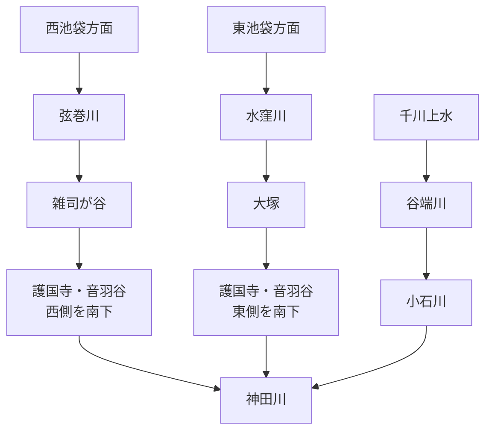
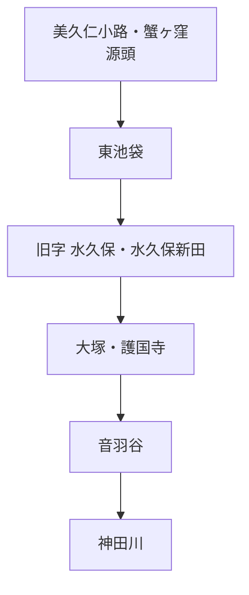
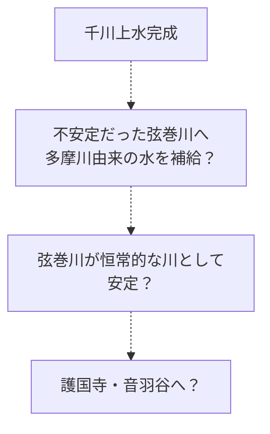
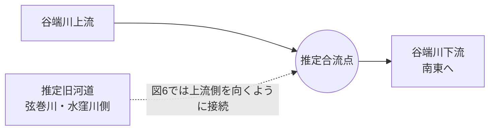
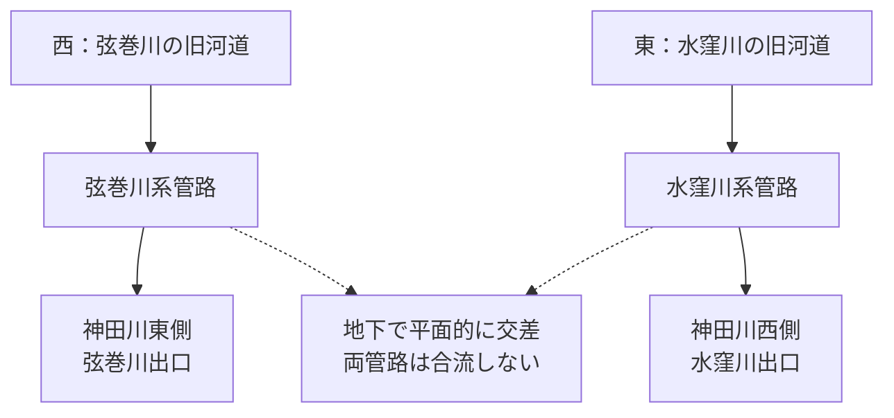

# otowa-ankyoscape

水窪川・弦巻川・谷端川と、その周辺の旧河道・暗渠・湧水・用水・土地利用について調べたことをまとめるリポジトリです。

中心となる範囲は、池袋・雑司が谷・護国寺・音羽・小日向・小石川です。

> [!IMPORTANT]
> この README では、**史料から確認できる事実**と、**地図の比較から得た観察**、**そこから立てた仮説**を分けています。
> 特に「弦巻川・水窪川は更新世に谷端川へ流れていたのか」「音羽通り西側の弦巻川はいつ成立したのか」は未解決です。

## 記号

- **〔確認〕** 一次史料、公的資料、測量図、複数の資料などからかなり確実に言えること
- **〔観察〕** 本調査で古地図・地形図・写真を比較して読み取ったこと
- **〔推定〕** 複数の事実からかなり自然に考えられるが、直接記録が未発見のこと
- **〔仮説〕** 検証中の説明
- **〔未解決〕** 現時点では判断できないこと

---

# 1. まず全体像

現在知られている大まかな水系は次のようになる。

ただし、この形が自然状態からずっと続いていたとは限らない。

現時点で重要なのは次の6点である。

1. **水窪川は護国寺創建以前の1682年の江戸図にも描かれている。** 一方、同じ図では弦巻川を確認できない。ただし江戸図では小河川の省略が実際にあるため、「描かれていない＝存在しない」とは断定できない。〔観察〕[S14][S15]
2. **1772年の『武蔵国豊島郡雑司谷村絵図』が現存し、豊島区立郷土資料館が複製を刊行している。** 地域史資料では、この絵図に当時の弦巻川の川筋が描かれていると紹介されている。これが原図・高精細複製で確認できれば、雑司ヶ谷側の弦巻川について1853年より約80年早い直接的な絵図史料になる。現時点では画像そのものの高精細確認を未実施なので、川筋の細部は要再検証。〔史料所在確認／要画像検証〕[S31][S32]
3. **1851年の近吾堂系切絵図では、弦巻川とみられる青い水路が護国寺南西端へ来て、道路を横断し、寺域の外まで短く続いている。** 「護国寺境内で消滅していた」とは読めない。〔観察〕[S16]
4. 本田創は、**1681年の護国寺創建を契機として、音羽町の東西の崖下に水窪川・弦巻川が並ぶよう「整備された」**と説明している。ただし、整備前の正確な流路や工事の完成年までは示していない。〔確認〕[S02][B02]
5. 1941年の郷土教育資料には、音羽谷の二流について、**水田開発時に灌漑のため二流に分けられたのではないか**という趣旨の推測がある。これは当時の工事記録ではなく、後世の地理的推論として扱う必要がある。〔確認／史料中の推測〕[B03]
6. 深田地質研究所の2019年論文は、弦巻川・水窪川上流の「高い河床」が更新世の旧河道で、**お茶の水女子大学付近を経て谷端川へ注いでいた可能性**を提示している。ただし著者自身が「考えられる一例」としており、図の合流角・流向にも疑問が残る。〔仮説〕[S01]

---

# 2. 川ごとの概要

## 2.1 水窪川

### 名前

豊島区の資料によれば、水窪川は旧・東池袋4丁目付近の字名 **「水久保」** にちなみ、「水久保川」「日の出川」とも呼ばれた。近世地誌『御府内備考』には **「鼠ヶ谷下水」** の記載もある。川幅は一間ほどの小流だったとされる。〔確認〕[S03]

『東京「暗渠」散歩 改訂版』では、上流部を「日の出川」、下流側を「音羽川」とする呼称も紹介されている。また江戸期の呼称として「東青柳下水」も紹介されている。〔書籍資料〕[B01]

### 源流と「水久保」は別地点

水窪川の源頭は、現在の池袋東口・**美久仁小路**付近、旧「蟹ヶ窪」の浅い窪地とされる。[S02]

一方、川名の由来になった旧字「水久保」は現在の東池袋4丁目付近で、美久仁小路とは少し離れている。[S03]

したがって、

という関係であり、「水久保＝源泉地点」ではない。

### 「水久保」「水久保新田」

〔観察〕「今昔マップ on the web」で、1896～1909年、1917～1924年、1927～1939年の地形図に **「水久保」「水久保新田」** の地名を確認した。[S18]

1880～1884年の第一軍管地方2万分1迅速測図原図では同地域が主に畑として描かれ、地名表記は確認しづらい。一方、1909年1万分1地形図では地名が明瞭になる。この差だけから地名の成立年代を決めることはできない。縮尺・目的・採録する字名が地図ごとに異なるためである。

### 護国寺・豊島岡の湧水系

護国寺東側の豊島岡墓地には **蛇池** という湧水池があり、かつてはそこから流れ出した水が護国寺境内の2つの湧水池へつながり、さらに水窪川へ注いでいたとされる。境内の流れに架かっていた石橋は音羽富士の麓に保存されている。小日向台の崖下には現在も湧水が見られる。〔確認〕[S02]

このことから、水窪川の東側流路は単なる人工排水路ではなく、**小日向台・豊島岡側の湧水を集める自然な水系を基礎にしていた**と考えられる。〔推定〕

### 1682年の江戸図

護国寺創建翌年の天和2年（1682）の異なる江戸図2点では、護国寺周辺に水窪川とみられる水路が描かれている一方、弦巻川は確認できない。〔観察〕[S14][S15]

また、水窪川沿いには「田」が見られる一方、谷の中央～西側には「畑」が多く描かれているように見える。これは後世の「灌漑のため二流に分けた」という説を考えるうえで興味深いが、江戸図は実測図ではないため土地利用の細部まで断定しない。

### 暗渠化と、1986年の「水窪川」記憶表示

豊島区の資料は、水窪川について **「昭和初期から戦後にかけて下水化」** されたとする。したがって、水窪川全体がある1年に一斉に暗渠化されたとは現在の資料からは言えない。〔確認〕[S03]

さらに豊島区のオーラルヒストリー「わが街ひすとりぃ 日出」現地ロケ編では、旧流路付近の辻広場を歩きながら、住民が小川状の施設を指して「これは下水管に繋がってる」と説明し、現地の案内板に **「水窪川　小さな川が流れていた　後世に伝える」** と書かれていること、表示が **1986年** のものだと確認している。〔確認／オーラルヒストリー〕[S33]

同じ証言では、辻広場の整備時期について「60年半ば頃」と回想している。文脈上は昭和60年前後を指す可能性が高いが、記憶に基づく証言なので施工年の確定には公園・まちづくり記録が必要である。一方、1986年の案内表示は、**暗渠化後も旧水窪川筋を地域の公共空間として可視化し、川の記憶を残そうとした具体的な時点**として使える。[S33]

---

## 2.2 弦巻川

### 名前・上流

『東京「暗渠」散歩 改訂版』では、弦巻川上流部は **「布引川」** とも呼ばれたとされる。[B01]

雑司ヶ谷霊園西側から本流へ注ぐ支谷もあり、現在も地形・水路敷から追うことができる。Natrium の現地調査では、護国寺西側で本流が鬼子母神方面から、支流が雑司ヶ谷霊園方面から来る地形が確認されている。〔確認／現地調査〕[S05]

### 丸池：豊島区が明記する水源

豊島区公式「元池袋史跡公園」は、現在の西池袋1-9-12付近にあった **丸池** について、「弦巻川の源流として清らかな水が湧き出していました」と明記している。丸池は池袋という地名の由来ともいわれ、旧「元池袋公園」は下水道工事に伴う土地交換を経て、1998年に現在地の元池袋史跡公園として開園した。〔確認〕[S26]

また豊島区史平成編は、池袋西口公園の「GLOBAL RING」の意匠について、弦巻川の水源だった丸池を意匠の題材にしたものと説明している。[S27]

これは、弦巻川上流の水源を「西池袋方面」とだけ捉えるより具体的な公的根拠になる。一方、丸池から護国寺までの途中で、どの支谷・湧水がどれだけ本流へ加わったかは別に検証する必要がある。

### 1772年の雑司谷村絵図：弦巻川の確認年代を大きく遡れる可能性

豊島区立郷土資料館が刊行する「豊島区地域地図 第5集（近世・村絵図I編）」には、**明和9年（1772）の『武蔵国豊島郡雑司谷村絵図』** が収録されている。豊島区公式の刊行物一覧と国立国会図書館の書誌情報から、原図が存在し、1992年に複製・読みおこし参考図が刊行されたことを確認できる。〔確認〕[S31]

地域史の解説では、この絵図について **当時の弦巻川の川筋が描かれている** と紹介されている。[S32]

これは重要である。もし原図・複製の高精細画像で川筋を直接確認できれば、現在 README で強い根拠としている1853年の村方資料より約80年前、**少なくとも1772年には雑司ヶ谷側の弦巻川が絵図上に存在した**ことを示せる。

ただし現在は、公開ウェブ上で高精細な絵図全体を直接読めていない。したがって、現段階では **〔史料所在確認／二次資料による川筋記述、要画像検証〕** とする。特に、描かれた川が現在「弦巻川」と呼ぶ流路のどの区間まで連続するか、護国寺南西端や音羽谷西側まで伸びるかは未確認である。[S31][S32]

### 1853年の橋の記録

嘉永6年（1853）の雑司ヶ谷村の村方資料には、弦巻川に架かる複数の橋が列挙される。調査中に確認した名称には、卒塔婆橋・鎌倉橋・木村橋・南坂橋・丸太を渡した簡易な橋・弦巻橋・松屋橋・境橋などがある。〔史料確認〕[B04]

この資料は **1853年には雑司ヶ谷側に明確な弦巻川が存在した**ことの根拠として強い。一方、村方資料なので、護国寺より南、音羽町西側の下流河道が神田川まで存在したことを直接証明する資料としては弱い。

### 1851年の護国寺南西端

近吾堂系『音羽目白雑司ヶ谷辺絵図』（題簽『改正 雑司ヶ谷音羽辺図』、嘉永4年＝1851）を国書データベース・台東区立図書館所蔵画像で確認した。[S16]

〔観察〕

- 西側から来た青い水路が護国寺南西端へ達する。
- 水路は護国寺の南西端を短く横切るように見える。
- 道路との交差部には、水色で幅広く描かれた橋・水路施設らしい記号がある。
- 高精細画像では、その施設の下流側にも細い青線が続き、寺域の外へ出ている。
- その先では道・町割りの線と重なるようになり、どこまで続くかを切絵図だけでは追えない。

このため、以前考えていた「弦巻川は護国寺境内に入り、そこで終わって水窪川へ合流した」という読みは弱くなった。

一方、**この図だけで1851年に音羽町西側の水路が神田川まで連続していたとも断定できない。**

### 尾張屋版との描写差

尾張屋系の『嘉永新鐫雑司ケ谷音羽絵図』には1850年代の複数版がある。東京都立図書館は安政4年（1857）改訂版を公開している。[S17]

〔観察〕尾張屋版でも護国寺南西端の橋・水路施設らしい部分は描かれているが、近吾堂版で見える下流側の短い青線は省略されているように見える。

これは重要で、**切絵図で川が描かれていないことが、そのまま川の不存在を意味しない**例になる。1682年図の弦巻川不掲載も同じ注意が必要である。

### 護国寺南西端の橋は長期間ほぼ同位置にあった可能性

〔観察〕東京時層地図で、1851年切絵図の橋・水路施設に近い位置（調査時の重ね合わせではおおよそ `35.719084, 139.724790`）を確認すると、「文明開化期」「関東地震直前」の地図にも、かなり近い位置で道路が弦巻川を横断している。[M02]

このことから、1851年図で異様に幅広く描かれる部分は、地下合流口よりも **橋、または橋に付随する小さな堰・溜まり・横断施設** と考える方が現在は自然である。機能・橋名は未確定。

### 暗渠化と流路付け替え

弦巻川は昭和7年（1932）に暗渠化されたとされる。さらに、中流部では暗渠化に際して流路そのものが弦巻通り側へ付け替えられた。したがって、現在の弦巻通りは必ずしも暗渠化前の自然河道そのものではない。〔確認〕[S04][S05]

現在も住宅の裏、区境、不自然な細道などに旧流路の痕跡が残る。[S05][S07]

### 首都高速との位置関係

「弦巻川は首都高速5号池袋線の下を流れていた」と大まかに説明されることがあるが、実際には区間ごとに位置が違う。[S05][S25]

Natrium の現地調査では、

- 高速下・高速西側と重なるような区間
- 高速方向から斜めに出る区間
- **音羽児童遊園付近で高速の東側に残る水路敷**

などが確認される。[S05]

したがって「全区間が高速の真下」「全区間が高速の東側」のどちらも正確ではない。

### 音羽児童遊園付近の水路敷と立入禁止

2010年の「東京の水 2009 fragments」では、高速沿いの未舗装の水路敷に入り、崖からの湧水を撮影した記録がある。[S06]

一方、本調査で確認した2021年2月23日公開の現地写真では、黒い柵が設置され「入れない」と記録されている。2024年の Natrium の記録でも「立ち入ることができない水路敷」とされる。[S05]

したがって、**少なくとも2010年の記録後～2021年2月までの間に、当該地点は物理的に入れない状態になった**と考えられる。正確な閉鎖時期は未確認。

---

## 2.3 谷端川

### 水源と流れ

谷端川は要町の粟島神社境内にある弁天池の湧水を水源とし、椎名町方面へ南下したあとU字状に大きく向きを変え、板橋・大塚・小石川を経て神田川へ流れた約11 kmの河川である。[S09][S10]

大塚以南では **小石川・礫川** と呼ばれ、資料・地域によって **氷川** などの名も使われたとされる。[B01][S10]

### 千川上水との関係

谷端川は千川上水から実際に分水を受けていた。

練馬区の資料によれば、要町3丁目付近から南東へ分かれる **「長崎村外三村分水」** が、粟島神社の池を水源とする谷端川へ接続していた。明治10年の文書では「長崎村、中丸村、池袋村、金井窪村四ケ村用水」と記される。〔確認〕[S11]

これは、後述する「千川上水が弦巻川・水窪川へ直接補水したのか」という問題と区別する必要がある。**千川上水 → 谷端川は史料で確認できる。千川上水 → 弦巻川・水窪川の直接分水は、現時点では経路・取水口を確認できていない。**

### 1895年：巣鴨新田の水車設立願は不許可

豊島区の公式区史年表には、明治28年（1895）4月23日、小石川区掃除町23の宇野伊兵衛が **巣鴨村大字巣鴨字新田928の谷端川に新規水車を設立するため、東京府知事へ願い出たが、巣鴨村・巣鴨町の地主の反対で不許可となった** と記録されている。〔確認〕[S34]

したがって、この件は「水車が存在した」ことを示すものではなく、**1895年の谷端川で水力利用を目的とする具体的な設置計画があり、その計画が地元地主の反対によって実現しなかった**ことを示す。番地まで記録されているため、地租改正地引絵図・地籍資料などと突き合わせれば、計画地点をかなり具体的に絞れる可能性がある。一方、地主が反対した理由が堰上げ・灌漑・排水・水利権・土地利用のどれにあったのかは、年表だけでは分からない。年表の典拠は **『豊島区史 資料編四』127～130頁相当（年表表記「資4-127～30」）** であり、原史料・翻刻本文を確認する価値が高い。[S34]

### 暗渠化は一度ではなく、改修・暗渠化が段階的に進んだ

従来この README では、1928年の下流部暗渠化議決、1934年の下流約3,272 m竣工、1962年の河川廃止、1964年までの全線下水道化という大枠だけを書いていた。[S10]

豊島区の公式区史年表を確認すると、上流側ではさらに細かな工事が続いている。〔確認〕[S28]

- 1930年8月8日：神田上水と谷端川の改修工事が認可・閣議決定。
- 1935年4月13日：豊島区会に「谷端川暗渠工事陳情委員」が置かれている。
- 1949年3月16日：椎名町駅付近の曲折部改修が完成。
- 1949年4月：要町2丁目3番地先～25番地先、185 mの上流改修が竣工。
- 1951年5月20日：椎名町駅より下流、武蔵野鉄道横断までの区間の改修工事が竣工。
- 1956年3月：千早町2-1～長崎2-6の支流310 mと、要町1-5～15番地の約125 mで暗渠工事が完成。
- 1957年10月29日：区議会全員協議会が谷端川暗渠計画実現のための運動を決定。
- 1958年9月26日：狩野川台風で、主として谷端川流域約150万 m²が浸水し、区内浸水家屋は7,000戸と記録される。
- 1964年：区広報には「谷端川の浚渫工事約600 m施工」とある。
- 1965年3月：大明小学校PTAが、谷端川暗渠上を児童公園として開放するよう署名運動を開始。

これを見ると、谷端川の都市河川化・暗渠化は「1934年に一気に終了」したものではなく、下流の大規模工事の後も、上流・支流の改修、治水、暗渠化、暗渠上部利用が数十年にわたり段階的に進んだことが分かる。[S28]

なお、1964年の「浚渫」が開渠の河床浚渫を意味するのか、暗渠・水路内部の清掃を含む表現なのかは年表だけでは判別できない。そのため、**「1964年までに全区間が完全に暗渠化済み」とする表現は、区間別工事記録を確認するまで留保する。** [S10][S28]

### 河川廃止後：暗渠上は段階的に児童遊園・緑道へ転用された

豊島区の谷端川南緑道・北緑道の公式説明は、谷端川が **1962年に河川として廃止され、暗渠の下水道幹線として使用されるようになった** と明記している。〔確認〕[S35][S36]

南側では、都下水道局からの承認を受けて、**1966年に谷端川第1～第3児童遊園、1967年に第4児童遊園、1980年に遊歩道として順次開放**された。その後、1983年から施設改修が始まり、1990年に整備を終え、西武池袋線～川越街道の区間が現在の谷端川南緑道となった。公式施設情報上の開園は1991年4月である。[S35]

北側では、**1971年に谷端川第5児童遊園・遊歩道として開放**され、1990年の改修を経て、西前橋～東武東上線下板橋駅前の区間が谷端川北緑道となった。こちらも公式施設情報上の開園は1991年4月である。[S36]

これは、1965年の大明小学校PTAによる暗渠上公園化の署名運動[S28]の直後から、少なくとも南側では実際の公共空間化が始まったことを示す。なお、児童遊園・緑道の開放年代は **暗渠内部の工事完了年代そのものではない** ので、河道の暗渠化年と上部利用開始年は分けて扱う。

### 谷端川水源地付近の環境変遷を直接扱う研究がある

豊島区立郷土資料館の研究紀要『生活と文化』第24号には、甲田篤郎・斉藤崇人・辻本崇夫「**谷端川水源地付近における更新世後期以降の環境変遷と土地利用**」が掲載されている。CiNiiでは第24号、pp.134–100として書誌を確認でき、豊島区公式の紀要一覧でも掲載を確認できる。〔史料所在確認〕[S37]

さらに2016年2月20日の豊島ミュージアム講座では、甲田篤郎が「**谷端川水源地付近の変遷を探る～新館建設予定地（千早二）の発掘調査から～**」と題して講演している。〔確認〕[S38]

現時点では論文本文をオンラインで確認できていないため、地層・古環境・土地利用について具体的な結論はまだ README に採用しない。ただし、**谷端川源頭部の千早二丁目周辺について、更新世後期以降の環境変遷と発掘調査を直接扱う資料が存在する**こと自体は、更新世旧河道説や水源地の土地利用史を検証するうえで重要である。

### 現在の下水道幹線は治水・貯留施設としても使われている

2001年の東京都議会公営企業委員会では、**谷端川一号幹線**について、西池袋5丁目地先～池袋4丁目地先の約1,600 mを利用して約32,000 tを暫定貯留し、同年5月から貯留を開始する予定だと下水道局が答弁している。さらに川越街道より下流側では、主要枝線の計画内径を2,200 mmから3,000 mmへ増径する計画変更が説明されている。〔確認〕[S39]

2016年の東京都議会資料では、下板橋駅付近で **谷端川幹線のボックスカルバートが浅い位置に埋設**され、都市計画道路補助73号線のアンダーパス整備には幹線の移設が必要と説明されている。〔確認〕[S40]

これらは旧河道そのものの形を示す資料ではないが、**谷端川の名を引き継ぐ下水道幹線が、現在の都市基盤・浸水対策の一部として具体的な断面・貯留機能を持っている**ことを確認できる。現在管路と旧自然河道の一致は別途、下水道台帳と旧版地図で検証する必要がある。

### 橋跡を体系的に調べた冊子がある

豊島区の資料目録には、郷土資料館友の会が1999年12月に **『旧谷端川の橋の跡を探る』** を発行した記録がある。2000年1月21日付の区プレスリリースでも紹介されている。〔確認〕[S29]

現時点では冊子本文をオンラインで確認できていないが、谷端川の橋名・位置・旧河道を対応させるための重要な二次資料候補である。入手できれば、橋の位置を地図上に落とす作業に使える可能性が高い。

### 池袋モンパルナス

谷端川沿いには戦前のアトリエ群があり、豊島区は現在も **「谷端川アトリエ群跡」**（西池袋4丁目28付近）を池袋モンパルナス関連地として紹介している。[S12]

としま未来文化財団の街歩きでも、粟島神社の谷端川跡から、すずめが丘・つつじが丘・さくらが丘などのアトリエ村跡を巡る経路が設定されている。[S13]

---

# 3. 千川上水との関係

千川上水は元禄9年（1696）、玉川上水から分水して本郷・下谷・浅草方面へ給水するため開削された。1707年には沿線20か村の農民が田へ水を引くことも許された。〔確認〕[S08]

ここから一時、次の仮説を考えた。

周辺の小河川に上水の余水を加えること自体は十分ありうる。しかし、現時点で史料上確認できるのは **千川上水から谷端川への分水** である。[S11]

千川上水と弦巻川・水窪川の間には谷端川の水系があり、直接送水したとするなら、その分水路・樋・取水口などの具体的証拠が必要になる。

したがって現在は、

- **〔確認〕千川上水 → 谷端川**
- **〔未確認〕千川上水 → 弦巻川**
- **〔未確認〕千川上水 → 水窪川**

として扱う。

今後調べるべき一次資料として、1696～1884年の上水管理文書・絵図を含む **千川家文書** がある。[S19]

---

# 4. 更新世には谷端川水系だったのか

深田地質研究所の滝口志郎「武蔵野台地の地形に関する諸問題」（2019）は、弦巻川の流路変遷について興味深い説を提示している。[S01]

論文の要点は次のとおり。

- 弦巻川・水窪川の上流は非常に浅い谷である。
- 護国寺より下流では谷が急に深くなる。
- 上流の「高い河床」と下流の「低い河床」は高さが不連続である。
- 高い河床を更新世の河道とみなすと、お茶の水女子大学の敷地付近が旧河道だった可能性が高い。
- 一例として、弦巻川・水窪川が東へ向かい、谷端川へ注いでいた流路を図示している。

ただし非常に重要な留保がある。

論文自身が、これらを「学会レベルで現在問題になっている事項」や新たな実証成果としてではなく、既存知見をもとにした個人的な考察として提示している。[S01]

さらに〔観察〕図6を現在の谷端川の流向と比べると、お茶の水女子大学付近の推定流路は、谷端川へ **上流側を向くような角度** で接続しているように見える。

このため、

- 弦巻川・水窪川 → 谷端川だった
- 逆に、現在の谷端川側の古い谷から護国寺方面へ流れていた
- 途中に分水界があった
- 河川争奪・流路逆転があった
- 図6は接続関係だけを示す概略図で、合流角は厳密でない

など複数の可能性が残る。

**「谷筋がつながっていた可能性」と「水がどちら向きに流れたか」は別問題**である。

また「弦巻川上流こそ谷端川本流の延長だったのではないか」という案も考えられるが、本流・支流を判定するための当時の流域面積・河床勾配・堆積物の連続などは現在確認できていない。

谷端川側には、豊島区立郷土資料館の研究紀要に「谷端川水源地付近における更新世後期以降の環境変遷と土地利用」という専論があり、千早二丁目の発掘調査に関連する講座も行われている。[S37][S38] 本文を入手できれば、谷端川源頭側の地層・古環境を使ってこの仮説を検証できる可能性があるが、現時点では論文の結論を未確認なので根拠にはまだ加えない。

---

# 5. 最大の未解決問題：音羽通り西側の弦巻川はいつできたか

一見すると一番新しい人工改変のはずなのに、成立年代が最も曖昧である。

## 5.1 1681年：護国寺創建

本田創は、護国寺創建をきっかけとして、江戸川橋から護国寺への直線参道と音羽町が造られ、その際に **東側の水窪川と西側の弦巻川が町の裏手・谷の両端の崖下へ並行する流れとして整備された**と説明している。[S02][B02]

ただし、これは「1681年に西側水路が完成した」という工事記録ではない。整備前の川筋も示されていない。

## 5.2 1682年：水窪川だけが見える

護国寺創建翌年の江戸図2点では、水窪川とみられる水路が描かれる一方、弦巻川は確認できない。〔観察〕[S14][S15]

ここから、

> 1682年には音羽谷西側の弦巻川がまだなかった／安定した川でなかった

という仮説を立てられる。

しかし、後述する1850年代の切絵図では、存在が別資料で確実な弦巻川も途中が省略される。そのため、**「1682年図にない」ことだけでは不存在を証明できない。**

## 5.3 1772年：雑司ヶ谷側には弦巻川が描かれている可能性

明和9年（1772）の『武蔵国豊島郡雑司谷村絵図』が現存し、豊島区立郷土資料館から複製・読みおこし参考図が刊行されている。[S31]

地域史資料では、この絵図に弦巻川の川筋が描かれていると紹介されている。[S32]

これが原図で確認できれば、**1682年には広域江戸図で確認できなかった弦巻川が、遅くとも1772年には雑司ヶ谷村の詳細絵図に現れる**ことになる。これは「弦巻川そのものが幕末まで存在しなかった」という案をかなり弱める。

ただし、この1772年図が証明できるのはまず雑司ヶ谷側の川筋であり、最大の未解決問題である **音羽通り西側の下流河道が同時点で神田川方向へ連続していたか** は別問題である。高精細画像で護国寺方向の末端を直接確認する必要がある。

## 5.4 水田開発・灌漑説

1941年の『「郷土の観察」の指導体系』には、音羽谷の川はもとは一流で、水田への開発時に灌漑目的で二流に分けられたのではないか、という趣旨の考察がある。[B03]

1682年図ですでに「田」があるため一見矛盾する。しかし、図を読むと水窪川沿いに田が集中し、中央～西側には畑が多いように見える。〔観察〕

したがって、ここでいう「水田開発」を、谷で最初に水田ができた時ではなく、**後に畑を水田へ転換し、灌漑範囲を拡張した時**と解釈する余地がある。

田柄川などでは、既存河川とは別に細い並行水路を設けて両側から耕地へ水を配る例がある、という指摘も受けた。これは「そういう工事が可能だった」ことの類例であり、音羽で同じ工事があった直接証拠ではない。

## 5.5 1851年：少なくとも護国寺南西端から先へ水は続く

前述の通り、近吾堂版では弦巻川が護国寺南西端を横切り、その先へ短く続く。[S16]

したがって、

> 幕末まで弦巻川は護国寺内で終わり、明治になって初めて西側水路が掘られた

という単純な案は現在かなり弱くなっている。

ただし、1851年の短い線の先が、

- そのまま音羽町西側を神田川まで南下するのか
- どこかで水窪川へ接続するのか

は切絵図だけでは決められない。

## 5.6 明治期には東西二流が明瞭

明治期の実測図になると、音羽谷の東西に水窪川・弦巻川が並ぶ姿を明瞭に追える。〔観察〕[S06][S18]

したがって成立年代を突き止めるには、**1682～明治初期の間で、西側水路を明瞭に描いた最古の一次資料を探す**必要がある。

### 現在の候補

1. **1681年前後の護国寺・音羽町造成時に成立**
2. その後の水田拡張・灌漑再編時に成立
3. 既存の小水路を段階的に拡幅し、後から「弦巻川下流」と認識されるようになった

現状では1を支持する近代の解説があるが、工事年を確定する一次史料はまだ見つかっていない。

---

# 6. 音羽谷の東側に水窪川がある理由

「自然河川なら谷の中央を流れそうなのに、なぜ水窪川は東端の崖下なのか」という疑問がある。

現在考えられるのは、単一原因ではなく次の組み合わせである。

- 小日向台・豊島岡側の崖下には湧水が多く、蛇池・護国寺境内の池など東側に自然の水源網がある。[S02]
- 1681年の護国寺・音羽町造成時に、川が町裏の崖下へ沿うよう整理されたとされる。[S02]
- 谷底を田畑・町として利用する際、河川を縁へ固定することには土地利用上の利点がある。

したがって、**自然の崖下湧水系を基礎にしつつ、近世の造成・灌漑・排水によって位置が固定・整形された**という説明が現在は最も無理が少ない。

---

# 7. 明治～大正期の細かな発見

## 7.1 久世山から見た水窪川らしき流れ

「久世山より早稲田を望む（THE WASEDA FROM KUSEYAMA）」という絵葉書について、明治43年（1910）と読める消印を持つ個体が紹介されている。写真前景の久世山崖下に、水窪川とみられる細長い水路・低地が写っている可能性がある。〔要再検証〕[M03]

1896年の地図との位置関係は合うが、写真解像度だけで水面そのものを確定するのは難しいため、写真資料としては保留する。

## 7.2 現在の講談社付近にあった池

〔観察〕1909年1万分1地形図で、現在の講談社付近に **弦巻川と接続するように見える小池** を確認した。[M01]

- 1909年：池あり
- 1921～22年：池あり
- 1928～39年の地図：池は消滅

現在の講談社から裏手の高台にかけては、明治期に山田顕義の音羽邸があり、約2万坪とされる。音羽の洋館は1890年竣工。[S20]

講談社の社史では、野間清治が1921年7月10日に団子坂から音羽へ住居を移している。[S21]

したがってこの池は、少なくとも山田邸時代～野間邸初期に存在した可能性がある。ただし、**庭園池・灌漑池・湧水池のどれだったか、弦巻川から給水したのか池から排水したのかは未確定**。

## 7.3 池の少し北で弦巻川と重なる建物

〔観察〕同じ1909年図で、池の少し北側に、建物が弦巻川をまたぐ／河道と重なるように描かれる地点を確認した。1921～22年図でもほぼ同じ位置に同様の建物が残る。[M01]

12年以上続いているため、単なる一時施設や単年度の描画誤差とは考えにくい。一方、

- 水車小屋
- 取水施設
- 川上に張り出した建物
- 橋と一体になった建物

などのどれかは史料なしには決められない。**現段階では「河道をまたぐ恒久的な建物・施設らしい」までに留める。**

## 7.4 戦前の地域記憶にも水窪川・弦巻川が「東西の境」として現れる

文京区が公開している音六町会の町会史には、戦災時の音羽について「音羽通り東側のねずみ坂下水窪川、西側鳥尾坂下弦巻川より江戸川橋まで」が焼けた、という趣旨の記述がある。〔確認／地域史料〕[S30]

この記述は、少なくとも地域の記憶の中で、**水窪川が音羽通り東側の鼠坂付近、弦巻川が西側の鳥尾坂付近を通る明瞭な地理的境界として認識されていた**ことを示す資料になる。

ただし同ページは空襲を「昭和19年3月」と記しており、東京の大規模空襲史との整合を含め年次は再確認が必要である。この年次をそのまま確定事実としては扱わない。

---

# 8. 下流部：暗渠になった二河川は地下で交差する

現在の下水道系統では、音羽通り東側を来る水窪川系統（坂下幹線）の出口が江戸川橋西側、音羽通り西側を来る弦巻川系統（雑司ヶ谷幹線）の出口が江戸川橋東側にあり、途中で両管路が平面的に交差する。[S05][S22]

これは **暗渠・下水道化後の管路の交差** であり、自然河川だった時代から2本の開渠が交差していたという意味ではない。

また水窪川下流では、旧神田上水との立体交差に石樋が使われていたとされる。[B02][S22]

---

# 9. 暗渠化と下水道化

## 弦巻川

- 昭和7年（1932）に暗渠化。[S04][S05]
- 中流部は暗渠化と同時に流路付け替え。[S05]

## 水窪川

- 豊島区資料では昭和初期～戦後にかけて下水化。[S03]
- 1986年の旧流路付近には「水窪川　小さな川が流れていた　後世に伝える」とする案内表示が確認され、辻広場・小川状施設として旧河道の記憶が可視化されている。[S33]
- 区間ごとの施工年をさらに調べる必要がある。

## 谷端川

- 1928年：下流部暗渠化を議決。[S10]
- 1934年：下流約3,272 mの暗渠工事が竣工。[S10]
- 1935年：豊島区会に谷端川暗渠工事陳情委員を設置。[S28]
- 1949～51年：椎名町・要町周辺で複数の改修工事。[S28]
- 1956年：千早町～長崎の支流310 m、要町の約125 mで暗渠工事完成。[S28]
- 1957年：区議会が暗渠計画実現の運動を決定。[S28]
- 1958年：狩野川台風で谷端川流域を中心に大規模浸水。[S28]
- 1962年：河川として廃止。その後は暗渠の下水道幹線として使用。[S10][S35][S36]
- 1964年：区史年表には約600 mの「浚渫工事」も記録される。[S28]
- 1966年：谷端川第1～第3児童遊園として暗渠上部を開放。[S35]
- 1967年：谷端川第4児童遊園を開放。[S35]
- 1971年：谷端川第5児童遊園・北側遊歩道を開放。[S36]
- 1980年：南側の遊歩道としての開放が承認。[S35]
- 1991年4月：現在の谷端川南緑道・北緑道として開園。[S35][S36]

したがって、全区間の暗渠化完了年は、区間ごとの工事記録を照合して再確認する。また、**暗渠化・下水道化の工事年代と、覆蓋上部の公園・緑道化の年代は別に扱う。**

### 谷端川幹線の近現代利用

- 2001年：谷端川一号幹線の西池袋5丁目～池袋4丁目、約1,600 mで約32,000 tの暫定貯留を開始予定と都議会答弁。[S39]
- 2016年：下板橋駅付近では谷端川幹線が浅い位置のボックスカルバートとして存在し、補助73号線アンダーパス整備に伴う移設が課題とされた。[S40]

これらは旧自然河道の位置をそのまま示すものではなく、現在の下水道施設としての谷端川幹線の情報である。

## 高田町下水道

豊島区の資料によると、高田町は1929年に下水道調査費を計上し、1930年に実地調査・設計を終えて東京府へ申請した。豊島区郷土資料館には **「高田町下水道設計平面図」** が所蔵されている。[S23]

これは弦巻川・水窪川周辺が河川から下水道へ移行する時期を調べる重要資料になる。色線の意味は凡例を確認するまで断定しない。

---

# 10. 年表

| 年代 | 出来事・資料 | 現時点での意味 |
|---|---|---|
| 更新世 | 弦巻川・水窪川上流に高い浅い河床 | 谷端川側との旧河道接続説。流向は未確定。[S01] |
| 1681 | 護国寺創建 | 音羽町・参道と両河川の整備の契機とされる。[S02] |
| 1682 | 江戸図2点 | 水窪川は見えるが弦巻川は確認できない。不存在の証明ではない。[S14][S15] |
| 1696 | 千川上水開削 | 玉川上水から分水。[S08] |
| 1707 | 千川上水の農業利用 | 沿線20か村が田への引水を許可。[S08] |
| 1772 | 『武蔵国豊島郡雑司谷村絵図』 | 絵図が現存。地域史資料では弦巻川の川筋が描かれるとされる。高精細画像で要検証。[S31][S32] |
| 江戸期 | 千川上水→谷端川の分水 | 長崎村外三村分水。直接の弦巻・水窪分水は未確認。[S11] |
| 1833 | 音羽谷の製紙 | 伊那谷から職人が移住し、弦巻川・水窪川の水を利用。[S24] |
| 1851 | 近吾堂『音羽目白雑司ヶ谷辺絵図』 | 弦巻川が護国寺南西端を横切り、寺外まで短く続く。[S16] |
| 1853 | 雑司ヶ谷村方資料 | 雑司ヶ谷側の弦巻川と多数の橋を確認。[B04] |
| 1850年代 | 尾張屋版切絵図 | 橋・水路施設まで描くが、流路の一部を省略。切絵図の選択的描写を示す。[S17] |
| 明治初期～ | 実測図 | 音羽谷の東西二流が明瞭になる。西側水路の初出資料はさらに調査が必要。 |
| 1890 | 山田顕義音羽邸竣工 | 現講談社付近を含む約2万坪。[S20] |
| 1895 | 巣鴨新田の谷端川に水車設立願 | 巣鴨村・巣鴨町の地主の反対で不許可。計画地点は字巣鴨新田928。[S34] |
| 1896～1939 | 地形図 | 「水久保」「水久保新田」を確認。[S18] |
| 1909 | 1万分1地形図 | 現講談社付近に弦巻川接続らしき池、河道をまたぐ建物を確認。[M01] |
| 1921～22 | 地形図 | 池・河道上の建物がまだ残る。[M01] |
| 1921 | 野間清治が音羽へ転居 | 旧山田邸周辺の土地利用変化を追う手掛かり。[S21] |
| 1928～39 | 地形図 | 講談社付近の池が消える。[M01] |
| 1930 | 神田上水・谷端川改修工事認可 | 谷端川の近代治水・改修の公的な節目。[S28] |
| 1932 | 弦巻川暗渠化 | 中流では流路も付け替え。[S04][S05] |
| 1934 | 谷端川下流暗渠完成 | 下流約3.27 km。[S10] |
| 1935 | 谷端川暗渠工事陳情委員 | 豊島区側では暗渠化要求が継続。[S28] |
| 1941 | 郷土教育資料 | 音羽谷の二流を灌漑目的の分流と考える説。[B03] |
| 1949～51 | 谷端川上流・椎名町周辺改修 | 暗渠化以前にも曲折部・河道の改修が継続。[S28] |
| 1956 | 谷端川の一部暗渠工事完成 | 支流310 m、要町約125 m。[S28] |
| 1958 | 狩野川台風 | 谷端川流域中心に約150万 m²浸水、区内7,000戸。[S28] |
| 1962 | 谷端川を河川として廃止 | 暗渠の下水道幹線として使用。[S10][S35][S36] |
| 1964 | 谷端川約600 m浚渫 | 暗渠化完了時期の区間別再検証が必要。[S28] |
| 1965 | 大明小PTAが暗渠上公園化を要望 | 翌年から南側で実際に児童遊園としての開放が始まる。[S28][S35] |
| 1966～71 | 谷端川暗渠上を児童遊園・遊歩道として順次開放 | 第1～第5児童遊園と北側遊歩道。河道暗渠化後の上部利用史を具体化。[S35][S36] |
| 1980 | 谷端川南側を遊歩道として開放承認 | 現在の南緑道につながる上部利用。[S35] |
| 1986 | 水窪川旧流路付近の案内表示 | 「小さな川が流れていた　後世に伝える」とする表示をオーラルヒストリー映像で確認。[S33] |
| 1991 | 谷端川南緑道・北緑道開園 | 1980年代の改修を経た現在形。[S35][S36] |
| 1998 | 元池袋史跡公園開園 | 丸池跡地周辺の記憶を保存。[S26] |
| 1999 | 『旧谷端川の橋の跡を探る』発行 | 橋名・橋位置調査の重要資料候補。[S29] |
| 2001 | 谷端川一号幹線を暫定貯留に利用 | 西池袋5丁目～池袋4丁目約1.6 km、約32,000 t。[S39] |
| 2010 | 弦巻川水路敷の現地記録 | 未舗装水路敷と湧水を撮影。[S06] |
| 2015 | 谷端川水源地付近の環境変遷・土地利用研究 | 更新世後期以降を扱う専論が豊島区立郷土資料館紀要に掲載。[S37] |
| 2016 | 千早二丁目発掘調査に基づく谷端川水源地講座 | 源頭部の発掘・古環境資料の所在を示す。[S38] |
| 2016 | 下板橋駅付近の谷端川幹線 | 浅い位置のボックスカルバートであることを都議会答弁で確認。[S40] |
| 2021 | 弦巻川水路敷の写真 | 柵で進入できない状態を確認。[M04] |
| 2023～24 | Natrium現地調査 | 水路敷、旧流路、現在の下水出口等を詳細確認。[S05] |

---

# 11. 現時点の作業仮説

## 仮説A：水窪川は古くから音羽谷の主要な安定河川だった

根拠：

- 1682年図に水窪川だけが明瞭に描かれる。[S14][S15]
- 東側崖線に蛇池・護国寺湧水池・現在まで残る湧水がある。[S02]
- 水窪川沿いに古くから田が描かれる。〔観察〕

ただし弦巻川の不掲載は地図上の省略の可能性がある。

## 仮説B：弦巻川は上流に自然河川として存在したが、音羽谷西側の下流は人為的に整備・強化された

根拠：

- 丸池が弦巻川の源流だったことを豊島区が明記している。[S26]
- 1772年の雑司谷村絵図が現存し、地域史資料では弦巻川の川筋が描かれるとされる。[S31][S32]
- 雑司ヶ谷側には1853年までに多数の橋を持つ弦巻川がある。[B04]
- 1681年の護国寺創建時に両川が崖下へ整備されたという説明。[S02][B02]
- 1941年資料の灌漑分流説。[B03]
- 1932年暗渠化時にも中流で大胆な流路付け替えが行われており、人為的改変の大きい川である。[S05]

成立年は未確定。1772年図の高精細確認により、少なくとも雑司ヶ谷側の存在年代はかなり遡れる可能性があるが、音羽谷西側の下流河道の成立年代とは分けて考える。

## 仮説C：弦巻川の安定化に千川上水が関係した

地元研究者から、弦巻川の不安定な湧水に多摩川由来の水が補われた可能性が指摘された。

しかし現在確認できる具体的分水は谷端川へのものだけである。[S11]

したがって **仮説Cは保留**。千川家文書などで経路を探す必要がある。[S19]

## 仮説D：更新世には弦巻川・水窪川の上流谷が谷端川水系につながっていた

地形的根拠はあるが、流向が未確定。[S01]

「弦巻・水窪 → 谷端」だけでなく、「谷端側の古い谷 → 護国寺側」、分水界、河川争奪なども検討対象にする。

谷端川水源地側には更新世後期以降の環境変遷を扱う専論があるが、本文未確認のため現時点では仮説Dを強める／弱める根拠には採用しない。[S37]

---

# 12. これから調べたいこと

- [ ] **音羽通り西側の弦巻川を明瞭に描く最古の一次資料を特定する**
- [ ] **1772年『武蔵国豊島郡雑司谷村絵図』の高精細画像・複製を確認し、弦巻川の起点・末端・支流・橋・護国寺方向への接続を読み取る**
- [ ] 1682～1851年の護国寺・音羽周辺図を年代順に収集する
- [ ] 1851年近吾堂版の護国寺南西端の橋・水路施設の名称と用途を特定する
- [ ] 1853年村方資料の各橋、特に **境橋** の正確な位置を特定する
- [ ] 護国寺日記・御府内備考・地租改正地引絵図などから水路改修記録を探す
- [ ] 千川家文書から弦巻川・水窪川への分水・余水の記録を探す
- [ ] 更新世の旧河道について、お茶の水女子大学～谷端川間の標高断面・ボーリング柱状図を調べる
- [ ] **甲田篤郎ほか「谷端川水源地付近における更新世後期以降の環境変遷と土地利用」本文を入手し、千早二丁目の地層・古環境・土地利用変遷を確認する**
- [ ] 図6の谷端川合流部について、古河床の勾配から流向を検証する
- [ ] 「水久保」「水久保新田」の字界・初出年代を地租改正資料で確認する
- [ ] 水窪川の1986年案内表示・辻広場の正確な位置、整備事業名、施工年を公園・まちづくり資料から確定する
- [ ] 現講談社敷地の1909～22年の池の用途を、山田邸・野間邸資料から特定する
- [ ] 同池北側の「弦巻川をまたぐ建物」の用途を特定する
- [ ] 水窪川の区間別暗渠化年を下水道台帳・工事記録で確定する
- [ ] 谷端川の1895年水車設立願について、**『豊島区史 資料編四』127～130頁相当の典拠を確認し、地主の反対理由・申請図・水車の用途や仕様・字巣鴨新田928の位置を特定する**
- [ ] 谷端川の1934～1965年の区間別改修・暗渠化を工事記録と地図で復元する
- [ ] 谷端川の旧河道と、谷端川幹線・谷端川一号幹線など現在の下水道施設の線形を下水道台帳で比較する
- [ ] 『旧谷端川の橋の跡を探る』本文を入手し、橋名・位置を地図化する
- [ ] 音六町会史の「昭和19年3月の空襲」という年次を別史料で検証する
- [ ] 2010～2021年の弦巻川水路敷の閉鎖時期を古いストリートビュー・工事資料で絞る
- [ ] 谷端川・弦巻川・水窪川について「旧自然河道」「近世の水路」「現在の下水管」を別レイヤーの GeoJSON にする

---

# 13. 資料・出典

## 地形・河川史

- **[S01]** 滝口志郎「武蔵野台地の地形に関する諸問題」『深田地質研究所年報』No.20, 2019, pp.35–43  
  https://fukadaken.or.jp/data_pdf/20_35.pdf
- **[S02]** 本田創「池袋に残る“消えた川”を追ってみると…神田川へ向かう『水窪川』の暗渠には何がある？」文春オンライン, 2021（特に4ページ目）  
  https://bunshun.jp/articles/-/50033?page=4
- **[S03]** 豊島区「水窪川」フィールドワーク関連広報資料, 1999  
  https://adeac.jp/viewitem/toshima-history/viewer/viewer/pressH111009/data/pressH111009.pdf
- **[S04]** 豊島区「弦巻川の昔を語る 名こそ流れて」関連資料, 2000  
  https://adeac.jp/toshima-history/viewer/mp408233/pressH120213/
- **[S05]** Natrium.jp「神田川周辺の水路敷群（弦巻川）」  
  https://natrium.jp/canal_lot/kanda/tsurumaki/index.html
- **[S06]** 「弦巻川断章」東京の水 2009 fragments, 2010  
  https://tokyoriver.exblog.jp/13903570/
- **[S07]** 「地図子、弦巻川を歩く」  
  https://chizuchizuko.hatenablog.com/entry/tsurumakigawa
- **[S33]** 豊島区「わが街ひすとりぃ　第8回　日出」現地ロケ編全文テキスト—旧水窪川筋の辻広場、1986年の「水窪川　小さな川が流れていた　後世に伝える」案内表示についてのオーラルヒストリー  
  https://adeac.jp/toshima-history/texthtml/d000000/mp00500101/ht420120

## 千川上水・谷端川

- **[S08]** 練馬区「千川上水跡」  
  https://www.city.nerima.tokyo.jp/kankomoyoshi/annai/rekishiwoshiru/rekishibunkazai/bunkazai/b047.html
- **[S09]** 豊島区「谷端川緑道」等の景観資源紹介  
  https://www.city.toshima.lg.jp/296/machizukuri/toshikekaku/kekan/1902271613.html
- **[S10]** 早稲田大学オープンカレッジ資料「谷端川とは」, 2024  
  https://yorifuji.thyme.jp/wasedaopc/tikei/waseda20241116/waseda20241116b.pdf
- **[S11]** 練馬わがまち資料館「千川上水の分水を訪ねて（2）」—長崎村外三村分水と谷端川  
  https://www.nerima-archives.jp/column/3572/
- **[S12]** 豊島区「池袋モンパルナスとよばれたまち」—谷端川アトリエ群跡  
  https://www.city.toshima.lg.jp/129/miryoku/shiru/bunka/montparnasse.html
- **[S13]** としま未来文化財団「池袋モンパルナスアトリエ村 そぞろ歩き」  
  https://www.toshima-mirai.or.jp/tabid216.html?pdid1=1982
- **[S28]** 豊島区「としまひすとりぃ」昭和年表・谷端川関連項目—1930年改修認可、1949～51年改修、1956年暗渠工事、1958年浸水、1964年浚渫等  
  https://adeac.jp/toshima-history/detailed-search?mode=timeline&word=%E8%B0%B7%E7%AB%AF%E5%B7%9D
- **[S29]** 豊島区「かつて区内を流れていた川筋を辿って　冊子『旧谷端川の橋の跡を探る』」資料目録, 2000年1月21日  
  https://adeac.jp/toshima-history/catalog/mp406231
- **[S34]** 豊島区「としまひすとりぃ」明治年表・谷端川関連項目—1895年4月23日、巣鴨村大字巣鴨字新田928の谷端川への新規水車設立願。年表全文では **巣鴨村・巣鴨町の地主の反対で不許可** と記載し、典拠を「資4-127～30」とする。  
  https://adeac.jp/toshima-history/detailed-search?mode=timeline&word=%E8%B0%B7%E7%AB%AF%E5%B7%9D
- **[S35]** 豊島区「谷端川南緑道」—1962年の河川廃止後、暗渠を下水道幹線として使用。1966年第1～第3児童遊園、1967年第4児童遊園、1980年遊歩道として開放、1991年4月開園  
  https://www.city.toshima.lg.jp/340/shisetsu/koen/033.html
- **[S36]** 豊島区「谷端川北緑道」—1962年の河川廃止後、暗渠を下水道幹線として使用。1971年第5児童遊園・遊歩道として開放、1991年4月開園  
  https://www.city.toshima.lg.jp/340/shisetsu/koen/042.html
- **[S37]** 甲田篤郎・斉藤崇人・辻本崇夫「谷端川水源地付近における更新世後期以降の環境変遷と土地利用」『生活と文化 : 研究紀要』24, 豊島区立郷土資料館, 2015, pp.134–100（本文未確認、書誌確認）  
  https://cir.nii.ac.jp/crid/1520295049406774016  
  豊島区刊行物一覧： https://www.city.toshima.lg.jp/129/bunka/bunka/shiryokan/kankobutu/005957.html
- **[S38]** 豊島区「これまでの講座・イベント」—2016年2月20日、甲田篤郎「谷端川水源地付近の変遷を探る～新館建設予定地（千早二）の発掘調査から～」  
  https://www.city.toshima.lg.jp/500/museumgroup-event-past.html
- **[S39]** 東京都議会「平成十三年東京都議会公営企業委員会速記録第三号」—谷端川一号幹線の西池袋5丁目～池袋4丁目約1,600 m、暫定貯留量約32,000 t、下流主要枝線の2,200 mm→3,000 mm増径計画  
  https://www.gikai.metro.tokyo.lg.jp/record/public-enterprise/2001-03.html
- **[S40]** 東京都議会「平成二十八年 東京都議会環境・建設委員会速記録第十三号」—下板橋駅付近の谷端川幹線は浅い位置のボックスカルバートで、補助73号線アンダーパス整備には移設が必要と説明  
  https://www.gikai.metro.tokyo.lg.jp/record/environmental-construction/2016-13.html

## 江戸・明治の地図

- **[S14]** 『ゑ入江戸大絵図』天和2年（1682）、国立国会図書館デジタル資料  
  https://lab.ndl.go.jp/dl/book/2542450
- **[S15]** 『増補江戸大絵図絵入』天和2年（1682）、愛媛県歴史文化博物館系デジタルアーカイブ  
  https://ehime-archive.iri-project.org/en/detail/om-0118
- **[S16]** 『音羽目白雑司ヶ谷辺絵図』（題簽『改正 雑司ヶ谷音羽辺図』）、嘉永4年（1851）冬新刻、台東区立図書館  
  https://adeac.jp/taito-lib/catalog/mp070540-100070
- **[S17]** 『嘉永新鐫雑司ケ谷音羽絵図』安政4年（1857）改、東京都立図書館  
  https://archive.library.metro.tokyo.lg.jp/da/detail?tilcod=0000000013-00042340
- **[S18]** 今昔マップ on the web  
  https://ktgis.net/kjmapw/
- **[S31]** 豊島区「豊島区地域地図集（複製）」—第5集に明和9年（1772）『武蔵国豊島郡雑司谷村絵図』と読みおこし参考図を収録  
  https://www.city.toshima.lg.jp/129/bunka/bunka/shiryokan/kankobutu/005951.html  
  国立国会図書館書誌： https://ndlsearch.ndl.go.jp/books/R100000002-I000009123633
- **[S32]** 「雑司が谷 日乗『古地図を片手に、雑司が谷の坂道を歩こう』」—1772年雑司谷村絵図について「弦巻川の川筋」が描かれると紹介（原図確認まで補助的な二次資料として使用）  
  https://zoushigaya.seesaa.net/article/189594335.html

## 千川上水の一次資料候補

- **[S19]** 練馬区「千川家文書」—1696～1884年の文書・記録・絵図297点  
  https://www.city.nerima.tokyo.jp/kankomoyoshi/annai/rekishiwoshiru/rekishibunkazai/bunkazai/b0904.html

## 講談社周辺の土地史

- **[S20]** 日本大学「学祖 山田顕義『皇典講究所の設立と改革』」—音羽邸の位置・規模  
  https://www.nihon-u.ac.jp/history/forerunner/yamada/08.php
- **[S21]** 渋沢社史データベース『講談社の80年 : 1909～1989』—1921年7月10日、野間清治が音羽へ転居  
  https://shashi.shibusawa.or.jp/details_nenpyo.php?query=%E9%87%8E%E9%96%93%E6%B8%85%E6%B2%BB&sid=14470

## 下流・暗渠・下水道

- **[S22]** 「地図子、水窪川を歩く」—現暗渠・下流の交差等  
  https://chizuchizuko.hatenablog.com/entry/mizukubogawa
- **[S23]** 豊島区「高田町の下水道事業」—高田町下水道設計平面図  
  https://adeac.jp/viewitem/toshima-history/viewer/viewer/pressH261016_2/data/pressH261016_2.pdf
- **[S24]** 本田創「水窪川を利用し大きくなった製紙業」文春オンライン, 2021  
  https://bunshun.jp/articles/-/50033?page=5
- **[S25]** 本田創による弦巻川の近年の記事（首都高速沿いの説明）  
  https://bunshun.jp/articles/-/88509?page=6
- **[S30]** 文京区「音六町会」—町会史中に水窪川・弦巻川を音羽通り東西の地理的境界として記述  
  https://www.city.bunkyo.lg.jp/b011/p001289.html

## 弦巻川水源・丸池

- **[S26]** 豊島区「元池袋史跡公園」—丸池を弦巻川の源流と明記  
  https://www.city.toshima.lg.jp/340/shisetsu/koen/030.html
- **[S27]** 豊島区史「平成ひすとりぃ」—池袋西口公園GLOBAL RINGの意匠と弦巻川水源「丸池」  
  https://adeac.jp/toshima-history/texthtml/d100010/mp101000/ht0402030

## 書籍

- **[B01]** 本田創 編著『失われた川を歩く 東京「暗渠」散歩 改訂版』実業之日本社, 2021  
  https://www.j-n.co.jp/books/978-4-408-33965-8/
- **[B02]** 本田創『水のない川 暗渠でたどる東京案内』山川出版社, 2022  
  https://www.ro-da.jp/suidorekishida/book/detail/B343
- **[B03]** 東京都豊島師範学校附属国民学校児童教育研究会 編『「郷土の観察」の指導体系』, 1941（本調査で画像を確認。音羽谷の二流について灌漑目的の分流説を記載）
- **[B04]** 『嘉永六年 雑司ヶ谷村ほか沿革起立書上』, 1853（本調査で掲載画像を確認。弦巻川の橋名列挙。原資料・翻刻の所在を追加調査中）

## 本調査で行った地図・写真比較

- **[M01]** 今昔マップ／旧版1万分1地形図：1909年、1921～22年、1928～39年を比較。現講談社付近の池・弦巻川上の建物を確認。
- **[M02]** 東京時層地図：1851年切絵図と「文明開化期」「関東地震直前」を比較。護国寺南西端付近の河川横断地点を確認。
- **[M03]** 「久世山より早稲田を望む」絵葉書と明治期地図を比較。水窪川らしき前景の水路は要再検証。
- **[M04]** 2021年2月23日公開の弦巻川暗渠現地写真を確認。2010年には入れた水路敷が、この時点では柵で進入不能。

---

# 14. 注意

- 江戸切絵図は案内図であり、測量図ではない。川・道路・寺社の位置、角度、幅を現代地図へそのまま重ねて数m単位で議論しない。
- 村絵図についても、近代測量図と同じ位置精度を仮定しない。1772年雑司谷村絵図の弦巻川は、まず原図・高精細複製で線そのものを確認したうえで、現在地との対応は道路・寺社・字界など複数の地物を使って検討する。
- 「大江戸今昔めぐり」などの現代復元図は非常に便利だが、江戸図と明治期測量図などを統合した復元成果であり、**その線が安政期の一次史料にそのまま存在することの証明には使わない**。
- 下水道台帳の現在管路と暗渠化前の自然河道は一致しない場合がある。弦巻川中流はその明確な例。
- 古い川名は区間・時代・用途で変わる。「弦巻川」「水窪川」「谷端川」を現代の一本の線として過去へそのまま延長しない。
- 推測が新しい資料で崩れた場合は、過去の説を残しつつ根拠とともに更新する。

---

# 15. 追加調査（2026-08-20）

## 15.1 1999年の郷土資料館フィールドワーク：水窪川跡を約4 km追跡

豊島区立郷土資料館だより『かたりべ』56号（1999年12月10日）は、同年10月9日の地域史講座 **「水窪川跡を歩く」** について、**美久仁小路（東池袋1丁目）から護国寺・音羽通りを経て江戸川橋（文京区）まで、約4 km** を歩いたと記録している。〔確認／地域史講座記録〕[S41]

この約4 kmは歴史上の水窪川そのものの河川長を確定する値ではなく、**1999年時点で郷土資料館が旧流路として実地に追跡した経路の長さ**である。それでも、現在の作業仮説である「美久仁小路付近の源頭―護国寺―音羽谷―江戸川橋」という線形を、公的な現地調査記録から補強する資料になる。

## 15.2 2000～01年「豊島区の湧き水をたずねて」：湧水支流網を追える重要資料

豊島区立郷土資料館は2000年に地域史講座 **「失われた水辺を探る―豊島区の湧き水をたずねて―」** を実施し、『かたりべ』60号でその終了を報告している。さらに2001年12月25日発行の研究紀要『生活と文化』第11号には、横山恵美 **「豊島区の湧き水をたずねて」** が「調査ノート」として掲載されている。〔史料所在確認〕[S42]

公式の刊行物一覧から題名・著者・発行年は確認できるが、本調査では本文全体をまだ直接精読していない。そのため、二次サイトに転載された個々の湧水位置・支流名・池・洗い場の記述を、現段階で確定情報としてREADMEへ取り込むことはしない。

一方、複数の二次資料はこの調査ノートを、**谷端川・弦巻川・水窪川・谷田川へ注ぐ小流、周辺の湧水、池、洗い場**を扱う資料として参照している。したがって本文を入手できれば、現在のREADMEで特に薄い **谷端川の湧水支流網、生活用水としての洗い場、池との接続関係** を具体化できる可能性が高い。〔推定／本文要確認〕[S42]

調査優先度は高い。本文確認後は、湧水・支流・池・洗い場を地点ごとに分け、古地図・地形と照合する。

## 15.3 丸池：「弦巻川の水源」と「池袋地名の語源」は分けて扱う

青木哲夫「**丸池（「池袋地名由来の池」）説話成立に関する文献的考証**」が、豊島区教育委員会『生活と文化』第18号（2009年3月27日、pp.3–20）に掲載されていることを確認した。〔史料所在確認〕[S43]

現在のREADMEでは、豊島区公式資料に基づき **丸池が弦巻川の源流だった** ことを[S26]で確認している。一方、論文題名そのものが示す通り、**「丸池が池袋という地名の由来である」という説明は、説話の成立過程を文献的に検討すべき別の問題**である。

本文の結論はまだ精読していないので、丸池地名由来説を肯定・否定する根拠にはまだ使わない。今後は、(1) 丸池の実在・位置・水源機能、(2) 弦巻川との接続、(3) 「池袋」地名由来説の成立史、を別々に検証する。

## 追加出典

- **[S41]** 豊島区立郷土資料館だより『かたりべ』56号, 1999年12月10日―地域史講座「失われた水辺を探る―水窪川・谷戸川跡を歩こう―」を終えて。10月9日の「水窪川跡を歩く」で、美久仁小路（東池袋1丁目）から護国寺・音羽通りを経て江戸川橋まで約4 kmを歩いたと記録  
  https://www.city.toshima.lg.jp/documents/2548/kataribe56.pdf
- **[S42]** 豊島区立郷土資料館研究紀要『生活と文化』第11号, 2001年12月25日―横山恵美「豊島区の湧き水をたずねて」（調査ノート）。2000年の同題地域史講座は『かたりべ』60号にも記録  
  https://www.city.toshima.lg.jp/129/bunka/bunka/shiryokan/kankobutu/005957.html  
  https://www.city.toshima.lg.jp/129/bunka/bunka/shiryokan/kankobutu/kataribe/005996.html
- **[S43]** 青木哲夫「丸池（「池袋地名由来の池」）説話成立に関する文献的考証」『生活と文化』18, 豊島区教育委員会, 2009年3月27日, pp.3–20（本文未精読、書誌確認）  
  https://cir.nii.ac.jp/crid/1390574334779064960  
  豊島区刊行物一覧： https://www.city.toshima.lg.jp/129/bunka/bunka/shiryokan/kankobutu/005957.html
