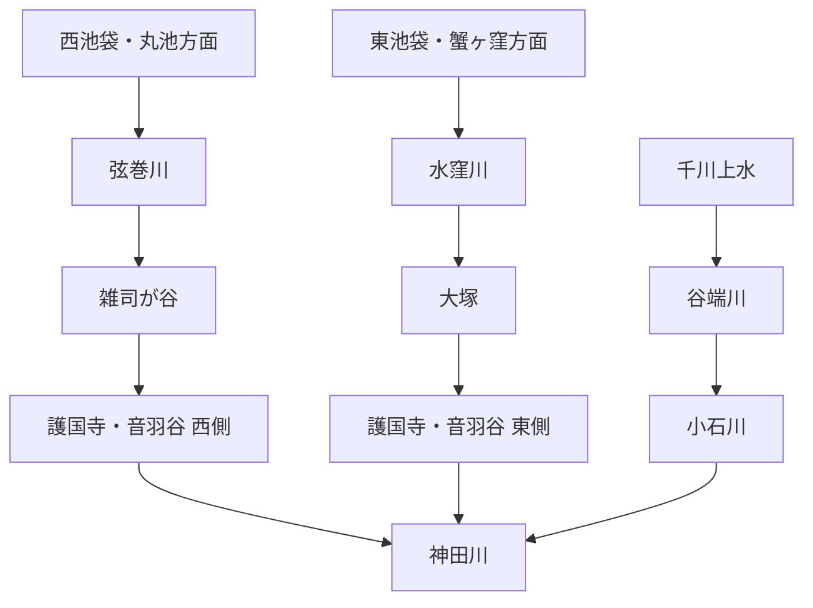

# otowa-ankyoscape

水窪川・弦巻川・谷端川と、その周辺の旧河道・暗渠・湧水・用水・土地利用について調べた記録です。

中心となる範囲は、池袋・雑司が谷・護国寺・音羽・小日向・小石川です。

> [!IMPORTANT]
> このリポジトリでは、既知の河川史をまとめるだけでなく、**まだ決着していない流路・接続・成立年代を史料から検証すること**を重視します。
> とくに「水窪川と弦巻川はどこかで合流していたのか」「音羽通り西側の弦巻川下流はいつ成立したのか」「弦巻川・水窪川側と谷端川側の更新世旧河道はどちら向きに流れていたのか」は中心的な未解決問題です。

  

幕末の音羽・雑司ヶ谷周辺を描いた尾張屋版 <i>Otowa ezu</i>。1851年近吾堂板とは別史料。画像をクリックすると合流問題の検討ページへ移動します。

## 未解決問題

このリポジトリの中心です。解決していない問題は川別の概要へ埋め込まず、できるだけ独立した文書として追跡します。

| 問題 | 現状 |
| --- | --- |
| **水窪川と弦巻川は合流していたのか** | [独立文書で検討中](docs/open-questions/水窪川と弦巻川の合流・接続問題.md) |
| **音羽谷西側の弦巻川下流はいつ成立したのか** | [独立文書で検討中](docs/open-questions/音羽谷西側の弦巻川下流の成立年代.md) |
| **更新世の旧河道はどちら向きに流れていたのか** | 滝口志郎（2019）が谷端川側への接続可能性を提示するが、流向は未決着 |
| **千川上水から弦巻川・水窪川へ直接分水したのか** | 谷端川への分水は確認できるが、両河川への直接分水は未確認 |

→ [未解決問題の一覧](docs/open-questions/README.md)

## 水系の全体像

これは近代以降に把握しやすい大まかな配置であり、全時代にそのまま当てはまるとは限りません。近世の造成・灌漑、近代の河川改修、暗渠化、下水道再編によって接続関係や流路が変化した可能性があります。

## 現時点で重要なこと

- **水窪川は、護国寺創建直後の1682年・1687年の江戸図で確認できる。** これは本調査による地図画像の観察であり、広域図なので弦巻川の不掲載を不存在の証明にはしない。  
  原資料：[1682年『増補江戸大絵図 絵入』](https://dl.ndl.go.jp/pid/1286182) / [1687年『ゑ入江戸大繪圖』](https://dl.ndl.go.jp/pid/2542450)
- **弦巻川の水源として丸池が公的資料に明記される。**  
  出典：豊島区公式 [「元池袋史跡公園」](https://www.city.toshima.lg.jp/340/shisetsu/koen/030.html)
- **1772年『武蔵国豊島郡雑司谷村絵図』は現存する。** 川筋の細部は高精細画像で再確認が必要。  
  出典：豊島区公式 [「豊島区地域地図集（複製）」](https://www.city.toshima.lg.jp/129/bunka/bunka/shiryokan/kankobutu/005951.html)、[NDLサーチ](https://ndlsearch.ndl.go.jp/books/R100000002-I000009123633)
- **1851年近吾堂板では、護国寺南西端から寺域外へ短く続く青い水路を本調査で確認している。** 「護国寺内で完全に終わる」という単純な読みは弱い。  
  原資料：[東京都立図書館『音羽目白雑司ケ谷辺絵図』](https://archive.library.metro.tokyo.lg.jp/da/detail?tilcod=0000000013-00042337)
- **1941年『「郷土の観察」の指導体系』には、音羽谷の川を水田開発時に一流から二流へ分けたのではないか、という趣旨の推測がある。** 工事記録ではなく、後世の地理的推論として扱う。  
  原資料：[国立国会図書館デジタルコレクション PID 1275204](https://dl.ndl.go.jp/pid/1275204)
- **1878年『東京府村誌』雑司ヶ谷村条の二次転記では、弦巻川は「西青柳町ニ通ス」とされる。** 原文確認前なので確定引用にはしない。  
  二次転記：[「雑司ヶ谷村用水」](https://ameblo.jp/kazuaruki/entry-12940940738.html)、原資料系統：[『皇国地誌稿本東京府誌』書誌](https://ci.nii.ac.jp/ncid/BB30888890)
- **谷端川は千川上水から分水を受けていた。** 一方、千川上水から弦巻川・水窪川へ直接送水した経路は未確認。  
  出典：練馬わがまち資料館 [「千川上水の分水を訪ねて（2）」](https://www.nerima-archives.jp/column/3572/)
- **谷端川の板橋側には、地域資料で「中丸川」「出端川」と呼ばれた支流が確認できる。** 板橋区教育委員会『いたばしの地名』（1995年3月、文化財シリーズ第81集）は板橋区立郷土資料館・国立国会図書館で書誌を確認できる。本文を引用・要約した二次資料によれば、中丸川は幸町に発して谷端川へ東西に流れた小川、出端川は大山町37番地付近から大山駅南側・東上線沿いを経て谷端川へ入る小川とされる。〔史料所在確認＋本文は二次転記〕  
  出端川について同転記は、両岸の低地が田の用水に使われ、農産物の洗い場が複数あったこと、千川用水の漏水を水源とする説があったことも伝える。したがって、谷端川と千川上水の関係は本流への分水だけでなく、**支流の灌漑・洗い場・漏水利用という局地的な水利用**からも検討する余地がある。ただし「千川用水漏水＝出端川の確定水源」とはしない。〔観察／仮説〕  
  また2026年7月更新の現地調査では、中丸川上流端や谷端川西側の複数地点について地籍図上の水路敷が照合されている。これは公図・地籍の直接史料ではなく現地調査者による読図なので、旧河道の確定線ではなく原公図を探すための手掛かりとする。〔観察〕  
  出典：板橋区立郷土資料館 [『いたばしの地名』刊行案内](https://www.city.itabashi.tokyo.jp/kyodoshiryokan/shuppan/3000113/3000138.html) / [NDLサーチ](https://ndlsearch.ndl.go.jp/books/R100000002-I000002431691) / 二次転記・現地照合：[出端川](https://lotus62ankyo.blog.jp/archives/7712076.html)、[中丸川](https://natrium.jp/canal_lot/yabata/yabata06/index.html)
- **1999年12月刊『旧谷端川の橋の跡を探る』は、谷端川に架かっていた67橋を写真と文章で追跡した橋梁・景観史料である。** 2000年1月21日付の豊島区広報課資料が刊行経緯と「67の橋」を明記し、CiNii Booksでは豊島区立郷土資料館友の会刊・35頁、編集協力：豊島区立郷土資料館として書誌を確認できる。〔確認〕  
  67という数は**谷端川に歴史上存在した橋の総数を確定する値とは限らず**、同冊子が調査・収録した橋の数として扱う。暗渠化前の橋位置、旧道との交差、欄干・橋跡の現況を点ごとに照合するための写真資料として価値が高い。〔観察〕  
  出典：豊島区広報課「かつて区内を流れていた川筋を辿って 冊子『旧谷端川の橋の跡を探る』」（2000年1月21日）[PDF](https://adeac.jp/viewitem/toshima-history/viewer/viewer/pressH120121/data/pressH120121.pdf) / [CiNii Books](https://ci.nii.ac.jp/ncid/BA46331735) / [S29/S09](docs/出典一覧.md)
- **更新世旧河道説は研究上の仮説である。** 滝口志郎（2019）は弦巻川の流路がかつて谷端川側へつながっていた可能性を提示するが、流向を確定したものではない。  
  出典：[深田地質研究所](https://fukadaken.or.jp/?page_id=6569) / [国立国会図書館](https://dl.ndl.go.jp/pid/14529520)
- **2008年時点の既設雑司ヶ谷幹線は、少なくとも雑司が谷一・二丁目～目白台二丁目の再構築区間で矩形渠 2,000×1,460 mm、施工延長598.75 mとして確認できる。** 東京都下水道局の報告書は、既設人孔8箇所・汚水ます83箇所を含む再構築工事とし、関連施設図では雑司ヶ谷幹線を神田川・後楽ポンプ所へ続く下水道系統として示す。また工事資料中では最下流で雨水・汚水面積48 haを受け持つとされる。〔確認〕  
  これは**暗渠化前の弦巻川河道が全区間そのまま現在の管路になったことを証明するものではない**。むしろ、1930年代の河道・暗渠と2008年の既設下水道施設を年代別に分けて比較するための基準資料とする。〔観察〕  
  出典：東京都下水道局『雑司ヶ谷幹線再構築工事事故調査報告書』（2008年9月1日）[国土交通省公開PDF](https://www.mlit.go.jp/common/000024056.pdf)

## 調査ノート

| テーマ | 文書 |
| --- | --- |
| **主要出典一覧** | [docs/出典一覧.md](docs/出典一覧.md) |
| 水窪川 | [docs/水窪川.md](docs/水窪川.md) |
| 弦巻川 | [docs/弦巻川.md](docs/弦巻川.md) |
| 谷端川 | [docs/谷端川.md](docs/谷端川.md) |
| 千川上水・更新世旧河道・音羽谷の二流など | [docs/横断テーマ.md](docs/横断テーマ.md) |
| 護国寺境内の旧水系 | [docs/護国寺境内の旧水系.md](docs/護国寺境内の旧水系.md) |
| 護国寺星谷の水系 | [docs/護国寺星谷の水系.md](docs/護国寺星谷の水系.md) |
| 『江戸名所図会』護国寺図の検討 | [docs/江戸名所図会・護国寺図の検討.md](docs/江戸名所図会・護国寺図の検討.md) |
| 歴史地形・流路シミュレーション方針 | [docs/歴史地形・流路シミュレーション方針.md](docs/歴史地形・流路シミュレーション方針.md) |
| 文書一覧 | [docs/README.md](docs/README.md) |

## 記号

- **〔確認〕** 一次史料、公的資料、測量図、複数資料などからかなり確実に言えること
- **〔観察〕** 古地図・地形図・写真の比較から読み取ったこと
- **〔推定〕** 複数の事実から自然に考えられるが、直接記録が未発見のこと
- **〔仮説〕** 検証中の説明
- **〔未解決〕** 現時点では判断できないこと

## 出典の扱い

分割後の本文では、**主張の直後から出典へ到達できること**を原則とします。共通書誌は [docs/出典一覧.md](docs/出典一覧.md) に整理しています。

分割前のREADME全文は、情報落ちを避けるため [docs/分割前README全文.md](docs/分割前README全文.md) に保存しています。ただし、これは調査経緯・旧出典番号の保存版であり、分割後の本文が出典を省略する理由にはしません。