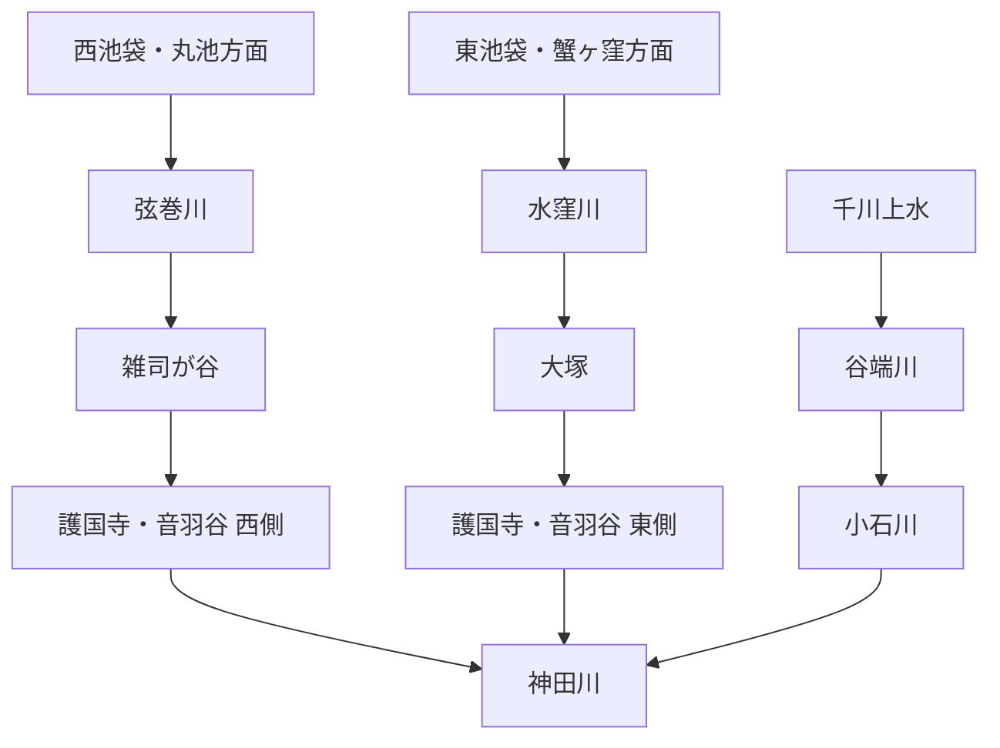

# otowa-ankyoscape

水窪川・弦巻川・谷端川と、その周辺の旧河道・暗渠・湧水・用水・土地利用について調べた記録です。

中心となる範囲は、池袋・雑司が谷・護国寺・音羽・小日向・小石川です。

> [!IMPORTANT]
> このリポジトリでは、既知の河川史をまとめるだけでなく、**まだ決着していない流路・接続・成立年代を史料から検証すること**を重視します。
> とくに「水窪川と弦巻川はどこかで合流していたのか」「音羽通り西側の弦巻川下流はいつ成立したのか」「弦巻川・水窪川側と谷端川側の更新世旧河道はどちら向きに流れていたのか」は中心的な未解決問題です。

  

幕末の音羽・雑司ヶ谷周辺を描いた尾張屋版 <i>Otowa ezu</i>。1851年近吾堂板とは別史料。画像をクリックすると合流問題の検討ページへ移動します。

## 未解決問題

このリポジトリの中心です。解決していない問題は川別の概要へ埋め込まず、できるだけ独立した文書として追跡します。

| 問題 | 現状 |
| --- | --- |
| **水窪川と弦巻川は合流していたのか** | [独立文書で検討中](docs/open-questions/水窪川と弦巻川の合流・接続問題.md) |
| **音羽谷西側の弦巻川下流はいつ成立したのか** | [独立文書で検討中](docs/open-questions/音羽谷西側の弦巻川下流の成立年代.md) |
| **更新世の旧河道はどちら向きに流れていたのか** | 滝口志郎（2019）が谷端川側への接続可能性を提示するが、流向は未決着 |
| **千川上水から弦巻川・水窪川へ直接分水したのか** | 谷端川への分水は確認できるが、両河川への直接分水は未確認 |

→ [未解決問題の一覧](docs/open-questions/README.md)

## 水系の全体像

これは近代以降に把握しやすい大まかな配置であり、全時代にそのまま当てはまるとは限りません。近世の造成・灌漑、近代の河川改修、暗渠化、下水道再編によって接続関係や流路が変化した可能性があります。

## 現時点で重要なこと

- **水窪川は、護国寺創建直後の1682年・1687年の江戸図で確認できる。** これは本調査による地図画像の観察であり、広域図なので弦巻川の不掲載を不存在の証明にはしない。  
  原資料：[1682年『増補江戸大絵図 絵入』](https://dl.ndl.go.jp/pid/1286182) / [1687年『ゑ入江戸大繪圖』](https://dl.ndl.go.jp/pid/2542450)
- **弦巻川の水源として丸池が公的資料に明記される。**  
  出典：豊島区公式 [「元池袋史跡公園」](https://www.city.toshima.lg.jp/340/shisetsu/koen/030.html)
- **文化年間の見聞記『遊歴雑記』には、丸池を村境と水利の観点から見る手掛かりがある。** 2024年の解説記事による二次転記では、丸池は以前より埋まりながらも当時なお「三百余坪」ほどあり、池袋村と雑司ヶ谷村の境付近で常時湧水していたとされる。さらに、その流出水を農業用水として利用する権利は雑司ヶ谷村側にあり、池袋村側は関与しなかったという趣旨の記述が紹介される。〔史料所在確認＋本文は二次転記〕  
  これは、丸池を単なる自然湧水ではなく、**村境を越えて雑司ヶ谷側の耕地を支える管理対象の水源だった可能性**を強める。ただし、水利権の法的性格・成立年代・取水施設の位置は未確認であり、『遊歴雑記』原本または翻刻該当頁の直接照合前に断定しない。〔観察／推定〕  
  また東京都公文書館には原図・彩色の『池袋村図』（1枚、93×118 cm、資料ID 000100349）が現存する。文政期の図として紹介される二次資料もあるが、公文書館目録自体には年代が明記されていないため、年代は原図・関連目録で再確認する。丸池・村境・弦巻川上流の位置関係を1772年雑司谷村絵図や近代地図と照合する候補一次史料とする。〔史料所在確認〕  
  出典：nippon.com [「池袋（JY13）: ホテルメトロポリタンあたりにあった農業用水の水源『丸池』が駅名の由来」](https://www.nippon.com/ja/japan-topics/c13306/) / 東京都公文書館 [『池袋村図（帙書：江戸各郷村図　坤）』](https://www.archives.metro.tokyo.lg.jp/detail?cls=collection_01&pkey=000100349) / 国立国会図書館 [『十方庵遊歴雑記 初編 上・中・下』書誌・デジタル資料](https://ndlsearch.ndl.go.jp/books/R100000002-I000000568769)
- **1772年『武蔵国豊島郡雑司谷村絵図』は現存する。** 川筋の細部は高精細画像で再確認が必要。  
  出典：豊島区公式 [「豊島区地域地図集（複製）」](https://www.city.toshima.lg.jp/129/bunka/bunka/shiryokan/kankobutu/005951.html)、[NDLサーチ](https://ndlsearch.ndl.go.jp/books/R100000002-I000009123633)
- **1851年近吾堂板では、護国寺南西端から寺域外へ短く続く青い水路を本調査で確認している。** 「護国寺内で完全に終わる」という単純な読みは弱い。  
  原資料：[東京都立図書館『音羽目白雑司ケ谷辺絵図』](https://archive.library.metro.tokyo.lg.jp/da/detail?tilcod=0000000013-00042337)
- **1941年『「郷土の観察」の指導体系』には、音羽谷の川を水田開発時に一流から二流へ分けたのではないか、という趣旨の推測がある。** 工事記録ではなく、後世の地理的推論として扱う。  
  原資料：[国立国会図書館デジタルコレクション PID 1275204](https://dl.ndl.go.jp/pid/1275204)
- **文政12年（1829）成立の幕府官撰地誌『御府内備考』は、護国寺門前の東西二流を同じ史料体系の中で区別している。** 東京都公文書館の原本目録では巻之五十「護国寺領三ヶ町」に東青柳町・西青柳町が収録されることを確認できる。東青柳町条の二次転記では、町内東寄りを北から南へ流れる細流を「幅九尺」とし、当時は古来の川名を知らないとしつつ、水上を「巣鴨村雑司ヶ谷村之内田場際」、流末を「鼠ヶ谷下水」とする。西青柳町条の二次転記では対になる細流を「里俗弦巻川」とし、こちらも流末では鼠ヶ谷下水と称したとされる。〔史料所在確認＋本文は二次転記〕  
  この記述が正しく転記されているなら、少なくとも江戸後期の書上では、**東側の水窪川系は音羽谷に入る段階で固有河川名が不明とされ、上流域は巣鴨村・雑司ヶ谷村の田場際に求められていた一方、西側は「弦巻川」という里俗名が明記されていた**ことになる。また「鼠ヶ谷下水」は両者の流末側をまとめて指し得る名称で、水窪川・弦巻川全区間の固有名とは区別して扱う必要がある。これは後世の「水窪川」「弦巻川」という二河川名を江戸期全区間へそのまま遡及させることへの注意材料にもなる。〔観察／推定〕  
  ただし、幅九尺や水上・流末の原文は今回『御府内備考』原本画像または公開翻刻該当頁を直接読めておらず、二次転記に依存する。国立国会図書館には1931年の『大日本地誌大系 第3巻 御府内備考』がインターネット公開されているため、該当頁を直接同定できた段階で再確認する。〔要原文照合〕  
  出典：東京都公文書館 [『御府内備考 巻之四十八～五十二』](https://www.archives.metro.tokyo.lg.jp/detail?cls=collection_01&pkey=000101055) / 国立国会図書館 [『大日本地誌大系 第3巻 御府内備考』](https://ndlsearch.ndl.go.jp/books/R100000039-I1214872)（1931年、インターネット公開） / 本文二次転記：[「水窪川」](https://ameblo.jp/kazuaruki/entry-12940940845.html)
- **1878年『東京府村誌』雑司ヶ谷村条の二次転記では、弦巻川は「西青柳町ニ通ス」とされる。** 原文確認前なので確定引用にはしない。  
  二次転記：[「雑司ヶ谷村用水」](https://ameblo.jp/kazuaruki/entry-12940940738.html)、原資料系統：[『皇国地誌稿本東京府誌』書誌](https://ci.nii.ac.jp/ncid/BB30888890)
- **谷端川は千川上水から分水を受けていた。** 一方、千川上水から弦巻川・水窪川へ直接送水した経路は未確認。  
  出典：練馬わがまち資料館 [「千川上水の分水を訪ねて（2）」](https://www.nerima-archives.jp/column/3572/)
- **谷端川一号幹線は、2001年時点で西池袋五丁目地先から池袋四丁目地先まで約1.6 kmが完成段階にあり、約3.2万トンを暫定貯留する計画だった。** 東京都議会公営企業委員会（2001年3月21日）で下水道局建設部長が、同年5月から暫定貯留を開始する予定と答弁している。〔確認〕  
  同答弁では、川越街道より北側は都市計画道路補助73号線が未整備で管渠を敷設できず、下流部の計画を変更して熊野神社付近へ主要枝線を敷設し、内径を計画2,200 mmから3,000 mmへ増径すると説明している。また山手通り横断部には4か所の伏せ越しがあり、他企業埋設物を避けるための暫定構造だったことも確認できる。したがって、現在の「谷端川」系下水道は旧河道をそのまま一本の暗渠として残したものではなく、都市計画道路・既設埋設物・浸水対策に応じて経路と機能を再編してきた系統として扱う必要がある。〔確認／観察〕  
  ただし、この2001年の谷端川一号幹線・主要枝線の中心線を近世・近代の谷端川旧河道と同一視しない。議会記録が直接示すのは当時の下水道計画と施設条件であり、旧河道との一致・不一致は古地図・地籍・下水道台帳との地点別照合が必要である。〔観察〕  
  出典：東京都議会 [『平成十三年 公営企業委員会速記録第三号』2001年3月21日](https://www.gikai.metro.tokyo.lg.jp/record/public-enterprise/2001-03.html)
- **谷端川の板橋側には、地域資料で「中丸川」「出端川」と呼ばれた支流が確認できる。** 板橋区教育委員会『いたばしの地名』（1995年3月、文化財シリーズ第81集）は板橋区立郷土資料館・国立国会図書館で書誌を確認できる。本文を引用・要約した二次資料によれば、中丸川は幸町に発して谷端川へ東西に流れた小川、出端川は大山町37番地付近から大山駅南側・東上線沿いを経て谷端川へ入る小川とされる。〔史料所在確認＋本文は二次転記〕  
  出端川について同転記は、両岸の低地が田の用水に使われ、農産物の洗い場が複数あったこと、千川用水の漏水を水源とする説があったことも伝える。したがって、谷端川と千川上水の関係は本流への分水だけでなく、**支流の灌漑・洗い場・漏水利用という局地的な水利用**からも検討する余地がある。ただし「千川用水漏水＝出端川の確定水源」とはしない。〔観察／仮説〕  
  また2026年7月更新の現地調査では、中丸川上流端や谷端川西側の複数地点について地籍図上の水路敷が照合されている。これは公図・地籍の直接史料ではなく現地調査者による読図なので、旧河道の確定線ではなく原公図を探すための手掛かりとする。〔観察〕  
  出典：板橋区立郷土資料館 [『いたばしの地名』刊行案内](https://www.city.itabashi.tokyo.jp/kyodoshiryokan/shuppan/3000113/3000138.html) / [NDLサーチ](https://ndlsearch.ndl.go.jp/books/R100000002-I000002431691) / 二次転記・現地照合：[出端川](https://lotus62ankyo.blog.jp/archives/7712076.html)、[中丸川](https://natrium.jp/canal_lot/yabata/yabata06/index.html)
- **1999年12月刊『旧谷端川の橋の跡を探る』は、谷端川に架かっていた67橋を写真と文章で追跡した橋梁・景観史料である。** 2000年1月21日付の豊島区広報課資料が刊行経緯と「67の橋」を明記し、CiNii Booksでは豊島区立郷土資料館友の会刊・35頁、編集協力：豊島区立郷土資料館として書誌を確認できる。〔確認〕  
  67という数は**谷端川に歴史上存在した橋の総数を確定する値とは限らず**、同冊子が調査・収録した橋の数として扱う。暗渠化前の橋位置、旧道との交差、欄干・橋跡の現況を点ごとに照合するための写真資料として価値が高い。〔観察〕  
  出典：豊島区広報課「かつて区内を流れていた川筋を辿って 冊子『旧谷端川の橋の跡を探る』」（2000年1月21日）[PDF](https://adeac.jp/viewitem/toshima-history/viewer/viewer/pressH120121/data/pressH120121.pdf) / [CiNii Books](https://ci.nii.ac.jp/ncid/BA46331735) / [S29/S09](docs/出典一覧.md)
- **谷端川下流の小石川では、旧初音町の中央を流れた水路が地域では「千川」と呼ばれ、少なくとも「嫁入橋」「柳橋」という橋名と、両岸の商店・縁日の記憶が残る。** 文京区公式の初音町町会ページは、2014年11月刊『六十年のあゆみ』掲載内容として、東部と西部の両岸を嫁入橋・柳橋が結び、源覚寺の縁日に両岸の商店と夜店が賑わったと回想する。また、交通量の増加と大雨による洪水被害を背景に「昭和の初期」に暗渠化されたとしている。〔公的掲載の地域回想〕  
  この「千川」を谷端川全流域の正式名称とみなさず、**小石川側下流区間の地域呼称・生活空間の記録**として扱う。暗渠化理由も行政の工事決裁ではなく地域史の回想なので、交通・洪水が暗渠化を促した事情を示す補助根拠に留める。嫁入橋・柳橋の位置と年代は、1883～84年の五千分一東京図や江戸切絵図、下水道台帳との照合余地がある。〔観察／要照合〕  
  出典：文京区公式 [「初音町町会」](https://www.city.bunkyo.lg.jp/b011/p001217.html)（文京区町会連合会創立60周年記念誌『六十年のあゆみ』、2014年11月掲載内容）
- **更新世旧河道説は研究上の仮説である。** 滝口志郎（2019）は弦巻川の流路がかつて谷端川側へつながっていた可能性を提示するが、流向を確定したものではない。  
  出典：[深田地質研究所](https://fukadaken.or.jp/?page_id=6569) / [国立国会図書館](https://dl.ndl.go.jp/pid/14529520)
- **2008年時点の既設雑司ヶ谷幹線は、少なくとも雑司が谷一・二丁目～目白台二丁目の再構築区間で矩形渠 2,000×1,460 mm、施工延長598.75 mとして確認できる。** 東京都下水道局の報告書は、既設人孔8箇所・汚水ます83箇所を含む再構築工事とし、関連施設図では雑司ヶ谷幹線を神田川・後楽ポンプ所へ続く下水道系統として示す。また工事資料中では最下流で雨水・汚水面積48 haを受け持つとされる。〔確認〕  
  これは**暗渠化前の弦巻川河道が全区間そのまま現在の管路になったことを証明するものではない**。むしろ、1930年代の河道・暗渠と2008年の既設下水道施設を年代別に分けて比較するための基準資料とする。〔観察〕  
  出典：東京都下水道局『雑司ヶ谷幹線再構築工事事故調査報告書』（2008年9月1日）[国土交通省公開PDF](https://www.mlit.go.jp/common/000024056.pdf)
- **江戸後期には、谷端川・小石川の川幅が道路敷などの埋立てで縮小していたとする地誌記述がある。** 『新編武蔵風土記稿』小石川村条の二次転記では、長崎村方面の細流が池袋・滝野川・巣鴨を経て小石川村に入り、下流で神田川へ合流する系統を「小石川幷谷端川」と記し、かつてはより大きな川だったが、後年「道敷等」による埋立てが進み、広い所でも川幅三～四間程度になったという趣旨を記す。また巣鴨村内では谷端川と称したとされる。〔史料所在確認＋本文は二次転記〕  
  これは近代の暗渠化以前にも、**道路化・土地利用による河道幅の人為的縮小が進んでいた可能性**を示す根拠になる。ただし、どの区間がいつ、何の事業で埋め立てられたかは本文だけでは特定できず、近代暗渠工事と同一視しない。〔観察／推定〕  
  位置を詰める一次史料候補として、東京都公文書館には享和元年十月（1801年）の彩色原図『豊島郡 巣鴨村図 共十六枚之内』（資料ID 000100341）が現存し、道・寺社・抱屋敷・田畑を色分けしている。二次的な画像読解では、谷端川を渡る「藤橋」や別称「コジキバシ」と読める橋名も報告されているが、橋名・位置は高精細原図で再確認するまで〔観察〕に留める。  
  出典：東京都公文書館 [『豊島郡 巣鴨村図 共十六枚之内』](https://www.archives.metro.tokyo.lg.jp/detail?cls=collection_01&pkey=000100341)（享和元年十月、資料ID 000100341） / 『新編武蔵風土記稿』小石川村条の二次転記：[「19番目の富士見坂（上）またの名を、あさみ坂」](https://fujimizaka.wordpress.com/2020/08/27/asami-saka/) / 巣鴨村図の橋名読解：[「19番目の富士見坂（中）大塚三業地」](https://fujimizaka.wordpress.com/2021/01/08/19th-fujimizaka/)
- **谷端川の豊島区内区間は、河川廃止から下水道幹線・覆蓋上公園・緑道へ段階的に転用された年代を公的資料で追える。** 豊島区公式の谷端川南・北緑道案内は、谷端川が昭和37年（1962年）に河川として廃止され、暗渠の下水道幹線として使用されるようになったと明記する。南側では都下水道局の承認を受け、昭和41年（1966年）に谷端川第1～第3児童遊園、昭和42年（1967年）に第4児童遊園、昭和55年（1980年）に遊歩道として覆蓋上部を開放した。北側では昭和46年（1971年）に第5児童遊園および遊歩道として開放している。〔確認〕  
  南緑道は昭和58年（1983年）から平成2年（1990年）にかけて改修整備され、西武池袋線～川越街道の約1.7 kmが現在の緑道となった。北側も平成2年（1990年）に改修され、西前橋～東武東上線下板橋駅前の区間が谷端川北緑道となり、両施設とも平成3年（1991年）4月開園とされる。〔確認〕  
  この時系列は、**「暗渠化した時点で直ちに現在の緑道になった」のではなく、河川廃止・下水道化の後、覆蓋上を児童遊園や遊歩道として段階的に開放し、1980年代末までに現在に近い線状緑地へ再整備した**ことを示す。一方、豊島区の案内だけでは1962年の河川廃止と各区間の実際の覆蓋工事完了日を同一日・同一工事とみなすことはできない。〔観察／注意〕  
  出典：豊島区公式 [「谷端川南緑道」](https://www.city.toshima.lg.jp/340/shisetsu/koen/033.html) / [「谷端川北緑道」](https://www.city.toshima.lg.jp/340/shisetsu/koen/042.html)

## 調査ノート

| テーマ | 文書 |
| --- | --- |
| **主要出典一覧** | [docs/出典一覧.md](docs/出典一覧.md) |
| 水窪川 | [docs/水窪川.md](docs/水窪川.md) |
| 弦巻川 | [docs/弦巻川.md](docs/弦巻川.md) |
| 谷端川 | [docs/谷端川.md](docs/谷端川.md) |
| 千川上水・更新世旧河道・音羽谷の二流など | [docs/横断テーマ.md](docs/横断テーマ.md) |
| 護国寺境内の旧水系 | [docs/護国寺境内の旧水系.md](docs/護国寺境内の旧水系.md) |
| 護国寺星谷の水系 | [docs/護国寺星谷の水系.md](docs/護国寺星谷の水系.md) |
| 『江戸名所図会』護国寺図の検討 | [docs/江戸名所図会・護国寺図の検討.md](docs/江戸名所図会・護国寺図の検討.md) |
| 歴史地形・流路シミュレーション方針 | [docs/歴史地形・流路シミュレーション方針.md](docs/歴史地形・流路シミュレーション方針.md) |
| 文書一覧 | [docs/README.md](docs/README.md) |

## 記号

- **〔確認〕** 一次史料、公的資料、測量図、複数資料などからかなり確実に言えること
- **〔観察〕** 古地図・地形図・写真の比較から読み取ったこと
- **〔推定〕** 複数の事実から自然に考えられるが、直接記録が未発見のこと
- **〔仮説〕** 検証中の説明
- **〔未解決〕** 現時点では判断できないこと

## 出典の扱い

分割後の本文では、**主張の直後から出典へ到達できること**を原則とします。共通書誌は [docs/出典一覧.md](docs/出典一覧.md) に整理しています。

分割前のREADME全文は、情報落ちを避けるため [docs/分割前README全文.md](docs/分割前README全文.md) に保存しています。ただし、これは調査経緯・旧出典番号の保存版であり、分割後の本文が出典を省略する理由にはしません。