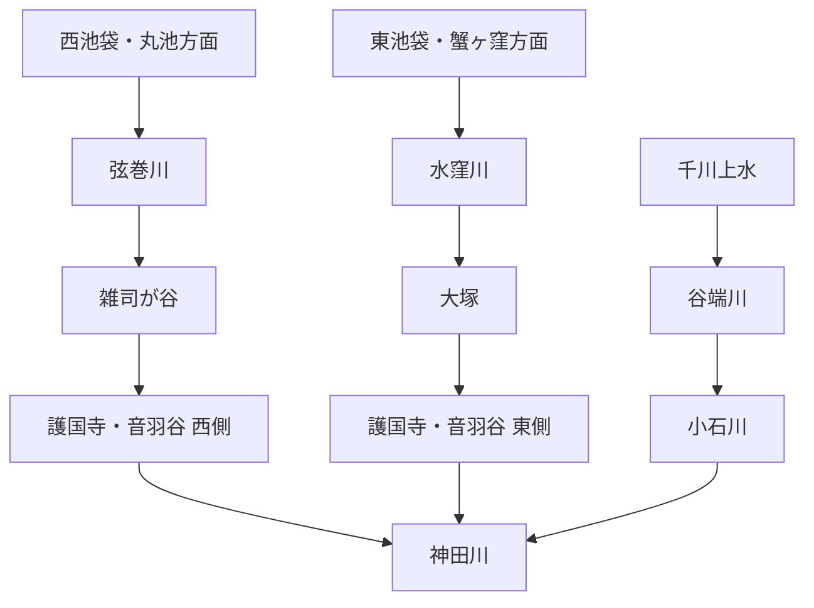

# otowa-ankyoscape

水窪川・弦巻川・谷端川と、その周辺の旧河道・暗渠・湧水・用水・土地利用について調べた記録です。

中心となる範囲は、池袋・雑司が谷・護国寺・音羽・小日向・小石川です。

> [!IMPORTANT]
> このリポジトリでは、既知の河川史をまとめるだけでなく、**まだ決着していない流路・接続・成立年代を史料から検証すること**を重視します。
> とくに「水窪川と弦巻川はどこかで合流していたのか」「音羽通り西側の弦巻川下流はいつ成立したのか」「弦巻川・水窪川側と谷端川側の更新世旧河道はどちら向きに流れていたのか」は中心的な未解決問題です。

  

幕末の音羽・雑司ヶ谷周辺を描いた尾張屋版 <i>Otowa ezu</i>。画像：David Rumsey Map Collection / Wikimedia Commons。1851年近吾堂版とは別史料。画像をクリックすると合流問題の検討ページへ移動します。

## 未解決問題

このリポジトリの中心です。解決していない問題は川別の概要へ埋め込まず、できるだけ独立した文書として追跡します。

| 問題 | 現状 |
| --- | --- |
| **水窪川と弦巻川は合流していたのか** | [独立文書で検討中](docs/open-questions/tsurumaki-mizukubo-confluence.md) |
| **音羽谷西側の弦巻川下流はいつ成立したのか** | 1681年前後の造成、水田開発・灌漑再編、段階的な水路拡張など複数案が残る |
| **更新世の旧河道はどちら向きに流れていたのか** | 谷筋の接続可能性はあるが流向は未決着 |
| **千川上水から弦巻川・水窪川へ直接分水したのか** | 谷端川への分水は確認できるが、両河川への直接分水は未確認 |

→ [未解決問題の一覧](docs/open-questions/README.md)

## 水系の全体像

これは近代以降に把握しやすい大まかな配置であり、全時代にそのまま当てはまるとは限りません。近世の造成・灌漑、近代の河川改修、暗渠化、下水道再編によって接続関係や流路が変化した可能性があります。

## 調査ノート

| テーマ | 文書 |
| --- | --- |
| 水窪川 | [docs/mizukubo-gawa.md](docs/mizukubo-gawa.md) |
| 弦巻川 | [docs/tsurumaki-gawa.md](docs/tsurumaki-gawa.md) |
| 谷端川 | [docs/tanibata-gawa.md](docs/tanibata-gawa.md) |
| 千川上水・更新世旧河道・音羽谷の二流など | [docs/cross-cutting-themes.md](docs/cross-cutting-themes.md) |
| 護国寺周辺の水系 | [docs/gokokuji-water-system.md](docs/gokokuji-water-system.md) |
| 護国寺星谷の水系 | [docs/gokokuji-hoshiyato-water-system.md](docs/gokokuji-hoshiyato-water-system.md) |
| 『江戸名所図会』護国寺図の検討 | [docs/gokokuji-edo-meisho-zue-analysis.md](docs/gokokuji-edo-meisho-zue-analysis.md) |
| 歴史地形・流向シミュレーション計画 | [docs/historical-terrain-and-flow-simulation-plan.md](docs/historical-terrain-and-flow-simulation-plan.md) |
| 文書一覧 | [docs/README.md](docs/README.md) |

## 現時点で重要なこと

- 水窪川は、護国寺創建直後の1682年・1687年の江戸図で確認できる。
- 弦巻川は丸池を水源とすることが豊島区資料で確認でき、1772年の雑司谷村絵図にも川筋が描かれている可能性が高い。ただし原図・高精細複製での再確認が必要。
- 1851年の切絵図では、弦巻川とみられる水路が護国寺南西端を越えて寺域外へ短く続く。したがって「護国寺内で完全に終わり、そこで水窪川へ合流した」とする単純な読みは弱い。
- 1878年『東京府村誌』雑司ヶ谷村条の二次転記では、弦巻川は「西青柳町ニ通ス」とされる。原文確認が取れれば、合流問題と西側下流河道の成立問題の双方で重要な史料になる。
- 谷端川は千川上水から分水を受けていた。一方、千川上水から弦巻川・水窪川へ直接送水した経路は未確認。
- 深田地質研究所の2019年論文は、弦巻川・水窪川上流の高い河床を更新世の旧河道とみて谷端川側へつながる可能性を示す。ただし流向は決着していない。
- 近代以降は暗渠化だけでなく、流路付け替え・下水道幹線への接続・流域切替も起きているため、現在の管路と旧自然河道を一対一で対応させない。

## 記号

- **〔確認〕** 一次史料、公的資料、測量図、複数資料などからかなり確実に言えること
- **〔観察〕** 古地図・地形図・写真の比較から読み取ったこと
- **〔推定〕** 複数の事実から自然に考えられるが、直接記録が未発見のこと
- **〔仮説〕** 検証中の説明
- **〔未解決〕** 現時点では判断できないこと

## 詳細記録について

分割前のREADME全文は、情報落ちを避けるため [docs/research-notes-full.md](docs/research-notes-full.md) に保存しています。出典番号 `[Sxx]`・`[Bxx]`・`[Mxx]` を含む詳細な調査経緯や追加調査ログは、当面こちらを参照してください。

今後は、新しい調査結果をまず該当する未解決問題・川別・テーマ別文書へ追記し、READMEには全体像と現在の論点だけを残す方針です。
