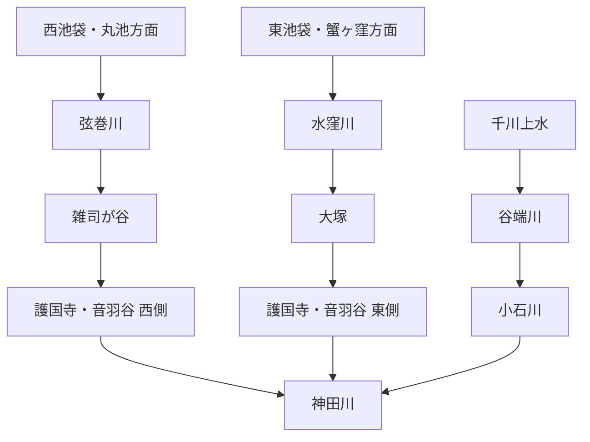

# otowa-ankyoscape

水窪川・弦巻川・谷端川と、その周辺の旧河道・暗渠・湧水・用水・土地利用について調べた記録です。

中心となる範囲は、池袋・雑司が谷・護国寺・音羽・小日向・小石川です。

> [!IMPORTANT]
> 史料から確認できる事実、地図からの観察、推定・仮説を区別して扱います。
> とくに「弦巻川・水窪川は更新世に谷端川水系へつながっていたのか」「音羽通り西側の弦巻川下流はいつ成立したのか」は未解決です。

## 水系の全体像

ただし、この水系配置が自然状態からそのまま続いていたとは限りません。近世の造成・灌漑、近代の河川改修、暗渠化、下水道再編が重なっています。

## 調査ノート

| テーマ | 文書 |
| --- | --- |
| 水窪川 | [docs/mizukubo-gawa.md](docs/mizukubo-gawa.md) |
| 弦巻川 | [docs/tsurumaki-gawa.md](docs/tsurumaki-gawa.md) |
| 谷端川 | [docs/tanibata-gawa.md](docs/tanibata-gawa.md) |
| 千川上水・更新世旧河道・音羽谷の二流など | [docs/cross-cutting-themes.md](docs/cross-cutting-themes.md) |
| 護国寺周辺の水系 | [docs/gokokuji-water-system.md](docs/gokokuji-water-system.md) |
| 護国寺星谷の水系 | [docs/gokokuji-hoshiyato-water-system.md](docs/gokokuji-hoshiyato-water-system.md) |
| 『江戸名所図会』護国寺図の検討 | [docs/gokokuji-edo-meisho-zue-analysis.md](docs/gokokuji-edo-meisho-zue-analysis.md) |
| 歴史地形・流向シミュレーション計画 | [docs/historical-terrain-and-flow-simulation-plan.md](docs/historical-terrain-and-flow-simulation-plan.md) |
| 文書一覧 | [docs/README.md](docs/README.md) |

## 現時点で重要なこと

- 水窪川は、護国寺創建直後の1682年・1687年の江戸図で確認できる。
- 弦巻川は丸池を水源とすることが豊島区資料で確認でき、1772年の雑司谷村絵図にも川筋が描かれている可能性が高い。ただし原図・高精細複製での再確認が必要。
- 1851年の切絵図では、弦巻川とみられる水路が護国寺南西端を越えて寺域外へ短く続く。したがって「護国寺内で完全に終わっていた」とする読みは弱い。
- 谷端川は千川上水から分水を受けていた。一方、千川上水から弦巻川・水窪川へ直接送水した経路は未確認。
- 深田地質研究所の2019年論文は、弦巻川・水窪川上流の高い河床を更新世の旧河道とみて谷端川側へつながる可能性を示す。ただし流向は決着していない。
- 近代以降は暗渠化だけでなく、流路付け替え・下水道幹線への接続・流域切替も起きているため、現在の管路と旧自然河道を一対一で対応させない。

## 記号

- **〔確認〕** 一次史料、公的資料、測量図、複数資料などからかなり確実に言えること
- **〔観察〕** 古地図・地形図・写真の比較から読み取ったこと
- **〔推定〕** 複数の事実から自然に考えられるが、直接記録が未発見のこと
- **〔仮説〕** 検証中の説明
- **〔未解決〕** 現時点では判断できないこと

## 詳細記録について

分割前のREADME全文は、情報落ちを避けるため [docs/research-notes-full.md](docs/research-notes-full.md) に保存しています。出典番号 `[Sxx]`・`[Bxx]`・`[Mxx]` を含む詳細な調査経緯や追加調査ログは、当面こちらを参照してください。

今後は、新しい調査結果をまず該当テーマの文書へ追記し、READMEには全体像と重要な結論だけを残す方針です。
