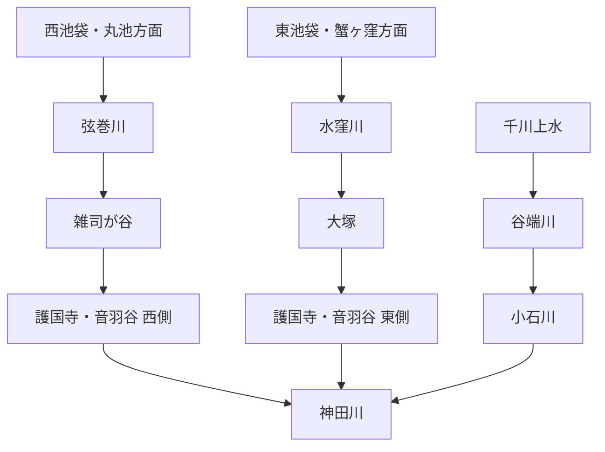

# otowa-ankyoscape

水窪川・弦巻川・谷端川と、その周辺の旧河道・暗渠・湧水・用水・土地利用について調べた記録です。

中心となる範囲は、池袋・雑司が谷・護国寺・音羽・小日向・小石川です。

> [!IMPORTANT]
> このリポジトリでは、既知の河川史をまとめるだけでなく、**まだ決着していない流路・接続・成立年代を史料から検証すること**を重視します。
> とくに「水窪川と弦巻川はどこかで合流していたのか」「音羽通り西側の弦巻川下流はいつ成立したのか」「弦巻川・水窪川側と谷端川側の更新世旧河道はどちら向きに流れていたのか」は中心的な未解決問題です。

  

幕末の音羽・雑司ヶ谷周辺を描いた尾張屋版 <i>Otowa ezu</i>。1851年近吾堂板とは別史料。画像をクリックすると合流問題の検討ページへ移動します。

## 未解決問題

このリポジトリの中心です。解決していない問題は川別の概要へ埋め込まず、できるだけ独立した文書として追跡します。

| 問題 | 現状 |
| --- | --- |
| **水窪川と弦巻川は合流していたのか** | [独立文書で検討中](docs/open-questions/水窪川と弦巻川の合流・接続問題.md) |
| **音羽谷西側の弦巻川下流はいつ成立したのか** | [独立文書で検討中](docs/open-questions/音羽谷西側の弦巻川下流の成立年代.md) |
| **更新世の旧河道はどちら向きに流れていたのか** | 滝口志郎（2019）が谷端川側への接続可能性を提示するが、流向は未決着 |
| **千川上水から弦巻川・水窪川へ直接分水したのか** | 谷端川への分水は確認できるが、両河川への直接分水は未確認 |

→ [未解決問題の一覧](docs/open-questions/README.md)

## 水系の全体像

これは近代以降に把握しやすい大まかな配置であり、全時代にそのまま当てはまるとは限りません。近世の造成・灌漑、近代の河川改修、暗渠化、下水道再編によって接続関係や流路が変化した可能性があります。

## 現時点で重要なこと

- **水窪川は、護国寺創建直後の1682年・1687年の江戸図で確認できる。** これは本調査による地図画像の観察であり、広域図なので弦巻川の不掲載を不存在の証明にはしない。  
  原資料：[1682年『増補江戸大絵図 絵入』](https://dl.ndl.go.jp/pid/1286182) / [1687年『ゑ入江戸大繪圖』](https://dl.ndl.go.jp/pid/2542450)
- **水窪川流域では、大正期に湧水を利用する紙漉き業者が音羽から移住したという地域記録があり、昭和40年（1965年）以前には大雨時の浸水被害も多かったとされる。** 豊島区広報課の1999年10月9日付資料は、水窪川を「昭和初期から戦後にかけて下水化される以前」の小流として説明したうえで、**大正期に流域の湧き水を利用する紙漉き業者が音羽から多く移り住んだ**こと、また**昭和40年以前には大雨で浸水被害が多かった**ことが地域で語られていると記す。〔公的資料に収録された地域聞き取り〕  
  この記録は、水窪川上流～中流域の湧水が農業だけでなく近代の小規模工業にも利用された可能性と、下水化後も低地・旧河道に洪水脆弱性が残った可能性を示す。ただし、紙漉き業者の具体的な所在地・人数・工房名、利用した湧水地点、1965年以前の各浸水地点は同資料だけでは特定できないため、商工名鑑・住宅地図・水害記録・聞き取り原資料との照合が必要である。〔観察／推定／要照合〕  
  出典：豊島区広報課「水窪川をたどって」関連プレス資料（1999年10月9日）[PDF](https://adeac.jp/viewitem/toshima-history/viewer/viewer/pressH111009/data/pressH111009.pdf)
- **1999年の豊島区立郷土資料館フィールドワークは、旧造幣局脇の水窪川跡で、排水溝跡と大谷石の塀並みを現地観察している。** 豊島区広報課資料は、マンホール蓋を辿るように続く造幣局脇の細道に「排水溝の跡」や「護岸用として作られたと思われる大谷石の塀並み」が見られ、道が曲がりくねり、周囲の高台から一段低くなっている様子から、かつての流れを想像していたと記す。〔公的資料に記録された現地観察〕  
  これは、東池袋の旧河道候補を道路線形だけでなく、**1999年時点に観察された排水施設・石積み・微地形**を重ねて検証できる地点情報になる。ただし資料自体が大谷石を「護岸用と思われる」と推定しており、石積みの築造年・原位置・水窪川との直接関係は未確認である。現在も同じ遺構が残るとはみなさず、旧造幣局配置図・地籍・下水道図と照合する。〔観察／推定／要照合〕  
  出典：豊島区広報課「[失われた水辺を探る 水窪川跡を辿るフィールドワーク開催](https://adeac.jp/viewitem/toshima-history/viewer/viewer/pressH111009/data/pressH111009.pdf)」（1999年10月9日）
- **音羽の紙漉業は、少なくとも1876年（明治9）には同業者集団としてまとまりを持っていた可能性を示す由緒が残る。** 今宮神社（現・音羽1-4-4）の境内末社・天日鷲神社について、現地由緒板を転記した資料は、**明治9年に「音羽の紙漉家一同」によって阿波国忌部神社から勧請・建立された**と記す。別の神社解説・地域事業者による紹介も同じ由緒を伝え、天日鷲命を紙祖神として紙漉家が商売繁盛を願ったものと説明する。〔現地由緒板の二次転記＋複数二次資料〕  
  これは、既収録の「大正期に音羽から水窪川流域へ紙漉き業者が移住し、湧水を利用した」という地域記録に対し、**その移住以前の1876年時点で音羽に複数の紙漉業者からなる職業集団が存在した可能性を独立に強める**。一方、天日鷲神社の由緒だけでは各工房の所在地・人数・使用水源を特定できず、1876年の紙漉家が水窪川・弦巻川の水を直接利用していたとも断定できない。勧請・建立の原典となる社伝、棟札、神社明細帳等と、明治期の営業人名録・地籍・工場資料を照合する。〔観察／既存仮説を強める根拠／要原典照合〕  
  出典：今宮神社境内掲示の転記：[江戸御府内千社参詣「第二七一回 今宮神社（音羽）」](https://ameblo.jp/benben7887/entry-12065296757.html) / [Monumento「今宮神社御由緒（通称今宮五社）」](https://monumen.to/spots/3981) / 補助確認：[神社と御朱印「今宮神社（今宮五社）」](https://jinja.tokyolovers.jp/tokyo/bunkyo/otowa-imamiyajinja) / [文京組版「文京区について」](https://bunkyo-kumihan.com/bunkyo.html)
- **旧巣鴨刑務所の排水施設と水窪川を結び付ける現存遺構候補が、東池袋四丁目に移設・保存されている。** IKE・SUNPARK（としまみどりの防災公園、東池袋4-42）に保存された石積みについて、現地解説板を撮影・転記した2023年の現地記録は「かつてこの石積みは巣鴨刑務所の排水口として、この周辺を流れていた水窪川（現・暗渠）につながっていたのではないかと考えられています」と説明している。CBCテレビ『道との遭遇』（2025年4月15日放送）の記事でも同じ石造排水口跡が写真付きで紹介される。〔現存遺構・現地解説板の二次確認／写真観察〕  
  豊島区公式資料は現在の公園が**造幣局東京支局跡地**に2020年12月開園し、所在地が東池袋4丁目42番であることを確認できる。この遺構が巣鴨刑務所の排水口であったこと、さらに水窪川へ接続した可能性は、**監獄・刑務所という近代土地利用の排水系と水窪川上流～中流部を結ぶ手掛かり**になる。ただし、解説板自体が接続を推定形で記しており、排水口の築造年・原位置・排水管路・水窪川との接続点は未確認である。現在の展示位置を旧河道や排水口の原位置とみなさず、巣鴨監獄・刑務所の配置図、下水・営繕図、地籍図で照合する。〔観察／仮説を強める根拠／要照合〕  
  出典：豊島区公式 [「としまみどりの防災公園（愛称：IKE・SUNPARK）」](https://www.city.toshima.lg.jp/340/shisetsu/koen/2009031543.html)（東池袋4-42、2020年12月開園） / 現地解説板の転記・写真：[帝都を歩く「巣鴨刑務所の跡地にできた防災公園『イケ・サンパーク』」](https://teitowalk.blog.jp/archives/86580769.html)（2023年1月8日） / CBCテレビ『道との遭遇』2025年4月15日放送の写真・紹介：[Locipo「東京都・池袋はかつて田畑や沼地だった！？池袋が大都市に発展した経緯とは」](https://locipo.jp/media/entertainment/entry-4003.html)（2025年5月16日）
- **2026年の雑司ケ谷霊園研究は、「水久保」周辺から霊園内へ流れ込んだ可能性のある別の水路を、戦後の記憶と旧土地利用から具体化している。** 山本瞳・薬袋奈美子「雑司ケ谷霊園の形成過程に関する研究」（『日本女子大学紀要 家政学系』73、2026年、pp.103–110）は、近隣住民への聞き取りとして、昭和34年（1959年）頃に雑司ヶ谷へ移住した人物が、当時の霊園内で**現在の1種5号と8号の間を南北に通る通路付近に水路があった**と記憶していることを報告する。また、夏目漱石墓所付近には以前の宅地に伴う古井戸があり、論文は、当時「水久保」と呼ばれた現在の霊園北部・南池袋二丁目～東池袋五丁目付近の田畑から、その古井戸を結ぶように水が流れていたとすれば位置関係が整合し、聞き取りの水路と同一である可能性を検討している。〔学術論文／聞き取り＋推定〕  
  この水路を直ちに水窪川本流とはみなさない。むしろ、既知の水窪川上流とされる美久仁小路・東池袋側の谷筋に加えて、**水久保の田畑―雑司ケ谷霊園北部―霊園内古井戸周辺に、戦後まで残った支流・排水路・湧水路の可能性**が出たものとして扱う。東京都交通局の公式沿線資料でも、現在の東池袋四丁目停留場は1925年11月の開業時に「水久保停留場」と呼ばれ、1939年に「日出町二丁目」へ改称したと確認できるため、「水久保」という地名が少なくとも大正末～昭和初期にこの周辺で現役だったことも独立に確認できる。〔確認／観察〕  
  ただし、論文が示す「水久保」の範囲と旧字界、水路の水源・流向、既知の水窪川本流との接続は未確定である。霊園拡張前後の地籍図・墓地平面図・1920～1950年代の地形図や航空写真と照合し、別支流なのか本流の旧線なのかを検証する必要がある。〔未解決〕  
  出典：山本瞳・薬袋奈美子「[雑司ケ谷霊園の形成過程に関する研究 ―従前の土地利用と墓地政策の観点から―](https://jwu.repo.nii.ac.jp/records/2000742)」『日本女子大学紀要 家政学系』73（2026年3月、pp.103–110、DOI:10.57483/0002000742） / 東京都交通局「さくらたび。」[「vol.15 東池袋四丁目」](https://toden-sakuratabi.jp/column/todenpedia/15/)
- **東池袋五丁目30番7号の第1辻広場（富士山広場）は、1986年度に整備され、水窪川を記憶する碑と流れを模した造形が置かれている。** 豊島区『公共施設の概要（令和5年度）』は第1辻広場（富士山広場）を**東池袋5丁目30番7号、竣工年度S61、土地面積65.17 m²**と記録する。現地写真を掲載する複数資料では、「昔ここに小さな川が流れていた。後世にこれを伝える」と刻まれた「水窪川の碑」と、地表に川筋を模した造形が確認でき、碑には1986年の年記があると報告されている。〔公的施設台帳確認＋写真観察〕  
  これは水窪川の実流路・暗渠化年代を直接示す史料ではなく、**暗渠化後の旧河道の記憶が1986年度までに番地を伴う公共空間として固定された**ことを示す資料として扱う。広場内の造形線を暗渠化前の河道中心線とみなさず、碑の設置主体・正確な設置日・旧河道との位置関係は当時の整備図や区資料で再確認する。〔観察／注意／要照合〕  
  出典：豊島区『[公共施設の概要（令和5年度）](https://www.city.toshima.lg.jp/066/kuse/shisaku/shisaku/hakusho/011708/documents/r5_koukyousisetunogaiyou.pdf)』 / 現地写真・碑文の二次確認：[「水窪川」](https://ameblo.jp/kazuaruki/entry-12940940845.html) / [「池袋～巣鴨①(小公園廻りと水窪川跡)」](https://ameblo.jp/eno-sawan/entry-12098846421.html)
- **弦巻川の水源として丸池が公的資料に明記される。**  
  出典：豊島区公式 [「元池袋史跡公園」](https://www.city.toshima.lg.jp/340/shisetsu/koen/030.html)
- **明治11年（1878）の『東京府村誌』は、丸池と弦巻川の規模・流向・灌漑利用を数量付きで記したとされる。** 同書雑司ヶ谷村条の二次転記では、丸池を「本村ノ西」にある**東西6間・南北5間・周囲30間**の池で「弦巻川ノ源」、また「或ハ田ノ用水ト為ル」と記し、弦巻川については丸池から一条の流れとなって**村中央を東流し、西青柳町へ入る**とする。あわせて雑司ヶ谷村の水田を5町3畝15歩、畑を70町余とする数値も紹介されている。〔本文は二次転記／原典所在確認〕  
  これは、既収録の「丸池＝弦巻川水源」「雑司ヶ谷の用水」という理解に対し、**1878年という時点、池の寸法、流向、田用水利用を具体化する補強材料**になる。一方、水田の全てが弦巻川灌漑だったこと、丸池の1878年時点の実水面が常にこの寸法だったこと、現在の元池袋史跡公園位置を当時の池中心と同一視することはできない。東京都公文書館所蔵原本または影印で雑司ヶ谷村条の文字・数値を直接確認するまでは〔確認〕に上げない。〔観察／既存理解を強める根拠／要原典照合〕  
  出典：二次転記：[「雑司ヶ谷村用水」](https://ameblo.jp/kazuaruki/entry-12940940738.html) / 原典所在・影印書誌：CiNii Research [『皇国地誌稿本東京府誌』](https://cir.nii.ac.jp/crid/1971712334789334309)（東京都公文書館所蔵『東京府村誌』全15冊・函架番号654-16-CI302～317の影印を含む）
- **現在の元池袋史跡公園の位置を、丸池そのものの位置と無補正で同一視してはならない。** 豊島区公式「元池袋史跡公園」は、丸池跡地にあった旧「元池袋公園」が**下水道工事のため隣接する現在地と土地を交換**し、平成10年（1998年）4月に「元池袋史跡公園」として開園したと明記する。〔確認〕  
  したがって、現在の公園・「池袋地名ゆかりの池」碑の座標は、丸池の池面中心・湧水点・旧公園の位置をそのまま示す基準点にはできない。丸池の正確な位置復元には、移転前の元池袋公園の敷地、土地交換の対象筆、下水道工事図面、旧地籍・旧版地図を別途照合する必要がある。〔観察／注意〕  
  出典：豊島区公式 [「元池袋史跡公園」](https://www.city.toshima.lg.jp/340/shisetsu/koen/030.html)（更新2024年10月23日、開園1998年4月）
- **文化年間の見聞記『遊歴雑記』には、丸池を村境と水利の観点から見る手掛かりがある。** 2024年の解説記事による二次転記では、丸池は以前より埋まりながらも当時なお「三百余坪」ほどあり、池袋村と雑司ヶ谷村の境付近で常時湧水していたとされる。さらに、その流出水を農業用水として利用する権利は雑司ヶ谷村側にあり、池袋村側は関与しなかったという趣旨の記述が紹介される。〔史料所在確認＋本文は二次転記〕  
  これは、丸池を単なる自然湧水ではなく、**村境を越えて雑司ヶ谷側の耕地を支える管理対象の水源だった可能性**を強める。ただし、水利権の法的性格・成立年代・取水施設の位置は未確認であり、『遊歴雑記』原本または翻刻該当頁の直接照合前に断定しない。〔観察／推定〕  
  また東京都公文書館には原図・彩色の『池袋村図』（1枚、93×118 cm、資料ID 000100349）が現存する。文政期の図として紹介される二次資料もあるが、公文書館目録自体には年代が明記されていないため、年代は原図・関連目録で再確認する。丸池・村境・弦巻川上流の位置関係を1772年雑司谷村絵図や近代地図と照合する候補一次史料とする。〔史料所在確認〕  
  出典：nippon.com [「池袋（JY13）: ホテルメトロポリタンあたりにあった農業用水の水源『丸池』が駅名の由来」](https://www.nippon.com/ja/japan-topics/c13306/) / 東京都公文書館 [『池袋村図（帙書：江戸各郷村図　坤）』](https://www.archives.metro.tokyo.lg.jp/detail?cls=collection_01&pkey=000100349) / 国立国会図書館 [『十方庵遊歴雑記 初編 上・中・下』書誌・デジタル資料](https://ndlsearch.ndl.go.jp/books/R100000002-I000000568769)
- **1772年『武蔵国豊島郡雑司谷村絵図』は現存する。** 川筋の細部は高精細画像で再確認が必要。  
  出典：豊島区公式 [「豊島区地域地図集（複製）」](https://www.city.toshima.lg.jp/129/bunka/bunka/shiryokan/kankobutu/005951.html)、[NDLサーチ](https://ndlsearch.ndl.go.jp/books/R100000002-I000009123633)
- **嘉永6年（1853）の柳下家文書に、弦巻川の橋梁を上流から列挙した書上があるという具体的な史料同定候補が得られた。** 現地調査者による二次転記は、史料名を「雑司ヶ谷村ほか沿革起立書上」（1772年村絵図と同じ柳下家文書）とし、上流から「卒トハ橋」、無名の石橋・土橋類、鎌倉橋、木村橋、南坂橋、丸太投渡橋、弦巻橋、松屋橋、境橋、末尾の石橋まで**計12箇所**を列挙する。橋種も「石橋」「土橋」「板橋」「丸太投渡橋」などと記されるという。〔本文は二次転記／史料同定候補〕  
  これが原文どおりなら、1853年時点の弦巻川を、単なる一本の線ではなく**橋名・橋種・順序を伴う連続した地点列**として復元できる。とくに木村橋は清立院下・御嶽権現社前、弦巻橋・松屋橋・境橋は下流側の道路交差を絵図・地籍と照合する基準点になり得る。一方、リポジトリ内の既存ノートではこれまで橋名資料の正式名称・成立年を固定できていなかったため、今回の情報はその未同定状態を一段進める。ただし、豊島区立郷土資料館等の原文画像・目録で「雑司ヶ谷村ほか沿革起立書上」という表題、嘉永6年の年記、12橋の転記を直接確認できていないので〔確認〕には上げない。〔観察／要原文照合〕  
  出典：二次転記：[「雑司ヶ谷村用水」](https://ameblo.jp/kazuaruki/entry-12940940738.html) / 柳下家文書が雑司ヶ谷村史料として『豊島区史』資料編に利用されていることの学術的確認：[横浜商科大学紀要掲載論文](https://ycc.repo.nii.ac.jp/record/1213/files/KJ00004472974.pdf)（注7に「旧豊島郡雑司ヶ谷村柳下家文書『文政元年人別帳』」）
- **弦巻川には、暗渠化前の流況・微地形・生態を伝える1993年の地域聞き取りがある。** 葉上太郎（2026）が地域情報誌『坂まち通信』第2号（1993年）から紹介する証言では、弦巻川沿いに原っぱと小さな段差による「滝」があり、周辺は昔からホタルの名所だったこと、川の水深が膝ほどだったことが語られている。また豊島区立郷土資料館刊『豊島の歳時記』には、春の七草のセリを川沿いで摘んだという生活記憶もあると紹介される。〔本文は二次転記／地域聞き取り〕  
  これは弦巻川を単なる灌漑線・下水線ではなく、暗渠化以前には**局所的な落差、水深、生物相、採取利用を伴う生活水路**だったことを示す手掛かりになる。ただし、『坂まち通信』第2号の原誌面・証言者・証言地点、また『豊島の歳時記』の該当巻・頁を今回直接確認していないため、「滝」の位置や水深を流路全体へ一般化しない。〔観察／要原文照合〕  
  出典：葉上太郎「[かつて池袋には“大洪水を招く川”が流れていた…戦前に封印された『弦巻川』が“再び猛威をふるう”衝撃の未来とは](https://bunshun.jp/articles/-/88508)」文春オンライン（2026年6月8日、地域情報誌『坂まち通信』第2号〔1993年〕および豊島区立郷土資料館『豊島の歳時記』を紹介） / 『坂まち通信』の編集人が岩田智明であったことの補助確認：[「雑司が谷 路地裏縁側日記」](https://tabineko.seesaa.net/article/200549108.html)（2011年5月11日）
- **弦巻川上流を西池袋側まで追うには、1911年と1925年の5千分1級の町村図が重要な候補になる。** 1911年7月刊の『東京府北豊島郡高田村豊多摩郡戸塚村』は、逓信協会刊・著作権所有者東京逓信管理局の**番地界入5千分1図**としてCiNii Booksで原図書誌を確認でき、国立国会図書館には東京逓信管理局著の復刻版『北豊島郡高田村・豊多摩郡戸塚村全図 番地界入』が所蔵される。豊島区立郷土資料館の公式「豊島区地域地図集（複製）」には、1925年4月10日発行の『東京府下高田町・戸塚町』が第1集収録図として掲げられている。〔史料所在確認〕  
  これらを用いた現地調査者の二次読図では、陸地測量部の大正期1万分1地形図で見える上流端よりさらに西へ、**西武池袋線を越える側まで弦巻川系と解釈される水路表現が続く**とされる。したがって、丸池・旧元池袋公園・池袋駅西側の流路を復元する際には、1万分1地形図だけで上流端を固定しない方がよい。〔二次読図／観察〕  
  ただし、今回1911年図・1925年図の高精細原図を直接読図して水路線を確定したわけではない。西武池袋線以西のどの線を弦巻川本流・支流・用水とみなすか、また1911年図の刊行年をそのまま流路成立年とみなせるかは未確認であり、原図・地番界・旧地籍・丸池位置の重ね合わせが必要である。〔要原図照合／未解決〕  
  出典：CiNii Books [『東京府北豊島郡高田村豊多摩郡戸塚村』](https://ci.nii.ac.jp/ncid/BA55911066)（1911年7月、1:5000） / 国立国会図書館 [『北豊島郡高田村・豊多摩郡戸塚村全図 番地界入』](https://ndlsearch.ndl.go.jp/books/R100000002-I000009377006) / 豊島区公式 [「豊島区地域地図集（複製）」](https://www.city.toshima.lg.jp/129/bunka/bunka/shiryokan/kankobutu/005951.html)（『東京府下高田町・戸塚町』1925年4月10日発行） / 二次読図：[Natrium.jp「神田川周辺の水路敷群（弦巻川）」](https://natrium.jp/canal_lot/kanda/tsurumaki/index.html)
- **1926年『東京府下高田町北部住宅明細図』には、丸池を越えて北西側へ続く水路が描かれていたとする学術研究がある。** 青木哲夫「丸池（『池袋地名由来の池』）説話成立に関する文献的考証」（『生活と文化』18、2009年、pp.3–20）は豊島区教育委員会刊の研究論文として書誌を確認でき、豊島区公式の地域地図集は同図を1926年3月20日発行資料として収録する。論文本文を引用した二次資料では、東京鉄道中学と成蹊学校の間付近の池の脇に水路があり、**北西方向から山手線を越えて雑司ヶ谷方面へ向かい、丸池付近の流れへつながるように描かれる**とされる。〔学術論文・原図所在確認＋本文は二次転記〕  
  青木はさらに、近世『池袋村絵図』にも雑司ヶ谷村境付近から北西へ延びる川があり、現立教通り付近まで来るとの比定を紹介し、1926年図・『成蹊実務学校 教育の想い出』・『成蹊学園六十年史』所収図を傍証として、**「丸池が弦巻川の最上流端だった」という単純な理解を疑う材料**としている。ただし、近世図の川と1926年図の水路が同一かについて論文自身が決め手なしとしており、水路の流向・水源・常時流水の有無も未確定である。したがって「弦巻川本流が立教通りまで確実に遡った」とはせず、原図高精細画像・地籍・標高との照合対象とする。〔観察／仮説を強める根拠／未解決〕  
  出典：CiNii Research [青木哲夫「丸池（『池袋地名由来の池』）説話成立に関する文献的考証」](https://cir.nii.ac.jp/crid/1390574334779064960)（2009年3月27日、DOI:10.24484/sitereports.128212-113596） / 豊島区公式 [「豊島区地域地図集（複製）」](https://www.city.toshima.lg.jp/129/bunka/bunka/shiryokan/kankobutu/005951.html)（『東京府下高田町北部住宅明細図』1926年3月20日） / 本文二次転記：[D.2.C.「弦巻川の水源 池袋丸池から北西の西池袋公園・立教通り方向へ延びる水路」](https://www.d-2-c.jp/column_back251.html)（2024年7月6日）
- **弦巻川の暗渠化は、1932年だけを単独の工事年とみなすより、1930～1933年の高田町下水道事業の連続として見る必要がある。** 1930年刊『高田町政概要』（高田町役場）を参照した二次転記では、高田町を4区画に分けた「下水道計画延長概数表」が掲載され、計画延長は合計約32,063間（約58.4 km）とされる。さらに1933年刊『高田町史』（高田町教育会）を参照した二次転記では、1931年（昭和6年）に失業者対策を兼ねて下水道築造の町債を発行し、39万2,800円の予算で河川沿いの工事を進め、1932年の東京市編入後は東京市へ事業が引き継がれたとされる。〔史料所在確認候補＋本文は二次転記〕  
  2023年公開の「としまの記憶」動画アーカイブは「昭和7年（1932年）に当時の北豊島郡高田町により暗渠化工事」と説明する一方、2026年の文春オンライン記事は弦巻川の**下水道工事開始を1931年**とする。両者は、1931年を着工、1932年を暗渠化工事の主要実施・完成段階または行政移管期とすれば両立し得るが、現段階では工事起工・竣工日を示す高田町議会決議、町債資料、工事台帳を直接確認していない。したがって「1932年に一挙に全流路が暗渠化された」とは断定しない。〔観察／推定／要原文照合〕  
  この行政史は、現在の弦巻通り・雑司ヶ谷幹線が旧河道と微妙にずれる理由を考える際にも重要である。下水道計画が町域全体の街路・衛生事業として設計されていたなら、河道をそのまま覆蓋した区間と、道路・管渠として線形を整理した区間を分けて検討する必要がある。〔推定〕  
  出典：『高田町政概要』（高田町役場、1930年）・『高田町史』（高田町教育会、1933年）の二次転記：[落合道人「東京郊外の文化住宅街のトイレ事情。」](https://tsune-atelier.seesaa.net/article/2021-08-19.html) / 「としまの記憶」をつなぐ会 [「記憶の遺産ツアー：消えた『としまの川』を訪ねる　弦巻川編」](https://movie.toshima-kioku.jp/archives/tsurumakigawa/)（2023年10月28日） / 葉上太郎「雑司ヶ谷、95年前に消滅しても生きる川 #2」文春オンライン（2026年6月8日）[記事](https://bunshun.jp/articles/-/88509)
- **大鳥神社脇では、弦巻川暗渠化と「鶴巻道路」完成を遅くとも1932年9月までに写真資料で固定できる。** 豊島区立郷土資料館『かたりべ104』は、高田町長・海老澤了之介が「高田町解体」を後世に記念すべく**昭和7年（1932年）9月に発行した写真帖**（14枚の台紙に計80枚のモノクロ写真）を紹介する。その収録写真について同館は、**大鳥神社脇を流れていた鶴巻（弦巻）川が下水道工事にともない暗渠となり、「鶴巻道路」が完成した**と説明し、一段高くなった道路が王子電車の線路を横切る様子も指摘する。別写真には「改修前の鶴巻（弦巻）川」として下流域から宝城寺・清立院を望む景観が残り、神社境内には暗渠記念碑が建つことも明記される。〔公的写真アーカイブ確認〕  
  写真帖自体が1932年9月発行であるため、**少なくとも大鳥神社脇の当該区間では暗渠化・道路化が同月以前に完了していた**とみてよい。これは既収録の1931年工事開始・1932年暗渠化という年代を地点単位で強める一方、1933年『高田町史』が弦巻川の一部をなお地表の「河／下水」のように描写することとも両立し、工事が全線同時完成ではなく区間ごとに進行した可能性をさらに強める。〔確認／観察／既存仮説を強める根拠〕  
  ただし館報の写真説明だけでは、写真の個別撮影日、暗渠工事の起工・竣工日、「鶴巻道路」の正確な起終点、記念碑の建立年月までは確定しない。1932年写真帖原本の各写真裏書・台紙注記、高田町下水道設計平面図、工事台帳、記念碑碑文で詰める。〔注意／要原資料照合〕  
  出典：豊島区立郷土資料館『[かたりべ104](https://www.city.toshima.lg.jp/documents/2546/kataribe104.pdf)』p.1（1932年9月発行の高田町写真帖を紹介）
- **高田町営下水道の物的痕跡候補として、2025年2月時点で旧高田町章入りマンホール蓋が少なくとも7地点で現存確認されている。** 現地写真記録では、①雑司が谷3丁目・千登世橋東詰北側、②目白2丁目、③高田2丁目・都電学習院下停留場脇、④高田3丁目・高戸橋北詰西側、⑤～⑦南池袋2丁目の路地で、中央に旧高田町章とみられる「髙」意匠を持つ蓋を確認している。①～④は明治通り沿いで、⑤～⑦は都電雑司ヶ谷停留場近くの東通り周辺である。〔現地写真観察／二次資料〕  
  これらの蓋は、1930～1933年の高田町下水道事業を現在の街路上で地点化する手掛かりになる一方、**蓋そのものの鋳造年・設置年、直下の管渠が高田町施工時の原位置・原管渠かどうかは未確認**である。旧町章を持つ蓋が後年移設・再利用された可能性も排除せず、設置位置をそのまま1931～32年の下水道中心線や弦巻川暗渠中心線とみなさない。とくに弦巻川との関係は、当時の下水道計画図・人孔台帳・道路工事図と照合して初めて評価する。〔観察／注意／要照合〕  
  出典：歩・探・見・感「[『東京府北豊島郡高田町』時代のマンホール蓋を探索する。](https://citywalk2020.hatenablog.com/entry/2025/02/06/140600)」（2025年2月6日公開・2月9日更新、2025年2月3～4日現地確認） / 旧高田町蓋の意匠の補助確認：[マンホールの蓋調査隊「旧高田町（旧東京府）」](https://www.uraken.net/museum/man/616.html)
- **1933年刊『高田町史』の丸池・弦巻川記述は、「1932年に全区間がすでに完全暗渠化していた」という読みをさらに弱める。** 同書200頁の二次転記では、丸池は当時すでに鉄道教習所構内の「石囲いの水溜」になっていた一方、弦巻川については、宅地化に伴って「河が下水となり」、裏長屋の炊事・洗濯排水や塵芥で悪臭を放つ状態を現在形で描写し、その後に**下水が鉄筋コンクリート管へ置き換わり、埋没して川の姿を失うことを将来の見通しとして記している**。〔本文は二次転記／観察〕  
  この文面が1933年刊行時点の現況をそのまま反映するなら、少なくとも著者が観察・認識した弦巻川の一部には、1932年以後も地表に開いた「川／下水」として残る区間があった可能性が高い。したがって、「1932年暗渠化」は全流路の同時竣工年ではなく、工事着手・主要区間施工・高田町事業の年度など別の意味を持つ可能性を検討する必要がある。〔推定／既存年代解釈を弱める根拠〕  
  また同じ転記は、丸池が大正初期までは子供の水泳場だったが、1933年頃には鉄道教習所構内で汚濁した水溜となっていたとする。別の二次調査は、1932年時点の鉄道教習所が池袋二丁目（旧西巣鴨町大字池袋字向原）と雑司ヶ谷七丁目の境界にまたがり、1937年火災保険特殊地図では丸池が食堂・浴室に近接していたと読図している。これは丸池の位置・土地利用変化を絞る手掛かりだが、施設配置と汚濁原因の因果関係は原図・町史原本で再確認する。〔二次読図／要原文照合〕  
  出典：高田町教育会『高田町史』（1933年）p.200 の二次転記：[sakura「池袋地名の由来『丸池』」](https://note.com/toshima_lab/n/n3d4eeeecbbb1) / 鉄道教習所・火保図の二次照合：[sakura「続・池袋地名の由来『丸池』（鉄道教習所時代）」](https://note.com/toshima_lab/n/n87060ff10465)
- **雑司が谷一丁目7番付近では、暗渠化と道路新設に伴って建物を曳家したという店主家伝があり、旧河道と現在の弦巻通りのずれを地点で検討できる。** 文春オンライン（2026年6月8日）の聞き取りで、弦巻通り沿いの赤丸ベーカリー店主は「この辺りでは店の裏の方を流れていた」と伝え、暗渠化され道路ができた際、当時和菓子屋だった店を曳家で動かしたと聞いていると証言する。別の地域記事では現店舗を**雑司が谷1-7-1**、雑司ヶ谷での「赤丸文化堂」創業を大正12年（1923年）としている。〔地域聞き取り／二次報道〕  
  この家伝が正しければ、少なくとも同地点では**旧河道→暗渠・道路化の過程で、道路線形に合わせて既存建物まで移動させた可能性**があり、「現在の弦巻通り＝暗渠化前の河道中心線」と単純には置けないことを具体的に補強する。ただし、曳家の実施年、移動前後の敷地・建物位置、旧河道との距離は未確認であり、1930年代の火災保険特殊地図・地籍図・道路工事図・商工名鑑等で照合するまで線形の確定には使わない。〔観察／推定／要照合〕  
  出典：葉上太郎「[『えっ、ここを川が流れていたの？』地元では言い伝えが残るだけ…かつて池袋を流れていた『幻の川』の流域をたどる](https://bunshun.jp/articles/-/88509)」文春オンライン（2026年6月8日） / 池袋タイムズ「[【創業100年】雑司が谷の老舗『赤丸ベーカリー』に行ってきた！](https://ikebukuro-times.com/archives/akamaru-bakery.html)」（2026年、所在地・沿革の補助確認）
- **雑司が谷遺跡は、弦巻川へ向かう豊島台の縁辺に位置し、その一地点で近世後期から近代まで続く土地利用を発掘成果から番地単位で固定できる。** 『日本歴史地名大系』「雑司が谷遺跡」項は、遺跡範囲を現在の雑司が谷三丁目などとし、**「豊島台上、弦巻川（現在は暗渠）に向かう台地の縁辺」**を占めると説明する。豊島区遺跡調査会調査報告21『雑司が谷』（2011年8月30日）の全国遺跡報告総覧データは、そのうちM・K・Cビル地区を**雑司が谷3-3-5**、調査期間2000年10月2～7日、調査面積184.23 m²とし、近世後期から近代まで続いた掘立柱建物・地下室などを検出して、**下高田村の新倉家所有地の一画に比定**している。〔歴史地名辞典＋発掘調査報告データ確認〕  
  これは弦巻川の河道中心線や水利用施設を直接検出した記録ではない。一方、旧河道に面する台地縁辺について、近世～近代の土地利用を現住所・発掘遺構・旧所有者比定まで伴って置けるため、**弦巻川低地と門前町・宅地側の境界を古地図・地籍・標高と照合する固定点候補**になる。報告書本文の平面図・土層図を確認するまでは、3-3-5の発掘区を旧河岸線そのもの、あるいは新倉家が弦巻川を利用した証拠とはみなさない。〔観察／注意／要原報告図面照合〕  
  出典：平凡社『日本歴史地名大系』「[雑司が谷遺跡](https://kotobank.jp/word/%E9%9B%91%E5%8F%B8%E3%81%8C%E8%B0%B7%E9%81%BA%E8%B7%A1-3044836)」 / 全国遺跡報告総覧 [『雑司が谷』豊島区遺跡調査会調査報告21](https://sitereports.nabunken.go.jp/47334)（雑司が谷遺跡M・K・Cビル地区、発行2011年8月30日、調査2000年10月2～7日） / 豊島区公式 [「【有償刊行物】文化財」](https://www.city.toshima.lg.jp/029/kuse/kankobutsu/yusho/010136.html)（雑司が谷遺跡発掘調査報告の刊行確認）
- **1851年近吾堂板では、護国寺南西端から寺域外へ短く続く青い水路を本調査で確認している。** 「護国寺内で完全に終わる」という単純な読みは弱い。  
  原資料：[東京都立図書館『音羽目白雑司ケ谷辺絵図』](https://archive.library.metro.tokyo.lg.jp/da/detail?tilcod=0000000013-00042337)
- **1941年『「郷土の観察」の指導体系』には、音羽谷の川を水田開発時に一流から二流へ分けたのではないか、という趣旨の推測がある。** 工事記録ではなく、後世の地理的推論として扱う。  
  原資料：[国立国会図書館デジタルコレクション PID 1275204](https://dl.ndl.go.jp/pid/1275204)
- **文政12年（1829）成立の幕府官撰地誌『御府内備考』は、護国寺門前の東西二流を同じ史料体系の中で区別している。** 東京都公文書館の原本目録では巻之五十「護国寺領三ヶ町」に東青柳町・西青柳町が収録されることを確認できる。東青柳町条の二次転記では、町内東寄りを北から南へ流れる細流を「幅九尺」とし、当時は古来の川名を知らないとしつつ、水上を「巣鴨村雑司ヶ谷村之内田場際」、流末を「鼠ヶ谷下水」とする。西青柳町条の二次転記では対になる細流を「里俗弦巻川」とし、こちらも流末では鼠ヶ谷下水と称したとされる。〔史料所在確認＋本文は二次転記〕  
  この記述が正しく転記されているなら、少なくとも江戸後期の書上では、**東側の水窪川系は音羽谷に入る段階で固有河川名が不明とされ、上流域は巣鴨村・雑司ヶ谷村の田場際に求められていた一方、西側は「弦巻川」という里俗名が明記されていた**ことになる。また「鼠ヶ谷下水」は両者の流末側をまとめて指し得る名称で、水窪川・弦巻川全区間の固有名とは区別して扱う必要がある。これは後世の「水窪川」「弦巻川」という二河川名を江戸期全区間へそのまま遡及させることへの注意材料にもなる。〔観察／推定〕  
  ただし、幅九尺や水上・流末の原文は今回『御府内備考』原本画像または公開翻刻該当頁を直接読めておらず、二次転記に依存する。国立国会図書館には1931年の『大日本地誌大系 第3巻 御府内備考』がインターネット公開されているため、該当頁を直接同定できた段階で再確認する。〔要原文照合〕  
  出典：東京都公文書館 [『御府内備考 巻之四十八～五十二』](https://www.archives.metro.tokyo.lg.jp/detail?cls=collection_01&pkey=000101055) / 国立国会図書館 [『大日本地誌大系 第3巻 御府内備考』](https://ndlsearch.ndl.go.jp/books/R100000039-I1214872)（1931年、インターネット公開） / 本文二次転記：[「水窪川」](https://ameblo.jp/kazuaruki/entry-12940940845.html)
- **『日本歴史地名大系 東京都の地名』は、音羽門前町の東西二流を町地との位置関係まで独立に記録している。** 平凡社地方資料センター編『日本歴史地名大系 第13巻 東京都の地名』（2002年7月）の「音羽町一丁目」項は、音羽町一～九丁目を護国寺門前から神田上水・江戸川方面へ南下する表参道（現・音羽通り）沿いの両側町としたうえで、**東側裏町の裏手を東側の鼠ヶ谷下水、西側裏町の裏手を西側の鼠ヶ谷下水が、それぞれ南流していた**と記す。〔歴史地名辞典による確認〕  
  これは『御府内備考』二次転記から得ていた「東西二流」の理解を、別系統の地名研究が**門前町の宅地背後という土地利用・位置関係まで含めて補強する**。一方、2002年刊の歴史地名辞典は江戸期の同時代一次史料ではなく、この記述だけで個々の町丁目における河道中心線・川幅・造成年代を確定することはできない。『御府内備考』原文、切絵図、地籍・町割図と照合して線形を詰める。〔確認／観察／注意〕  
  出典：平凡社地方資料センター編『[日本歴史地名大系 第13巻 東京都の地名](https://ndlsearch.ndl.go.jp/books/R100000002-I000003672476)』（平凡社、2002年7月） / コトバンク「[音羽町一丁目](https://kotobank.jp/word/%E9%9F%B3%E7%BE%BD%E7%94%BA%E4%B8%80%E4%B8%81%E7%9B%AE-3043790)」（同書「音羽町一丁目」項）
- **1878年『東京府村誌』雑司ヶ谷村条の二次転記では、弦巻川は「西青柳町ニ通ス」とされる。** 原文確認前なので確定引用にはしない。  
  二次転記：[「雑司ヶ谷村用水」](https://ameblo.jp/kazuaruki/entry-12940940738.html)、原資料系統：[『皇国地誌稿本東京府誌』書誌](https://ci.nii.ac.jp/ncid/BB30888890)
- **同じ1878年『東京府村誌』雑司ヶ谷村条の二次転記には、丸池と灌漑規模を数量で絞れる記述がある。** 転記では、丸池を「本村ノ西」に位置する弦巻川の水源とし、東西六間・南北五間・周囲三十間、田の用水にも用いるとする。また弦巻川は丸池から出て村中央を東流し西青柳町へ通じるとされ、雑司ヶ谷村の水田面積は5町3畝15歩、畑は70町余と紹介されている。さらに『新編武蔵風土記稿』雑司ヶ谷村条の二次転記では、弦巻川を「丸池の下流」、幅七尺ほどで村の用水とする。〔史料所在確認＋本文は二次転記〕  
  これらが原文どおりなら、弦巻川は少なくとも近世末～明治初期の記述上、単なる自然流路ではなく**丸池を水源とする村内灌漑水路として明示的に利用され、丸池の規模も概数ではなく間単位で記録された**ことになる。一方、水田5町3畝15歩の「大部分が弦巻川流域」という説明は二次資料側の整理であり、村誌本文そのものの記述かは未確認なので区別する。丸池の寸法・弦巻川幅・耕地面積はいずれも原本または影印の該当頁で再照合する。〔観察／要原文照合〕  
  出典：二次転記：[「雑司ヶ谷村用水」](https://ameblo.jp/kazuaruki/entry-12940940738.html) / 原資料系統：CiNii Research [『皇国地誌稿本東京府誌』](https://cir.nii.ac.jp/crid/1971712334789334309)（東京都公文書館所蔵『東京府村誌』全15冊の影印を含む）
- **千川上水から谷端川への分水は、明治10年（1877年）の文書と現代地番比定から、取水地点・接続先・利用村までかなり具体化できる。** 練馬区の地域資料「千川上水の分水を訪ねて（2）」は、北沢邦彦による旧区報連載・『みどりと水の練馬』を基に、**現在の豊島区要町3-45付近から南東へ分水し、要町2-41の粟島神社境内の池を水源とする谷端川へ接続していた**と整理する。さらに明治10年7月の「千川用水組合村樋口伏替願」では、この系統が「長崎村、中丸村、池袋村、金井窪村四ケ村用水」と記されるという。〔公的地域資料による史料転記・現在地比定〕  
  国立国会図書館サーチでは、杉並区立郷土博物館所蔵の原文書系統を**『千川用水組合村々樋口伏替願』、1877年7月6日、15か村村々役人・惣代連名ほか、東京府知事楠本正隆宛**として独立に書誌確認できる。したがって、谷端川への千川上水分水は単に「存在した」とするだけでなく、少なくとも明治初期には**四村の灌漑用水系として管理され、千川上水本流から粟島神社・谷端川側へ入る分水口があった**可能性を強く支持する。〔史料所在・年代確認／既存理解を強める根拠〕  
  ただし、要町3-45・要町2-41は後世の研究による現在地比定であり、1877年当時の樋口位置を地籍筆・座標まで直接示すものではない。また国会図書館の書誌情報だけでは「四ケ村用水」の本文を直接判読できないため、原文書または明治17年（1884年）の千川上水絵図・旧地籍で分水口、導水路、粟島神社の池への接続位置を再確認する。自然湧水を水源とする谷端川へ人工的に助水した系統として扱い、「谷端川そのものが千川上水から新設された人工水路」とは断定しない。〔観察／注意／要原文・原図照合〕  
  出典：練馬わがまち資料館 [「千川上水の分水を訪ねて（2）」](https://www.nerima-archives.jp/column/3572/)（2024年5月1日、北沢邦彦「ねりまの川」・『みどりと水の練馬』を基礎資料とする） / 国立国会図書館サーチ [『千川用水組合村々樋口伏替願』](https://ndlsearch.ndl.go.jp/books/R100000094-I1542114)（1877年7月6日、杉並区立郷土博物館所蔵）
- **巣鴨村分水は、幕末から明治初期にかけて取水口の規模と灌漑機能が大きく変化した可能性がある。** 「千川家文書」等を参照した二次転記では、幕末近くには巣鴨村で千川用水が十分に届かず田が荒れた時期があった一方、元治元年（1864年）の取調絵図では独立した「四寸四方長六尺」の分水口が描かれ、明治10年（1877年）の「星野家文書」では字本村の樋口が「幅壱寸四分・高壱寸四分五厘」に縮小しつつ、村内7町5反の水田のうち1町歩を灌漑できたとされる。〔本文は二次転記／史料同定候補〕  
  紙の博物館が公開する明治38年（1905年）『千川上水使用権利詳細平面図』は、1874年に抄紙会社と水利権利者が千川用水利用の約定を結んだこと、1905年当時の水路を示す図であることを確認できる。二次読図では同図の旧巣鴨村分水位置に「元樋口九合九勺」とあり、明治17年頃の『千川上水路図』からは分水が消えるという。したがって、**谷端川側への農業用分水は「常に同じ規模で存在した一本の水路」ではなく、少なくとも幕末～明治前期に復活・縮小・廃止へ向かう変化をした可能性**を考える必要がある。〔確認＋観察／推定〕  
  ただし、1864年の樋口寸法、1877年の灌漑面積、「元樋口九合九勺」の文字は今回原史料画像を直接判読できておらず、現段階では二次転記に依存する。また巣鴨村分水の流末が各時期にどの地点で谷端川へ入ったかは未確定で、明治末の郵便地図に見える村境沿い水路との同一性も仮説に留める。〔要原文・原図照合／未解決〕  
  出典：練馬区公式 [「千川家文書」](https://www.city.nerima.tokyo.jp/kankomoyoshi/annai/rekishiwoshiru/rekishibunkazai/bunkazai/b0904.html)（元禄9年～明治17年の文書・絵図297点を所蔵） / 紙の博物館 [『千川上水使用権利詳細平面図』](https://papermuseum.jp/ja/shoshigaisya150-collection-08/)（1905年） / 本文・図の二次転記：[「巣鴨村分水と流末2」](https://ameblo.jp/kazuaruki/entry-12940934042.html)
- **上池袋一丁目には、谷端川へ注いだ湧水支流と池・洗い場を番地単位で追える史料がある。** 豊島区公式の研究紀要一覧から、横山恵美「豊島区の湧き水をたずねて」が豊島区立郷土資料館研究紀要『生活と文化』第11号（2001年12月25日発行）の「調査ノート」として掲載されたことを確認できる。〔史料所在確認〕  
  同論文をもとにした二次転記では、**上池袋1-3付近から湧いた清水が北上し、上池袋1-14で東へ直角に折れ、西巣鴨1-10の丹羽藤吉郎邸（のち山口玉造邸）内を通って谷端川へ注いだ**とされる。途中の上池袋1-27には洗い場があり、流れが急なため「滝」と呼ばれたともいう。また谷端川との合流部にあった丹羽邸には、瓢箪形の大きな池が存在したという。〔本文は二次転記／観察〕  
  これは、谷端川本流だけでなく、**池袋台地北縁の湧水→小流→洗い場→屋敷内池→谷端川という局地的な水利用・排水系**を具体的な地点列として復元できる手掛かりになる。ただし、上記番地・「滝」呼称・瓢箪池の形状や規模は今回紀要原文を直接読んでおらず、二次転記に依存する。近代地籍図・火保図・旧版地図と原文該当図版の照合前に旧河道中心線を確定しない。〔観察／要原文照合〕  
  なお豊島区公式「上池袋中央公園」は、上池袋1-28-7の園内に**昔使われていた井戸**と手押しポンプがあるとする。これは二次転記で洗い場があったとされる上池袋1-27に隣接するが、この井戸を旧支流の湧水点・洗い場の水源と同一視できる資料は未確認である。〔確認／注意〕  
  出典：豊島区公式 [「研究紀要『生活と文化』・年報」](https://www.city.toshima.lg.jp/129/bunka/bunka/shiryokan/kankobutu/005957.html)（第11号、2001年12月25日、横山恵美「豊島区の湧き水をたずねて」） / 本文二次転記：[D.2.C.「谷端川と上池袋支流（瓢箪池支流）の落ち合い地点にある防災用ポンプ」](https://www.d-2-c.jp/column_back174.html)（2021年3月10日） / 豊島区公式 [「上池袋中央公園」](https://www.city.toshima.lg.jp/340/shisetsu/koen/014.html)（住所：上池袋1-28-7）
- **南長崎三丁目には、谷端川へ注いだ別の湧水支流を、1911年以前の地図・番地列・戦前の湿地記憶で追える記録がある。** 横山恵美「豊島区の湧き水をたずねて」（『生活と文化』第11号、2001年）p.60を引用した二次転記によれば、**南長崎3-30・3-37の間で湧いた水が、南長崎2-24付近で現在の西武池袋線に達し、線路沿いを流れて椎名町駅前のストア付近で谷端川へ注いでいた**という（佐藤鈴代氏提供）。同じ転記は、明治44年（1911年）の武蔵野鉄道開通前の地図にこの小川が描かれること、1916年生まれの足立慶孝氏が**昭和10年代まで線路沿いに湿地（原っぱ）が続いていた**と証言していることも伝える。〔史料所在確認＋本文は二次転記／地域聞き取り〕  
  西武鉄道公式年譜では、現在の池袋線の前身・武蔵野鉄道は**1915年4月15日に池袋～飯能間を営業開始**している。したがって、転記の1911年図が正しければ、この小川は鉄道開通より少なくとも約4年前にすでに地図上へ現れ、鉄道開通後も昭和10年代まで沿線低地に湿地的環境が残った可能性がある。〔確認＋観察〕  
  これは、既収録の1956年「千早町2-1～長崎2-6、310 m」の谷端川支流とは別に、**南長崎三丁目側の湧水から椎名町駅前へ入る支流候補**を具体化する資料である。ただし、1911年図の正式図名・原図上の線形、湧水点の正確な位置、椎名町駅前の「ストア」の施設名、1956年支流との接続・同一性は未確認である。また鉄道線形がこの湿地・小川に沿って選定されたとまでは資料から言えない。原論文p.60、1911年図、旧地籍・火保図・鉄道用地図を照合するまで〔確認〕には上げない。〔観察／推定／注意／要原文照合〕  
  出典：豊島区公式 [「研究紀要『生活と文化』・年報」](https://www.city.toshima.lg.jp/129/bunka/bunka/shiryokan/kankobutu/005957.html)（第11号、2001年12月25日、横山恵美「豊島区の湧き水をたずねて」） / 本文p.60の二次転記：[「暗渠ハンター 谷端川 南長崎支流（仮）を再検証。」](https://lotus62ankyo.blog.jp/archives/7712218.html)（2014年9月8日） / 西武鉄道公式 [「年譜」](https://www.seiburailway.jp/company/history/chronology/)（1915年4月15日、池袋～飯能間営業開始）
- **谷端川一号幹線は、2001年時点で西池袋五丁目地先から池袋四丁目地先まで約1.6 kmが完成段階にあり、約3.2万トンを暫定貯留する計画だった。** 東京都議会公営企業委員会（2001年3月21日）で下水道局建設部長が、同年5月から暫定貯留を開始する予定と答弁している。〔確認〕  
  同答弁では、川越街道より北側は都市計画道路補助73号線が未整備で管渠を敷設できず、下流部の計画を変更して熊野神社付近へ主要枝線を敷設し、内径を計画2,200 mmから3,000 mmへ増径すると説明している。また山手通り横断部には4か所の伏せ越しがあり、他企業埋設物を避けるための暫定構造だったことも確認できる。したがって、現在の「谷端川」系下水道は旧河道をそのまま一本の暗渠として残したものではなく、都市計画道路・既設埋設物・浸水対策に応じて経路と機能を再編してきた系統として扱う必要がある。〔確認／観察〕  
  ただし、この2001年の谷端川一号幹線・主要枝線の中心線を近世・近代の谷端川旧河道と同一視しない。議会記録が直接示すのは当時の下水道計画と施設条件であり、旧河道との一致・不一致は古地図・地籍・下水道台帳との地点別照合が必要である。〔観察〕  
  出典：東京都議会 [『平成十三年 公営企業委員会速記録第三号』2001年3月21日](https://www.gikai.metro.tokyo.lg.jp/record/public-enterprise/2001-03.html)
- **2001年7月31日の豊島区委員会資料は、谷端川一号幹線の「既設・今回施工・将来計画」と過去の浸水箇所を同一図上で具体化する。** 豊島副都心開発調査特別委員会 資料1「谷端川一号幹線の一部完了について（報告）」は、流域と過去の主な浸水箇所に重ねて、**谷端川幹線（既設）・谷端川一号幹線（今回施工）・谷端川一号幹線（将来計画）**を線種別に描き、山手通り・川越街道・環七・旧中山道・明治通り・池袋駅・石神井川との位置関係を示す。〔公的図面確認／観察〕  
  下段の「雨水貯水のしくみ」断面図では、一号幹線を地表から**図上約28～33mの深部**に置き、地下鉄池袋駅の地下構造物や排水ポンプとの位置関係を模式的に示している。これは一号幹線が旧谷端川を単純に覆蓋した施設ではなく、池袋駅周辺の地下空間を踏まえて別の深度・線形で整備された貯留・排水施設であることを視覚的に補強する。ただし、この深さを全線共通の施工深度とはみなさず、「過去の主な浸水箇所」も個々の発生日・件数を示さないため、地点別災害記録とは区別する。〔観察／注意〕  
  出典：豊島副都心開発調査特別委員会 資料1（2001年7月31日、土木部道路整備課）[「谷端川一号幹線の一部完了について（報告）」](https://adeac.jp/viewitem/toshima-history/viewer/viewer/13_H130731_15/data/13_H130731_15.pdf)
- **1999年の豊島区防災対策調査特別委員会資料は、既設の谷端川幹線について、旧河川を覆蓋して下水道へ転用した成り立ちを明記している。** 同資料は、豊島区西部の山手通り沿いにある谷端川幹線が、池袋駅西口周辺から長崎・千川を経て板橋区大山町に至る地域の雨水・汚水排除を担うと説明し、そのうえで**「もともと川だったところにふたを掛けてそのまま下水道幹線として利用」している**ため、都市化による流出増加で負担が大きくなっているとする。〔公的委員会資料確認〕  
  これは、既設谷端川幹線の成立原理が旧谷端川の覆蓋利用だったことを行政側が明示した根拠として重要で、旧河道と現行下水道の連続性を強める。一方、後年の付替え・改築・バイパス整備まで含めて**全区間の管渠中心線が暗渠化前の河道中心線と完全一致する**ことを意味しない。2001年議会資料に見える谷端川一号幹線や主要枝線の新設・経路変更と区別し、地点ごとに下水道台帳・工事完成図と照合する。〔確認／観察／注意〕  
  出典：豊島区議会 防災対策調査特別委員会資料「谷端川一号幹線について」（1999年7月27日）[PDF](https://adeac.jp/viewitem/toshima-history/viewer/viewer/08_48_H110727_1/data/08_48_H110727_1.pdf)
- **池袋耕地整理組合の事業は、谷端川沿いの旧田圃と支水路が1920年前後に再編された時期を絞る手掛かりになる。** ジャパンサーチでは『豊島区史 資料編 四』（豊島区史編纂委員会、1981年）が豊島区デジタルアーカイブ／ADEAC収録資料として確認できる。〔史料所在確認〕  
  同書収録の事業報告書を参照した二次転記では、池袋耕地整理組合は大正9年（1920年）に発足し、対象は西巣鴨町大字池袋と板橋町大字中丸にまたがる618反余（うち田128反余）で、**同年中に中上橋から中丸橋にかけての谷端川流域工事が竣功**、事業全体は大正12年（1923年）に完了したとされる。さらに境井田・前田・沼田など谷端川沿いの田圃が主要対象だったこと、整理前の大正10年地形図に見える南橋付近の左岸側流が整理後に消失したという読図も示される。〔本文は二次転記／観察〕  
  これが原資料どおりなら、谷端川流域では昭和期の暗渠化より前に、**耕地整理によって河道周辺の区画・道路・支水路が改変された段階が1920～1923年に存在した**ことになる。したがって、明治42年測図・大正10年修正版・昭和4年修正版の差を「自然な河道変化」や「暗渠化」だけで説明せず、耕地整理による付替え・支流整理の可能性を検討する必要がある。〔推定／注意〕  
  ただし、今回『豊島区史 資料編 四』の事業報告書該当頁を直接確認できていないため、618反余・田128反余・中上橋～中丸橋の竣功時期・総工費等の数値は原文再照合前に確定値として扱わない。また、南橋付近の側流消失が耕地整理工事そのものによるものかは、換地図・工事設計図・地籍図との照合が必要である。〔要原文照合／未解決〕  
  出典：ジャパンサーチ [『豊島区史 資料編 四』](https://jpsearch.go.jp/item/adeac-R100000094_I000110841_00)（ADEAC収録） / 本文二次転記・地形図読図：[「耕地整理（池袋）」](https://ameblo.jp/kazuaruki/entry-12940941622.html)
- **成蹊学園側では、大正9年（1920年）の池袋周辺図に谷端川を「十町川」と呼ぶ別名資料があるという二次転記が見つかった。** 2025年の地域調査記事は、成蹊学園『成蹊学園六十年史』（1973年）所収の「池袋周辺地図（大正9年）」を書き起こし、当時の成蹊学園では谷端川を「十町川」と呼称していたと紹介する。国立国会図書館では同書が成蹊学園刊・1973年・709頁の学園史として所蔵されていることを確認できる。〔史料所在確認＋本文は二次転記〕  
  ただし、より早い大正6年（1917年）の小瀬松次郎『成蹊小学校の一年間』（原題表記は『成蹊小学校之一年間』）について、成蹊学園史料館は、開校初年度の教育実践を日記形式で記した文献として書誌を確認している。地域史調査記事による同書転記では、学校からの距離に応じて「二町橋」「五町の森」「九町田圃」と仮称し、**長崎村の田圃の先の「里川」に「十町川」と命名した**とある。したがって、少なくとも成蹊側の1917年記録における「十町川」は、在地で古くから固定した正式河川名というより、**学校側が距離を目安に付けた校内呼称**だったことが分かる。〔史料所在・年代確認＋本文は二次転記／既存解釈の修正〕  
  同書7月29日条の転記は、旱魃が続いていたにもかかわらず**武蔵野鉄道の鉄橋下に水が残り、児童が浅い流れで水遊びをした**こと、メダカ・小鮒・田螺・アメンボ・ゲンゴロウ・ヒルが見られたことを記す。また栢野ヒサ『わが教へ子』（成蹊学園出版部、1920年）の転記にも、4月12日に「十町川」のほとりへ出て、ゆったり流れる水と岸辺の植物を観察した記述がある。これは1917～1920年頃の谷端川上流～中流について、**少なくとも鉄道交差部付近では干魃時にも浅い流水と水生生物が存在し、児童の遊び・自然観察の場として使われた可能性**を具体化する。〔本文は二次転記／観察〕  
  一方、「十町川」＝谷端川という同定は位置関係と後年図を踏まえた二次資料の整理であり、1917年本文が「谷端川」と併記しているわけではない。記事筆者は鉄橋を現在の宮下橋付近と推定するが、これは原図未照合のため採用しない。鉄道交差地点は大正5年（1916年）地形図、武蔵野鉄道用地図、旧地籍で再確認する。〔注意／要原図照合〕  
  同じ『成蹊学園六十年史』書き起こし図は、上り屋敷側の水路を「弦巻川」へつながるように表現しているとされるが、二次調査者自身も地形上の不自然さを指摘している。したがって、この図を**谷端川（十町川）と弦巻川の実際の水理的接続を示す一次的証拠には用いず**、大正期の学校内・地域内の河川呼称と、当時の認識を記録した図として扱う。原図の凡例・作図時期・作図根拠・「十町川」の文字位置を『六十年史』原本で確認できれば、谷端川の別称史と上り屋敷周辺水路の誤認／伝承を切り分けられる。〔観察／注意／要原文照合〕  
  出典：成蹊学園史料館 [「刊行物」](https://www.seikei.ac.jp/gakuen/archive/publication.html)（小瀬松次郎『成蹊小学校の一年間』1917年、1978年復刻を紹介） / 国立国会図書館 [『成蹊学園六十年史』](https://ndlsearch.ndl.go.jp/books/R100000039-I12110426)（成蹊学園、1973年） / 国立国会図書館デジタルコレクション [栢野ヒサ『わが教へ子』](https://dl.ndl.go.jp/pid/941398)（1920年） / 本文・図の二次転記：[sakura「池袋を流れる十町川と成蹊学園」](https://note.com/toshima_lab/n/n3b8c57fc5fdc)（2025年7月7日） / 地域位置の補助資料：「としまの記憶」動画アーカイブ [「狐塚、大野の森を歩く」](https://movie.toshima-kioku.jp/archives/2012039/)（2012年撮影、戦前・戦時中の西池袋・上り屋敷・大野の森の聞き取り）
- **谷端川の板橋側には、地域資料で「中丸川」「出端川」と呼ばれた支流が確認できる。** 板橋区教育委員会『いたばしの地名』（1995年3月、文化財シリーズ第81集）は板橋区立郷土資料館・国立国会図書館で書誌を確認できる。本文を引用・要約した二次資料によれば、中丸川は幸町に発して谷端川へ東西に流れた小川、出端川は大山町37番地付近から大山駅南側・東上線沿いを経て谷端川へ入る小川とされる。〔史料所在確認＋本文は二次転記〕  
  出端川について同転記は、両岸の低地が田の用水に使われ、農産物の洗い場が複数あったこと、千川用水の漏水を水源とする説があったことも伝える。したがって、谷端川と千川上水の関係は本流への分水だけでなく、**支流の灌漑・洗い場・漏水利用という局地的な水利用**からも検討する余地がある。ただし「千川用水漏水＝出端川の確定水源」とはしない。〔観察／仮説〕  
  また2026年7月更新の現地調査では、中丸川上流端や谷端川西側の複数地点について地籍図上の水路敷が照合されている。これは公図・地籍の直接史料ではなく現地調査者による読図なので、旧河道の確定線ではなく原公図を探すための手掛かりとする。〔観察〕  
  出典：板橋区立郷土資料館 [『いたばしの地名』刊行案内](https://www.city.itabashi.tokyo.jp/kyodoshiryokan/shuppan/3000113/3000138.html) / [NDLサーチ](https://ndlsearch.ndl.go.jp/books/R100000002-I000002431691) / 二次転記・現地照合：[出端川](https://lotus62ankyo.blog.jp/archives/7712076.html)、[中丸川](https://natrium.jp/canal_lot/yabata/yabata06/index.html)
- **1999年12月刊『旧谷端川の橋の跡を探る』は、谷端川に架かっていた67橋を写真と文章で追跡した橋梁・景観史料である。** 2000年1月21日付の豊島区広報課資料が刊行経緯と「67の橋」を明記し、CiNii Booksでは豊島区立郷土資料館友の会刊・35頁、編集協力：豊島区立郷土資料館として書誌を確認できる。〔確認〕  
  67という数は**谷端川に歴史上存在した橋の総数を確定する値とは限らず**、同冊子が調査・収録した橋の数として扱う。暗渠化前の橋位置、旧道との交差、欄干・橋跡の現況を点ごとに照合するための写真資料として価値が高い。〔観察〕  
  出典：豊島区広報課「かつて区内を流れていた川筋を辿って 冊子『旧谷端川の橋の跡を探る』」（2000年1月21日）[PDF](https://adeac.jp/viewitem/toshima-history/viewer/viewer/pressH120121/data/pressH120121.pdf) / [CiNii Books](https://ci.nii.ac.jp/ncid/BA46331735) / [S29/S09](docs/出典一覧.md)
- **谷端川の橋梁・地域記憶調査は、1980年代の聞き取りと1989～1996年の連載まで史料系譜を遡れる。** 豊島区広報課（2000年1月21日）は、1999年『旧谷端川の橋の跡を探る』の基礎が、豊島区立郷土資料館友の会『友の会だより』第21～35号（1989年8月～1992年9月）の清水治男「谷端川橋名私考」と、第39～52号（1993年6月～1996年11月）の田崎不二夫「続谷端川橋名私考」「続々谷端川橋名私考」であり、これらに加筆して流路図・現況写真を加えたものだと明記する。〔公的広報による史料系譜確認〕  
  また、CiNii Booksは巣鴨のむかしを語り合う会『巣鴨のむかし : 座談会集』第1集を1989年8月刊・折込図24枚付きとして書誌確認でき、二次資料の詳細注は田崎不二夫編『聞き書き帖 谷端川』（同会、1985年）が同集に収録されたとする。別の注記では少なくとも1985年6月29日・7月27日の「巣鴨のむかしを語り合う会」、1988年6月18日の公開座談会「巣鴨のむかしの遊び」が資料源として挙げられる。〔書誌確認＋内容・収録関係は二次資料〕  
  これにより、1999年冊子の記述だけでなく、**暗渠化から数十年後の1980年代に採取された聞き取り、橋ごとの連載、折込図を原資料側へ遡って検証できる具体的な所在・号数・年代**が得られた。ただし今回『聞き書き帖 谷端川』・『友の会だより』各号・折込図そのものは直接確認していないため、個々の橋位置・流路・証言内容をこの書誌情報だけで採用しない。〔観察／新史料候補／要原資料照合〕  
  出典：豊島区広報課「[かつて区内を流れていた川筋を辿って 冊子『旧谷端川の橋の跡を探る』](https://adeac.jp/viewitem/toshima-history/viewer/viewer/pressH120121/data/pressH120121.pdf)」（2000年1月21日） / CiNii Books [『巣鴨のむかし : 座談会集』](https://ci.nii.ac.jp/ncid/BA31855415)（巣鴨のむかし編集委員編、1989年8月～、第1集は折込図24枚） / 収録関係・座談会日付の二次確認：[「19番目の富士見坂（上）」](https://fujimizaka.wordpress.com/2020/08/27/asami-saka/)、[「19番目の富士見坂（中）」](https://fujimizaka.wordpress.com/2021/01/08/19th-fujimizaka/)
- **谷端川下流の小石川では、旧初音町の中央を流れた水路が地域では「千川」と呼ばれ、少なくとも「嫁入橋」「柳橋」という橋名と、両岸の商店・縁日の記憶が残る。** 文京区公式の初音町町会ページは、2014年11月刊『六十年のあゆみ』掲載内容として、東部と西部の両岸を嫁入橋・柳橋が結び、源覚寺の縁日に両岸の商店と夜店が賑わったと回想する。また、交通量の増加と大雨による洪水被害を背景に「昭和の初期」に暗渠化されたとしている。〔公的掲載の地域回想〕  
  この「千川」を谷端川全流域の正式名称とみなさず、**小石川側下流区間の地域呼称・生活空間の記録**として扱う。暗渠化理由も行政の工事決裁ではなく地域史の回想なので、交通・洪水が暗渠化を促した事情を示す補助根拠に留める。嫁入橋・柳橋の位置と年代は、1883～84年の五千分一東京図や江戸切絵図、下水道台帳との照合余地がある。〔観察／要照合〕  
  出典：文京区公式 [「初音町町会」](https://www.city.bunkyo.lg.jp/b011/p001217.html)（文京区町会連合会創立60周年記念誌『六十年のあゆみ』、2014年11月掲載内容）
- **小石川（谷端川下流）の暗渠化は、文京区の地域史料では1930年11月着工・1934年7月竣工まで月単位で絞れる。** 文京区公式「氷川下町会」は、2014年11月刊『六十年のあゆみ』掲載内容として、享保年間（1726～1736年）に千川沿いが開墾され「氷川たんぼ」と呼ばれ、隣接して「播麿たんぼ」もあったこと、明治末頃までは清流に魚影が見られたことを記す。さらに明治中頃から製紙・染工場が立地し、1896年には共同印刷の前身・博進社印刷工場が播麿たんぼの中央へ進出、その後の人口増加と下水道不備で出水を繰り返したため、**昭和5年（1930年）11月に治水改修工事を開始し、コンクリート暗渠化して昭和9年（1934年）7月に竣工した**とする。〔公的掲載の地域史料確認〕  
  この記録は、下流部での土地利用が**水田・清流→製紙・染色・印刷工場を伴う市街地→洪水・排水対策としての暗渠**へ変化した過程と、暗渠化工期を同時に示す。ただし、これは町会史を文京区が公式掲載したものであり、工事の起工・竣工を示す当時の東京市公文書そのものではない。また「氷川たんぼ」「播麿たんぼ」の範囲、1930～34年工事の正確な起終点・断面・施工区間は未確認であるため、谷端川全流域の暗渠化年代へ一般化しない。〔観察／要公文書・工事図照合〕  
  出典：文京区公式 [「氷川下町会」](https://www.city.bunkyo.lg.jp/b011/p001251.html)（文京区町会連合会創立60周年記念誌『六十年のあゆみ』、2014年11月掲載内容）
- **さらに下流の小石川一丁目～後楽側では、1930～34年工事より前に暗渠化していた区間がある可能性が高い。** 大日本帝国陸地測量部の東京西部近郊図は大正5年（1916年）測図の系統が現存し、これを用いた現地調査者の読図では、**春日通り以南の小石川（谷端川下流）が1916年図ですでに破線＝暗渠表現**となり、さらに後楽一丁目の旧陸軍砲兵工廠内でも1909年図に見える直線化された流路が1916年図では暗渠表現へ変わるとされる。〔原図系統の書誌確認＋二次読図／観察〕  
  この読図が正しければ、1930年11月～1934年7月の治水改修は小石川下流全体を初めて一括暗渠化した工事ではなく、**少なくとも春日通り以南・後楽側には1916年以前または1916年までに先行して暗渠化された区間が存在した**ことになる。暗渠化は下流から段階的に進んだ可能性が強まる。ただし、今回1916年原図の当該図郭を高精細画像で直接判読しておらず、「破線」の凡例・工事年・先行暗渠の正確な起終点は未確認であるため、年代は「1916年測図時点で暗渠表現」とするに留める。〔推定／要原図・凡例・工事記録照合〕  
  出典：一般財団法人日本開発構想研究所 [「東京西部近郊図」](https://www.ued.or.jp/sengo/390010034-2/)（大正5年測図・大正12年鉄道補入、2万5000分の1） / 国立国会図書館・CiNii Books [『東京近傍地形圖』](https://ci.nii.ac.jp/ncid/BA59580867)（明治42年測図・大正10年第2回修正測図、1万分の1、比較対象） / 二次読図：[高橋俊一「谷端川の跡を歩く―文京区小石川二・一丁目」](https://warpal.sakura.ne.jp/river-yabata/b-koishi4/koishi4.htm)、[同「後楽一丁目」](https://warpal.sakura.ne.jp/river-yabata/b-kouraku1/kouraku-1.htm)
- **更新世旧河道説は研究上の仮説である。** 滝口志郎（2019）は弦巻川の流路がかつて谷端川側へつながっていた可能性を提示するが、流向を確定したものではない。  
  出典：[深田地質研究所](https://fukadaken.or.jp/?page_id=6569) / [国立国会図書館](https://dl.ndl.go.jp/pid/14529520)
- **小日向台は、発掘調査報告でも「東に小石川谷、西に音羽谷を望む」尾根として位置づけられ、谷端川下流側と音羽谷側の地形的な分水界を検討する基準になる。** 『東京都文京区 大塚町遺跡 第8地点』（一般財団法人自警会、2018年8月31日）は、調査地点を「小石川谷を東に、音羽谷を西に望む小日向台と呼称される小台地の尾根上」とし、近世初頭～幕末まで安藤家大塚下屋敷、近代には陸軍関係施設、その後は文教地区となった土地利用史を記す。さらに調査では、**18世紀後葉以降の盛土造成**を含む近世遺構が検出されている。〔発掘調査報告メタデータ確認〕  
  この記述は、小日向台が小石川谷と音羽谷を隔てる地形的位置を独立に補強する一方、**更新世旧河道の流向を直接示す証拠ではない**。また尾根上でも近世に盛土造成が行われた地点があるため、現在の微地形をそのまま自然地形として旧流向の復元に使わず、地質柱状図・地形分類・発掘土層と照合する必要がある。〔観察／注意〕  
  出典：CiNii Research [『東京都文京区 大塚町遺跡 第8地点』](https://cir.nii.ac.jp/crid/2120589364416063360)（2018年8月31日、研究報告、DOI:10.24484/sitereports.72606） / 全国遺跡報告総覧 [同報告書](https://sitereports.nabunken.go.jp/72606)
- **2008年時点の既設雑司ヶ谷幹線は、少なくとも雑司が谷一・二丁目～目白台二丁目の再構築区間で矩形渠 2,000×1,460 mm、施工延長598.75 mとして確認できる。** 東京都下水道局の報告書は、既設人孔8箇所・汚水ます83箇所を含む再構築工事とし、関連施設図では雑司ヶ谷幹線を神田川・後楽ポンプ所へ続く下水道系統として示す。また工事資料中では最下流で雨水・汚水面積48 haを受け持つとされる。〔確認〕  
  これは**暗渠化前の弦巻川河道が全区間そのまま現在の管路になったことを証明するものではない**。むしろ、1930年代の河道・暗渠と2008年の既設下水道施設を年代別に分けて比較するための基準資料とする。〔観察〕  
  出典：東京都下水道局『雑司ヶ谷幹線再構築工事事故調査報告書』（2008年9月1日）[国土交通省公開PDF](https://www.mlit.go.jp/common/000024056.pdf)
- **同じ2008年報告書は、雑司が谷二丁目22番地先の雑司ヶ谷幹線を縦断・平面寸法まで具体化している。** 事故地点を雑司が谷2丁目22番地先と特定し、既設No.20～No.22人孔間を平面上約82.55 m、途中の勾配を3.3‰・4.5‰、管頂までの土被りを図上約1.67 mから1.28 mとして示す。横断面は既述の2.00 m×1.46 mの矩形渠である。〔確認／図面観察〕  
  この図面は、**2008年時点の雑司ヶ谷幹線中心線と道路・街区の関係を番地・人孔・縦断条件付きで固定できる**ため、1930年代の旧河道・弦巻通り・地籍境界と重ねる際の基準点になる。一方、No.20～22間の現代管渠中心線を暗渠化前の弦巻川中心線へそのまま遡及させることはしない。〔観察／注意〕  
  出典：東京都下水道局『雑司ヶ谷幹線再構築工事事故調査報告書』（2008年9月1日）pp.1–4、図2～5 [国土交通省公開PDF](https://www.mlit.go.jp/common/000024056.pdf)
- **2008年8月5日の局地豪雨では、雑司ヶ谷幹線内の急増水と同じ日に、旧弦巻川・音羽谷周辺で地上の浸水被害も公的に記録されている。** 東京都総務局の当日20時30分時点の第4報は、文京区の床上浸水6件の内訳を**音羽1丁目4件、水道1・2丁目2件**とし、18時15分時点の第3報は豊島区の床下浸水1件を**目白2丁目**と記録する。また事故地点は雑司が谷2丁目22番地先の雑司ヶ谷幹線で、当日11時40分頃に降雨による急な増水が発生した。〔東京都・国土交通省の災害記録確認〕  
  音羽1丁目・目白2丁目はいずれも弦巻川・雑司ヶ谷幹線の流域や旧河道を考えるうえで重要な地域だが、**この浸水記録だけから各被害地点が旧弦巻川の河道上だった、あるいは旧河道地形が直接の原因だったとは断定しない**。被害は町丁目単位で、個々の住所・浸水経路・排水能力・地盤高が不明だからである。一方、暗渠化後も同一流域で管渠内急増水と地上浸水が同日に生じた実例として、旧河道・微地形と現代排水系統の重ね合わせを検証する対象になる。〔観察／推定／要照合〕  
  出典：東京都総務局総合防災部「[平成20年8月5日豪雨に伴う被害状況等について（第3報）](https://www.bousai.metro.tokyo.lg.jp/taisaku/saigai/1000036/1000041/1000704.html)」（2008年8月5日18時15分） / 同「[第4報](https://www.bousai.metro.tokyo.lg.jp/taisaku/saigai/1000036/1000500.html)」（同日20時30分） / 国土交通省「[東京都 雑司ヶ谷幹線工事における事故について](https://www.mlit.go.jp/report/press/city13_hh_000009.html)」（2008年8月5日）
- **東池袋雨水調整池は、水窪川上流域に重なる現代の雨水排水系統を具体化する資料になる。** JICA東京が東京都下水道局協力の視察記録として公開した資料では、同施設は豊島区立総合体育場地下に位置し、1994年に整備、最大14,000 m³を貯留し、東池袋3・4丁目周辺の冠水被害を大きく軽減したとされる。〔確認〕  
  2026年5月の建設専門紙による東京都下水道局の耐震補強計画報道では、所在地を東池袋4丁目41-30、平面約50×50 m・深さ約5～6.25 mとし、**雨天時に旧坂下幹線へ流入した雨水を取り込んで貯留し、晴天時には旧坂下幹線を経由して神田川へ放流する**施設と説明している。また同記事は「1996年から稼働」とする。〔報道確認〕  
  JICA資料の「1994年に整備」と報道の「1996年から稼働」は必ずしも矛盾せず、完成・整備と本格運用開始の時点が異なる可能性があるが、現段階では工事竣工資料を未確認なので年代差を断定的に解釈しない。〔観察／要照合〕  
  なお、**旧坂下幹線＝暗渠化前の水窪川河道そのもの**とは現時点では断定しない。現地調査では水窪川系の現代雨水排水として坂下幹線が指摘されるが、旧河道と管路中心線の一致・不一致は東京都下水道台帳や工事完成図で地点ごとに確認する必要がある。〔推定／未解決〕  
  出典：JICA東京 [「JICA留学生が東京都の下水道施設を視察しました！」](https://www.jica.go.jp/domestic/tokyo/information/topics/2022/i8dm0l000000375m.html)（2023年1月10日公開、2022年12月21日視察） / 建通新聞 [「27年度にも工事　東池袋雨水調整池の耐震補強　都」](https://digital.kentsu.co.jp/articles/artcl_rglr/01KSEJDYWFZXQF82KWACC2APY2)（2026年5月） / 現地・台帳読図の補助資料：[Natrium.jp「神田川周辺の水路敷群（水窪川）」](https://natrium.jp/canal_lot/kanda/mizukubo/index.html)
- **江戸川橋では、現在の雨水吐口の位置を暗渠化前の水窪川・弦巻川の河口位置へそのまま遡及できない。** 東京都下水道局は、23区の公道下の下水道管について位置・深さ・管径・管種・排除方式などを示す**縮尺1:500の下水道台帳**を2005年4月1日からウェブ公開している。〔公的資料の性格確認〕  
  この台帳を読図した2023～2024年の現地調査記録では、**江戸川橋東側に見える吐口は雑司ヶ谷幹線（弦巻川側の現代排水系統）**である一方、音羽通り東側の雨水系統は下流で音羽通りの下を西へ横断し、**江戸川橋西側の坂下幹線吐口**へ導かれているとされる。東側吐口は2023年12月23日、西側吐口は2024年2月10日の現地写真でも記録されている。〔下水道台帳の二次読図＋現地写真観察〕  
  さらに同調査は、暗渠化前の水窪川の流末は現在の神田川護岸に直接対応するのではなく、当時の神田上水の流路へ入っていたと整理している。したがって、**現在の吐口＝旧河口、現在の管渠中心線＝旧河道中心線**という対応は置かない。とくに音羽谷下流では、近世の東西二流・旧神田上水と、現代の雑司ヶ谷幹線・坂下幹線を別の時代層として重ね合わせる必要がある。台帳の個別図郭・人孔番号・管径・横断地点は、東京都下水道局の原台帳画面で直接再確認するまで確定値にしない。〔観察／注意／要原台帳照合〕  
  出典：東京都下水道局 [「下水道台帳案内」](https://www.gesui.metro.tokyo.lg.jp/contractor/daicyo) / 下水道台帳の二次読図・吐口写真：[Natrium.jp「神田川周辺の水路敷群（水窪川）」](https://natrium.jp/canal_lot/kanda/mizukubo/index.html)（写真：2023年12月23日・2024年2月10日）
- **寛政3年（1791）の幕府記録『上水記』第7巻は、音羽谷下流に接する神田上水について、目白下付洲から水戸徳川家小石川邸までが「白堀」と呼ばれる開渠だったことを公的アーカイブで確認できる。** 東京都水道歴史館デジタルアーカイブは、第7巻を幕府普請方上水方（石野広通）作成・寛政3年6月の神田上水樋線図とし、**目白下付洲から水戸邸までは白堀（蓋のない水路）、水戸邸を出た所から地下樋となり、神田川を掛樋で越えて江戸市中へ導いた**と解説する。〔一次史料所在＋東京都水道歴史館公的解説確認〕  
  これは、水窪川・弦巻川の近世流末を検討する際、江戸川橋付近から下流側に存在した神田上水を単なる地下配管として扱わず、**1791年時点では水戸邸まで連続する開渠区間があった**ことを独立に固定する。ただし『上水記』の解説だけでは、水窪川・弦巻川がこの白堀へ流入した地点や接続方法は示されないため、両河川との合流を〔確認〕には上げない。東西の鼠ヶ谷下水との位置関係は原図・切絵図・地籍で別途照合する。〔観察／注意／要原図照合〕  
  出典：東京都水道歴史館デジタルアーカイブ [『上水記』第7巻](https://www.ro-da.jp/suidorekishida/content/detail/K0007)（寛政3年〔1791〕6月、資料ID K0007）
- **後楽一丁目の神田上水系水路は、1901年の上水廃止と同時には消滅せず、東京砲兵工廠の工業用水として1935年頃まで維持された。** 東京都水道歴史館所蔵「小石川区砲兵工廠（上水樋線之図）」は東京市水道改良事務所作成・明治中期～後期の絵図で、現在の文京区後楽一丁目の樋線と工廠敷地内の井戸配置を描く。同館解説は、**明治34年（1901）に神田上水が廃止された後も、砲兵工廠までの水路「巻石白堀」が維持され工業用水として使用され、昭和10年（1935）頃の工廠移転に伴い廃止された**とする。〔東京都水道歴史館所蔵絵図・公的解説確認〕  
  これは、谷端川最下流・後楽側の古地図を読む際に、**「上水制度の廃止年」と「物理的な水路の消滅年」を分ける必要がある**ことを具体的に示す。既収録の1909年図・1916年図で谷端川側に先行暗渠化が疑われる時期にも、隣接する旧神田上水の水路は別用途で存続していた可能性がある。ただし、この史料は谷端川そのものの流路・暗渠工事を記録したものではなく、谷端川が1935年頃まで巻石白堀へ直接流入していたことや、巻石白堀の廃止年を谷端川の暗渠化年とみなすことはできない。両者の位置関係は砲兵工廠配置図、樋線図原画像、旧版地形図・地籍図で照合する。〔観察／注意／要図面照合〕  
  出典：東京都水道歴史館デジタルアーカイブ [「小石川区砲兵工廠（上水樋線之図）」](https://www.ro-da.jp/suidorekishida/content/detail/K0224)（東京市水道改良事務所、明治中期～後期、資料ID K0224、公開2021年8月4日）
- **2026年8月契約の再構築調査では、現行の谷端川幹線が板橋一・四丁目で老朽化対策の対象になっていることを確認できる。** 入札情報サイトが東京都下水道局第一基幹施設再構築事務所の契約情報として掲載した「自由断面SPR工法による谷端川幹線及び浅草幹線再構築調査委託」は、履行場所に板橋区板橋一丁目・四丁目を含み、谷端川幹線と浅草幹線を「経年による管渠の老朽化が著しい」として、管路内調査・構造解析を行い更生設計資料を作成する業務としている。契約日は2026年8月25日。〔契約情報の二次掲載確認〕  
  同案件の流域踏査0.70 ha、提案路線1.33 km、管路内調査1.33 km、構造解析各2箇所という数量は**谷端川幹線と浅草幹線を合わせた業務全体の数量**であり、谷端川幹線単独の延長・調査量とはみなさない。板橋一・四丁目という履行場所は、現在の谷端川系下水道を旧河道・緑道・橋跡と照合する際の区間候補として利用できる。〔観察〕  
  出典：入札情報速報サービスNJSS [「自由断面SPR工法による谷端川幹線及び浅草幹線再構築調査委託【08-委-007】」](https://www2.njss.info/offers/view/33882462)（2026年8月26日登録、契約日2026年8月25日）
- **谷端川処理分区の池袋本町地区は、旧河道・既設谷端川幹線とは別に、現代の浸水対策として新たな主要枝線・暫定貯留管の増強が検討されている。** 東京都下水道局は『下水道浸水対策計画2022』（2022年3月31日策定、計画期間2022～2036年度）で豊島区池袋本町地区を新たな重点地区の一つに加え、区部全域で1時間75 mm降雨への対応を目標としている。〔公的計画確認〕  
  2026年3月23日の建設専門紙は、2024～25年度の東京都下水道局「小台処理区谷端川処理分区浸水対策調査設計」で**流域踏査87 ha、流出解析680 ha**を実施し、主要枝線と暫定貯留管について**計画系統路線約2.1 km**の敷設ルート・立坑候補・内径等を検討したと報じる。また都議会公営企業委員会での下水道局答弁として、池袋本町地区の増強施設は2030年度までの着手へ前倒しする方針と伝えている。〔二次報道／計画進捗確認〕  
  これは、谷端川系の排水問題が暗渠化・1962年の河川廃止・2001年の谷端川一号幹線整備で完結せず、**現在も同じ処理分区で追加の雨水排除・貯留能力が必要と評価されている**ことを示す。ただし、87 ha・680 ha・2.1 kmは調査設計段階の値であり、最終的な施工延長・管径・立坑位置・着工年度を確定するものではない。また「池袋本町地区」という重点地区と、近世・近代の谷端川旧河道範囲を同一視せず、今後公表される実施設計図・事業認可図・下水道台帳で位置関係を照合する。〔観察／注意／要照合〕  
  出典：東京都下水道局 [「『下水道浸水対策計画2022』を策定しました」](https://www.gesui.metro.tokyo.lg.jp/information/press/2022/03/2022033101)（2022年3月31日） / 東京都下水道局 [「主要施策等｜令和4年度決算の概要」](https://www.gesui.metro.tokyo.lg.jp/about/finance/04gaiyou/01)（池袋本町地区を新規重点地区として明記） / 建通新聞 [「30年度までに着手　池袋本町の浸水対策増強施設　都」](https://digital.kentsu.co.jp/articles/artcl_rglr/01KM0FBKHHWJY7TDNM66213B43)（2026年3月23日）
- **板橋駅には、谷端川の別表記を施設名称として残す1980年の公的写真記録がある。** 板橋区公文書館の電子展示室は、昭和55年（1980年）撮影の「地下通路完成式典 栗原敬三区長の挨拶」（写真資料番号35566）を公開し、板橋駅地下通路の名称を「矢畑川自由地下通路ガード／矢畑川自由通路地下道架道橋」と注記している。さらに、通常は「谷端川」の表記が多い一方、この地下道名では「矢畑川」を用いることを明記する。〔確認〕  
  この記録は、**1980年時点で板橋駅の鉄道横断部に「矢畑川」という河川由来の名称が制度的な施設名として残っていた**こと、また板橋駅付近の旧河道・下水道・鉄道横断施設を照合する際に地点を絞れることを示す。ただし、施設名称だけから、地下通路そのものが暗渠化前の谷端川中心線と完全に一致するとは断定しない。旧河道中心線と現行下水道本管の位置関係は、鉄道図面・下水道台帳・地籍図で別途確認する。〔観察／要照合〕  
  出典：板橋区公式・板橋区公文書館 電子展示室76号 [「板橋駅前！むかし写真館」](https://www.city.itabashi.tokyo.jp/kusei/shiryo/koubunsho/ichiran/1009231.html)（写真15、昭和55年撮影、資料番号35566）
- **江戸後期には、谷端川・小石川の川幅が道路敷などの埋立てで縮小していたとする地誌記述がある。** 『新編武蔵風土記稿』小石川村条の二次転記では、長崎村方面の細流が池袋・滝野川・巣鴨を経て小石川村に入り、下流で神田川へ合流する系統を「小石川幷谷端川」と記し、かつてはより大きな川だったが、後年「道敷等」による埋立てが進み、広い所でも川幅三～四間程度になったという趣旨を記す。また巣鴨村内では谷端川と称したとされる。〔史料所在確認＋本文は二次転記〕  
  これは近代の暗渠化以前にも、**道路化・土地利用による河道幅の人為的縮小が進んでいた可能性**を示す根拠になる。ただし、どの区間がいつ、何の事業で埋め立てられたかは本文だけでは特定できず、近代暗渠工事と同一視しない。〔観察／推定〕  
  位置を詰める一次史料候補として、東京都公文書館には享和元年十月（1801年）の彩色原図『豊島郡 巣鴨村図 共十六枚之内』（資料ID 000100341）が現存し、道・寺社・抱屋敷・田畑を色分けしている。二次的な画像読解では、谷端川を渡る「藤橋」や別称「コジキバシ」と読める橋名も報告されているが、橋名・位置は高精細原図で再確認するまで〔観察〕に留める。  
  出典：東京都公文書館 [『豊島郡 巣鴨村図 共十六枚之内』](https://www.archives.metro.tokyo.lg.jp/detail?cls=collection_01&pkey=000100341)（享和元年十月、資料ID 000100341） / 『新編武蔵風土記稿』小石川村条の二次転記：[「19番目の富士見坂（上）またの名を、あさみ坂」](https://fujimizaka.wordpress.com/2020/08/27/asami-saka/) / 巣鴨村図の橋名読解：[「19番目の富士見坂（中）大塚三業地」](https://fujimizaka.wordpress.com/2021/01/08/19th-fujimizaka/)
- **1828年刊『新編武蔵風土記稿』巣鴨村条の二次転記は、谷端川の川幅と東福寺橋の規模を数量で示す。** 現地調査資料による転記では、巣鴨村内の谷端川は**幅三間または六間**とされ、東福寺へ向かう道に架かる東福寺橋は**土橋・長さ四間**と記されるという。四間は約7.3 mであり、近世末の南大塚付近で河道と橋の規模を点で復元する基準値になる。〔本文は二次転記／観察〕  
  同資料には、豊島区立郷土資料館が書き起こした享和元年（1801年）『巣鴨村絵図』部分図も掲載され、東福寺と谷端川の交差関係を示している。したがって、1801年絵図と1828年地誌を組み合わせれば、**東福寺橋地点を近世谷端川の固定点として扱える可能性**がある。ただし、橋長四間をそのまま河道幅とみなさず、土手・橋台を含む可能性を残す。また『新編武蔵風土記稿』原文該当頁を今回直接確認していないため、幅員・橋長は原本または影印で再照合する。〔観察／要原文照合〕  
  出典：『新編武蔵風土記稿』巣鴨村条（文政11年・1828年刊行とする二次転記）／1801年『巣鴨村絵図』書き起こし掲載：[高橋俊一「谷端川の跡を歩く―豊島区南大塚編2」](https://warpal.sakura.ne.jp/river-yabata/t-mo2/t-mo21.htm)
- **1930年前後には、谷端川は都市計画上の河川改修事業として正式に扱われていた。** 国立公文書館デジタルアーカイブには『東京都市計画河川改修及其ノ事業執行年割決定ノ件』が現存し、東京都土木技術支援・人材育成センター年報（2010）は、昭和5～6年（1930～1931年）に立会川・神田上水・**谷端川**・呑川・宇田川・谷田川・江戸川の改修計画が告示されたと整理している。〔史料所在確認＋公的研究整理〕  
  昭和5年（1930年）の谷端川改修計画を引用する二次資料では、谷端川について「其ノ下流ハ市内ニ入リ千川トナリ、小石川区を経…」という記述が紹介される。これが原文どおりなら、**当時の行政計画でも上流の「谷端川」と小石川区内の「千川」を連続する同一水系として記述していた**ことになり、旧初音町の地域回想に残る「千川」という呼称を補強する。〔本文は二次転記／観察〕  
  ただし、今回国立公文書館の原画像本文までは直接閲覧できておらず、計画の起終点・延長・断面・工費・年割や上記引用文の全文脈は未確認である。また、計画決定・告示の時点と実際の暗渠工事竣工年を同一視しない。1934年の下流暗渠竣工や1962年の河川廃止とは別段階の史料として扱う。〔要原文照合／注意〕  
  出典：ジャパンサーチ／国立公文書館デジタルアーカイブ [『東京都市計画河川改修及其ノ事業執行年割決定ノ件』](https://jpsearch.go.jp/item/najda-KQdR01910100_00400) / 東京都土木技術支援・人材育成センター 石原成幸「東京の河川に係わる管理体制と改修計画の経緯」『平成22年度 年報』（2010年）[PDF](https://www.tmpc.or.jp/Portals/0/images/03_business/douro/dobokugijutsu/tech/nenpo/pdf/000009993.pdf) / 二次転記：[「千川通り」](https://ameblo.jp/kazuaruki/entry-12940941921.html)
- **1935年刊『小石川区史』は、谷端川から千川への呼称切替地点と、下流で合流する指ヶ谷の溝水を町名単位で具体化する。** 文京区公式の旧区史案内と国立国会図書館書誌から、東京市小石川区編・発行『小石川区史』（1935年、993頁）が現存し、国立国会図書館デジタルコレクションでインターネット公開されていることを確認できる。〔原本書誌・公開確認〕  
  同書本文を引用する二次転記では、小石川（千川）について「源を長崎町に発し上流を谷端川と呼び」、西北から迂回して**丸山町で小石川区に入り「千川」となり**、林町・白山御殿町側の台地と大塚台地の間を南東流し、**柳町付近で本郷台下から来る「指ヶ谷の溝水」を合わせ**、小石川町で神田川へ注ぐと記される。〔本文は二次転記／観察〕  
  これが原文どおりなら、既存資料で確認していた「上流＝谷端川／小石川区内＝千川」という呼称関係を、**丸山町という記述上の切替地点**と**柳町付近の支流合流点**まで絞り込める。また指ヶ谷側の小支谷を、谷端川・千川下流へ合流する別水系として追う新たな手掛かりになる。ただし、1935年刊行時点には下流で暗渠化が進んでいたため、この記述を「1935年に全区間が開渠だった」証拠とはしない。丸山町・柳町の現在地比定、指ヶ谷溝水の正確な流路・合流点、原文掲載頁は、区史原本・地籍図・旧版地図で再確認する。〔観察／注意／要原文照合〕  
  出典：文京区公式 [「過去の区史刊行物について」](https://www.city.bunkyo.lg.jp/b001/p005257.html) / 国立国会図書館 [『小石川区史』](https://ndlsearch.ndl.go.jp/books/R100000039-I1875569)（東京市小石川区、1935年、PID:1875569） / 本文二次転記：[「小石川の地名の由来を探る（３）」](https://ma-maison.sakura.ne.jp/hill/hist_koishikawa2/hist_koishikawa2_3.html)
- **豊島区デジタルアーカイブ／ADEACの「谷端川」年表を原ページで再照合すると、既存READMEにあった複数の出来事と年代の対応を訂正する必要がある。** 年表は、**1930年8月8日**を「神田上水と谷端川改修工事の認可、閣議決定」〔法令全書〕、**1934年4月11日**を谷端川流域などの道路新設・拡張促進に関する区会土木調査委員会、**1935年4月13日**を「谷端川暗渠工事陳情委員」の設置、**1949年3月16日**を「谷端川、椎名町駅付近曲折部改修工事完成」〔区公報〕、**1951年5月20日**を「谷端川改修工事竣工。椎名町駅より下流、武蔵野鉄道横断までの区間」としている。〔公的年表確認／既存記述の訂正〕  
  さらに、**1956年3月**には谷端川支流の千早町2-1～長崎2-6（全長310 m）等の暗渠工事完成、**1958年9月26日**には「主として谷端川流域」150万 m²・区内浸水家屋7,000戸、**1960年12月13日**には豊島・板橋・北の3区による谷端川治水懇談、**1964年**には谷端川の浚渫約600 m、**1965年3月**には大明小学校PTAによる暗渠上の児童公園化を求める署名運動、**1983年8月9日**には谷端川遊歩道計画の地元説明会、**1984年4月29日**には遊歩道完成、**1984年11月**には「緑と水」の整備工事開始、**1991年4月1日**には谷端川緑道全線開通が記録される。〔公的年表確認〕  
  この時系列は、河川改修・暗渠化・治水・覆蓋上利用・緑道化が一度の事業ではなく、**1930年代から1991年まで複数段階に分かれていた**ことを示す。とくに1962年の河川廃止後に1964年「浚渫約600 m」がある点は未解決であり、残存開渠の浚渫なのか、暗渠内部・工事中区間等を指すのかを『区広報』原記事・工事記録で確認するまで、「1964年まで600 mが開渠で残った」とは断定しない。〔観察／未解決〕  
  出典：豊島区デジタルアーカイブ／ADEAC [「谷端川」年表検索](https://adeac.jp/toshima-history/detailed-search?mode=timeline&word=%E8%B0%B7%E7%AB%AF%E5%B7%9D)
- **北大塚一丁目付近の谷端川には、暗渠化直前まで局地的な落差があり、昭和10年（1935年）頃の暗渠化地点を具体化できる「滝不動」の記録が残る。** 公益財団法人東京都道路整備保全公社の2025年記事は、現・北大塚1丁目付近の谷端川沿いに石造不動明王立像があり、川が**小さな滝のように流れる場所**だったため「滝不動」と呼ばれたこと、昭和初期の改修・暗渠化が進み、**1935年頃に川が暗渠となった際に像も移設された**と説明する。現地の1999年10月付・豊島区教育委員会解説板を転記した複数資料も、旧所在地を「北大塚一丁目十四番付近」とし、1935年頃の暗渠化工事に伴う移設、1945年4月13日の空襲による像の破損、1955年頃の再造立、1999年の現所在地への移設という経緯を伝える。〔公的機関系解説＋教育委員会現地解説の二次転記〕  
  これは、谷端川の大塚区間で**暗渠化前の微地形上の小落差を番地レベルで置けること**と、少なくとも北大塚一丁目付近では暗渠化の時期を1935年前後まで絞れることに価値がある。ただし「滝」は大規模な自然滝を意味すると断定せず、護岸・堰・洗い場等による人工的な段差だった可能性も残す。また現在の滝不動所在地（北大塚2-14-7）と旧所在地（北大塚1丁目14番付近）は同一地点ではないため、旧河道復元では区別する。豊島区の地域史資料が西巣鴨南側を旧谷端川流域の谷地とし、古い巣鴨周辺に洲・沼・池・葦原があったと整理していることも、周辺が一様な平坦地ではなかったことを補助的に示す。〔観察／注意〕  
  出典：公益財団法人東京都道路整備保全公社『TR-mag. 2025 SUMMER NO.80』[「東京を遊ぶ・滝不動」](https://tr-mag.jp/80/navi.html) / 豊島区教育委員会（1999年10月）現地解説板の転記：[D.2.C.「COLUMN 2018年5月」](https://www.d-2-c.jp/column_back118.html) / 豊島区デジタルアーカイブ [平成30年度「わが街ひすとりぃ」基本情報・西巣鴨](https://adeac.jp/viewitem/toshima-history/viewer/viewer/content01_v7info/data/content01_v7info.pdf)
- **北大塚二丁目～西巣鴨一丁目の谷端川沿いには、湧水・洗い場・飲用泉を番地・停留場・旧街道単位で追える記録がある。** 横山恵美「豊島区の湧き水をたずねて」（豊島区立郷土資料館研究紀要『生活と文化』第11号、2001年12月25日）を引用する二次転記では、**北大塚2-28に湧水があり、王電（現・都電荒川線）との間に洗い場があった**こと、**巣鴨新田停留場付近にも洗い場があった**こと、さらに**折戸通り（旧王子道）入口の石材店には泉が湧き、通行人が飲用した**ことを記す。別の同論文引用記事は、巣鴨新田停留場近くの洗い場を現在の**西巣鴨1-2付近**として現地写真で照合している。〔史料所在確認＋本文は二次転記／地域聞き取り〕  
  豊島区広報課が2000年10月7日の地域史講座「豊島区の湧き水をたずねて」に際して公表した資料は、区内の湧水が谷間に沿って流れ、**灌漑用溜池・洗い場・農業用水・飲用水・生活用水・寺社や屋敷の池**として利用されてきた、と調査の背景を公的に整理している。したがって北大塚～西巣鴨の記録は、滝不動だけでは捉えにくかった**谷端川沿いの複数の地下水湧出点と生活用水施設の分布**を具体化する手掛かりになる。〔公的資料確認＋観察〕  
  ただし、二次転記からは各湧水・洗い場・石材店の泉が存在した年代、泉の所有者・石材店名、北大塚2-28の湧水と谷端川本流の水理的接続を確定できない。また現在の町丁目番地は聞き取り整理時の地点表示であり、旧地番とは区別する。原論文の該当頁・図、旧地籍、火災保険特殊地図、商工名鑑で位置・年代を再確認するまで、これらを同一の支流や恒常湧水帯として連結しない。〔注意／要原文・地籍照合〕  
  出典：豊島区公式 [「研究紀要『生活と文化』・年報」](https://www.city.toshima.lg.jp/129/bunka/bunka/shiryokan/kankobutu/005957.html)（第11号、2001年12月25日、横山恵美「豊島区の湧き水をたずねて」） / 豊島区広報課「[豊島区の湧き水をたずねて　地域史講座でフィールドワーク](https://adeac.jp/viewitem/toshima-history/viewer/viewer/pressH121007/data/pressH121007.pdf)」（2000年10月7日） / 本文二次転記・現地照合：[D.2.C.「谷端川流域 大塚 折戸通り入口付近の湧き水と洗い場 石材店のきれいな泉（湧き水）」](https://d-2-c.jp/column_back175.html)（2021年3月18日）、[同「谷端川 西巣鴨1-2 洗い場跡」](https://d-2-c.jp/column_back190.html)（2021年9月23日）
- **谷端川の「河川廃止」と「全域暗渠完成」は同じ年ではない可能性が高い。** 豊島区公式の谷端川南・北緑道案内は昭和37年（1962年）に河川として廃止され暗渠の下水道幹線になったとする一方、豊島区広報課の2000年1月21日付資料は、都市化・洪水対策に伴って暗渠化が進み、**昭和39年（1964年）に「全域の暗渠が完成」した**と明記する。〔公的資料間の年代差確認〕  
  したがって現段階では、1962年を行政上の河川廃止・下水道幹線への転用時点、1964年を広報資料上の全域暗渠完成時点として区別して扱うのが安全である。さらに区年表には1965年3月の上流改修工事竣工も残るため、1964年の「全域暗渠完成」を、その後の改修・管渠更新まで全て終了した年とは解釈しない。各年の法的廃止手続、工事竣工区間、下水道供用開始を原資料で突き合わせる必要がある。〔観察／要照合〕  
  出典：豊島区広報課「かつて区内を流れていた川筋を辿って 冊子『旧谷端川の橋の跡を探る』」（2000年1月21日）[PDF](https://adeac.jp/viewitem/toshima-history/viewer/viewer/pressH120121/data/pressH120121.pdf) / 豊島区公式 [「谷端川南緑道」](https://www.city.toshima.lg.jp/340/shisetsu/koen/033.html) / [「谷端川北緑道」](https://www.city.toshima.lg.jp/340/shisetsu/koen/042.html) / 豊島区デジタルアーカイブ [「谷端川」年表検索](https://adeac.jp/toshima-history/detailed-search?mode=timeline&word=%E8%B0%B7%E7%AB%AF%E5%B7%9D)
- **谷端川下流の猫又橋は、現存する親柱の銘と現在の公有地から、近代橋の年代と位置をかなり具体的に固定できる。** 現地写真を掲載する水路調査資料では、保存された親柱に「ねこまたはし」「大正七年三月成」と刻まれていることが確認され、1918年3月に成立した橋体・親柱の一部だった可能性が高い。〔写真観察／二次資料〕  
  文京区公式『土木現況』（令和4年4月）は、旧橋地点に対応する「猫又橋際」ポケットパークを**千石3-13（79.6 m²）と千石2-7（51.5 m²）の2か所**に置き、いずれも昭和50年（1975年）3月設置と記録する。文京区の現行施設一覧でも「猫又橋際公衆便所」を千石3-13-14に置く。これにより、少なくとも現在の不忍通り・千石二／三丁目境界付近に旧橋名を継承する公有地が両側に残ることを〔確認〕でき、猫又橋を谷端川（小石川・千川）下流の旧河道復元に使う固定点とできる。  
  文京区教育委員会が1999年3月に設置したとされる現地説明板の複数転記は、**昭和初期までこの川でどじょうを採り、ホタルを追って「千川たんぼ」に入ったという古老の記憶**を伝え、反復する増水・水害を背景に1934年（昭和9）に千川が暗渠化され、猫又橋も撤去されたと説明する。さらに、改修工事相談役だった市川虎之助が東京市と交渉し、親柱・袖石を自宅へ移したため遺構の一部が保存されたという来歴も記す。〔現地解説板の二次転記／地域記憶・遺構来歴〕  
  これは、猫又橋地点について**橋梁年代・旧河道位置だけでなく、暗渠化直前の水田景観・生物利用と、撤去後に現存遺構が残った経緯**を一つの地点で追えることに価値がある。ただし、古老の回想は個別の観察年代を確定するものではなく、「水害のため1934年に暗渠化」という説明も当時の東京市工事決裁そのものではない。1918年3月の銘を橋全体の竣工日と断定することも避け、1930年11月～1934年7月の治水改修記録・橋梁台帳・工事図と照合する。〔観察／注意／要公文書照合〕  
  出典：文京区『[土木現況 令和4年4月](https://www.city.bunkyo.lg.jp/documents/4645/20237148241.pdf)』 / 文京区 [「公衆トイレ（地図で施設を探す）」](https://www.city.bunkyo.lg.jp/b003/p006760.html) / 親柱銘の写真確認：[Natrium.jp「小石川の水路跡」](https://natrium.jp/canal_lot/yabata/koishikawa/index.html) / 文京区教育委員会（1999年3月）現地説明板の転記：[Monumento「猫又橋 親柱の袖石」](https://monumen.to/spots/5062)、[TEIONE BLOG「谷端川（小石川）大塚～水道橋01-南大塚」](https://teione.exblog.jp/27958991/)
- **元治元年（1864）の錦絵は、猫又橋が幕末に「氷川下」の名勝として認識されていたことを同時代図像から独立に確認できる。** 文化遺産オンライン所収の三代歌川豊国・清水為斎・卍楼北対『江戸乃花名勝会 氷川下　猫又橋 犬村大角』は**元治1年（1864）**の大判錦絵で、同データベースは「巣鴨氷川下の猫又橋の風景」と明記する。〔公的文化財データベース確認／同時代図像〕  
  これは、既収録の1918年「ねこまたはし」親柱や後世の現地説明板より半世紀以上前に、**「氷川下」と「猫又橋」の組合せが作品名・図像として存在した**ことを固定し、猫又橋の存在年代と地域呼称を幕末まで遡らせる根拠になる。一方、錦絵は測量図・橋梁台帳ではなく、作品の主題には八犬伝の怪猫退治を重ねた見立ても含まれるため、描かれた橋の形状・川幅・河道中心線を実測景観として採用しない。また1864年の橋体を1918年のコンクリート橋と同一構造物とはみなさない。〔観察／注意〕  
  出典：文化遺産オンライン [『江戸乃花名勝会 氷川下　猫又橋 犬村大角』](https://online.bunka.go.jp/heritages/detail/382078/1)（三代歌川豊国・清水為斎・卍楼北対、元治1年〔1864〕、館山市立博物館所蔵） / 館山市立博物館『[平成29年度版 年報](https://www.city.tateyama.chiba.jp/files/300345523.pdf)』（同館所蔵資料として同作を掲載）
- **祇園橋は、江戸後期から明治期にかけて谷端川下流（小石川）の河道・橋梁幅が縮小した可能性を数量で追える地点である。** 『江戸砂子』および『御府内備考』を紹介する二次資料では、簸川神社へ渡る祇園橋を**「六七間」の土橋**とし、明治22年（1889年）の架替え後は**木橋・長さ二間半・幅一間**になったとされる。明治43年（1910年）『礫川要覧』も、旧橋が七～八間ほどだったとの伝承から、当時の千川（小石川）の流れがかなり広かったことを推測しているという。〔本文は二次転記／観察〕  
  江戸期の「六七間」を河道の純粋な水面幅と直ちにみなすことはできず、土橋の堤・取付部を含む長さだった可能性がある。それでも、1889年の橋長二間半との大きな差は、近代以前から河道の縮小・護岸整理・周辺水田の土地利用変化が進んだ可能性を検討する材料になる。既存の『新編武蔵風土記稿』による「道敷等」の埋立てで川幅が縮んだという記述とも整合的だが、因果関係は未確認である。〔推定／既存仮説を強める根拠／要原文照合〕  
  出典：『江戸砂子』・『御府内備考』・『礫川要覧』（1910年）の二次転記：[「江戸名所図会の小石川を歩く」](https://ma-maison.sakura.ne.jp/hill/meishozue/zue_koishikawa.html)（祇園橋項） / 『御府内備考』原資料系統：国立国会図書館 [『大日本地誌大系 第3巻 御府内備考』](https://ndlsearch.ndl.go.jp/books/R100000039-I1214872)
- **谷端川の豊島区内区間は、河川廃止から下水道幹線・覆蓋上公園・緑道へ段階的に転用された年代を公的資料で追える。** 豊島区公式の谷端川南・北緑道案内は、谷端川が昭和37年（1962年）に河川として廃止され、暗渠の下水道幹線として使用されるようになったと明記する。南側では都下水道局の承認を受け、昭和41年（1966年）に谷端川第1～第3児童遊園、昭和42年（1967年）に第4児童遊園、昭和55年（1980年）に遊歩道として覆蓋上部を開放した。北側では昭和46年（1971年）に第5児童遊園および遊歩道として開放している。〔確認〕  
  南緑道は昭和58年（1983年）から平成2年（1990年）にかけて改修整備され、西武池袋線～川越街道の約1.7 kmが現在の緑道となった。北側も平成2年（1990年）に改修され、西前橋～東武東上線下板橋駅前の区間が谷端川北緑道となり、両施設とも平成3年（1991年）4月開園とされる。〔確認〕  
  この時系列は、**「暗渠化した時点で直ちに現在の緑道になった」のではなく、河川廃止・下水道化の後、覆蓋上を児童遊園や遊歩道として段階的に開放し、1980年代末までに現在に近い線状緑地へ再整備した**ことを示す。一方、豊島区の案内だけでは1962年の河川廃止と各区間の実際の覆蓋工事完了日を同一日・同一工事とみなすことはできない。〔観察／注意〕  
  出典：豊島区公式 [「谷端川南緑道」](https://www.city.toshima.lg.jp/340/shisetsu/koen/033.html) / [「谷端川北緑道」](https://www.city.toshima.lg.jp/340/shisetsu/koen/042.html)
- **暗渠化後の谷端川では、1980年代に旧河道上へ「清流の記憶」を再現する親水公園が二段階で整備された。** 豊島区公式資料によれば、谷端川親水公園（池袋3-2-5）は昭和60年（1985年）4月、谷端川第二親水公園（西池袋5-22-11）は昭和62年（1987年）8月に開園した。後者は「かつてはこどもたちの遊び場でもあった、谷端川の清流を偲んで造られた」と明記され、半円形の池・噴水を備える。〔確認〕  
  これは、暗渠化・下水道化した旧河道が、1960～70年代の児童遊園化、1980年の遊歩道開放に続いて、**1985～1987年には「旧河川の記憶を水景として再構成する」公園施設へ転用された**ことを示す。旧河道そのものへ自然水流を復活させた事業ではなく、河川史・都市景観史上の記憶装置として区別して扱う。〔観察／注意〕  
  出典：豊島区公式 [「谷端川親水公園」](https://www.city.toshima.lg.jp/340/shisetsu/koen/039.html)（1985年4月開園、420.18 m²） / [「谷端川第二親水公園」](https://www.city.toshima.lg.jp/340/shisetsu/koen/035.html)（1987年8月開園、316.25 m²）
- **山手通りが旧谷端川をまたぐ南長崎一丁目の「谷端橋」は、東京都管理橋梁資料で昭和26年（1951年）建設と記録される。** 豊島区の区民建設委員会資料（1996年2月26日）は、東京都管理橋梁の一覧で「谷端橋」を**山手通り・南長崎1-18先、建設年：昭和26年、交差する施設等：谷端川・区道**と記載する。〔公的委員会資料確認〕  
  これは、戦後の谷端川改修・暗渠化が進む途中の**1951年時点で、南長崎1丁目の山手通り横断部が「谷端川」を明示する橋梁施設として整備された**ことを地点・年次付きで示す資料になる。ただし、この一覧は1996年時点の橋梁台帳的資料であり、1951年当時の竣工図・橋梁台帳原本そのものではない。また「交差する施設等：谷端川・区道」という記載だけから、1951年の橋下が全幅開渠だったこと、現在の橋中心と暗渠化前の河道中心が完全一致することまでは断定しない。1951年前後の航空写真・工事図・河川改修資料と照合する。〔確認／観察／注意〕  
  出典：豊島区議会 区民建設委員会資料（1996年2月26日）[PDF](https://adeac.jp/viewitem/toshima-history/viewer/viewer/08_50_H080226/data/08_50_H080226.pdf)（東京都管理橋梁一覧、「谷端橋」）
- **板橋地区の谷端川暗渠周辺は、公的防災資料で「盛土・埋立てられている」地形として整理されている。** 板橋区町会連合会板橋支部・板橋区危機管理室『防災マニュアル』（2016年3月）は、石神井川・谷端川（暗渠）が武蔵野台地に入り込んだ地形で「これまで盛土されてきました」とし、同資料の土地条件図等を用いた整理でも「石神井川周辺や谷端川周辺は、盛土・埋立てられている」と記す。〔公的資料確認〕  
  さらに板橋区都市整備部『板橋区の土地利用』（2024年3月）は、谷端川を石神井川等とともに、河川侵食により板橋区の複雑な谷地形を形成した河川の一つに挙げる。したがって少なくとも板橋地区では、**谷端川が形成した谷地形の上に人為的な盛土・埋立てが重なっている**ことを、旧河道復元や現在の微地形解釈で考慮する必要がある。〔確認／観察〕  
  ただし2016年資料は地区防災用の広域整理であり、盛土・埋立ての実施年代・厚さ・範囲や旧河道中心線を地点ごとに示す工事記録・地盤調査ではない。現在の標高や道路形状だけから旧河道深度・河道幅を逆算せず、土地条件図・地質柱状図・下水道工事図・旧地籍で地点別に照合する。〔注意／要照合〕  
  出典：板橋区町会連合会板橋支部・板橋区危機管理室『防災マニュアル』（2016年3月）[PDF](https://www.city.itabashi.tokyo.jp/_res/projects/default_project/_page_/001/005/650/attach_76376_9.pdf) / 板橋区都市整備部『板橋区の土地利用』（2024年3月）[PDF](https://www.city.itabashi.tokyo.jp/_res/projects/default_project/_page_/001/052/586/r5tochiriyougennkyouchousa1syou2syou.pdf)
- **文京区は2026年の遺跡一覧で、水道二丁目の「水窪川跡」をNo.124・「その他（水路）」・近世として登録している。** 文京区の埋蔵文化財ページは「遺跡一覧」「遺跡分布図」を公開し、一覧（2026年3月12日現在）でNo.124「水窪川跡」、所在地「水道二丁目」、種別「その他（水路）」、時代「近」＝近世（江戸時代）と記録する。2026年4月現在の分布図にもNo.124が図示される。〔公的文化財資料確認〕  
  これは江戸絵図の読図とは別系統に、**水道二丁目の旧流路の一部が考古・文化財行政上も近世の水路遺跡として扱われている**ことを示す。さらに同じ一覧はNo.148「神田上水白堀跡」を音羽・小日向・水道・春日、「その他（上水跡）」・近世として登録しており、水窪川下流と神田上水系の位置関係を、考古学的な登録範囲同士でも照合できる。〔観察／新しい照合軸〕  
  ただし「近世」は遺跡の時代区分であり、水窪川の開削・成立を江戸時代に限定するものでも、登録範囲全体で同じ遺構が発掘確認済みであることを意味するものでもない。文京区自身も遺跡分布図は概略図で、遺跡境界等の詳細は地点ごとの照会が必要としているため、No.124・148の正確な境界、登録根拠、既往発掘地点・検出遺構は文化財保護係への照会や発掘報告書で詰める。〔注意／要照会〕  
  出典：文京区 [「区内の埋蔵文化財包蔵地」](https://www.city.bunkyo.lg.jp/b047/p004383.html) / 文京区『[文京区遺跡一覧](https://www.city.bunkyo.lg.jp/documents/4231/ichiran2026.pdf)』（2026年3月12日現在） / 文京区『[文京区遺跡分布図](https://www.city.bunkyo.lg.jp/documents/4231/tebikichizu2026.pdf)』（2026年4月現在）
- **雑司ヶ谷幹線には、昭和初期までに造られたと東京都下水道局が説明するレンガ造り区間が現在も残ると報じられている。** 葉上太郎（2026）が東京都下水道局への取材として記すところでは、法明寺付近に**幅120 cm・高さ90 cmで底部がレンガ造りの区間**があり、さらに下流側には馬蹄形レンガ造りの区間として、神田川へ雨水を放流する**雨水管12.65 m**と、その直前の**最下流160.28 m**がある。下水道局はこれらを「昭和初期までに造られたもの」としている。〔報道による東京都下水道局取材内容の確認〕  
  これは、2008年事故調査報告書で確認した2.00 m×1.46 mの矩形渠とは異なる断面・材料の旧構造が雑司ヶ谷幹線内に併存することを示し、**1930年代の高田町下水道から後年の再構築までを一つの均質な管渠とみなせない**ことを具体的に補強する。ただし、記事は工事台帳・竣工図そのものではなく、各レンガ区間の正確な起終点、人孔番号、築造年、改修履歴は未確認である。また、これらの構造物を暗渠化前の弦巻川河道そのものと同一視せず、旧河道・初期下水道・現行幹線の三時点を分けて照合する。〔観察／注意／要原資料照合〕  
  出典：葉上太郎「[かつて池袋には“大洪水を招く川”が流れていた…戦前に封印された『弦巻川』が“再び猛威をふるう”衝撃の未来とは](https://bunshun.jp/articles/-/88508?page=3)」文春オンライン（2026年6月8日、東京都下水道局への取材）
- **文京区千石・豊島区南大塚の千川幹線流域では、既設幹線とは別に1時間75 mm降雨へ対応する「千川増強幹線」が整備され、2024年度までに完成した。** 東京都下水道局の2020年資料は、文京区千石・豊島区南大塚を「75ミリ市街地対策地区」の一つとして、既存の下水道管に加えて新たな下水道管を整備する地区に位置づける。東京都議会公営企業委員会では、2013年8月21日の集中豪雨で南大塚周辺の主に既設幹線沿い低地に浸水被害が出たことを受け、既設の千川幹線・第二千川幹線の排水能力を増強する千川増強幹線を整備した経緯が説明されている。〔公的資料確認〕  
  東京都下水道局『令和6年度東京都下水道事業会計決算書』は、**文京区千石、豊島区南大塚地区（千川増強幹線）の整備が完了した**と明記する。2018年の技術誌には西山達也ほか「計画 1時間75mm降雨に対応する下水道施設をシールドトンネルで整備：東京下水道 千川増強幹線」が掲載され、施設整備を技術面から追える。〔確認／学術・技術文献所在確認〕  
  これは、暗渠化後も旧谷端川・小石川低地を含む千川幹線流域で浸水対策が更新され続けていることを示すが、**千川増強幹線の中心線＝旧谷端川河道**とはみなさない。現代の追加幹線は、既設下水道の能力不足を補う別時代の人工施設として、旧河道・千川幹線・第二千川幹線と分けて重ね合わせる。〔観察／注意〕  
  出典：東京都下水道局 [『豪雨から東京を守る！下水道局の浸水対策』](https://www.gesui.metro.tokyo.lg.jp/documents/d/gesui/shinsuitaisaku__2)（2020年5月） / 東京都議会 [『平成二十九年 公営企業委員会速記録第十号』](https://www.gikai.metro.tokyo.lg.jp/record/public-enterprise/2017-10.html) / 東京都下水道局 [『令和6年度 東京都下水道事業会計決算書』](https://www.gesui.metro.tokyo.lg.jp/documents/d/gesui/gesuidoukessansyo06) / CiNii Research [西山達也・大塚信一・岸宗「計画 1時間75mm降雨に対応する下水道施設をシールドトンネルで整備：東京下水道 千川増強幹線」](https://cir.nii.ac.jp/crid/1520573330050347648)（『トンネルと地下』49(10), 793–798, 2018年10月）
- **文京区公式の地勢説明は、谷端川下流の「千川（小石川）」が形成した低地と、後楽園付近での支流合流を明記している。** 文京区「礫川（れきせん）地域活動センター」（2026年6月11日更新）は、礫川地区の地形を**小石川台地の東端と、千川（小石川）・江戸川（現在の神田川）がつくった低地**から成ると説明する。さらに、昔は**千川・江戸川と周囲の高台から流れ出た細流が現在の後楽園付近で合流していた**とし、砂や小石が多い川「小石川」が「礫川」の名称由来だとする。〔公的地域史・地勢資料確認〕  
  これは、谷端川下流の小石川・千川を単なる後世の道路・暗渠線としてではなく、**周囲の台地を刻む低地形成に関与した水系**として文京区が位置づけていること、また後楽園付近では本流以外の細流も集まる地点だったという地域史的理解を独立に補強する。一方、このページは地質調査報告や近世の同時代史料ではないため、各細流の本数・流路・合流年代や、「砂や小石が多かった」ことを堆積学的事実として確定する根拠にはしない。「礫川」の語源も公的地域史の説明として扱い、古地図・地籍・発掘資料で別途検証する。〔観察／注意〕  
  出典：文京区公式 [「礫川（れきせん）地域活動センター」](https://www.city.bunkyo.lg.jp/b011/p006656.html)（更新2026年6月11日、「礫川地区の地勢」）
- **2026年の水文学論文は、谷端川上流の自然湧水起源を独立に補強するとともに、小石川四丁目の「極楽水」を周辺地下水環境の比較点として位置づけている。** 森和紀「東京の地下水ガバナンス―過去・現在とこれから―」（『日本水文科学会誌』56、2026年、pp.79–87）は、武蔵野I面の豊島台とII面の本郷台がほぼ接する地点にある**極楽水（文京区小石川4丁目）**を、1662年『江戸名所記』にも現れる湧水として紹介し、現在は水量が僅かで、先行降雨がないと枯渇する場合が多いと記す。〔学術論文確認／現況観察〕  
  同論文は、現在暗渠となった小石川の上流を谷端川とし、**豊島区・粟島神社弁天池を涵養する湧水を水源**として水道橋で神田川へ合流すると整理する。これは、既収録の千川上水から谷端川への人工的な分水・助水とは矛盾せず、**自然湧水を基礎とする谷端川に後から千川上水系の水が加わった**という理解を独立の水文学文献から補強する材料になる。〔確認／既存仮説を強める根拠〕  
  ただし、同論文の「1934年に暗渠」という記述は小石川・谷端川水系を概括した説明であり、既収録の1916年時点の先行暗渠候補、1930～34年の下流改修、1962年の河川廃止、1964年の全域暗渠完成という区間別・行政上の年代差を上書きするものとは扱わない。また極楽水を谷端川の直接支流・涵養源とする記述はなく、**小石川谷周辺の地下水・湧水環境を比較する地点**として扱う。〔注意／要地形・地下水照合〕  
  出典：森和紀「[東京の地下水ガバナンス―過去・現在とこれから―](https://doi.org/10.4145/jahs.56.79)」『日本水文科学会誌』56（2026年7月24日、pp.79–87） / [J-STAGE PDF](https://www.jstage.jst.go.jp/article/jahs/56/0/56_79/_pdf/-char/ja)
- **文京区公式の地勢資料は、小石川植物園が小石川谷に面する急崖に位置し、「多くの湧水池」を持つことを明記している。** 文京区「大原地域活動センター」（2026年8月7日更新）は、大原地区を**小石川の谷とその支谷・指ヶ谷の間を占める白山台地**と位置づけたうえで、小石川植物園について「小石川谷に面した急崖」に位置し、**多くの湧水池を持つ**と説明する。〔公的地勢資料確認〕  
  これは、既収録の極楽水や後楽園付近の細流とは別に、**谷端川下流＝小石川の谷に面した台地縁辺で複数の地下水湧出地点が存在するという公的な地形・湧水情報**を加える。ただし、各湧水池の成立年代・位置・水量や、谷端川（千川・小石川）本流へ直接流入していたかは同ページから確認できないため、支流・水源とは断定しない。指ヶ谷を含む旧水路、御薬園・白山御殿の池、地籍・古地図・園内地形図と照合する対象とする。〔観察／注意／要照合〕  
  出典：文京区公式 [「大原地域活動センター」](https://www.city.bunkyo.lg.jp/b011/p006657.html)（更新2026年8月7日、「大原地区の地勢」）
- **小石川四丁目東遺跡の発掘調査は、谷端川（小石川）下流の谷底～台地斜面で、近世の土地境界と人為的盛土を番地単位で固定する。** 『東京都文京区 小石川四丁目東遺跡』（2018年）は調査地点を**小石川4-14-32**、調査期間を2016年10月24日～11月29日、面積を235.66 m²とし、地点そのものを「小石川の谷の底部から台地斜面」に位置づける。発掘では**上部東京層を覆う近世～近現代の盛土層3面**と、17世紀末～18世紀代の溝1条、近代建物跡1箇所を確認した。溝は近世の伝通院百姓地・旗本抱地の東側敷地境であった可能性が検討されている。〔発掘調査報告確認〕  
  この成果は、近世の小石川谷底が水田・河道だけでなく、**境界溝を伴う百姓地・抱地として利用され、その後の盛土で地表が段階的に改変された地点がある**ことを物証で示す。古地図や現在標高から旧谷端川の微地形を復元する際、少なくとも小石川4丁目では人為的造成を差し引く必要がある。ただし、検出溝は報告書自身が敷地境の可能性を示すもので、谷端川本流・支流・灌漑水路とは確認されていない。盛土3面の厚さ・施工年代、溝と当時の河道との距離も要原報告図面照合であり、この地点から更新世旧河道の流向を推定しない。〔観察／注意／要図面照合〕  
  出典：パリノ・サーヴェイ株式会社『[東京都文京区 小石川四丁目東遺跡](https://sitereports.nabunken.go.jp/72596)』（B-164、2018年3月31日、DOI:10.24484/sitereports.72596） / 国立国会図書館サーチ [同報告書](https://ndlsearch.ndl.go.jp/books/R000000025-I011440005090026)
- **春日町東遺跡の発掘調査は、谷端川（小石川）最下流側で、本郷台の崖縁と谷端川沖積低地の境界を標高値付きで固定する。** 『東京都文京区 春日町東遺跡』（2012年）は調査地点を**文京区本郷1丁目33番地内**とし、調査区東側を本郷台の崖縁部、調査区を含むその西側を**谷端川（小石川）の沖積低地**と位置づける。東側斜面では**標高17.5 mから立川ローム第IIc層相当**を検出し、そこから立川ローム・武蔵野ローム・TP層・武蔵野礫層・東京層まで約14 mの一連の堆積を確認した。〔発掘調査報告確認〕  
  これは、後楽園～水道橋側で谷端川低地の**東縁を地形名称だけでなく、発掘地点と地質層序・標高を伴って比較できる基準点**になる。旧版地図・現在DEM・ボーリング資料を重ねる際、本郷台側の自然地形面と谷底低地を切り分ける手掛かりとして使える。一方、この調査は谷端川の河床・自然堤防・沖積層中心部を直接掘削したものではなく、17.5 mという値を旧河床高・河岸高・洪水位とはみなさない。また、この地点だけから谷端川の旧河道幅・深さや更新世の流向を推定しない。〔観察／注意／要地質・ボーリング照合〕  
  出典：池田悦夫ほか『[東京都文京区 春日町東遺跡](https://ndlsearch.ndl.go.jp/books/R000000025-I011440005110243)』（B-109、2012年12月28日、DOI:10.24484/sitereports.94659）
- **音羽谷下流では、文京区公式掲載の町会史が、水窪川・弦巻川を具体的な坂下と対応させている。** 文京区「音六町会」は、文京区町会連合会創立60周年記念誌『六十年のあゆみ』（2014年11月）の掲載内容として、音羽通り東側を**「ねずみ坂下水窪川」**、西側を**「鳥尾坂下弦巻川」**と記し、そこから江戸川橋までの範囲を戦災後の街の記憶とともに述べる。〔公的掲載の地域回想確認〕  
  これは、既収録の『御府内備考』・『日本歴史地名大系』による「音羽門前町の東西二流」という理解を、**東側＝鼠坂下の水窪川、西側＝鳥尾坂下の弦巻川という坂名レベルの地点情報で補強する**。古地図・旧地籍・町割図を重ねる際の基準候補になる一方、2014年刊の町会史は同時代の河川図・測量記録ではなく、文章も戦災範囲の説明の中で河川名を用いた地域回想である。したがって、坂下の一点を河道中心線・橋位置・両河川の合流点として確定せず、また同ページ記載の空襲年月を河川史の年代根拠には用いない。〔観察／既存理解を強める根拠／注意／要古地図・地籍照合〕  
  出典：文京区公式 [「音六町会」](https://www.city.bunkyo.lg.jp/b011/p001289.html)（更新2024年4月25日、文京区町会連合会創立60周年記念誌『六十年のあゆみ』2014年11月掲載内容）
- **1953年1月1日時点の東京都建設局『普通河川・水路調書』は、戦後の谷端川と周辺排水路を、開渠・暗渠、構造、断面、延長まで数量で記録している。** 東京都土木技術支援・人材育成センターが原調書を電子化した「東京の河川改修計画に関する資料集（その4）」表2(45)・2(46)では、豊島区域の「水道局関係水路」1号として**谷端川：長崎1-1～池袋6-1900、開渠・大谷石積、渠高2.70 m・渠幅5.20 m、延長2,713 m、放合流先＝神田川**と記録する。〔1953年原調書の公的再録確認〕  
  同じ豊島区域の普通河川欄には「在来下水」1～20が並び、たとえば1号は**要町2-2～椎名町1-1820、鉄筋コンクリート柵渠・開渠、渠高1.80 m・渠幅3.00 m、延長1,358 m、谷端川へ合流**、2号は**長崎1-53～同1-8、ヒューム管・暗渠、径1.00 m、延長619 m、谷端川へ合流**、3号は**要町3-32～要町2-5、鉄筋コンクリート柵渠・開渠、1.80 m×1.80 m、延長1,509 m、谷端川へ合流**とされる。ほかにも谷端川へ直接、またはこれらの水路を経由して合流する開渠・暗渠が多数列挙される。したがって1953年時点では、谷端川流域の排水網が**開渠と暗渠の混在する段階**にあったことを、個別の番地・断面付きで確認できる。これは1951年の谷端橋・区間改修と、1962年の河川廃止／1964年の全域暗渠完成の間を埋める重要な中間時点になる。〔確認／観察／既存年代整理を強める根拠〕  
  ただし、「水道局関係水路」という分類を上水路とは解釈しない。2024年の同センター資料による再集計注は、この区分について**上・下水道を含み、下水道は水道局所管で改良下水等により実施するもの**と説明する。また1953年調書は旧河川法下の行政分類で、現在の河川・下水道区分とは一致しない。旧町名・番地も現在地へ無補正で置かず、渠高・渠幅を自然河道の水深・水面幅とみなさない。各在来下水が自然支流・灌漑水路・街路排水のどれを継承したかも、この表だけでは確定できないため、旧地籍・1950年代地図・下水道工事図との照合対象とする。〔注意／要地籍・工事図照合〕  
  出典：石原成幸・高崎忠勝「[東京の河川改修計画に関する資料集（その4）](https://www.tmpc.or.jp/Portals/0/images/03_business/douro/dobokugijutsu/tech/nenpo/pdf/000026778.pdf)」『平成28年度 都土木技術支援・人材育成センター年報』（2016年）pp.203–222、表2(45)・2(46)（原資料：東京都建設局『普通河川・水路調書』1953年4月刊、1953年1月1日時点、市政専門図書館蔵） / 中嶌一彦ほか「[東京の河川改修計画に関する資料集（その5）](https://www.tmpc.or.jp/Portals/0/images/03_business/douro/dobokugijutsu/tech/nenpo/pdf/000071339.pdf)」『令和6年度 都土木技術支援・人材育成センター年報』（2024年）、普通河川・水路調書総括表注記
- **小石川植物園北縁の発掘では、現在の地表からは見えない「縄文時代に形成された埋没谷」が実際に検出されている。** 文京区教育委員会ほか『東京都文京区 小石川御薬園跡』（B-118、2012年3月31日）は、小石川植物園周辺道路第一期整備工事に伴い**白山3丁目7、821 m²を2011年11月10日～12月22日に調査**し、調査区中央部で縄文時代に形成された埋没谷を検出したと報告概要に明記する。〔発掘調査報告確認〕  
  これは、既収録の「小石川植物園は小石川谷に面する急崖にあり多数の湧水池を持つ」という地勢情報に対し、**園北縁近傍の地下に、現地形とは別の古い谷地形が埋没していることを考古学的に確認した地点**を加える。更新世旧河道問題を考える際にも重要な比較材料になり得るが、報告概要だけでは埋没谷の流向・谷底標高・幅・埋積時期の細分や、現在の谷端川（小石川）谷・指ヶ谷・園内湧水池との接続関係は分からない。したがって、この埋没谷を谷端川の旧河道、更新世の谷端川―弦巻川接続線、あるいは現在の湧水池の直接的な涵養谷とは断定せず、原報告書の平面図・土層断面・地質記載とボーリング資料を照合する。〔観察／注意／旧河道仮説を検証する新しい固定点〕  
  出典：文京区教育委員会・株式会社武蔵文化財研究所『[東京都文京区 小石川御薬園跡](https://sitereports.nabunken.go.jp/47151)』（B-118、2012年3月31日、調査2011年11月10日～12月22日、白山3丁目7、821 m²） / CiNii Research [同報告書](https://cir.nii.ac.jp/crid/2120026414469286528)
- **1883年『五千分一東京図測量原図』の二次読図では、音羽谷下流で水窪川・弦巻川が神田上水を伏樋で下越しして神田川へ流入していた可能性が示される。** 国際日本文化研究センター所蔵地図データベースと国立国会図書館の地図資料案内から、対象図郭「東京府武蔵国小石川区小日向水道町近傍」は**明治16年（1883年）・参謀本部陸軍部測量局作成の五千分一東京図測量原図**として現存することを確認できる。〔原図書誌確認〕  
  この原図を読んだ水路調査者は、護国寺参道東側で神田上水が破線＝地下流路として描かれ、水窪川と弦巻川はその神田上水のさらに下を「伏樋」でくぐった後、神田川へ流入していると読む。〔二次読図／観察〕  
  読図が正しければ、少なくとも1883年時点の流末は**両河川が神田上水と平面的に合流するのではなく、立体交差して神田川側へ排水されていた**可能性が高まり、1791年『上水記』で確認した白堀時代と、現代の雨水吐口・下水道系統の間を埋める年代固定点になる。ただし今回は高精細原図上で破線の凡例・伏樋記号を直接再判読していないため〔確認〕には上げない。両河川が互いに合流してから下越ししたのか、それぞれ別に下越ししたのか、伏樋の正確な位置・構造も未確認であり、原図高精細画像・凡例・地籍・神田上水樋線図で再照合する。〔推定／注意／要原図照合〕  
  出典：国際日本文化研究センター所蔵地図データベース [『五千分一東京図測量原図 : 東京府武蔵国小石川区小日向水道町近傍』](https://lapis.nichibun.ac.jp/chizu/map_detail.php?id=002275675-0026)（1883年、参謀本部陸軍部測量局） / 国立国会図書館リサーチ・ナビ [YG17-Z-266「五千分一東京図測量原図」](https://ndlsearch.ndl.go.jp/file/rnavi/maps/post_546/Z001.pdf) / 二次読図：[東京の水 2009 fragments「弦巻川断章」](https://tokyoriver.exblog.jp/13903570/)（2010年3月8日）
- **2016年の東京都議会答弁は、下板橋駅付近で現行の谷端川幹線が東武東上線・補助第73号線計画と交差する位置を固定し、幹線移設が道路構造の前提条件になっていたことを示す。** 平成28年第3回定例会で東京都建設局長は、補助第73号線のうち**豊島区池袋本町二丁目～板橋区板橋一丁目、延長1,070 m**の区間が2015年1月に事業着手したこと、下板橋駅付近で東武東上線と交差する当該箇所には**下水道施設である谷端川幹線が通っているため、移設方法の協議と道路構造の検討を行っている**ことを答弁している。〔公的議会記録確認〕  
  これは、既収録の板橋駅・谷端川北緑道・2026年再構築調査とは別に、**下板橋駅という鉄道交差地点で2016年時点の谷端川幹線の存在を行政答弁から固定できる**資料になる。また、現行幹線の線形が都市計画道路・鉄道立体交差との関係で移設対象になり得ることを示すため、「現在または後年の谷端川幹線中心線＝暗渠化時の旧河道中心線」と無条件に遡及することへの注意材料になる。一方、答弁は移設を検討中とする段階であり、実際にいつ・どこへ移設されたか、あるいは最終的に移設されたかはこの資料だけでは確認できない。旧河道の位置を直接示す資料でもないため、下水道台帳・道路事業図・工事完成図で別途照合する。〔観察／注意／要照合〕  
  出典：東京都議会 [「平成28年第3回定例会 一般質問（河野ゆうき）―都市基盤整備・質問3」](https://www.gikai.metro.tokyo.lg.jp/netreport/2016/report07/4.html)（2016年）
- **2025年刊『原町西遺跡』は、小石川植物園北側で、千川上水から小石川御殿の御殿堀へ接続する上水路を複数、発掘調査で確認している。** 国立国会図書館サーチの報告概要は、原町西遺跡が小石川植物園の北側に隣接し、館林藩下屋敷を前身とする小石川御殿を取り囲む御殿堀と、**千川上水から御殿堀に接続する複数の上水路**を検出したと明記する。東京都埋蔵文化財センターの発掘トピックスは調査地点を**文京区白山4丁目10番8、標高約25 m**とし、1698年（元禄11）の小石川御殿拡張時に構築されたとされる堀の一部を発掘し、北西方向へ続く千川上水の出水口も確認したと説明する。〔発掘調査報告確認／公的発掘情報確認〕  
  これは、既収録の「千川上水から谷端川への分水」や植物園周辺の湧水・埋没谷とは別に、**近世の小石川御殿周辺で千川上水系の水が御殿堀へ物理的に導入されていたことを遺構で裏づける**。国会図書館の概要は御殿堀が1713年（正徳3）に埋め立てられたとするため、この水利用系統を検討する際の下限年代も絞れる。一方、上水路が御殿堀へ接続したことは、千川上水がこの地点で谷端川本流へ直接流入したことや、御殿堀の排水が谷端川へ流れたことを意味しない。御殿堀・上水路・谷端川（小石川）の高低差と排水先、各上水路の幅・流向・使用時期は報告書の平面図・断面図、近世絵図、地籍・地形資料で別途照合する。〔確認／既存理解を強める根拠／注意／要図面照合〕  
  出典：五十嵐彰ほか『[原町西遺跡](https://ndlsearch.ndl.go.jp/books/R000000025-I011440006961002)』（東京都埋蔵文化財センター調査報告第389集、2025年8月31日、DOI:10.24484/sitereports.143726） / 東京都埋蔵文化財センター [「原町西遺跡7」](https://www.tomaibun.jp/excavation/post-53.html)（2024年11月現在の発掘トピックス、所在地・御殿堀・千川上水出水口の確認）
- **小日向一・二丁目南遺跡の発掘は、神田上水の白堀が同じ線形・構造のまま固定されず、新旧二筋への付替えと石蓋暗渠化を経たことを物証で示す。** 文京区立福祉センター（現・文京総合福祉センター）建設に伴う2011～2012年の調査について、文京区教育委員会の現地解説板を転記した資料は、神田川北岸・小日向台地南縁に沿う白堀から、間知石の石積み護岸を持つ**新旧二筋を60 m以上**確認したとする。展示部では、旧白堀（15b号遺構）の石積み護岸を新白堀（15a号遺構）が再利用し、その新白堀が後に「万年巻石蓋」で覆われ暗渠化された状態が保存・復原されている。国立国会図書館はこの調査報告書を文京区教育委員会編『小日向一・二丁目南遺跡』（2014年3月、145頁・図版4頁）として書誌確認でき、東京都水道歴史館も2016年2月13日に同遺跡の白堀跡を発掘写真・データで解説する講演を開催している。〔発掘調査報告書の書誌確認＋公的講演確認＋文京区教育委員会現地解説板の二次転記〕  
  これは、既収録の1791年『上水記』による「白堀」確認と、明治～昭和初期の巻石白堀・暗渠資料の間に、**神田上水自体が少なくとも一度は線形を付け替え、さらに開渠から石蓋暗渠へ構造を変えた地点がある**という物証を加える。したがって、水窪川・弦巻川の流末を復元する際も、ある一時点の神田上水中心線を別時代へそのまま遡及・延長しない方がよい。ただし、現地解説板の転記だけでは新旧白堀の付替え年代や石蓋暗渠化の年代を確定できず、この60 m余の発掘区間に水窪川・弦巻川が直接接続・交差したことも示さない。両河川との関係は2014年報告書の平面図・土層関係、各時期の樋線図・地籍・五千分一東京図で別途照合する。〔観察／既存理解を強める根拠／注意／要原報告図面照合〕  
  出典：文京区教育委員会編『[小日向一・二丁目南遺跡](https://ndlsearch.ndl.go.jp/books/R100000002-I025416717)』（2014年3月、文京区立福祉センター〔仮称〕建設に伴う埋蔵文化財緊急発掘調査報告書） / 東京都水道歴史館 [「講演会『小日向一・二丁目南遺跡出土の神田上水白堀跡』」](https://www.suidorekishi.jp/event/%E8%AC%9B%E6%BC%94%E4%BC%9A%E3%80%8C%E5%B0%8F%E6%97%A5%E5%90%91%E4%B8%80%E3%83%BB%E4%BA%8C%E4%B8%81%E7%9B%AE%E5%8D%97%E9%81%BA%E8%B7%A1%E5%87%BA%E5%9C%9F%E3%81%AE%E7%A5%9E%E7%94%B0%E4%B8%8A%E6%B0%B4/)」（2016年2月13日） / 文京区教育委員会現地解説板の転記：[Monumento「文京区小日向一・二丁目南遺跡 神田上水旧白堀跡」](https://ja.monumen.to/spots/5918)（2016年8月7日投稿）

- **真砂町遺跡第10地点では、谷端川（小石川）へ通じた支流の一つ「東大下水」と考えられる石垣造りの下水溝が発掘され、近世から近代への暗渠化過程を物証で追える。** 『東京都文京区 真砂町遺跡第10地点』（2014年7月31日）は調査地点を**文京区本郷4丁目36番2号地内**、本郷台東端の傾斜地とし、調査区北側で石垣構築の下水溝を検出した。報告概要はこの遺構を、かつて谷端川・小石川へ通じた支流の一つである**「東大下水（ひがしおおげすい）」と考えられる**とし、江戸時代から明治20年（1887年）頃まで約210年間使用されたのち暗渠となったと説明する。〔発掘調査報告確認〕  
  これは、後楽園付近で周囲の高台から細流が集まったという地域史的説明や、1935年『小石川区史』に見える指ヶ谷側の溝水とは別に、**本郷台側から谷端川低地へ下る近世水路を、石積み遺構・番地・使用下限年代を伴って固定できる資料**である。ただし報告書の同定も「東大下水と考えられる」であり、石垣溝を自然支流そのものとは断定しない。また「明治20年頃まで使用、その後暗渠」という記述から暗渠工事の正確な施工年を1887年と固定せず、流末の谷端川への接続点・全線形・各時期の断面は報告書平面図、『屋敷渡預絵図証文』、明治期地籍・五千分一東京図等で照合する。〔確認／観察／注意／要図面照合〕  
  出典：池田悦夫・河野一也・高橋直樹ほか『[東京都文京区 真砂町遺跡第10地点](https://cir.nii.ac.jp/crid/2120870839399035136)』（B-134、2014年7月31日、DOI:10.24484/sitereports.48072） / [CiNii Books 書誌](https://ci.nii.ac.jp/ncid/BB20227112)
- **南池袋遺跡南池袋三丁目地区の発掘は、近世『武州豊島郡雑司が谷村絵図』の屋敷境を、実際の溝遺構と照合できる可能性を示している。** 東京都埋蔵文化財センター調査報告第198集『南池袋遺跡 南池袋三丁目地区』（2007年1月31日）は、環状第5の1号線建設に伴う調査で複数の近世溝跡を検出し、その中に**同絵図に記載された「伝通院領年寄 次右衛門」の屋敷地を区画する溝が含まれる可能性**を報告概要で示す。〔発掘調査報告確認／絵図との対応は報告書の推定〕  
  これは、既収録の1772年『武州豊島郡雑司谷村絵図』や1853年の弦巻川橋梁書上を現代地図へ重ねる際、**絵図上の屋敷境を発掘遺構で検証して位置合わせの精度を上げられる固定点候補**になる。一方、検出溝が弦巻川本流・支流・灌漑水路だったと報告されているわけではないため、水路遺構として河道線へ直接採用しない。次右衛門屋敷・溝・弦巻川の相互位置は報告書平面図と1772年絵図原図、旧地籍を重ねて確認する。〔観察／注意／古地図位置合わせの新しい照合軸〕  
  出典：斉藤進・並木仁・松井和浩『[南池袋遺跡 南池袋三丁目地区](https://ndlsearch.ndl.go.jp/books/R000000025-I011440005051768)』（東京都埋蔵文化財センター調査報告第198集、2007年1月31日） / [CiNii Research](https://cir.nii.ac.jp/crid/2120589364427539840)（DOI:10.24484/sitereports.28736）

## 調査ノート

| テーマ | 文書 |
| --- | --- |
| **主要出典一覧** | [docs/出典一覧.md](docs/出典一覧.md) |
| 水窪川 | [docs/水窪川.md](docs/水窪川.md) |
| 弦巻川 | [docs/弦巻川.md](docs/弦巻川.md) |
| 谷端川 | [docs/谷端川.md](docs/谷端川.md) |
| 千川上水・更新世旧河道・音羽谷の二流など | [docs/横断テーマ.md](docs/横断テーマ.md) |
| 護国寺境内の旧水系 | [docs/護国寺境内の旧水系.md](docs/護国寺境内の旧水系.md) |
| 護国寺星谷の水系 | [docs/護国寺星谷の水系.md](docs/護国寺星谷の水系.md) |
| 『江戸名所図会』護国寺図の検討 | [docs/江戸名所図会・護国寺図の検討.md](docs/江戸名所図会・護国寺図の検討.md) |
| 歴史地形・流路シミュレーション方針 | [docs/歴史地形・流路シミュレーション方針.md](docs/歴史地形・流路シミュレーション方針.md) |
| 文書一覧 | [docs/README.md](docs/README.md) |

## 記号

- **〔確認〕** 一次史料、公的資料、測量図、複数資料などからかなり確実に言えること
- **〔観察〕** 古地図・地形図・写真の比較から読み取ったこと
- **〔推定〕** 複数の事実から自然に考えられるが、直接記録が未発見のこと
- **〔仮説〕** 検証中の説明
- **〔未解決〕** 現時点では判断できないこと

## 出典の扱い

分割後の本文では、**主張の直後から出典へ到達できること**を原則とします。共通書誌は [docs/出典一覧.md](docs/出典一覧.md) に整理しています。

分割前のREADME全文は、情報落ちを避けるため [docs/分割前README全文.md](docs/分割前README全文.md) に保存しています。ただし、これは調査経緯・旧出典番号の保存版であり、分割後の本文が出典を省略する理由にはしません。