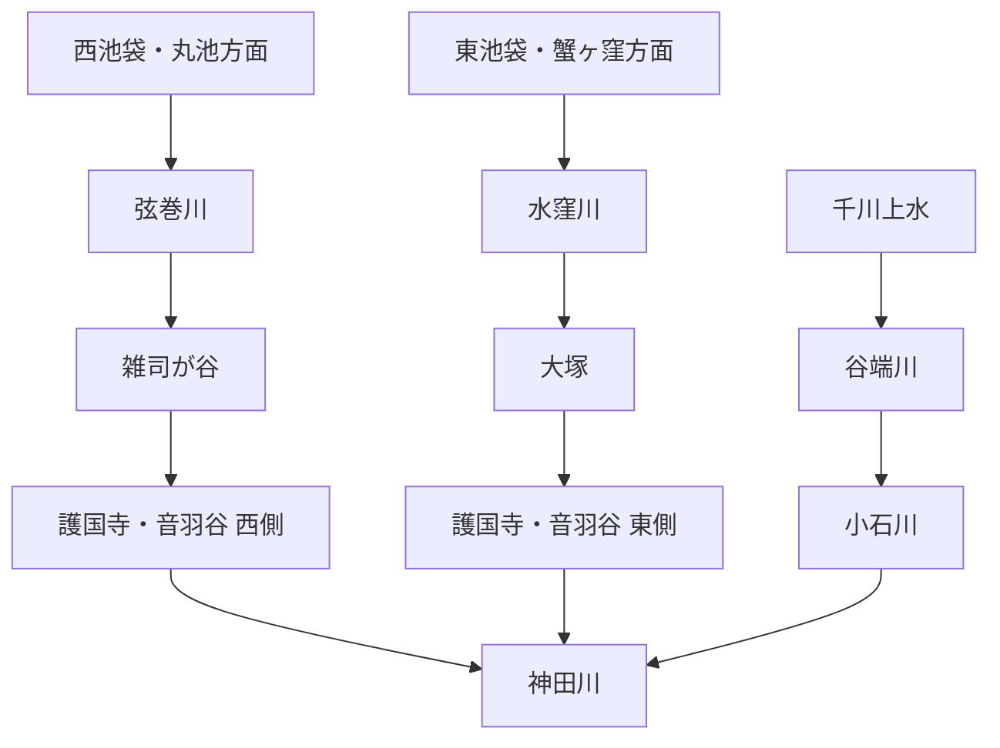

# otowa-ankyoscape

水窪川・弦巻川・谷端川と、その周辺の旧河道・暗渠・湧水・用水・土地利用について調べた記録です。

中心となる範囲は、池袋・雑司が谷・護国寺・音羽・小日向・小石川です。

> [!IMPORTANT]
> このリポジトリでは、既知の河川史をまとめるだけでなく、**まだ決着していない流路・接続・成立年代を史料から検証すること**を重視します。
> とくに「水窪川と弦巻川はどこかで合流していたのか」「音羽通り西側の弦巻川下流はいつ成立したのか」「弦巻川・水窪川側と谷端川側の更新世旧河道はどちら向きに流れていたのか」は中心的な未解決問題です。

  

幕末の音羽・雑司ヶ谷周辺を描いた尾張屋版 <i>Otowa ezu</i>。1851年近吾堂板とは別史料。画像をクリックすると合流問題の検討ページへ移動します。

## 未解決問題

このリポジトリの中心です。解決していない問題は川別の概要へ埋め込まず、できるだけ独立した文書として追跡します。

| 問題 | 現状 |
| --- | --- |
| **水窪川と弦巻川は合流していたのか** | [独立文書で検討中](docs/open-questions/水窪川と弦巻川の合流・接続問題.md) |
| **音羽谷西側の弦巻川下流はいつ成立したのか** | [独立文書で検討中](docs/open-questions/音羽谷西側の弦巻川下流の成立年代.md) |
| **更新世の旧河道はどちら向きに流れていたのか** | 滝口志郎（2019）が谷端川側への接続可能性を提示するが、流向は未決着 |
| **千川上水から弦巻川・水窪川へ直接分水したのか** | 谷端川への分水は確認できるが、両河川への直接分水は未確認 |

→ [未解決問題の一覧](docs/open-questions/README.md)

## 水系の全体像

これは近代以降に把握しやすい大まかな配置であり、全時代にそのまま当てはまるとは限りません。近世の造成・灌漑、近代の河川改修、暗渠化、下水道再編によって接続関係や流路が変化した可能性があります。

## 現時点で重要なこと

- **水窪川は、護国寺創建直後の1682年・1687年の江戸図で確認できる。** これは本調査による地図画像の観察であり、広域図なので弦巻川の不掲載を不存在の証明にはしない。  
  原資料：[1682年『増補江戸大絵図 絵入』](https://dl.ndl.go.jp/pid/1286182) / [1687年『ゑ入江戸大繪圖』](https://dl.ndl.go.jp/pid/2542450)
- **水窪川流域では、大正期に湧水を利用する紙漉き業者が音羽から移住したという地域記録があり、昭和40年（1965年）以前には大雨時の浸水被害も多かったとされる。** 豊島区広報課の1999年10月9日付資料は、水窪川を「昭和初期から戦後にかけて下水化される以前」の小流として説明したうえで、**大正期に流域の湧き水を利用する紙漉き業者が音羽から多く移り住んだ**こと、また**昭和40年以前には大雨で浸水被害が多かった**ことが地域で語られていると記す。〔公的資料に収録された地域聞き取り〕  
  この記録は、水窪川上流～中流域の湧水が農業だけでなく近代の小規模工業にも利用された可能性と、下水化後も低地・旧河道に洪水脆弱性が残った可能性を示す。ただし、紙漉き業者の具体的な所在地・人数・工房名、利用した湧水地点、1965年以前の各浸水地点は同資料だけでは特定できないため、商工名鑑・住宅地図・水害記録・聞き取り原資料との照合が必要である。〔観察／推定／要照合〕  
  出典：豊島区広報課「水窪川をたどって」関連プレス資料（1999年10月9日）[PDF](https://adeac.jp/viewitem/toshima-history/viewer/viewer/pressH111009/data/pressH111009.pdf)
- **2026年の雑司ケ谷霊園研究は、「水久保」周辺から霊園内へ流れ込んだ可能性のある別の水路を、戦後の記憶と旧土地利用から具体化している。** 山本瞳・薬袋奈美子「雑司ケ谷霊園の形成過程に関する研究」（『日本女子大学紀要 家政学系』73、2026年、pp.103–110）は、近隣住民への聞き取りとして、昭和34年（1959年）頃に雑司ヶ谷へ移住した人物が、当時の霊園内で**現在の1種5号と8号の間を南北に通る通路付近に水路があった**と記憶していることを報告する。また、夏目漱石墓所付近には以前の宅地に伴う古井戸があり、論文は、当時「水久保」と呼ばれた現在の霊園北部・南池袋二丁目～東池袋五丁目付近の田畑から、その古井戸を結ぶように水が流れていたとすれば位置関係が整合し、聞き取りの水路と同一である可能性を検討している。〔学術論文／聞き取り＋推定〕  
  この水路を直ちに水窪川本流とはみなさない。むしろ、既知の水窪川上流とされる美久仁小路・東池袋側の谷筋に加えて、**水久保の田畑―雑司ケ谷霊園北部―霊園内古井戸周辺に、戦後まで残った支流・排水路・湧水路の可能性**が出たものとして扱う。東京都交通局の公式沿線資料でも、現在の東池袋四丁目停留場は1925年11月の開業時に「水久保停留場」と呼ばれ、1939年に「日出町二丁目」へ改称したと確認できるため、「水久保」という地名が少なくとも大正末～昭和初期にこの周辺で現役だったことも独立に確認できる。〔確認／観察〕  
  ただし、論文が示す「水久保」の範囲と旧字界、水路の水源・流向、既知の水窪川本流との接続は未確定である。霊園拡張前後の地籍図・墓地平面図・1920～1950年代の地形図や航空写真と照合し、別支流なのか本流の旧線なのかを検証する必要がある。〔未解決〕  
  出典：山本瞳・薬袋奈美子「[雑司ケ谷霊園の形成過程に関する研究 ―従前の土地利用と墓地政策の観点から―](https://jwu.repo.nii.ac.jp/records/2000742)」『日本女子大学紀要 家政学系』73（2026年3月、pp.103–110、DOI:10.57483/0002000742） / 東京都交通局「さくらたび。」[「vol.15 東池袋四丁目」](https://toden-sakuratabi.jp/column/todenpedia/15/)
- **弦巻川の水源として丸池が公的資料に明記される。**  
  出典：豊島区公式 [「元池袋史跡公園」](https://www.city.toshima.lg.jp/340/shisetsu/koen/030.html)
- **現在の元池袋史跡公園の位置を、丸池そのものの位置と無補正で同一視してはならない。** 豊島区公式「元池袋史跡公園」は、丸池跡地にあった旧「元池袋公園」が**下水道工事のため隣接する現在地と土地を交換**し、平成10年（1998年）4月に「元池袋史跡公園」として開園したと明記する。〔確認〕  
  したがって、現在の公園・「池袋地名ゆかりの池」碑の座標は、丸池の池面中心・湧水点・旧公園の位置をそのまま示す基準点にはできない。丸池の正確な位置復元には、移転前の元池袋公園の敷地、土地交換の対象筆、下水道工事図面、旧地籍・旧版地図を別途照合する必要がある。〔観察／注意〕  
  出典：豊島区公式 [「元池袋史跡公園」](https://www.city.toshima.lg.jp/340/shisetsu/koen/030.html)（更新2024年10月23日、開園1998年4月）
- **文化年間の見聞記『遊歴雑記』には、丸池を村境と水利の観点から見る手掛かりがある。** 2024年の解説記事による二次転記では、丸池は以前より埋まりながらも当時なお「三百余坪」ほどあり、池袋村と雑司ヶ谷村の境付近で常時湧水していたとされる。さらに、その流出水を農業用水として利用する権利は雑司ヶ谷村側にあり、池袋村側は関与しなかったという趣旨の記述が紹介される。〔史料所在確認＋本文は二次転記〕  
  これは、丸池を単なる自然湧水ではなく、**村境を越えて雑司ヶ谷側の耕地を支える管理対象の水源だった可能性**を強める。ただし、水利権の法的性格・成立年代・取水施設の位置は未確認であり、『遊歴雑記』原本または翻刻該当頁の直接照合前に断定しない。〔観察／推定〕  
  また東京都公文書館には原図・彩色の『池袋村図』（1枚、93×118 cm、資料ID 000100349）が現存する。文政期の図として紹介される二次資料もあるが、公文書館目録自体には年代が明記されていないため、年代は原図・関連目録で再確認する。丸池・村境・弦巻川上流の位置関係を1772年雑司谷村絵図や近代地図と照合する候補一次史料とする。〔史料所在確認〕  
  出典：nippon.com [「池袋（JY13）: ホテルメトロポリタンあたりにあった農業用水の水源『丸池』が駅名の由来」](https://www.nippon.com/ja/japan-topics/c13306/) / 東京都公文書館 [『池袋村図（帙書：江戸各郷村図　坤）』](https://www.archives.metro.tokyo.lg.jp/detail?cls=collection_01&pkey=000100349) / 国立国会図書館 [『十方庵遊歴雑記 初編 上・中・下』書誌・デジタル資料](https://ndlsearch.ndl.go.jp/books/R100000002-I000000568769)
- **1772年『武蔵国豊島郡雑司谷村絵図』は現存する。** 川筋の細部は高精細画像で再確認が必要。  
  出典：豊島区公式 [「豊島区地域地図集（複製）」](https://www.city.toshima.lg.jp/129/bunka/bunka/shiryokan/kankobutu/005951.html)、[NDLサーチ](https://ndlsearch.ndl.go.jp/books/R100000002-I000009123633)
- **嘉永6年（1853）の柳下家文書に、弦巻川の橋梁を上流から列挙した書上があるという具体的な史料同定候補が得られた。** 現地調査者による二次転記は、史料名を「雑司ヶ谷村ほか沿革起立書上」（1772年村絵図と同じ柳下家文書）とし、上流から「卒トハ橋」、無名の石橋・土橋類、鎌倉橋、木村橋、南坂橋、丸太投渡橋、弦巻橋、松屋橋、境橋、末尾の石橋まで**計12箇所**を列挙する。橋種も「石橋」「土橋」「板橋」「丸太投渡橋」などと記されるという。〔本文は二次転記／史料同定候補〕  
  これが原文どおりなら、1853年時点の弦巻川を、単なる一本の線ではなく**橋名・橋種・順序を伴う連続した地点列**として復元できる。とくに木村橋は清立院下・御嶽権現社前、弦巻橋・松屋橋・境橋は下流側の道路交差を絵図・地籍と照合する基準点になり得る。一方、リポジトリ内の既存ノートではこれまで橋名資料の正式名称・成立年を固定できていなかったため、今回の情報はその未同定状態を一段進める。ただし、豊島区立郷土資料館等の原文画像・目録で「雑司ヶ谷村ほか沿革起立書上」という表題、嘉永6年の年記、12橋の転記を直接確認できていないので〔確認〕には上げない。〔観察／要原文照合〕  
  出典：二次転記：[「雑司ヶ谷村用水」](https://ameblo.jp/kazuaruki/entry-12940940738.html) / 柳下家文書が雑司ヶ谷村史料として『豊島区史』資料編に利用されていることの学術的確認：[横浜商科大学紀要掲載論文](https://ycc.repo.nii.ac.jp/record/1213/files/KJ00004472974.pdf)（注7に「旧豊島郡雑司ヶ谷村柳下家文書『文政元年人別帳』」）
- **弦巻川には、暗渠化前の流況・微地形・生態を伝える1993年の地域聞き取りがある。** 葉上太郎（2026）が地域情報誌『坂まち通信』第2号（1993年）から紹介する証言では、弦巻川沿いに原っぱと小さな段差による「滝」があり、周辺は昔からホタルの名所だったこと、川の水深が膝ほどだったことが語られている。また豊島区立郷土資料館刊『豊島の歳時記』には、春の七草のセリを川沿いで摘んだという生活記憶もあると紹介される。〔本文は二次転記／地域聞き取り〕  
  これは弦巻川を単なる灌漑線・下水線ではなく、暗渠化以前には**局所的な落差、水深、生物相、採取利用を伴う生活水路**だったことを示す手掛かりになる。ただし、『坂まち通信』第2号の原誌面・証言者・証言地点、また『豊島の歳時記』の該当巻・頁を今回直接確認していないため、「滝」の位置や水深を流路全体へ一般化しない。〔観察／要原文照合〕  
  出典：葉上太郎「[かつて池袋には“大洪水を招く川”が流れていた…戦前に封印された『弦巻川』が“再び猛威をふるう”衝撃の未来とは](https://bunshun.jp/articles/-/88508)」文春オンライン（2026年6月8日、地域情報誌『坂まち通信』第2号〔1993年〕および豊島区立郷土資料館『豊島の歳時記』を紹介） / 『坂まち通信』の編集人が岩田智明であったことの補助確認：[「雑司が谷 路地裏縁側日記」](https://tabineko.seesaa.net/article/200549108.html)（2011年5月11日）
- **弦巻川上流を西池袋側まで追うには、1911年と1925年の5千分1級の町村図が重要な候補になる。** 1911年7月刊の『東京府北豊島郡高田村豊多摩郡戸塚村』は、逓信協会刊・著作権所有者東京逓信管理局の**番地界入5千分1図**としてCiNii Booksで原図書誌を確認でき、国立国会図書館には東京逓信管理局著の復刻版『北豊島郡高田村・豊多摩郡戸塚村全図 番地界入』が所蔵される。豊島区立郷土資料館の公式「豊島区地域地図集（複製）」には、1925年4月10日発行の『東京府下高田町・戸塚町』が第1集収録図として掲げられている。〔史料所在確認〕  
  これらを用いた現地調査者の二次読図では、陸地測量部の大正期1万分1地形図で見える上流端よりさらに西へ、**西武池袋線を越える側まで弦巻川系と解釈される水路表現が続く**とされる。したがって、丸池・旧元池袋公園・池袋駅西側の流路を復元する際には、1万分1地形図だけで上流端を固定しない方がよい。〔二次読図／観察〕  
  ただし、今回1911年図・1925年図の高精細原図を直接読図して水路線を確定したわけではない。西武池袋線以西のどの線を弦巻川本流・支流・用水とみなすか、また1911年図の刊行年をそのまま流路成立年とみなせるかは未確認であり、原図・地番界・旧地籍・丸池位置の重ね合わせが必要である。〔要原図照合／未解決〕  
  出典：CiNii Books [『東京府北豊島郡高田村豊多摩郡戸塚村』](https://ci.nii.ac.jp/ncid/BA55911066)（1911年7月、1:5000） / 国立国会図書館 [『北豊島郡高田村・豊多摩郡戸塚村全図 番地界入』](https://ndlsearch.ndl.go.jp/books/R100000002-I000009377006) / 豊島区公式 [「豊島区地域地図集（複製）」](https://www.city.toshima.lg.jp/129/bunka/bunka/shiryokan/kankobutu/005951.html)（『東京府下高田町・戸塚町』1925年4月10日発行） / 二次読図：[Natrium.jp「神田川周辺の水路敷群（弦巻川）」](https://natrium.jp/canal_lot/kanda/tsurumaki/index.html)
- **弦巻川の暗渠化は、1932年だけを単独の工事年とみなすより、1930～1933年の高田町下水道事業の連続として見る必要がある。** 1930年刊『高田町政概要』（高田町役場）を参照した二次転記では、高田町を4区画に分けた「下水道計画延長概数表」が掲載され、計画延長は合計約32,063間（約58.4 km）とされる。さらに1933年刊『高田町史』（高田町教育会）を参照した二次転記では、1931年（昭和6年）に失業者対策を兼ねて下水道築造の町債を発行し、39万2,800円の予算で河川沿いの工事を進め、1932年の東京市編入後は東京市へ事業が引き継がれたとされる。〔史料所在確認候補＋本文は二次転記〕  
  2023年公開の「としまの記憶」動画アーカイブは「昭和7年（1932年）に当時の北豊島郡高田町により暗渠化工事」と説明する一方、2026年の文春オンライン記事は弦巻川の**下水道工事開始を1931年**とする。両者は、1931年を着工、1932年を暗渠化工事の主要実施・完成段階または行政移管期とすれば両立し得るが、現段階では工事起工・竣工日を示す高田町議会決議、町債資料、工事台帳を直接確認していない。したがって「1932年に一挙に全流路が暗渠化された」とは断定しない。〔観察／推定／要原文照合〕  
  この行政史は、現在の弦巻通り・雑司ヶ谷幹線が旧河道と微妙にずれる理由を考える際にも重要である。下水道計画が町域全体の街路・衛生事業として設計されていたなら、河道をそのまま覆蓋した区間と、道路・管渠として線形を整理した区間を分けて検討する必要がある。〔推定〕  
  出典：『高田町政概要』（高田町役場、1930年）・『高田町史』（高田町教育会、1933年）の二次転記：[落合道人「東京郊外の文化住宅街のトイレ事情。」](https://tsune-atelier.seesaa.net/article/2021-08-19.html) / 「としまの記憶」をつなぐ会 [「記憶の遺産ツアー：消えた『としまの川』を訪ねる　弦巻川編」](https://movie.toshima-kioku.jp/archives/tsurumakigawa/)（2023年10月28日） / 葉上太郎「雑司ヶ谷、95年前に消滅しても生きる川 #2」文春オンライン（2026年6月8日）[記事](https://bunshun.jp/articles/-/88509)
- **1933年刊『高田町史』の丸池・弦巻川記述は、「1932年に全区間がすでに完全暗渠化していた」という読みをさらに弱める。** 同書200頁の二次転記では、丸池は当時すでに鉄道教習所構内の「石囲いの水溜」になっていた一方、弦巻川については、宅地化に伴って「河が下水となり」、裏長屋の炊事・洗濯排水や塵芥で悪臭を放つ状態を現在形で描写し、その後に**下水が鉄筋コンクリート管へ置き換わり、埋没して川の姿を失うことを将来の見通しとして記している**。〔本文は二次転記／観察〕  
  この文面が1933年刊行時点の現況をそのまま反映するなら、少なくとも著者が観察・認識した弦巻川の一部には、1932年以後も地表に開いた「川／下水」として残る区間があった可能性が高い。したがって、「1932年暗渠化」は全流路の同時竣工年ではなく、工事着手・主要区間施工・高田町事業の年度など別の意味を持つ可能性を検討する必要がある。〔推定／既存年代解釈を弱める根拠〕  
  また同じ転記は、丸池が大正初期までは子供の水泳場だったが、1933年頃には鉄道教習所構内で汚濁した水溜となっていたとする。別の二次調査は、1932年時点の鉄道教習所が池袋二丁目（旧西巣鴨町大字池袋字向原）と雑司ヶ谷七丁目の境界にまたがり、1937年火災保険特殊地図では丸池が食堂・浴室に近接していたと読図している。これは丸池の位置・土地利用変化を絞る手掛かりだが、施設配置と汚濁原因の因果関係は原図・町史原本で再確認する。〔二次読図／要原文照合〕  
  出典：高田町教育会『高田町史』（1933年）p.200 の二次転記：[sakura「池袋地名の由来『丸池』」](https://note.com/toshima_lab/n/n3d4eeeecbbb1) / 鉄道教習所・火保図の二次照合：[sakura「続・池袋地名の由来『丸池』（鉄道教習所時代）」](https://note.com/toshima_lab/n/n87060ff10465)
- **雑司が谷一丁目7番付近では、暗渠化と道路新設に伴って建物を曳家したという店主家伝があり、旧河道と現在の弦巻通りのずれを地点で検討できる。** 文春オンライン（2026年6月8日）の聞き取りで、弦巻通り沿いの赤丸ベーカリー店主は「この辺りでは店の裏の方を流れていた」と伝え、暗渠化され道路ができた際、当時和菓子屋だった店を曳家で動かしたと聞いていると証言する。別の地域記事では現店舗を**雑司が谷1-7-1**、雑司ヶ谷での「赤丸文化堂」創業を大正12年（1923年）としている。〔地域聞き取り／二次報道〕  
  この家伝が正しければ、少なくとも同地点では**旧河道→暗渠・道路化の過程で、道路線形に合わせて既存建物まで移動させた可能性**があり、「現在の弦巻通り＝暗渠化前の河道中心線」と単純には置けないことを具体的に補強する。ただし、曳家の実施年、移動前後の敷地・建物位置、旧河道との距離は未確認であり、1930年代の火災保険特殊地図・地籍図・道路工事図・商工名鑑等で照合するまで線形の確定には使わない。〔観察／推定／要照合〕  
  出典：葉上太郎「[『えっ、ここを川が流れていたの？』地元では言い伝えが残るだけ…かつて池袋を流れていた『幻の川』の流域をたどる](https://bunshun.jp/articles/-/88509)」文春オンライン（2026年6月8日） / 池袋タイムズ「[【創業100年】雑司が谷の老舗『赤丸ベーカリー』に行ってきた！](https://ikebukuro-times.com/archives/akamaru-bakery.html)」（2026年、所在地・沿革の補助確認）
- **1851年近吾堂板では、護国寺南西端から寺域外へ短く続く青い水路を本調査で確認している。** 「護国寺内で完全に終わる」という単純な読みは弱い。  
  原資料：[東京都立図書館『音羽目白雑司ケ谷辺絵図』](https://archive.library.metro.tokyo.lg.jp/da/detail?tilcod=0000000013-00042337)
- **1941年『「郷土の観察」の指導体系』には、音羽谷の川を水田開発時に一流から二流へ分けたのではないか、という趣旨の推測がある。** 工事記録ではなく、後世の地理的推論として扱う。  
  原資料：[国立国会図書館デジタルコレクション PID 1275204](https://dl.ndl.go.jp/pid/1275204)
- **文政12年（1829）成立の幕府官撰地誌『御府内備考』は、護国寺門前の東西二流を同じ史料体系の中で区別している。** 東京都公文書館の原本目録では巻之五十「護国寺領三ヶ町」に東青柳町・西青柳町が収録されることを確認できる。東青柳町条の二次転記では、町内東寄りを北から南へ流れる細流を「幅九尺」とし、当時は古来の川名を知らないとしつつ、水上を「巣鴨村雑司ヶ谷村之内田場際」、流末を「鼠ヶ谷下水」とする。西青柳町条の二次転記では対になる細流を「里俗弦巻川」とし、こちらも流末では鼠ヶ谷下水と称したとされる。〔史料所在確認＋本文は二次転記〕  
  この記述が正しく転記されているなら、少なくとも江戸後期の書上では、**東側の水窪川系は音羽谷に入る段階で固有河川名が不明とされ、上流域は巣鴨村・雑司ヶ谷村の田場際に求められていた一方、西側は「弦巻川」という里俗名が明記されていた**ことになる。また「鼠ヶ谷下水」は両者の流末側をまとめて指し得る名称で、水窪川・弦巻川全区間の固有名とは区別して扱う必要がある。これは後世の「水窪川」「弦巻川」という二河川名を江戸期全区間へそのまま遡及させることへの注意材料にもなる。〔観察／推定〕  
  ただし、幅九尺や水上・流末の原文は今回『御府内備考』原本画像または公開翻刻該当頁を直接読めておらず、二次転記に依存する。国立国会図書館には1931年の『大日本地誌大系 第3巻 御府内備考』がインターネット公開されているため、該当頁を直接同定できた段階で再確認する。〔要原文照合〕  
  出典：東京都公文書館 [『御府内備考 巻之四十八～五十二』](https://www.archives.metro.tokyo.lg.jp/detail?cls=collection_01&pkey=000101055) / 国立国会図書館 [『大日本地誌大系 第3巻 御府内備考』](https://ndlsearch.ndl.go.jp/books/R100000039-I1214872)（1931年、インターネット公開） / 本文二次転記：[「水窪川」](https://ameblo.jp/kazuaruki/entry-12940940845.html)
- **1878年『東京府村誌』雑司ヶ谷村条の二次転記では、弦巻川は「西青柳町ニ通ス」とされる。** 原文確認前なので確定引用にはしない。  
  二次転記：[「雑司ヶ谷村用水」](https://ameblo.jp/kazuaruki/entry-12940940738.html)、原資料系統：[『皇国地誌稿本東京府誌』書誌](https://ci.nii.ac.jp/ncid/BB30888890)
- **同じ1878年『東京府村誌』雑司ヶ谷村条の二次転記には、丸池と灌漑規模を数量で絞れる記述がある。** 転記では、丸池を「本村ノ西」に位置する弦巻川の水源とし、東西六間・南北五間・周囲三十間、田の用水にも用いるとする。また弦巻川は丸池から出て村中央を東流し西青柳町へ通じるとされ、雑司ヶ谷村の水田面積は5町3畝15歩、畑は70町余と紹介されている。さらに『新編武蔵風土記稿』雑司ヶ谷村条の二次転記では、弦巻川を「丸池の下流」、幅七尺ほどで村の用水とする。〔史料所在確認＋本文は二次転記〕  
  これらが原文どおりなら、弦巻川は少なくとも近世末～明治初期の記述上、単なる自然流路ではなく**丸池を水源とする村内灌漑水路として明示的に利用され、丸池の規模も概数ではなく間単位で記録された**ことになる。一方、水田5町3畝15歩の「大部分が弦巻川流域」という説明は二次資料側の整理であり、村誌本文そのものの記述かは未確認なので区別する。丸池の寸法・弦巻川幅・耕地面積はいずれも原本または影印の該当頁で再照合する。〔観察／要原文照合〕  
  出典：二次転記：[「雑司ヶ谷村用水」](https://ameblo.jp/kazuaruki/entry-12940940738.html) / 原資料系統：CiNii Research [『皇国地誌稿本東京府誌』](https://cir.nii.ac.jp/crid/1971712334789334309)（東京都公文書館所蔵『東京府村誌』全15冊の影印を含む）
- **谷端川は千川上水から分水を受けていた。** 一方、千川上水から弦巻川・水窪川へ直接送水した経路は未確認。  
  出典：練馬わがまち資料館 [「千川上水の分水を訪ねて（2）」](https://www.nerima-archives.jp/column/3572/)
- **上池袋一丁目には、谷端川へ注いだ湧水支流と池・洗い場を番地単位で追える史料がある。** 豊島区公式の研究紀要一覧から、横山恵美「豊島区の湧き水をたずねて」が豊島区立郷土資料館研究紀要『生活と文化』第11号（2001年12月25日発行）の「調査ノート」として掲載されたことを確認できる。〔史料所在確認〕  
  同論文をもとにした二次転記では、**上池袋1-3付近から湧いた清水が北上し、上池袋1-14で東へ直角に折れ、西巣鴨1-10の丹羽藤吉郎邸（のち山口玉造邸）内を通って谷端川へ注いだ**とされる。途中の上池袋1-27には洗い場があり、流れが急なため「滝」と呼ばれたともいう。また谷端川との合流部にあった丹羽邸には、瓢箪形の大きな池が存在したという。〔本文は二次転記／観察〕  
  これは、谷端川本流だけでなく、**池袋台地北縁の湧水→小流→洗い場→屋敷内池→谷端川という局地的な水利用・排水系**を具体的な地点列として復元できる手掛かりになる。ただし、上記番地・「滝」呼称・瓢箪池の形状や規模は今回紀要原文を直接読んでおらず、二次転記に依存する。近代地籍図・火保図・旧版地図と原文該当図版の照合前に旧河道中心線を確定しない。〔観察／要原文照合〕  
  なお豊島区公式「上池袋中央公園」は、上池袋1-28-7の園内に**昔使われていた井戸**と手押しポンプがあるとする。これは二次転記で洗い場があったとされる上池袋1-27に隣接するが、この井戸を旧支流の湧水点・洗い場の水源と同一視できる資料は未確認である。〔確認／注意〕  
  出典：豊島区公式 [「研究紀要『生活と文化』・年報」](https://www.city.toshima.lg.jp/129/bunka/bunka/shiryokan/kankobutu/005957.html)（第11号、2001年12月25日、横山恵美「豊島区の湧き水をたずねて」） / 本文二次転記：[D.2.C.「谷端川と上池袋支流（瓢箪池支流）の落ち合い地点にある防災用ポンプ」](https://www.d-2-c.jp/column_back174.html)（2021年3月10日） / 豊島区公式 [「上池袋中央公園」](https://www.city.toshima.lg.jp/340/shisetsu/koen/014.html)（住所：上池袋1-28-7）
- **谷端川一号幹線は、2001年時点で西池袋五丁目地先から池袋四丁目地先まで約1.6 kmが完成段階にあり、約3.2万トンを暫定貯留する計画だった。** 東京都議会公営企業委員会（2001年3月21日）で下水道局建設部長が、同年5月から暫定貯留を開始する予定と答弁している。〔確認〕  
  同答弁では、川越街道より北側は都市計画道路補助73号線が未整備で管渠を敷設できず、下流部の計画を変更して熊野神社付近へ主要枝線を敷設し、内径を計画2,200 mmから3,000 mmへ増径すると説明している。また山手通り横断部には4か所の伏せ越しがあり、他企業埋設物を避けるための暫定構造だったことも確認できる。したがって、現在の「谷端川」系下水道は旧河道をそのまま一本の暗渠として残したものではなく、都市計画道路・既設埋設物・浸水対策に応じて経路と機能を再編してきた系統として扱う必要がある。〔確認／観察〕  
  ただし、この2001年の谷端川一号幹線・主要枝線の中心線を近世・近代の谷端川旧河道と同一視しない。議会記録が直接示すのは当時の下水道計画と施設条件であり、旧河道との一致・不一致は古地図・地籍・下水道台帳との地点別照合が必要である。〔観察〕  
  出典：東京都議会 [『平成十三年 公営企業委員会速記録第三号』2001年3月21日](https://www.gikai.metro.tokyo.lg.jp/record/public-enterprise/2001-03.html)
- **1999年の豊島区防災対策調査特別委員会資料は、既設の谷端川幹線について、旧河川を覆蓋して下水道へ転用した成り立ちを明記している。** 同資料は、豊島区西部の山手通り沿いにある谷端川幹線が、池袋駅西口周辺から長崎・千川を経て板橋区大山町に至る地域の雨水・汚水排除を担うと説明し、そのうえで**「もともと川だったところにふたを掛けてそのまま下水道幹線として利用」している**ため、都市化による流出増加で負担が大きくなっているとする。〔公的委員会資料確認〕  
  これは、既設谷端川幹線の成立原理が旧谷端川の覆蓋利用だったことを行政側が明示した根拠として重要で、旧河道と現行下水道の連続性を強める。一方、後年の付替え・改築・バイパス整備まで含めて**全区間の管渠中心線が暗渠化前の河道中心線と完全一致する**ことを意味しない。2001年議会資料に見える谷端川一号幹線や主要枝線の新設・経路変更と区別し、地点ごとに下水道台帳・工事完成図と照合する。〔確認／観察／注意〕  
  出典：豊島区議会 防災対策調査特別委員会資料「谷端川一号幹線について」（1999年7月27日）[PDF](https://adeac.jp/viewitem/toshima-history/viewer/viewer/08_48_H110727_1/data/08_48_H110727_1.pdf)
- **池袋耕地整理組合の事業は、谷端川沿いの旧田圃と支水路が1920年前後に再編された時期を絞る手掛かりになる。** ジャパンサーチでは『豊島区史 資料編 四』（豊島区史編纂委員会、1981年）が豊島区デジタルアーカイブ／ADEAC収録資料として確認できる。〔史料所在確認〕  
  同書収録の事業報告書を参照した二次転記では、池袋耕地整理組合は大正9年（1920年）に発足し、対象は西巣鴨町大字池袋と板橋町大字中丸にまたがる618反余（うち田128反余）で、**同年中に中上橋から中丸橋にかけての谷端川流域工事が竣功**、事業全体は大正12年（1923年）に完了したとされる。さらに境井田・前田・沼田など谷端川沿いの田圃が主要対象だったこと、整理前の大正10年地形図に見える南橋付近の左岸側流が整理後に消失したという読図も示される。〔本文は二次転記／観察〕  
  これが原資料どおりなら、谷端川流域では昭和期の暗渠化より前に、**耕地整理によって河道周辺の区画・道路・支水路が改変された段階が1920～1923年に存在した**ことになる。したがって、明治42年測図・大正10年修正版・昭和4年修正版の差を「自然な河道変化」や「暗渠化」だけで説明せず、耕地整理による付替え・支流整理の可能性を検討する必要がある。〔推定／注意〕  
  ただし、今回『豊島区史 資料編 四』の事業報告書該当頁を直接確認できていないため、618反余・田128反余・中上橋～中丸橋の竣功時期・総工費等の数値は原文再照合前に確定値として扱わない。また、南橋付近の側流消失が耕地整理工事そのものによるものかは、換地図・工事設計図・地籍図との照合が必要である。〔要原文照合／未解決〕  
  出典：ジャパンサーチ [『豊島区史 資料編 四』](https://jpsearch.go.jp/item/adeac-R100000094_I000110841_00)（ADEAC収録） / 本文二次転記・地形図読図：[「耕地整理（池袋）」](https://ameblo.jp/kazuaruki/entry-12940941622.html)
- **成蹊学園側では、大正9年（1920年）の池袋周辺図に谷端川を「十町川」と呼ぶ別名資料があるという二次転記が見つかった。** 2025年の地域調査記事は、成蹊学園『成蹊学園六十年史』（1973年）所収の「池袋周辺地図（大正9年）」を書き起こし、当時の成蹊学園では谷端川を「十町川」と呼称していたと紹介する。国立国会図書館では同書が成蹊学園刊・1973年・709頁の学園史として所蔵されていることを確認できる。〔史料所在確認＋本文は二次転記〕  
  同じ書き起こし図は、上り屋敷側の水路を「弦巻川」へつながるように表現しているとされるが、二次調査者自身も地形上の不自然さを指摘している。したがって、この図を**谷端川（十町川）と弦巻川の実際の水理的接続を示す一次的証拠には用いず**、大正期の学校内・地域内の河川呼称と、当時の認識を記録した図として扱う。原図の凡例・作図時期・作図根拠・「十町川」の文字位置を『六十年史』原本で確認できれば、谷端川の別称史と上り屋敷周辺水路の誤認／伝承を切り分けられる。〔観察／注意／要原文照合〕  
  出典：国立国会図書館 [『成蹊学園六十年史』](https://ndlsearch.ndl.go.jp/books/R100000039-I12110426)（成蹊学園、1973年） / 本文・図の二次転記：[sakura「池袋を流れる十町川と成蹊学園」](https://note.com/toshima_lab/n/n3b8c57fc5fdc)（2025年7月7日） / 地域位置の補助資料：「としまの記憶」動画アーカイブ [「狐塚、大野の森を歩く」](https://movie.toshima-kioku.jp/archives/2012039/)（2012年撮影、戦前・戦時中の西池袋・上り屋敷・大野の森の聞き取り）
- **谷端川の板橋側には、地域資料で「中丸川」「出端川」と呼ばれた支流が確認できる。** 板橋区教育委員会『いたばしの地名』（1995年3月、文化財シリーズ第81集）は板橋区立郷土資料館・国立国会図書館で書誌を確認できる。本文を引用・要約した二次資料によれば、中丸川は幸町に発して谷端川へ東西に流れた小川、出端川は大山町37番地付近から大山駅南側・東上線沿いを経て谷端川へ入る小川とされる。〔史料所在確認＋本文は二次転記〕  
  出端川について同転記は、両岸の低地が田の用水に使われ、農産物の洗い場が複数あったこと、千川用水の漏水を水源とする説があったことも伝える。したがって、谷端川と千川上水の関係は本流への分水だけでなく、**支流の灌漑・洗い場・漏水利用という局地的な水利用**からも検討する余地がある。ただし「千川用水漏水＝出端川の確定水源」とはしない。〔観察／仮説〕  
  また2026年7月更新の現地調査では、中丸川上流端や谷端川西側の複数地点について地籍図上の水路敷が照合されている。これは公図・地籍の直接史料ではなく現地調査者による読図なので、旧河道の確定線ではなく原公図を探すための手掛かりとする。〔観察〕  
  出典：板橋区立郷土資料館 [『いたばしの地名』刊行案内](https://www.city.itabashi.tokyo.jp/kyodoshiryokan/shuppan/3000113/3000138.html) / [NDLサーチ](https://ndlsearch.ndl.go.jp/books/R100000002-I000002431691) / 二次転記・現地照合：[出端川](https://lotus62ankyo.blog.jp/archives/7712076.html)、[中丸川](https://natrium.jp/canal_lot/yabata/yabata06/index.html)
- **1999年12月刊『旧谷端川の橋の跡を探る』は、谷端川に架かっていた67橋を写真と文章で追跡した橋梁・景観史料である。** 2000年1月21日付の豊島区広報課資料が刊行経緯と「67の橋」を明記し、CiNii Booksでは豊島区立郷土資料館友の会刊・35頁、編集協力：豊島区立郷土資料館として書誌を確認できる。〔確認〕  
  67という数は**谷端川に歴史上存在した橋の総数を確定する値とは限らず**、同冊子が調査・収録した橋の数として扱う。暗渠化前の橋位置、旧道との交差、欄干・橋跡の現況を点ごとに照合するための写真資料として価値が高い。〔観察〕  
  出典：豊島区広報課「かつて区内を流れていた川筋を辿って 冊子『旧谷端川の橋の跡を探る』」（2000年1月21日）[PDF](https://adeac.jp/viewitem/toshima-history/viewer/viewer/pressH120121/data/pressH120121.pdf) / [CiNii Books](https://ci.nii.ac.jp/ncid/BA46331735) / [S29/S09](docs/出典一覧.md)
- **谷端川下流の小石川では、旧初音町の中央を流れた水路が地域では「千川」と呼ばれ、少なくとも「嫁入橋」「柳橋」という橋名と、両岸の商店・縁日の記憶が残る。** 文京区公式の初音町町会ページは、2014年11月刊『六十年のあゆみ』掲載内容として、東部と西部の両岸を嫁入橋・柳橋が結び、源覚寺の縁日に両岸の商店と夜店が賑わったと回想する。また、交通量の増加と大雨による洪水被害を背景に「昭和の初期」に暗渠化されたとしている。〔公的掲載の地域回想〕  
  この「千川」を谷端川全流域の正式名称とみなさず、**小石川側下流区間の地域呼称・生活空間の記録**として扱う。暗渠化理由も行政の工事決裁ではなく地域史の回想なので、交通・洪水が暗渠化を促した事情を示す補助根拠に留める。嫁入橋・柳橋の位置と年代は、1883～84年の五千分一東京図や江戸切絵図、下水道台帳との照合余地がある。〔観察／要照合〕  
  出典：文京区公式 [「初音町町会」](https://www.city.bunkyo.lg.jp/b011/p001217.html)（文京区町会連合会創立60周年記念誌『六十年のあゆみ』、2014年11月掲載内容）
- **更新世旧河道説は研究上の仮説である。** 滝口志郎（2019）は弦巻川の流路がかつて谷端川側へつながっていた可能性を提示するが、流向を確定したものではない。  
  出典：[深田地質研究所](https://fukadaken.or.jp/?page_id=6569) / [国立国会図書館](https://dl.ndl.go.jp/pid/14529520)
- **2008年時点の既設雑司ヶ谷幹線は、少なくとも雑司が谷一・二丁目～目白台二丁目の再構築区間で矩形渠 2,000×1,460 mm、施工延長598.75 mとして確認できる。** 東京都下水道局の報告書は、既設人孔8箇所・汚水ます83箇所を含む再構築工事とし、関連施設図では雑司ヶ谷幹線を神田川・後楽ポンプ所へ続く下水道系統として示す。また工事資料中では最下流で雨水・汚水面積48 haを受け持つとされる。〔確認〕  
  これは**暗渠化前の弦巻川河道が全区間そのまま現在の管路になったことを証明するものではない**。むしろ、1930年代の河道・暗渠と2008年の既設下水道施設を年代別に分けて比較するための基準資料とする。〔観察〕  
  出典：東京都下水道局『雑司ヶ谷幹線再構築工事事故調査報告書』（2008年9月1日）[国土交通省公開PDF](https://www.mlit.go.jp/common/000024056.pdf)
- **東池袋雨水調整池は、水窪川上流域に重なる現代の雨水排水系統を具体化する資料になる。** JICA東京が東京都下水道局協力の視察記録として公開した資料では、同施設は豊島区立総合体育場地下に位置し、1994年に整備、最大14,000 m³を貯留し、東池袋3・4丁目周辺の冠水被害を大きく軽減したとされる。〔確認〕  
  2026年5月の建設専門紙による東京都下水道局の耐震補強計画報道では、所在地を東池袋4丁目41-30、平面約50×50 m・深さ約5～6.25 mとし、**雨天時に旧坂下幹線へ流入した雨水を取り込んで貯留し、晴天時には旧坂下幹線を経由して神田川へ放流する**施設と説明している。また同記事は「1996年から稼働」とする。〔報道確認〕  
  JICA資料の「1994年に整備」と報道の「1996年から稼働」は必ずしも矛盾せず、完成・整備と本格運用開始の時点が異なる可能性があるが、現段階では工事竣工資料を未確認なので年代差を断定的に解釈しない。〔観察／要照合〕  
  なお、**旧坂下幹線＝暗渠化前の水窪川河道そのもの**とは現時点では断定しない。現地調査では水窪川系の現代雨水排水として坂下幹線が指摘されるが、旧河道と管路中心線の一致・不一致は東京都下水道台帳や工事完成図で地点ごとに確認する必要がある。〔推定／未解決〕  
  出典：JICA東京 [「JICA留学生が東京都の下水道施設を視察しました！」](https://www.jica.go.jp/domestic/tokyo/information/topics/2022/i8dm0l000000375m.html)（2023年1月10日公開、2022年12月21日視察） / 建通新聞 [「27年度にも工事　東池袋雨水調整池の耐震補強　都」](https://digital.kentsu.co.jp/articles/artcl_rglr/01KSEJDYWFZXQF82KWACC2APY2)（2026年5月） / 現地・台帳読図の補助資料：[Natrium.jp「神田川周辺の水路敷群（水窪川）」](https://natrium.jp/canal_lot/kanda/mizukubo/index.html)
- **2026年8月契約の再構築調査では、現行の谷端川幹線が板橋一・四丁目で老朽化対策の対象になっていることを確認できる。** 入札情報サイトが東京都下水道局第一基幹施設再構築事務所の契約情報として掲載した「自由断面SPR工法による谷端川幹線及び浅草幹線再構築調査委託」は、履行場所に板橋区板橋一丁目・四丁目を含み、谷端川幹線と浅草幹線を「経年による管渠の老朽化が著しい」として、管路内調査・構造解析を行い更生設計資料を作成する業務としている。契約日は2026年8月25日。〔契約情報の二次掲載確認〕  
  同案件の流域踏査0.70 ha、提案路線1.33 km、管路内調査1.33 km、構造解析各2箇所という数量は**谷端川幹線と浅草幹線を合わせた業務全体の数量**であり、谷端川幹線単独の延長・調査量とはみなさない。板橋一・四丁目という履行場所は、現在の谷端川系下水道を旧河道・緑道・橋跡と照合する際の区間候補として利用できる。〔観察〕  
  出典：入札情報速報サービスNJSS [「自由断面SPR工法による谷端川幹線及び浅草幹線再構築調査委託【08-委-007】」](https://www2.njss.info/offers/view/33882462)（2026年8月26日登録、契約日2026年8月25日）
- **板橋駅には、谷端川の別表記を施設名称として残す1980年の公的写真記録がある。** 板橋区公文書館の電子展示室は、昭和55年（1980年）撮影の「地下通路完成式典　栗原敬三区長の挨拶」（写真資料番号35566）を公開し、板橋駅地下通路の名称を「矢畑川自由地下通路ガード／矢畑川自由通路地下道架道橋」と注記している。さらに、通常は「谷端川」の表記が多い一方、この地下道名では「矢畑川」を用いることを明記する。〔確認〕  
  この記録は、**1980年時点で板橋駅の鉄道横断部に「矢畑川」という河川由来の名称が制度的な施設名として残っていた**こと、また板橋駅付近の旧河道・下水道・鉄道横断施設を照合する際に地点を絞れることを示す。ただし、施設名称だけから、地下通路そのものが暗渠化前の谷端川中心線と完全に一致するとは断定しない。旧河道中心線と現行下水道本管の位置関係は、鉄道図面・下水道台帳・地籍図で別途確認する。〔観察／要照合〕  
  出典：板橋区公式・板橋区公文書館 電子展示室76号 [「板橋駅前！むかし写真館」](https://www.city.itabashi.tokyo.jp/kusei/shiryo/koubunsho/ichiran/1009231.html)（写真15、昭和55年撮影、資料番号35566）
- **江戸後期には、谷端川・小石川の川幅が道路敷などの埋立てで縮小していたとする地誌記述がある。** 『新編武蔵風土記稿』小石川村条の二次転記では、長崎村方面の細流が池袋・滝野川・巣鴨を経て小石川村に入り、下流で神田川へ合流する系統を「小石川幷谷端川」と記し、かつてはより大きな川だったが、後年「道敷等」による埋立てが進み、広い所でも川幅三～四間程度になったという趣旨を記す。また巣鴨村内では谷端川と称したとされる。〔史料所在確認＋本文は二次転記〕  
  これは近代の暗渠化以前にも、**道路化・土地利用による河道幅の人為的縮小が進んでいた可能性**を示す根拠になる。ただし、どの区間がいつ、何の事業で埋め立てられたかは本文だけでは特定できず、近代暗渠工事と同一視しない。〔観察／推定〕  
  位置を詰める一次史料候補として、東京都公文書館には享和元年十月（1801年）の彩色原図『豊島郡 巣鴨村図 共十六枚之内』（資料ID 000100341）が現存し、道・寺社・抱屋敷・田畑を色分けしている。二次的な画像読解では、谷端川を渡る「藤橋」や別称「コジキバシ」と読める橋名も報告されているが、橋名・位置は高精細原図で再確認するまで〔観察〕に留める。  
  出典：東京都公文書館 [『豊島郡 巣鴨村図 共十六枚之内』](https://www.archives.metro.tokyo.lg.jp/detail?cls=collection_01&pkey=000100341)（享和元年十月、資料ID 000100341） / 『新編武蔵風土記稿』小石川村条の二次転記：[「19番目の富士見坂（上）またの名を、あさみ坂」](https://fujimizaka.wordpress.com/2020/08/27/asami-saka/) / 巣鴨村図の橋名読解：[「19番目の富士見坂（中）大塚三業地」](https://fujimizaka.wordpress.com/2021/01/08/19th-fujimizaka/)
- **1828年刊『新編武蔵風土記稿』巣鴨村条の二次転記は、谷端川の川幅と東福寺橋の規模を数量で示す。** 現地調査資料による転記では、巣鴨村内の谷端川は**幅三間または六間**とされ、東福寺へ向かう道に架かる東福寺橋は**土橋・長さ四間**と記されるという。四間は約7.3 mであり、近世末の南大塚付近で河道と橋の規模を点で復元する基準値になる。〔本文は二次転記／観察〕  
  同資料には、豊島区立郷土資料館が書き起こした享和元年（1801年）『巣鴨村絵図』部分図も掲載され、東福寺と谷端川の交差関係を示している。したがって、1801年絵図と1828年地誌を組み合わせれば、**東福寺橋地点を近世谷端川の固定点として扱える可能性**がある。ただし、橋長四間をそのまま河道幅とみなさず、土手・橋台を含む可能性を残す。また『新編武蔵風土記稿』原文該当頁を今回直接確認していないため、幅員・橋長は原本または影印で再照合する。〔観察／要原文照合〕  
  出典：『新編武蔵風土記稿』巣鴨村条（文政11年・1828年刊行とする二次転記）／1801年『巣鴨村絵図』書き起こし掲載：[高橋俊一「谷端川の跡を歩く―豊島区南大塚編2」](https://warpal.sakura.ne.jp/river-yabata/t-mo2/t-mo21.htm)
- **1930年前後には、谷端川は都市計画上の河川改修事業として正式に扱われていた。** 国立公文書館デジタルアーカイブには『東京都市計画河川改修及其ノ事業執行年割決定ノ件』が現存し、東京都土木技術支援・人材育成センター年報（2010）は、昭和5～6年（1930～1931年）に立会川・神田上水・**谷端川**・呑川・宇田川・谷田川・江戸川の改修計画が告示されたと整理している。〔史料所在確認＋公的研究整理〕  
  昭和5年（1930年）の谷端川改修計画を引用する二次資料では、谷端川について「其ノ下流ハ市内ニ入リ千川トナリ、小石川区を経…」という記述が紹介される。これが原文どおりなら、**当時の行政計画でも上流の「谷端川」と小石川区内の「千川」を連続する同一水系として記述していた**ことになり、旧初音町の地域回想に残る「千川」という呼称を補強する。〔本文は二次転記／観察〕  
  ただし、今回国立公文書館の原画像本文までは直接閲覧できておらず、計画の起終点・延長・断面・工費・年割や上記引用文の全文脈は未確認である。また、計画決定・告示の時点と実際の暗渠工事竣工年を同一視しない。1934年の下流暗渠竣工や1962年の河川廃止とは別段階の史料として扱う。〔要原文照合／注意〕  
  出典：ジャパンサーチ／国立公文書館デジタルアーカイブ [『東京都市計画河川改修及其ノ事業執行年割決定ノ件』](https://jpsearch.go.jp/item/najda-KQdR01910100_00400) / 東京都土木技術支援・人材育成センター 石原成幸「東京の河川に係わる管理体制と改修計画の経緯」『平成22年度 年報』（2010年）[PDF](https://www.tmpc.or.jp/Portals/0/images/03_business/douro/dobokugijutsu/tech/nenpo/pdf/000009993.pdf) / 二次転記：[「千川通り」](https://ameblo.jp/kazuaruki/entry-12940941921.html)
- **戦後の谷端川は、1949～1987年の公的年表から、改修・暗渠化・覆蓋上利用が区間ごとに段階的に進んだことを追える。** 豊島区デジタルアーカイブ／ADEACの年表は、1949年3月16日に「神田上水と谷端川改修工事の認可、閣議決定」（典拠：法令全書）、同年4月に区議会全員協議会が谷端川暗渠計画実現のための運動を決定したことを記す。1956年3月には、**谷端川支流の千早町2-1から長崎2-6に至る全長310 m**と、要町1-5から15番地に至る約125 mの暗渠工事完成が記録される。1957年10月29日には椎名町駅より下流・武蔵野鉄道横断までの改修工事竣工、1960年12月13日には大明小学校PTAによる暗渠上の児童公園化を求める署名運動、1965年3月には要町2丁目3番地先から25番地先まで185 mの上流改修工事竣工、1987年10月31日には椎名町駅付近曲折部の改修工事完成が記録される。〔公的年表確認〕  
  この時系列は、**1962年の河川廃止を谷端川全区間の最初または唯一の暗渠化時点とみなせない**ことを具体的に補強する。とくに1956年記録は「谷端川支流」と工区両端・延長を明記するため、千早・長崎間の支流を復元する手掛かりになる。また1987年の「椎名町駅付近曲折部改修」は、現在見える曲折・緑道・下水道線形を暗渠化前の河道へそのまま遡及させる際の注意材料になる。〔観察／注意〕  
  ただし、1949年の認可内容について『法令全書』原文、1956・1957・1965・1987年の工事について各『区公報』・設計図を今回直接照合したわけではない。各工事が河道の付替え、覆蓋、護岸、管渠新設のどれをどの範囲で含んだか、また当時の番地を現在地へどう対応させるかは未確認である。〔要原文照合／未解決〕  
  出典：豊島区デジタルアーカイブ／ADEAC [「谷端川」年表検索](https://adeac.jp/toshima-history/detailed-search?mode=timeline&word=%E8%B0%B7%E7%AB%AF%E5%B7%9D) / [『昭和 としま』年表・昭和31～40年](https://adeac.jp/toshima-history/timeline/tm000008_1?key=%E6%98%AD%E5%92%8C31%EF%BD%9E40%E5%B9%B4)
- **北大塚一丁目付近の谷端川には、暗渠化直前まで局地的な落差があり、昭和10年（1935年）頃の暗渠化地点を具体化できる「滝不動」の記録が残る。** 公益財団法人東京都道路整備保全公社の2025年記事は、現・北大塚1丁目付近の谷端川沿いに石造不動明王立像があり、川が**小さな滝のように流れる場所**だったため「滝不動」と呼ばれたこと、昭和初期の改修・暗渠化が進み、**1935年頃に川が暗渠となった際に像も移設された**と説明する。現地の1999年10月付・豊島区教育委員会解説板を転記した複数資料も、旧所在地を「北大塚一丁目十四番付近」とし、1935年頃の暗渠化工事に伴う移設、1945年4月13日の空襲による像の破損、1955年頃の再造立、1999年の現所在地への移設という経緯を伝える。〔公的機関系解説＋教育委員会現地解説の二次転記〕  
  これは、谷端川の大塚区間で**暗渠化前の微地形上の小落差を番地レベルで置けること**と、少なくとも北大塚一丁目付近では暗渠化の時期を1935年前後まで絞れることに価値がある。ただし「滝」は大規模な自然滝を意味すると断定せず、護岸・堰・洗い場等による人工的な段差だった可能性も残す。また現在の滝不動所在地（北大塚2-14-7）と旧所在地（北大塚1丁目14番付近）は同一地点ではないため、旧河道復元では区別する。豊島区の地域史資料が西巣鴨南側を旧谷端川流域の谷地とし、古い巣鴨周辺に洲・沼・池・葦原があったと整理していることも、周辺が一様な平坦地ではなかったことを補助的に示す。〔観察／注意〕  
  出典：公益財団法人東京都道路整備保全公社『TR-mag. 2025 SUMMER NO.80』[「東京を遊ぶ・滝不動」](https://tr-mag.jp/80/navi.html) / 豊島区教育委員会（1999年10月）現地解説板の転記：[D.2.C.「COLUMN 2018年5月」](https://www.d-2-c.jp/column_back118.html) / 豊島区デジタルアーカイブ [平成30年度「わが街ひすとりぃ」基本情報・西巣鴨](https://adeac.jp/viewitem/toshima-history/viewer/viewer/content01_v7info/data/content01_v7info.pdf)
- **谷端川の「河川廃止」と「全域暗渠完成」は同じ年ではない可能性が高い。** 豊島区公式の谷端川南・北緑道案内は昭和37年（1962年）に河川として廃止され暗渠の下水道幹線になったとする一方、豊島区広報課の2000年1月21日付資料は、都市化・洪水対策に伴って暗渠化が進み、**昭和39年（1964年）に「全域の暗渠が完成」した**と明記する。〔公的資料間の年代差確認〕  
  したがって現段階では、1962年を行政上の河川廃止・下水道幹線への転用時点、1964年を広報資料上の全域暗渠完成時点として区別して扱うのが安全である。さらに区年表には1965年3月の上流改修工事竣工も残るため、1964年の「全域暗渠完成」を、その後の改修・管渠更新まで全て終了した年とは解釈しない。各年の法的廃止手続、工事竣工区間、下水道供用開始を原資料で突き合わせる必要がある。〔観察／要照合〕  
  出典：豊島区広報課「かつて区内を流れていた川筋を辿って 冊子『旧谷端川の橋の跡を探る』」（2000年1月21日）[PDF](https://adeac.jp/viewitem/toshima-history/viewer/viewer/pressH120121/data/pressH120121.pdf) / 豊島区公式 [「谷端川南緑道」](https://www.city.toshima.lg.jp/340/shisetsu/koen/033.html) / [「谷端川北緑道」](https://www.city.toshima.lg.jp/340/shisetsu/koen/042.html) / 豊島区デジタルアーカイブ [「谷端川」年表検索](https://adeac.jp/toshima-history/detailed-search?mode=timeline&word=%E8%B0%B7%E7%AB%AF%E5%B7%9D)
- **谷端川下流の猫又橋は、現存する親柱の銘と現在の公有地から、近代橋の年代と位置をかなり具体的に固定できる。** 現地写真を掲載する水路調査資料では、保存された親柱に「ねこまたはし」「大正七年三月成」と刻まれていることが確認され、1918年3月に成立した橋体・親柱の一部だった可能性が高い。〔写真観察／二次資料〕  
  文京区公式『土木現況』（令和4年4月）は、旧橋地点に対応する「猫又橋際」ポケットパークを**千石3-13（79.6 m²）と千石2-7（51.5 m²）の2か所**に置き、いずれも昭和50年（1975年）3月設置と記録する。文京区の現行施設一覧でも「猫又橋際公衆便所」を千石3-13-14に置く。これにより、少なくとも現在の不忍通り・千石二／三丁目境界付近に旧橋名を継承する公有地が両側に残ることを〔確認〕でき、猫又橋を谷端川（小石川・千川）下流の旧河道復元に使う固定点とできる。ただし、1918年3月の銘を橋全体の竣工日と断定するには橋梁台帳・工事記録との照合が必要である。〔確認／観察／要照合〕  
  出典：文京区『[土木現況 令和4年4月](https://www.city.bunkyo.lg.jp/documents/4645/20237148241.pdf)』 / 文京区 [「公衆トイレ（地図で施設を探す）」](https://www.city.bunkyo.lg.jp/b003/p006760.html) / 親柱銘の写真確認：[Natrium.jp「小石川の水路跡」](https://natrium.jp/canal_lot/yabata/koishikawa/index.html)
- **谷端川の豊島区内区間は、河川廃止から下水道幹線・覆蓋上公園・緑道へ段階的に転用された年代を公的資料で追える。** 豊島区公式の谷端川南・北緑道案内は、谷端川が昭和37年（1962年）に河川として廃止され、暗渠の下水道幹線として使用されるようになったと明記する。南側では都下水道局の承認を受け、昭和41年（1966年）に谷端川第1～第3児童遊園、昭和42年（1967年）に第4児童遊園、昭和55年（1980年）に遊歩道として覆蓋上部を開放した。北側では昭和46年（1971年）に第5児童遊園および遊歩道として開放している。〔確認〕  
  南緑道は昭和58年（1983年）から平成2年（1990年）にかけて改修整備され、西武池袋線～川越街道の約1.7 kmが現在の緑道となった。北側も平成2年（1990年）に改修され、西前橋～東武東上線下板橋駅前の区間が谷端川北緑道となり、両施設とも平成3年（1991年）4月開園とされる。〔確認〕  
  この時系列は、**「暗渠化した時点で直ちに現在の緑道になった」のではなく、河川廃止・下水道化の後、覆蓋上を児童遊園や遊歩道として段階的に開放し、1980年代末までに現在に近い線状緑地へ再整備した**ことを示す。一方、豊島区の案内だけでは1962年の河川廃止と各区間の実際の覆蓋工事完了日を同一日・同一工事とみなすことはできない。〔観察／注意〕  
  出典：豊島区公式 [「谷端川南緑道」](https://www.city.toshima.lg.jp/340/shisetsu/koen/033.html) / [「谷端川北緑道」](https://www.city.toshima.lg.jp/340/shisetsu/koen/042.html)
- **暗渠化後の谷端川では、1980年代に旧河道上へ「清流の記憶」を再現する親水公園が二段階で整備された。** 豊島区公式資料によれば、谷端川親水公園（池袋3-2-5）は昭和60年（1985年）4月、谷端川第二親水公園（西池袋5-22-11）は昭和62年（1987年）8月に開園した。後者は「かつてはこどもたちの遊び場でもあった、谷端川の清流を偲んで造られた」と明記され、半円形の池・噴水を備える。〔確認〕  
  これは、暗渠化・下水道化した旧河道が、1960～70年代の児童遊園化、1980年の遊歩道開放に続いて、**1985～1987年には「旧河川の記憶を水景として再構成する」公園施設へ転用された**ことを示す。旧河道そのものへ自然水流を復活させた事業ではなく、河川史・都市景観史上の記憶装置として区別して扱う。〔観察／注意〕  
  出典：豊島区公式 [「谷端川親水公園」](https://www.city.toshima.lg.jp/340/shisetsu/koen/039.html)（1985年4月開園、420.18 m²） / [「谷端川第二親水公園」](https://www.city.toshima.lg.jp/340/shisetsu/koen/035.html)（1987年8月開園、316.25 m²）

## 調査ノート

| テーマ | 文書 |
| --- | --- |
| **主要出典一覧** | [docs/出典一覧.md](docs/出典一覧.md) |
| 水窪川 | [docs/水窪川.md](docs/水窪川.md) |
| 弦巻川 | [docs/弦巻川.md](docs/弦巻川.md) |
| 谷端川 | [docs/谷端川.md](docs/谷端川.md) |
| 千川上水・更新世旧河道・音羽谷の二流など | [docs/横断テーマ.md](docs/横断テーマ.md) |
| 護国寺境内の旧水系 | [docs/護国寺境内の旧水系.md](docs/護国寺境内の旧水系.md) |
| 護国寺星谷の水系 | [docs/護国寺星谷の水系.md](docs/護国寺星谷の水系.md) |
| 『江戸名所図会』護国寺図の検討 | [docs/江戸名所図会・護国寺図の検討.md](docs/江戸名所図会・護国寺図の検討.md) |
| 歴史地形・流路シミュレーション方針 | [docs/歴史地形・流路シミュレーション方針.md](docs/歴史地形・流路シミュレーション方針.md) |
| 文書一覧 | [docs/README.md](docs/README.md) |

## 記号

- **〔確認〕** 一次史料、公的資料、測量図、複数資料などからかなり確実に言えること
- **〔観察〕** 古地図・地形図・写真の比較から読み取ったこと
- **〔推定〕** 複数の事実から自然に考えられるが、直接記録が未発見のこと
- **〔仮説〕** 検証中の説明
- **〔未解決〕** 現時点では判断できないこと

## 出典の扱い

分割後の本文では、**主張の直後から出典へ到達できること**を原則とします。共通書誌は [docs/出典一覧.md](docs/出典一覧.md) に整理しています。

分割前のREADME全文は、情報落ちを避けるため [docs/分割前README全文.md](docs/分割前README全文.md) に保存しています。ただし、これは調査経緯・旧出典番号の保存版であり、分割後の本文が出典を省略する理由にはしません。