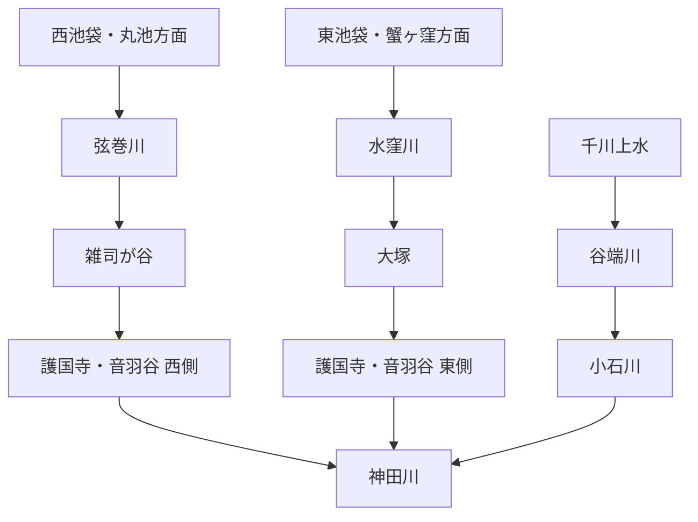

# otowa-ankyoscape

水窪川・弦巻川・谷端川と、その周辺の旧河道・暗渠・湧水・用水・土地利用について調べた記録です。

中心となる範囲は、池袋・雑司が谷・護国寺・音羽・小日向・小石川です。

> [!IMPORTANT]
> このリポジトリでは、既知の河川史をまとめるだけでなく、**まだ決着していない流路・接続・成立年代を史料から検証すること**を重視します。
> とくに「水窪川と弦巻川はどこかで合流していたのか」「音羽谷西側の弦巻川下流はいつ成立したのか」「弦巻川・水窪川側と谷端川側の更新世旧河道はどちら向きに流れていたのか」は中心的な未解決問題です。

  

幕末の音羽・雑司ヶ谷周辺を描いた尾張屋版 <i>Otowa ezu</i>。1851年近吾堂板とは別史料。画像をクリックすると合流問題の検討ページへ移動します。

## 未解決問題

このリポジトリの中心です。解決していない問題は川別の概要へ埋め込まず、できるだけ独立した文書として追跡します。

| 問題 | 現状 |
| --- | --- |
| **水窪川と弦巻川は合流していたのか** | [独立文書で検討中](docs/open-questions/水窪川と弦巻川の合流・接続問題.md) |
| **音羽谷西側の弦巻川下流はいつ成立したのか** | [独立文書で検討中](docs/open-questions/音羽谷西側の弦巻川下流の成立年代.md) |
| **更新世の旧河道はどちら向きに流れていたのか** | 滝口志郎（2019）が谷端川側への接続可能性を提示するが、流向は未決着 |
| **千川上水から弦巻川・水窪川へ直接分水したのか** | 谷端川への分水は確認できるが、両河川への直接分水は未確認 |

→ [未解決問題の一覧](docs/open-questions/README.md)

## 水系の全体像

これは近代以降に把握しやすい大まかな配置であり、全時代にそのまま当てはまるとは限りません。近世の造成・灌漑、近代の河川改修、暗渠化、下水道再編によって接続関係や流路が変化した可能性があります。

## 現時点で重要なこと

- **弦巻川沿いでは、2000年の豊島区立郷土資料館フィールドワークが、雑司が谷・南池袋で屋敷庭園の池・崖下湧水・大根洗い場の跡を調査対象として記録している。** 豊島区広報課の2000年10月7日付資料は、高田から雑司が谷・南池袋へ進み、**「暗渠化された弦巻川の川筋に沿って、屋敷庭園の池や崖下の湧水、大根洗い場などの跡を辿った」**と記す。〔公的資料に記録された地域史フィールドワーク〕  
  これは弦巻川低地の水利用・景観を、村落灌漑だけでなく、**台地崖下の湧水、屋敷庭園池、農産物洗浄という複数の生活・生産利用**から検討できる手掛かりになる。ただし同資料は各池・湧水・洗い場の住所、利用年代、弦巻川本流との水理的接続を示さない。2000年時点に踏査された「跡」を暗渠化前の施設位置として無補正に確定せず、講座原資料、横山恵美「豊島区の湧き水をたずねて」、旧地籍・火災保険特殊地図等で地点を特定する。〔観察／要地点特定・原調査資料照合〕  
  出典：豊島区広報課「[豊島区の湧き水をたずねて　地域史講座でフィールドワーク](https://adeac.jp/viewitem/toshima-history/viewer/viewer/pressH121007/data/pressH121007.pdf)」（2000年10月7日） / 豊島区立郷土資料館『[かたりべ』60号](https://www.city.toshima.lg.jp/documents/2548/kataribe60.pdf)（2000年11月30日）

## 調査ノート

| テーマ | 文書 |
| --- | --- |
| **主要出典一覧** | [docs/出典一覧.md](docs/出典一覧.md) |
| 水窪川 | [docs/水窪川.md](docs/水窪川.md) |
| 弦巻川 | [docs/弦巻川.md](docs/弦巻川.md) |
| 谷端川 | [docs/谷端川.md](docs/谷端川.md) |
| 千川上水・更新世旧河道・音羽谷の二流など | [docs/横断テーマ.md](docs/横断テーマ.md) |
| 護国寺境内の旧水系 | [docs/護国寺境内の旧水系.md](docs/護国寺境内の旧水系.md) |
| 護国寺星谷の水系 | [docs/護国寺星谷の水系.md](docs/護国寺星谷の水系.md) |
| 『江戸名所図会』護国寺図の検討 | [docs/江戸名所図会・護国寺図の検討.md](docs/江戸名所図会・護国寺図の検討.md) |
| 歴史地形・流路シミュレーション方針 | [docs/歴史地形・流路シミュレーション方針.md](docs/歴史地形・流路シミュレーション方針.md) |
| 文書一覧 | [docs/README.md](docs/README.md) |

## 記号

- **〔確認〕** 一次史料、公的資料、測量図、複数資料などからかなり確実に言えること
- **〔観察〕** 古地図・地形図・写真の比較から読み取ったこと
- **〔推定〕** 複数の事実から自然に考えられるが、直接記録が未発見のこと
- **〔仮説〕** 検証中の説明
- **〔未解決〕** 現時点では判断できないこと

## 出典の扱い

分割後の本文では、**主張の直後から出典へ到達できること**を原則とします。共通書誌は [docs/出典一覧.md](docs/出典一覧.md) に整理しています。

分割前のREADME全文は、情報落ちを避けるため [docs/分割前README全文.md](docs/分割前README全文.md) に保存しています。ただし、これは調査経緯・旧出典番号の保存版であり、分割後の本文が出典を省略する理由にはしません。