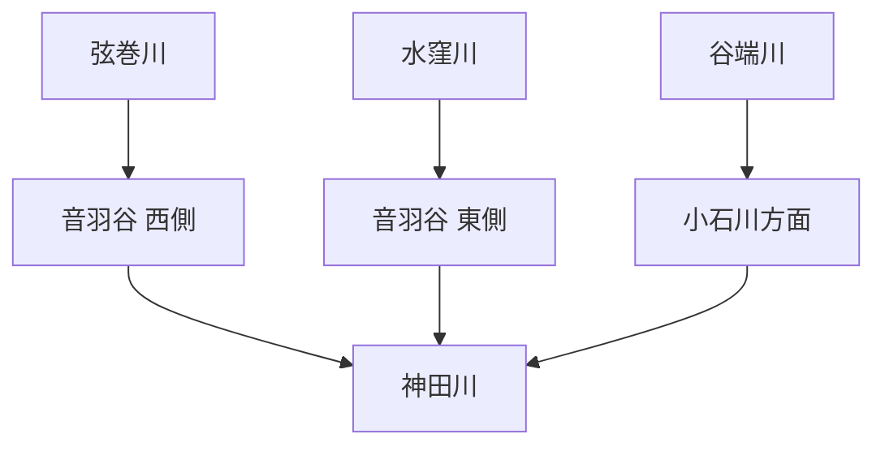
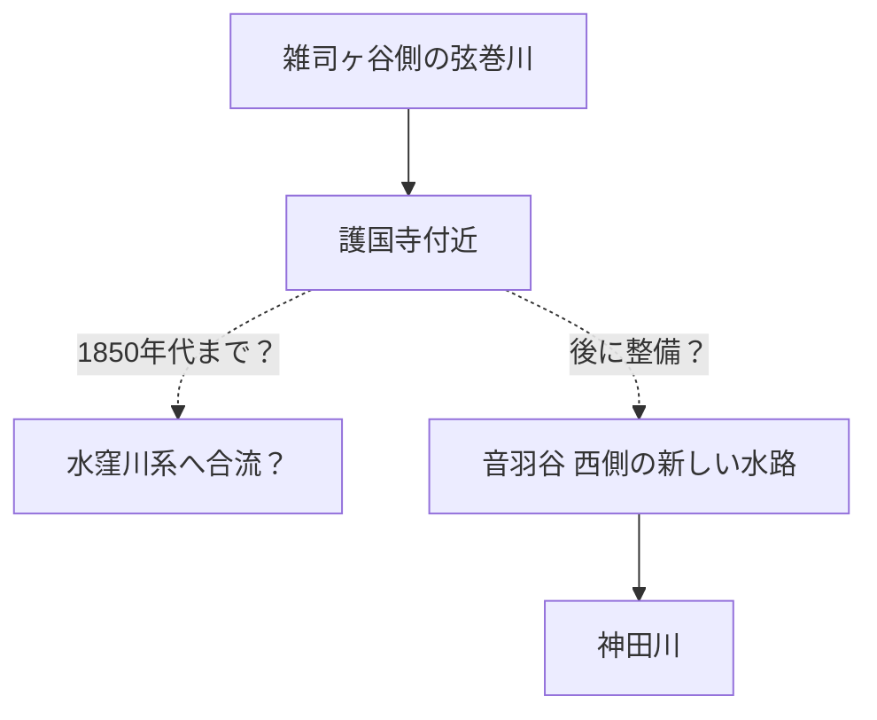

# 2026-08-31 調査メモ：水窪川・弦巻川・谷端川で見えてきたこと

この文書は、2026年8月末までの対話・古地図比較・読書メモから出てきた「おもしろい点」を、**確認できること／観察／仮説**に分けて整理したもの。

> [!IMPORTANT]
> とくに **「音羽通り西側の弦巻川下流がいつ成立したか」** と **「更新世の古い谷をどちら向きに水が流れていたか」** は未解決。
> 古図は測量図ではないため、「描かれていない＝存在しない」とは限らない。

## 1. いちばん大きな発見：3本の川は、時代によって別の水系だった可能性がある

現在は、水窪川・弦巻川・谷端川を別々の川として考えるのが普通である。

しかし地形をさかのぼると、この配置が最初から固定されていたとは限らない。

深田地質研究所の滝口志郎「武蔵野台地の地形に関する諸問題」は、弦巻川・水窪川上流の浅い「高い河床」を更新世の旧河床とみなし、**お茶の水女子大学付近を経て谷端川へつながっていた可能性**を提示している。

ただし、同論文の復元図は「考えられる一例」であり、さらにお茶大付近では推定流路が谷端川に対して**上流側を向くような角度で接続している**。そのため、

- 弦巻川・水窪川側 → 谷端川
- 谷端川側の古い谷 → 護国寺方面
- 途中に分水界があり、時代によって流向が変わった

のどれだったかは、地形図だけでは決められない。

### 現時点の言い方

> **弦巻川・水窪川上流の浅い谷と、谷端川水系の間に古い谷の連続があった可能性はある。だが流向は未確定。**

出典：深田地質研究所「武蔵野台地の地形に関する諸問題」  
https://fukadaken.or.jp/data_pdf/20_35.pdf

---

## 2. 水窪川は、護国寺以前からかなり安定していたように見える

### 1682年・1687年の江戸図

護国寺創建（1681）の直後にあたる1682年・1687年の江戸図では、護国寺付近から音羽谷へ続く**水窪川とみられる流れ**が描かれる一方、弦巻川は確認しにくい。

これは「弦巻川が絶対に存在しなかった」という証明ではない。実際、1850年代の切絵図でも、実在が別資料で確認できる小河川が省略される例がある。

それでも、異なる古図で水窪川側が繰り返し描かれることから、少なくとも当時の地理認識では、**水窪川の方が連続した明瞭な流れだった可能性**がある。

### 谷の東端を流れる理由

一見すると「川なら谷の中央を流れるはず」と思えるが、水窪川の東側には、豊島岡・小日向台の崖線と湧水系がある。

本田創『水のない川 暗渠でたどる東京案内』および現地調査記事では、

- 豊島岡墓地の **蛇池**
- 護国寺境内の複数の湧水池
- それらをつなぐ小水路
- 水窪川への流出

という水系が復元されている。

つまり、水窪川の東寄りの位置は、町割りだけでなく、**崖下湧水を集める自然な排水線**にも支えられていた可能性が高い。

参考：文春オンライン「水窪川」  
https://bunshun.jp/articles/-/50033?page=1

書誌：本田創『水のない川 暗渠でたどる東京案内』山川出版社、2022年。

---

## 3. 「水久保」「水久保新田」は水窪川沿いの土地名だった

今昔マップで、1896～1909年、1917～1924年、1927～1939年の地形図を比較すると、現在の東池袋周辺に **「水久保」「水久保新田」** の地名が確認できる。

一方、1880～1884年の第一軍管地方2万分1迅速測図原図では、同じ一帯は畑として表現され、地名表示は見えない。1909年1万分1地形図では字名がはっきり現れる。

重要なのは、**「水久保」と水窪川の源頭・美久仁小路は同じ場所ではない**こと。

豊島区資料も、水窪川の名を東池袋4丁目付近の旧字「水久保」にちなむと説明している。また「水久保新田」は少なくとも明治初期の字名として確認できる資料がある。

したがって、川名は「源泉の名前」ではなく、**流路途中の低地・農地の地名から来た**と考える方がよい。

参考：豊島区広報（1999年、水窪川フィールドワーク）  
https://adeac.jp/viewitem/toshima-history/viewer/viewer/pressH111009/data/pressH111009.pdf

---

## 4. 音羽通り西側の弦巻川は、いつできたのか

これが現在いちばん面白く、いちばん年代が曖昧な問題。

### 1682年

江戸図では水窪川側の流れが目立つが、音羽通り西側を独立して南下する弦巻川は確認しにくい。

### 1853年前後

雑司ヶ谷村の村方資料では、弦巻川に架かる複数の橋が記録されており、**雑司ヶ谷側の弦巻川が存在したこと自体は確実**。

ただし、その資料が主に雑司ヶ谷村域の橋を扱うなら、護国寺より南、音羽通り西側の下流河道まで存在した証拠にはならない。

### 1851～1857年の切絵図

近吾堂・尾張屋系の「雑司ヶ谷・音羽」周辺図を見ると、西から来る弦巻川らしい青線が**護国寺の南西側・寺域方向へ入り込むように見える**。

その一方、音羽町西側を神田川まで延々と下る独立河道は、切絵図上では明瞭でない。

ここから、次の作業仮説が出てくる。

### 1941年資料の「灌漑のため二分」説

1941年の郷土教育資料には、音羽谷の二流について、**谷が水田に開発された際、灌漑のために二分されたのではないか**という推測がある。

1682年図にはすでに水窪川沿いの「田」が見える一方、周囲には「畑」も多い。したがって、「谷で初めて農業が始まった時」というより、**水田を西側へ拡大するときに水路を追加・再編した**と解釈すれば矛盾しない。

田柄川などには、本流と並行する細い灌漑水路を設ける類例もある。

### ただし

本田創の著作・記事は、護国寺創建を契機に水窪川と弦巻川が音羽谷の両崖下へ「整備された」と説明する。これが1681年前後の早い時期の整備を指すのか、後世まで含む長期的な形成をまとめた表現なのかは、現時点で判断できない。

> **未解決：音羽通り西側の弦巻川下流の初出を、1690年代～明治初期の地図・地籍図で絞る。**

---

## 5. 千川上水との関係は、いったん慎重に戻す

千川上水は1696年に開削された。

当初、

> 千川上水の余水 → 弦巻川・水窪川を補水 → 弦巻川が安定

という仮説を考えたが、現在確認できる直接的な資料は **千川上水 → 谷端川** の分水である。

練馬区の資料では、長崎村外三村分水が要町付近から谷端川へつながっていたことを確認できる。

参考：練馬わがまち資料館「千川上水の分水を訪ねて（2）」  
https://www.nerima-archives.jp/column/3572/

千川上水と弦巻川・水窪川の間には谷端川水系があるため、両川へ直接送水したとするなら、分水路・樋・取水口などの具体的証拠が必要。

現在は、

- **確認：千川上水 → 谷端川**
- **未確認：千川上水 → 弦巻川**
- **未確認：千川上水 → 水窪川**

とする。

---

## 6. 川名が多すぎる――「一本の川」という考え方自体に注意

読書メモから、同じ水系でも区間・時代によって名称がかなり変わることが分かった。

### 弦巻川

- 上流部：**布引川**
- 後世の一般名：弦巻川
- 音羽谷下流：鼠ヶ谷下水と呼ばれる場合がある
- 雑司ヶ谷霊園西側から注ぐ支流も存在

### 水窪川

- 上流部：**日の出川**
- 「水久保川」
- 下流部：**音羽川**
- 江戸期：**東青柳下水**
- 下流では鼠ヶ谷下水の呼称も関係

### 谷端川

- 豊島区・板橋方面：谷端川
- 文京区内：**小石川**、**氷川**などの呼称

この別名の多さは、近代以後の地図のように「源流から河口まで一本の固有名で固定された河川」として過去を見ない方がよいことを示している。

地域ごとに、湧水路・排水路・農業用水・下水として別々に認識され、後から一本の水系として整理された可能性がある。

参考：実業之日本社『失われた川を歩く 東京「暗渠」散歩 改訂版』（2021）。出版社目次で弦巻川・水窪川・谷端川・小石川を独立項目として収録していることを確認。  
https://www.j-n.co.jp/books/978-4-408-33965-8/

※ 上記の細かな別名は読書メモによる。ページ番号を記録して再確認する。

---

## 7. 護国寺は「川の横に建った寺」ではなく、水系を抱え込んでいた

護国寺周辺を古図・地形・現地資料で見ると、寺域には複数の池・小水路・橋があり、豊島岡側の谷や蛇池の水が関係していた可能性が高い。

1850年代の切絵図でも、弦巻川らしい水路が護国寺の寺域に入り込むように見える。

したがって護国寺は、単に弦巻川・水窪川の間に後から置かれた寺ではなく、**周囲の湧水・谷・水路を境内景観や排水に組み込んだ施設**として考えた方が理解しやすい。

詳細は `docs/gokokuji-water-system.md` を参照。

---

## 8. 暗渠化しても、川筋と管路は同じとは限らない

弦巻川中流では、暗渠化の際に旧河道から現在の弦巻通り方面へ流路を付け替えた区間がある。

したがって、

> **現在の暗渠道 ＝ 暗渠化直前の自然河道**

とは限らない。

旧河道を復元する場合は、

1. 暗渠化直前の地形図
2. 現在の下水道台帳
3. 細長い地割・裏道・宅地境界

を別レイヤーで比較する必要がある。

### 暗渠化年代の現状整理

- 弦巻川：1932年（昭和7）に高田町の事業として暗渠化。
- 水窪川：豊島区資料では「昭和初期から戦後にかけて下水化」。全区間を1933年と一括するのは危険。
- 谷端川：下流部の大規模暗渠工事は1934年。上流側はその後も長く開渠・改修区間が残り、豊島区資料では昭和30年代後半に全域暗渠化と整理される。

参考：豊島区『かたりべ』95号（谷端川）  
https://www.city.toshima.lg.jp/documents/2546/kataribe95.pdf

---

## 9. 地下では水窪川と弦巻川が交差する

江戸川橋付近では、現在の下水道化した水窪川・弦巻川系統が平面上で交差し、神田川への出口の左右が上流側と入れ替わる。

これは自然河川時代から開渠が交差していたという意味ではなく、**暗渠・下水道整備後の立体交差**と考えるべき。

水窪川下流では、さらに神田上水の下を石樋でくぐった痕跡も知られている。

地上の川筋を見ているだけでは、地下の水系は分からない好例。

---

## 10. 首都高沿いの弦巻川水路敷は、少なくとも2021年には入れなかった

2010年の「東京の水」記事では、音羽付近の弦巻川水路敷へ入り、湧水まで撮影した記録がある。

https://tokyoriver.exblog.jp/13903570/

一方、2021年2月23日の現地記録では、黒い柵が設置され「入れない」状態が確認できる。

したがって、

> **2010年3月～2021年2月の間に、少なくとも物理的に進入できない状態になった**

と絞れる。

またこの区間の旧河道は、首都高速道路の中央直下というより、**高速の東縁～東側に残る細長い水路敷**として追える区間がある。「首都高の下」という一般的説明は、区間によっては高架の張り出しを含む大まかな表現と考えた方がよい。

---

## 11. 谷端川は暗渠化後も都市の形を作り続けた

谷端川は、暗渠化した後も、緑道・児童遊園・下水道幹線として都市空間を規定している。

さらに戦前には、谷端川流域の長崎・要町・千早・西池袋周辺にアトリエ村が集まり、**池袋モンパルナス**と呼ばれる芸術文化圏が形成された。

川そのものだけでなく、低地・安い土地・市街化の進み方まで追うと、暗渠と文化史がつながる。

参考：豊島区「池袋モンパルナス」関連資料、実業之日本社『東京「暗渠」散歩 改訂版』。

---

# 年代別・暫定整理

| 年代 | できごと | 重要点 |
|---|---|---|
| 更新世 | 弦巻川・水窪川上流の浅い高位河床 | 谷端川側との旧谷接続説。流向は未確定 |
| 1681 | 護国寺創建 | 河川・境内水系・門前町整備の大きな転換点 |
| 1682 | 江戸図 | 水窪川とみられる流れを確認。弦巻川は不明瞭 |
| 1687 | 江戸図 | 同様に水窪川側が目立つ |
| 1696 | 千川上水開削 | 谷端川への分水は確認。弦巻・水窪への直接補水は未確認 |
| 18世紀 | 谷端川が千川上水分水を受ける | 谷端川が自然湧水＋人工用水の複合河川になる |
| 1850年代 | 弦巻川は雑司ヶ谷で確実に存在 | ただし音羽谷西側下流の成立時期は未確定 |
| 1851～57 | 切絵図 | 弦巻川らしい水路が護国寺側へ入るように見える |
| 明治初期以後 | 実測図 | 音羽谷東西の二流が明瞭になる |
| 1896～1939 | 地形図 | 「水久保」「水久保新田」の字名を確認 |
| 1909 | 1万分1地形図 | 字名・河道・土地利用をかなり細かく追える |
| 1932 | 弦巻川暗渠化 | 中流では流路付け替えも発生 |
| 1934 | 谷端川下流暗渠工事 | 谷端川全体はまだ開渠区間が残る |
| 昭和30年代後半 | 谷端川 | 豊島区資料では全域暗渠化完成と整理 |
| 1986 | 水窪川旧流路 | 「小さな川が流れていた」とする記憶表示 |
| 2010 | 弦巻川水路敷 | 進入・湧水撮影の記録あり |
| 2021 | 同水路敷 | 黒い柵で進入できない状態を確認 |

---

# 次に調べたいこと

1. **音羽通り西側の弦巻川の初出**  
   1690年代～1880年代の地図、地籍図、護国寺文書、水利記録を年次比較する。

2. **1850年代の「境橋」の正確な位置**  
   雑司ヶ谷村内の弦巻川記録がどこまでをカバーしていたかを判断する鍵になる。

3. **千川上水から弦巻川・水窪川への直接分水の有無**  
   千川家文書、分水絵図、樋口記録を確認する。

4. **お茶大付近の古い谷の流向**  
   DEMだけでなく、ボーリング柱状図・旧河床礫・地質断面で確かめる。

5. **1682年図の「田」「畑」の土地利用精度**  
   後の地籍図と比較し、「灌漑のため二流に分けた」説を検証する。

6. **川の別名の原典確認**  
   「布引川」「日の出川」「音羽川」「東青柳下水」「鼠ヶ谷下水」「氷川」について、書籍のページと原史料を記録する。

---

# 主要参考資料

- 滝口志郎「武蔵野台地の地形に関する諸問題」深田地質研究所、2019  
  https://fukadaken.or.jp/data_pdf/20_35.pdf
- 本田創 編著『失われた川を歩く 東京「暗渠」散歩 改訂版』実業之日本社、2021  
  https://www.j-n.co.jp/books/978-4-408-33965-8/
- 本田創『水のない川 暗渠でたどる東京案内』山川出版社、2022  
  https://ci.nii.ac.jp/ncid/BC16603422?l=ja
- 豊島区広報「水窪川」フィールドワーク、1999  
  https://adeac.jp/viewitem/toshima-history/viewer/viewer/pressH111009/data/pressH111009.pdf
- 豊島区立郷土資料館だより『かたりべ』95号「谷端川の流路について考えた…」  
  https://www.city.toshima.lg.jp/documents/2546/kataribe95.pdf
- 練馬わがまち資料館「千川上水の分水を訪ねて（2）」  
  https://www.nerima-archives.jp/column/3572/
- 文春オンライン「水窪川」  
  https://bunshun.jp/articles/-/50033?page=1
- 東京の水「弦巻川」音羽付近の現地記録、2010  
  https://tokyoriver.exblog.jp/13903570/

## 調査上の注意

- 江戸切絵図は案内図であり、測量図として扱わない。
- 「川が描かれていない」ことは、存在しない証拠にはならない。
- 現在の下水管と暗渠化直前の旧河道は一致しない場合がある。
- 後世の解説が述べる「整備された」「二分された」は、工事年を直接示す一次記録とは限らない。
- 仮説は、反証可能な形（初出年、流向、地籍、地質）で残す。
