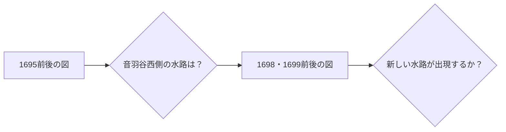
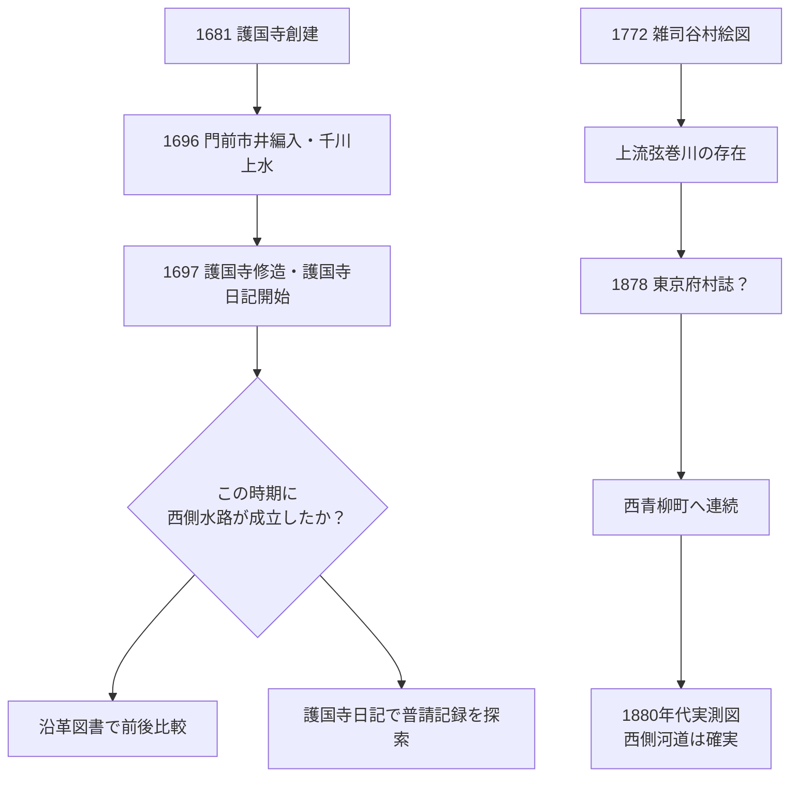

# 一次史料フォローアップ（2026-08-31）

この文書は、`README.md` と `docs/source-review-addendum-2026-08-31.md` を確認したうえで、まだ十分に組み込まれていなかった一次史料・史料群を追加するためのメモである。

特に狙うのは、現在もっとも年代が曖昧な **「音羽通り西側の弦巻川下流がいつ成立したか」** と、近世の **水窪川・弦巻川・鼠ヶ谷下水の呼称と接続関係** である。

> [!IMPORTANT]
> ここでは、所蔵機関が公開している原史料・書誌を最優先する。
> 個人ブログ等に原文の翻刻・引用がある場合は「探索用の二次資料」として使い、原画像で確認するまでは一次史料の本文として確定しない。

---

## 1. 『御府内備考』は巻を特定して読む

これまでリポジトリでは『御府内備考』を重要史料候補として挙げていたが、東京都公文書館の目録から、今回の対象地域に対応する巻をかなり具体的に絞れる。

### 護国寺領三ケ町

**『御府内備考 五十（護国寺領三ケ町）』**

- 成立：文政12年（1829）
- 請求記号：DG-214
- 対象：東青柳町、西青柳町、音羽町一～九丁目、桜木町など
- 東京都公文書館で画像公開

https://www.archives.metro.tokyo.lg.jp/detail?cls=collection_01&pkey=000100955

水窪川・弦巻川の音羽谷下流、東西青柳町、「鼠ヶ谷下水」の呼称を調べるなら、まずこの巻を通読する価値が高い。

### 高田・雑司ケ谷

**『御府内備考 五十一、五十二（高田、雑司ケ谷）』**

- 成立：文政12年（1829）
- 請求記号：DG-215
- 東京都公文書館で公開

東京都公文書館の検索結果では、DG-214の直後にこの巻が登録されている。

https://www.archives.metro.tokyo.lg.jp/list?c10_l=1&c11_a=3&c11_l=1&c12_a=1&c12_l=1&c13_a=1&c13_l=1&c15_f_U=0&c15_t_U=0&c16_a=1&c17_f=1&c17_l=2&c3_a=3&c4_a=3&c4_l=1&c5_a=3&c6_a=3&c7_a=3&chkCls=collection_01&cls=top&order=0&pn=1&secIdx=0

こちらは弦巻川上流、雑司ヶ谷村内の用水・小名・橋・水路を追う基礎史料になる。

### 何を探すか

原画像では、少なくとも次の語を重点的に確認する。

- 弦巻川／鶴巻川
- 水久保／水窪
- 東青柳下水
- 鼠ヶ谷下水／鼠谷下水
- 東西鼠谷下水
- 用水、悪水、下水、溝
- 西青柳町、東青柳町
- 雑司ヶ谷、高田

探索用の二次資料には、東青柳町側の流れについて「巣鴨村・雑司ヶ谷村の田場際から流れ出て、音羽町裏を通り江戸川へ流出する」、西青柳町側について弦巻川の名や鼠ヶ谷下水との関係を記したとする紹介がある。

https://ameblo.jp/kazuaruki/entry-12940940845.html

ただし、これは **原画像で該当箇所を確認するまで引用根拠にはしない**。

### この史料が重要な理由

「鼠ヶ谷下水」が水窪川・弦巻川のどの区間を指すのかを整理できれば、近世の人々が二つの川を源流から河口まで一貫した固有河川として認識していたのか、それとも音羽谷下流を一体の排水系として呼んでいたのかが見えてくる。

---

## 2. 「水久保」は一地点だけの地名と決めない

現在の README では、旧版地形図の「水久保」「水久保新田」を現在の東池袋4丁目付近に対応させ、美久仁小路の源頭とは別地点としている。この区別自体は重要である。

しかし、さらに古い地名資料を見ると、「水久保」という名称の範囲はもう少し複雑だった可能性がある。

### 『新編武蔵風土記稿』

国立公文書館デジタルアーカイブには『新編武蔵風土記稿』の原資料群が公開されている。

https://www.digital.archives.go.jp/file/1224755.html

二次的な小字索引では、文政13年（1830）頃の小名として、

- 巣鴨側に「水久保」
- 雑司ヶ谷村側にも「水久保」
- 雑司ヶ谷村には「弦巻」「星谷」なども存在

と整理されている。

探索用索引：
https://spidersweb-map.github.io/koaza-map/pages/%E5%8C%97%E8%B1%8A%E5%B3%B6%E9%83%A1.html

### 暫定的な修正

したがって、現段階では

> 「水久保」は後世の地形図に書かれた東池袋4丁目付近だけを指す単一の小字だった

とは固定しない方がよい。

「美久仁小路＝源頭」と「水久保＝旧地名」は別の問題として残し、明治初期の地租改正地引絵図・字界図と重ねて範囲を復元する必要がある。

---

## 3. 『新編武蔵風土記稿』の弦巻川記述を原本確認する

探索用の二次資料では、『新編武蔵風土記稿』雑司ヶ谷村の記事について、

- 丸池が村の西北にある
- 弦巻川は丸池の下流
- 川幅は七尺ほど
- 村の用水として使われる

という内容が紹介されている。

https://ameblo.jp/kazuaruki/entry-12940940738.html

これが原文で確認できれば、少なくとも文政期には、**丸池―弦巻川―雑司ヶ谷村内の農業用水**という関係を一次史料で押さえられる。

現在 README にある「丸池は弦巻川の源流」という豊島区公式資料より、近世に近い記述として価値が高い。

> [!NOTE]
> 二次資料の引用文だけで確定せず、国立公文書館の『新編武蔵風土記稿』で雑司ヶ谷村の記事を直接確認する。

---

## 4. 明治11年（1878）『東京府村誌』は弦巻川下流の年代を絞る鍵

今回新たに優先度が上がったのが **明治11年（1878）の『東京府村誌』雑司ヶ谷村の記事** である。

探索用の二次資料は、同村誌が弦巻川について、丸池を源とし、雑司ヶ谷村の中央を東へ流れて **西青柳町へ通じる** と記していると紹介している。

https://ameblo.jp/kazuaruki/entry-12940940738.html

この記述を原本で確認できれば、非常に重要である。

### なぜ重要か

現在の作業仮説では、音羽通り西側の弦巻川下流について、

- 1851・1857年の切絵図だけでは存在・非存在を断定できない
- 1880年代の実測図では東西二流が明瞭

という状態にある。

ここに1878年の「西青柳町へ通す」が一次史料として入れば、

となり、少なくとも **1878年までには弦巻川が雑司ヶ谷から西青柳町方向へ連続していた** ことを文章史料で確認できる可能性がある。

ただし、「西青柳町へ通す」だけでは、その後に音羽通り西側をどこまで南下したか、神田川まで独立流路だったかまでは決まらない。西青柳町内の流路は『御府内備考』や地籍図と組み合わせる必要がある。

### 次にすること

- 『東京府村誌』雑司ヶ谷村の原本・翻刻の所蔵先を特定する
- 該当ページを確認する
- 「西青柳町」の町界と1870年代の河道を地図上に重ねる

---

## 5. 1696～1697年を調べる史料が揃っている

「護国寺創建の1681年に西側水路が完成した」とするには直接史料が不足している。一方で、**1696～1697年には護国寺・門前・千川上水に関する出来事が集中している**。

### 『東京市史稿 市街篇 第12』

東京都公文書館の目次から、次の項目を確認できる。

- 1696年：**千川上水鑿通**（市街12-1030）
- 1696年11月5日：**護国寺門前市井編入**（市街12-0767）
- 1697年1月12日：**護持院護国寺修造**（市街12-1131）
- 1697年8月27日：**附記 護国寺門前**（市街12-1143）
- 1697年7月：**参考 護国寺前新茶屋**（市街12-1151）

https://www.soumu.metro.tokyo.lg.jp/01soumu-archives/06kanko_butsu/0601sisiko/0601shigai/0601shigai12

特に「護国寺門前市井編入」が1696年11月5日とされる点は重要である。これまで「1697年前後に門前町が成立」と大づかみに扱っていたが、調査対象を **1696年末～1697年** にかなり絞れる。

### 『護国寺日記』

『護国寺日記』は、元禄10年（1697）から宝暦8年（1757）まで、途中に欠落を含みつつ253冊が現存するとされる。刊行された翻刻の第1巻は **1697～1700年** を含む。

書誌・刊行情報：

https://catalogue.books-yagi.co.jp/books/view/587

https://ci.nii.ac.jp/ncid/BB15371980

これはまさに門前・寺域の大規模な再編が疑われる時期と重なる。

### 日記で検索したい語

- 川、溝、水、下水
- 用水、悪水
- 普請、掘、浚、堀
- 田、畑、新田
- 音羽、青柳、西青柳、東青柳
- 雑司ヶ谷、高田
- 橋
- 門前、茶屋

西側河道の工事そのものが記録されていなくても、門前造成、土地割、排水普請、橋普請などの記録があれば年代を絞れる。

---

## 6. 『御府内往還其外沿革図書』系列は「工事前後の地図」を探せる可能性がある

江戸幕府普請方が編纂した **『御府内往還其外沿革図書』『御府内場末往還其外沿革図書』** は、道路・橋梁・河梁・空閑地などの変遷を地域ごとに追った史料である。

国立国会図書館の解題：
https://ndlsearch.ndl.go.jp/books/R100000002-I000007293417

東京都公文書館の解説：
https://www.soumu.metro.tokyo.lg.jp/01soumu-archives/07edo_tokyo/0703kaidoku/0703kaidoku_22/0703kaidoku_22_2

東京都立図書館の案内では、沿革図に延宝年間から文久元年までの地図があり、同一地区の土地・道路等の変遷を比較できると説明されている。

https://www.library.metro.tokyo.lg.jp/search/research_guide/tokyo/index/map/

復刻版の一部には、内容年として **1695・1698・1699年** を含む巻があることも確認できる。

https://ndlsearch.ndl.go.jp/books/R100000002-I000010650283

### ただし重要な留保

現時点では、1695・1698・1699年の図が **護国寺・音羽を含む同一地区の図であることまでは確認できていない**。復刻版全体の索引・解説篇から、護国寺・音羽・青柳・高田・雑司ヶ谷を含む図番号を先に特定する必要がある。

もし同一地区について1695年と1698～1699年の図が残っていれば、これは極めて強い。

つまり、**1696～1697年の門前整備に伴って西側水路が成立したか**を、後世の概略地図ではなく幕府普請方の沿革図で検証できる可能性がある。

---

## 7. 「1681年に二川を整備」と「1696～1697年の門前再編」を分ける

本田創の著作・記事では、1681年の護国寺創建を契機として、水窪川・弦巻川が音羽谷の東西崖下へ整備されたと説明される。

この説明と今回追加した史料候補は矛盾しない。

「1681年に創建を契機とする長期的な造成が始まった」と、

「1696～1697年の門前の市井編入・護国寺修造の時期に具体的な町割・水路整備が行われた」

は両立するからである。

したがって、今後は次のように書き分ける。

- **1681年**：護国寺創建。水路・谷の再編を考える出発点
- **1696年**：千川上水開削、護国寺門前市井編入
- **1697年**：護国寺修造、門前に関する記録が増える。『護国寺日記』開始
- **西側弦巻川下流の完成年**：依然として未確定

ここで千川上水と年代が重なることは興味深いが、**千川上水から弦巻川・水窪川への直接分水は未確認**という現在の整理を維持する。

---

## 8. 現在の「西側弦巻川成立年代」の証拠階層

現時点で、証拠を年代順に置くと次のようになる。

| 年代 | 史料 | 読み取れること | 強さ |
|---|---|---|---|
| 1681 | 護国寺創建 | 周辺造成の契機 | 背景 |
| 1682・1687 | 広域江戸図 | 水窪川側は描かれるが弦巻川は不明瞭 | 省略可能性あり |
| 1696 | 東京市史稿 | 千川上水開削、護国寺門前市井編入 | 年代確定に有用 |
| 1697 | 東京市史稿・護国寺日記 | 護国寺修造、門前記録、日記開始 | 最重要調査期 |
| 1772 | 雑司谷村絵図 | 雑司ヶ谷側弦巻川が描かれるとされる | 高精細原図確認待ち |
| 文政期 | 新編武蔵風土記稿 | 丸池―弦巻川―用水の記述とされる | 原文確認待ち |
| 1829 | 御府内備考 | 高田・雑司ヶ谷、護国寺領三町を詳細に調査可能 | 原画像公開 |
| 1851・1857 | 切絵図 | 護国寺付近に弦巻川らしい青線。下流全体は判定困難 | 補助史料 |
| 1878 | 東京府村誌 | 弦巻川が西青柳町へ通じるとの記述が紹介される | 原本確認待ち・重要 |
| 1880年代 | 実測図 | 音羽谷東西二流が明瞭 | 強い |

この表から分かるのは、現在必要なのは「もっと新しい地図」ではなく、**1690年代の沿革図・日記と、1878年村誌の原文確認**である。

---

# 優先順位を更新する

既存の `docs/source-review-addendum-2026-08-31.md` の調査候補に加え、次の順で確認したい。

1. **『御府内備考 五十（護国寺領三ケ町）』DG-214を画像で通読**  
   東青柳・西青柳・音羽町の川、下水、鼠ヶ谷下水の原文を採取する。

2. **『御府内備考 五十一・五十二（高田、雑司ケ谷）』DG-215を通読**  
   弦巻川、水久保、橋、用水の記録を確認する。

3. **『東京府村誌』1878年・雑司ヶ谷村の原本を特定**  
   「弦巻川が西青柳町へ通す」とされる記述を一次史料で確認する。

4. **『護国寺日記』第1巻（1697～1700）を確認**  
   門前造成・排水・水路・橋・田畑の普請記事を探す。

5. **『東京市史稿 市街篇 第12』の1696～1697年護国寺関係項目の本文と原典を追う**  
   とくに「護国寺門前市井編入」「護持院護国寺修造」「附記 護国寺門前」。

6. **『御府内往還其外沿革図書』系列で護国寺・音羽を含む図番号を特定**  
   1695前後と1698～1699前後の同一地点比較ができるか確認する。

7. **『新編武蔵風土記稿』雑司ヶ谷村・巣鴨村の記事を原画像で確認**  
   丸池、弦巻川、水久保、星谷等の記述を採取する。

8. **明治初期の地租改正地引絵図・字界資料で「水久保」「水久保新田」を復元**  
   美久仁小路との位置関係、巣鴨村・雑司ヶ谷村双方の「水久保」の範囲を確定する。

---

# 現段階での仮説への影響

今回追加した資料候補だけで、西側弦巻川の成立年を決めることはまだできない。

ただし、検証の焦点はかなり狭くなった。

したがって現在の最重要な問いは、

> **1681年創建時にすでに西側河道ができていたのか、それとも1696～1697年の門前・寺域再編の際に成立したのか。それでもなく、さらに後の灌漑再編で成立したのか。**

である。

この問いに対して、1690年代の沿革図・『護国寺日記』・1829年『御府内備考』・1878年『東京府村誌』を時間順に並べれば、現在の大きな空白をかなり縮められるはずである。
