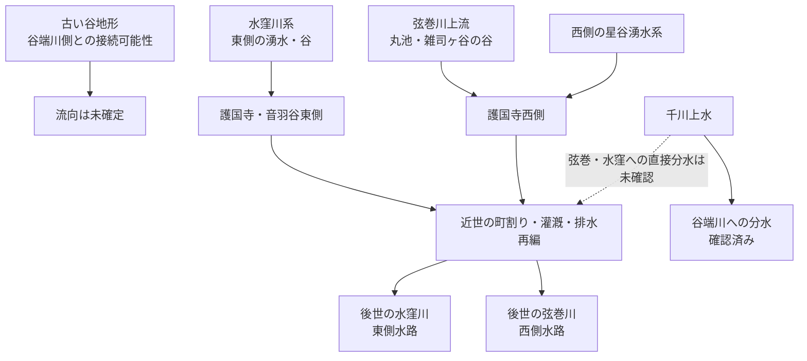

# 資料レビュー補遺（2026-08-31）

この文書は、リポジトリ内の `README.md`、`docs/chat-findings-2026-08-31.md`、`docs/gokokuji-water-system.md`、`docs/gokokuji-hoshiyato-water-system.md`、`docs/historical-terrain-and-flow-simulation-plan.md` を読み比べ、重複を避けながら、**不足していた資料・後から判明した訂正・今後優先して確認したい原資料**を補うためのメモである。

> [!IMPORTANT]
> 現時点では `README.md` がもっとも更新が進んでいる。とくに **1850年代の弦巻川の読み方、1853年とされていた村方資料の扱い、1772年雑司谷村絵図、谷端川暗渠化の段階性** については、`docs/chat-findings-2026-08-31.md` より README の方が慎重で新しい。

---

## 1. 1772年『武蔵国豊島郡雑司谷村絵図』を年代整理に追加する

豊島区立郷土資料館の「豊島区地域地図集」第5集には、**明和9年（1772）『武蔵国豊島郡雑司谷村絵図』**と読みおこし参考図が収録されている。

豊島区公式：
https://www.city.toshima.lg.jp/129/bunka/bunka/shiryokan/kankobutu/005951.html

地域史の紹介では、この絵図に弦巻川の川筋が描かれているとされる。

補助的二次資料：
https://zoushigaya.seesaa.net/article/189594335.html

### 意味

1682・1687年の広域江戸図で弦巻川が確認しにくい一方、1772年の村絵図で雑司ヶ谷側の弦巻川が確認できるなら、少なくとも

という時間軸を置ける。

ただし、**1772年図が証明できるのはまず雑司ヶ谷村内の流路であり、音羽通り西側の下流河道が同時点で存在したかは別問題**である。原図または高精細複製で、護国寺方向の末端を直接確認する必要がある。

---

## 2. 1851年切絵図は「護国寺で弦巻川が終わる」証拠にはならない

近吾堂系『音羽目白雑司ヶ谷辺絵図』（嘉永4年＝1851）では、西側から来る青い水路が護国寺南西端に達する。高精細画像では、水路は道路・寺域付近を横切ったあと、**下流側にも短く青線が続いて寺域外へ出ているように見える**。

台東区立図書館：
https://adeac.jp/taito-lib/catalog/mp070540-100070

一方、尾張屋版『嘉永新鐫雑司ケ谷音羽絵図』安政4年（1857）改では、この短い下流側の線が省略されているように見える。

東京都立図書館：
https://archive.library.metro.tokyo.lg.jp/da/detail?tilcod=0000000013-00042340

### 修正すべき読み

以前の作業仮説だった

> 弦巻川が護国寺境内へ入り、そこで水窪川に合流した

は、1851年図の高精細画像を見ると**根拠が弱くなる**。

現在は、

- 1851年：護国寺南西端を越えて下流へ続く短い水路が見える
- 1857年：同部分が省略されているように見える
- 切絵図は小河川を選択的に省略する

と整理する方がよい。

したがって、1850年代の切絵図だけから

- 「護国寺で水窪川に合流していた」
- 「音羽通り西側を神田川まで独立して流れていた」

のどちらも断定しない。

---

## 3. 「嘉永6年（1853）の村方資料」は史料名・年代を確定しない

弦巻川の橋として、卒塔婆橋・鎌倉橋・木村橋・南坂橋・弦巻橋・松屋橋・境橋などが紹介されている資料があるが、現時点では、これを**『嘉永六年 雑司ヶ谷村ほか沿革起立書上』という正式史料名・1853年成立史料として確定できていない**。

豊島区の2000年講演会プレス資料は、江戸時代の地誌・橋名等を参照した講演が行われたことを示すが、ウェブ上の本文だけではその原史料の正式名称・成立年を直接確認できない。

豊島区プレス資料：
https://adeac.jp/toshima-history/viewer/mp408233/pressH120213/

候補として国立国会図書館に旧幕府引継書『町方書上（145） 高田・雑司ヶ谷町方書上 全』があるが、同一史料とは未確認。

https://dl.ndl.go.jp/pid/2571626

### 取り扱い

橋名そのものは重要な手掛かりだが、

> 「1853年にはこの7橋が存在した」

と年まで固定するのは、原史料を同定してからにする。

特に **境橋の位置** は、村方資料がどこまで下流を対象にしていたかを決める鍵なので、橋名の原文と絵図・字界をセットで確認したい。

---

## 4. 水窪川の旧地名は「源頭」と「水久保」を分ける

今昔マップの旧版地形図では、現在の東池袋付近で **「水久保」「水久保新田」** の地名を確認できる。

観察した時期：

- 1896～1909年
- 1917～1924年
- 1927～1939年

一方、1880～1884年の第一軍管地方2万分1迅速測図原図では、同付近は畑として表現され、字名の表示は確認しにくい。

今昔マップ：
https://ktgis.net/kjmapw/

重要なのは、**「水久保」は水窪川の源頭とされる美久仁小路付近そのものではない**こと。

したがって、川名「水窪川／水久保川」は、源泉一点の名称ではなく、**流路途中の低地・農地の旧字名と関係する**と整理する。

---

## 5. 明治末の水窪川を写した可能性のある「久世山」絵葉書

「東京新名所　久世山ヨリ早稲田ヲ望ム / THE WASEDA FROM KUSEYAMA」という絵葉書で、明治43年（1910）と読める消印を持つ個体が確認されている。

前景の久世山崖下には、水窪川の開渠または河道沿い低地とみられる細長い筋が写る可能性がある。

### 評価

- 明治期地図上の水窪川の位置とは整合する。
- ただし写真解像度から水面そのものを断定するのは難しい。

よって、**「1910年頃の水窪川を写した可能性のある写真史料」**として保留付きで扱う。

これは、昭和の暗渠化以前に水窪川が小日向台・久世山側の崖下を流れていたことを視覚的に検討する資料になる。

---

## 6. 別名・支流情報を一本の川名に固定しすぎない

『失われた川を歩く 東京「暗渠」散歩 改訂版』の読書メモから、区間・時代による呼称の違いが確認できる。

### 弦巻川

- 上流部：**布引川**
- 雑司ヶ谷霊園西側から注ぐ支流があったとされる
- 後世の一般名：弦巻川

### 水窪川

- 上流部：**日の出川**
- 水久保川
- 下流部：**音羽川**
- 江戸期：**東青柳下水**
- 鼠ヶ谷下水の呼称とも関係する

### 谷端川

- 豊島・板橋方面：谷端川
- 文京区内：**小石川・礫川**
- 資料・区間によって **氷川** の呼称

書誌：
本田創 編著『失われた川を歩く 東京「暗渠」散歩 改訂版』実業之日本社、2021。
https://www.j-n.co.jp/books/978-4-408-33965-8/

> [!NOTE]
> 上記の細かな別名は読書メモによる。引用・論証に使う際はページ番号を記録して再確認する。

この呼称の多さは、近代の河川名を更新世・近世へそのまま遡及させない方がよいことを示す。地域ごとの湧水路・用水・悪水路・自然河川が、時代によって接続・分離・改称された可能性を常に残す。

---

## 7. 千川上水との関係：直接補水説より「谷端川への分水」を先に置く

千川上水は元禄9年（1696）に開削された。

現時点で直接資料を確認できるのは、**千川上水から谷端川への分水**である。長崎村外三村分水が要町付近から谷端川側へつながっていた。

練馬区「千川家文書」：
https://www.city.nerima.tokyo.jp/kankomoyoshi/annai/rekishiwoshiru/rekishibunkazai/bunkazai/b0904.html

練馬わがまち資料館「千川上水の分水を訪ねて（2）」：
https://www.nerima-archives.jp/column/3572/

したがって現在は、

- **確認：千川上水 → 谷端川**
- **未確認：千川上水 → 弦巻川**
- **未確認：千川上水 → 水窪川**

とする。

地理的にも千川上水と弦巻川・水窪川の間には谷端川水系があるため、両川へ直接補水したとするなら、**分水口・分水路・樋・堰・水路横断施設などの具体的な史料**が必要である。

---

## 8. 谷端川と更新世旧河道説：接続と流向を分けて考える

深田地質研究所の滝口志郎「武蔵野台地の地形に関する諸問題」は、弦巻川・水窪川上流の浅い高位河床が、お茶の水女子大学付近を経て谷端川側へつながっていた可能性を示す。

https://fukadaken.or.jp/data_pdf/20_35.pdf

しかし図6では、お茶大付近の推定流路が、現在の谷端川に対して**上流側を向くような角度**で接続するように見える。

したがって、現時点で確実に分けるべきなのは次の二点。

1. **古い谷筋がつながっていた可能性**
2. **そこをどちら向きに水が流れていたか**

流向については、

- 弦巻川・水窪川側 → 谷端川
- 谷端川側の古い谷 → 護国寺方面
- 途中に分水界
- 河川争奪・流路逆転
- 図6が概略図で、合流角は厳密ではない

の複数案を残す。

特に、**「谷端川の一部が分岐して水窪川側へ流れていた方が平面形として自然ではないか」**という疑問は検討価値がある。ただし自然河川で本流から支流が分岐する形も説明が必要なので、平面図だけで決めず、旧河床勾配・ボーリング柱状図・埋没谷底面を使って判定する。

---

## 9. 谷端川の暗渠化は「1934」と「1964」を単純に一本化しない

『東京「暗渠」散歩 改訂版』の読書メモでは、**下流部1934年、全体1964年**という整理がある。

一方、豊島区公式は、谷端川が **1962年（昭和37）に河川として廃止され、その後は暗渠の下水道幹線として使用された**と説明している。

谷端川南緑道：
https://www.city.toshima.lg.jp/340/shisetsu/koen/033.html

谷端川北緑道：
https://www.city.toshima.lg.jp/340/shisetsu/koen/042.html

また区史年表には、1949～1957年に上流・支流の改修・暗渠化工事が続き、1964年にも約600 mの「浚渫工事」が記録される。

### 現時点の安全な整理

- 1928年：下流部暗渠化を議決
- 1934年：下流約3.27 kmの大規模暗渠工事が竣工
- 1930～50年代：上流・支流で改修・暗渠化が継続
- 1962年：河川として廃止
- 1964年：書籍では全体暗渠化の節目として整理される一方、区史年表には浚渫工事も残る

したがって、**「谷端川全線の暗渠化完了＝1964年」と断定する前に、区間別の工事記録を照合する**。

---

## 10. 1929～1930年の高田町下水道資料は、弦巻川暗渠化直前を追う重要資料

豊島区資料によれば、高田町は1929年に下水道調査費を計上し、1930年に実地調査・設計を終えて東京府へ申請した。郷土資料館には **「高田町下水道設計平面図」** が所蔵されている。

豊島区資料：
https://adeac.jp/viewitem/toshima-history/viewer/viewer/pressH261016_2/data/pressH261016_2.pdf

これは、1932年の弦巻川暗渠化直前に、

- 既存河川
- 計画下水道
- 道路
- 町界

がどのように認識されていたかを調べる重要資料である。

図中の赤線・青線の意味は、**凡例を確認するまで断定しない**。

---

## 11. 護国寺周辺は東西二つの湧水系を分けて考える

既存の `docs/gokokuji-water-system.md` と `docs/gokokuji-hoshiyato-water-system.md` の整理は重要なので、3河川全体の議論にも明示的に接続する。

### 東側・水窪川側

- 豊島岡墓地の谷
- 蛇池
- 護国寺境内の複数の池・水路
- 水窪川への流出という復元

### 西側・弦巻川側

- 星谷の井／星跡の清水
- 枯れにくい湧水の伝承
- 星谷橋
- 弦巻川系との接続可能性

したがって、音羽谷の東西二水路を考える際、単純に「一本の川を人工的に二等分した」とするだけでなく、**もともと東西双方の崖線に小支谷・湧水系があり、それを近世の造成・灌漑・排水が再編した**というモデルも残す。

---

# 優先して入手・確認したい資料

1. **1772年『武蔵国豊島郡雑司谷村絵図』高精細画像**  
   雑司ヶ谷側弦巻川の末端、護国寺方向への流れ、橋位置を直接確認する。

2. **1851年・1857年切絵図の同地点比較**  
   護国寺南西端の青線が版によってどこまで省略されるかを確認する。

3. **「雑司が谷村他沿革起立書上」とされてきた史料の同定**  
   正式史料名・成立年・橋名原文・境橋の位置を確定する。

4. **『千川家文書』の分水絵図・水利記録**  
   谷端川以外に弦巻川・水窪川へ直接送水した記録がないか確認する。

5. **『旧谷端川の橋の跡を探る』**  
   豊島区立郷土資料館友の会、1999年。橋名・旧河道・位置比定に利用できる可能性が高い。  
   https://adeac.jp/toshima-history/catalog/mp406231

6. **甲田篤郎・斉藤崇人・辻本崇夫「谷端川水源地付近における更新世後期以降の環境変遷と土地利用」**  
   谷端川源頭側の古環境・地層を、更新世旧河道説の検証に利用する。  
   https://cir.nii.ac.jp/crid/1520295049406774016

7. **『御府内備考』『御府内沿革図書』『護国寺護持院院内図』**  
   鼠ヶ谷下水・東青柳下水・境内水路・音羽町裏の水路を近世史料で追う。

8. **高田町下水道設計平面図の凡例付き全図**  
   弦巻川暗渠化直前の河川・下水道計画を判読する。

---

# 現時点での更新された作業仮説

最も無理の少ない形は、次のように複数段階を想定することである。

重要なのは、**音羽通り西側の弦巻川下流の成立年はまだ分からない**という点である。1681年の護国寺創建を契機とする整備説はあるが、1850年代切絵図の省略問題、1772年村絵図、灌漑・水田開発説を合わせると、一次史料で工事年を固定するにはまだ足りない。

同様に、更新世の古い谷についても、**「谷端川とつながっていた可能性」と「谷端川へ流れていた」は分けて残す**。
