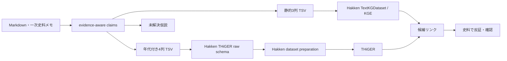

# HakkenOSS 接続メモ

この文書は、`otowa-ankyoscape` の証拠つき知識グラフを Sony Research の [HakkenOSS](https://github.com/SonyResearch/HakkenOSS) へ接続する際に、**実際に公開コードで確認できた境界**を整理する。

## 結論

現在は HakkenOSS を fork しなくても、二段階で接続できる。

1. 静的リンク予測：`TextKGDataset` に三つ組 TSV を渡し、ComplEx / DistMult 等を試す。
2. 時系列モデル：`hakken-models` の THiGER 用 raw schema に年代付き TSV を変換し、Hakken 側の dataset preparation / training へ渡す。

ただし、論文でいう **THiGERLLM と、OSS に実装されている THiGER を同一視しない**。

---

## 1. 静的 KGE: TextKGDataset

HakkenOSS の `models/packages/datasets/datasets/data_repo/text.py` には汎用の `TextKGDataset` があり、三列なら

```text
subject    relation    object
```

として読み込む。

このリポジトリでは、

```bash
python scripts/export_kge.py
python scripts/make_kge_split.py
```

で生成した TSV を Hakken 側へ渡す設定例を

```text
experiments/kge/hakken/otowa.yaml
```

に置いている。

HakkenOSS 参照：
- [`TextKGDataset`](https://github.com/SonyResearch/HakkenOSS/blob/main/models/packages/datasets/datasets/data_repo/text.py)
- [YAGO の `TextKGDataset` 設定例](https://github.com/SonyResearch/HakkenOSS/blob/main/models/packages/kge/config/data_repo/yago.yaml)

---

## 2. TextKGDataset は4列の時系列 KG も読める

同じ `TextKGDataset` は `column_names` が4列なら temporal KG と判定し、

```text
subject    relation    object    date
```

を `subject / relation / object / timestamp` の4次元 fact tensor へ変換する。

このため、`otowa-ankyoscape` 側には

```bash
python scripts/export_temporal_kge.py
```

を用意した。現在は、推測で年代を補わないため、`time.at` が**整数年として明示されている** claim だけを出力する。

設定例：

```text
experiments/kge/hakken/otowa-temporal.yaml
```

ただし、**4列を読めることと、すべての KGE モデルが時間を利用することは別問題**である。ComplEx / DistMult の通常設定に4列を渡しただけで「未来予測」になるとは考えない。

---

## 3. HakkenOSS には THiGER 本体が公開されている

`hakken-models` には `THiGER` クラスが存在する。

HakkenOSS の docstring では THiGER を

> Temporal Hierarchical Graph Embedding Representation (THiGER) model for temporal KGs.

と定義し、GNN で局所的なグラフ構造、Transformer で時系列依存を扱う実装になっている。コンストラクタには `num_entities`, `num_relations`, `num_timestamps` が入り、Transformer の `max_seq_len` に timestamp 数を使う。

参照：
- [`hakken_models/models/thiger/base.py`](https://github.com/SonyResearch/HakkenOSS/blob/main/models/packages/hakken-models/hakken_models/models/thiger/base.py)
- [`train_thiger.py`](https://github.com/SonyResearch/HakkenOSS/blob/main/models/packages/hakken-models/hakken_models/steps/thiger/train_thiger.py)
- [パイプライン CLI の `train_thiger`](https://github.com/SonyResearch/HakkenOSS/blob/main/models/packages/hakken-models/scripts/run_pipeline.py)

つまり、以前の「HakkenOSS は KGE だけで、THiGER 本体が公開されているか不明」という扱いは更新する。**少なくとも THiGER の学習・評価コードは OSS リポジトリ内に存在する。**

---

## 4. ただし THiGERLLM の完全実装は確認できない

Hakken 論文では THiGER と LLM の知識を組み合わせた **THiGERLLM** が重要な構成として説明される。

一方、2026-09-09 時点で HakkenOSS のコード検索から確認できた `THiGERLLM` という文字列は、ベンチマーク結果生成スクリプト中のモデル名などに限られ、`class THiGERLLM` のような実装は確認できない。

HakkenOSS には別に `hakken-agents` があり、OpenAI / OpenRouter / Ollama 等の LLM を使った文書からの entity / fact extraction はできる。しかし、これをそのまま論文の THiGERLLM と同一のモデルとみなさない。

したがって本調査では次のように区別する。

```text
THiGER          : OSS 内にモデル実装あり
THiGERLLM       : 論文上の構成。完全な同一実装は OSS 内で未確認
hakken-agents   : LLM を使う抽出・entity resolution 系。THiGERLLM とは別物として扱う
```

---

## 5. THiGER 用 raw schema へ直接出力する

HakkenOSS の `hakken-models` dataset preparation pipeline は raw data として以下を読む。

### `edges.tsv`

```text
subject_id
subject_domain
relation_type
object_id
object_domain
year
number_of_occurrences
```

### `nodes_corrected.tsv`

```text
node_id
node_domain
node_name
node_domain_id
```

参照：
- [`load_facts_df.py`](https://github.com/SonyResearch/HakkenOSS/blob/main/models/packages/hakken-models/hakken_models/steps/dataset/load_facts_df.py)
- [`load_nodes_df.py`](https://github.com/SonyResearch/HakkenOSS/blob/main/models/packages/hakken-models/hakken_models/steps/dataset/load_nodes_df.py)
- [`dataset_preparation.py`](https://github.com/SonyResearch/HakkenOSS/blob/main/models/packages/hakken-models/hakken_models/pipelines/dataset_preparation.py)

このリポジトリでは次で同じ schema を生成できる。

```bash
python scripts/export_hakken_thiger_raw.py
```

生成先：

```text
experiments/kge/hakken/raw/edges.tsv
experiments/kge/hakken/raw/nodes_corrected.tsv
```

既定条件は `export_temporal_kge.py` と同じく、

- `confirmed` / `observation`
- `predictable=true`
- `time.at` が整数年

だけである。

`number_of_occurrences` は、同一の `(subject, relation, object, year)` を支持する採用 claim の本数として出す。これにより、同じ edge を行として重複させず、複数根拠があることだけ保持する。

entity の `type` を Hakken の `node_domain` / `node_domain_id` に対応させる。たとえば `River`, `Place`, `Bridge`, `ChannelSegment` などが domain になる。

---

## 6. THiGER の packaged dataset は raw TSV とは別形式

THiGER の学習側で使う `DatasetDeployment` は、最終的には次の構造を読む。

```text
target_root/
├─ mappings/
│  ├─ nodes_map.parquet
│  ├─ relations_map.parquet
│  ├─ timestamps_map.parquet
│  └─ domains_map.parquet
└─ tensors/
   ├─ train.npy
   ├─ val.npy
   └─ test.npy
```

fact tensor は `[subject_idx, relation_idx, object_idx, timestamp_idx]` の4列を扱える。

参照：
- [`DatasetDeployment`](https://github.com/SonyResearch/HakkenOSS/blob/main/models/packages/hakken-models/hakken_models/datasets/deployment.py)
- [`build_tensors.py`](https://github.com/SonyResearch/HakkenOSS/blob/main/models/packages/hakken-models/hakken_models/steps/dataset/build_tensors.py)
- [`build_mappings.py`](https://github.com/SonyResearch/HakkenOSS/blob/main/models/packages/hakken-models/hakken_models/steps/dataset/build_mappings.py)

今は `otowa-ankyoscape` 側で Parquet / NumPy まで複製せず、**Hakken の raw ingestion boundary までをこちらの責任範囲**とする。HakkenOSS のパイプライン仕様が変わっても、証拠つき `claims.jsonl` を正本として再生成できるようにするためである。

---

## 7. 「未来予測」をするならランダム split を使わない

既知辺復元の最初の KGE 評価では coverage-aware なランダム holdout を使っているが、Hakken 的な「未来の発見」を評価する段階では不十分である。

たとえば、

```text
train : 1900年以前
val   : 1900〜1949年
 test : 1950年以降
```

のように**時間の向きを固定**し、未来の史料を学習側へ混ぜない必要がある。

さらに、後年に初登場する entity / relation が test にだけ現れる場合は、それを単純なモデル失敗とせず、cold-start として別集計する。

このリポジトリの目的では、最終的には

```text
時点 t までに確認された史料だけ
        ↓
その時点では未確認の接続・流路候補を順位付け
        ↓
後年史料で確認できたかを backtest
```

という評価を目標にする。

---

## 現在の境界



重要なのは、**モデル出力を史実へ直接昇格させないこと**である。候補リンクは「次にどの史料・地点を調べるか」を決める探索順位として使う。
