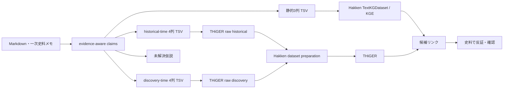

# HakkenOSS 接続メモ

この文書は、`otowa-ankyoscape` の証拠つき知識グラフを Sony Research の [HakkenOSS](https://github.com/SonyResearch/HakkenOSS) へ接続する際に、**実際に公開コードで確認できた境界**を整理する。

## 結論

現在は HakkenOSS を fork しなくても、次の経路まで接続できる。

1. 静的リンク予測：`TextKGDataset` に三つ組 TSV を渡し、ComplEx / DistMult 等を試す。
2. 時系列モデル：`hakken-models` の THiGER 用 raw schema に年代付き TSV を変換し、Hakken 側の dataset preparation / training へ渡す。
3. Hakken 型の未来発見評価：歴史上の出来事年とは別に、**資料上でその関係を確認できる年（discovery / evidence time）**を作り、時間順 backtest を行う。

ただし、論文でいう **THiGERLLM と、OSS に実装されている THiGER を同一視しない**。

---

## 1. 静的 KGE: TextKGDataset

HakkenOSS の `models/packages/datasets/datasets/data_repo/text.py` には汎用の `TextKGDataset` があり、三列なら

```text
subject    relation    object
```

として読み込む。

このリポジトリでは、

```bash
python scripts/export_kge.py
python scripts/make_kge_split.py
```

で生成した TSV を Hakken 側へ渡す設定例を

```text
experiments/kge/hakken/otowa.yaml
```

に置いている。

HakkenOSS 参照：
- [`TextKGDataset`](https://github.com/SonyResearch/HakkenOSS/blob/main/models/packages/datasets/datasets/data_repo/text.py)
- [YAGO の `TextKGDataset` 設定例](https://github.com/SonyResearch/HakkenOSS/blob/main/models/packages/kge/config/data_repo/yago.yaml)

---

## 2. TextKGDataset は4列の時系列 KG も読める

同じ `TextKGDataset` は `column_names` が4列なら temporal KG と判定し、

```text
subject    relation    object    date
```

を `subject / relation / object / timestamp` の4次元 fact tensor へ変換する。

このため、`otowa-ankyoscape` 側には

```bash
python scripts/export_temporal_kge.py
```

を用意した。推測で年代を補わないため、`time.at` が**整数年として明示されている** claim だけを出力する。

設定例：

```text
experiments/kge/hakken/otowa-temporal.yaml
```

ただし、**4列を読めることと、すべての KGE モデルが時間を利用することは別問題**である。ComplEx / DistMult の通常設定に4列を渡しただけで「未来予測」になるとは考えない。

---

## 3. HakkenOSS には THiGER 本体が公開されている

`hakken-models` には `THiGER` クラスが存在する。

HakkenOSS の docstring では THiGER を

> Temporal Hierarchical Graph Embedding Representation (THiGER) model for temporal KGs.

と定義し、GNN で局所的なグラフ構造、Transformer で時系列依存を扱う実装になっている。コンストラクタには `num_entities`, `num_relations`, `num_timestamps` が入り、Transformer の `max_seq_len` に timestamp 数を使う。

参照：
- [`hakken_models/models/thiger/base.py`](https://github.com/SonyResearch/HakkenOSS/blob/main/models/packages/hakken-models/hakken_models/models/thiger/base.py)
- [`train_thiger.py`](https://github.com/SonyResearch/HakkenOSS/blob/main/models/packages/hakken-models/hakken_models/steps/thiger/train_thiger.py)
- [パイプライン CLI の `train_thiger`](https://github.com/SonyResearch/HakkenOSS/blob/main/models/packages/hakken-models/scripts/run_pipeline.py)

したがって、**少なくとも THiGER の学習・評価コードは OSS リポジトリ内に存在する。**

---

## 4. ただし THiGERLLM の完全実装は確認できない

Hakken 論文では THiGER と LLM の知識を組み合わせた **THiGERLLM** が重要な構成として説明される。

一方、2026-09-09 時点で HakkenOSS のコード検索から確認できた `THiGERLLM` という文字列は、ベンチマーク結果生成スクリプト中のモデル名などに限られ、`class THiGERLLM` のような実装は確認できない。

HakkenOSS には別に `hakken-agents` があり、OpenAI / OpenRouter / Ollama 等の LLM を使った文書からの entity / fact extraction はできる。しかし、これをそのまま論文の THiGERLLM と同一のモデルとみなさない。

```text
THiGER          : OSS 内にモデル実装あり
THiGERLLM       : 論文上の構成。完全な同一実装は OSS 内で未確認
hakken-agents   : LLM を使う抽出・entity resolution 系。THiGERLLM とは別物
```

---

## 5. THiGER 用 raw schema へ直接出力する

HakkenOSS の `hakken-models` dataset preparation pipeline は raw data として以下を読む。

### `edges.tsv`

```text
subject_id
subject_domain
relation_type
object_id
object_domain
year
number_of_occurrences
```

### `nodes_corrected.tsv`

```text
node_id
node_domain
node_name
node_domain_id
```

参照：
- [`load_facts_df.py`](https://github.com/SonyResearch/HakkenOSS/blob/main/models/packages/hakken-models/hakken_models/steps/dataset/load_facts_df.py)
- [`load_nodes_df.py`](https://github.com/SonyResearch/HakkenOSS/blob/main/models/packages/hakken-models/hakken_models/steps/dataset/load_nodes_df.py)
- [`dataset_preparation.py`](https://github.com/SonyResearch/HakkenOSS/blob/main/models/packages/hakken-models/hakken_models/pipelines/dataset_preparation.py)

このリポジトリでは `scripts/export_hakken_thiger_raw.py` が同じ schema を生成する。入力する時間軸によって出力先を分ける。

### historical time

```bash
python scripts/export_hakken_thiger_raw.py
```

生成先：

```text
experiments/kge/hakken/raw-historical/edges.tsv
experiments/kge/hakken/raw-historical/nodes_corrected.tsv
```

既定では `confirmed` / `observation`、`temporal_predictable=true`、`time.at` が整数年の claim を使う。

現在は **24 edge rows / 30 nodes / 1682〜2016年（11 distinct years）**。

### discovery / evidence time

まず、年代付き出典から「現在の資料集合で最初に確認できる年」を作る。

```bash
python scripts/export_discovery_kge.py
```

次に、その4列 TSV を THiGER raw schema へ変換する。

```bash
python scripts/export_hakken_thiger_raw.py \
  --input experiments/kge/discovery/all.tsv \
  --output-dir experiments/kge/hakken/raw-discovery
```

生成先：

```text
experiments/kge/hakken/raw-discovery/edges.tsv
experiments/kge/hakken/raw-discovery/nodes_corrected.tsv
```

現在は **31 edge rows / 38 nodes / 1682〜2024年（12 distinct years）**。

`--input` を使った場合、入力 TSV は

```text
subject    relation    object    year
```

の4列とする。これにより、Hakken raw 変換処理と「年をどう定義するか」を分離できる。

---

## 6. 「歴史上の年」と「発見された年」は別物

ここがこの調査で最も重要な区別の一つである。

たとえば、1956年の暗渠工事について2026年刊行の資料で初めて知った場合、

```text
historical time = 1956
source/evidence time = 2026
```

となる。

Hakken 論文が狙う「その時点までの知識から未来の発見を予測する」に近い評価では、**historical time をそのまま使うと未来情報が過去へ移動してしまう**。後世の資料が古い出来事を述べているからである。

そこで `export_discovery_kge.py` は、各採用 claim に紐づく年代付き source の最古年を使う。

ただし、その年は

> 現在 `otowa-ankyoscape` に登録されている資料集合の中で、その関係を確認できる最古年

であって、社会全体・研究史全体での「真の初出年」ではない。古い史料が後から追加されれば年は過去へ動く。この corpus incompleteness は、評価結果と一緒に明示する。

---

## 7. THiGER の packaged dataset は raw TSV とは別形式

THiGER の学習側で使う `DatasetDeployment` は、最終的には次の構造を読む。

```text
target_root/
├─ mappings/
│  ├─ nodes_map.parquet
│  ├─ relations_map.parquet
│  ├─ timestamps_map.parquet
│  └─ domains_map.parquet
└─ tensors/
   ├─ train.npy
   ├─ val.npy
   └─ test.npy
```

fact tensor は `[subject_idx, relation_idx, object_idx, timestamp_idx]` の4列を扱える。

参照：
- [`DatasetDeployment`](https://github.com/SonyResearch/HakkenOSS/blob/main/models/packages/hakken-models/hakken_models/datasets/deployment.py)
- [`build_tensors.py`](https://github.com/SonyResearch/HakkenOSS/blob/main/models/packages/hakken-models/hakken_models/steps/dataset/build_tensors.py)
- [`build_mappings.py`](https://github.com/SonyResearch/HakkenOSS/blob/main/models/packages/hakken-models/hakken_models/steps/dataset/build_mappings.py)

今は `otowa-ankyoscape` 側で Parquet / NumPy まで複製せず、**Hakken の raw ingestion boundary までをこちらの責任範囲**とする。HakkenOSS のパイプライン仕様が変わっても、証拠つき `claims` を正本として再生成できるようにするためである。

---

## 8. 時間順 backtest

未来発見を試すならランダム split を使わない。

`scripts/make_temporal_backtest.py` は、

```text
train : year < train_end
valid : train_end <= year < val_end
test  : val_end <= year
```

と時間順を固定し、未来の辺を coverage のために train へ戻さない。後年にしか現れない entity / relation は cold-start として別集計する。

historical time の `train < 1930 / valid < 1960` では、valid 4件・test 5件が**すべて cold-start**になった。この軸は歴史状態の復元には必要だが、現状のグラフでは未来リンク予測評価に向かない。

一方 discovery/evidence time の cutoff scan では、後年にも train 既知の実体を含む fact が少数ながら現れる。たとえば `train < 2016 / valid < 2021` では test 側に seen fact が2件ある。CI ではこの分割も生成して、seen と cold-start を継続観測する。

まだ validation と test の両方に十分な seen fact があるわけではないので、現段階で MRR や Hits@K を「未来発見能力」として解釈しない。

---

## 9. ChatGPT との役割分担

この構成では、ChatGPT は Hakken の出力をそのまま史実へ変換する役ではない。

```text
Markdown・史料メモ
        ↓
ChatGPT: entity / relation / evidence status を抽出
        ↓
証拠つき claims
        ↓
Hakken / THiGER: 未知リンク候補を順位付け
        ↓
ChatGPT: 根拠経路・反証候補・探すべき史料を整理
        ↓
一次史料・地図・地形で人間が確認
```

特に「水窪川と弦巻川の接続」「音羽谷西側流路の成立」「谷端川側との旧河道」などでは、モデルスコアを結論ではなく**調査順位**として使う。

---

## 現在の境界



重要なのは、**モデル出力を史実へ直接昇格させないこと**である。候補リンクは「次にどの史料・地点を調べるか」を決める探索順位として使う。
