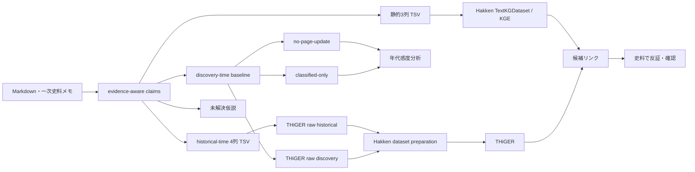

# HakkenOSS 接続メモ

この文書は、`otowa-ankyoscape` の証拠つき知識グラフを Sony Research の [HakkenOSS](https://github.com/SonyResearch/HakkenOSS) へ接続する際に、**実際に公開コードで確認できた境界**を整理する。

## 結論

現在は HakkenOSS を fork しなくても、次の経路まで接続できる。

1. 静的リンク予測：`TextKGDataset` に三つ組 TSV を渡し、ComplEx / DistMult 等を試す。
2. 時系列モデル：`hakken-models` の THiGER 用 raw schema に年代付き TSV を変換し、Hakken 側の dataset preparation / training へ渡す。
3. Hakken 型の未来発見評価：歴史上の出来事年とは別に、**資料上でその関係を確認できる年（discovery / evidence time）**を作り、時間順 backtest を行う。
4. discovery/evidence time 自体についても、`source.year_kind` を用いて Web 更新年・意味未分類年への依存を感度分析する。

ただし、論文でいう **THiGERLLM と、OSS に実装されている THiGER を同一視しない**。

---

## 1. 静的 KGE: TextKGDataset

HakkenOSS の `models/packages/datasets/datasets/data_repo/text.py` には汎用の `TextKGDataset` があり、三列なら

```text
subject    relation    object
```

として読み込む。

このリポジトリでは、

```bash
python scripts/export_kge.py
python scripts/make_kge_split.py
```

で生成した TSV を Hakken 側へ渡す設定例を

```text
experiments/kge/hakken/otowa.yaml
```

に置いている。

HakkenOSS 参照：

- [`TextKGDataset`](https://github.com/SonyResearch/HakkenOSS/blob/main/models/packages/datasets/datasets/data_repo/text.py)
- [YAGO の `TextKGDataset` 設定例](https://github.com/SonyResearch/HakkenOSS/blob/main/models/packages/kge/config/data_repo/yago.yaml)

---

## 2. TextKGDataset は4列の時系列 KG も読める

同じ `TextKGDataset` は `column_names` が4列なら temporal KG と判定し、

```text
subject    relation    object    date
```

を `subject / relation / object / timestamp` の4次元 fact tensor へ変換する。

このため、`otowa-ankyoscape` 側には

```bash
python scripts/export_temporal_kge.py
```

を用意した。推測で年代を補わないため、`time.at` が**整数年として明示されている** claim だけを出力する。

設定例：

```text
experiments/kge/hakken/otowa-temporal.yaml
```

ただし、**4列を読めることと、すべての KGE モデルが時間を利用することは別問題**である。ComplEx / DistMult の通常設定に4列を渡しただけで「未来予測」になるとは考えない。

---

## 3. HakkenOSS には THiGER 本体が公開されている

`hakken-models` には `THiGER` クラスが存在する。HakkenOSS の docstring では Temporal Hierarchical Graph Embedding Representation とされ、GNN で局所グラフ構造、Transformer で時系列依存を扱う実装になっている。

参照：

- [`hakken_models/models/thiger/base.py`](https://github.com/SonyResearch/HakkenOSS/blob/main/models/packages/hakken-models/hakken_models/models/thiger/base.py)
- [`train_thiger.py`](https://github.com/SonyResearch/HakkenOSS/blob/main/models/packages/hakken-models/hakken_models/steps/thiger/train_thiger.py)
- [パイプライン CLI の `train_thiger`](https://github.com/SonyResearch/HakkenOSS/blob/main/models/packages/hakken-models/scripts/run_pipeline.py)

したがって、**少なくとも THiGER のモデル・学習・評価コードは OSS リポジトリ内に存在する。**

---

## 4. THiGERLLM と hakken-agents は別に扱う

Hakken 論文では THiGER と LLM の知識を組み合わせた **THiGERLLM** が重要な構成として説明される。

一方、2026-09-09 時点で HakkenOSS のコード検索からは、論文と完全に同一だと確認できる `THiGERLLM` のモデル実装は見つけられていない。

HakkenOSS には別に `hakken-agents` があり、LLM を使った文書からの entity / fact extraction や entity resolution を担う。これをそのまま THiGERLLM とみなさない。

```text
THiGER          : OSS 内にモデル・学習・評価コードあり
THiGERLLM       : 論文上の構成。完全に同一の OSS 実装は未確認
hakken-agents   : LLM を使う抽出・entity resolution 系。別系統
```

---

## 5. THiGER 用 raw schema へ直接出力する

HakkenOSS の `hakken-models` dataset preparation pipeline は raw data として以下を読む。

### `edges.tsv`

```text
subject_id
subject_domain
relation_type
object_id
object_domain
year
number_of_occurrences
```

### `nodes_corrected.tsv`

```text
node_id
node_domain
node_name
node_domain_id
```

参照：

- [`load_facts_df.py`](https://github.com/SonyResearch/HakkenOSS/blob/main/models/packages/hakken-models/hakken_models/steps/dataset/load_facts_df.py)
- [`load_nodes_df.py`](https://github.com/SonyResearch/HakkenOSS/blob/main/models/packages/hakken-models/hakken_models/steps/dataset/load_nodes_df.py)
- [`dataset_preparation.py`](https://github.com/SonyResearch/HakkenOSS/blob/main/models/packages/hakken-models/hakken_models/pipelines/dataset_preparation.py)

このリポジトリでは `scripts/export_hakken_thiger_raw.py` が同じ schema を生成する。

### historical time

```bash
python scripts/export_hakken_thiger_raw.py
```

生成先：

```text
experiments/kge/hakken/raw-historical/edges.tsv
experiments/kge/hakken/raw-historical/nodes_corrected.tsv
```

現在は **24 edge rows / 30 nodes / 1682〜2016年（11 distinct years）**。

### discovery / evidence time

```bash
python scripts/export_discovery_kge.py
python scripts/export_hakken_thiger_raw.py \
  --input experiments/kge/discovery/all.tsv \
  --output-dir experiments/kge/hakken/raw-discovery
```

生成先：

```text
experiments/kge/hakken/raw-discovery/edges.tsv
experiments/kge/hakken/raw-discovery/nodes_corrected.tsv
```

現在の baseline は **37 edge rows / 42 nodes / 1682〜2024年（12 distinct years）**。

`--input` を使った場合、入力 TSV は

```text
subject    relation    object    year
```

の4列とする。これにより、Hakken raw 変換処理と「年をどう定義するか」を分離できる。

---

## 6. 「歴史上の年」と「資料上の確認年」は別物

たとえば、1956年の暗渠工事について2026年刊行の資料で初めて確認した場合、

```text
historical time = 1956
source/evidence time = 2026
```

となる。

Hakken 的な「その時点までの知識から、後の資料に現れる関係を予測する」評価で historical time をそのまま使うと、後世の資料が記した古い出来事が過去へ漏れる。

そこで `export_discovery_kge.py` は、各採用 claim に紐づく年代付き source の最古年を使う。ただしこれは、

> 現在 `otowa-ankyoscape` に登録されている資料集合の中で、その関係を確認できる最古年

であって、社会全体・研究史全体の真の初出年ではない。

### source.year_kind

`source.year` の意味を曖昧にしないため、次を区別する。

```text
publication : 本・論文・記事・報告書・公開資料そのものの刊行・公開年
creation    : 写真・地図・原史料など資料そのものの作成年
issue       : 公報・議会速記録など号／会議に対応する年
page_update : Webページの更新年
edition     : 版・改訂版の刊行年
unknown     : 年代の意味を確定できていない
```

古いレコードで `year_kind` が未設定なら exporter 内では `unspecified` として扱い、感度分析から除外できる。

---

## 7. source/event year leakage を実際に1件検出した

この仕組みを既存 source に適用したところ、`S34`「豊島区史年表 1895年谷端川新規水車設立願」で、**1895年が資料自体の年代ではなく年表項目の出来事年**として `source.year` に入っていたことが分かった。

そこで `S34.year` を `null` に戻し、1895年は claim 側の `time.at` にだけ残した。historical evidence 自体は捨てず、discovery/evidence timeline への未来情報漏洩だけを止める。

この修正により baseline discovery facts は **38→37**、distinct years は **13→12** となり、discovery timeline から1895年が消えた。

同時に、temporal graph で使う年代付き source の意味を確認し、`G02`, `S40`, `ZOSHIGAYA_SEWER_2008`, `BUNKYO_HATSUNE` などを `publication` / `issue` として整理した。

現在、年代付き source のうち `year_kind` 未分類は8件残るが、**retained temporal graph で使われるものは0件**である。

---

## 8. discovery/evidence time の感度分析

CI では三種類を生成する。

| timeline | 除外する source 年代 | facts | distinct years |
|---|---|---:|---:|
| baseline | なし | **37** | **12** |
| no-page-update | `page_update` | **30** | **10** |
| classified-only | `page_update`, `unspecified`, `unknown` | **30** | **10** |

`classified-only` に残る年は **1682, 1836, 1851, 1999, 2000, 2001, 2008, 2014, 2016, 2021**。

`classified-only` と `no-page-update` が一致するのは、残る未分類年代付き source が現在の temporal graph では使われていないためである。つまり、現時点の Hakken backtest に入る source-date については、未分類年代の影響を除去できた。

`train < 2016 / valid < 2021 / test >= 2021` で比較すると、

| timeline | train | valid | test | valid_seen | test_seen | test_cold_start |
|---|---:|---:|---:|---:|---:|---:|
| baseline | **21** | **2** | **14** | **0** | **2** | **12** |
| no-page-update | **21** | **1** | **8** | **0** | **2** | **6** |
| classified-only | **21** | **1** | **8** | **0** | **2** | **6** |

**test_seen の2件は、Web更新年と未分類年代を除外した `classified-only` でも残る。** ただし validation の1件は cold-start で、`valid_seen=0` のままである。

よって seen 2件の生存は、弱い source date による人工的な結果ではないことを確かめるデータ健全性チェックであって、モデルの未来発見能力を示すものではない。

---

## 9. THiGER の packaged dataset は raw TSV とは別形式

THiGER の学習側で使う `DatasetDeployment` は、最終的には次の構造を読む。

```text
target_root/
├─ mappings/
│  ├─ nodes_map.parquet
│  ├─ relations_map.parquet
│  ├─ timestamps_map.parquet
│  └─ domains_map.parquet
└─ tensors/
   ├─ train.npy
   ├─ val.npy
   └─ test.npy
```

fact tensor は `[subject_idx, relation_idx, object_idx, timestamp_idx]` の4列を扱える。

参照：

- [`DatasetDeployment`](https://github.com/SonyResearch/HakkenOSS/blob/main/models/packages/hakken-models/hakken_models/datasets/deployment.py)
- [`build_tensors.py`](https://github.com/SonyResearch/HakkenOSS/blob/main/models/packages/hakken-models/hakken_models/steps/dataset/build_tensors.py)
- [`build_mappings.py`](https://github.com/SonyResearch/HakkenOSS/blob/main/models/packages/hakken-models/hakken_models/steps/dataset/build_mappings.py)

今は `otowa-ankyoscape` 側で Parquet / NumPy まで複製せず、**Hakken の raw ingestion boundary までをこちらの責任範囲**とする。証拠つき `claims` を正本にして再生成可能な状態を保つためである。

---

## 10. 時間順 backtest

未来発見を試すならランダム split を使わない。

`scripts/make_temporal_backtest.py` は、

```text
train : year < train_end
valid : train_end <= year < val_end
test  : val_end <= year
```

と時間順を固定し、未来の辺を coverage のために train へ戻さない。後年にしか現れない entity / relation は cold-start として別集計する。

historical time の `train < 1930 / valid < 1960` では valid 4件・test 5件がすべて cold-start。discovery/evidence time は test_seen が2件あるが、`classified-only` でも validation は1件の cold-start だけで `valid_seen=0`。

したがって、現段階で MRR や Hits@K を「未来発見能力」として解釈しない。モデルを本格評価する前に、**同じ実体・同じ relation が複数年代に再登場する資料密度**を増やすことを優先する。

---

## 11. 現在の研究上のボトルネック

source-date 監査によって、現在の retained temporal graph で使われる「意味未分類の年代付き source」は0になった。一方、discovery/evidence time に入れない関係は5件ある。

- 1956年の谷端川・千早町〜長崎区間 `flows_through` 2件
- 1956年の谷端川・要町区間 `flows_through` 2件
- 谷端川 — `flows_through` → 巣鴨村大字巣鴨字新田928（historical time 1895）1件

前4件では区公報の原典を探す。最後の1件では `S34` の年表自体の資料年代か、1895年の水車設立願を直接確認できる原史料を探す。

さらに大きい問題は、42個の temporal-predictable base triples のうち、**同一関係を2年代以上の historical time で直接再観測できているものが2件しかない**ことである。今後は単純な triple 数ではなく、既存実体を複数年代で再観測する密度を増やす。

---

## 12. ChatGPT との役割分担

```text
Markdown・史料メモ
        ↓
ChatGPT: entity / relation / evidence status / source year semantics を抽出
        ↓
証拠つき claims
        ↓
Hakken / THiGER: 未知リンク候補を順位付け
        ↓
ChatGPT: 根拠経路・反証候補・探すべき史料を整理
        ↓
一次史料・地図・地形で人間が確認
```

モデルスコアは結論ではなく**調査順位**として使う。

---

## 現在の境界



重要なのは、**モデル出力を史実へ直接昇格させないこと**である。候補リンクは次にどの史料・地点を調べるかを決める探索順位として使う。
