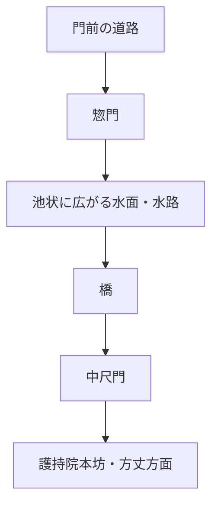
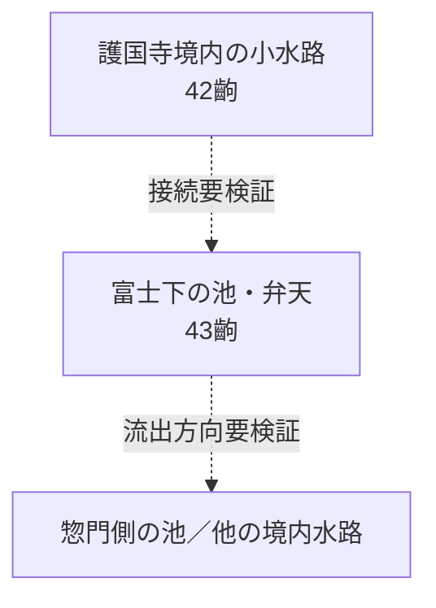
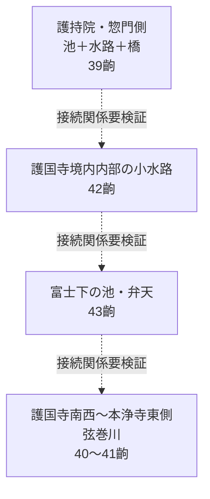
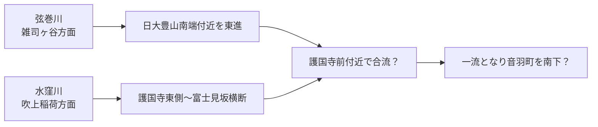

# 『江戸名所図会』からみた護国寺・弦巻川・境内水系

更新日: 2026-08-31

護国寺周辺の『江戸名所図会』高精細画像、江戸切絵図、近代地形図、現地確認を突き合わせ、護国寺境内の池・水路と、南西側を流れる弦巻川、水窪川との関係を整理する。

> [!IMPORTANT]
> 『江戸名所図会』は精密な実測平面図ではなく鳥瞰的な景観図である。したがって、河道や池の**存在・相対的位置関係**を読む資料としては有力だが、蛇行形や距離をメートル単位で現在地へ投影することはしない。

---

## 1. 年代

護国寺関係図を含む『江戸名所図会』巻之四は **天保7年（1836）刊**。挿絵は長谷川雪旦。

したがって、図から直接言えるのは **「遅くとも1836年の刊行時までに、この景観が図示されていた」** ということである。個々の護国寺図の現地取材・下絵制作年は未確認なので、「1836年にその場で描いた」とはしない。

国立国会図書館デジタルコレクション（第12冊）では、護国寺周辺はおおむね次の齣に当たる。

- 39齣：大塚 護持院
- 40齣：其二 護国寺
- 41齣：其三 本浄寺
- 42～44齣：護国寺境内 西国札所写三十三所観音の図
- 45齣：星谷の井旧地

原画像:
- https://dl.ndl.go.jp/pid/2563391/1/39
- https://dl.ndl.go.jp/pid/2563391/1/40
- https://dl.ndl.go.jp/pid/2563391/1/41
- https://dl.ndl.go.jp/pid/2563391/1/42
- https://dl.ndl.go.jp/pid/2563391/1/43
- https://dl.ndl.go.jp/pid/2563391/1/44

---

## 2. 39齣「大塚 護持院」――惣門・橋・中尺門

高精細画像を確認すると、護持院正面の動線は概ね、

と読める。〔図像観察〕

惣門から中尺門へ向かう参道そのものが水系を横断しており、橋の一方には池状に広がった水面が描かれる。

従来の二次資料でいう「惣門を入ると左に小池があり、右手へ流れる川を橋で渡る」という説明とよく合う。

明治43年（1910）の『礫川要覧』を引用する地域史資料には、音羽富士について **「山下に池あり、東門（惣門）の池も通ず」** とある。この「東門の池」は、39齣の池・水路と関係する可能性が高い。ただし『礫川要覧』原本の該当頁はなお逐字確認が必要。

---

## 3. 40齣「其二 護国寺」と41齣「其三 本浄寺」は横方向に接続できる

40・41齣を高精細画像で横に並べると、樹林帯、谷底の開けた地形、河岸、河道がかなり自然に連続する。〔図像観察〕

特に重要なのは下端の水系である。

40齣単独では、護国寺南西側の水面が幅広く描かれるため池状にも見える。しかし41齣へつなぐと、その低地は**明瞭に蛇行する一本の河道へ連続する**。

41齣では本浄寺周辺を流れる川筋がかなり丁寧に描かれており、現在知られている本浄寺と弦巻川旧流路の位置関係とも整合する。

したがって現時点では、

> **40齣下端～41齣に連続して描かれる水流を、護国寺南西～本浄寺東側を流れる弦巻川として読むのが最も自然**

とする。〔観察／比定〕

### 3.1 画角について

40～41齣は写真のような一点透視ではない。南側上空から北方を望みつつ、西の目白台・本浄寺から東の護国寺までを横長に再構成した鳥瞰景観と考えるのが無理が少ない。

41齣の手前側に当たる地形は目白台東縁側とみられるが、雪旦が実際に一点へ立ってその方向を写生した、とまでは言わない。

---

## 4. 42齣――西国札所区域にも境内水路が描かれる

42齣の西国三十三所札所の建物群の間には、**細い水流が蛇行する描写**を確認できる。〔図像観察〕

これは40～41齣の境外側の弦巻川とは区別すべきで、護国寺境内内部の小水路・谷筋を表している可能性が高い。

つまり『江戸名所図会』は、

- 境外・南西側の弦巻川
- 境内の細い水路

を別々に描いていると考えられる。

---

## 5. 43齣――富士下に池、弁天

43齣では「富士」と記された築山の下に、**明瞭な池**が描かれ、その岸に弁天が置かれている。〔図像観察〕

この池は、40～41齣に描かれる弦巻川そのものとは別の、護国寺境内の池である。

1910年『礫川要覧』の二次引用にある「山下に池あり」と対応する可能性が高い。

ただし、43齣の富士・池がその後の移転・改修を経て、現在の音羽富士周辺のどの施設に対応するかは別問題である。現在の音羽富士麓に保存される石橋も、**現位置に元から架かっていた橋とは限らない**ため、橋の現在位置だけで旧池岸を決めない。

---

## 6. 『江戸名所図会』だけでも、少なくとも三種類の水景を分けられる

今回の高精細確認から、護国寺周辺の水を一括して「護国寺の池」と扱うのは不適切だと分かった。

このうちA～Cの相互接続と流向は未確定。Dは地形・後世地図との対応から弦巻川比定が有力。

---

## 7. 1851年切絵図の護国寺南西端の橋

近吾堂系『音羽目白雑司ヶ谷辺絵図』（嘉永4年＝1851）では、西側から来る弦巻川とみられる青線が護国寺南西端へ達し、道路を横断する箇所に橋状の表現がある。

今回の高精細確認では、その橋は**板橋のようにも見える**。ただし切絵図の橋記号が材質を忠実に表現するかは未検証なので、図像だけで「板橋」と確定しない。

### 7.1 「弦巻橋」説

嘉永6年（1853）の雑司ヶ谷村関係資料で列挙される弦巻川の橋には、材質付きで、

- 弦巻橋：板橋
- 松屋橋：石橋
- 境橋：石橋
- 末尾に名称不詳の石橋

などがあると紹介されている。

このため、1851年図の護国寺南西端の橋が本当に板橋なら、**「弦巻橋」比定は検討に値する**。〔仮説〕

しかし、各橋の位置と1853年一覧の列挙順について未解決点があり、現段階では橋名を確定しない。

### 7.2 星谷橋とは分けて考える

『江戸名所図会』本文に出る**星谷橋**は、本浄寺裏の「星谷の井」から流れる水の下流に架かる橋として説明される。

したがって、星谷橋を直ちに「護国寺南西端で弦巻川本流を渡る橋」と同定する根拠はない。現時点では、**星谷の井から弦巻川へ向かう小流路側の橋だった可能性**を残す。

関連: [護国寺西側・星谷の井と旧水系](./gokokuji-hoshiyato-water-system.md)

---

## 8. 山岡光治氏の復元――江戸期には護国寺付近で水窪川と弦巻川が合流した可能性

山岡光治氏「地図散歩2 東京・水窪川、鼠ケ谷を歩く」では、江戸切絵図をもとに水窪川について、護国寺の塀沿いに流れ、富士見坂を横断し、**その先で弦巻川と合流して音羽通り沿いを南下していた**と復元している。〔二次資料による復元〕

資料:
- https://www.ripro.co.jp/yamaoka/mapsuv200/meguri/14-1chizusanpo2.pdf

同PDFの現代地図への重ね合わせでは、弦巻川は現在の**日本大学豊山中学校・高等学校南端付近の道路北側に沿って東へ進み、護国寺正面西寄りで水窪川側の流れと合流する**ように描かれている。

模式的には、

となる。

この復元は、1851年切絵図で弦巻川が護国寺南西端の橋を越えたあと短く東側へ続き、その先を独立河道として追いにくくなることを説明できる。

一方、これはあくまで**後世の地図読解による復元**であり、「江戸期にここで合流していた」と記す工事記録・水利文書を直接確認したわけではない。

### 8.1 音羽谷西側の弦巻川成立問題への影響

もしこの復元が正しければ、江戸期には護国寺付近で二流が合流し、音羽町南部を一流で下った時期があったことになる。

すると、現在知られる「音羽通りの東西に水窪川・弦巻川が並行して南下する」形は、**江戸末～明治初期までのどこかで再編された可能性**も検討対象になる。

これは1941年の郷土教育資料にある「音羽谷の水流が水田開発時に二流へ分けられたのではないか」という後世の推測と構造的には似るが、年代・理由を同一視してはいけない。

---

## 9. 現時点での更新された整理

1. **1836年刊『江戸名所図会』40～41齣には、護国寺南西～本浄寺東側を蛇行する弦巻川がかなり明瞭に描かれる。**〔観察／比定〕
2. **39齣では惣門から中尺門へ向かう途中に池・水路と橋が描かれる。**〔観察〕
3. **42齣では西国札所区域に境内小水路を確認できる。**〔観察〕
4. **43齣では富士下の池と弁天を明瞭に確認できる。**〔観察〕
5. これら境内水路・池同士の正確な接続順と流向は未確定。
6. **1851年切絵図の護国寺南西端の橋は板橋のようにも見え、「弦巻橋」説は候補になるが未確定。**〔仮説〕
7. **星谷橋は別の小流路上の橋である可能性があり、護国寺南西端の橋と同一視しない。**〔推定〕
8. 山岡光治氏は、**江戸切絵図の時代には水窪川が護国寺付近で弦巻川と合流し、一流となって音羽町を南下した**と復元している。〔二次資料による復元〕

---

## 10. 次に確認すべきこと

- 1851年切絵図で、位置が確定している**石橋（例：木村橋）**と護国寺南西端の橋記号を比較し、材質表現に規則性があるか検証する。
- 1853年の橋梁一覧の原文を確認し、橋の列挙順・所在地・寸法・材質を逐字採録する。
- 弦巻橋・松屋橋・境橋・名称不詳石橋を、村境・道筋・寺社位置から現代座標へ比定する。
- 『礫川要覧』原本で「山下に池あり、東門（惣門）の池も通ず」の該当頁と前後文を直接確認する。
- 『護国寺護持院院内図』『豊島岡御墓地図』『護國寺境内地實測圖』を入手し、39・42・43齣の池・水路を平面図に落とす。
- 江戸期の護国寺前合流説について、切絵図以外の近世絵図・水利文書で独立に検証する。
