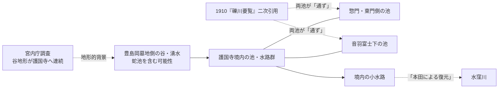

# 護国寺境内の旧水系調査

更新日: 2026-08-29

護国寺境内にかつて存在した池・小水路・湧水と、豊島岡墓地側の谷、水窪川との関係を整理する。

この問題では、**「境内に水系があったか」**と、**「その水が具体的にどの池をどちら向きに通り、水窪川へ入ったか」**を分けて考える必要がある。前者は複数の独立した資料からかなり強く言える。一方、後者、とくに「蛇池 → 護国寺の2池 → 水窪川」という細かな接続順は、現時点では近年の復元に依存する部分が残る。

## 記号

- **〔確認〕** 原資料、公的資料、考古学・測量資料などで直接確認できること
- **〔二次資料〕** 後世の解説・研究・現地調査記事で述べられていること
- **〔推定〕** 複数の資料を合わせると自然だが、接続関係などの直接証拠が不足すること
- **〔保留〕** 史料自体は確認できるが、問題の記述・図像をまだ原本で直視できていないこと

---

## 1. 現時点の結論

### 1.1 護国寺境内に池と小水路が存在した可能性はかなり高い

天保7年（1836）刊行の『江戸名所図会』には護国寺境内を描いた複数の図が収録されている。東京都立図書館デジタルアーカイブの書誌では、第4巻の90ウ～96オ付近に「大塚 護持院」「護國寺 其二」「其三」「護國寺境内 西国札所寫三十三所觀音の圖」などが連続して収録されることを確認できる。〔確認〕[G02]

これを読み解いた地域史資料では、**惣門を入った左手に小池があり、右手へ流れる水を橋で渡る構成**として読まれている。〔二次資料〕[G04]

さらに明治43年（1910）の『礫川要覧』について、同じ資料は音羽富士の説明として次の記述を引用している。

> 山下に池あり、東門（惣門）の池も通ず

この引用が原文どおりなら、**音羽富士下の池と、惣門側の池が水でつながっていた**ことになる。国立国会図書館デジタルコレクションに『礫川要覧』原本が公開されているため、今後は該当頁を直接確認する必要がある。〔二次引用／原本の該当頁未確認〕[G03][G04]

したがって、少なくとも江戸後期～明治末にかけての護国寺について、単独の庭園池だけでなく、**複数の池とそれを結ぶ水路・橋を伴う水系**を想定する根拠がある。

### 1.2 豊島岡側には、護国寺へ続く谷地形が実際にある

宮内庁書陵部による豊島岡墓地西側外構塀改修工事の立会調査では、豊島岡墓地が台地面・斜面・谷底平坦面から成り、東西から下る斜面が接する谷地形を持つことが記載されている。さらに、この地形について、**西に隣接する護国寺境内へ続いている**と明記される。〔確認〕[G06]

これは重要である。護国寺境内の池・小水路を、単なる寺院庭園の人工施設だけで説明する必要はない。東側の台地・豊島岡側から延びる谷と湧水系を基礎にして、寺院造営時あるいはその後に池・水路として整形した可能性がある。〔推定〕

### 1.3 「蛇池 → 護国寺境内の2池 → 水窪川」は有力だが、現段階では二次資料上の復元

本田創は、豊島岡墓地にある**蛇池**を湧水池とし、かつてそこから流れ出した水が護国寺境内の2つの湧水池を経て、水窪川へ注いでいたと説明する。また、その流れに架かっていた石橋が音羽富士の麓に移されて残っているとしている。〔二次資料〕[G05]

この説明は、

- 豊島岡から護国寺へ続く谷地形〔G06〕
- 『江戸名所図会』に見える池・橋〔G02][G04〕
- 『礫川要覧』に引用される複数池の接続〔G03][G04〕

とよく整合する。

ただし、現時点では「蛇池からどの池へ入り、どちらの池を先に通り、どこで水窪川へ合流したか」を示す近世・近代の水路図を直接確認できていない。

そのため、**水系の存在そのものはかなり確からしいが、接続順・流向・合流地点は未確定**とする。

※ この図は**模式図**であり、惣門側の池と音羽富士下の池の上下流関係を示していない。

---

## 2. 史料ごとの検討

### 2.1 『江戸名所図会』――江戸後期の境内景観を直接描く

東京都立図書館デジタルアーカイブでは、天保7年（1836）刊行分の第4巻に護国寺関係の図が連続して収録されている。〔確認〕[G02]

確認すべき図は少なくとも次の範囲である。

- 90ウ～91オ「大塚 護持院」
- 91ウ～92オ「護國寺 其二」
- 92ウ～93オ「其三 本浄寺」
- 93ウ～94オ「護國寺境内 西国札所寫三十三所觀音の圖」
- 94ウ～96オの護国寺続図

地域史資料の読みでは、惣門付近に池と橋が描かれている。〔二次資料〕[G04]

今後は東京都立図書館の高精細画像上で、

1. 池の輪郭
2. 水路の出入口
3. 橋の位置
4. 音羽富士・惣門・仁王門との位置関係
5. 水路が図外へ出る方向

を直接トレースする価値が高い。

なお、絵図は景観図であり実測平面図ではない。描かれた位置関係をそのまま現在座標へ落とすのではなく、後世の実測図と合わせて使う必要がある。

### 2.2 『礫川要覧』――1910年にも池同士がつながっていた可能性

国立国会図書館デジタルコレクションには、小石川新聞社編『礫川要覧』（明治43年10月）が公開されている。〔確認〕[G03]

地域史資料は、音羽富士について『礫川要覧』から、

> 山下に池あり、東門（惣門）の池も通ず

と引用する。〔二次資料〕[G04]

この一文はかなり重要である。「池が二つあった」だけでなく、**音羽富士下の池と惣門の池が通水していた**ことを示す可能性があるためである。

ただし今回は国会図書館画像の該当頁を直接特定できていない。よって、引用文の表記・前後文脈・「通ず」が暗渠・開渠・地下浸透のどれを意味するかは原本確認まで保留する。

### 2.3 宮内庁書陵部の豊島岡墓地調査――谷地形の独立した証拠

宮内庁書陵部『書陵部紀要』第74号の「豊島岡墓地西側外構塀改修工事に伴う立会調査」は、豊島岡墓地の地形を具体的に記録している。〔確認〕[G06]

報告によれば、墓地内には台地・斜面・谷底の平坦部があり、その谷地形は護国寺側へ続く。また西側外構付近では、旧境界施設に関係するとみられる切石積みなども確認されている。

この報告自体は「護国寺の小川」を発掘したものではない。しかし、**豊島岡から護国寺へ向けて水が集まりうる地形が存在した**ことを、現代の地形・考古学調査から独立して支える。

### 2.4 『東京市史稿 御墓地篇』――「護国寺護持院院内図」への入口

東京都公文書館が公開する『東京市史稿 御墓地篇』の目次・典拠一覧には、護国寺・豊島岡関係の重要な原史料名が出てくる。〔確認〕[G07]

特に注目すべきものは次のとおり。

- 「小石川村雑司ヶ谷村」の典拠に**『護国寺護持院院内図』**
- 「護国寺及護持院」の典拠に**『諸宗作事図帳』**・**『御府内沿革図書』**
- 明治6年（1873）の「豊島岡御墓地設定」に**『豊島岡御墓地図』**

『護国寺護持院院内図』は名前だけでも、境内の池・溝・橋・土地境界を確認できる可能性が高い。ただし、今回の調査では図そのものの画像をまだ確認できていない。**水路が描かれているとは現時点では断定しない。**

### 2.5 『御府内沿革図書』――護国寺周辺の時期差を追える候補

国立国会図書館では『御府内沿革図書』がデジタル公開されている。〔確認〕[G08]

これは幕府が作成した江戸市街関係の図・沿革資料を基礎とする資料群で、『東京市史稿』も護国寺関係の典拠として挙げている。

護国寺・音羽・雑司ヶ谷境の図を特定できれば、

- 池の位置
- 寺域境界
- 水窪川との接続
- 豊島岡側の谷
- 音羽町造成後の排水路

を『江戸名所図会』とは別の種類の図で検証できる可能性がある。

### 2.6 『護国寺日記』――造営・修理記録を探す本命史料

八木書店の解題によれば、護国寺には寺役人の公用日記である『護国寺日記』が、元禄10年（1697）から宝暦8年（1757）まで、欠年を含みつつ253冊現存する。翻刻も『史料纂集』として刊行されている。〔確認〕[G09]

この日記は護国寺創建直後の時期を含むため、境内水系が自然流路なのか、造営時に池・排水路として整備されたのかを考えるうえで有力である。

探すべき語は、たとえば次のようなものになる。

- 池
- 堀・溝
- 川・小川
- 清水
- 樋
- 橋・石橋
- 普請
- 浚・浚渫
- 水抜
- 水門
- 堰

現時点では本文全文を横断検索できていないため、具体的な水路記事は未確認。

### 2.7 護国寺境内遺跡――寺域の空間構成を補う

東京都埋蔵文化財センター調査報告第251集『護国寺境内遺跡』は、月光殿修理に伴う発掘調査報告である。〔確認〕[G10]

公開書誌・紹介からは、護国寺創建期に関係する遺構・遺物、礎石、土坑、植栽痕などが確認されている。ただし今回確認できた範囲では、境内水路そのものを検出したという記述は見つけられていない。

したがって直接的な「川の証拠」ではないが、近世境内の地盤・造成・建物配置を復元する際の基礎資料になる。

---

## 3. 『斃休録』についての注意――「境内の小川」の直接証拠としては現在保留

彰義隊の天野八郎による『斃休録』そのものは、国立国会図書館に慶應4年（1868）の写本が所蔵・デジタル公開されている。天野が上野戦争後に音羽護国寺方面へ逃れたことを述べる二次資料も確認できる。〔確認〕[G11]

一方、これまで候補として挙げていた、

> 天野八郎が「護国寺境内の小川」で泥を洗った

という趣旨の記述については、**今回の追調査では『斃休録』原本または信頼できる翻刻の該当頁を直接確認できなかった。**

そのため、これは当面、護国寺境内の小川を実見した一次証言としては採用しない。

『彰義隊戦史』には「天野八郎斃休録」が収録されているため、今後、該当箇所を原文で再確認する。確認できれば非常に強い証拠になるが、確認前に引用文を固定しない。

---

## 4. 「明治10年の護国寺境内図」についての注意

ウェブ上の地域史記事には、護国寺の池を示す資料として「明治10年（1878年）の護国寺境内図」を挙げるものがある。

しかし、**明治10年は1877年**であり、「明治10年（1878年）」という表記には明らかな年次の食い違いがある。

原図の所蔵先・正式名称・作成年を特定できていないため、この図は現段階では証拠に採用しない。

似た資料として、大正11年（1922）7月の**「小石川區大塚坂下町 護國寺境内地實測圖」**が、日本大学豊山中学校・高等学校の周年史資料に掲載されていることを確認できる。〔確認／図の存在のみ〕[G12]

1922年実測図は、池・水路が残っていた末期の境内配置を調べる候補として有用だが、今回の公開断片だけでは水系の描写内容まで確認していない。

---

## 5. 水窪川本流との関係

ここは言葉を慎重に使う必要がある。

本田創の復元では、豊島岡・護国寺の水は最終的に水窪川へ注いだとされる。[G05]

しかし、現在の資料だけから、護国寺境内の小水路そのものを**「水窪川本流」**と呼ぶ根拠はない。

したがって本調査では、当面、

- **護国寺境内の小川・水路**
- **護国寺・豊島岡湧水系**
- **水窪川の小支流**（接続を前提にする場合）

などの表現を用いる。

固有河川名が近世史料から見つかるまでは、「○○川」という名称を新たに与えない。

---

## 6. 時系列

| 年代 | 確認できること | 状態 |
|---|---|---|
| 1681 | 護国寺創建。幕府の高田薬園地に建立 | 〔確認〕[G01] |
| 1697～1757 | 『護国寺日記』が残る。池・水路普請の記事を含む可能性 | 〔史料所在確認〕[G09] |
| 1836 | 『江戸名所図会』に護国寺境内の連続図 | 〔確認〕[G02] |
| 1868 | 『斃休録』成立。天野八郎と護国寺の関係は追えるが「境内の小川」文言は再確認待ち | 〔保留〕[G11] |
| 1873 | 『東京市史稿』典拠に「豊島岡御墓地図」 | 〔史料所在確認〕[G07] |
| 1910 | 『礫川要覧』。二次引用では音羽富士下の池と惣門の池が「通ず」 | 〔二次引用／原頁確認待ち〕[G03][G04] |
| 1922 | 「護國寺境内地實測圖」が存在 | 〔図の存在確認〕[G12] |
| 2021年度 | 豊島岡墓地西側外構塀の調査。谷地形が護国寺境内へ続くことを記録 | 〔確認〕[G06] |

---

## 7. 現在の証拠の強さ

### かなり強い

1. **護国寺境内に池があった。**
2. **江戸後期の境内景観に橋を伴う水路が描かれている可能性が高い。**
3. **豊島岡側から護国寺へ谷地形が連続する。**
4. **1910年頃にも惣門側と音羽富士側の池が接続していたとする同時代資料の引用がある。**

### 有力だが、原史料による最終確認が必要

1. **蛇池から護国寺境内へ実際に表流水が流入していた。**
2. **護国寺境内に「2つの湧水池」があり、蛇池から順につながっていた。**
3. **境内水路が最終的に水窪川へ合流していた。**
4. **現在音羽富士下にある石橋が、その旧水路に架かっていた同一の橋である。**

### まだ分からない

1. 惣門側の池と音羽富士下の池の、どちらが上流だったか。
2. 各池の正確な位置・形・標高。
3. 水路が自然の谷川を整形したものか、護国寺造営時に新設されたものか。
4. 水窪川への合流位置。
5. 境内水路に固有名があったか。
6. いつ池・水路が消滅・暗渠化したか。

---

## 8. 次に確認するべき史料

優先順位は次のとおり。

### A. 『礫川要覧』原本の該当頁

国会図書館デジタルコレクションで「音羽富士」「護国寺」「池」「惣門」周辺を直接確認する。

ここで引用文が確定すれば、1910年時点の池の接続は一次資料に格上げできる。

### B. 『江戸名所図会』護国寺図の高精細トレース

東京都立図書館画像から、池・橋・水路・門・音羽富士の位置関係を図上で拾う。

### C. 『護国寺護持院院内図』

東京都公文書館・『東京市史稿』の典拠から原図の所在を追う。今回見つかった史料候補の中では、**近世の境内水系を平面図として確定できる可能性が最も高い。**

### D. 1873年「豊島岡御墓地図」

豊島岡墓地設定直後の谷・池・境界を確認する。護国寺側への水路が描かれていれば、江戸から明治への連続性を強く示せる。

### E. 『護国寺日記』

1697年以降の池・橋・樋・溝・浚渫・普請の記事を拾う。

### F. 『斃休録』再確認

「境内の小川」記述の有無を、写本または翻刻で直接確認する。確認できなければ根拠から外す。

### G. 1922年「護國寺境内地實測圖」

大正期まで残った池・溝・地形を確認し、現代地図へ位置合わせする。

---

## 9. README 本文の既存記述との関係

README の「護国寺・豊島岡の湧水系」では、これまで [S02] に基づき、

> 蛇池 → 護国寺境内の2つの湧水池 → 水窪川

を **〔確認〕** として記述している。

今回の追調査では、この接続関係を支える周辺証拠は増えたものの、接続順そのものは本田創の二次資料に依存するため、厳密には、

- 「豊島岡から護国寺へ谷地形が続く」＝〔確認〕
- 「境内に池・橋・水路が存在」＝〔確認／図像確認〕
- 「惣門池と音羽富士下の池が接続」＝〔同時代資料の二次引用、原頁確認待ち〕
- 「蛇池 → 2池 → 水窪川」＝〔二次資料による復元／推定〕

と分けるのが安全である。

今後 README を整理する際は、この区分に合わせて証拠強度を修正する。

---

## 10. 参考資料

### [G01] 護国寺公式「護国寺について」

- 護国寺公式サイト
- https://www.gokokuji.or.jp/about
- 創建年・由緒・境内建築の基礎情報。

### [G02] 東京都立図書館デジタルアーカイブ『江戸名所図会』

- 『江戸名所図会』第4巻、天保7年（1836）
- https://archive.library.metro.tokyo.lg.jp/da/detail?tilcod=0000000005-00226708
- 護持院・護国寺を描く複数の見開きを収録。

### [G03] 小石川新聞社編『礫川要覧』

- 小石川新聞社、明治43年（1910）10月
- 国立国会図書館デジタルコレクション
- https://dl.ndl.go.jp/pid/764460
- 音羽富士下の池と惣門側の池の接続記述について原頁確認が必要。

### [G04] 「江戸名所図会 大塚・護国寺」読解ページ

- https://ma-maison.sakura.ne.jp/hill/meishozue/zue_otsuka.html
- 『江戸名所図会』の池・橋の読解と、『礫川要覧』の音羽富士記事を引用。
- 二次資料として利用し、原資料へ遡る入口とする。

### [G05] 本田創「東京暗渠学 護国寺・音羽周辺」

- 文春オンライン、2021年
- https://bunshun.jp/articles/-/50033?page=4
- 蛇池、護国寺境内の2湧水池、水窪川への接続、石橋について述べる。

### [G06] 宮内庁書陵部『書陵部紀要』第74号 陵墓篇

- 「豊島岡墓地西側外構塀改修工事に伴う立会調査」
- https://shoryobu.kunaicho.go.jp/Publication/PDF/000/kiyo074b085.pdf
- 豊島岡墓地の谷地形と、それが護国寺境内へ続くことを記録。

### [G07] 東京都公文書館『東京市史稿 御墓地篇』

- https://www.soumu.metro.tokyo.lg.jp/01soumu-archives/06kanko_butsu/0601sisiko/0601onbochi
- 「護国寺護持院院内図」「御府内沿革図書」「豊島岡御墓地図」などの典拠を確認できる。

### [G08] 『御府内沿革図書 第三篇上』

- 国立国会図書館
- https://ndlsearch.ndl.go.jp/books/R100000039-I3436310
- 護国寺・音羽周辺の近世図を探す候補。

### [G09] 『史料纂集 護国寺日記』

- 八木書店
- https://catalogue.books-yagi.co.jp/books/view/587
- 元禄10年（1697）以降の護国寺公用日記。原史料は宝暦8年（1757）まで253冊が残るとされる。

### [G10] 『護国寺境内遺跡』

- 東京都埋蔵文化財センター調査報告 第251集、2010年
- https://ndlsearch.ndl.go.jp/books/R100000002-I000011077526
- 月光殿修理に伴う発掘調査。境内形成史の基礎資料。

### [G11] 天野八郎『斃休録』

- 慶應4年（1868）写本
- 国立国会図書館デジタルコレクション
- 護国寺への逃避行と「境内の小川」記述の有無を再確認する必要がある。

### [G12] 「小石川區大塚坂下町 護國寺境内地實測圖」

- 大正11年（1922）7月
- 日本大学豊山中学校・高等学校の周年史資料に掲載
- https://www.buzan.hs.nihon-u.ac.jp/70th/pdf/all.pdf?v=241018
- 今回は図の存在を確認した段階。水路描写は未検証。
