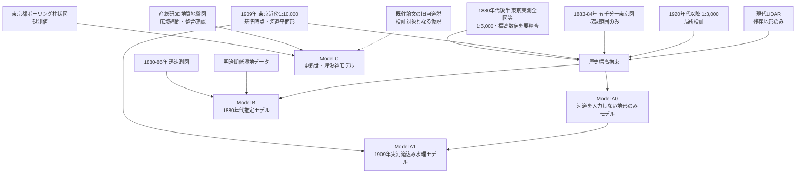
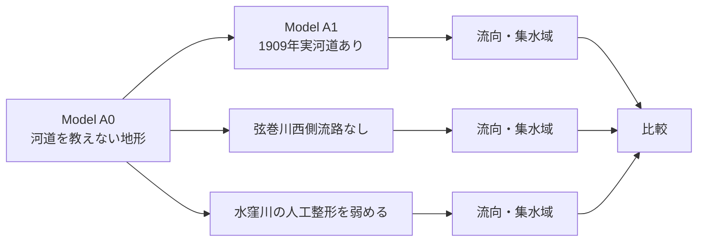

# 歴史地形・流路シミュレーション方針

水窪川・弦巻川・谷端川について、古地図・標高データ・地質データを統合して歴史地形を復元し、地形上の流向・集水・旧河道仮説を検証するための方針をまとめる。

この計画の目的は「昔の川をCGで再現する」ことそのものではない。主目的は、READMEで残っている次の問題について、**地形的に成立しやすい仮説と、人工的な掘削・堰・分水などを強く仮定しなければ成立しない仮説を区別すること**である。

- 水窪川はなぜ音羽谷の東端を流れていたのか。
- 弦巻川の音羽谷西側流路は自然河道だったのか、人為的に整備された流路だったのか。
- 護国寺周辺で弦巻川・水窪川はどのような高低関係にあったのか。
- お茶の水女子大学付近を経て谷端川側へつながるとする更新世旧河道説は、地下の谷底面から見て成立するのか。また流向まで判定できるのか。
- 1909年頃に確認できる池・水路・河道上施設が、周辺の水の流れにどのような意味を持つのか。

> [!IMPORTANT]
> 歴史DEMは推定モデルであり、**格子サイズ・原資料の縮尺・復元精度は別物**である。たとえば1 m格子で出力しても、1880年代の標高が1 m精度で分かるわけではない。原資料の等高線、標高点、測量法、水平位置誤差、標高基準、後世の造成を明示し、結果には必ず不確実性を持たせる。

---

## 1. 結論：1909年を「基準時点」とするが、標高の主資料とは決め打ちしない

1909年の東京近傍1万分1地形図は、3河川がまだ開渠で、同年代・同系列の図葉により池袋・雑司が谷・護国寺・音羽・谷端川側を広く比較できる。このため、**河道・池・道路・土地利用などを比較する基準時点として1909年を採用する**。

ただし、1909年1万分1図をそのまま「歴史DEMの標高主骨格」とは決めない。今回検証したいのは、谷底のどちら側がわずかに低いか、浅い鞍部のどちらへ水が抜け得るかといった問題であり、1:10,000図の等高線だけでは十分に拘束できない可能性がある。

そこで標高面は、次の複数資料を比較して構築する。

- 1909年東京近傍1万分1地形図の等高線・独立標高点
- 1880年代後半の『東京実測全図』など1:5,000級資料の標高数値
- 1883〜1884年の五千分一東京図測量原図（収録範囲のみ）
- 1920年代以降の1:3,000図に残る局所地形
- 現代LiDARのうち、後世の改変が小さいと判断できる崖線・台地縁

1909年地表モデルとは別に、更新世の谷端川接続問題について、**ボーリング柱状図を観測値の中心とする埋没谷底面モデル**を作る。産総研3D地質地盤図は広域補間・整合確認に使い、既往論文が示す旧河道方向は「入力条件」ではなく検証対象となる仮説として扱う。



---

## 2. データセットの再評価

### 2.1 東京近傍1万分1地形図（1909年） — 基準時点・河道平面形の主資料

**採用：最優先。ただし標高主資料かどうかは原図確認後に決定する。**

豊島区立郷土資料館が復刻した『豊島区地域地図 第4集（東京近傍1万分1地形図）』では、1909年測図について「三河島」「上野」「王子」「早稲田」「下練馬」「新井」の図葉を合成している。3河川をほぼ同時期の地図で比較できる点は非常に強い。

1909年は、弦巻川・水窪川・谷端川がまだ開渠であり、本調査で確認した現講談社付近の池や河道上施設も存在する。このため、**「3河川の地表地物を同時に復元する基準年」**として採用する。

一方で、次を確認するまでは標高DEMの唯一の主資料にしない。

- 各図葉の測図年・発行年・修正年・版
- 実際に使われた図式
- 等高線間隔
- 独立標高点・水準点等の密度
- 図葉間での高さ表現の整合

後年修正された図葉を1909年地形として混用しない。原則として1909年測図に最も近い未修正版を優先する。

**利用する情報**

- 等高線
- 独立標高点・水準点等
- 水涯線・河道中心線
- 池・湿地・水田
- 道路、鉄道、堤、崖など人工改変を判断できる地物

**出典**

- 国立国会図書館『豊島区地域地図 第4集（東京近傍1万分1地形図）』  
  https://ndlsearch.ndl.go.jp/books/R100000002-I000011160982
- 国土地理院「1万分1地形図のベクトル型データによる管理」  
  https://www.gsi.go.jp/common/000024779.pdf
- 国土地理院「地図・空中写真閲覧サービス FAQ」  
  https://service.gsi.go.jp/map-photos/app/faq
- 国土地理院「旧版地図等の閲覧及び交付・提供」  
  https://www.gsi.go.jp/MAP/HISTORY/koufu

---

### 2.2 東京実測全図（1880年代後半） — 最優先で実物確認する標高候補

**採用：補助から重点精査へ格上げ。**

国立国会図書館の大縮尺地図案内では、1880年代後半の『東京実測全図』について1:5,000級で、高田村・巣鴨村などを含む地図が案内され、地形表現に加えて標高数値を持つ資料がある。

今回の目的では、1880年代の実測標高数値が対象地域に十分な密度で存在するなら、1909年1:10,000図の等高線だけより強い高度拘束になり得る。

したがって、DEM作成を開始する前に試料図葉を実見し、次を確認する。

- 対象地域を実際に覆う図葉
- 標高数値の種類と密度
- 標高基準面と単位
- 地形線・崖・水路表現
- 位置精度と他資料との整合

標高数値が十分なら**歴史DEMの主要高度拘束へ格上げ**し、疎らであれば従来どおりクロスチェック資料とする。

**出典**

- 国立国会図書館「日本の地図資料」大縮尺地図案内  
  https://ndlsearch.ndl.go.jp/rnavi/maps/post_546

---

### 2.3 第一軍管地方2万分1迅速測図原図（1880〜1886年） — 最古の広域拘束

**採用：重要。ただし数十m単位の位置・標高拘束には使わない。**

関東の迅速測図は1880〜1886年に作成され、今回の3河川周辺を広域に覆う。最大の利点は古さと全域性であり、1909年以前にも存在した谷・河道・田・湿地・土地利用を確認できる。

一方、近代的な基準点網整備以前の地図であり、場所によって大きな位置誤差を含む可能性がある。したがって、現代座標へ強く変形して「河道が現道路から20 mずれている」といった議論には使わない。

主用途は、数百m規模での次の判定とする。

- 1880年代にも存在していた谷・河道
- 田・湿地として使われていた低地
- 1909年までに新設・変更された可能性のある道路・水路
- 谷筋・台地縁の広域形状

**出典**

- 国土地理院「明治期の低湿地データ」  
  https://www.gsi.go.jp/bousaichiri/lc_meiji.html
- 国土地理院「地図記号と地形図図式」  
  https://www.gsi.go.jp/KIDS/KIDS05_00001.html

---

### 2.4 明治期の低湿地データ — 面的・定性的な独立検証

**採用：非常に有用。ただし位置誤差を考慮する。**

国土地理院が迅速測図等から抽出したGISデータで、関東地区では旧河道、水田、湿地、ヨシ・茅、河川・湖沼、堤防、砂礫地・泥地などが面・線データ化されている。

このデータは標高そのものを与えない。また原典の位置誤差を引き継ぐため、細かな河道位置の評価には向かない。

主用途は、DEMから求めた集水域・滞留域が、明治前期の低湿地・水田分布と**谷区間・一帯という面的な尺度で整合するか**を見ることとする。

**出典**

- 国土地理院「明治期の低湿地データ」  
  https://www.gsi.go.jp/bousaichiri/lc_meiji.html

---

### 2.5 五千分一東京図測量原図（1883〜1884年） — 高精度な局所パッチ

**採用：収録範囲だけ最優先で利用。全域資料とはみなさない。**

1:5,000測量原図で、家屋・庭園・地形など非常に細かな描写を持つ。国立国会図書館の案内では高田村を含むことが示されているが、地名だけから現在の雑司が谷・護国寺一帯を広く覆うと仮定しない。

「北限を確認する」だけでなく、**全図葉の実収録範囲をGISポリゴン化**し、対象地点ごとに利用可否を即座に判定できるようにする。

```text
data/vector/map_sheet_footprints.gpkg
```

などに、図名・図葉番号・測量年・四隅座標・入手元を記録する。

**出典**

- 国土地理院「五千分一東京図測量原図 索引図」  
  https://www.gsi.go.jp/common/000207269.pdf
- 国立国会図書館「日本の地形図（大縮尺）」  
  https://ndlsearch.ndl.go.jp/rnavi/maps/post_476

---

### 2.6 三千分一地形図（1924年〜） — 局所地形・河道断面の重要な後代検証

**採用：局所検証に重要。**

復興局等による1:3,000地形図は年代が1909年より遅いため、明治地形の主資料にはしない。ただし縮尺が大きく、開渠末期の河道幅・橋・護岸・道路との交差などを読み取れる可能性が高い。

利用時は、関東大震災後の復興工事、道路改修、下水道工事、学校・宅地造成など**1909年以降の改変を必ずマスク**する。

とくに以下の局所構造に使う。

- 護国寺周辺の橋・水路横断
- 講談社付近の池・河道上施設
- 水窪川・弦巻川の開渠末期の河道幅
- 河床や護岸の形状を推定できる地点

**出典**

- 国立国会図書館「日本の地形図（大縮尺）」  
  https://ndlsearch.ndl.go.jp/rnavi/maps/post_476

---

### 2.7 1931〜1932年頃の弦巻川下水道・暗渠化工事史料 — 新たな最優先探索対象

**採用：所在調査を最優先。**

豊島区の地域史資料では、旧高田町の弦巻川下水道工事が1931年頃に始まったことや工事写真が確認できる。ここからさらに、当時の設計図・縦断図・横断図・管渠底高・道路計画図が残っていないかを調査する。

もし河床高や管渠底高を含む縦断図が見つかれば、局所的な標高拘束として1:10,000等高線よりはるかに強い資料になり得る。

ただし、現時点ではそのような設計図の所在を確認したわけではないため、**「存在する資料」ではなく「最優先で探す資料群」**として扱う。

**出典・手掛かり**

- 豊島区立郷土資料館等の地域史資料  
  https://www.city.toshima.lg.jp/documents/45001/kataribe141.pdf
- 豊島区立郷土資料館 刊行物・地域地図類  
  https://www.city.toshima.lg.jp/129/bunka/bunka/shiryokan/kankobutu/005951.html

---

### 2.8 東京都デジタルツイン区部点群・国土地理院DEM1A — 現代微地形の補助

**採用：高精度だが歴史標高の直接根拠にはしない。**

東京都の0.25 m / 0.5 m DEM、国土地理院の1 m DEMは現代地形を非常に細かく表す。しかし道路、宅地造成、暗渠、鉄道、学校、大規模建築などが成立した後の地形である。

利用するのは、古地図・古写真・地質・現地形から「大きく改変されていない」と判断できる台地縁、崖面、谷壁などの細かな形状に限定する。

また、0.25 mデータを5 m格子へ落としたからといって、歴史標高が5 m精度になるわけではない。**計算格子と推定誤差は別欄で管理する。**

**出典**

- 東京都「東京都デジタルツイン実現プロジェクト 区部点群データ」  
  https://catalog.data.metro.tokyo.lg.jp/dataset/t000029d0000000024
- 国土地理院「基盤地図情報ダウンロードサービス」  
  https://service.gsi.go.jp/kiban/app/help/

---

### 2.9 東京都「東京の地盤」ボーリング柱状図 — 更新世モデルの観測値

**採用：Model Cの主データ。**

東京都のボーリング柱状図は、現在は埋まっている侵食谷・谷埋め堆積物・段丘堆積物などの深度を追うために使う。

お茶の水女子大学周辺〜谷端川間に複数測線を設定し、地点ごとに地層境界の標高を整理する。

ただし、公開座標の桁・位置精度、孔口標高、調査時点の地表面、標高基準を無条件に同一視しない。各地点について最低限、次を保存する。

- 地点ID
- 調査年
- 座標と座標の由来・桁数
- 孔口標高
- 標高基準
- 地層境界の判読値
- 判読幅・不確実性
- 原柱状図への参照

**出典**

- 東京都「ボーリング柱状図等（東京の地盤（GIS版））」  
  https://catalog.data.metro.tokyo.lg.jp/dataset/t000014d2000000032
- 東京都建設局「東京の地盤（GIS版）」  
  https://www.kensetsu.metro.tokyo.lg.jp/jimusho/tech/geo-web

---

### 2.10 産総研「都市域の地質地盤図 東京都区部」 — 広域補間・整合確認

**採用：重要。ただし観測値そのものとは区別する。**

産総研の3D地質地盤図は多数のボーリング等に基づく広域モデルであり、地下谷の連続性を考えるうえで非常に有用である。

一方で、任意地点で値が得られることと、その地点で実測されたことは別である。Model Cでは、

- 東京都等のボーリング = 観測点
- 産総研3D地質地盤図 = 広域補間・地質解釈モデル

と明確に区別する。

**出典**

- 産総研「都市域の地質地盤図 東京都区部」  
  https://gbank.gsj.jp/urbangeol/ja/map_tokyo/index.html
- 産総研「都市域の地質地盤図 説明書」  
  https://gbank.gsj.jp/urbangeol/ja/explanation/index.html

---

### 2.11 既往論文の更新世旧河道説 — データではなく検証対象

弦巻川・水窪川上流の高い谷底と、お茶大付近・谷端川側の旧谷を関連付ける既往研究は、Model Cを作る動機として重要である。

ただし、論文中で示される流路は観測された河道位置そのものではなく、地形・地質から考察された旧河道像である。したがって、その流向をDEM・地質モデルへ最初から入力してはいけない。

**役割は「弦巻川・水窪川側から谷端川側へ流れた」という検証すべき仮説を与えること**とする。

また、「更新世」を一枚の固定地形として扱わない。どの侵食面・どの谷埋め層の基底を旧河床面とみなすかを明示し、異なる時期の谷を混同しない。

**参考**

- 深田地質研究所関連論文（国立国会図書館デジタルコレクション）  
  https://dl.ndl.go.jp/view/prepareDownload?itemId=info%3Andljp%2Fpid%2F14529520

---

## 3. 最初に統一するもの：水平位置・標高基準

複数年代の標高資料を混ぜる場合、最初に座標系と標高基準を整理する。

`data-sources.md` には、各資料について最低限次を記録する。

| 項目 | 内容 |
|---|---|
| source_id | 一意な資料ID |
| title | 資料名 |
| survey_year | 測量・調査年 |
| publication_year | 発行年 |
| revision_year | 修正年 |
| horizontal_datum | 水平位置の基準 |
| vertical_datum | 標高基準面 |
| elevation_unit | 標高単位 |
| nominal_scale | 縮尺 |
| horizontal_uncertainty | 想定水平誤差 |
| vertical_uncertainty | 想定高さ誤差 |
| georef_rmse | ジオリファレンス残差 |
| source_url | 入手元 |
| license | 利用条件 |
| notes | 注意事項 |

とくに、1880年代の標高数値、1909年図、1920年代図、現代DEM、ボーリング孔口標高の**0 mが同じ意味かを確認せずに標高差を比較しない**。

---

## 4. 作るモデルは4系統

### Model A0 — 1909年・河道を教えない地形のみモデル

最重要の検証モデル。

**目的**

- 河道位置を入力しなくても、自然集水線が水窪川・弦巻川の実河道付近へ形成されるかを見る。
- 水窪川が音羽谷東端を流れることを地形だけで説明できるかを見る。
- 弦巻川西側流路が自然集水線と一致するかを見る。

**重要な制約**

河道中心線・水涯線を「低いブレークライン」としてDEMへ焼き込まない。そうしてしまうと、実河道と集水線が一致するのは当然となり、検証にならない。

地形構築に利用するのは原則として、標高点、等高線、崖線、台地縁など河道とは独立な高度・地形情報とする。

### Model A1 — 1909年・実河道込み水理モデル

A0を基礎に、1909年に存在した河道・池・堤・水路構造を付加する。

**目的**

- 実際の開渠を含めた場合の流向・滞留域
- 池・堰・人工水路の影響
- Phase 3で必要になった場合の2次元浅水流

A0とA1を混同しない。

### Model B — 1880年代推定モデル

1909年モデルを基礎に、迅速測図、東京実測全図、五千分一東京図、低湿地データ等から1909年までの改変を可能な範囲で巻き戻す。

**目的**

- 明治前期に西側弦巻川が地形的に成立していたか。
- 1880年代の水田・湿地分布と自然集水域が整合するか。
- 1909年との差から人工改変候補を抽出する。

### Model C — 更新世・埋没谷モデル

地表モデルとは完全に別に構築する。

**目的**

- 弦巻川・水窪川上流の高い谷底と、お茶大付近・谷端川側の地下谷が地質学的に連続するか。
- 連続する場合、特定の侵食面・谷底面の標高勾配はどちらを向くか。
- 流向がデータから決められるのか、それとも不確実性の範囲で逆転するのか。

---

## 5. 解析範囲は表示範囲より広く取る

詳細表示範囲を「池袋〜雑司が谷〜護国寺〜音羽〜お茶大〜谷端川近傍」に限定するのはよいが、流向・集水量を計算するDEMはそこで切らない。

流域途中でDEMを切ると、境界外から流入する水が消える。

したがって、解析用DEMは水窪川・弦巻川・谷端川の対象区間に寄与する**分水界まで含む一回り広い領域**を持ち、詳細なベクトル化・表示範囲だけを狭くする。

---

## 6. ジオリファレンスとベクトル化

### 6.1 ジオリファレンス

旧版地図を一律に現代地図へ強制変形しない。

基準点は、なるべく次の順で選ぶ。

1. 現在も位置が動いていない可能性が高い寺社境内・主要街路交点
2. 台地端・谷頭など大規模な自然地形
3. 古い橋・道路横断地点で位置が継承されているもの
4. 区画・建物は最後の補助

迅速測図では広域一括変換を避け、対象流域周辺で局所補正する。ただし過度な高次変換で原図の位置誤差を「見かけ上きれいに」消さない。

変換後はRMSEだけでなく、独立チェック点の残差も保存する。

### 6.2 ベクトル化

最低限、次のレイヤーを分離する。

```text
contours
spot_heights
water_edges
streams
ponds
wetlands
cliffs
embankments
roads
railways
map_sheet_footprints
uncertainty
```

各地物には可能なら `source_id`、`survey_year`、`confidence` を持たせ、異なる年代・異なる資料の線を一つに溶かさない。

---

## 7. DEM作成方法

単純な等高線補間だけでは、谷を横切って滑らかな面が作られ、実際の谷底・崖が消えることがある。標高点・等高線に加え、河道と独立に確認できる崖線・尾根・台地端をブレークラインとして扱える手法を優先する。

最初から0.25 m格子へせず、**5 m程度の試験DEM**から始める。必要に応じて2 m、1 mへ細分化してもよいが、細分化は史料情報を増やすものではない。

各DEMには必ず、

- `cell_size`
- `estimated_horizontal_uncertainty`
- `estimated_vertical_uncertainty`
- 使用した `source_id`

を別々に記録する。

---

## 8. 凹地処理・流向計算は1通りに固定しない

通常の水文解析では、DEM上の小さな凹地をエラーとみなして埋めることが多い。しかし今回、池・湿地・谷底凹地そのものが歴史情報である。

したがって、少なくとも次の2系統を保持する。

- **raw-depression model** — 復元した凹地を保持
- **hydrologically-conditioned model** — 明らかな補間誤差や接続上必要な凹地だけを処理

また浅く平坦な谷底では、単一方向へ流す方式だけでなく、複数方向へ流量を分配する方式も比較する。

アルゴリズムの選択だけで「東側へ流れた／西側へ流れた」が変わる場合、その差自体を不確実性として報告する。

---

## 9. 解析手順

### Phase 1 — 河道を入力しない地形解析

Model A0で次を計算する。

1. 凹地分布
2. 流向
3. 集水量
4. 集水域
5. 谷底縦断
6. 横断面
7. 自然集水線と実河道の距離・一致率

この段階では、1909年の実河道は**比較用の正解候補として後から重ねる**。

### Phase 2 — 河道・人工地形を加えた比較

Model A1で、実河道・池・堤等を加える。また仮説ごとに人工水路を除去・変更したモデルを作る。



### Phase 3 — 2次元浅水流

Phase 1・2で意味のある差が出て、かつ必要な境界条件をある程度拘束できる場合のみ行う。

水窪川・弦巻川は湧水の寄与が大きいため、降雨流出だけでなく、蛇池・護国寺境内池・崖下湧水・丸池などを定常流入点とするシナリオも用意する。

ただし、河床断面、河床高、粗度、湧水量が十分に分からない段階で「史実の流量を再現した」とは言わない。目的は、**仮定した境界条件の下で、どの経路が成立しやすいかを比較すること**である。

---

## 10. 不確実性は入力資料の段階からモデル化する

1つのDEMだけで結論を出さない。

単に各5 m画素へ独立な乱数を加えるのではなく、実際の誤差源を揺らす。

- 等高線の高度
- 標高点の高さ
- ジオリファレンス変換
- 標高基準面の補正値
- 崖線・台地端の位置
- 補間方法
- 凹地処理方法
- 流向アルゴリズム

これらを組み合わせて多数の許容DEMを生成し、たとえば、

- 水窪川東側へ自然集水線が形成される割合
- 弦巻川西側へ形成される割合
- 谷中央へ形成される割合
- お茶大〜谷端川間の古谷底勾配が逆転する割合

を求める。

結果がほぼ一方向に集中すれば強い地形的支持となる。逆に、わずかな入力差で流向が頻繁に逆転するなら、結論は**「現在得られる史料精度では流向を決められない」**となり、それ自体を研究成果とする。

---

## 11. 検証は循環させない

復元DEMの検証には、可能な限りDEM作成へ使っていない独立資料を使う。

**悪い例**

1. 1909年河道を低い線としてDEMへ焼き込む
2. 流向を計算する
3. 1909年河道と一致したのでDEMが正しいとする

これは循環している。

**良い例**

1. 標高点・等高線・崖線からModel A0を作る
2. 河道を入力せず流向を計算する
3. 1909年実河道を後から重ねて一致率を見る
4. さらに1880年代低湿地、1920年代1:3,000図、古写真等で独立検証する

独立検証候補は次のとおり。

- 1880年代の水田・湿地・旧河道分布
- 1909年の実河道位置（A0の検証用）
- 1920年代の河道・池
- 1:3,000図
- 古写真・絵葉書で見える崖・低地
- 現在残る崖線・水路敷
- 工事図面・縦断図が発見された場合の河床高
- Model Cでは入力に使っていないボーリング地点

---

## 12. 当面の作業順

### 最優先：DEMを作る前に資料の能力を確定する

- [ ] 『東京実測全図』の対象図葉を実見し、標高数値の密度・基準・利用可能範囲を確認する。
- [ ] 1909年1:10,000の必要図葉を確定する。
- [ ] 各1909年図葉の測図年・発行年・修正年・版・図式・等高線間隔を確認する。
- [ ] 五千分一東京図の全図葉範囲をGISポリゴン化する。
- [ ] 1931〜1932年頃の弦巻川下水道・暗渠化工事について、設計図・縦断図・横断図・管渠底高資料の所在を調べる。
- [ ] 各高度資料の標高基準面・単位を整理する。

### 1909年地表モデル

- [ ] 正式画像の入手方法・再配布条件を整理する。
- [ ] 解析領域を分水界まで含めて決定する。
- [ ] 1909年図をジオリファレンスする。
- [ ] 標高点・等高線・崖線・河川・池等を別レイヤーでベクトル化する。
- [ ] 河道を入力しない `dem_1909_A0_v0.1` を5 m格子で作る。
- [ ] 複数の凹地処理・流向方式で自然集水線を計算する。
- [ ] 1909年実河道を後から重ね、一致率を評価する。
- [ ] 実河道を加えた `dem_1909_A1_v0.1` を作る。

### 1880年代モデル

- [ ] 迅速測図・東京実測全図・五千分一東京図から1909年までの変化を抽出する。
- [ ] 明治期低湿地データを面的検証用に重ねる。
- [ ] `dem_1880s_v0.1` を作り、1909年との差を記録する。

### 更新世モデル

- [ ] お茶大〜谷端川間だけでなく、接続候補となる複数測線のボーリング位置を収集する。
- [ ] 孔口標高・地層境界・座標精度を含む標高表を作る。
- [ ] 「旧河床面」とみなす地質境界を定義する。
- [ ] 産総研3D地質図で同じ測線を比較する。
- [ ] 一部ボーリングを検証用に取り置き、補間モデルの再現性を評価する。
- [ ] 入力誤差を振って古谷底勾配が逆転する割合を調べる。

---

## 13. リポジトリ上のデータ構成案

```text
data/
  raw/                  # 原資料。再配布条件を必ず確認
  external/             # ダウンロード先・取得条件だけを記録
  georef/               # ジオリファレンス結果・変換情報
  vector/               # 等高線・河道・池・図葉範囲等
  elevation-control/    # 標高点・標高基準・ボーリング境界
  dem/                  # 復元DEM

analysis/
  notebooks/            # 地形解析・検証
  profiles/             # 縦断・横断データ
  uncertainty/          # 多数DEM・感度分析
  simulations/          # 流向・浅水流の設定と結果

docs/
  historical-terrain-and-flow-simulation-plan.md
  data-sources.md
```

著作権・測量成果利用条件により原画像をGitHubへ置けない場合は、`data/raw/` に画像を置かず、`data-sources.md` に取得元、図名、図葉番号、測図年、発行年、修正年、取得日、利用条件、ローカルファイルのハッシュを記録する。

---

## 14. 現時点で避ける方針

- 1909年1:10,000図を、原図確認前から唯一の標高主資料と決めない。
- 現代0.25 m DEMをそのまま「明治地形」として使用しない。
- 迅速測図を高精度な現代座標へ無理に合わせて、数十m以下の流路位置を断定しない。
- 明治期低湿地データを細かな河道位置の証拠にしない。
- 河道をDEMへ焼き込んだ後、その河道との一致を検証結果としない。
- 全ての凹地を機械的に埋めない。
- 出力格子が細かいことを復元精度の高さと混同しない。
- 異なる年代・異なる標高基準の数値を無補正で混ぜない。
- 五千分一東京図を池袋・雑司が谷まで全面的に覆う資料として扱わない。
- 地形だけで湧水河川の史実流量を再現できると考えない。
- 産総研3D地質モデルの任意地点値を、その地点の実測値として扱わない。
- 既往論文の更新世旧河道図をModel Cの入力河道にしない。
- 更新世モデルと1909年地表モデルを同じDEMとして混ぜない。

---

## 15. 最終成果

単一の「昔はこう流れていた」という復元図ではなく、次を成果とする。

1. **1909年の基準時点レイヤーと資料台帳**
2. **河道を入力しない1909年地形モデル A0**
3. **実河道・池・人工地形を加えた1909年モデル A1**
4. **1880年代推定DEMと1909年との差分**
5. **自然集水線と実河道の独立比較**
6. **人工水路を除去・変更した複数シナリオの比較**
7. **入力誤差を反映した多数DEMによる流路成立確率**
8. **お茶大〜谷端川間を含む埋没谷底面モデル**
9. **各旧河道仮説について、支持・反証・判定不能を区別した評価**
10. **各結論に対する不確実性・反証可能性の明示**

この方法なら、史料にないものを「シミュレーションがそう言ったから史実」とするのではなく、**古地図・実測標高・地質・工事史料・現地痕跡と数値モデルを相互に検証し、どこまで分かり、どこから分からないかを示す研究**にできる。
