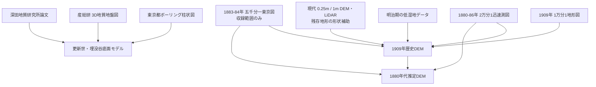
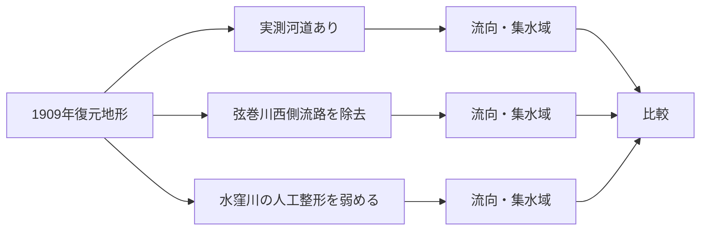

# 歴史地形・流路シミュレーション方針

水窪川・弦巻川・谷端川について、古地図・標高データ・地質データを統合して歴史地形を復元し、地形上の流向や集水、必要に応じて2次元浅水流まで検証するための方針をまとめる。

この計画の目的は「昔の川をCGで再現する」ことそのものではない。主目的は、READMEで残っている次の問題について、**地形的に成立しやすい仮説と、人工的な掘削・堰・分水などを強く仮定しなければ成立しない仮説を区別すること**である。

- 水窪川はなぜ音羽谷の東端を流れていたのか。
- 弦巻川の音羽谷西側流路は自然河道だったのか、人為的に整備された流路だったのか。
- 護国寺周辺で弦巻川・水窪川はどのような高低関係にあったのか。
- お茶の水女子大学付近を経て谷端川側へつながるとする更新世旧河道説は、谷底面の勾配から見てどの流向が妥当なのか。
- 1909年頃に確認できる池・水路・河道上施設が、周辺の水の流れにどのような意味を持つのか。

> [!IMPORTANT]
> 歴史DEMは推定モデルであり、格子サイズと復元精度は別物である。たとえば0.25 m格子で出力しても、1880年代の標高が25 cm精度で分かるわけではない。原資料の等高線、標高点、測量法、位置誤差、後世の造成を明示し、結果には必ず不確実性を持たせる。

---

## 1. 結論：採用するデータ構成

現時点では、**1909年の1万分1地形図を歴史DEMの主骨格**とし、1880年代の資料で過去方向へ拘束し、現代LiDARは細部形状の補助に限定する方針が最も妥当である。

更新世の谷端川接続問題については、地表DEMとは切り離し、**ボーリング柱状図と3次元地質地盤モデルから「埋没した古い谷底面」を復元する別モデル**を作る。



---

## 2. データセットの評価

### 2.1 東京近傍1万分1地形図（1909年） — 主データ

**採用：最優先。**

豊島区立郷土資料館が復刻した『豊島区地域地図 第4集（東京近傍1万分1地形図）』では、1909年測図について「三河島」「上野」「王子」「早稲田」「下練馬」「新井」の図葉を合成している。したがって、池袋・雑司が谷・護国寺・音羽だけでなく、谷端川側も含む今回の主要範囲を、同年代・同系列の1:10,000地形図で連続的に扱える。

1909年は、弦巻川・水窪川・谷端川がまだ開渠であり、本調査で確認した現講談社付近の池や河道上の建物も存在する。このため、**「3河川が開渠だった時代の地形と水路を同時に復元する基準年」**として条件が良い。

国土地理院によれば、戦前の旧1万分1地形図は平板測量で作製されていた。また、1万分1地形図には複数の図式が存在する。1909年の各図葉が実際にどの図式・等高線間隔を使うかは、原図と図式資料を確認して確定する。現在の国土地理院の一般的な1万分1地形図の主曲線間隔（4 m、平坦地2 m）を1909年へそのまま遡及してはならない。

**利用する情報**

- 等高線
- 独立標高点・水準点等があればその標高値
- 河川・水路中心線ではなく水涯線が読める場合は両岸
- 池・湿地・水田
- 道路、鉄道、堤・崖など人工改変を判断できる地物

**入手方針**

国土地理院の旧版地図は地図・空中写真閲覧サービスで閲覧できる。正式な画像データの提供はTIFF、400 dpiまたは600 dpiで、座標情報は付与されていないため、取得後に独自にジオリファレンスする。

**出典**

- 国立国会図書館『豊島区地域地図 第4集（東京近傍1万分1地形図）』  
  https://ndlsearch.ndl.go.jp/books/R100000002-I000011160982
- 国土地理院「1万分1地形図のベクトル型データによる管理」  
  https://www.gsi.go.jp/common/000024779.pdf
- 国土地理院「地図・空中写真閲覧サービス FAQ」  
  https://service.gsi.go.jp/map-photos/app/faq
- 国土地理院「旧版地図等の閲覧及び交付・提供」  
  https://www.gsi.go.jp/MAP/HISTORY/koufu

---

### 2.2 第一軍管地方2万分1迅速測図原図（1880〜1886年） — 最古の全域拘束

**採用：重要。ただし主DEMにはしない。**

関東の迅速測図は1880〜1886年に作成され、今回の3河川周辺を広域に覆う。国土地理院の「明治期の低湿地データ」も関東地区ではこの迅速測図を原典としている。

最大の利点は古さと全域性であり、1909年以前の河道、谷、田、湿地、土地利用を確認できる。一方、国土地理院自身が、近代測量に基づく基準点網整備前の地図であり、場所によって位置精度にかなりの誤差を含む可能性があると注意している。

したがって、この資料を細かな水理DEMへ直接変換するより、1909年モデルに対して、

- 1880年代にも存在していた谷・河道
- 田・湿地として利用されていた低地
- 1909年までに新設・変更された可能性のある水路や道路

を判定する**過去方向の拘束条件**として使う。

**出典**

- 国土地理院「明治期の低湿地データ」  
  https://www.gsi.go.jp/bousaichiri/lc_meiji.html
- 国土地理院「地図記号と地形図図式」  
  https://www.gsi.go.jp/KIDS/KIDS05_00001.html

---

### 2.3 明治期の低湿地データ — 1880年代の実態チェック

**採用：非常に有用。**

国土地理院が迅速測図等から抽出したGISデータで、関東地区では次の地物が面・線データ化されている。

- 旧河道
- 水田・田
- 湿地
- ヨシ・茅
- 河川・湖沼
- 堤防
- 砂礫地・泥地など

このデータは標高そのものを与えないが、DEMから計算した集水域や水の滞留域と、実際の明治前期の低湿地・水田分布が一致するかを検証できる。

たとえば、復元DEMでは西側に水が集中するのに、迅速測図由来データでは東側の水窪川沿いに低湿地が集中する場合、人工水路・堰・盛土・微小な標高差など、モデルに欠けている要素を疑える。

**出典**

- 国土地理院「明治期の低湿地データ」  
  https://www.gsi.go.jp/bousaichiri/lc_meiji.html

---

### 2.4 五千分一東京図測量原図（1883〜1884年） — 高精度な局所パッチ

**採用：収録範囲だけ最優先で利用。全域資料としては使わない。**

国土地理院によれば、この図は皇居を中心とする東西南北約7.5 km四方について作成された1:5,000測量原図で、1883年に測量が再開され1884年に完成した。家屋や庭園など非常に細かな描写を持つ。

重要な制限は**範囲**である。今回の調査範囲全体、とくに池袋・雑司が谷・護国寺以北を一様に覆う資料ではない。音羽谷の南側など収録される部分について、1909年DEMを局所的に補強する資料として使う。

利用時は、図葉の北限・収録範囲を実画像と索引図で確定する。単に「高田村近傍」という図名があることから、現在の高田・雑司が谷一帯を広く覆うと仮定しない。

**出典**

- 国土地理院「五千分一東京図測量原図 索引図」  
  https://www.gsi.go.jp/common/000207269.pdf
- 国立国会図書館「日本の地形図（大縮尺）」  
  https://ndlsearch.ndl.go.jp/rnavi/maps/post_476

---

### 2.5 東京実測全図（1880年代後半） — 高さ・位置の補助資料

**採用：補助。**

1:5,000級の明治東京図は魅力的だが、今回の3河川全域を一様に覆うとは限らない。またシリーズごとに地形表現・標高情報が異なる。

利用する場合は、五千分一東京図や1909年1万分1図と重なる地点で、標高値・崖・道路・水路の整合性を確認する**クロスチェック**に使う。

---

### 2.6 三千分一地形図（1924年〜） — 局所構造の検証

**採用：局所検証に有用。**

国立国会図書館によれば、復興局等による1:3,000地形図は1924年以降、東京23区を広く収録する。

年代が遅いため、1880年代・1909年の自然地形の主資料にはしない。ただし縮尺が大きいため、

- 護国寺南西端の橋・横断施設
- 講談社付近の池と河道上建物
- 河道幅
- 橋、護岸、道路との交差

など、数十m以下の局所構造を詰める資料として利用価値が高い。

弦巻川暗渠化が1932年なので、対象図葉の測図年が1920年代なら開渠末期の情報が得られる可能性がある。図葉ごとの測図年を必ず確認する。

**出典**

- 国立国会図書館「日本の地形図（大縮尺）」  
  https://ndlsearch.ndl.go.jp/rnavi/maps/post_476

---

### 2.7 東京都デジタルツイン 区部点群データ（現代） — 微地形の形状補助

**採用：高精度だが使い方を限定。**

東京都は区部について航空レーザ点群と、グラウンドデータから作成した0.25 m / 0.5 mグリッドDEMを公開している。0.25 m GeoTIFFは非常に細かい。

ただし、これは**現代地形**である。道路・宅地造成・暗渠・首都高・鉄道・学校・大規模建築などが成立した後の地形なので、歴史DEMの高さの根拠として無条件には使えない。

使用するのは、古地図・古写真・地質・地形から「大きく改変されていない」と判断できる崖面や台地縁などの細かな形状を補間する場合に限る。

**出典**

- 東京都「東京都デジタルツイン実現プロジェクト 区部点群データ」  
  https://catalog.data.metro.tokyo.lg.jp/dataset/t000029d0000000024

---

### 2.8 国土地理院 DEM1A（現代1 m DEM） — 比較・バックアップ

**採用：比較用。**

国土地理院は東京23区を含む範囲で航空レーザ由来の1 mメッシュDEM（DEM1A）を提供している。基となる航空レーザ測量の高さ精度は、格子内にグラウンド計測点がある場合、RMS誤差0.3 m以内とされる。

東京都0.25 m DEMと比較して、現代DEM同士の不一致や異常値を検出するのに有用である。

**出典**

- 国土地理院「基盤地図情報ダウンロードサービス」  
  https://service.gsi.go.jp/kiban/app/help/
- 国土地理院「1mメッシュ（標高）の提供範囲を拡大」  
  https://www.gsi.go.jp/gazochosa/gazochosa61009.html

---

### 2.9 東京都「東京の地盤」ボーリング柱状図 — 埋没谷の実測点

**採用：更新世モデルの主データ。**

東京都は都内の地盤調査で得られた地質柱状図をGISで公開している。地表河道の再現より、**現在は埋まっている古い侵食谷や谷底堆積物の深度を追う**目的で使う。

お茶の水女子大学周辺〜谷端川間に測線を設定し、ボーリング地点ごとに、沖積層・谷埋め堆積物・ローム・段丘堆積物などの境界標高を整理する。

**出典**

- 東京都「ボーリング柱状図等（東京の地盤（GIS版））」  
  https://catalog.data.metro.tokyo.lg.jp/dataset/t000014d2000000032
- 東京都建設局「東京の地盤（GIS版）」  
  https://www.kensetsu.metro.tokyo.lg.jp/jimusho/tech/geo-web

---

### 2.10 産総研「都市域の地質地盤図 東京都区部」 — 3D地下モデル

**採用：更新世モデルの主データ。**

産総研は東京都区部について3次元地質地盤情報を公開しており、地図上で立体図を表示・ダウンロードできるほか、任意の測線で地質断面図を作成できる。

これを東京都の個別ボーリング柱状図と組み合わせ、深田地質研究所論文が示した「高い河床」と谷端川側の谷が地下でどう接続するかを検証する。

ここでは現在の地表流向ではなく、**古い谷底・地層境界面の標高勾配**を問題にする。

**出典**

- 産総研「都市域の地質地盤図 東京都区部」  
  https://gbank.gsj.jp/urbangeol/ja/map_tokyo/index.html
- 産総研「都市域の地質地盤図 説明書」  
  https://gbank.gsj.jp/urbangeol/ja/explanation/index.html

---

## 3. 作るモデルは1枚ではなく3系統

### Model A — 1909年開渠モデル

最初に作る本命。

**目的**

- 1909年の地形に対して、自然な集水線が水窪川・弦巻川・谷端川とどの程度一致するかを見る。
- 水窪川が音羽谷東端を流れることが地形だけで説明できるかを見る。
- 弦巻川西側流路が自然に水を集める位置なのか、それとも人工掘削を前提とする位置なのかを見る。
- 講談社付近の池と河道上施設の位置を水理的に評価する。

**主データ**

1909年1万分1図 + 明治期低湿地 + 1880年代迅速測図 + 局所的な1883-84年1:5,000図 + 現代LiDARの残存地形。

### Model B — 1880年代推定モデル

Model Aを基礎にし、1909年までの造成・道路・水路改変を可能な範囲で巻き戻す。

**目的**

- 明治前期に西側弦巻川が地形的に成立していたか。
- 1880年代の水田・湿地分布と自然集水域が整合するか。
- 1909年との差分から人工改変候補を抽出する。

迅速測図の位置誤差があるため、Model Aより不確実性を大きく設定する。

### Model C — 更新世・埋没谷モデル

地表モデルとは別物として構築する。

**目的**

- 弦巻川・水窪川上流の「高い河床」とお茶大付近、谷端川側の古い谷が地質学的に連続するか。
- 連続する場合、谷底面の標高勾配はどちら方向を向くか。
- 深田地質研究所論文の「弦巻川・水窪川 → 谷端川」という例示以外に、「谷端川側 → 護国寺側」や途中の分水界が成立する余地があるか。

**主データ**

東京都ボーリング + 産総研3D地質地盤図 + 深田地質研究所論文。

---

## 4. DEMの作成方法

### 4.1 ジオリファレンス

旧版地図のTIFFには座標情報がないため、各図葉を局所的に位置合わせする。

基準点は、なるべく次の順で選ぶ。

1. 現在も位置が動いていないと考えられる寺社境内・主要街路の交点
2. 台地端・谷頭などの自然地形
3. 古い橋・道路横断地点で後世も位置が継承されているもの
4. 区画・建物は最後の補助

迅速測図では広域一括変換を避け、対象流域周辺で局所補正する。

### 4.2 ベクトル化

各史料から最低限、次のレイヤーを分離する。

- `contours` — 等高線
- `spot_heights` — 標高点
- `water_edges` — 水涯線
- `streams` — 水路中心線（両岸が読めない場合）
- `ponds` — 池
- `wetlands` — 湿地・水田
- `cliffs` — 崖・急斜面
- `embankments` — 堤・盛土候補
- `roads` — 主要道路
- `uncertainty` — 読み取り不確実範囲

### 4.3 DEM補間

単純な等高線だけの補間では、河道を横切って地表面が丸められることがある。そのため、河川・崖・尾根をブレークラインとして扱える補間方法を優先する。

出力格子は、最初から0.25 mにせず、**5 m程度の試験DEM**から始める。これは史料由来の高度精度を考えると、過度な疑似精度を避けやすい。

モデルが安定した後に2 m、1 mなどへ細分化してもよいが、細分化は情報量を増やすものではない。

---

## 5. 最初に行う解析

いきなり流体シミュレーションを行わない。

### Phase 1 — 地形解析

1. Sink / depression（凹地）抽出
2. Flow direction（流向）
3. Flow accumulation（集水量）
4. Watershed（集水域）
5. Longitudinal profile（谷底縦断）
6. Cross section（横断）

まず地形だけで、どこに水が集まりやすいかを見る。

### Phase 2 — 河道を加えた水理的検討

実際の開渠をDEMへ「掘り込んだ」モデルと、人工水路候補を消したモデルを比較する。

例：



### Phase 3 — 2次元浅水流

Phase 1・2で意味のある差が出た場合のみ実施する。

水窪川・弦巻川は湧水の寄与が大きいので、降雨流出だけでなく、蛇池・護国寺境内池・崖下湧水・丸池などを定常流入点として扱うシナリオを用意する。

この段階でも「史実の流量を再現した」とは言わず、**仮定した流入条件の下でどの経路が成立しやすいか**を見る。

---

## 6. 不確実性を必ずモデル化する

1つのDEMだけで結論を出さない。

たとえば標高拘束点・等高線の周辺に、資料精度に応じた上下幅を設定し、複数の地形を作る。

- scenario low
- scenario nominal
- scenario high

またはMonte Carlo的に多数の地形を生成して、流向が何割のモデルで一致するかを見る。

特に重要なのは、お茶大〜谷端川間のような浅い鞍部である。±1 m程度の変更で古流向が逆転するなら、結論は「流向を決められない」であり、それ自体が研究成果になる。

---

## 7. 検証方法

復元したDEMは、次の独立資料で検証する。

- 1880年代の水田・湿地・旧河道分布
- 1909年の実際の河道位置
- 1921年頃の河道・池の残存
- 1924年以降の1:3,000図
- 古写真・絵葉書で見える崖・低地
- 現在残る崖線・水路敷
- ボーリング柱状図

「現在の河道と合った」だけでは検証にならない。DEM作成に使っていない別年代・別種類の史料との一致を重視する。

---

## 8. 当面の作業順

- [ ] 1909年の必要図葉を確定する（早稲田・下練馬・王子・上野・三河島・新井のうち実際の対象範囲を確認）。
- [ ] 各図葉の測図年、修正年、使用図式、等高線間隔を原図・図式資料で確認する。
- [ ] 600 dpiまたは400 dpiの正式TIFF入手方法を整理する。
- [ ] 対象範囲を決める。最初は「池袋〜雑司が谷〜護国寺〜音羽〜お茶大〜谷端川近傍」に限定する。
- [ ] 1909年図をジオリファレンスする。
- [ ] 等高線・標高点・河川・池をベクトル化する。
- [ ] 5 mグリッドで `dem_1909_v0.1` を作る。
- [ ] 流向・集水域を計算し、実河道と比較する。
- [ ] 明治期低湿地データを重ね、田・湿地との一致を評価する。
- [ ] 五千分一東京図の正確な北限を確認し、重なる範囲だけ `dem_1909_v0.1` を補強する。
- [ ] 1880年代迅速測図から、1909年までに変化した地物を抽出する。
- [ ] `dem_1880s_v0.1` を作り、1909年モデルとの差を記録する。
- [ ] お茶大〜谷端川間のボーリング位置を収集し、地質境界の標高表を作る。
- [ ] 産総研3D地質図で同じ測線の断面を作り、更新世モデルの作成可否を判断する。

---

## 9. リポジトリ上のデータ構成案

実際に作業を開始したら、次のように史料・加工物・結果を分ける。

```text
data/
  raw/              # 原資料。再配布条件を必ず確認
  external/         # ダウンロード先・取得条件だけを記録するデータ
  georef/           # ジオリファレンス結果
  vector/           # 等高線・河道・池等のGeoJSON/GPKG
  dem/              # 復元DEM

analysis/
  notebooks/        # 地形解析・検証
  profiles/         # 縦断・横断データ
  simulations/      # 流向・浅水流の設定と結果

docs/
  historical-terrain-and-flow-simulation-plan.md
  data-sources.md
```

著作権・測量成果利用条件により原画像をGitHubへ置けない場合は、`data/raw/` に画像を置かず、`data-sources.md` に取得元、図名、図葉番号、測図年、取得日、利用条件、ローカルファイルのハッシュだけを記録する。

---

## 10. 現時点で避ける方針

- 現代0.25 m DEMをそのまま「明治地形」として使用しない。
- 1880年代迅速測図を高精度な現代座標へ無理に合わせて、数m単位の流路位置を断定しない。
- 出力格子が細かいことを復元精度の高さと混同しない。
- 1909年1万分1図の等高線間隔を、現行図式や二次資料だけから決めない。
- 五千分一東京図を池袋・雑司が谷まで全面的に覆う資料として扱わない。
- 地形だけで湧水河川の流量を再現できると考えない。
- 更新世モデルと1909年地表モデルを同じDEMとして混ぜない。

---

## 11. この計画で得たい最終成果

単一の「昔はこう流れていた」という復元図ではなく、次の形を目指す。

1. **1909年復元DEMと、その根拠レイヤー**
2. **1880年代推定DEMと1909年との差分**
3. **水窪川・弦巻川の自然集水線と実河道の比較**
4. **人工水路を除去・変更した複数シナリオの比較**
5. **お茶大〜谷端川間の埋没谷底面と推定古流向**
6. **各結論に対する不確実性・反証可能性の明示**

この方法なら、史料にないものを「シミュレーションがそう言ったから史実」とするのではなく、古地図・地質・現地痕跡と数値モデルを相互検証に使える。
