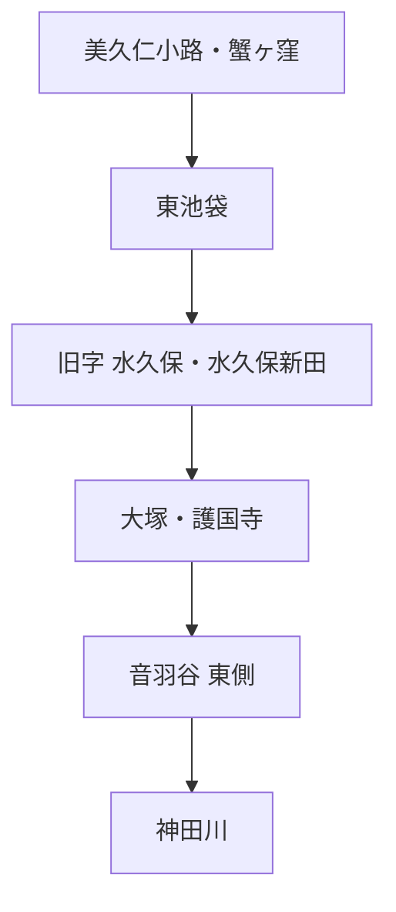

# 水窪川

水窪川について、現在までに確認できた主要事項をまとめる。詳しい出典番号・調査経緯は [分割前README全文](research-notes-full.md) を参照。

## 名称

豊島区資料では、旧・東池袋4丁目付近の字名「水久保」にちなみ、「水久保川」「日の出川」とも呼ばれたとされる。近世地誌には「鼠ヶ谷下水」の名も見える。

『東京「暗渠」散歩 改訂版』では、上流部を「日の出川」、下流側を「音羽川」とする呼称や、江戸期の「東青柳下水」も紹介されている。

## 源頭と字名「水久保」

水窪川の源頭は、現在の池袋東口・美久仁小路付近、旧「蟹ヶ窪」の浅い窪地とされる。一方、川名の由来となった旧字「水久保」は現在の東池袋4丁目付近であり、源頭そのものとは少し離れている。

## 護国寺・豊島岡側の湧水

護国寺東側の豊島岡墓地には蛇池という湧水池があり、そこからの水が護国寺境内の湧水池を経て水窪川へ注いだとされる。小日向台崖下には現在も湧水が見られる。

このため、水窪川の東側流路は、単純な人工排水路ではなく、崖下湧水を集める自然な水系を基礎に、近世の造成・排水で位置を固定された可能性が高い。〔推定〕

## 1682年・1687年の江戸図

護国寺創建翌年の1682年図と1687年図では、護国寺周辺に水窪川とみられる水路が描かれている。一方、同じ図では弦巻川を確認できない。

ただし、江戸図では小河川が省略される例があるため、「描かれていない＝存在しない」とは断定しない。

## 暗渠化と川の記憶

豊島区資料では、水窪川は昭和初期から戦後にかけて下水化されたとされる。全区間が同一年に一斉暗渠化されたとは現在の資料からは言えない。

旧流路付近の辻広場には、1986年の「水窪川　小さな川が流れていた　後世に伝える」という表示があり、暗渠化後も地域で旧河川を記憶する空間がつくられていたことが確認できる。

## 関連する未解決問題

**弦巻川が護国寺付近または音羽谷の途中で水窪川へ合流していた時期があるのか**は、この川だけでは解けない中心課題である。

→ [未解決問題：水窪川と弦巻川は合流していたのか](open-questions/tsurumaki-mizukubo-confluence.md)

## 未解決

- 護国寺より上流で、自然河道と人工的に整理された水路をどこまで区別できるか。
- 音羽谷東端へ流路が固定された正確な時期と工事過程。
- 更新世の旧河道が谷端川側へつながっていた場合の流向。
- 近代の暗渠化工事を区間ごとに年代確定できるか。
