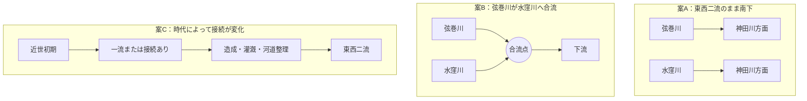

# 未解決問題：水窪川と弦巻川は合流していたのか

水窪川と弦巻川は、近代の実測図では音羽谷の東西を並ぶ二流として追うことができる。しかし、それ以前も常に二流だったのか、護国寺付近または音羽谷の途中で合流する時期があったのかは確定していない。

この問題は、単に「合流点を探す」だけでは済まない。**時代によって接続関係そのものが変化した可能性**があるためである。

## 問い

現在の中心的な問いは次の三つである。

1. 雑司ヶ谷から来た弦巻川は、護国寺南西端より下流で水窪川へ合流していた時期があるのか。
2. 合流していたなら、その地点と時期はどこまで絞れるか。
3. 音羽谷の東西二流は、自然河道の分岐なのか、近世の造成・灌漑・排水による再編なのか。

## 現在考えられる三つの型

現時点では案Cを無視できない。1941年の郷土教育資料には、音羽谷の川はもと一流で、水田開発時に灌漑のため二流に分けられたのではないか、という趣旨の推測がある。ただし、これは工事当時の記録ではなく、後世の地理的推論である。

## 1682年・1687年：水窪川は見えるが弦巻川は不明瞭

護国寺創建直後の1682年・1687年の江戸図では、水窪川とみられる水路を確認できる一方、弦巻川は確認できない。

これは「当時は水窪川一流だった」案と整合するようにも見える。しかし、江戸図では小河川が省略される例があり、**弦巻川が描かれていないことだけでは不存在を証明できない**。

したがって、この二図は重要だが決定打ではない。

## 1772年：雑司ヶ谷側の弦巻川は存在した可能性が高い

1772年『武蔵国豊島郡雑司谷村絵図』は現存し、地域史資料では弦巻川の川筋が描かれていると紹介されている。

高精細画像で護国寺方向の末端を確認できれば、少なくとも

- 雑司ヶ谷村内で弦巻川がどこまで続くか
- 護国寺南西側でどの水路へ接続するか

を直接検討できる。

現時点では画像そのものの十分な確認ができていないため、合流問題の決着には使えない。

## 1851年：護国寺南西端を越えて水路が続く

近吾堂系『音羽目白雑司ヶ谷辺絵図』では、西側から来た弦巻川とみられる青線が護国寺南西端へ達し、道路との交差部を越えて寺域外へ短く続くように見える。

この観察は、

> 弦巻川は護国寺境内で終わり、そこで水窪川へ合流していた

という単純な読みを弱める。

ただし、その短い線の先が

- 音羽谷西側をそのまま南下するのか
- 少し下流で東へ寄り水窪川へ合流するのか

までは切絵図だけでは決められない。

## 1878年：『東京府村誌』の「西青柳町ニ通ス」が重要

地域史調査による1878年『東京府村誌』雑司ヶ谷村条の転記では、弦巻川は丸池から雑司ヶ谷村中央を東流し、**「西青柳町ニ通ス」** とされる。

西青柳町は現在の文京区音羽二丁目付近にあたる。

原文確認が取れれば、これは少なくとも1878年には

という連続が認識されていたことを示す強い史料候補になる。

その場合、**護国寺で直ちに水窪川へ合流した**という案はかなり弱くなる。

ただし、「西青柳町へ通じる」ことと、「そこから神田川まで水窪川と一度も接続せず独立して流れた」ことは同義ではない。下流区間はなお別に確認する必要がある。

## 明治期：東西二流が明瞭になる

明治期の実測図では、音羽谷の東側に水窪川、西側に弦巻川という二流を明瞭に追える。

したがって、少なくとも近代には案Aの形が成立していた。

問題は、その形がいつ始まったかである。

## 現時点の評価

| 仮説 | 現在の評価 | 主な理由 |
| --- | --- | --- |
| 近世を通じて東西二流だった | 可能性あり | 1851年以降の西側水路、明治実測図と整合する |
| 弦巻川は護国寺で水窪川へ合流していた | 単純な形では弱くなった | 1851年図で護国寺南西端より先へ水路が続く |
| もう少し下流で合流していた時期がある | 未解決 | 1851年図の先を連続追跡できていない |
| 元は一流で、後に灌漑のため二流化した | 検討価値あり | 1941年資料の推測と1682・1687年図は整合し得るが、直接の工事記録がない |
| 時代ごとに接続関係が変化した | 有力な検討枠組み | 造成・水田開発・河道整理を考えると固定的な二択では説明しにくい |

## 決着に必要な資料

優先度が高いのは次の資料である。

1. **1772年『武蔵国豊島郡雑司谷村絵図』高精細画像**  
   弦巻川の護国寺方向の末端を直接確認する。
2. **1878年『東京府村誌』雑司ヶ谷村条の原画像**  
   「西青柳町ニ通ス」という転記を原文で確認する。
3. **『御府内備考』巻50・巻52**  
   西青柳町・音羽町・雑司ヶ谷の川、下水、悪水、橋、用水の記述を連続して読む。
4. **1851年前後の別系統の切絵図・村絵図**  
   護国寺南西端から西青柳町・音羽町下流までを追う。
5. **明治初期の実測図・地籍図**  
   東西二流が確実に成立した最古年代を絞る。
6. **近世・明治初期の水田開発、用水、悪水路工事記録**  
   「一流を二流に分けた」という説を工事記録から検証する。

## 重要な注意

この問題では、次の三つを混同しない。

- **地図に描かれているか**
- **実際に水路が存在したか**
- **その水路を当時「弦巻川」「水窪川」と認識していたか**

また、「ある時点で合流していた」ことが確認できても、それが全時代に当てはまるとは限らない。

このため、最終的には一つの合流点を探すよりも、**年代ごとの水路接続図を作ること**がこの問題の解決に近い。

## 関連文書

- [水窪川](../mizukubo-gawa.md)
- [弦巻川](../tsurumaki-gawa.md)
- [横断テーマ](../cross-cutting-themes.md)
- [水窪川・弦巻川の追加史料](../source-additions-2026-08-31-mizukubo-tsurumaki.md)
- [分割前README全文](../research-notes-full.md)
