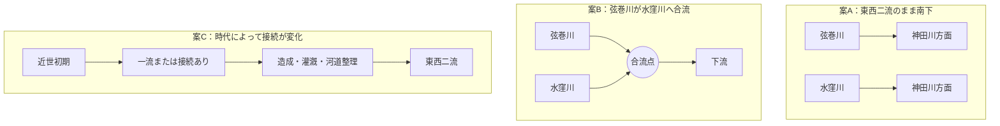

# 未解決問題：水窪川と弦巻川は合流していたのか

水窪川と弦巻川は、近代の実測図では音羽谷の東西を並ぶ二流として追うことができる。しかし、それ以前も常に二流だったのか、護国寺付近または音羽谷の途中で合流する時期があったのかは確定していない。

この問題は、単に「合流点を探す」だけでは済まない。**時代によって接続関係そのものが変化した可能性**があるためである。

主要出典は各節に直接示す。共通の書誌情報は [出典一覧](../出典一覧.md) を参照。

## 参照画像：幕末の音羽・雑司ヶ谷

  

> **比較用の参照図。** 尾張屋版 *Otowa ezu*。後述する1851年近吾堂板とは別系統の史料なので、この画像だけを合流・非合流の直接証拠には用いない。1857年改の尾張屋板は東京都立図書館でも公開されている。  
> 原資料：[東京都立図書館 TOKYOアーカイブ「嘉永新鐫雑司ケ谷音羽絵図」安政4年（1857）改](https://archive.library.metro.tokyo.lg.jp/da/detail?tilcod=0000000013-00042340) / [S17](../出典一覧.md)

## 問い

現在の中心的な問いは次の三つである。

1. 雑司ヶ谷から来た弦巻川は、護国寺南西端より下流で水窪川へ合流していた時期があるのか。
2. 合流していたなら、その地点と時期はどこまで絞れるか。
3. 音羽谷の東西二流は、自然河道の分岐なのか、近世の造成・灌漑・排水による再編なのか。

## 現在考えられる三つの型

案Cを考える一つの理由が、1941年の教育資料に現れる「一流→二流」説である。ただし、これは近世の工事記録ではない。

## 1941年資料：「一流を二流に分けた」説の出典

東京女子高等師範学校附属国民学校児童教育研究会 編『「郷土の観察」の指導体系』（1941年）には、音羽谷の川について、**もとは一流で、水田開発時に灌漑のため二流に分けられたのではないか**という趣旨の地理的推測がある。〔史料中の推測〕  
出典：『「郷土の観察」の指導体系』皇国青年教育協会、1941年、国民学校教育研究書 第3輯。[国立国会図書館デジタルコレクション PID 1275204](https://dl.ndl.go.jp/pid/1275204)、[NDLサーチ](https://ndlsearch.ndl.go.jp/books/R100000002-I000000645614) / [B03](../出典一覧.md)

この資料が示すのは、**1941年時点でそのような地理的説明が提示されていたこと**であり、近世に実際に行われた工事の年代・地点・施工主体を直接証明するものではない。

## 1682年・1687年：水窪川は見えるが弦巻川は不明瞭

護国寺創建翌年の天和2年（1682）『増補江戸大絵図 絵入』と、貞享4年（1687）『ゑ入江戸大繪圖』では、本調査の観察として水窪川とみられる水路を確認できる一方、弦巻川は確認できない。〔観察〕

- 1682年『増補江戸大絵図 絵入』：[国立国会図書館デジタルコレクション](https://dl.ndl.go.jp/pid/1286182) / [S15](../出典一覧.md)
- 1687年『ゑ入江戸大繪圖』：[国立国会図書館デジタルコレクション](https://dl.ndl.go.jp/pid/2542450) / [S14](../出典一覧.md)

これは「当時は水窪川一流だった」案と整合するようにも見える。しかし、両図は江戸全体を描く広域図であり、小河川が省略される可能性がある。**弦巻川が描かれていないことだけでは不存在を証明できない。**

## 1772年：雑司ヶ谷側の弦巻川を確認できる可能性

明和9年（1772）『武蔵国豊島郡雑司谷村絵図』が現存し、豊島区立郷土資料館編『豊島区地域地図 第5集（近世・村絵図I編）』に複製・読みおこし参考図が収録されていることは確認できる。〔史料所在確認〕

- 豊島区公式：[「豊島区地域地図集（複製）」](https://www.city.toshima.lg.jp/129/bunka/bunka/shiryokan/kankobutu/005951.html)
- 国立国会図書館：[『豊島区地域地図 第5集』書誌](https://ndlsearch.ndl.go.jp/books/R100000002-I000009123633)
- 東京都建設局も同絵図の読みおこし参考図を資料に使用：[雑司ケ谷霊園関連資料](https://www.kensetsu.metro.tokyo.lg.jp/documents/d/kensetsu/000050293)
- 出典整理：[S31](../出典一覧.md)・[S31a](../出典一覧.md)

地域史の二次資料では、この絵図をもとに弦巻川の流路が紹介されている。  
二次資料：[「雑司ヶ谷村用水」](https://ameblo.jp/kazuaruki/entry-12940940738.html) / [S32](../出典一覧.md)

ただし、高精細な原図・複製で**護国寺方向の末端を本調査として直接確認し切れていない**。したがって、現段階では「1772年絵図が存在すること」と「その川筋の細部をどう読むか」を分ける。

## 1851年：護国寺南西端を越えて水路が続く

近吾堂板『音羽目白雑司ケ谷辺絵図』（嘉永4年・1851）は、東京都立図書館 TOKYOアーカイブで公開されている。〔一次史料〕  
原資料：[東京都立図書館 TOKYOアーカイブ](https://archive.library.metro.tokyo.lg.jp/da/detail?tilcod=0000000013-00042337)、[CiNii Books](https://ci.nii.ac.jp/ncid/BA59680420) / [S16](../出典一覧.md)

本調査では、西側から来た弦巻川とみられる青線が護国寺南西端へ達し、道路との交差部を越えて寺域外へ短く続くように読み取っている。〔観察〕

この観察は、

> 弦巻川は護国寺境内で終わり、そこで水窪川へ合流していた

という単純な読みを弱める。

ただし、その短い線の先が

- 音羽谷西側をそのまま南下するのか
- 少し下流で東へ寄り水窪川へ合流するのか

までは、この切絵図だけでは決められない。

また、1857年改の尾張屋板では細い水路の表現が近吾堂板と異なる。版による描写差があるため、**地図に描かれないことと水路の不存在を同一視しない。**  
比較資料：[1857年『嘉永新鐫雑司ケ谷音羽絵図』](https://archive.library.metro.tokyo.lg.jp/da/detail?tilcod=0000000013-00042340) / [S17](../出典一覧.md)

## 1878年：『東京府村誌』の「西青柳町ニ通ス」

地域史調査による1878年『東京府村誌』雑司ヶ谷村条の転記では、弦巻川について**「丸池ヨリ出テ一条ノ流と為リ、本村ノ中央ヲ東流シ西青柳町ニ通ス」**とされる。〔二次転記による確認〕  
転記：[「雑司ヶ谷村用水」](https://ameblo.jp/kazuaruki/entry-12940940738.html) / [M1878](../出典一覧.md)

『皇国地誌稿本東京府誌』の復刻版は、東京都公文書館所蔵の「東京府村誌」全15冊を影印したものとされる。  
書誌：[CiNii Books「皇国地誌稿本東京府誌」](https://ci.nii.ac.jp/ncid/BB30888890)

西青柳町は現在の文京区音羽二丁目付近にあたる。原文確認が取れれば、少なくとも1878年には

という連続が当時の村誌で認識されていたことを示す強い史料になる。

その場合、**護国寺で直ちに水窪川へ合流した**という案はかなり弱くなる。ただし、「西青柳町へ通じる」ことと、「そこから神田川まで水窪川と一度も接続せず独立して流れた」ことは同義ではない。

> [!WARNING]
> 現時点では「西青柳町ニ通ス」は二次転記で確認している段階であり、**本リポジトリではまだ『東京府村誌』原画像の該当箇所を固定できていない。** 原文確認までは確定引用として扱わない。

## 明治期：東西二流が明瞭になる

明治期の実測図では、音羽谷の東側に水窪川、西側に弦巻川という二流を明瞭に追える。したがって、少なくとも近代には「東西二流のまま南下する」形が成立していた。

ただし、この節についても、今後は使用した実測図の**図名・測量年・図歴・公開元**を固定して掲載する。現段階では「明治期実測図」とだけ書いて決着材料にしない。

## 現時点の評価

| 仮説 | 現在の評価 | 主な根拠・留保 |
| --- | --- | --- |
| 近世を通じて東西二流だった | 可能性あり | 1851年近吾堂板以降と整合。ただし1682・1687年図では弦巻川を確認できない |
| 弦巻川は護国寺で水窪川へ合流していた | 単純な形では弱くなった | 1851年近吾堂板で護国寺南西端より先へ青線が続くという本調査の観察 |
| もう少し下流で合流していた時期がある | 未解決 | 1851年図の先を同時代史料で連続追跡できていない |
| 元は一流で、後に灌漑のため二流化した | 検討価値あり | 1941年資料 [B03](../出典一覧.md) に同趣旨の推測。ただし近世の工事記録ではない |
| 時代ごとに接続関係が変化した | 有力な検討枠組み | 造成・水田開発・河道整理を考えると固定的な二択では説明しきれない可能性 |

## 決着に必要な資料

1. **1772年『武蔵国豊島郡雑司谷村絵図』高精細画像**  
   弦巻川の護国寺方向の末端を直接確認する。
2. **1878年『東京府村誌』雑司ヶ谷村条の原画像**  
   「西青柳町ニ通ス」という二次転記を原文で確認する。
3. **『御府内備考』の西青柳町・音羽町・雑司ヶ谷関係巻**  
   川、下水、悪水、橋、用水の記述を連続して読む。
4. **1851年前後の別系統の切絵図・村絵図**  
   護国寺南西端から西青柳町・音羽町下流までを追う。
5. **明治初期の実測図・地籍図**  
   東西二流が確実に成立した最古年代を、図名・図歴まで含めて固定する。
6. **近世・明治初期の水田開発、用水、悪水路工事記録**  
   「一流を二流に分けた」という1941年説を工事記録から検証する。

## 重要な注意

この問題では、次の三つを混同しない。

- **地図に描かれているか**
- **実際に水路が存在したか**
- **その水路を当時「弦巻川」「水窪川」と認識していたか**

また、「ある時点で合流していた」ことが確認できても、それが全時代に当てはまるとは限らない。

このため、最終的には一つの合流点を探すよりも、**年代ごとの水路接続図を作ること**がこの問題の解決に近い。

## 関連文書

- [水窪川](../水窪川.md)
- [弦巻川](../弦巻川.md)
- [横断テーマ](../横断テーマ.md)
- [出典一覧](../出典一覧.md)
- [水窪川・弦巻川の追加史料](../2026-08-31・水窪川・弦巻川の追加史料.md)
- [分割前README全文](../分割前README全文.md) — 調査ログ・旧出典番号の保存版