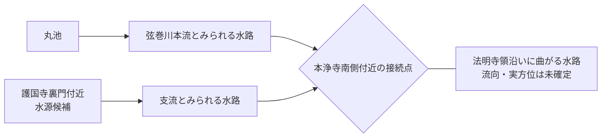

# 未解決問題：音羽谷西側の弦巻川下流はいつ成立したのか

音羽谷西側を南下する弦巻川下流が、**いつ・どのように成立したのか**は未解決である。

近代の実測図では、水窪川が音羽谷東側、弦巻川が西側を流れる二流が明瞭である。しかし、1682年・1687年の広域江戸図では水窪川側の流れが見える一方、西側の弦巻川下流は確認しにくい。したがって、近代の二流配置をそのまま近世初期まで遡らせない。

この問題は [水窪川と弦巻川の合流・接続問題](水窪川と弦巻川の合流・接続問題.md) と密接だが、同一ではない。合流の有無とは別に、**西側河道そのものの初出・成立過程**を追う。

## 現在の候補

1. **1681年前後の護国寺創建・音羽町造成時に成立した。**  
   本田創の後世の解説はこの方向だが、工事当時の一次史料は未確認。
2. **1696～1697年の護国寺門前・寺域再編時に成立した。**  
   この時期には護国寺門前の市井編入、護国寺修造、『護国寺日記』の開始などが集中する。
3. **その後の水田開発・灌漑再編で成立した。**  
   1941年『「郷土の観察」の指導体系』には、音羽谷の水流が水田開発時に一流から二流へ分けられたのではないか、という趣旨の推測がある。ただし近世の工事記録ではない。
4. **既存の小支谷・湧水路を段階的に接続・拡幅した。**  
   護国寺西側には星谷の井・小流路が存在した可能性があり、単純な「一本の川を人工的に二分した」モデルだけではない可能性がある。**1772年『雑司谷村絵図』で、護国寺裏門付近に独立した水源らしい終端を持つ支流が描かれ、本浄寺南側付近で本流と接続するように読めることは、この候補を新たに支持する材料になる。**

## 年代順の証拠

### 1681年：護国寺創建

護国寺創建は、周辺の町割り・排水・河道再編を考える出発点である。ただし、**1681年に西側河道が完成したことを直接示す工事記録は未確認**。

### 1682年・1687年：水窪川側は見えるが西側河道は不明瞭

- 1682年『増補江戸大絵図 絵入』：https://dl.ndl.go.jp/pid/1286182
- 1687年『ゑ入江戸大繪圖』：https://dl.ndl.go.jp/pid/2542450

本調査では水窪川とみられる水路を確認できる一方、音羽谷西側の弦巻川下流は確認できない。〔観察〕

ただし、両図は広域図なので、**不掲載を不存在の証明には使わない。**

### 1696～1697年：重点調査期

東京都公文書館『東京市史稿 市街篇 第12』の目次には、次の項目がある。

- 1696年：千川上水鑿通（市街12-1030）
- 1696年11月5日：護国寺門前市井編入（市街12-0767）
- 1697年1月12日：護持院護国寺修造（市街12-1131）
- 1697年8月27日：附記 護国寺門前（市街12-1143）
- 1697年7月：参考 護国寺前新茶屋（市街12-1151）

出典：東京都公文書館 [『東京市史稿 市街篇 第12』](https://www.soumu.metro.tokyo.lg.jp/01soumu-archives/06kanko_butsu/0601sisiko/0601shigai/0601shigai12)

特に1696年末～1697年は、門前と寺域の再編を具体的に追える可能性が高い。

#### 『護国寺日記』

『護国寺日記』は元禄10年（1697）から始まり、刊行された第1巻は1697～1700年を含む。

- 八木書店書誌：https://catalogue.books-yagi.co.jp/books/view/587
- CiNii Books：https://ci.nii.ac.jp/ncid/BB15371980

確認したい語は、川・溝・下水・用水・悪水・普請・掘・浚・橋・田畑・門前・音羽・青柳など。西側河道の工事名が直接出なくても、排水普請や橋普請から年代を絞れる可能性がある。

> [!NOTE]
> 千川上水開削と年代が重なることは興味深いが、**千川上水から弦巻川・水窪川への直接分水は未確認**であり、同一の出来事として扱わない。

### 1772年：本流・護国寺裏門側支流・橋を確認

明和9年（1772）『武蔵国豊島郡雑司谷村絵図』が現存する。

- 豊島区：https://www.city.toshima.lg.jp/129/bunka/bunka/shiryokan/kankobutu/005951.html
- NDLサーチ：https://ndlsearch.ndl.go.jp/books/R100000002-I000009123633
- **画像直接URL**：https://zoushigaya.up.seesaa.net/image/zousigayamura120E381AEE382B3E38394E383BC.jpg
- **画像掲載元URL**：https://zoushigaya.seesaa.net/article/189594335.html
- **別掲載資料**：https://toshima-iseki.org/img/zoushigaya-tenji201103.pdf

2026年9月、本調査でオンライン複製画像を直接確認した結果、少なくとも次の点を読み取った。〔本調査による画像観察〕

- **本浄寺の南側付近で、丸池方面から来る弦巻川本流とみられる水路と、護国寺裏門方向から来る水路が接続している。**
- 護国寺裏門方向の水路は、図郭で切れるのではなく、**絵図内部で上流端が丸く膨らんだ黒い終端として描かれる。**
- 同じ絵図の丸池も、水路上流端の大きく膨らんだ水面として類似した表現を持つ。このため、護国寺裏門付近の終端も**小池・湧水・水源となる溜まりを表した可能性が高い**。
- 支流が道路を横切る地点と、接続後の水路が道路を横切る地点に、それぞれ**梯子状の橋らしい記号**がある。丸池から出る弦巻川の道路横断部にも同種の表現があり、橋記号と読む根拠になる。
- 接続点の西側には**「法明寺領」**が広がる。
- 接続後の水路は法明寺領の縁を回るように大きく曲がり、図面上では西へ曲がるように見える。ただし、**村絵図の方位・縮尺と水流方向は別途検証が必要**で、この描写だけから真西への流下や流向を確定しない。

この絵図は雑司ヶ谷村を主対象とするため、**護国寺・音羽側へ出た後の全流路そのものは決められない**。一方、1772年までに「丸池系本流＋護国寺裏門側の別水源・支流」という複数水源型の水系が成立していた可能性は、従来より強くなった。

### 1829年：『御府内備考』

対象地域に対応する巻をかなり絞れる。

#### 護国寺領三ケ町

『御府内備考 五十（護国寺領三ケ町）』

- 成立：文政12年（1829）
- 請求記号：DG-214
- 対象：東青柳町、西青柳町、音羽町一～九丁目、桜木町など
- 東京都公文書館：https://www.archives.metro.tokyo.lg.jp/detail?cls=collection_01&pkey=000100955

#### 高田・雑司ケ谷

『御府内備考 五十一、五十二（高田、雑司ケ谷）』

- 成立：文政12年（1829）
- 請求記号：DG-215
- 東京都公文書館検索：https://www.archives.metro.tokyo.lg.jp/list?c10_l=1&c11_a=3&c11_l=1&c12_a=1&c12_l=1&c13_a=1&c13_l=1&c15_f_U=0&c15_t_U=0&c16_a=1&c17_f=1&c17_l=2&c3_a=3&c4_a=3&c4_l=1&c5_a=3&c6_a=3&c7_a=3&chkCls=collection_01&cls=top&order=0&pn=1&secIdx=0

重点語：弦巻川／鶴巻川、水久保／水窪、東青柳下水、鼠ヶ谷下水、用水、悪水、下水、溝、西青柳町、東青柳町、雑司ヶ谷、高田。

ここで西青柳町・音羽町と雑司ヶ谷を連続して読めれば、**弦巻川がどの水路へ接続すると認識されていたか**を文章史料から追える可能性がある。

### 『新編武蔵風土記稿』

国立公文書館デジタルアーカイブ：https://www.digital.archives.go.jp/file/1224755.html

二次資料では、雑司ヶ谷村の記事に丸池・弦巻川・用水に関する記述があると紹介される。原本で確認できれば、文政期の **丸池―弦巻川―雑司ヶ谷村内の農業用水** の関係を一次史料で押さえられる可能性がある。

探索用二次資料：https://ameblo.jp/kazuaruki/entry-12940940738.html

原画像確認前なので確定引用には使わない。

### 1851年・1857年：護国寺南西端

1851年近吾堂板では、本調査の観察として、弦巻川とみられる青い水路が護国寺南西端を越えて寺域外へ短く続く。

- 1851年：https://archive.library.metro.tokyo.lg.jp/da/detail?tilcod=0000000013-00042337
- 1857年：https://archive.library.metro.tokyo.lg.jp/da/detail?tilcod=0000000013-00042340

この時点で「護国寺内で完全に終わる」説は弱いが、**西側をそのまま南下するのか、水窪川へ合流するのかは未決着**。

### 1878年：西青柳町へ通じるとの二次転記

『東京府村誌』雑司ヶ谷村条の二次転記では、弦巻川が「西青柳町ニ通ス」とされる。

- 二次転記：https://ameblo.jp/kazuaruki/entry-12940940738.html
- 『皇国地誌稿本東京府誌』書誌：https://ci.nii.ac.jp/ncid/BB30888890

原文確認できれば、**1878年までには雑司ヶ谷から西青柳町へ弦巻川が連続していた**ことを示す重要史料になる。ただし、西青柳町から神田川までの全区間を同じ線形で保証するものではない。

### 1880年代以後：東西二流が明瞭

近代の実測図では、音羽谷の東西二流を追える。したがって、成立年代の下限側はここまでには確実に来る。

### 1941年：一流→二流説

東京女子高等師範学校附属国民学校児童教育研究会 編『「郷土の観察」の指導体系』には、音羽谷の川について、水田開発時に灌漑のため二流に分けられたのではないかという趣旨の推測がある。

- 国立国会図書館：https://dl.ndl.go.jp/pid/1275204

これは工事当時の記録ではなく、後世の地理的推論として扱う。

## 前後比較に使いたい沿革図

『御府内往還其外沿革図書』『御府内場末往還其外沿革図書』は、道路・橋梁・河梁・土地の変遷を地域ごとに追う史料群である。

- NDL書誌：https://ndlsearch.ndl.go.jp/books/R100000002-I000007293417
- 東京都公文書館解説：https://www.soumu.metro.tokyo.lg.jp/01soumu-archives/07edo_tokyo/0703kaidoku/0703kaidoku_22/0703kaidoku_22_2
- 東京都立図書館案内：https://www.library.metro.tokyo.lg.jp/search/research_guide/tokyo/index/map/

雑司ヶ谷側については、**『御府内場末往還其外沿革図書 貮拾利』に「雑司ヶ谷村御鷹方御役屋鋪松浦金三郎屋鋪本立寺辺之部」が含まれる**ことまで特定できた。  
確認用：国立国会図書館デジタルコレクション [PID 2587246](https://dl.ndl.go.jp/pid/2587246)、大判図系の別スキャン [PID 9370096](https://dl.ndl.go.jp/pid/9370096)。後者は7ページで、無料のインターネット公開である。

この「本立寺辺之部」が1772年図の本浄寺南側接続点そのものを含むか、また護国寺・音羽まで届くかは**まだ照合前**である。まず道路・寺院・屋敷・水路・橋を1772年図と重ねて、同一地点を固定する。

復刻版の一部には1695・1698・1699年を内容年とする図があることも確認できるため、同一地点について複数年代の図があれば、1696～1697年の門前再編に伴う水路変化を直接比較できる可能性がある。

## 決着に必要な資料

1. **1772年図の橋を後世の橋名・道路と対応させ、本浄寺南側の接続点を現在座標へ比定する。**
2. **護国寺裏門付近の丸い上流端について、読みおこし参考図・他の水路端・後世地図と比較し、水源・池・湧水のどれに相当するかを詰める。**
3. 『御府内場末往還其外沿革図書 貮拾利』（PID 2587246 / 9370096）を1772年図と照合し、本立寺辺・雑司ヶ谷側の道路、水路、橋の年代差を見る。
4. 『御府内備考』DG-214・DG-215の該当箇所を原画像で通読する。
5. 『護国寺日記』1697～1700年で排水・橋・水路・田畑普請を確認する。
6. 『東京市史稿 市街篇 第12』の1696～1697年護国寺関係項目の本文・原典を追う。
7. 『新編武蔵風土記稿』雑司ヶ谷村・巣鴨村の記事を原画像で確認する。
8. 1878年『東京府村誌』雑司ヶ谷村条の原画像を固定する。
9. 明治初期の実測図・地籍図で、東西二流が確実に成立した最古年代を固定する。

## 現時点の評価

**西側弦巻川下流の成立年はまだ決められない。**

ただし、1772年図の直接確認によって、少なくとも「丸池から来る一本の弦巻川が、そのまま後世の西側下流へ続いた」とだけ考えるのは不十分になった。護国寺裏門側に別の水源・支流らしい描写があり、それが本流と接続しているため、**複数の湧水・小水路を近世のどこかで接続・再編したモデル**の重要度が上がった。

今後のキーは、**年代ごとの地図、橋の対応関係、1772年図の支流接続点の位置比定**である。これらを固定できれば、「西側河道がいつ成立したか」と「どの既存水路を利用したか」を同時に絞り込める。