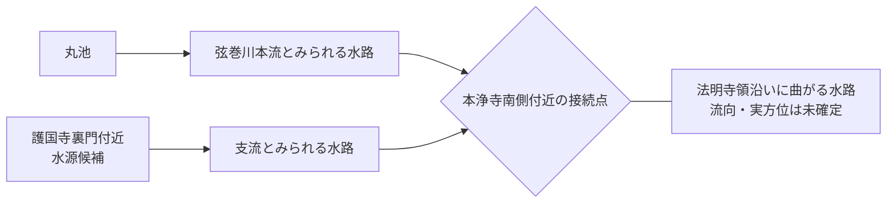

# 弦巻川

弦巻川について、現在までに確認できた主要事項をまとめる。主要出典は各記述の直後に示し、一覧は [出典一覧](出典一覧.md) にまとめる。

## 名称と水源

『失われた川を歩く 東京「暗渠」散歩 改訂版』では、弦巻川上流部は「布引川」とも呼ばれたとされる。〔書籍資料〕  
出典：本田創編著『失われた川を歩く 東京「暗渠」散歩 改訂版』実業之日本社、2021年。[出版社書誌](https://www.j-n.co.jp/books/978-4-408-33965-8/) / [B01](出典一覧.md)

豊島区公式「元池袋史跡公園」は、西池袋にあった丸池について、**「弦巻川の源流として清らかな水が湧き出していました」**と明記している。また、丸池は「池袋」の地名由来とも関係づけられている。〔確認〕  
出典：豊島区公式 [「元池袋史跡公園」](https://www.city.toshima.lg.jp/340/shisetsu/koen/030.html) / [S26](出典一覧.md)

  

元池袋史跡公園（2010年撮影）。現在の公園そのものを丸池の現存遺構とみなすのではなく、丸池の記憶を継承する史跡公園として掲載する。

雑司ヶ谷霊園西側から本流へ注ぐ支谷や、現在に残る水路敷については、Natrium.jp の現地調査が地図・公図境界・現地写真を比較している。これは一次史料ではなく、現地観察の補助資料として扱う。  
参考：Natrium.jp [「神田川周辺の水路敷群（弦巻川）」](https://natrium.jp/canal_lot/kanda/tsurumaki/index.html) / [S05-T](出典一覧.md)

## 1772年の雑司谷村絵図

明和9年（1772）の『武蔵国豊島郡雑司谷村絵図』が現存し、豊島区立郷土資料館編『豊島区地域地図 第5集（近世・村絵図I編）』に複製・読みおこし参考図が収録されていることは、公的な刊行物案内と国立国会図書館書誌から確認できる。〔史料所在確認〕  
出典：豊島区公式 [「豊島区地域地図集（複製）」](https://www.city.toshima.lg.jp/129/bunka/bunka/shiryokan/kankobutu/005951.html)、[NDLサーチ](https://ndlsearch.ndl.go.jp/books/R100000002-I000009123633) / [S31](出典一覧.md)

東京都建設局の雑司ケ谷霊園関連資料でも、図表の出典として豊島区立郷土資料館「柳下家文書、武蔵国豊島郡雑司谷村（読みおこし参考図）」（1772年）が用いられている。  
出典：東京都建設局 [雑司ケ谷霊園関連資料](https://www.kensetsu.metro.tokyo.lg.jp/documents/d/kensetsu/000050293) / [S31a](出典一覧.md)

オンラインで確認できる柳下家図の複製画像もあり、2026年9月に本調査で画像を直接比較した。  
- **画像直接URL**：https://zoushigaya.up.seesaa.net/image/zousigayamura120E381AEE382B3E38394E383BC.jpg
- **画像掲載元URL**：[雑司が谷 日乗「古地図を片手に、雑司が谷の坂道を歩こう」](https://zoushigaya.seesaa.net/article/189594335.html)
- **別掲載資料**：[としま遺跡調査会「雑司が谷まちかど遺跡ミュージアム」PDF](https://toshima-iseki.org/img/zoushigaya-tenji201103.pdf)

### 本浄寺南側の接続点

絵図上では、**本浄寺の南側付近で、丸池方面から来る弦巻川本流とみられる水路に、護国寺裏門方向から来る別の水路が接続している**ように読める。〔本調査による画像観察〕

また、接続点の西側には「法明寺領」の表示が広がり、接続後の水路はその縁を回り込むように大きく曲がって描かれている。図面上では西向きに曲がるように見えるが、村絵図は実測図ではなく方位・縮尺の歪みもあるため、**実際の流向・真方位をこの描写だけから固定しない**。

### 護国寺裏門付近の上流端は水源表現の可能性

護国寺裏門方向の水路は、図郭・村境で機械的に切れるのではなく、**絵図内部で黒い水路の先端が丸く膨らんだ形で終わる**。同じ絵図の丸池も、弦巻川流出部につながる黒い水面が大きく膨らむ類似表現で描かれている。〔本調査による絵図内比較〕

このため、護国寺裏門付近の終端は、単なる描画上の省略よりも、**小池・湧水・水源となる溜まりを表した可能性が高い**とみる。ただし、「丸い終端＝必ず湧水」という凡例が明記されているわけではないため、他の水路端の表現や読みおこし参考図との比較を続ける。

この読みが正しければ、1772年時点の弦巻川系は、単純な「丸池から来る一本の川」ではなく、**丸池系の本流と護国寺裏門付近の独立した水源・支流が本浄寺南側付近で接続する水系**だった可能性がある。これは、後世の音羽谷西側河道が既存の小支谷・湧水路を接続・再編して成立したという仮説と整合的である。

### 橋状の描写

護国寺裏門側の支流が道路と交差する地点と、接続後の水路が別の道路と交差する地点には、それぞれ**梯子状の短線**が描かれており、橋と読むのが自然である。さらに丸池から出る弦巻川が道路を横切る地点にも同様の梯子状表現があるため、絵図内比較から「橋の記号」である可能性が高い。〔本調査による画像観察〕

ただし、色合いだけから木橋と断定することはしない。今後、橋名史料に出る卒塔婆橋・鎌倉橋・木村橋・南坂橋・弦巻橋・松屋橋・境橋などと、**1772年図の橋の位置を対応させることが位置比定の重要課題**となる。

1772年図から現在かなり具体的に追えるのは雑司ヶ谷村内の水系までであり、護国寺・音羽側へ出た後の全流路は図の範囲外となる。したがって、この絵図だけで音羽谷西側下流の全線や神田川までの接続を確定しない。

## 1851年の護国寺南西端

近吾堂板『音羽目白雑司ケ谷辺絵図』（嘉永4年・1851）は、東京都立図書館 TOKYOアーカイブで高精細画像を確認できる。〔一次史料〕  
原資料：[東京都立図書館 TOKYOアーカイブ](https://archive.library.metro.tokyo.lg.jp/da/detail?tilcod=0000000013-00042337)、[CiNii Books](https://ci.nii.ac.jp/ncid/BA59680420) / [S16](出典一覧.md)

本調査では、西側から来た青い水路が護国寺南西端へ達し、道路との交差部を越えて寺域外へ短く続くように読み取っている。これは**地図画像からの観察**であり、東京都立図書館の書誌解説そのものが合流関係を説明しているわけではない。

したがって、「幕末まで弦巻川は護国寺境内で完全に終わっていた」とする単純な案は弱い。ただし、この短い水路がそのまま音羽町西側を神田川まで連続していたのか、途中で水窪川へ接続したのかは、この切絵図だけでは決められない。

比較対象として、尾張屋板『嘉永新鐫雑司ケ谷音羽絵図』安政4年（1857）改も東京都立図書館で公開されている。版によって細い水路の描写に差があるため、**「描かれていない＝不存在」と単純化しない**。  
原資料：[1857年尾張屋板](https://archive.library.metro.tokyo.lg.jp/da/detail?tilcod=0000000013-00042340) / [S17](出典一覧.md)

この区間の比較は、[未解決問題：水窪川と弦巻川は合流していたのか](open-questions/水窪川と弦巻川の合流・接続問題.md) にまとめている。

### 橋梁資料の史料同定は未完了

弦巻川の橋として卒塔婆橋・鎌倉橋・木村橋・南坂橋・弦巻橋・松屋橋・境橋などが紹介される資料があるが、現時点では、これを**「嘉永6年（1853）の特定史料」として正式名称・成立年まで固定できていない**。

豊島区の2000年講演会プレス資料は、江戸時代の地誌・橋名等を参照した講演が行われたことを示すが、原史料名までは確定できない。候補として旧幕府引継書『町方書上（145） 高田・雑司ヶ谷町方書上 全』があるものの、同一史料とは未確認である。  
豊島区資料：https://adeac.jp/toshima-history/viewer/mp408233/pressH120213/  
候補資料：https://dl.ndl.go.jp/pid/2571626

したがって「1853年にはこれらの橋が存在した」と年まで固定するのは、原史料の同定後とする。

## 暗渠化と流路変更

弦巻川が1932年に暗渠化され、その際に一部区間で流路の付け替えが行われたことについては、Natrium.jp が旧版地図・公図境界・現地水路敷を比較して整理している。〔二次資料／現地調査〕  
参考：Natrium.jp [「神田川周辺の水路敷群（弦巻川）」](https://natrium.jp/canal_lot/kanda/tsurumaki/index.html) / [S05-T](出典一覧.md)

暗渠化直前を追う資料として、豊島区資料は、高田町が1929年に下水道調査費を計上し、1930年に実地調査・設計を終えて東京府へ申請したこと、郷土資料館に**「高田町下水道設計平面図」**が所蔵されることを紹介している。〔史料所在確認〕  
出典：豊島区資料 [PDF](https://adeac.jp/viewitem/toshima-history/viewer/viewer/pressH261016_2/data/pressH261016_2.pdf)

この図は1932年の暗渠化直前に、既存河川・計画下水道・道路・町界がどう認識されていたかを調べる重要資料である。ただし、**図中の赤線・青線の意味は凡例を確認するまで断定しない。**

2026年6月8日の文春オンライン記事では、豊島区立郷土資料館の横山恵美学芸員が弦巻川暗渠化について、**下水道は「なるべく短い距離」を通すよう施工されたため、現在の下水道の通りに暗渠化前の川が流れていたわけではない**と説明している。さらに、暗渠上を道路として整備したことも述べる。〔専門家への報道取材／既存仮説を強める根拠〕  
これは、旧版地図・公図・現地水路敷の比較から推定されていた**旧河道と雑司ヶ谷幹線・弦巻通りの不一致が、1931～32年の下水道事業で意図的に生じた区間を含む**ことを独立に補強する。ただし、記事だけでは付替え区間の起終点・短縮量・個別工区を確定できないため、「全線を直線化した」「現在の幹線は全区間で旧河道と異なる」とはしない。高田町下水道設計平面図・工事台帳・竣工図で地点別に照合する。〔観察／注意／要原図照合〕  
出典：葉上太郎「[かつて池袋には“大洪水を招く川”が流れていた…戦前に封印された『弦巻川』が“再び猛威をふるう”衝撃の未来とは](https://bunshun.jp/articles/-/88508?page=2)」文春オンライン（2026年6月8日、豊島区立郷土資料館・横山恵美学芸員への取材）

このため、現在の弦巻通りや下水道幹線を、そのまま暗渠化前の自然河道とみなさない。暗渠化年・付け替え工事の詳細は、当時の下水道設計図や行政資料で一次史料確認を進める。

## 湧水・生活利用の痕跡

豊島区広報課の2000年10月7日付資料は、豊島区立郷土資料館の地域史講座「失われた水辺を探る―豊島区の湧き水をたずねて―」のフィールドワークについて、高田から雑司が谷・南池袋へ進み、**「暗渠化された弦巻川の川筋に沿って、屋敷庭園の池や崖下の湧水、大根洗い場などの跡を辿った」**と記録している。〔公的資料に記録された地域史フィールドワーク〕  
出典：豊島区広報課「[豊島区の湧き水をたずねて　地域史講座でフィールドワーク](https://adeac.jp/viewitem/toshima-history/viewer/viewer/pressH121007/data/pressH121007.pdf)」（2000年10月7日） / 豊島区立郷土資料館『[かたりべ』60号](https://www.city.toshima.lg.jp/documents/2548/kataribe60.pdf)（2000年11月30日、「地域史講座『失われた水辺を探る―豊島区の湧き水をたずねて―』を終えて」掲載）

これは、弦巻川低地の水利用・景観を、村落灌漑だけでなく、**台地崖下の湧水、屋敷庭園の池、農産物を洗う場という複数の生活・生産利用**から検討できる手掛かりになる。一方、この広報資料は各池・湧水・大根洗い場の住所、利用年代、弦巻川本流との水理的な接続を示していない。2000年時点に踏査された「跡」を暗渠化前の施設位置として無補正に確定せず、講座原資料、横山恵美「豊島区の湧き水をたずねて」、旧地籍・火災保険特殊地図等で地点を特定する。〔観察／要地点特定・原調査資料照合〕

## 関連する未解決問題

**護国寺南西端より下流で水窪川へ合流した時期があるのか、それとも音羽谷西側を独立して南下していたのか**は、この川の成立史を考える中心課題である。

→ [未解決問題：水窪川と弦巻川は合流していたのか](open-questions/水窪川と弦巻川の合流・接続問題.md)  
→ [未解決問題：音羽谷西側の弦巻川下流はいつ成立したのか](open-questions/音羽谷西側の弦巻川下流の成立年代.md)

## 未解決

- 音羽通り西側の下流河道は1681年前後の造成時に成立したのか、それとも1696～1697年の門前・寺域再編、さらに後の水田開発・灌漑再編で成立したのか。
- **1772年絵図の本浄寺南側付近の接続点を、後世の地図上のどこへ比定できるか。**
- **1772年絵図の護国寺裏門付近の上流端が、実際の湧水・池・水源施設のどれに相当するか。**
- **1772年絵図に描かれた橋を、後世の橋名（卒塔婆橋・鎌倉橋・木村橋・南坂橋・弦巻橋・松屋橋・境橋など）と対応させられるか。**
- 1851年切絵図の護国寺南西端より下流を、同時期の別史料で連続して確認できるか。
- 橋梁資料の原史料名・成立年・各橋位置を確定できるか。
- 自然河道・近世の整備河道・1932年の暗渠管・戦後の下水道幹線を年代別に分離して地図化できるか。

## 主な出典

- [出典一覧](出典一覧.md)
- [分割前README全文](分割前README全文.md) — 調査経緯・旧出典番号の保存版。本文の出典代わりにはしない。