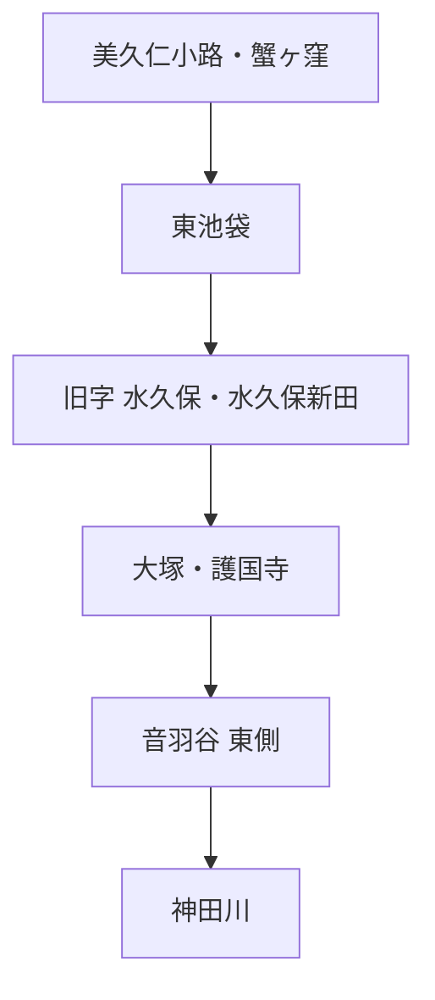

# 水窪川

水窪川について、現在までに確認できた主要事項をまとめる。主要出典は各記述の直後に示し、一覧は [出典一覧](出典一覧.md) にまとめる。

## 名称

豊島区の1999年10月9日付プレス資料は、旧・東池袋4丁目付近の字名「水久保」にちなみ、「水窪川」「水久保川」「日の出川」と呼ばれたこと、近世地誌『御府内備考』に「鼠ヶ谷下水」の記載があること、川幅一間ほどの小流だったことを記している。〔確認〕  
出典：豊島区広報課「水窪川をたどって」関連プレス資料（1999年10月9日） [PDF](https://adeac.jp/viewitem/toshima-history/viewer/viewer/pressH111009/data/pressH111009.pdf) / [S03](出典一覧.md)

『失われた川を歩く 東京「暗渠」散歩 改訂版』では、上流部を「日の出川」、下流側を「音羽川」とする呼称や、江戸期の「東青柳下水」も紹介されている。〔書籍資料〕  
出典：本田創編著『失われた川を歩く 東京「暗渠」散歩 改訂版』実業之日本社、2021年、ISBN 978-4-408-33965-8。[出版社書誌](https://www.j-n.co.jp/books/978-4-408-33965-8/) / [B01](出典一覧.md)

## 源頭と字名「水久保」

水窪川の上流端は、現在の池袋東口・美久仁小路付近、旧「蟹ヶ窪」の浅い窪地とされる。一方、川名の由来となった旧字「水久保」は現在の東池袋4丁目付近で、源頭そのものとは少し離れている。〔二次資料・現地観察〕  
参考：本田創「池袋に残る“消えた川”を追ってみると…神田川へ向かう『水窪川』の暗渠には何がある？」[文春オンライン](https://bunshun.jp/articles/-/50033)、Natrium.jp [「神田川周辺の水路敷群（水窪川）」](https://natrium.jp/canal_lot/kanda/mizukubo/index.html)。

## 護国寺・豊島岡側の湧水

本田創の現地解説では、護国寺東側の豊島岡墓地にあった蛇池や護国寺境内の湧水池、小日向台崖下の湧水が、水窪川側の水系を考える手掛かりとして紹介されている。〔二次資料〕  
出典：本田創、前掲記事 [文春オンライン](https://bunshun.jp/articles/-/50033) / [S02](出典一覧.md)

このため、水窪川の東側流路は、単純な人工排水路ではなく、崖下湧水を集める自然な水系を基礎に、近世の造成・排水で位置を固定された可能性がある。これは現時点では〔推定〕であり、近世の工事記録そのものから確認したものではない。

## 1682年・1687年の江戸図

  

天和2年（1682）『増補江戸大絵図 絵入』。国立国会図書館所蔵資料のスキャン（Wikimedia Commons、パブリックドメイン）。

護国寺創建翌年の天和2年（1682）『増補江戸大絵図 絵入』と、貞享4年（1687）『ゑ入江戸大繪圖』では、護国寺周辺に水窪川とみられる水路を確認できる一方、弦巻川は確認できない。〔観察〕  
原資料：1682年図 [国立国会図書館デジタルコレクション](https://dl.ndl.go.jp/pid/1286182) / [S15](出典一覧.md)、1687年図 [国立国会図書館デジタルコレクション](https://dl.ndl.go.jp/pid/2542450) / [S14](出典一覧.md)

ただし、いずれも江戸全体を描く広域図であり、小河川の省略があり得る。このため、**「弦巻川が描かれていない＝当時存在しなかった」ことの証明には使わない。**

## 暗渠化と川の記憶

豊島区の1999年資料は、水窪川が「昭和初期から戦後にかけて下水化」されたとする。したがって、現時点では全区間が同一年に一斉暗渠化されたとは扱わない。〔確認〕  
出典：[豊島区広報課 1999年10月9日付プレス資料](https://adeac.jp/viewitem/toshima-history/viewer/viewer/pressH111009/data/pressH111009.pdf) / [S03](出典一覧.md)

また、豊島区のオーラルヒストリー「わが街ひすとりぃ 日出」現地ロケ編では、旧流路付近の辻広場に「水窪川　小さな川が流れていた　後世に伝える」と書かれた案内板があり、表示年が1986年であることを現地で確認している。辻広場の整備時期については住民の記憶に基づく証言なので、行政資料による再確認が必要である。〔確認／オーラルヒストリー〕  
出典：豊島区「としまひすとりぃ」[「わが街ひすとりぃ 日出」現地ロケ編](https://adeac.jp/toshima-history/texthtml/d000000/mp00500101/ht420120) / [S33](出典一覧.md)

## 関連する未解決問題

**弦巻川が護国寺付近または音羽谷の途中で水窪川へ合流していた時期があるのか**は、この川だけでは解けない中心課題である。

→ [未解決問題：水窪川と弦巻川は合流していたのか](open-questions/水窪川と弦巻川の合流・接続問題.md)

## 未解決

- 護国寺より上流で、自然河道と人工的に整理された水路をどこまで区別できるか。
- 音羽谷東端へ流路が固定された正確な時期と工事過程。
- 更新世の旧河道が谷端川側へつながっていた場合の流向。
- 近代の暗渠化工事を区間ごとに年代確定できるか。

## 主な出典

- [出典一覧](出典一覧.md)
- [分割前README全文](分割前README全文.md) — 調査経緯・旧出典番号の保存版。本文の出典代わりにはせず、調査ログとして参照する。
