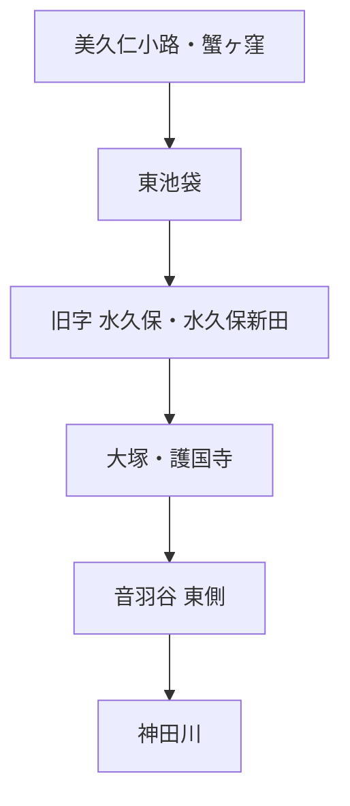

# 水窪川

## 2022年景観計画の三河川比較図（2026年10月31日追記）

豊島区『**豊島区景観計画**』（**2022年6月改定**）の「池袋西地域」印刷**p.78・図表5-49**は、国土地理院の数値標高モデルに基づく等高線図に**水窪川・弦巻川・谷端川**の名称を併記する。印刷**p.81**の「明治42（1909）年の市街地の様子」は、三河川のほか**千川上水本流・長崎分水**を表示し、河川・水田・畑／雑木林・集落・街道・鉄道を区別する。〔**確認：原PDFの図題・凡例・文字**〕 **1909年図は2011年の『豊島区地域地図第四集』などに基づく後年の編集図**で、原測量図ではない。地形・土地利用の比較資料にはなるが、旧河道の正確な中心線、三河川の合流、千川上水との直接接続を証明しない。〔**観察・留保／未解決：図形の精密判読・旧地籍との位置合わせ**〕 出典：[GOV-024](sources/gov/GOV-024.md)／[豊島区公開PDF](https://www.city.toshima.lg.jp/documents/22568/kaitei_keikankeikaku_5-06.pdf)。

水窪川について、現在までに確認できた主要事項をまとめる。主要出典は各記述の直後に示し、一覧は [出典一覧](出典一覧.md) にまとめる。

## 名称

豊島区の1999年10月9日付プレス資料は、旧・東池袋4丁目付近の字名「水久保」にちなみ、「水窪川」「水久保川」「日の出川」と呼ばれたこと、近世地誌『御府内備考』に「鼠ヶ谷下水」の記載があること、川幅一間ほどの小流だったことを記している。〔確認〕  
出典：豊島区広報課「水窪川をたどって」関連プレス資料（1999年10月9日） [PDF](https://adeac.jp/viewitem/toshima-history/viewer/viewer/pressH111009/data/pressH111009.pdf) / [GOV-001](sources/gov/GOV-001.md)(出典一覧.md)

『失われた川を歩く 東京「暗渠」散歩 改訂版』では、上流部を「日の出川」、下流側を「音羽川」とする呼称や、江戸期の「東青柳下水」も紹介されている。〔書籍資料〕  
出典：本田創編著『失われた川を歩く 東京「暗渠」散歩 改訂版』実業之日本社、2021年、ISBN 978-4-408-33965-8。[出版社書誌](https://www.j-n.co.jp/books/978-4-408-33965-8/) / [BOOK-001](sources/books/BOOK-001.md)(出典一覧.md)

## 源頭と字名「水久保」

水窪川の上流端は、現在の池袋東口・美久仁小路付近、旧「蟹ヶ窪」の浅い窪地とされる。一方、川名の由来となった旧字「水久保」は現在の東池袋4丁目付近で、源頭そのものとは少し離れている。〔二次資料・現地観察〕  
参考：本田創「池袋に残る“消えた川”を追ってみると…神田川へ向かう『水窪川』の暗渠には何がある？」[文春オンライン](https://bunshun.jp/articles/-/50033)、Natrium.jp [「神田川周辺の水路敷群（水窪川）」](https://natrium.jp/canal_lot/kanda/mizukubo/index.html)。

```mermaid
flowchart TD
    A[美久仁小路・蟹ヶ窪] --> B[東池袋]
    B --> C[旧字 水久保・水久保新田]
    C --> D[大塚・護国寺]
    D --> E[音羽谷 東側]
    E --> F[神田川]
```

ただし、**「水久保」を後世の東池袋4丁目付近だけに固定してよいかは未確定**である。国立公文書館で公開される『新編武蔵風土記稿』をもとにした二次的な小字索引では、文政期の巣鴨側・雑司ヶ谷村側の双方に「水久保」があったように整理されている。〔探索用二次資料〕  
原資料候補：[国立公文書館デジタルアーカイブ『新編武蔵風土記稿』](https://www.digital.archives.go.jp/file/1224755.html)  
探索用索引：[北豊島郡の小字](https://spidersweb-map.github.io/koaza-map/pages/%E5%8C%97%E8%B1%8A%E5%B3%B6%E9%83%A1.html)

したがって、現時点では「美久仁小路付近の源頭」と「水久保という地名の分布範囲」を別問題として扱い、地租改正期の地引絵図・字界図まで戻って確認する。

## 護国寺・豊島岡側の湧水

本田創の現地解説では、護国寺東側の豊島岡墓地にあった蛇池や護国寺境内の湧水池、小日向台崖下の湧水が、水窪川側の水系を考える手掛かりとして紹介されている。〔二次資料〕  
出典：本田創、前掲記事 [文春オンライン](https://bunshun.jp/articles/-/50033) / [BOOK-005](sources/books/BOOK-005.md)(出典一覧.md)

このため、水窪川の東側流路は、単純な人工排水路ではなく、崖下湧水を集める自然な水系を基礎に、近世の造成・排水で位置を固定された可能性がある。これは現時点では〔推定〕であり、近世の工事記録そのものから確認したものではない。

## 1682年・1687年の江戸図

  

天和2年（1682）『増補江戸大絵図 絵入』。国立国会図書館所蔵資料のスキャン（Wikimedia Commons、パブリックドメイン）。

護国寺創建翌年の天和2年（1682）『増補江戸大絵図 絵入』と、貞享4年（1687）『ゑ入江戸大繪圖』では、護国寺周辺に水窪川とみられる水路を確認できる一方、弦巻川は確認できない。〔観察〕  
原資料：1682年図 [国立国会図書館デジタルコレクション](https://dl.ndl.go.jp/pid/1286182) / [MAP-001](sources/maps/MAP-001.md)(出典一覧.md)、1687年図 [国立国会図書館デジタルコレクション](https://dl.ndl.go.jp/pid/2542450) / [MAP-002](sources/maps/MAP-002.md)(出典一覧.md)

ただし、いずれも江戸全体を描く広域図であり、小河川の省略があり得る。このため、**「弦巻川が描かれていない＝当時存在しなかった」ことの証明には使わない。**

## 写真史料候補：1910年頃の久世山絵葉書

「東京新名所　久世山ヨリ早稲田ヲ望ム / THE WASEDA FROM KUSEYAMA」という絵葉書で、明治43年（1910）と読める消印を持つ個体が確認されている。前景の久世山崖下には、水窪川の開渠または河道沿い低地とみられる細長い筋が写る可能性がある。〔保留〕

明治期地図上の水窪川の位置とは整合するが、写真解像度から水面そのものを断定できない。また、**現時点では当該個体の恒久的な公開URL・所蔵情報を固定できていない**。そのため、論証用の確定史料ではなく「所在再確認が必要な写真史料候補」として残す。

## 1912年地籍図：陸軍兵器支廠西側の崖と水路（538コマ）

東京市区調査会『東京市及接続郡部地籍地図』上巻の**538コマ（大塚町）**では、旧陸軍兵器支廠（現在の筑波大学附属高等学校付近）の**西側の崖と、それに沿った水窪川とみられる流路**が読み取れる一方、**水路に着色がない**との観察が寄せられた。〔利用者による原図直接観察／流路比定の確定には別年代地図との照合が必要〕

1912年地籍図では「水路らしい着色＝必ず川」でも「無着色＝川がない」でもない点を示す比較事例である。崖との位置関係や筆界、水路線形、隣接コマとの連続性を調べる。[原図538コマ](https://dl.ndl.go.jp/pid/966079/1/538)／[小石川区のコマ別判読](谷端川.md#1912年東京市及接続郡部地籍地図での確認)。

## 1912年地籍図539コマ：新大塚～護国寺東の着色ずれと分岐候補

『東京市及接続郡部地籍地図』上巻**539コマ（大塚上町・大塚辻町付近）**について、**35.723884, 139.730850 付近**を含む新大塚駅〜護国寺東側の水窪川とみられる描写が確認されたとの報告がある。〔利用者による原図直接観察〕

- **着色ずれ**：水路を示すように見える色が、描線・区画の位置とずれている箇所がある。彩色／印刷／デジタル複製のどの段階で生じたかは未確定で、色だけを旧河道復元の根拠にしない。
- **護国寺東側の二股**：水路が二つに分かれるような描写がある。実際の分流・排水施設・側溝・橋周辺の図式なのか、誤記／位置ずれなのかは未判定。**護国寺創建時前後の水窪川・弦巻川の流路検討に関わりうるため、誤図と決めつけず検証対象として残す。**
- **比較**：538コマでは崖沿いの水窪川とみられる線に着色がないという別の不整合候補がある。540・541コマの前後関係、1911年5千分1図、より古い実測図、地籍図の土地境界・用水路記号を比較する。

原資料：[539コマ](https://dl.ndl.go.jp/pid/966079/1/539)／[谷端川ページ内のコマ別読図記録](谷端川.md)。

## 1912年地籍図540コマ：護国寺東側の着色位置と北側流路候補

『東京市及接続郡部地籍地図』上巻**540コマ（護国寺境内全体を収録）**で、**35.722450, 139.730027 付近**の水窪川とみられる二股状の描写を見たところ、**南側に水路色が塗られている一方、実際の流路は北側の線ではないか**との利用者による原図観察・推定が出された。539コマでも水路の着色と描線にずれが見られるという連続した問題である。〔利用者による原図直接観察／流路推定は未検証〕

南側の着色が彩色・印刷時の位置ずれなのか、実際に二流が存在したのか、描線が水路以外の筆界を表すのかは未判定。**北側を実流路と確定せず「優先して検証すべき候補」とする**。西側の弦巻川についても同じコマで着色位置の不整合が報告されており、1912年の水路復元に**着色面をそのまま採用してはならない**。今後は539・540・541コマを連続して位置合わせし、他年代の地形図・地籍・護国寺境内図と照合する。原資料：[地籍図540コマ](https://dl.ndl.go.jp/pid/966079/1/540)／[弦巻川側の記録](弦巻川.md)。

## 1912年地籍図541コマ：道路横断部の着色と西側の見かけ上の分岐

東京市区調査会『東京市及接続郡部地籍地図』上巻の**541コマ（大塚坂下町北部）**で、**35.725805, 139.727532 付近**の水窪川とみられる流路が道路を横切る箇所を確認した。利用者が撮影した原図表示では、灰色の幅広い着色が道路横断部付近で不規則に続き、道路の**西側で二股の水路のように見える**。利用者は**実際の河道は道路東側の描線沿いではないか**と推定している。〔利用者による原図画像提供・直接観察／流路は未確定〕

画像上では着色帯と周囲の描線・道路・区画が必ずしも一致しないため、**色の分岐をそのまま実際の分流の証拠としない**。ただし、実際の分流・側溝・道路横断施設等だった可能性も残す。539・540コマに続く水窪川の着色不整合候補として、**同一の印刷・彩色仕様上のずれが各コマに及んでいるか**、原図の線描・筆界・地番（541コマの440番・127番付近）と、明治後期～昭和初期の旧版実測図により比較する。撮影画像は本調査の会話で提示されたが、このリポジトリへは転載せず、国立国会図書館の原図へリンクする。[原図541コマ](https://dl.ndl.go.jp/pid/966079/1/541)／[コマ別観察記録](谷端川.md)。

## 1912年地籍図566コマ：護国寺南側の水窪川・弦巻川二流

『東京市及接続郡部地籍地図』上巻**566コマ（東青柳町・西青柳町・音羽町一丁目付近）**で、護国寺の南側に**水窪川と弦巻川の両水路が描かれている**との原図観察が寄せられた。利用者は**1921年頃の1万分1地形図における二流の配置と一致する**と報告している。〔利用者の原図直接観察と別年代地図比較／未ジオリファレンス〕

この比較は、近代の護国寺南側で東西の水路が別々に地図化されていたことを検証する手掛かりとなる。ただし**地籍図539～541コマでは着色と河道線形の不整合が疑われており、566コマでも水色などの着色位置だけを正確な河道として採用しない**。1912年と1921年の地図から江戸初期の河道成立年代を逆算することもできない。原資料：[566コマ](https://dl.ndl.go.jp/pid/966079/1/566)／[弦巻川](弦巻川.md)／[コマ別一覧](谷端川.md)。

## 1912年地籍図567コマ：音羽二・三丁目の二流・横断橋と講談社周辺の旧土地利用

利用者の1912年『東京市及接続郡部地籍地図』上巻**567コマ（音羽町二・三丁目）**の直接読図によれば、**水窪川と弦巻川が並走する線形**が566コマに続いて描かれている。〔原図観察／二流比定の詳細は別地図と要比較〕

- **現在の「附属横坂」とされる付近の水窪川横断橋**は、この図からは確認できない。現在の道・橋が後年に形成された可能性もあるが、1912年時点で橋が存在しなかったと確定はできない。
- **現在の講談社付近**には「佐藤○○邸」のように読める屋敷名があり、「講談社」の表記は見つからないとの観察。原図文字・地番・屋敷境界の再判読待ち。講談社は1909年に本郷区で創業し、野間清治が音羽の旧山田顕義伯爵邸を購入したのは1921年、音羽の本社竣工は1934年であり、**講談社創業以前という意味ではなく、同地点での本社用地取得・建築以前**である。公式出典：[講談社の歴史](https://www.kodansha.com/jp/history/)／[講談社野間記念館の旧邸取得史](https://noma-museum.note.jp/n/n0dfb8dec8e46)。地図上の佐藤某邸と旧山田邸の同一性は未確認。
- **以前指摘された講談社付近の池**は567コマに見当たらないとのこと。池が1912年に実際に消滅したとする前に、地番・縮尺・地図図式・前後の比較地図を確認する。音羽二丁目の別の池状地物（35.717529, 139.728814）との一致も不明。関連：[音羽二丁目遺跡と池状地物](音羽二丁目遺跡と水窪川沿いの旧流路仮説.md)。

[原図567コマ](https://dl.ndl.go.jp/pid/966079/1/567)／[1912年地籍図コマ別記録](谷端川.md)／[弦巻川の記録](弦巻川.md)。

## 1912年地籍図568〜570コマ：音羽四〜七丁目での二流の継続と着色漏れ

1912年『東京市及接続郡部地籍地図』上巻で、**568コマ（音羽町四・五丁目）と569コマ（六・七丁目）にも、水窪川と弦巻川の両方が引き続き描かれている**との利用者の原図観察。これは566・567コマから護国寺南側の東西二水路をさらに下流へ追う手掛かりになる。ただし正確な線形・図郭間の位置合わせは未実施。〔利用者の直接読図〕

**569コマでは、川として明瞭に判読できる部分でも着色されていない、または色が不適切な箇所がある**との報告。539〜541コマの着色ずれや538コマの無着色河道と併せて、**色のない水路線を無視しない**ことが重要。**570コマは569コマより明るい版のように見える**が、刷り・撮影・原本状態など原因は未確定。川がなくなったことを意味しない。

原図：[568コマ](https://dl.ndl.go.jp/pid/966079/1/568)／[569コマ](https://dl.ndl.go.jp/pid/966079/1/569)／[570コマ](https://dl.ndl.go.jp/pid/966079/1/570)。[全コマ別観察](谷端川.md)／[弦巻川](弦巻川.md)。

## 1912年地籍図571コマ：今宮神社前の橋

『東京市及接続郡部地籍地図』上巻の**571コマ（音羽町八・九丁目周辺）**に**今宮神社前の橋が描かれる**と利用者が直接確認した。東側の水窪川に架かった石橋の跡は2010年の現地踏査記事でも紹介される（[今宮神社橋跡](https://lotus62ankyo.blog.jp/archives/7711808.html)）。図上の橋の位置と現存する石橋が同一かは地番・道路との重ね合わせで確認する。〔利用者の原図直接観察／位置の厳密照合は未実施〕

同コマでは西側の弦巻川下流が急に西方向へ曲がるとの報告もあり、**神田上水との位置関係の検証が必要**。これは水窪川の橋とは別の観察として扱う。[原図571コマ](https://dl.ndl.go.jp/pid/966079/1/571)／[弦巻川の接続候補](弦巻川.md)。

## 暗渠化と川の記憶

豊島区の1999年資料は、水窪川が「昭和初期から戦後にかけて下水化」されたとする。したがって、現時点では全区間が同一年に一斉暗渠化されたとは扱わない。〔確認〕  
出典：[豊島区広報課 1999年10月9日付プレス資料](https://adeac.jp/viewitem/toshima-history/viewer/viewer/pressH111009/data/pressH111009.pdf) / [GOV-001](sources/gov/GOV-001.md)(出典一覧.md)

また、豊島区のオーラルヒストリー「わが街ひすとりぃ 日出」現地ロケ編では、旧流路付近の辻広場に「水窪川　小さな川が流れていた　後世に伝える」と書かれた案内板があり、表示年が1986年であることを現地で確認している。辻広場の整備時期については住民の記憶に基づく証言なので、行政資料による再確認が必要である。〔確認／オーラルヒストリー〕  
出典：豊島区「としまひすとりぃ」[「わが街ひすとりぃ 日出」現地ロケ編](https://adeac.jp/toshima-history/texthtml/d000000/mp00500101/ht420120) / [GOV-013](sources/gov/GOV-013.md)(出典一覧.md)

## 鼠坂下付近の橋名「江戸川橋」（読図候補）

2026年10月8〜9日の調査で、明治初期の五千分一東京図測量原図系の画像上、**鼠坂を下りた付近の水窪川に架かる橋に「江戸川橋」と読める表記**があることを利用者が指摘した。初めに「上江戸川橋」と読んだのは誤読として撤回し、**「江戸川橋」（原図の再判読待ち）**を候補として記録する。〔利用者の古地図読図／未確定〕

現在、神田川にも江戸川橋があるが、**両者の名称・位置関係、同名の別橋だったかどうかは未確認**。橋名が本当に「江戸川橋」かを原図高精細画像で確認したうえで、古地図・橋梁資料と位置を照合する。関連：[地図一覧](地図一覧.md)／[2026-10-09茗荷谷・人参川現地観察](2026-10-09・茗荷谷・人参川現地観察.md)。

## 音羽二丁目の池状地物と近隣の発掘調査〔読図・要約／未確定〕

2026年10月、利用者が『五千分一東京図測量原図』系の地理院地図「文明開化期」表示で、**35.717529, 139.728814付近の水窪川西側に、淡青色の池状・水路状の地物**を発見した。利用者の描いた赤線は、この付近で川が現在知られる流路より西寄りを通っていた可能性を示す**旧流路候補**だが、原図の河道線ではない。地物の用途・水窪川との接続・他年代への存続は未確認。〔利用者の画像観察・仮説〕

一方、近くの大塚警察署改築時の発掘調査報告書『音羽二丁目遺跡』（2012年）の**書誌上の要約**には、当該調査区が江戸初期まで関口村の耕作地で、護国寺領門前町屋となった後、**19世紀前葉～中葉に整地された**とある。**発掘調査区と池状地物の位置・土層の連続性は未確認であり、「旧河道が埋められた証拠」とはしない。**〔報告書要約により確認／本文未読〕

詳細・検証手順：[音羽二丁目遺跡と水窪川沿いの旧流路仮説](音羽二丁目遺跡と水窪川沿いの旧流路仮説.md)／[出典S60](出典一覧.md)。

## 関連する未解決問題

**弦巻川が護国寺付近または音羽谷の途中で水窪川へ合流していた時期があるのか**は、この川だけでは解けない中心課題である。

→ [未解決問題：水窪川と弦巻川は合流していたのか](open-questions/水窪川と弦巻川の合流・接続問題.md)

## 未解決

- 護国寺より上流で、自然河道と人工的に整理された水路をどこまで区別できるか。
- 「水久保」の小名範囲を近世～明治初期の字界資料で確定できるか。
- 音羽谷東端へ流路が固定された正確な時期と工事過程。
- 更新世の旧河道が谷端川側へつながっていた場合の流向。
- 近代の暗渠化工事を区間ごとに年代確定できるか。

## 主な出典

- [出典一覧](出典一覧.md)
- [分割前README全文](分割前README全文.md) — 調査経緯・旧出典番号の保存版。本文の出典代わりにはせず、調査ログとして参照する。

## 地図による時系列（地図一覧から移設・手書き管理）

1643頃 ? → 1682 ○ → 1683–84頃 ? → 1687 ○ → 1716 ? → 1744–1748頃 ? → 1772 ? → 1772–89写 ? → 1764–1801頃 ? → 1801 — → 1801頃 ? → 1817 ? → 1849 — → 1851 ? → 1852 — → 1853 ? → 1854 — → 1854 ? → 1857 ? → 1873 ? → 1880–86 ? → 1883–84 △ → 1880年代後半 ? → 1896 — → **1909 ◎** → 1911 ? → 1912 ○ → 1916 ? → 1920 — → 1921 ? → 1926 ? → 1926 ? → 1926–27 ? → 1929 ? → 1930 ? → 1931 — → 1947 ? → 1970 ?

江戸前期の1682・1687年図と、近代の1909年図の間がまだ薄い。とくに1817年『江戸府内実測図』で水窪川側を改めて確認する価値がある。
