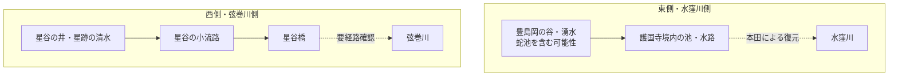

# 護国寺西側・星谷の井と旧水系

更新日: 2026-08-31

護国寺境内の池・豊島岡側の湧水系を調べる過程で、**護国寺西側にも別の湧水・小流路があったことを示す史料**が見つかった。

これは東側の「豊島岡墓地―護国寺境内―水窪川」系とは分けて扱うべきで、弦巻川側の支流・湧水系を考える材料になる。

関連する主ノート:
- [護国寺境内の旧水系調査](./護国寺境内の旧水系.md)
- [『江戸名所図会』からみた護国寺・弦巻川・境内水系](./江戸名所図会・護国寺図の検討.md)

---

## 1. 『江戸名所図会』に「星谷の井旧地」が独立項目として存在する

『江戸名所図会』第12冊（巻之四 天権之部）では、護国寺関係の連続図の直後に **「星谷の井旧地」** が独立項目として収録されている。

国立国会図書館画像への索引では、護国寺周辺は次の順に並ぶ。

- 4-12-39 「大塚 護持院」
- 4-12-40 「其二 護国寺」
- 4-12-41 「其三 本浄寺」
- 4-12-42～44 「護国寺境内 西国札所写三十三所観音の図」
- 4-12-45 「星谷の井旧地」

この並びからも、星谷の井が護国寺・本浄寺周辺の地誌として扱われていることが分かる。

参考:
- https://www.benricho.org/Unchiku/Ukiyoe_NIshikie/edo-meisyozue/12.html
- 国会図書館デジタルコレクション該当齣: `info:ndljp/pid/2563391/45`（索引から確認。画像の直接精査は今後）

---

## 2. 星谷の井は「旱魃にも枯れない湧水」と伝えられる

『江戸名所図会』を読解した地域史ページでは、護国寺西側の谷を**星谷（ほしやと）**とし、本浄寺裏の「星産」と呼ばれた塚の傍らに **星谷の井** があったと説明している。

同資料によると、星谷の井は**旱魃にも枯れない湧水**として伝えられたが、『江戸名所図会』成立期にはすでに埋まり、わずかに痕跡を残す状態だったという。

さらに重要なのは、**湧水の下流に「星谷橋」が架かっていた**という記述である。

この組み合わせは、井戸状の一点の湧水だけではなく、

のような、**湧水から下流へ流れる小水路**が存在したことを示唆する。

ただし、星谷橋から弦巻川本流までの正確な流路は、現時点では原図上で連続確認できていない。

---

## 3. 2021年のウェブアーカイブでも同じ記述を確認

地域史ページ「『江戸名所図会』の大塚・雑司ヶ谷を歩く」は現在も閲覧できるが、Wayback Machine にも **2021-09-27** の保存版がある。

保存版では、護国寺西側について次の情報を確認できる。

- 首都高速5号池袋線が通る谷を「星谷」とする。
- 本浄寺裏に星谷の井があったとする。
- 旱魃にも枯れない湧水だったとする。
- 『江戸名所図会』の頃には埋没していたとする。
- 湧水の下流に星谷橋があったとする。
- 同じページは、この谷を現在の弦巻川跡へつながる地形として扱っている。

Wayback 保存版:
- https://web.archive.org/web/20210927014050id_/https://ma-maison.sakura.ne.jp/hill/meishozue/zue_otsuka.html

現行ページ:
- https://ma-maison.sakura.ne.jp/hill/meishozue/zue_otsuka.html

二次資料なので、最終的には『江戸名所図会』原文・挿図へ戻って確認する。

---

## 4. 豊島区の地域資料にも「星跡の清水／星谷の井」が現れる

豊島区の地域資料（まちづくりニュースの公開PDF）にも、護国寺裏門付近の窪地に **「星跡の清水」または「星谷の井」** と呼ばれた井があり、旱魃時にも水が涸れなかったという記述がある。

そこでは、後年に村民の馬が井へ落ちて死んだため、井が埋められ放置されたという伝承も紹介されている。

この伝承部分は近世当時の一次記録ではないため、そのまま事実認定はできない。しかし、別系統の地域資料でも同じ名称・「枯れない水」という性格が伝承されている点は注目できる。

参考:
- 豊島区地域資料（ADEAC公開PDF）
- https://adeac.jp/viewitem/toshima-history/viewer/viewer/08_50_H101100/data/08_50_H101100.pdf

---

## 5. 東側の護国寺境内水系と混同しない

護国寺周辺には、少なくとも現在の調査上、二つの水系を区別した方がよい。

東側は豊島岡から護国寺へ谷地形が連続することを宮内庁調査で確認できる。一方、西側には『江戸名所図会』が「星谷の井旧地」を独立項目として取り上げる。

つまり、護国寺は単に水窪川本流の脇にある寺ではなく、**東西の谷・崖線から複数の湧水を受ける場所だった可能性**がある。

これは、音羽谷全体で水窪川と弦巻川が東西両端を流れるようになった理由を考える際にも重要である。

---

## 6. 2026-08-31追補：星谷橋を「護国寺南西端の橋」と同定しない

『江戸名所図会』40～41齣を高精細画像で接続して確認すると、護国寺南西～本浄寺東側には弦巻川本流とみられる蛇行河道がかなり明瞭に描かれる。一方、本文上の**星谷橋**は「星谷の井」の湧水から下流へ続く水の上に架かる橋として現れる。

このため、以前候補として考えた、

> 星谷橋 ＝ 護国寺南西端で弦巻川本流を渡る橋

という同定は、現段階では根拠不足とする。

むしろ、

のように、**星谷橋は弦巻川へ入る支流・小流路側の橋だった可能性**を優先して検討する。

ただし、星谷橋そのものの位置は未確定であり、弦巻川本流上にあった可能性を完全に排除したわけではない。

### 護国寺南西端の橋について

1851年の近吾堂系切絵図で護国寺南西端に描かれる橋は、図像上は板橋のようにも見える。

1853年の雑司ヶ谷村関係資料では **弦巻橋が板橋**、松屋橋・境橋などが石橋として紹介されているため、**護国寺南西端の橋＝弦巻橋**という仮説は検討価値がある。

しかし、切絵図の橋記号が材質を忠実に示すか、1853年の橋梁一覧の列挙順と各橋の位置がどう対応するかをまだ確認できていないため、橋名は未確定とする。

詳細は [『江戸名所図会』からみた護国寺・弦巻川・境内水系](./江戸名所図会・護国寺図の検討.md) を参照。

---

## 7. 未解決点

1. 『江戸名所図会』4-12-45の原文を高精細画像で読み、星谷の井・星谷橋の記述を逐字確認する。
2. 星谷橋の位置を『江戸名所図会』挿図・切絵図・明治実測図で特定する。
3. 星谷の井からの流れが弦巻川へ直接合流していたかを確認する。
4. 本浄寺東側／小篠坂沿いの水路と、1851年切絵図に見える護国寺南西端の弦巻川との接続を検証する。
5. 「星谷の井」「星跡の清水」「星谷橋」が『御府内備考』『礫川要覧』など他の地誌にどう記載されるか確認する。
6. 首都高建設以前の大縮尺地図・航空写真から、谷底の水路敷を追う。
7. 1853年橋梁一覧の原文を確認し、**弦巻橋・松屋橋・境橋・名称不詳石橋**の所在地・材質・列挙順を確定する。

---

## 8. 今回の意味

護国寺境内の川を調べ始めると、東側の蛇池・豊島岡だけを追いたくなる。しかし『江戸名所図会』には、西側にも**枯れにくい湧水と、その下流の橋**が明示される。

現時点の仮説としては、護国寺周辺には、

- 東側：豊島岡―護国寺境内―水窪川系
- 西側：星谷の井―小水路―弦巻川系

という**二つの局地的な湧水ネットワーク**が存在した可能性がある。

「音羽谷の東西に二本の川がある」ことを、単なる人工的な二分水路として見るだけではなく、**もともと東西双方の崖線に湧水・小支谷があったうえで、近世の造成によって流路が整理された**というモデルを検討する価値が出てきた。