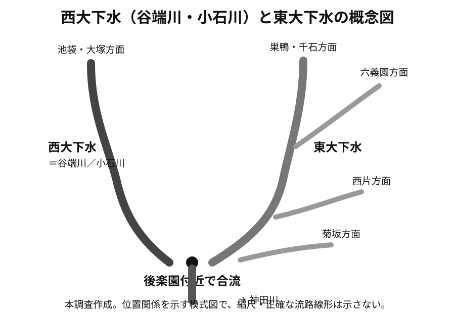

# 谷端川

谷端川について、現在までに確認できた主要事項をまとめる。主要出典は各記述の直後に示し、一覧は [出典一覧](出典一覧.md) にまとめる。

## 水源と流路

豊島区の2000年1月21日付プレス資料は、谷端川を**要町の粟島神社境内にある自然湧水池「弁天池」を水源とし、旧長崎村・滝野川村・巣鴨村を経て小石川村へ通じ、神田川へ合流する延長約11kmの河川**と説明している。〔確認〕  
出典：豊島区広報課「かつて区内を流れていた川筋を辿って 冊子『旧谷端川の橋の跡を探る』」（2000年1月21日） [PDF](https://adeac.jp/viewitem/toshima-history/viewer/viewer/pressH120121/data/pressH120121.pdf) / [S29/S09](出典一覧.md)

大塚以南で「小石川」「礫川」などの名が使われ、資料・地域によって「氷川」の呼称も見られることは、『失われた川を歩く 東京「暗渠」散歩 改訂版』などの二次資料に整理されている。〔書籍資料〕  
出典：本田創編著『失われた川を歩く 東京「暗渠」散歩 改訂版』実業之日本社、2021年。[出版社書誌](https://www.j-n.co.jp/books/978-4-408-33965-8/) / [B01](出典一覧.md)

## 西大下水＝谷端川・小石川と東大下水

小石川下流部を調べる際は、谷端川だけでなく**東大下水（ひがしおおげすい）**を別系統として扱う必要がある。

暗渠・旧水路の現地調査サイト「水の行方を追って」は、本郷台地西側を流れる谷端川（小石川）が俗に**西大下水（にしおおげすい）**と呼ばれ、その東側を流れて現在の東京ドーム付近へ向かう別水路が**東大下水**と呼ばれた、と整理している。東大下水については、巣鴨・千石方面、六義園方面、西片方面、菊坂方面などからの複数の流れを集め、後楽園へ流入する水系として説明される。〔二次資料／現地調査〕  
出典：「水の行方を追って」[「東大下水（ひがしおおげすい）―誤解を招く現代用語との意味の違い―」](https://wanjin.blog.fc2.com/blog-entry-26.html) / [S41](出典一覧.md)

別の旧河道調査「谷端川の跡を歩く」でも、小石川下流で谷端川を「小石川大下水」「西大下水」とし、東大下水との合流後に後楽園内へ進むという関係が整理されている。〔二次資料／現地調査〕  
出典：[「文京区千石編1」](https://warpal.sakura.ne.jp/river-yabata/b-koishi4/koishi4.htm) / [S42](出典一覧.md)

  

本調査作成の模式図。位置関係の理解用であり、縮尺・正確な河道線形を示すものではない。

### 1912年『東京市及接続郡部地籍地図』での確認

東京市区調査会『東京市及接続郡部地籍地図』上巻（1912）は、国立国会図書館デジタルコレクションでインターネット公開されている（PID 966079、PDM）。小石川区は504コマから始まる。〔一次史料〕  
原資料：[国立国会図書館デジタルコレクション](https://dl.ndl.go.jp/pid/966079) / [S43](出典一覧.md)

2026年9月、本調査で小石川区の地籍図をコマごとに確認した。現時点の観察メモは次のとおり。〔本調査による画像観察〕

- 512コマ：谷端川が後楽園へ入る前の区間を確認。
- 513コマ：後楽園内から合流部付近までの水路を確認。
- 514コマ：初音町付近の谷端川。ここからは図面上端が北とは限らないため方位に注意。
- 515コマ：そのやや上流側の谷端川。
- 516コマ：掃除町付近の谷端川。
- 519コマ：戸崎町付近の谷端川。
- 526コマ：小石川植物園南側の谷端川。
- 528コマ：植物園北側に、谷端川本流とは別の水路らしい描写を確認。

当初、528コマ付近から見える別水路を「谷端川の支流」とだけ捉えていたが、後世の地形図・既往の暗渠調査と照合すると、**東大下水系の流路を見ている可能性が高い**。ただし、1912年図上で東大下水の全線・各支流・西大下水との合流点をまだ連続してトレースし終えていないため、各コマの水路を機械的にすべて東大下水へ帰属させない。

また、1917～1928年頃の地形図を用いた「東京時層地図」の表示でも、指ヶ谷町・丸山方面の低地に明瞭な水路が確認でき、本調査で1912年地籍図から見出した別水路が単なる筆界表現ではなく、実在水路だった可能性を補強する。ただし「東京時層地図」は複数年代・縮尺の図を組み合わせた閲覧サービスなので、厳密な年代確認には元の地形図を用いる。

### 「水の行方を追って」の流路図について

同サイトには東大下水・西大下水の関係を地形陰影上に示した流路図が掲載されており、本調査でも位置関係の理解に有用だった。ただし、同サイトは流路地図について**第三者への提供・共有を想定していない**旨を明記しているため、このリポジトリでは元画像・スクリーンショットを転載しない。掲載元へのリンクを残し、上の概念図は本調査で独自に作成した。  
掲載元：[「東大下水（ひがしおおげすい）―誤解を招く現代用語との意味の違い―」](https://wanjin.blog.fc2.com/blog-entry-26.html)

## 千川上水からの分水

谷端川は千川上水から実際に分水を受けていた。練馬わがまち資料館は、要町3丁目付近から南東へ分かれる**「長崎村外三村分水」**が、粟島神社の池を水源とする谷端川へ接続していたことを説明し、明治10年（1877）の「千川用水組合村樋口伏替願」に「長崎村、中丸村、池袋村、金井窪村四ケ村用水」と記されることも紹介している。〔確認〕  
出典：練馬わがまち資料館 [「千川上水の分水を訪ねて（2）」](https://www.nerima-archives.jp/column/3572/) / [S11](出典一覧.md)

この「千川用水組合村々樋口伏替願」は、国立国会図書館サーチで**1877年（明治10）7月6日付の現存古文書**として書誌を確認できる。提出者は15か村の村役人・惣代、水路見守人の千川善蔵、第八大区七小区戸長の岩佐満房、宛先は東京府知事・楠本正隆で、原本は杉並区立郷土博物館所蔵の星野家文書に含まれ、杉並区指定有形文化財（古文書）となっている。〔原史料書誌確認〕  
したがって、四ケ村用水という呼称を伝える練馬わがまち資料館の記事は、少なくとも資料の存在・年代・行政文書としての性格について独立した公的書誌で裏付けられる。ただし、NDLサーチでは原文画像は公開されていないため、**「長崎村、中丸村、池袋村、金井窪村四ケ村用水」という本文の文言自体は引き続き練馬わがまち資料館の転記による確認**として区別する。〔確認／注意〕  
出典：国立国会図書館サーチ [『千川用水組合村々樋口伏替願』](https://ndlsearch.ndl.go.jp/books/R100000094-I1542114)（1877年7月6日、杉並区立郷土博物館原本所蔵）

分水の開始時期については、深田伊佐夫「千川上水における流域環境の変化と宗教的構築物について」（『中央学術研究所紀要』42、2013年、pp.158–180）が、先行研究をもとに千川上水の用途変化を整理し、**宝永4年（1707）に流域20か村の嘆願によって灌漑利用が認められ、その時期に自然河川である谷端川・石神井川への分水が開削された**としている。〔学術論文による既存仮説の補強〕  
これは、1877年文書で確実に存在する長崎村外三村分水を、少なくとも研究史上は1707年の灌漑利用開始期まで遡らせる根拠になる。ただし同論文の1707年記述は大石ら（2006）、大松騏一（1996）、豊島区郷土資料館（1992）、千川の会（1982）等を基礎にした整理であり、**1707年当時の谷端川分水口の位置や工事内容を記す一次史料を本調査で直接確認したわけではない**。したがって「現在の要町3-45付近の分水口が1707年にそのまま開削された」とは断定しない。〔確認／推定範囲の限定〕  
出典：深田伊佐夫「千川上水における流域環境の変化と宗教的構築物について」『中央学術研究所紀要』42、2013年、pp.158–180。[中央学術研究所書誌](https://www.cari.ne.jp/search/detail/paper/id/648) / 補助確認：[日本宗教学会『宗教研究』87巻別冊](https://jpars.org/journal/bulletin/backnumber/vol_87.pdf)

安永9年（1780）の史料**「千川素堀筋普請所積見分」**について、地域史調査記事に掲げられた転記には、長崎村分水口の上流側に**「長崎悪水吐潜樋　長六間」**、その付近に**「往来道ニ石橋有」**とする記述があり、その後に長崎村分水口が記録される。〔二次転記による史料内容の確認〕  
これは、18世紀後半の長崎村分水付近が単なる取水口だけではなく、**悪水を上水路の下へ通す潜樋と往来道の石橋を伴う交差施設群だった可能性**を示し、分水口周辺の位置復元に使える新しい手掛かりになる。一方、転記記事自身が距離解釈に矛盾の可能性を指摘しており、各「○間目」がどの地点を起点とするかは未確定である。また本調査では原史料画像を直接確認していないため、分水口寸法の読取りや絶対位置は断定しない。〔観察／位置具体化の手掛かり／要原典照合〕  
出典：地域史調査記事 [「千川親水公園」](https://ameblo.jp/kazuaruki/entry-12940933918.html)（「千川素堀筋普請所積見分」安永9年・1780年の該当部を転記） / 関連史料集の書誌確認：豊島区立郷土資料館編『千川上水関係史料集 1』豊島区教育委員会、1995年3月、146p（[国立国会図書館サーチ](https://ndlsearch.ndl.go.jp/books/R100000002-I000002419137)）。ただし、今回の転記箇所が同史料集の何頁に収録されるかは未確認。

したがって、現在は次のように区別する。

- 千川上水 → 谷端川：〔確認〕
- 千川上水 → 弦巻川：〔未確認〕
- 千川上水 → 水窪川：〔未確認〕

弦巻川・水窪川への直接分水を主張するには、取水口・樋・分水路・管理文書などの具体的な証拠が必要である。

## 近代の利用と改修

豊島区史年表には、明治28年（1895）4月23日、小石川区掃除町23の宇野伊兵衛が**巣鴨村大字巣鴨字新田928の谷端川に新規水車を設立するため願い出たが、不許可となった**記録がある。したがって、これは「水車が存在した」記録ではなく、具体的な水力利用計画があった記録として扱う。〔確認〕  
出典：豊島区史年表（ADEAC）[「谷端川」検索結果](https://adeac.jp/toshima-history/detailed-search?mode=timeline&word=%E8%B0%B7%E7%AB%AF%E5%B7%9D) / [S34](出典一覧.md)

谷端川の改修・暗渠化は一度に完了したのではなく、下流部から段階的に進んだ。河川廃止後の暗渠上部については、豊島区公式の南・北緑道ページが、その後の公共空間化の年代を具体的に記録している。

### 河川廃止後の暗渠上部

豊島区公式「谷端川南緑道」は、谷端川が**1962年（昭和37）に河川として廃止され、暗渠の下水道幹線として使用されるようになった**とし、南側では1966年に第1～第3児童遊園、1967年に第4児童遊園、1980年に遊歩道として開放され、1983年からの改修を経て1990年に現在の南緑道整備が終了したと説明する。〔確認〕  
出典：豊島区公式 [「谷端川南緑道」](https://www.city.toshima.lg.jp/340/shisetsu/koen/033.html) / [S35](出典一覧.md)

北側は、豊島区公式「谷端川北緑道」によれば、1971年に谷端川第5児童遊園・遊歩道として開放され、1990年に施設改修が行われた。〔確認〕  
出典：豊島区公式 [「谷端川北緑道」](https://www.city.toshima.lg.jp/340/shisetsu/koen/042.html) / [S36](出典一覧.md)

これらの**上部利用開始年は、暗渠内部の工事完了年そのものとは別**に扱う。

## 池袋モンパルナスとの関係

豊島区公式「池袋モンパルナスとよばれたまち」は、池袋モンパルナス関連地の一つとして**「谷端川アトリエ群跡」（西池袋4丁目28付近）**を挙げている。〔確認〕  
出典：豊島区公式 [「池袋モンパルナスとよばれたまち」](https://www.city.toshima.lg.jp/129/miryoku/shiru/bunka/montparnasse.html) / [S12](出典一覧.md)

旧河川沿いの低地と、アトリエ村・町工場・鉄道などの土地利用を重ねると、谷端川は単なる水路史だけでなく、池袋周辺の都市形成を読む軸にもなる。ただし、個々のアトリエが谷端川の存在によって立地したと因果関係まで断定するには、別の資料が必要である。

## 小石川の印刷工場と谷端川（千川）

播磨坂下・現在の共同印刷本社周辺は、谷端川下流域の近代的な水利用と工業立地を考えるうえで重要な地点である。

共同印刷の公式沿革によれば、前身の博文館印刷工場は1897年に京橋区竹川町（現・銀座6丁目）で創業し、**1898年に小石川区久堅町（現・共同印刷本社所在地）へ工場を移転**、合資会社博進社印刷工場へ改称した。〔確認〕  
出典：共同印刷『CORPORATE PROFILE 2024』[PDF](https://www.kyodoprinting.co.jp/company-profile/pdf/profile2024.pdf) / [S44](出典一覧.md)

この移転と川との関係について、文京区の地域誌『MITAMIYO!!』Vol.1に掲載された共同印刷取材記事は、**印刷には大量の水が必要で川沿いが都合よく、現在の千川通りにあたる場所を流れていた「千川」の水を印刷に使っていた**と説明している。記事は共同印刷への取材をもとにした後世の地域誌であり、1898年当時の取水設備図や契約文書そのものではないが、工場立地と河川水利用の関係を直接述べる資料として重要である。〔取材記事による確認／一次史料未確認〕  
出典：『MITAMIYO!!』Vol.1「共同印刷」[Web版](https://mitamiyo.net/%E6%98%94%E3%82%82%E4%BB%8A%E3%82%82%E5%85%B1%E3%81%AB%E5%8A%9B%E3%82%92%E5%90%88%E3%82%8F%E3%81%9B%E3%81%A6%E5%8D%B0%E5%88%B7%E3%81%99%E3%82%8B%E4%BC%9A%E7%A4%BE/) / [PDF](https://www.colomaga.jp/wp/wp-content/uploads/2025/02/mitamiyo_vol1-1.pdf) / [S45](出典一覧.md)

ここでいう「千川」は、上流の豊島区側で「谷端川」、小石川側で「千川」「小石川」など複数の呼称が使われてきた同一水系の下流部として扱う。ただし、**共同印刷がどの地点から、どのような設備で、どの程度の水量を取水していたかは現時点で未確認**である。したがって「谷端川の存在が1898年の移転先選定の理由の一つだった」ことは取材記事から支持される一方、具体的な取水口や利用期間は別途史料で確認する必要がある。

### 旧小石川工場跡地と現在の街区

共同印刷の小石川拠点は長く「本社・小石川工場」として使われたが、本社建替えに伴って土地利用が大きく変わった。共同印刷は2019年、本社社屋建替えによって現有敷地内に生じる「活用可能な土地」を更地とし、定期借地権を設定する方針を公表した。2022年には日鉄興和不動産との一般定期借地権設定契約を締結し、対象地を**小石川4丁目70番17号、12,487.08㎡、契約期間2022年6月1日～2097年7月31日**としている。〔確認〕  
出典：共同印刷「本社土地活用に関する基本協定書締結」（2019年7月24日）[PDF](https://www.kyodoprinting.co.jp/release/2019/ir_info_20190724-1700.pdf)、共同印刷『第143期 有価証券報告書』[PDF](https://www.kyodoprinting.co.jp/release/2023/ir143_yuho.pdf) / [S46](出典一覧.md)

共同印刷は2024年のニュースリリースで、現在建設中の**「リビオシティ文京小石川」を「当社の旧社屋跡地を活用」した開発**と明記している。したがって、播磨坂下で現在見える共同印刷新本社と大規模マンション建設地は、旧小石川工場・社屋の広い敷地が再編された結果として読むことができる。〔確認〕  
出典：共同印刷「文京区で開発中の大規模マンション『リビオシティ文京小石川』において…」（2024年3月13日）[Web](https://www.kyodoprinting.co.jp/release/2024/20240313-8685.html) / [S46](出典一覧.md)

### 光圓寺との位置関係

共同印刷本社の北西側には現在も浄土宗**光圓寺（文京区小石川4-12-8）**があり、同寺の沿革ページは現在の境内について「2,300余坪」と記している。〔寺院公式資料〕  
出典：光圓寺「光圓寺の沿革」https://kouenji.site/history/ / [S47](出典一覧.md)

古地図でこの一帯に「光圓寺」の大きな表記が見える場合でも、**地図上の寺名ラベルの位置だけから、後の共同印刷敷地全体が旧光圓寺境内・寺領だったと判断することはできない**。寺域・地番の変遷を確認するには、年代の確定した地籍図・公図・土地台帳を重ねる必要がある。特に1898年の博進社移転時点で、どの地番を取得・借用したのかは未確認である。

## 現在の下水道幹線

谷端川の名を引き継ぐ下水道幹線は、現在も都市基盤・浸水対策の一部として使われている。

2001年の東京都議会公営企業委員会では、**谷端川一号幹線**について、西池袋5丁目地先～池袋4丁目地先の約1,600mを利用して約32,000tを暫定貯留する計画が説明されている。〔確認〕  
出典：東京都議会 [平成13年公営企業委員会速記録第三号](https://www.gikai.metro.tokyo.lg.jp/record/public-enterprise/2001-03.html) / [S39](出典一覧.md)

同年7月31日の豊島副都心開発調査特別委員会資料「**谷端川一号幹線の一部完了について（報告）**」には、流域と過去の主な浸水箇所に重ねて、**谷端川幹線（既設）・谷端川一号幹線（今回施工）・同（将来計画）を線種別に描いた平面図**が残る。山手通り・川越街道・環七・旧中山道・明治通り・池袋駅・石神井川などとの位置関係を同一図上で確認できるため、2001年時点の新旧幹線配置と浸水対策対象を具体的に位置合わせする基準資料になる。〔公的図面確認／観察〕  
下段の「雨水貯水のしくみ」断面図は、谷端川一号幹線を地表から**図上約28～33mの深部**に置き、地下鉄池袋駅の地下構造物との位置関係や排水ポンプを模式的に示す。これは一号幹線が単なる旧河道覆蓋ではなく、池袋駅周辺の地下構造物を避けながら深部に新設された貯留・排水施設であることを視覚的に補強する。ただし模式図の深さを全線共通の施工深度とはみなさず、平面図の「過去の主な浸水箇所」も個々の浸水年月・件数を示さないため、地点別の災害記録とは区別する。〔観察／注意〕  
出典：豊島副都心開発調査特別委員会 資料1（平成13年7月31日、土木部道路整備課）[「谷端川一号幹線の一部完了について（報告）」](https://adeac.jp/viewitem/toshima-history/viewer/viewer/13_H130731_15/data/13_H130731_15.pdf)

2016年の東京都議会資料では、下板橋駅付近で**谷端川幹線が道路整備と干渉し、移設方法を協議していた**ことが確認できる。〔確認〕  
出典：東京都議会 [平成28年第3回定例会 一般質問](https://www.gikai.metro.tokyo.lg.jp/netreport/2016/report07/4.html) / [S40](出典一覧.md)

これらは現代の下水道施設の資料であり、**現在管路が暗渠化前の自然河道を全区間そのまま踏襲していることを証明するものではない。** 旧河道との一致は下水道台帳・旧版地図で区間ごとに確認する必要がある。

## 古環境研究の候補

谷端川源頭部の更新世後期以降の地形・土地利用を検討する資料として、甲田篤郎・斉藤崇人・辻本崇夫「谷端川水源地付近における更新世後期以降の環境変遷と土地利用」がある。  
CiNii Research：https://cir.nii.ac.jp/crid/1520295049406774016

この研究は、谷端川源頭側の古環境・地層を、弦巻川・水窪川側との旧河道接続仮説と照合する候補資料である。現時点では本文精査前なので、旧河道の流向を直接支持する資料としては扱わない。

## 未解決

- 谷端川源頭部の更新世後期以降の地形・古環境を、発掘調査・古環境研究からどこまで復元できるか。
- 弦巻川・水窪川側の浅い谷と谷端川側の谷がつながっていた時期、その際の流向。
- **1912年地籍図上で東大下水本流・各支流・西大下水との合流点を連続して確定できるか。**
- **東大下水の各支流の歴史的名称・成立時期を一次史料で確認できるか。**
- 暗渠化・下水道化の区間別工期と、緑道整備時期の対応。
- 旧橋・鉄道横断構造物・工場・アトリエ群を旧河道と精密に位置合わせできるか。
- **1898年の博進社（後の共同印刷）移転時の地番・取水口・取水設備・利用水量を一次史料で確認できるか。**
- **光圓寺の旧境内・寺領と、共同印刷旧小石川工場敷地の境界変遷を地籍図・公図・土地台帳から復元できるか。**

## 主な出典

- [出典一覧](出典一覧.md)
- [分割前README全文](分割前README全文.md) — 調査経緯・旧出典番号の保存版。本文の出典代わりにはしない。